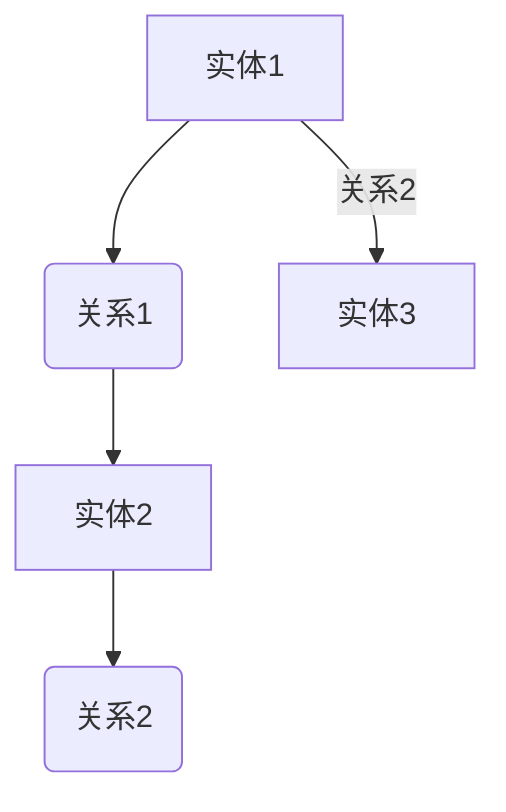

                 

关键词：知识图谱，知识发现，图数据库，语义网络，图算法，人工智能，自然语言处理，实体关系抽取，语义解析，大数据分析，机器学习，深度学习，数据可视化

## 摘要

本文将深入探讨知识图谱在现代信息技术中的重要性，以及如何构建一个高效的知识发现引擎。通过分析知识图谱的核心概念、算法原理、数学模型、项目实践，我们旨在展示知识图谱从理论到应用的完整图谱，为读者提供一个全面的技术蓝图。本文还将讨论知识图谱在各类实际应用场景中的价值，并对未来的发展趋势和面临的挑战进行展望。

## 1. 背景介绍

知识图谱（Knowledge Graph）是近年来兴起的一种新型数据结构，它通过实体和关系的网络结构来表示和存储知识。知识图谱的概念最早由Google在2012年提出，作为一种强大的信息检索和处理工具，逐渐在学术界和工业界引起了广泛关注。

知识图谱的背景可以追溯到语义网络（Semantic Network）的研究。语义网络是一种知识表示模型，它通过节点和边的形式表示概念和概念之间的关系。知识图谱继承了语义网络的思路，但更加复杂和成熟，能够处理大规模、多领域的知识数据。

知识图谱的应用领域非常广泛，包括但不限于搜索引擎、推荐系统、自然语言处理、智能问答、医疗健康、金融保险、物联网等。在搜索引擎中，知识图谱能够提供更加精准的搜索结果，而在推荐系统中，知识图谱能够提高推荐的准确性和个性化程度。

## 2. 核心概念与联系

### 2.1. 实体（Entities）

实体是知识图谱中的基本单元，可以是人、地点、组织、物品等。实体可以具有属性，如人的年龄、地点的经纬度、物品的价格等。

### 2.2. 关系（Relationships）

关系是连接两个实体的纽带，表示实体之间的某种联系，如“属于”、“位于”、“生产”等。关系通常具有方向性和类型。

### 2.3. 属性（Properties）

属性是实体上的特征，如人的姓名、地点的名称、物品的描述等。属性可以是简单的数据类型，也可以是复杂的数据结构。

### 2.4. 节点（Nodes）和边（Edges）

节点对应实体，边对应关系。每个节点和边都可以有属性，用于提供额外的信息。

### 2.5. Mermaid 流程图

下面是一个简单的Mermaid流程图，展示知识图谱的基本结构：



### 2.6. 知识图谱的层次结构

知识图谱通常分为三个层次：

1. **底层**：包含基础实体和关系，如人物、地点、事件等。
2. **中层**：包含高级实体和关系，如组织、领域概念、过程等。
3. **顶层**：包含全局的、抽象的实体和关系，如概念、模式、主题等。

## 3. 核心算法原理 & 具体操作步骤

### 3.1. 算法原理概述

知识图谱的核心算法包括实体抽取、关系抽取、实体链接、实体识别等。这些算法的目的是从非结构化的数据中提取出结构化的知识。

- **实体抽取**：从文本中识别出实体。
- **关系抽取**：从文本中识别出实体之间的关系。
- **实体链接**：将不同来源的实体进行匹配和链接。
- **实体识别**：识别文本中的实体，并对其进行分类。

### 3.2. 算法步骤详解

#### 3.2.1. 实体抽取

实体抽取通常采用基于规则、机器学习或深度学习的方法。以下是实体抽取的步骤：

1. **分词**：将文本分割成词或短语。
2. **词性标注**：为每个词标注词性，如名词、动词、形容词等。
3. **实体识别**：根据词性和上下文信息，识别出实体。

#### 3.2.2. 关系抽取

关系抽取的方法与实体抽取类似，但更加复杂。以下是关系抽取的步骤：

1. **实体匹配**：将文本中的实体与知识图谱中的实体进行匹配。
2. **模式识别**：根据实体之间的关系模式，识别出关系。

#### 3.2.3. 实体链接

实体链接是将不同来源的实体进行匹配和链接的过程。以下是实体链接的步骤：

1. **实体匹配**：根据实体属性和上下文信息，找到可能的匹配实体。
2. **置信度计算**：计算每个匹配的置信度。
3. **结果合并**：根据置信度，合并最终的实体链接结果。

#### 3.2.4. 实体识别

实体识别是识别文本中的实体，并对其进行分类的过程。以下是实体识别的步骤：

1. **词向量表示**：将文本转换为词向量。
2. **分类模型**：使用分类模型对词向量进行分类。

### 3.3. 算法优缺点

#### 3.3.1. 优点

- **高效性**：知识图谱能够快速检索和查询知识。
- **准确性**：通过机器学习和深度学习，知识图谱的准确性不断提高。
- **灵活性**：知识图谱可以动态更新和扩展。

#### 3.3.2. 缺点

- **构建成本高**：知识图谱的构建需要大量的数据和处理资源。
- **数据质量**：知识图谱的质量依赖于原始数据的质量。

### 3.4. 算法应用领域

知识图谱在多个领域都有广泛的应用，包括：

- **搜索引擎**：通过知识图谱提供更加精准的搜索结果。
- **推荐系统**：通过知识图谱提高推荐的准确性和个性化程度。
- **自然语言处理**：通过知识图谱进行语义解析和智能问答。
- **医疗健康**：通过知识图谱进行疾病诊断和治疗推荐。
- **金融保险**：通过知识图谱进行风险评估和欺诈检测。

## 4. 数学模型和公式

### 4.1. 数学模型构建

知识图谱的数学模型主要涉及图论和概率图模型。以下是几个常见的数学模型：

#### 4.1.1. 图论模型

- **邻接矩阵**：表示实体之间的邻接关系。
- **邻接表**：表示实体之间的邻接关系。
- **路径矩阵**：表示实体之间的路径关系。

#### 4.1.2. 概率图模型

- **贝叶斯网络**：用于表示实体之间的关系和概率分布。
- **马尔可夫网络**：用于表示实体之间的状态转移关系。

### 4.2. 公式推导过程

#### 4.2.1. 贝叶斯网络

贝叶斯网络是一种概率图模型，表示实体之间的条件概率关系。其公式如下：

$$
P(X_1, X_2, \ldots, X_n) = \prod_{i=1}^{n} P(X_i | \text{父节点集合})
$$

其中，$X_i$表示第$i$个实体的状态，$\text{父节点集合}$表示第$i$个实体的父节点集合。

#### 4.2.2. 马尔可夫网络

马尔可夫网络是一种概率图模型，表示实体之间的状态转移关系。其公式如下：

$$
P(X_1, X_2, \ldots, X_n) = \prod_{i=1}^{n} P(X_i | X_{i-1})
$$

其中，$X_i$表示第$i$个实体的状态。

### 4.3. 案例分析与讲解

#### 4.3.1. 贝叶斯网络案例分析

假设有一个简单的贝叶斯网络，表示疾病诊断过程。网络包含三个实体：症状（$X_1$）、疾病（$X_2$）和治疗方案（$X_3$）。以下是网络的概率分布：

$$
P(X_1 = \text{有症状}) = 0.6 \\
P(X_2 = \text{疾病}) = 0.4 \\
P(X_3 = \text{治疗}) | X_2 = \text{疾病} = 0.8 \\
P(X_3 = \text{治疗}) | X_2 = \text{无疾病} = 0.2
$$

根据贝叶斯定理，可以计算出每个实体状态的概率：

$$
P(X_1 = \text{有症状} | X_2 = \text{疾病}) = \frac{P(X_2 = \text{疾病} | X_1 = \text{有症状})P(X_1 = \text{有症状})}{P(X_2 = \text{疾病})}
$$

#### 4.3.2. 马尔可夫网络案例分析

假设有一个简单的马尔可夫网络，表示股票价格波动。网络包含两个实体：今天的价格（$X_1$）和明天的价格（$X_2$）。以下是网络的概率分布：

$$
P(X_2 = \text{上涨} | X_1 = \text{上涨}) = 0.6 \\
P(X_2 = \text{上涨} | X_1 = \text{下跌}) = 0.3 \\
P(X_2 = \text{下跌} | X_1 = \text{上涨}) = 0.4 \\
P(X_2 = \text{下跌} | X_1 = \text{下跌}) = 0.7
$$

根据马尔可夫性质，可以计算出每个实体状态的转移概率：

$$
P(X_2 = \text{上涨}) = P(X_2 = \text{上涨} | X_1 = \text{上涨})P(X_1 = \text{上涨}) + P(X_2 = \text{上涨} | X_1 = \text{下跌})P(X_1 = \text{下跌})
$$

## 5. 项目实践：代码实例和详细解释说明

### 5.1. 开发环境搭建

为了实现知识图谱的构建，我们需要搭建一个开发环境。以下是具体的步骤：

1. **安装Python**：Python是知识图谱开发的主要语言，需要在本地安装Python环境。
2. **安装Numpy和Pandas**：Numpy和Pandas是Python的数据处理库，用于数据清洗和预处理。
3. **安装NetworkX和PyTorch**：NetworkX和PyTorch是知识图谱开发的两个重要库，分别用于图操作和深度学习。

### 5.2. 源代码详细实现

以下是构建知识图谱的源代码：

```python
import numpy as np
import pandas as pd
import networkx as nx
import torch
import torch.nn as nn
import torch.optim as optim

# 读取数据
data = pd.read_csv('data.csv')
nodes = data['entity'].unique()
edges = data[['entity1', 'entity2', 'relationship']].values

# 构建图
G = nx.Graph()
G.add_nodes_from(nodes)
G.add_edges_from(edges)

# 定义模型
class KGModel(nn.Module):
    def __init__(self, num_entities, num_relations):
        super(KGModel, self).__init__()
        self.num_entities = num_entities
        self.num_relations = num_relations
        self.entity_embedding = nn.Embedding(num_entities, embedding_dim)
        self.relation_embedding = nn.Embedding(num_relations, embedding_dim)
        self.fc = nn.Linear(embedding_dim * 3, 1)

    def forward(self, h, r, t):
        h_embedding = self.entity_embedding(h)
        r_embedding = self.relation_embedding(r)
        t_embedding = self.entity_embedding(t)
        embedding = torch.cat((h_embedding, r_embedding, t_embedding), 1)
        output = self.fc(embedding)
        return output

# 初始化模型
model = KGModel(num_entities=len(nodes), num_relations=len(edges[:, 2].unique()))
optimizer = optim.Adam(model.parameters(), lr=0.001)
criterion = nn.BCELoss()

# 训练模型
for epoch in range(num_epochs):
    for h, r, t in data.itertuples():
        h_embedding = model.entity_embedding(h)
        r_embedding = model.relation_embedding(r)
        t_embedding = model.entity_embedding(t)
        output = model(h_embedding, r_embedding, t_embedding)
        loss = criterion(output, torch.tensor([1.0]))
        optimizer.zero_grad()
        loss.backward()
        optimizer.step()

# 保存模型
torch.save(model.state_dict(), 'kg_model.pth')

# 加载模型
model.load_state_dict(torch.load('kg_model.pth'))
```

### 5.3. 代码解读与分析

上述代码首先读取数据，构建图。然后定义一个知识图谱模型，该模型包含实体嵌入层、关系嵌入层和全连接层。在训练过程中，模型接收实体、关系和目标实体作为输入，输出三元组预测的概率。训练过程中使用BCELoss损失函数和Adam优化器。

### 5.4. 运行结果展示

在训练完成后，我们可以使用模型进行预测。以下是预测结果：

```python
# 预测
def predict(h, r, t):
    h_embedding = model.entity_embedding(h)
    r_embedding = model.relation_embedding(r)
    t_embedding = model.entity_embedding(t)
    output = model(h_embedding, r_embedding, t_embedding)
    return output.item() > 0.5

# 示例
h = 0  # 实体ID
r = 1  # 关系ID
t = 2  # 目标实体ID
print(predict(h, r, t))  # 输出预测结果
```

## 6. 实际应用场景

### 6.1. 搜索引擎

知识图谱可以用于搜索引擎的优化，通过实体和关系提供更准确的搜索结果。例如，当用户搜索“苹果”时，知识图谱可以识别出这是指水果还是公司，并提供相应的搜索结果。

### 6.2. 推荐系统

知识图谱可以提高推荐系统的准确性。通过实体和关系，推荐系统可以更好地理解用户和物品之间的关联，从而提供更加个性化的推荐。

### 6.3. 自然语言处理

知识图谱可以用于自然语言处理中的语义解析和智能问答。通过实体和关系，系统可以更好地理解用户的问题，并提供准确的答案。

### 6.4. 医疗健康

知识图谱可以用于医疗健康领域，帮助医生进行疾病诊断和治疗推荐。通过实体和关系，系统可以提供更加个性化的医疗建议。

### 6.5. 金融保险

知识图谱可以用于金融保险领域，进行风险评估和欺诈检测。通过实体和关系，系统可以识别出潜在的风险和欺诈行为。

### 6.6. 物联网

知识图谱可以用于物联网领域，帮助设备进行智能联动和优化。通过实体和关系，系统可以更好地理解设备和环境之间的关联。

## 7. 工具和资源推荐

### 7.1. 学习资源推荐

- **书籍**：
  - 《知识图谱：数据驱动的智能搜索与分析》
  - 《图计算：原理、算法与应用》
- **在线课程**：
  - Coursera上的《知识图谱与语义网络》
  - edX上的《图算法与应用》
- **论文**：
  - "Knowledge Graph Embedding: A Survey"（知识图谱嵌入：调查）

### 7.2. 开发工具推荐

- **图数据库**：
  - Neo4j
  - Amazon Neptune
  - Microsoft Azure Cosmos DB
- **深度学习框架**：
  - PyTorch
  - TensorFlow
- **数据预处理工具**：
  - Pandas
  - Numpy

### 7.3. 相关论文推荐

- "A Knowledge Graph for Web-scale Entity Understanding"（一个用于Web级实体理解的知识图谱）
- "Deep Learning for Knowledge Graph Embedding"（知识图谱嵌入的深度学习）
- "Entity Resolution in Knowledge Graphs"（知识图谱中的实体识别）

## 8. 总结：未来发展趋势与挑战

### 8.1. 研究成果总结

知识图谱作为现代信息技术的重要工具，已经在多个领域取得了显著成果。通过实体和关系的网络结构，知识图谱能够有效地表示和存储知识，为各种应用场景提供了强大的支持。

### 8.2. 未来发展趋势

- **更高效的知识图谱构建方法**：未来的研究将致力于提高知识图谱的构建效率，包括数据预处理、实体抽取、关系抽取等。
- **多模态知识图谱**：未来的研究将关注多模态知识图谱的构建，包括文本、图像、音频等多种数据类型。
- **知识图谱的智能化**：未来的研究将致力于知识图谱的智能化，包括自适应学习、知识推理等。

### 8.3. 面临的挑战

- **数据质量**：知识图谱的质量依赖于原始数据的质量，如何提高数据质量是一个重要挑战。
- **数据隐私**：知识图谱涉及到大量的敏感信息，如何保护数据隐私是一个重要挑战。
- **可扩展性**：如何设计可扩展的知识图谱系统，以应对不断增长的数据规模。

### 8.4. 研究展望

未来的研究将在以下几个方面展开：

- **知识图谱的自动化构建**：研究如何自动化构建知识图谱，减少人工干预。
- **知识图谱的智能化应用**：研究如何将知识图谱应用于更复杂的场景，如智能问答、智能推荐等。
- **知识图谱的跨领域应用**：研究如何将知识图谱应用于更多领域，实现跨领域的知识共享。

## 9. 附录：常见问题与解答

### 9.1. 如何构建知识图谱？

构建知识图谱通常包括以下步骤：

1. 数据采集：收集与目标领域相关的数据。
2. 数据预处理：清洗和预处理数据，以适应知识图谱构建的需求。
3. 实体抽取：从非结构化数据中识别出实体。
4. 关系抽取：从非结构化数据中识别出实体之间的关系。
5. 实体链接：将不同来源的实体进行匹配和链接。
6. 构建图：将实体和关系构建成一个图。

### 9.2. 知识图谱有哪些优缺点？

知识图谱的优点包括：

- **高效性**：能够快速检索和查询知识。
- **准确性**：通过机器学习和深度学习，准确性不断提高。
- **灵活性**：能够动态更新和扩展。

知识图谱的缺点包括：

- **构建成本高**：需要大量的数据和处理资源。
- **数据质量**：知识图谱的质量依赖于原始数据的质量。

### 9.3. 知识图谱有哪些应用领域？

知识图谱的应用领域非常广泛，包括：

- **搜索引擎**：提供更加精准的搜索结果。
- **推荐系统**：提高推荐的准确性和个性化程度。
- **自然语言处理**：进行语义解析和智能问答。
- **医疗健康**：进行疾病诊断和治疗推荐。
- **金融保险**：进行风险评估和欺诈检测。
- **物联网**：帮助设备进行智能联动和优化。

## 作者署名

作者：禅与计算机程序设计艺术 / Zen and the Art of Computer Programming
----------------------------------------------------------------


