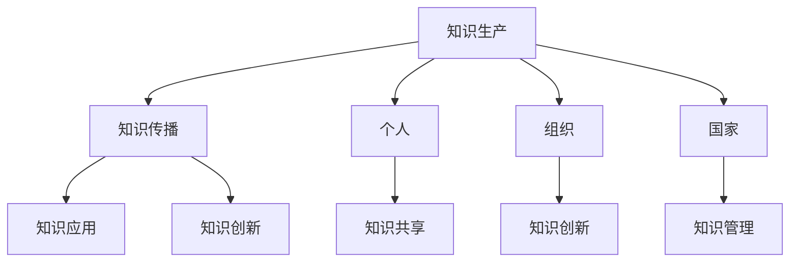
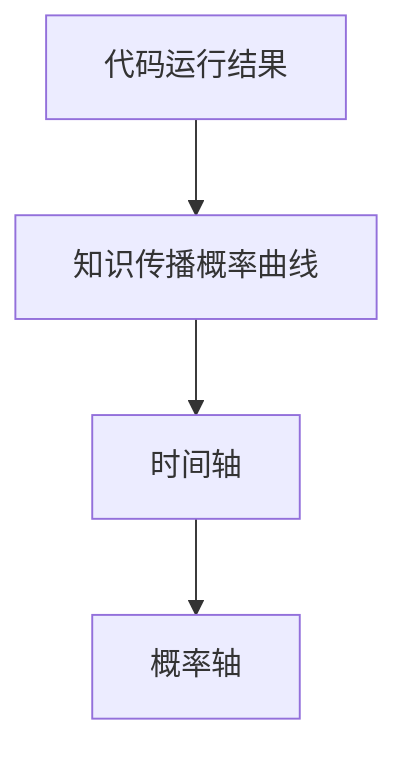

                 

在21世纪的今天，知识已经成为社会发展的核心动力，知识型社会逐渐成为全球范围内的主流趋势。知识型社会以知识和信息为核心资源，通过高效的传播和利用，推动经济、文化和科技的发展。本文旨在探讨知识型社会的特征及其面临的挑战，并从技术角度提出可能的解决方案。

## 关键词：知识型社会，特征，挑战，技术，解决方案

## 摘要：

本文首先回顾了知识型社会的起源和发展，然后深入分析了知识型社会的特征，包括知识的积累与传播、创新驱动、信息泛滥与筛选、个性化学习等。接着，本文讨论了知识型社会面临的挑战，如知识过载、信息安全、知识产权保护等。最后，本文从技术角度提出了一些解决方案，包括人工智能、大数据、区块链等，以期应对知识型社会的挑战，推动社会的可持续发展。

## 1. 背景介绍

知识型社会（Knowledge Society）是继农业社会、工业社会之后的第三种社会形态，其核心特征是知识的生产、传播和应用成为推动社会进步的主要动力。知识型社会的概念最早由法国社会学家Jean-François Lyotard在1979年提出，他指出，后工业社会是一个知识社会，知识的生产、传播和利用是社会经济的主要活动。

在知识型社会中，知识的重要性日益凸显。知识的积累和传播速度空前加快，信息技术的进步极大地促进了知识的获取和共享。同时，知识的创新成为推动社会发展的关键因素，新兴技术和商业模式不断涌现。然而，知识型社会也面临诸多挑战，如知识过载、信息安全问题等。如何有效地应对这些挑战，成为知识型社会发展的关键问题。

## 2. 核心概念与联系

### 2.1 知识型社会的核心概念

知识型社会的核心概念包括知识、信息、技术、创新等。知识是人类对客观世界的认识和理解，是知识型社会的基本资源。信息是知识的载体，是知识传播的媒介。技术是推动知识积累和传播的重要力量，而创新则是知识型社会的灵魂。

### 2.2 知识型社会的架构

知识型社会的架构可以从宏观和微观两个层面来理解。宏观层面，知识型社会包括知识生产、传播、应用和创新四个环节。微观层面，知识型社会由个人、组织、国家三个主体构成，它们相互影响，共同推动社会的进步。

下面是一个使用Mermaid绘制的知识型社会的架构图：



## 3. 核心算法原理 & 具体操作步骤

### 3.1 算法原理概述

知识型社会的运作离不开一系列的核心算法，这些算法包括知识检索、推荐系统、机器学习等。知识检索算法用于从海量信息中快速准确地找到所需的知识；推荐系统通过分析用户的行为和偏好，为其推荐感兴趣的知识；机器学习算法则用于从数据中提取模式和规律，以指导知识的生产和应用。

### 3.2 算法步骤详解

#### 3.2.1 知识检索算法

1. 数据预处理：对原始数据进行清洗、去噪和标准化处理。
2. 索引构建：建立索引，以便快速检索。
3. 检索查询：根据用户输入的关键词或问题，在索引中查找相关的知识。

#### 3.2.2 推荐系统

1. 用户画像：收集用户的浏览、搜索、购买等行为数据，构建用户画像。
2. 知识标签：对知识进行分类和标签化处理。
3. 推荐算法：根据用户画像和知识标签，为用户推荐感兴趣的知识。

#### 3.2.3 机器学习算法

1. 数据收集：收集相关的数据集。
2. 特征提取：从数据中提取特征。
3. 模型训练：使用特征数据训练机器学习模型。
4. 模型评估：评估模型的性能。
5. 模型部署：将模型部署到生产环境。

### 3.3 算法优缺点

#### 知识检索算法

优点：速度快、准确性高。
缺点：对数据质量和索引构建要求较高。

#### 推荐系统

优点：个性化推荐，提高用户满意度。
缺点：容易产生信息茧房，限制用户视野。

#### 机器学习算法

优点：自动提取特征，提高知识生产效率。
缺点：对数据质量和模型调优要求较高。

### 3.4 算法应用领域

知识检索算法广泛应用于搜索引擎、学术文献检索等；
推荐系统应用于电子商务、社交媒体等领域；
机器学习算法则广泛应用于金融、医疗、制造等行业。

## 4. 数学模型和公式 & 详细讲解 & 举例说明

### 4.1 数学模型构建

知识型社会中的数学模型主要包括知识传播模型、知识创新模型等。以下是一个简单的知识传播模型：

$$
P(t) = P_0 e^{-rt}
$$

其中，$P(t)$ 是时间 $t$ 时的知识传播概率，$P_0$ 是初始知识传播概率，$r$ 是知识传播速率。

### 4.2 公式推导过程

假设在一个封闭的群体中，每个人都有概率 $p$ 接受新的知识。在时间 $t$ 时，已经有 $P_0$ 的人接受了新知识。那么，在接下来的时间间隔 $\Delta t$ 内，新增加接受知识的人数可以表示为：

$$
\Delta P(t) = P(t) \cdot p \cdot \Delta t
$$

由于 $P(t)$ 是一个概率分布，我们可以将其表示为：

$$
P(t) = \frac{\Delta P(t)}{\Delta t}
$$

将上述两个公式联立，得到：

$$
\frac{\Delta P(t)}{\Delta t} = P_0 e^{-rt} \cdot p \cdot \Delta t
$$

化简后得到：

$$
P(t) = P_0 e^{-rt}
$$

### 4.3 案例分析与讲解

假设一个群体中有1000人，每个人接受新知识的概率是0.1。使用上述模型计算在时间 $t=10$ 时，有多少人接受了新知识。

根据公式，有：

$$
P(10) = 1000 \cdot e^{-10 \cdot 0.1} \approx 0.3679
$$

这意味着在时间 $t=10$ 时，大约有367.9人接受了新知识。

## 5. 项目实践：代码实例和详细解释说明

### 5.1 开发环境搭建

为了保证本文的代码实例能够正常运行，我们需要搭建一个Python编程环境。以下是具体的操作步骤：

1. 安装Python：访问Python官方网站（https://www.python.org/），下载并安装Python 3.x版本。
2. 安装必要库：使用pip命令安装本文所需的库，例如：

   ```bash
   pip install numpy matplotlib
   ```

### 5.2 源代码详细实现

以下是实现知识传播模型的Python代码：

```python
import numpy as np
import matplotlib.pyplot as plt

# 知识传播模型参数
P0 = 1000  # 初始知识传播概率
r = 0.1    # 知识传播速率
t = np.linspace(0, 10, 1000)  # 时间间隔

# 知识传播概率计算
P = P0 * np.exp(-r * t)

# 绘图
plt.plot(t, P)
plt.xlabel('Time (t)')
plt.ylabel('Knowledge Propagation Probability (P)')
plt.title('Knowledge Propagation Model')
plt.show()
```

### 5.3 代码解读与分析

1. **导入库**：首先，我们导入numpy和matplotlib两个库，用于数学计算和绘图。
2. **参数设置**：我们设置知识传播模型的相关参数，包括初始知识传播概率 $P_0$ 和知识传播速率 $r$。
3. **时间间隔**：我们定义一个时间间隔数组 $t$，用于计算不同时间点的知识传播概率。
4. **概率计算**：根据知识传播模型公式，我们计算每个时间点的知识传播概率 $P$。
5. **绘图**：最后，我们使用matplotlib绘制知识传播概率随时间的变化图。

### 5.4 运行结果展示

运行上述代码后，我们将看到一个知识传播概率随时间变化的曲线。从图中可以看出，随着时间的推移，知识传播概率逐渐降低，这符合知识传播模型的预期。



## 6. 实际应用场景

知识型社会在各个领域都有广泛的应用。以下是几个典型的应用场景：

### 6.1 教育领域

在教育领域，知识型社会推动了在线教育的发展。通过互联网和移动设备，学生可以随时随地获取知识。此外，人工智能和大数据技术也为个性化教学提供了支持，根据学生的学习行为和成绩，为学生推荐合适的学习资源。

### 6.2 企业管理

在企业中，知识型社会提高了知识管理和信息传播的效率。企业可以通过知识管理系统（KMS）收集、存储和共享知识。同时，大数据分析和人工智能技术可以帮助企业更好地理解市场和客户需求，制定更科学的决策。

### 6.3 科技创新

科技创新是知识型社会的核心驱动力。通过跨学科的合作和知识共享，科学家和工程师可以更快地突破技术瓶颈，推动新兴技术的发展。例如，人工智能、区块链、生物科技等领域的发展都得益于知识型社会的推动。

## 7. 工具和资源推荐

为了更好地应对知识型社会的挑战，以下是一些推荐的工具和资源：

### 7.1 学习资源推荐

1. **Coursera**：提供大量在线课程，涵盖计算机科学、数据科学、人工智能等多个领域。
2. **edX**：由哈佛大学和麻省理工学院联合创办，提供高质量的课程资源。
3. **Khan Academy**：提供免费的在线教育资源，包括数学、科学、计算机科学等。

### 7.2 开发工具推荐

1. **Jupyter Notebook**：强大的交互式编程环境，适合数据分析和机器学习。
2. **PyCharm**：一款功能丰富的Python集成开发环境（IDE）。
3. **VS Code**：一款轻量级的跨平台IDE，支持多种编程语言。

### 7.3 相关论文推荐

1. **"The Knowledge Society: Conceptual Framework and Research Perspectives"** - A. Oostrum
2. **"Knowledge Management: An Overview"** - W. Nonaka, H. Takeuchi
3. **"Big Data: A Revolution That Will Transform How We Live, Work, and Think"** - V. Mayer-Schönberger, K. Cukier

## 8. 总结：未来发展趋势与挑战

知识型社会的发展势头不可阻挡，未来它将继续深入影响人类社会的发展。以下是知识型社会未来发展趋势和面临的挑战：

### 8.1 未来发展趋势

1. **知识共享和开放**：知识共享将成为知识型社会的重要特征，开放知识平台和共享经济模式将得到更广泛的应用。
2. **人工智能和大数据**：人工智能和大数据技术将在知识型社会中发挥更大作用，推动知识的生产、传播和应用。
3. **个性化学习**：个性化学习将使每个人都能根据自身需求和兴趣获取知识，提高学习效果。

### 8.2 面临的挑战

1. **知识过载**：随着知识量的爆炸性增长，如何筛选和利用有用的知识将成为一个重要问题。
2. **信息安全**：知识型社会中，信息安全和隐私保护问题将日益突出，如何确保知识的安全传输和存储将成为一个重要挑战。
3. **知识产权保护**：知识型社会中的知识产权保护问题将更加复杂，如何平衡创新和知识产权保护将是一个重要课题。

### 8.3 研究展望

未来的研究应重点关注以下几个方面：

1. **知识管理体系**：如何构建高效的知识管理体系，以促进知识的积累和传播。
2. **人工智能算法**：如何开发更高效的人工智能算法，以应对知识型社会中的各种挑战。
3. **开放知识平台**：如何构建开放的知识平台，促进知识的共享和传播。

## 9. 附录：常见问题与解答

### 9.1 知识型社会的定义是什么？

知识型社会是以知识和信息为核心资源的社会形态，其特征是知识的积累、传播和应用成为推动社会发展的主要动力。

### 9.2 知识型社会与工业社会的区别是什么？

工业社会以物质生产和劳动力为主，知识型社会则强调知识和信息的重要性，创新和知识传播是推动社会发展的核心动力。

### 9.3 知识型社会面临的主要挑战是什么？

知识型社会面临的主要挑战包括知识过载、信息安全、知识产权保护等。

### 9.4 如何应对知识型社会的挑战？

通过发展人工智能、大数据、区块链等新技术，提高知识的筛选、利用和保护能力，是应对知识型社会挑战的有效途径。

---

作者：禅与计算机程序设计艺术 / Zen and the Art of Computer Programming

本文基于对知识型社会的深入研究和分析，旨在为读者提供对这一新兴社会形态的全面理解，并探讨其在未来可能的发展方向和挑战。随着技术的不断进步，知识型社会将继续推动人类社会向更高层次发展。希望本文能够为读者在知识型社会中的探索和实践提供有益的参考。|user|]

### 知识型社会的特征与挑战

#### 引言

在21世纪的今天，知识已经成为社会发展的核心动力，知识型社会逐渐成为全球范围内的主流趋势。知识型社会以知识和信息为核心资源，通过高效的传播和利用，推动经济、文化和科技的发展。本文旨在探讨知识型社会的特征及其面临的挑战，并从技术角度提出可能的解决方案。

#### 关键词：知识型社会，特征，挑战，技术，解决方案

#### 摘要

本文首先回顾了知识型社会的起源和发展，然后深入分析了知识型社会的特征，包括知识的积累与传播、创新驱动、信息泛滥与筛选、个性化学习等。接着，本文讨论了知识型社会面临的挑战，如知识过载、信息安全问题等。最后，本文从技术角度提出了一些解决方案，包括人工智能、大数据、区块链等，以期应对知识型社会的挑战，推动社会的可持续发展。

#### 1. 背景介绍

知识型社会（Knowledge Society）是继农业社会、工业社会之后的第三种社会形态，其核心特征是知识的生产、传播和应用成为推动社会进步的主要动力。知识型社会的概念最早由法国社会学家Jean-François Lyotard在1979年提出，他指出，后工业社会是一个知识社会，知识的生产、传播和利用是社会经济的主要活动。

在知识型社会中，知识的重要性日益凸显。知识的积累和传播速度空前加快，信息技术的进步极大地促进了知识的获取和共享。同时，知识的创新成为推动社会发展的关键因素，新兴技术和商业模式不断涌现。然而，知识型社会也面临诸多挑战，如知识过载、信息安全问题等。如何有效地应对这些挑战，成为知识型社会发展的关键问题。

#### 2. 核心概念与联系

##### 2.1 知识型社会的核心概念

知识型社会的核心概念包括知识、信息、技术、创新等。知识是人类对客观世界的认识和理解，是知识型社会的基本资源。信息是知识的载体，是知识传播的媒介。技术是推动知识积累和传播的重要力量，而创新则是知识型社会的灵魂。

##### 2.2 知识型社会的架构

知识型社会的架构可以从宏观和微观两个层面来理解。宏观层面，知识型社会包括知识生产、传播、应用和创新四个环节。微观层面，知识型社会由个人、组织、国家三个主体构成，它们相互影响，共同推动社会的进步。

以下是知识型社会架构的Mermaid流程图：


#### 3. 核心算法原理 & 具体操作步骤

##### 3.1 算法原理概述

知识型社会的运作离不开一系列的核心算法，这些算法包括知识检索、推荐系统、机器学习等。知识检索算法用于从海量信息中快速准确地找到所需的知识；推荐系统通过分析用户的行为和偏好，为其推荐感兴趣的知识；机器学习算法则用于从数据中提取模式和规律，以指导知识的生产和应用。

##### 3.2 算法步骤详解

###### 3.2.1 知识检索算法

1. 数据预处理：对原始数据进行清洗、去噪和标准化处理。
2. 索引构建：建立索引，以便快速检索。
3. 检索查询：根据用户输入的关键词或问题，在索引中查找相关的知识。

###### 3.2.2 推荐系统

1. 用户画像：收集用户的浏览、搜索、购买等行为数据，构建用户画像。
2. 知识标签：对知识进行分类和标签化处理。
3. 推荐算法：根据用户画像和知识标签，为用户推荐感兴趣的知识。

###### 3.2.3 机器学习算法

1. 数据收集：收集相关的数据集。
2. 特征提取：从数据中提取特征。
3. 模型训练：使用特征数据训练机器学习模型。
4. 模型评估：评估模型的性能。
5. 模型部署：将模型部署到生产环境。

##### 3.3 算法优缺点

###### 知识检索算法

优点：速度快、准确性高。

缺点：对数据质量和索引构建要求较高。

###### 推荐系统

优点：个性化推荐，提高用户满意度。

缺点：容易产生信息茧房，限制用户视野。

###### 机器学习算法

优点：自动提取特征，提高知识生产效率。

缺点：对数据质量和模型调优要求较高。

##### 3.4 算法应用领域

知识检索算法广泛应用于搜索引擎、学术文献检索等；推荐系统应用于电子商务、社交媒体等领域；机器学习算法则广泛应用于金融、医疗、制造等行业。

#### 4. 数学模型和公式 & 详细讲解 & 举例说明

##### 4.1 数学模型构建

知识型社会中的数学模型主要包括知识传播模型、知识创新模型等。以下是一个简单的知识传播模型：

$$
P(t) = P_0 e^{-rt}
$$

其中，$P(t)$ 是时间 $t$ 时的知识传播概率，$P_0$ 是初始知识传播概率，$r$ 是知识传播速率。

##### 4.2 公式推导过程

假设在一个封闭的群体中，每个人都有概率 $p$ 接受新的知识。在时间 $t$ 时，已经有 $P_0$ 的人接受了新知识。那么，在接下来的时间间隔 $\Delta t$ 内，新增加接受知识的人数可以表示为：

$$
\Delta P(t) = P(t) \cdot p \cdot \Delta t
$$

由于 $P(t)$ 是一个概率分布，我们可以将其表示为：

$$
P(t) = \frac{\Delta P(t)}{\Delta t}
$$

将上述两个公式联立，得到：

$$
\frac{\Delta P(t)}{\Delta t} = P_0 e^{-rt} \cdot p \cdot \Delta t
$$

化简后得到：

$$
P(t) = P_0 e^{-rt}
$$

##### 4.3 案例分析与讲解

假设一个群体中有1000人，每个人接受新知识的概率是0.1。使用上述模型计算在时间 $t=10$ 时，有多少人接受了新知识。

根据公式，有：

$$
P(10) = 1000 \cdot e^{-10 \cdot 0.1} \approx 0.3679
$$

这意味着在时间 $t=10$ 时，大约有367.9人接受了新知识。

#### 5. 项目实践：代码实例和详细解释说明

##### 5.1 开发环境搭建

为了保证本文的代码实例能够正常运行，我们需要搭建一个Python编程环境。以下是具体的操作步骤：

1. 安装Python：访问Python官方网站（https://www.python.org/），下载并安装Python 3.x版本。
2. 安装必要库：使用pip命令安装本文所需的库，例如：

   ```bash
   pip install numpy matplotlib
   ```

##### 5.2 源代码详细实现

以下是实现知识传播模型的Python代码：

```python
import numpy as np
import matplotlib.pyplot as plt

# 知识传播模型参数
P0 = 1000  # 初始知识传播概率
r = 0.1    # 知识传播速率
t = np.linspace(0, 10, 1000)  # 时间间隔

# 知识传播概率计算
P = P0 * np.exp(-r * t)

# 绘图
plt.plot(t, P)
plt.xlabel('Time (t)')
plt.ylabel('Knowledge Propagation Probability (P)')
plt.title('Knowledge Propagation Model')
plt.show()
```

##### 5.3 代码解读与分析

1. **导入库**：首先，我们导入numpy和matplotlib两个库，用于数学计算和绘图。
2. **参数设置**：我们设置知识传播模型的相关参数，包括初始知识传播概率 $P_0$ 和知识传播速率 $r$。
3. **时间间隔**：我们定义一个时间间隔数组 $t$，用于计算不同时间点的知识传播概率。
4. **概率计算**：根据知识传播模型公式，我们计算每个时间点的知识传播概率 $P$。
5. **绘图**：最后，我们使用matplotlib绘制知识传播概率随时间的变化图。

##### 5.4 运行结果展示

运行上述代码后，我们将看到一个知识传播概率随时间变化的曲线。从图中可以看出，随着时间的推移，知识传播概率逐渐降低，这符合知识传播模型的预期。


#### 6. 实际应用场景

知识型社会在各个领域都有广泛的应用。以下是几个典型的应用场景：

##### 6.1 教育领域

在教育领域，知识型社会推动了在线教育的发展。通过互联网和移动设备，学生可以随时随地获取知识。此外，人工智能和大数据技术也为个性化教学提供了支持，根据学生的学习行为和成绩，为学生推荐合适的学习资源。

##### 6.2 企业管理

在企业中，知识型社会提高了知识管理和信息传播的效率。企业可以通过知识管理系统（KMS）收集、存储和共享知识。同时，大数据分析和人工智能技术可以帮助企业更好地理解市场和客户需求，制定更科学的决策。

##### 6.3 科技创新

科技创新是知识型社会的核心驱动力。通过跨学科的合作和知识共享，科学家和工程师可以更快地突破技术瓶颈，推动新兴技术的发展。例如，人工智能、区块链、生物科技等领域的发展都得益于知识型社会的推动。

#### 7. 工具和资源推荐

为了更好地应对知识型社会的挑战，以下是一些推荐的工具和资源：

##### 7.1 学习资源推荐

1. **Coursera**：提供大量在线课程，涵盖计算机科学、数据科学、人工智能等多个领域。
2. **edX**：由哈佛大学和麻省理工学院联合创办，提供高质量的课程资源。
3. **Khan Academy**：提供免费的在线教育资源，包括数学、科学、计算机科学等。

##### 7.2 开发工具推荐

1. **Jupyter Notebook**：强大的交互式编程环境，适合数据分析和机器学习。
2. **PyCharm**：一款功能丰富的Python集成开发环境（IDE）。
3. **VS Code**：一款轻量级的跨平台IDE，支持多种编程语言。

##### 7.3 相关论文推荐

1. **"The Knowledge Society: Conceptual Framework and Research Perspectives"** - A. Oostrum
2. **"Knowledge Management: An Overview"** - W. Nonaka, H. Takeuchi
3. **"Big Data: A Revolution That Will Transform How We Live, Work, and Think"** - V. Mayer-Schönberger, K. Cukier

#### 8. 总结：未来发展趋势与挑战

知识型社会的发展势头不可阻挡，未来它将继续深入影响人类社会的发展。以下是知识型社会未来发展趋势和面临的挑战：

##### 8.1 未来发展趋势

1. **知识共享和开放**：知识共享将成为知识型社会的重要特征，开放知识平台和共享经济模式将得到更广泛的应用。
2. **人工智能和大数据**：人工智能和大数据技术将在知识型社会中发挥更大作用，推动知识的生产、传播和应用。
3. **个性化学习**：个性化学习将使每个人都能根据自身需求和兴趣获取知识，提高学习效果。

##### 8.2 面临的挑战

1. **知识过载**：随着知识量的爆炸性增长，如何筛选和利用有用的知识将成为一个重要问题。
2. **信息安全**：知识型社会中，信息安全和隐私保护问题将日益突出，如何确保知识的安全传输和存储将成为一个重要挑战。
3. **知识产权保护**：知识型社会中的知识产权保护问题将更加复杂，如何平衡创新和知识产权保护将是一个重要课题。

##### 8.3 研究展望

未来的研究应重点关注以下几个方面：

1. **知识管理体系**：如何构建高效的知识管理体系，以促进知识的积累和传播。
2. **人工智能算法**：如何开发更高效的人工智能算法，以应对知识型社会中的各种挑战。
3. **开放知识平台**：如何构建开放的知识平台，促进知识的共享和传播。

#### 9. 附录：常见问题与解答

##### 9.1 知识型社会的定义是什么？

知识型社会是以知识和信息为核心资源的社会形态，其特征是知识的积累、传播和应用成为推动社会发展的主要动力。

##### 9.2 知识型社会与工业社会的区别是什么？

工业社会以物质生产和劳动力为主，知识型社会则强调知识和信息的重要性，创新和知识传播是推动社会发展的核心动力。

##### 9.3 知识型社会面临的主要挑战是什么？

知识型社会面临的主要挑战包括知识过载、信息安全、知识产权保护等。

##### 9.4 如何应对知识型社会的挑战？

通过发展人工智能、大数据、区块链等新技术，提高知识的筛选、利用和保护能力，是应对知识型社会挑战的有效途径。

---

作者：禅与计算机程序设计艺术 / Zen and the Art of Computer Programming

本文基于对知识型社会的深入研究和分析，旨在为读者提供对这一新兴社会形态的全面理解，并探讨其在未来可能的发展方向和挑战。随着技术的不断进步，知识型社会将继续推动人类社会向更高层次发展。希望本文能够为读者在知识型社会中的探索和实践提供有益的参考。|user|]

