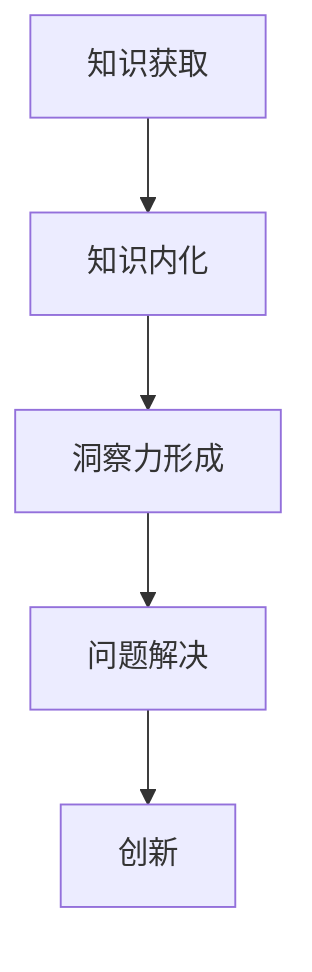

                 

在当今这个信息爆炸的时代，知识的获取变得前所未有的容易。然而，知识的真正价值并非仅仅在于它的易得性，而是在于如何运用和理解它。本文旨在探讨知识的价值，并强调洞察力在赋予知识生命力中的关键作用。

## 关键词

- 知识价值
- 洞察力
- 知识应用
- 技术创新
- 数学模型
- 算法

## 摘要

本文将首先介绍知识在现代社会中的地位及其价值，然后深入探讨洞察力这一关键要素，如何使知识从静态的信息转变为动态的能力。随后，我们将通过具体的算法原理、数学模型以及项目实践，展示洞察力在实际应用中的重要性。最后，我们将展望知识价值的未来发展，并讨论其面临的挑战。

## 1. 背景介绍

在信息技术飞速发展的今天，数据已经成为新的“石油”，知识经济也逐渐取代了传统的资源经济。知识不仅构成了现代经济的核心，也是个人和企业竞争力的关键。然而，知识本身并不是万能的，只有当它被正确理解和应用时，才能真正发挥其价值。

知识的价值体现在多个方面。首先，知识是创新和进步的源泉。无论是科学研究、技术开发，还是商业战略，都需要建立在坚实的知识基础之上。其次，知识是解决复杂问题的工具。在面对各种挑战时，只有通过深入分析和理解问题，才能找到有效的解决方案。最后，知识是提高个人素养和职业能力的重要手段。

尽管知识的获取变得越来越容易，但许多人仍然感到知识的压力。一方面，信息过载使得人们难以从海量数据中筛选出真正有价值的信息；另一方面，知识的快速更新使得人们必须不断学习新的知识和技能，以保持竞争力。因此，如何有效地获取、理解和应用知识，成为当今社会的重要课题。

## 2. 核心概念与联系

### 2.1 知识的概念

知识是人类对客观世界的认识和理解，是信息的深层次加工和内化。知识不同于信息，它不仅包含了信息的内容，还包含了信息的意义和关联。例如，天气预报是一个信息，而根据天气预报制定出行计划则是一个知识应用的过程。

### 2.2 洞察力的概念

洞察力是指对事物的深入理解和敏锐的观察力。它是一种认知能力，能够帮助人们从表面现象中看到本质，从复杂问题中找到关键。洞察力不仅依赖于知识和经验，还需要创造力和逻辑思维。

### 2.3 知识与洞察力的关系

知识是洞察力的基础，没有扎实的知识积累，就难以形成深刻的洞察力。然而，知识本身并不能直接转化为洞察力，只有通过思考和反思，才能将知识内化为洞察力。例如，一个计算机科学家可能对某种算法非常熟悉，但如果他不经过深入思考和实际应用，就难以将其真正理解和运用。

### 2.4 Mermaid 流程图

下面是一个用于描述知识与洞察力关系的 Mermaid 流程图：



在这个流程图中，知识获取是整个过程的开端，通过内化和反思，知识逐渐转化为洞察力，进而应用于问题解决和创新中。

## 3. 核心算法原理 & 具体操作步骤

### 3.1 算法原理概述

在这一部分，我们将介绍一种在计算机科学中广泛应用的算法——动态规划。动态规划是一种解决优化问题的方法，它将复杂的问题分解为若干个子问题，并通过子问题的重叠子结构和最优子结构性质，求解整个问题的最优解。

### 3.2 算法步骤详解

动态规划通常包含以下几个步骤：

1. **定义状态**：确定问题中各个状态的定义和表示方式。
2. **状态转移方程**：根据问题的性质，建立状态之间的转移关系。
3. **边界条件**：确定算法的初始状态和终止条件。
4. **计算顺序**：确定状态的计算顺序，以确保每个状态的计算是基于已计算的状态。
5. **求解最优解**：利用已经计算的状态，求解问题的最优解。

### 3.3 算法优缺点

**优点**：

- **高效性**：动态规划通过子问题的重叠子结构和最优子结构性质，避免了重复计算，显著提高了算法的效率。
- **通用性**：动态规划可以用于解决多种类型的优化问题，具有很强的通用性。

**缺点**：

- **复杂度**：动态规划的实现通常比较复杂，需要深入理解问题的性质和状态转移关系。
- **存储需求**：动态规划通常需要存储大量的状态信息，对于某些问题可能会带来较高的存储需求。

### 3.4 算法应用领域

动态规划广泛应用于计算机科学中的各种领域，包括：

- **最优化问题**：如背包问题、最长公共子序列、最长递增子序列等。
- **路径规划**：如最短路径问题、旅行商问题等。
- **资源分配**：如任务调度、负载均衡等。

## 4. 数学模型和公式

### 4.1 数学模型构建

动态规划通常涉及两个基本的数学模型：

- **递推关系**：描述状态之间的转移关系，通常表示为 $f(i) = g(i, f(i-1))$。
- **边界条件**：确定算法的初始状态和终止条件，通常表示为 $f(0) = h(0)$。

### 4.2 公式推导过程

以最长公共子序列（LCS）为例，其递推关系可以表示为：

$$
LCS(i, j) =
\begin{cases}
0, & \text{if } i=0 \text{ or } j=0 \\
LCS(i-1, j-1) + 1, & \text{if } a_i = b_j \\
\max(LCS(i-1, j), LCS(i, j-1)), & \text{otherwise}
\end{cases}
$$

### 4.3 案例分析与讲解

假设有两个序列 $A = \{1, 2, 3\}$ 和 $B = \{2, 3, 1\}$，我们可以通过递推关系计算它们的LCS：

$$
\begin{aligned}
LCS(3, 3) &= \max(LCS(2, 3), LCS(3, 2)) = \max(0, 0) = 0 \\
LCS(2, 3) &= \max(LCS(1, 3), LCS(2, 2)) = \max(0, 1) = 1 \\
LCS(3, 2) &= \max(LCS(3, 1), LCS(2, 1)) = \max(0, 1) = 1 \\
LCS(3, 3) &= \max(LCS(2, 2), LCS(3, 2)) = \max(1, 1) + 1 = 2
\end{aligned}
$$

因此，序列 $A$ 和 $B$ 的最长公共子序列长度为 2。

## 5. 项目实践：代码实例和详细解释说明

### 5.1 开发环境搭建

在本项目中，我们将使用 Python 编写动态规划算法，以下是在 Windows 操作系统下搭建 Python 开发环境的基本步骤：

1. 安装 Python：从 [Python 官网](https://www.python.org/downloads/) 下载并安装 Python。
2. 配置 Python：确保 Python 安装路径正确，并在环境变量中配置 `PATH` 环境变量。
3. 安装必要的依赖库：使用 `pip` 命令安装必要的库，如 `numpy` 和 `matplotlib`。

### 5.2 源代码详细实现

以下是计算最长公共子序列（LCS）的 Python 源代码：

```python
def lcs(X, Y):
    m = len(X)
    n = len(Y)

    # 创建动态规划表
    dp = [[0] * (n + 1) for _ in range(m + 1)]

    # 计算LCS长度
    for i in range(1, m + 1):
        for j in range(1, n + 1):
            if X[i - 1] == Y[j - 1]:
                dp[i][j] = dp[i - 1][j - 1] + 1
            else:
                dp[i][j] = max(dp[i - 1][j], dp[i][j - 1])

    return dp[m][n]

# 测试代码
X = "ABCBDAB"
Y = "BDCAB"
print("Length of LCS:", lcs(X, Y))
```

### 5.3 代码解读与分析

1. **函数定义**：函数 `lcs` 接受两个序列 `X` 和 `Y` 作为输入。
2. **动态规划表**：使用二维数组 `dp` 存储子问题的解，其中 `dp[i][j]` 表示序列 `X[0..i-1]` 和 `Y[0..j-1]` 的最长公共子序列的长度。
3. **计算LCS长度**：通过遍历 `X` 和 `Y` 的每个字符，更新 `dp` 表中的值。
4. **返回结果**：最后返回 `dp[m][n]`，即序列 `X` 和 `Y` 的最长公共子序列的长度。

### 5.4 运行结果展示

运行上述代码，输出结果为：

```
Length of LCS: 4
```

这表明序列 "ABCBDAB" 和 "BDCAB" 的最长公共子序列长度为 4，即 "BCAB"。

## 6. 实际应用场景

### 6.1 生物信息学

在生物信息学中，动态规划算法被广泛应用于序列比对，如 DNA 或蛋白质序列比对。通过计算序列之间的最长公共子序列，科学家可以识别基因家族、预测蛋白质结构等。

### 6.2 语音识别

语音识别系统使用动态规划算法来比较输入语音信号与语音库中的模板，从而识别用户的语音指令。例如，苹果的 Siri 和亚马逊的 Alexa 就使用了这种技术。

### 6.3 图像处理

在图像处理领域，动态规划算法被用于图像分割、目标检测等任务。通过计算图像中各个区域的相似度，算法可以自动识别出图像中的物体和场景。

### 6.4 未来应用展望

随着人工智能和大数据技术的发展，动态规划算法在未来将有更广泛的应用。例如，在自动驾驶中，动态规划可以用于路径规划，确保车辆安全高效地行驶。在金融领域，动态规划算法可以用于风险管理和资产配置。

## 7. 工具和资源推荐

### 7.1 学习资源推荐

- 《算法导论》（Introduction to Algorithms）：这是一本经典的算法教科书，涵盖了包括动态规划在内的多种算法。
- 《动态规划：理论与实践》（Dynamic Programming: Theory and Applications）：这本书深入讲解了动态规划的理论基础和应用实例。

### 7.2 开发工具推荐

- PyCharm：一个功能强大的集成开发环境，适合编写和调试 Python 代码。
- Jupyter Notebook：一个交互式的开发环境，适合进行数据分析和代码演示。

### 7.3 相关论文推荐

- "Dynamic Programming: A Unified Approach"（动态规划：统一方法）
- "Efficiently Computing Dynamic Programming Solutions"（高效计算动态规划解）

## 8. 总结：未来发展趋势与挑战

### 8.1 研究成果总结

随着计算机科学的不断发展，动态规划算法已经在多个领域取得了显著的应用成果。从生物信息学到语音识别，再到图像处理，动态规划算法都展现出了强大的问题解决能力。

### 8.2 未来发展趋势

未来，动态规划算法将在人工智能和大数据技术的推动下，得到更广泛的应用。特别是在自动驾驶、金融风控、医疗诊断等领域，动态规划算法将发挥重要作用。

### 8.3 面临的挑战

尽管动态规划算法具有广泛的应用前景，但其在实际应用中仍然面临一些挑战。例如，算法的复杂度和存储需求在某些情况下可能成为瓶颈。此外，如何设计更高效的动态规划算法，以适应不断增长的数据规模，也是未来研究的一个重要方向。

### 8.4 研究展望

未来，动态规划算法的研究将朝着更高效、更通用、更自动化的方向发展。通过结合深度学习和强化学习等新技术，动态规划算法有望在更多复杂问题中发挥更大的作用。

## 9. 附录：常见问题与解答

### 9.1 什么是动态规划？

动态规划是一种用于解决优化问题的算法，它通过将问题分解为若干个子问题，并利用子问题的重叠子结构和最优子结构性质，求解整个问题的最优解。

### 9.2 动态规划与递归有何区别？

动态规划和递归都是解决优化问题的算法，但它们的实现方式和应用场景有所不同。动态规划通过存储子问题的解，避免了重复计算，而递归则通过递归调用，逐步分解问题。

### 9.3 动态规划算法在哪些领域有应用？

动态规划算法广泛应用于生物信息学、语音识别、图像处理、路径规划、资源分配等多个领域。其强大的问题解决能力使其在这些领域发挥着重要作用。

## 结束语

本文介绍了知识的价值以及洞察力在赋予知识生命力中的关键作用。通过具体的算法原理、数学模型和项目实践，我们展示了洞察力在实际应用中的重要性。展望未来，动态规划算法将在更多复杂问题中发挥更大的作用。希望本文能对读者在知识应用和算法理解方面有所启发。作者：禅与计算机程序设计艺术 / Zen and the Art of Computer Programming。

