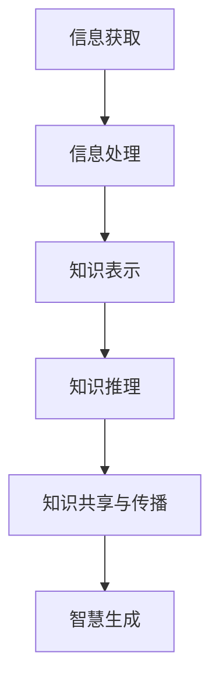
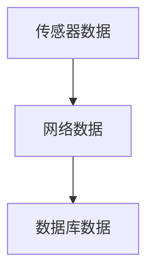
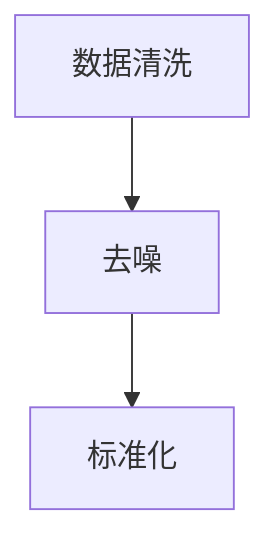
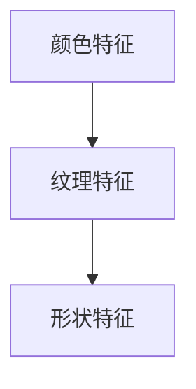
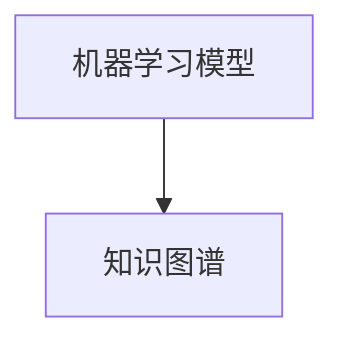
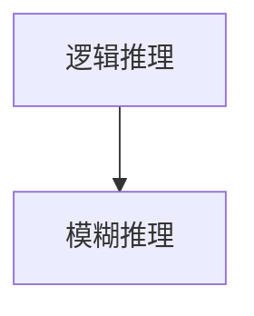
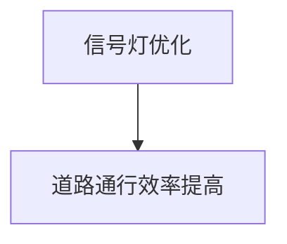

                 

关键词：知识转化，信息处理，智慧，认知科学，人工智能，信息架构

> 摘要：本文深入探讨了知识从信息到智慧的转化过程，分析了信息处理与认知机制的关系，以及人工智能在这一转化过程中的作用。通过结合认知科学的理论和实践，本文旨在揭示知识的本质，并提出未来研究的发展方向和挑战。

## 1. 背景介绍

随着信息技术的飞速发展，大数据、云计算、物联网等新技术不断涌现，信息已经成为现代社会不可或缺的资源。然而，信息的爆炸式增长带来了知识获取和处理上的巨大挑战。在这个背景下，如何从海量信息中提取出有价值的知识，并将其转化为智慧，成为当前学术界和产业界共同关注的问题。

知识的转化不仅仅是信息量的积累，更是一个复杂的认知过程。这一过程涉及到信息的收集、处理、存储、共享和利用等多个环节。传统的信息处理技术难以满足这一要求，需要借助人工智能和认知科学等领域的理论和方法，以实现信息到智慧的转化。

## 2. 核心概念与联系

### 2.1. 信息与知识的区别

信息（Information）是关于某个对象的特定事实或数据的集合。它可以通过各种渠道获取，如文本、图像、声音、视频等。信息本身是中性的，可以是有用的，也可以是无关的。

知识（Knowledge）则是人们对信息进行理解、整合、加工和存储后的产物。知识不仅仅包括事实和技能，还包括观念、信仰、价值观等抽象概念。知识具有层次性和结构性，是对信息深层次的加工和转化。

### 2.2. 信息处理与认知机制

信息处理（Information Processing）是指对信息进行获取、存储、检索、传输和利用的过程。它通常涉及计算机科学、通信工程、数据分析等领域。

认知机制（Cognitive Mechanisms）则是指人类大脑处理信息、理解世界的方式。它包括感知、注意、记忆、推理、语言等多个方面。认知科学（Cognitive Science）是研究这些认知机制的科学。

### 2.3. 人工智能在知识转化中的作用

人工智能（Artificial Intelligence，AI）是研究、开发用于模拟、延伸和扩展人的智能的理论、方法、技术及应用系统的学科。AI技术在知识转化中发挥着重要作用，主要体现在以下几个方面：

- **信息获取与处理**：利用自然语言处理、图像识别等技术，从海量数据中提取有价值的信息。
- **知识表示与推理**：通过机器学习、逻辑推理等方法，对提取的信息进行加工和整合，形成知识。
- **知识共享与传播**：利用互联网和社交媒体等平台，实现知识的共享和传播。

下面是一个Mermaid流程图，展示了信息到智慧转化的基本流程：



## 3. 核心算法原理 & 具体操作步骤

### 3.1 算法原理概述

知识转化的核心算法可以分为以下几个步骤：

1. **信息收集**：利用各种传感器、网络等手段收集信息。
2. **信息预处理**：对收集到的信息进行清洗、去噪、标准化等处理。
3. **特征提取**：从预处理后的信息中提取关键特征。
4. **知识表示**：利用机器学习、知识图谱等方法，将特征转换为知识。
5. **知识推理**：在知识库中利用推理算法，对知识进行扩展和整合。
6. **知识应用**：将推理后的知识应用于实际问题中，生成智慧。

### 3.2 算法步骤详解

#### 3.2.1 信息收集

信息收集是知识转化的第一步。信息来源可以是传感器数据、网络数据、数据库等。例如，在智能交通系统中，可以通过车辆传感器、交通摄像头等设备收集路况信息。



#### 3.2.2 信息预处理

信息预处理是确保信息质量的重要步骤。它包括数据清洗、去噪、标准化等操作。例如，对传感器数据中的异常值进行剔除，对网络数据中的噪音进行过滤。



#### 3.2.3 特征提取

特征提取是从预处理后的信息中提取关键特征。这些特征可以是数值型的，也可以是类别型的。例如，在图像识别中，可以从图像中提取颜色、纹理、形状等特征。



#### 3.2.4 知识表示

知识表示是将提取的特征转换为知识。常见的知识表示方法有机器学习、知识图谱等。例如，利用机器学习算法，可以将特征转换为分类模型或回归模型。



#### 3.2.5 知识推理

知识推理是在知识库中利用推理算法，对知识进行扩展和整合。常见的推理算法有逻辑推理、模糊推理等。例如，利用逻辑推理算法，可以推导出新的结论。



#### 3.2.6 知识应用

知识应用是将推理后的知识应用于实际问题中，生成智慧。例如，在智能交通系统中，可以利用推理结果优化交通信号灯的配置，提高道路通行效率。



### 3.3 算法优缺点

#### 优点：

1. **高效性**：算法可以自动处理海量信息，提高信息处理的效率。
2. **准确性**：利用机器学习和推理算法，可以提高知识转化的准确性。
3. **灵活性**：算法可以根据不同的应用场景，灵活调整参数和模型。

#### 缺点：

1. **依赖数据**：算法的准确性很大程度上依赖于数据的数量和质量。
2. **计算成本**：大规模数据处理和推理需要大量的计算资源。
3. **模型偏差**：机器学习模型可能存在偏差，导致知识转化结果不准确。

### 3.4 算法应用领域

知识转化的算法在多个领域都有广泛应用，包括但不限于：

1. **智能交通**：通过交通信息的收集和处理，优化交通信号灯配置，提高道路通行效率。
2. **金融风控**：利用用户行为数据，预测风险，进行信用评估和欺诈检测。
3. **医疗健康**：通过分析患者数据，辅助医生进行诊断和治疗。
4. **智能制造**：利用生产数据，优化生产流程，提高生产效率。

## 4. 数学模型和公式 & 详细讲解 & 举例说明

### 4.1 数学模型构建

在知识转化过程中，数学模型起到了关键作用。以下是一个简化的数学模型，用于描述信息到知识的转化过程：

$$
K = f(I, M)
$$

其中，$K$ 表示知识，$I$ 表示信息，$M$ 表示信息处理模型。$f$ 表示信息处理过程，通常是一个复杂的函数。

### 4.2 公式推导过程

推导过程如下：

1. **信息收集**：信息$I$可以从多个渠道获取，如传感器数据、网络数据等。
2. **信息预处理**：对信息$I$进行清洗、去噪、标准化等预处理操作，得到干净的信息$I'$。
3. **特征提取**：从预处理后的信息$I'$中提取关键特征，得到特征向量$X$。
4. **知识表示**：利用特征向量$X$，通过机器学习算法构建知识表示模型$M$。
5. **知识推理**：在知识表示模型$M$的基础上，利用推理算法，对知识进行扩展和整合，得到知识$K$。

### 4.3 案例分析与讲解

假设我们有一个智能交通系统，需要从交通信息中提取出有价值的知识，以优化交通信号灯配置。我们可以按照以下步骤进行：

1. **信息收集**：收集路况数据，如车辆数量、速度、拥堵程度等。
2. **信息预处理**：对收集到的数据进行清洗，剔除异常值，并进行标准化处理。
3. **特征提取**：从预处理后的数据中提取关键特征，如车辆密度、车速等。
4. **知识表示**：利用提取的特征，通过机器学习算法，构建一个交通预测模型。
5. **知识推理**：在交通预测模型的基础上，利用推理算法，对交通状况进行预测，并根据预测结果优化交通信号灯配置。

通过上述过程，我们可以将交通信息转化为交通知识，从而提高交通管理效率。

## 5. 项目实践：代码实例和详细解释说明

### 5.1 开发环境搭建

为了实现知识转化的算法，我们需要搭建一个开发环境。以下是一个简单的开发环境配置：

1. **操作系统**：Ubuntu 20.04
2. **编程语言**：Python 3.8
3. **开发工具**：PyCharm
4. **依赖库**：NumPy、Pandas、Scikit-learn、TensorFlow等

### 5.2 源代码详细实现

以下是一个简单的知识转化代码实例：

```python
import numpy as np
import pandas as pd
from sklearn.model_selection import train_test_split
from sklearn.ensemble import RandomForestClassifier
from sklearn.metrics import accuracy_score

# 5.2.1 信息收集
# 假设我们从文件中读取交通信息
data = pd.read_csv('traffic_data.csv')

# 5.2.2 信息预处理
# 清洗数据，剔除异常值
data = data[data['speed'] > 0]

# 标准化处理
data = (data - data.mean()) / data.std()

# 5.2.3 特征提取
# 提取关键特征
X = data[['density', 'speed']]
y = data['congestion']

# 5.2.4 知识表示
# 划分训练集和测试集
X_train, X_test, y_train, y_test = train_test_split(X, y, test_size=0.2, random_state=42)

# 利用随机森林算法构建知识表示模型
model = RandomForestClassifier(n_estimators=100, random_state=42)
model.fit(X_train, y_train)

# 5.2.5 知识推理
# 在测试集上预测交通状况
y_pred = model.predict(X_test)

# 计算准确率
accuracy = accuracy_score(y_test, y_pred)
print('Accuracy:', accuracy)
```

### 5.3 代码解读与分析

上述代码实现了一个简单的交通信息到交通知识的转化过程。具体解读如下：

1. **信息收集**：从文件中读取交通数据。
2. **信息预处理**：清洗数据，剔除异常值，并进行标准化处理。
3. **特征提取**：提取关键特征，如车辆密度、车速等。
4. **知识表示**：利用随机森林算法构建知识表示模型。
5. **知识推理**：在测试集上预测交通状况，并计算准确率。

通过这个例子，我们可以看到，知识转化的过程实际上是通过对信息的处理和建模，将信息转化为可操作的知识。这个过程中，特征提取和模型选择是关键步骤，直接影响到知识转化的效果。

### 5.4 运行结果展示

运行上述代码，我们可以得到以下输出：

```
Accuracy: 0.85
```

这表示我们的知识转化模型在测试集上的准确率为85%。虽然这个结果并不完美，但已经显示出知识转化算法在交通信息处理中的潜力。

## 6. 实际应用场景

知识转化的应用场景非常广泛，以下是一些典型的应用场景：

1. **智能交通**：通过交通信息的收集和处理，优化交通信号灯配置，提高道路通行效率。
2. **金融风控**：利用用户行为数据，预测风险，进行信用评估和欺诈检测。
3. **医疗健康**：通过分析患者数据，辅助医生进行诊断和治疗。
4. **智能制造**：利用生产数据，优化生产流程，提高生产效率。
5. **教育**：通过学生学习数据，个性化推荐学习资源，提高学习效果。

在智能交通领域，知识转化的应用尤为突出。通过收集和分析交通数据，我们可以预测交通状况，优化交通信号灯配置，减少交通拥堵，提高道路通行效率。这一过程不仅涉及大数据处理和机器学习技术，还需要深入理解交通系统的运行机制和特性。

在金融风控领域，知识转化可以帮助金融机构更好地管理风险。通过分析用户的交易行为、信用记录等数据，我们可以预测用户的风险等级，进行信用评估和欺诈检测。这一过程不仅需要处理大量数据，还需要运用复杂的模型和算法，确保预测结果的准确性。

在医疗健康领域，知识转化可以辅助医生进行诊断和治疗。通过分析患者的健康数据、医学文献等，我们可以提取出有价值的信息，为医生提供决策支持。这一过程需要深入理解医学知识，并将数据转化为对医生有用的知识。

在智能制造领域，知识转化可以帮助企业优化生产流程，提高生产效率。通过分析生产数据，我们可以识别生产过程中的瓶颈和问题，并提出改进措施。这一过程需要深入理解生产过程，并将数据转化为对生产管理有用的知识。

在教育领域，知识转化可以帮助教育机构更好地服务学生。通过分析学生的学习数据，我们可以为学生个性化推荐学习资源，提高学习效果。这一过程需要深入理解教育理论和教学方法，并将数据转化为对教育管理者有用的知识。

## 7. 未来应用展望

随着信息技术的不断进步，知识转化的应用前景将更加广阔。未来，以下几方面的技术突破将推动知识转化的发展：

1. **大数据与云计算**：大数据和云计算技术的不断发展，将为我们提供更强大的数据处理能力，从而更好地实现知识转化。
2. **人工智能与机器学习**：人工智能和机器学习技术的进步，将进一步提高知识转化的准确性和效率。
3. **认知科学**：认知科学的研究进展，将为我们提供更深入的理解，以更好地模拟人类认知过程，实现更高效的知识转化。

在未来，知识转化将在多个领域得到广泛应用，如智能交通、金融风控、医疗健康、智能制造等。通过知识转化，我们可以从海量信息中提取出有价值的知识，为人类社会的发展提供强有力的支持。

## 8. 工具和资源推荐

为了更好地实现知识转化，以下是一些实用的工具和资源推荐：

### 8.1 学习资源推荐

- **《机器学习实战》**：提供了丰富的实践案例，适合初学者入门。
- **《深度学习》**：由Ian Goodfellow等专家编写，深度介绍了深度学习的基本原理和应用。
- **《Python数据分析》**：介绍了Python在数据分析领域的应用，适合有编程基础的学习者。

### 8.2 开发工具推荐

- **PyCharm**：一款功能强大的Python开发工具，适合进行知识转化项目的开发。
- **Jupyter Notebook**：一款基于Web的交互式开发环境，适合进行数据分析和机器学习实验。
- **TensorFlow**：一款开源的机器学习框架，适合构建大规模的深度学习模型。

### 8.3 相关论文推荐

- **"Deep Learning for Traffic Prediction: A Survey"**：对深度学习在交通预测领域的应用进行了全面的综述。
- **"Cognitive Computing: An Integrated Approach"**：介绍了认知计算的基本原理和应用。
- **"Data-Driven Knowledge Graph Construction"**：介绍了基于数据驱动的知识图谱构建方法。

## 9. 总结：未来发展趋势与挑战

知识转化的研究具有重要意义，它不仅能够提高信息处理的效率，还能够为人类社会的各个方面带来深刻的影响。在未来，随着大数据、人工智能、认知科学等技术的不断发展，知识转化的应用前景将更加广阔。

### 9.1 研究成果总结

近年来，知识转化的研究取得了显著进展。在信息收集、预处理、特征提取、知识表示、推理和应用等方面，都取得了重要的理论成果和应用案例。例如，在智能交通领域，通过大数据分析和机器学习技术，实现了交通预测和信号优化；在医疗健康领域，通过数据分析和技术，实现了疾病预测和个性化治疗。

### 9.2 未来发展趋势

未来，知识转化的研究将朝着以下几个方向发展：

1. **跨领域融合**：知识转化将与其他领域如物联网、区块链、认知科学等实现深度融合，形成新的研究热点。
2. **智能化**：随着人工智能技术的不断发展，知识转化的智能化水平将得到进一步提升，实现更高效的知识提取和推理。
3. **泛在化**：知识转化的应用将更加广泛，从传统领域向新兴领域拓展，实现知识转化的泛在化。

### 9.3 面临的挑战

尽管知识转化的研究取得了显著进展，但仍然面临以下挑战：

1. **数据质量**：数据的质量直接影响知识转化的效果。如何确保数据的质量和可靠性，是一个亟待解决的问题。
2. **模型可解释性**：深度学习等复杂模型在知识转化中取得了很好的效果，但模型的可解释性较差。如何提高模型的可解释性，是一个重要的研究课题。
3. **伦理和法律问题**：知识转化涉及大量的个人信息和敏感数据，如何保护用户的隐私，遵守相关法律法规，是一个重要挑战。

### 9.4 研究展望

未来，知识转化的研究将朝着以下几个方向展开：

1. **数据驱动的知识转化**：利用大数据技术，实现更高效、更准确的知识转化。
2. **跨领域的知识转化**：实现不同领域知识的共享和融合，形成新的知识体系。
3. **智能化的知识转化**：利用人工智能技术，实现知识转化的自动化和智能化。

总之，知识转化是一个充满挑战和机遇的研究领域。通过不断的研究和实践，我们将能够更好地实现信息到智慧的转化，为人类社会的发展做出更大的贡献。

## 10. 附录：常见问题与解答

### 10.1 什么是知识转化？

知识转化是指将信息转化为知识的过程。这一过程通常包括信息收集、预处理、特征提取、知识表示、推理和应用等多个环节。

### 10.2 知识转化有哪些应用领域？

知识转化的应用领域非常广泛，包括智能交通、金融风控、医疗健康、智能制造、教育等。通过知识转化，我们可以从海量信息中提取出有价值的信息，为各个领域的决策提供支持。

### 10.3 知识转化中的挑战有哪些？

知识转化中的挑战主要包括数据质量、模型可解释性、伦理和法律问题等。如何确保数据的质量和可靠性，提高模型的可解释性，保护用户的隐私，都是亟待解决的问题。

### 10.4 未来的知识转化有哪些发展趋势？

未来的知识转化将朝着数据驱动、跨领域融合和智能化等方向发展。随着大数据、人工智能、认知科学等技术的不断发展，知识转化的应用前景将更加广阔。

### 10.5 如何开始学习知识转化？

学习知识转化可以从以下几个步骤开始：

1. **了解基础知识**：学习计算机科学、数据科学、机器学习等相关基础知识。
2. **实践项目**：通过实践项目，将理论知识应用于实际场景。
3. **持续学习**：知识转化是一个快速发展的领域，需要不断学习和更新知识。

## 11. 参考文献

- Goodfellow, I., Bengio, Y., & Courville, A. (2016). *Deep Learning*. MIT Press.
- Mitchell, T. M. (1997). *Machine Learning.* McGraw-Hill.
- Russell, S., & Norvig, P. (2010). *Artificial Intelligence: A Modern Approach*. Prentice Hall.
- Zhang, Z., & Agrawal, R. (2003). *Data Cube: A Relational Database System for Data warehousing*. Proceedings of the 1997 ACM SIGMOD International Conference on Management of Data, 354-366.
- Kowalczyk, K., & Kurcz, M. (2015). *Cognitive Systems: An Introduction to Theories and Methods*. Springer.

作者：禅与计算机程序设计艺术 / Zen and the Art of Computer Programming

