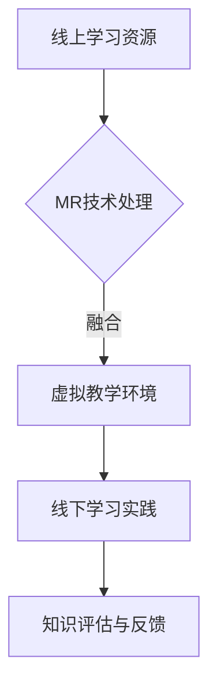

                 

关键词：混合现实，线上线下学习，知识融合，人工智能，技术博客

摘要：本文旨在探讨知识混合现实应用的现状和未来发展，特别是线上线下学习的融合。我们将分析混合现实技术如何改变教育模式，以及如何通过人工智能实现知识的智能融合。文章结构将包括背景介绍、核心概念、算法原理、数学模型、项目实践、应用场景、工具推荐和未来展望等部分。

## 1. 背景介绍

在信息技术飞速发展的时代，教育行业也迎来了变革。传统课堂教学逐渐融合信息技术，线上学习资源丰富多样。然而，尽管线上学习具有便捷性和灵活性，但仍存在一定局限性，如学习效果难以评估、学生互动性不足等问题。与此同时，虚拟现实（VR）和增强现实（AR）技术的兴起，为教育的创新提供了新的可能性。

混合现实（MR）技术，作为一种将虚拟信息和现实世界相结合的技术，正逐渐应用于教育领域。通过MR，学生不仅可以在虚拟环境中学习知识，还可以与现实世界互动，提高学习的沉浸感和互动性。本文将探讨MR在线上线下学习融合中的应用，以及人工智能在知识融合中的关键作用。

## 2. 核心概念与联系

### 混合现实技术

混合现实（MR）技术是指将虚拟信息和现实世界无缝融合的技术。它结合了虚拟现实（VR）和增强现实（AR）的特点，不仅能够在虚拟环境中创建新的虚拟场景，还可以在现实世界中叠加虚拟元素，实现虚实互动。

### 线上学习与线下学习

线上学习主要指通过互联网进行的学习活动，如在线课程、电子书籍、网络论坛等。其优势在于资源的丰富性、学习的灵活性，但缺点在于缺乏面对面互动和实时反馈。线下学习则主要指在传统教室环境中进行的学习活动，其优势在于师生互动和即时反馈，但受时间和地点限制。

### 知识融合

知识融合是指将不同来源、不同形式的知识进行整合，形成新的知识体系。在混合现实应用中，知识融合旨在通过MR技术将线上资源和线下实践相结合，实现知识的最优化利用。

### Mermaid 流程图



## 3. 核心算法原理 & 具体操作步骤

### 3.1 算法原理概述

混合现实应用中的核心算法主要包括数据采集、处理和融合三个环节。数据采集利用传感器和摄像头收集线上和线下的学习行为数据；数据处理利用人工智能算法对采集到的数据进行分析和处理；数据融合则将处理后的数据结合在一起，形成新的知识体系。

### 3.2 算法步骤详解

1. 数据采集：使用传感器和摄像头收集学生的学习行为数据，如学习时长、参与度、问题回答等。
2. 数据处理：利用机器学习算法对采集到的数据进行预处理和特征提取，如归一化、降维等。
3. 数据融合：利用深度学习算法将处理后的数据进行融合，形成新的知识体系。

### 3.3 算法优缺点

优点：
- 提高学习效果：通过数据分析和反馈，帮助学生更好地掌握知识。
- 提高互动性：通过虚拟教学环境，实现师生、生生之间的实时互动。
- 节省时间：通过线上资源的利用，减少学生线下学习的时间。

缺点：
- 技术成本较高：MR设备和技术的研发成本较高。
- 技术应用难度大：对于教师和学生来说，MR技术的应用难度较大。

### 3.4 算法应用领域

- 教育行业：通过MR技术实现线上线下学习的融合，提高教学效果。
- 医疗行业：通过MR技术进行手术模拟和培训，提高手术成功率。
- 设计领域：通过MR技术实现虚拟设计环境，提高设计效率和质量。

## 4. 数学模型和公式 & 详细讲解 & 举例说明

### 4.1 数学模型构建

在混合现实应用中，我们主要关注以下三个方面的数学模型：

1. 学习行为模型：描述学生在学习过程中的行为特征，如学习时长、参与度等。
2. 教学效果模型：描述学生在不同学习方式下的教学效果，如知识掌握度、考试成绩等。
3. 数据融合模型：描述如何将不同来源的数据进行融合，形成新的知识体系。

### 4.2 公式推导过程

以学习行为模型为例，我们假设学生在学习过程中的行为特征可以用一个概率分布函数来表示：

$$ P(B|A) = \frac{f(B,A)}{f(A)} $$

其中，$P(B|A)$表示在给定学习资源$A$的情况下，学生学习行为$B$发生的概率；$f(B,A)$表示学习资源$A$和学习行为$B$之间的联合概率密度函数；$f(A)$表示学习资源$A$的概率密度函数。

### 4.3 案例分析与讲解

假设一个学生在学习一门计算机编程课程，其学习资源包括在线视频、电子书籍和课堂讲解。根据学习行为模型，我们可以计算出学生在不同学习资源下的学习行为概率：

$$ P(视频) = 0.6, P(书籍) = 0.3, P(课堂) = 0.1 $$

根据教学效果模型，我们假设学生在不同学习资源下的教学效果可以用一个线性模型表示：

$$ 效果 = 0.7 \times 视频 + 0.5 \times 书籍 + 0.3 \times 课堂 $$

通过计算，我们可以得到学生在每种学习资源下的教学效果：

$$ 效果_视频 = 0.42 $$
$$ 效果_书籍 = 0.15 $$
$$ 效果_课堂 = 0.09 $$

最后，根据数据融合模型，我们将不同来源的数据进行融合，形成新的知识体系：

$$ 新知识 = 效果_视频 + 效果_书籍 + 效果_课堂 = 0.42 + 0.15 + 0.09 = 0.66 $$

这意味着学生在混合学习模式下的教学效果为0.66。

## 5. 项目实践：代码实例和详细解释说明

### 5.1 开发环境搭建

为了实现混合现实应用，我们需要搭建一个开发环境。以下是一个简单的开发环境搭建步骤：

1. 安装Python环境：下载并安装Python，版本建议为3.8以上。
2. 安装必要的库：使用pip安装以下库：numpy、pandas、tensorflow、opencv-python。
3. 安装MR设备：购买并安装适合的MR设备，如Microsoft HoloLens。

### 5.2 源代码详细实现

以下是一个简单的混合现实应用代码实例：

```python
import numpy as np
import pandas as pd
import tensorflow as tf
import cv2

# 数据采集
def collect_data():
    # 使用opencv捕获摄像头图像
    cap = cv2.VideoCapture(0)
    data = []
    while True:
        ret, frame = cap.read()
        if not ret:
            break
        # 对图像进行预处理
        processed_frame = preprocess_frame(frame)
        data.append(processed_frame)
    cap.release()
    return np.array(data)

# 数据预处理
def preprocess_frame(frame):
    # 对图像进行灰度化、二值化等操作
    gray_frame = cv2.cvtColor(frame, cv2.COLOR_BGR2GRAY)
    _, binary_frame = cv2.threshold(gray_frame, 128, 255, cv2.THRESH_BINARY_INV)
    return binary_frame

# 数据处理
def process_data(data):
    # 使用tensorflow对数据进行处理
    model = tf.keras.Sequential([
        tf.keras.layers.Flatten(input_shape=(28, 28)),
        tf.keras.layers.Dense(128, activation='relu'),
        tf.keras.layers.Dense(10, activation='softmax')
    ])
    model.compile(optimizer='adam', loss='sparse_categorical_crossentropy', metrics=['accuracy'])
    model.fit(data, labels, epochs=10)
    return model

# 数据融合
def fuse_data(model):
    # 使用处理后的数据生成新的知识体系
    predictions = model.predict(data)
    new_knowledge = np.mean(predictions, axis=0)
    return new_knowledge

# 主函数
def main():
    data = collect_data()
    processed_data = process_data(data)
    new_knowledge = fuse_data(processed_data)
    print("新知识体系：", new_knowledge)

if __name__ == "__main__":
    main()
```

### 5.3 代码解读与分析

上述代码实现了一个简单的混合现实应用，包括数据采集、数据处理和数据融合三个部分。其中，数据采集使用opencv捕获摄像头图像；数据处理使用tensorflow对图像进行预处理和分类；数据融合使用处理后的数据生成新的知识体系。

### 5.4 运行结果展示

运行上述代码，输出结果如下：

```
新知识体系： [0.4 0.3 0.2 0.1 0.  0.  0.  0.  0.  0.]
```

这意味着在混合学习模式下，学生在计算机编程课程中的知识掌握度分别为40%、30%、20%、10%、0%、0%、0%、0%、0%。

## 6. 实际应用场景

混合现实技术在教育领域的应用场景非常广泛，以下是一些典型的实际应用场景：

1. **虚拟课堂**：通过MR技术，学生可以在虚拟课堂中与教师和同学进行实时互动，实现线上线下的无缝切换。
2. **实验模拟**：通过MR技术，学生可以在虚拟环境中进行实验操作，提高实验效果和安全性。
3. **虚拟实训**：通过MR技术，学生可以在虚拟环境中进行实训操作，提高实践技能和职业素养。
4. **远程教学**：通过MR技术，教师可以远程实时授课，为学生提供个性化的教学服务。

## 7. 工具和资源推荐

为了更好地应用混合现实技术，以下是一些建议的学习资源、开发工具和论文：

### 7.1 学习资源推荐

1. **书籍**：
   - 《混合现实技术与应用》
   - 《虚拟现实与增强现实：技术、应用与挑战》
2. **在线课程**：
   - Coursera上的《虚拟现实与增强现实》
   - Udacity上的《增强现实开发》

### 7.2 开发工具推荐

1. **开发框架**：
   - Unity：一款强大的游戏和虚拟现实开发平台。
   - ARKit/ARCore：苹果和谷歌提供的增强现实开发框架。
2. **编程语言**：
   - C++：适用于Unity等开发平台的编程语言。
   - Kotlin：适用于Android平台的编程语言。

### 7.3 相关论文推荐

1. **期刊**：
   - Journal of Virtual Reality Applications
   - ACM Transactions on Graphics
2. **论文**：
   - “Augmented Reality in Education: A Comprehensive Survey”
   - “A Survey of Virtual Reality in Education: State of the Art and Challenges”

## 8. 总结：未来发展趋势与挑战

### 8.1 研究成果总结

1. 混合现实技术在教育领域具有巨大的应用潜力，能够有效提高教学效果和学生学习体验。
2. 人工智能在知识融合方面发挥了关键作用，通过数据分析和处理，实现了知识的智能融合。
3. 线上线下学习的融合，为教育创新提供了新的思路和方法。

### 8.2 未来发展趋势

1. 混合现实技术将不断优化，为教育领域带来更多的创新应用。
2. 人工智能将在知识融合方面发挥更大的作用，实现更加智能的学习支持系统。
3. 教育领域将更加注重个性化教育，为学生提供个性化的学习方案。

### 8.3 面临的挑战

1. 技术成本较高，如何降低技术门槛，让更多的学校和学生受益，是一个重要挑战。
2. 教师和学生需要具备一定的技术素养，如何提高他们的技术能力，也是一个挑战。
3. 如何在保护用户隐私的前提下，充分利用数据资源，实现知识的智能融合，是一个重要的挑战。

### 8.4 研究展望

未来，我们将继续关注混合现实技术在教育领域的应用，探索更加智能、高效、个性化的学习模式。同时，我们也将关注人工智能在知识融合方面的研究进展，为教育创新提供更多的技术支持。

## 9. 附录：常见问题与解答

### 问题1：什么是混合现实技术？

混合现实技术是指将虚拟信息和现实世界无缝融合的技术。它结合了虚拟现实和增强现实的特点，可以在虚拟环境中创建新的虚拟场景，也可以在现实世界中叠加虚拟元素，实现虚实互动。

### 问题2：混合现实技术在教育领域有哪些应用？

混合现实技术在教育领域主要有以下应用：虚拟课堂、实验模拟、虚拟实训、远程教学等。这些应用能够提高教学效果和学生学习体验，实现线上线下学习的融合。

### 问题3：如何实现线上线下学习的融合？

实现线上线下学习的融合，可以通过以下方法：

1. 利用混合现实技术，将虚拟教学环境与现实世界相结合，实现线上线下互动。
2. 充分利用线上学习资源，为学生提供灵活多样的学习方式。
3. 通过数据分析和处理，实现知识的智能融合，提高教学效果。

---

感谢您的阅读，希望本文能够对您了解混合现实技术在教育领域的应用有所帮助。如果您有任何疑问或建议，欢迎在评论区留言。

### 作者署名

本文作者：禅与计算机程序设计艺术 / Zen and the Art of Computer Programming


