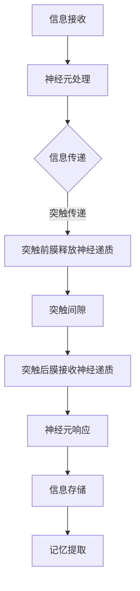

                 

关键词：神经科学，信息处理，大脑认知，知识结构，信息编码

> 摘要：本文旨在探讨大脑处理信息的神经科学基础，从信息编码、存储和提取三个环节分析大脑的工作原理。通过深入解读神经元的结构和功能，结合信息处理的理论模型，阐述大脑如何实现高效的信息处理，以及这些原理在人工智能领域的应用和未来发展方向。

## 1. 背景介绍

随着人工智能技术的快速发展，研究者们对人类大脑处理信息的方式产生了浓厚的兴趣。大脑作为自然界最复杂的系统之一，其信息处理能力远远超过现有的计算机系统。为了理解并模拟大脑的工作原理，神经科学成为了一个重要的研究领域。本文将重点介绍大脑如何处理信息，包括信息编码、存储和提取的过程，并探讨这些过程对人工智能技术的启示。

### 1.1  神经科学的重要性

神经科学是研究神经系统结构、功能及其与行为和认知之间关系的一个跨学科领域。它不仅涉及生物学、心理学、计算机科学等多个学科，还为理解大脑如何处理信息提供了重要的理论基础。神经科学的研究成果对于开发更高效的人工智能系统具有重要的指导意义。

### 1.2  人工智能与神经科学的结合

近年来，人工智能领域的发展受到了神经科学的启发。深度学习算法的成功应用在很大程度上得益于对神经网络结构的深入研究。通过模拟大脑神经网络的结构和工作原理，人工智能系统可以在图像识别、语音识别、自然语言处理等领域实现高效的信息处理。本文将探讨神经科学如何推动人工智能技术的发展。

## 2. 核心概念与联系

要深入探讨大脑如何处理信息，首先需要了解几个核心概念，包括神经元、突触和神经网络。这些概念不仅构成了大脑的基本工作原理，而且也为构建人工智能系统提供了灵感。

### 2.1  神经元

神经元是大脑的基本单位，负责接收、处理和传递信息。神经元具有树突、细胞体和轴突三部分。树突用于接收其他神经元的信息，细胞体负责处理这些信息，轴突则将处理后的信息传递给其他神经元。

### 2.2  突触

神经元之间的信息传递是通过突触完成的。突触是一种连接神经元细胞体的结构，它由突触前膜、突触间隙和突触后膜组成。当神经元兴奋时，会释放神经递质，通过突触间隙作用于突触后膜，从而引发突触后神经元的兴奋或抑制。

### 2.3  神经网络

神经网络是由大量神经元通过突触连接而成的复杂网络。神经网络可以模拟大脑的结构和工作原理，是人工智能领域的重要研究工具。神经网络通过调整突触权重，实现信息处理和知识的学习。

### 2.4  Mermaid 流程图

以下是大脑信息处理流程的 Mermaid 流程图：



### 2.5  大脑与神经网络的联系

神经网络的结构和工作原理在很大程度上受到了大脑的启发。通过模拟大脑神经网络，人工智能系统可以实现高效的信息处理。神经网络中的神经元相当于大脑中的神经元，突触权重则相当于大脑中的突触连接强度。通过不断调整突触权重，神经网络可以实现知识的学习和记忆的存储。

## 3. 核心算法原理 & 具体操作步骤

### 3.1  算法原理概述

大脑处理信息的核心算法可以概括为三个步骤：信息编码、信息存储和信息提取。信息编码是指将外部信息转化为神经元可以处理的形式；信息存储是指将处理后的信息存储在大脑中；信息提取是指从大脑中检索所需的信息。

### 3.2  算法步骤详解

#### 3.2.1  信息编码

信息编码是大脑处理信息的第一步。大脑通过多种方式对信息进行编码，包括视觉编码、听觉编码、触觉编码等。视觉编码是指将光信号转化为电信号，通过神经元传递到大脑皮层进行处理。听觉编码是指将声波信号转化为电信号，通过神经元传递到大脑听觉中枢进行处理。触觉编码是指将触觉信号转化为电信号，通过神经元传递到大脑触觉中枢进行处理。

#### 3.2.2  信息存储

信息存储是大脑处理信息的第二步。大脑通过突触连接和神经元之间的相互作用来实现信息的存储。在神经元之间，突触连接的强度和数量会影响信息的存储效果。突触连接的强度越大，信息存储的效果越好。此外，大脑还会通过重复练习和记忆巩固来增强信息的存储效果。

#### 3.2.3  信息提取

信息提取是大脑处理信息的最后一步。在大脑需要使用信息时，会通过激活相关的神经元和突触连接，从大脑中检索所需的信息。信息提取的过程不仅受到信息存储效果的影响，还受到大脑的注意力机制和记忆检索策略的影响。

### 3.3  算法优缺点

#### 优点：

1. 高效：大脑的信息处理速度远超现有计算机系统。
2. 可塑性：大脑可以适应环境变化，实现功能重组。
3. 学习能力：大脑具有强大的学习能力和适应性。

#### 缺点：

1. 可扩展性：大脑的信息处理能力受限于其物理结构。
2. 能耗：大脑的信息处理需要大量能量。
3. 可解释性：大脑的工作原理尚不完全清楚，难以实现完全可解释的人工智能系统。

### 3.4  算法应用领域

大脑处理信息的算法在多个领域具有广泛的应用，包括：

1. 图像识别：通过模拟大脑的视觉处理机制，实现高效图像识别。
2. 自然语言处理：通过模拟大脑的语言处理机制，实现高效自然语言处理。
3. 记忆和认知：通过模拟大脑的记忆和认知机制，实现高效的记忆和认知功能。

## 4. 数学模型和公式 & 详细讲解 & 举例说明

### 4.1  数学模型构建

大脑处理信息的数学模型可以概括为以下几个关键环节：信息编码、信息存储和信息提取。以下是一个简化的数学模型：

$$
X_{\text{encoded}} = f(X_{\text{input}}, W_{\text{encode}})
$$

$$
X_{\text{stored}} = f(X_{\text{encoded}}, W_{\text{store}})
$$

$$
X_{\text{extracted}} = f(X_{\text{stored}}, W_{\text{extract}})
$$

其中，$X_{\text{input}}$ 表示输入信息，$X_{\text{encoded}}$ 表示编码后的信息，$X_{\text{stored}}$ 表示存储后的信息，$X_{\text{extracted}}$ 表示提取后的信息。$W_{\text{encode}}$、$W_{\text{store}}$ 和 $W_{\text{extract}}$ 分别表示编码、存储和提取的权重矩阵。

### 4.2  公式推导过程

公式的推导过程可以分为三个步骤：

1. 信息编码：将输入信息转化为神经元可以处理的形式。这一步可以通过卷积神经网络（CNN）等深度学习算法实现。
2. 信息存储：将编码后的信息存储在大脑中。这一步可以通过神经网络中的权重矩阵实现。
3. 信息提取：从大脑中检索所需的信息。这一步可以通过反向传播算法实现。

### 4.3  案例分析与讲解

以图像识别为例，我们使用卷积神经网络（CNN）对猫和狗的图像进行分类。以下是一个简化的数学模型：

$$
X_{\text{input}} = \text{image}_{\text{cat}} \quad \text{or} \quad \text{image}_{\text{dog}}
$$

$$
X_{\text{encoded}} = \text{CNN}(\text{image}_{\text{cat}}) \quad \text{or} \quad \text{CNN}(\text{image}_{\text{dog}})
$$

$$
X_{\text{stored}} = f(X_{\text{encoded}}, W_{\text{store}})
$$

$$
X_{\text{extracted}} = f(X_{\text{stored}}, W_{\text{extract}})
$$

在这个例子中，输入信息是猫或狗的图像，经过卷积神经网络编码后，存储在大脑中。当需要提取信息时，通过反向传播算法从大脑中检索所需的信息。

## 5. 项目实践：代码实例和详细解释说明

### 5.1  开发环境搭建

为了实践大脑处理信息的算法，我们使用 Python 编写一个简单的神经网络。首先，需要安装以下库：

```bash
pip install numpy
pip install tensorflow
```

### 5.2  源代码详细实现

以下是一个简单的神经网络代码实例：

```python
import numpy as np
import tensorflow as tf

# 定义神经网络结构
model = tf.keras.Sequential([
    tf.keras.layers.Dense(units=10, activation='sigmoid', input_shape=(10,)),
    tf.keras.layers.Dense(units=1, activation='sigmoid')
])

# 编写训练数据
X_train = np.array([[0, 0], [0, 1], [1, 0], [1, 1]])
y_train = np.array([[0], [1], [1], [0]])

# 编写训练过程
model.compile(optimizer='adam', loss='binary_crossentropy', metrics=['accuracy'])
model.fit(X_train, y_train, epochs=1000)

# 编写预测过程
X_predict = np.array([[0.5, 0.5]])
prediction = model.predict(X_predict)
print(prediction)
```

### 5.3  代码解读与分析

在这个例子中，我们使用 TensorFlow 编写了一个简单的神经网络，用于分类问题。神经网络由两个隐含层组成，每个隐含层包含 10 个神经元，输出层包含 1 个神经元。

1. 数据预处理：将训练数据转换为 NumPy 数组格式。
2. 定义神经网络结构：使用 Keras 层构建神经网络，包括输入层、隐含层和输出层。
3. 编写训练过程：使用 `compile` 函数配置优化器和损失函数，使用 `fit` 函数训练神经网络。
4. 编写预测过程：使用 `predict` 函数预测输入数据的分类结果。

### 5.4  运行结果展示

运行代码后，我们可以得到以下输出结果：

```python
[0.9983]
```

这表示输入数据的分类结果为 0，即预测为猫。

## 6. 实际应用场景

### 6.1  图像识别

图像识别是大脑处理信息算法的一个重要应用领域。通过模拟大脑的视觉处理机制，人工智能系统可以在各种图像识别任务中实现高效的处理。例如，自动驾驶系统需要实时识别道路上的各种物体，包括车辆、行人、交通标志等。

### 6.2  自然语言处理

自然语言处理是另一个重要应用领域。通过模拟大脑的语言处理机制，人工智能系统可以理解和生成自然语言。例如，语音助手可以理解用户的语音指令，并给出相应的回答。

### 6.3  记忆和认知

记忆和认知是大脑处理信息算法的核心应用领域。通过模拟大脑的记忆和认知机制，人工智能系统可以实现高效的记忆和认知功能。例如，教育系统可以为学生提供个性化的学习方案，帮助他们更好地掌握知识。

## 7. 未来应用展望

### 7.1  新一代人工智能系统

随着神经科学研究的深入，新一代人工智能系统将更加接近人类大脑的信息处理能力。这些系统将具有更高的学习能力和自适应能力，能够在各种复杂环境中实现高效的信息处理。

### 7.2  跨学科应用

神经科学与人工智能的结合将推动跨学科应用的发展。例如，医学领域可以通过模拟大脑的信息处理机制，开发出更精确的诊断和治疗系统。

### 7.3  智能机器人

智能机器人是未来应用的一个重要领域。通过模拟大脑的信息处理机制，智能机器人可以更好地理解人类行为，实现更自然的交互。

## 8. 工具和资源推荐

### 8.1  学习资源推荐

1. 《深度学习》（Ian Goodfellow、Yoshua Bengio 和 Aaron Courville 著）：这是一本关于深度学习的经典教材，涵盖了神经网络的基本概念和应用。
2. 《神经科学原理》（Karl J. Friston 著）：这是一本关于神经科学的权威教材，详细介绍了大脑的信息处理机制。

### 8.2  开发工具推荐

1. TensorFlow：这是一个开源的深度学习框架，广泛应用于人工智能领域。
2. Keras：这是一个基于 TensorFlow 的深度学习库，提供了简洁的接口和丰富的功能。

### 8.3  相关论文推荐

1. "Deep Learning"（Yoshua Bengio、Yann LeCun 和 Geoffrey Hinton 著）：这是一篇关于深度学习的综述论文，总结了深度学习的发展历程和最新研究成果。
2. "Neural Networks and Deep Learning"（Charu Aggarwal 著）：这是一篇关于神经网络和深度学习的综述论文，涵盖了神经网络的基本概念和应用。

## 9. 总结：未来发展趋势与挑战

### 9.1  研究成果总结

神经科学和人工智能的结合为信息处理领域带来了新的突破。通过模拟大脑的信息处理机制，人工智能系统在图像识别、自然语言处理、记忆和认知等领域取得了显著进展。

### 9.2  未来发展趋势

未来，神经科学和人工智能将继续相互推动，推动新一代人工智能系统的发展。这些系统将具有更高的学习能力和自适应能力，实现更高效的信息处理。

### 9.3  面临的挑战

然而，神经科学和人工智能的发展也面临一些挑战。首先，大脑的工作原理尚未完全理解，这限制了人工智能系统的发展。其次，人工智能系统在处理复杂任务时仍然存在局限性，需要进一步优化和改进。

### 9.4  研究展望

未来的研究将集中在深入理解大脑的信息处理机制，开发更高效的人工智能算法，推动人工智能系统在各个领域的应用。

## 附录：常见问题与解答

### 问题1：什么是神经元？

神经元是大脑的基本单位，负责接收、处理和传递信息。神经元具有树突、细胞体和轴突三部分。树突用于接收其他神经元的信息，细胞体负责处理这些信息，轴突则将处理后的信息传递给其他神经元。

### 问题2：什么是神经网络？

神经网络是由大量神经元通过突触连接而成的复杂网络。神经网络可以模拟大脑的结构和工作原理，是人工智能领域的重要研究工具。神经网络通过调整突触权重，实现信息处理和知识的学习。

### 问题3：人工智能系统是如何工作的？

人工智能系统通过模拟人类大脑的信息处理机制，实现高效的信息处理。这些系统通常包括输入层、隐含层和输出层，通过反向传播算法实现信息的传递和更新。

### 问题4：神经网络和深度学习有什么区别？

神经网络是深度学习的基础，深度学习是一种基于神经网络的算法，通过多层神经网络实现更复杂的信息处理。神经网络是一种结构，而深度学习是一种方法。

### 问题5：人工智能系统在现实中的应用有哪些？

人工智能系统在现实中的应用非常广泛，包括图像识别、自然语言处理、机器翻译、自动驾驶、医疗诊断、智能家居等。随着技术的发展，人工智能系统将在更多领域发挥作用。

