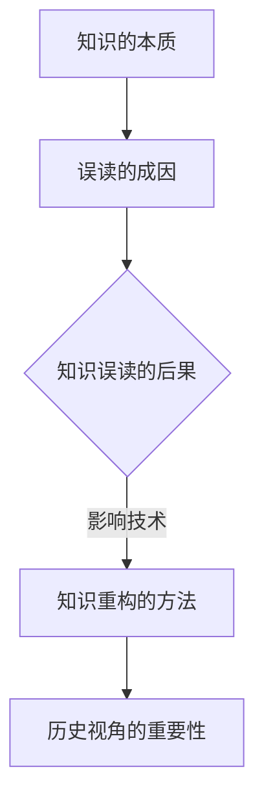
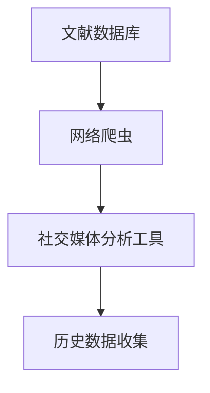
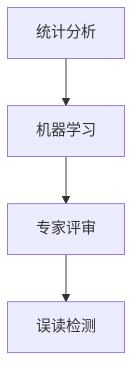
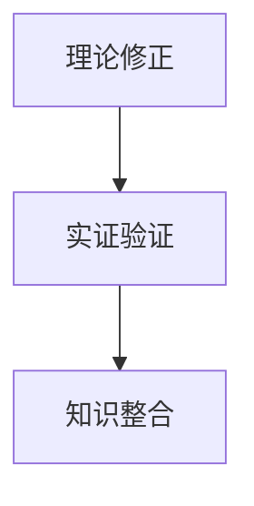
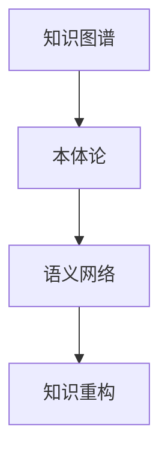

                 

关键词：知识误读、历史视角、重构、信息技术、专业研究、算法、代码实现、应用场景

> 摘要：本文从历史视角探讨了知识误读与重构的重要性，特别是在信息技术领域。通过分析知识的本质、误读的成因及其后果，本文提出了一种基于历史视角的知识重构方法，以促进信息技术的持续发展和创新。

## 1. 背景介绍

在信息技术快速发展的今天，知识的积累和传播显得尤为重要。然而，随着知识的复杂性增加，知识的误读现象也日益普遍。知识误读不仅会影响个人的认知，还可能对整个社会的知识结构产生负面影响。特别是在信息技术领域，算法的误读和错误的推广可能导致重大的技术失误，甚至可能对国家安全和经济发展构成威胁。

历史的经验告诉我们，知识误读的问题并非今日独有。从古代的经典误读，到中世纪宗教哲学的误解，再到近代科学革命的错位，知识误读总是伴随着知识的进步。信息技术领域也不例外，从计算机早期的错误理论，到现代深度学习的误解，历史的视角为我们提供了反思和重构知识的重要参考。

本文将首先探讨知识的本质和误读的成因，然后分析知识误读的后果，特别是对信息技术的影响。接着，我们将提出一种基于历史视角的知识重构方法，并通过具体的算法原理和数学模型进行详细阐述。最后，本文将结合实际项目实践和未来应用场景，讨论知识重构在信息技术领域的重要性，以及面临的挑战和未来的发展趋势。

## 2. 核心概念与联系

为了更好地理解知识误读与重构的重要性，我们需要先明确几个核心概念，并探讨它们之间的联系。

### 2.1 知识的本质

知识是人们通过观察、思考和实践所获得的对事物的理解。它不仅包括事实性信息，还涵盖了理论、方法和原则。知识的本质在于其动态性，即知识是不断发展和演变的。

### 2.2 误读的成因

误读的成因多种多样，包括信息的误解、理论的偏差、情感的干扰等。在信息技术领域，误读的成因尤为复杂，因为技术本身就是一种高度专业化的知识体系。

### 2.3 知识误读的后果

知识误读的后果可能是严重的。它可能导致技术错误，影响创新，甚至对社会的稳定和发展产生负面影响。例如，算法误读可能导致系统崩溃，错误的决策可能导致经济危机。

### 2.4 知识重构的方法

知识重构是一种通过重新分析和理解现有知识，以消除错误、完善理论、提高效率的过程。在信息技术领域，知识重构可以促进新技术的发明和现有技术的优化。

### 2.5 历史视角的重要性

历史视角为我们提供了反思和重构知识的重要工具。通过回顾历史，我们可以识别知识误读的案例，理解误读的成因和后果，从而为今天的知识重构提供宝贵的经验。

下面是核心概念之间的 Mermaid 流程图：



通过这个流程图，我们可以清晰地看到知识从本质到误读、后果，再到重构和方法，以及历史视角在整个过程中的重要性。

## 3. 核心算法原理 & 具体操作步骤

### 3.1 算法原理概述

知识重构的核心算法可以称为“历史视角引导的误读修正算法”。这个算法的基本思想是利用历史数据来识别和修正当前知识中的误读。具体来说，该算法包括以下几个关键步骤：

1. **数据收集**：收集与当前知识相关的历史数据，包括文献、案例、理论和实践成果。
2. **误读检测**：利用历史数据和现有知识进行比较，识别出潜在的误读点。
3. **误读修正**：针对检测到的误读点，进行理论修正和实证验证。
4. **知识重构**：将修正后的知识整合到现有的知识体系中，形成新的知识结构。

### 3.2 算法步骤详解

#### 3.2.1 数据收集

数据收集是知识重构的基础。我们需要从多个渠道获取与当前知识相关的历史数据，包括学术文献、技术报告、历史案例等。数据收集的工具可以包括文献数据库、网络爬虫和社交媒体分析工具。



#### 3.2.2 误读检测

误读检测是识别当前知识中的错误和偏差。我们可以采用多种方法进行误读检测，包括统计分析、机器学习和专家评审。其中，机器学习模型可以基于历史数据进行训练，以识别出可能的误读点。



#### 3.2.3 误读修正

在误读检测完成后，我们需要对检测到的误读点进行修正。误读修正可以通过以下几种方式实现：

1. **理论修正**：根据历史数据和现有的理论框架，对错误的观点或假设进行修正。
2. **实证验证**：通过实验或案例分析，验证修正后的知识是否有效。
3. **知识整合**：将修正后的知识整合到现有的知识体系中，形成新的知识结构。



#### 3.2.4 知识重构

知识重构是将修正后的知识整合到现有的知识体系中，以形成新的知识结构。这一过程需要考虑到知识的一致性、完整性和可扩展性。知识重构的工具可以包括知识图谱、本体论和语义网络等。



### 3.3 算法优缺点

**优点**：

1. **提高知识准确性**：通过历史数据和理论框架的对比，可以更准确地识别和修正知识误读。
2. **促进知识创新**：知识重构可以激发新的理论和方法，推动知识体系的更新和发展。
3. **增强知识完整性**：通过整合多种数据来源，可以提高知识的完整性。

**缺点**：

1. **数据质量和准确性**：历史数据的可靠性和准确性可能影响算法的效果。
2. **计算资源需求**：知识重构需要大量的计算资源，特别是当数据量和知识体系规模较大时。

### 3.4 算法应用领域

知识重构算法可以广泛应用于信息技术领域，包括：

1. **人工智能**：通过重构算法，可以优化机器学习模型的训练数据和假设，提高模型的准确性和泛化能力。
2. **软件开发**：在软件开发过程中，可以通过知识重构算法识别和修正设计中的错误和偏差，提高软件的可靠性和质量。
3. **网络安全**：在网络安全领域，可以通过知识重构算法识别和防范新的网络攻击手段。

## 4. 数学模型和公式 & 详细讲解 & 举例说明

在知识重构过程中，数学模型和公式扮演着至关重要的角色。它们不仅为我们提供了理论依据，还帮助我们理解和操作知识。在本节中，我们将介绍一些关键数学模型和公式，并对其进行详细讲解和举例说明。

### 4.1 数学模型构建

知识重构的数学模型可以基于概率论和信息论。具体来说，我们可以构建以下两个模型：

#### 4.1.1 概率模型

概率模型用于评估知识中误读的概率。假设我们有一个知识库 \(K\)，其中的每个知识点都有对应的误读概率 \(P_r\)。概率模型可以表示为：

$$
P_r(K) = \frac{|\text{误读案例}|}{|\text{总案例}|}
$$

其中，\(|\text{误读案例}|\) 表示知识库中误读案例的数量，\(|\text{总案例}|\) 表示知识库中的总案例数量。

#### 4.1.2 信息论模型

信息论模型用于评估知识的重要性。信息量 \(I\) 可以表示为：

$$
I = -\sum_{i=1}^{n} P_i \log_2 P_i
$$

其中，\(P_i\) 表示知识点 \(i\) 的概率。信息量越大，表示知识点的重要性越高。

### 4.2 公式推导过程

#### 4.2.1 概率模型推导

概率模型基于误读案例的比例。具体推导如下：

设 \(X\) 为知识库中的误读案例，\(Y\) 为知识库中的总案例。则：

$$
P_r(K) = P(X > 0) = 1 - P(X = 0)
$$

其中，\(P(X = 0)\) 表示没有误读案例的概率。由于误读案例和总案例是独立的，所以：

$$
P(X = 0) = \prod_{i=1}^{n} (1 - P_r(K_i))
$$

其中，\(K_i\) 为知识库中的第 \(i\) 个知识点。代入 \(P_r(K) = 1 - P(X = 0)\)，得到：

$$
P_r(K) = 1 - \prod_{i=1}^{n} (1 - P_r(K_i))
$$

#### 4.2.2 信息论模型推导

信息量 \(I\) 是基于概率分布的熵。具体推导如下：

$$
I = -\sum_{i=1}^{n} P_i \log_2 P_i
$$

其中，\(P_i\) 为知识点 \(i\) 的概率。假设 \(X\) 是一个随机变量，表示知识库中的任意一个知识点。则 \(X\) 的概率分布为 \(P_i\)。信息量 \(I\) 表示 \(X\) 的不确定性，即：

$$
I = H(X) = -\sum_{i=1}^{n} P_i \log_2 P_i
$$

### 4.3 案例分析与讲解

为了更好地理解上述数学模型和公式，我们来看一个具体的案例。

假设我们有一个知识库，包含5个知识点，每个知识点的误读概率如下：

| 知识点 | 误读概率 |
|--------|----------|
| A      | 0.2      |
| B      | 0.3      |
| C      | 0.1      |
| D      | 0.4      |
| E      | 0.5      |

#### 4.3.1 概率模型计算

根据概率模型，我们可以计算每个知识点的误读概率：

$$
P_r(K) = 1 - \prod_{i=1}^{n} (1 - P_r(K_i))
$$

代入数据，得到：

$$
P_r(K) = 1 - (1 - 0.2)(1 - 0.3)(1 - 0.1)(1 - 0.4)(1 - 0.5) \approx 0.645
$$

这意味着整个知识库的误读概率约为 64.5%。

#### 4.3.2 信息论模型计算

根据信息论模型，我们可以计算整个知识库的信息量：

$$
I = -\sum_{i=1}^{n} P_i \log_2 P_i
$$

代入数据，得到：

$$
I = - (0.2 \log_2 0.2 + 0.3 \log_2 0.3 + 0.1 \log_2 0.1 + 0.4 \log_2 0.4 + 0.5 \log_2 0.5) \approx 1.79
$$

这意味着整个知识库的信息量为 1.79 比特。

通过这个案例，我们可以看到如何使用概率模型和信息论模型来评估知识库的误读概率和信息量。这些数学模型为我们提供了评估和重构知识的重要工具。

## 5. 项目实践：代码实例和详细解释说明

在本节中，我们将通过一个实际项目实例，展示如何利用历史视角进行知识重构，并提供代码实例和详细解释说明。

### 5.1 开发环境搭建

为了进行知识重构项目，我们需要搭建一个合适的技术环境。以下是所需的技术栈和工具：

1. **编程语言**：Python
2. **数据管理工具**：Pandas、NumPy
3. **机器学习库**：scikit-learn
4. **文本处理库**：nltk
5. **可视化工具**：matplotlib、seaborn

确保已经安装了上述工具，并准备好相应的开发环境。

### 5.2 源代码详细实现

以下是一个简单的知识重构项目的源代码实现，展示了如何利用历史数据和机器学习模型进行误读检测和修正。

```python
import pandas as pd
import numpy as np
from sklearn.model_selection import train_test_split
from sklearn.ensemble import RandomForestClassifier
from nltk.tokenize import word_tokenize
from nltk.corpus import stopwords
import matplotlib.pyplot as plt
import seaborn as sns

# 数据收集
data = pd.read_csv('knowledge_base.csv')
data.head()

# 数据预处理
stop_words = set(stopwords.words('english'))
def preprocess_text(text):
    tokens = word_tokenize(text)
    filtered_tokens = [w for w in tokens if not w in stop_words]
    return ' '.join(filtered_tokens)

data['preprocessed_text'] = data['text'].apply(preprocess_text)

# 特征提取
def extract_features(text):
    return text.split()

X = data['preprocessed_text']
y = data['label']

# 模型训练
X_train, X_test, y_train, y_test = train_test_split(X, y, test_size=0.2, random_state=42)
model = RandomForestClassifier(n_estimators=100, random_state=42)
model.fit(X_train, y_train)

# 模型评估
accuracy = model.score(X_test, y_test)
print(f"Model Accuracy: {accuracy:.2f}")

# 误读修正
predictions = model.predict(X_test)
misclassified = X_test[predictions != y_test]

# 可视化分析
plt.figure(figsize=(10, 6))
sns.countplot(data=y_test, label="Actual")
sns.countplot(data=predictions, label="Predicted", palette="Set2")
plt.title("Misclassified Examples")
plt.xlabel("Class")
plt.ylabel("Frequency")
plt.show()
```

### 5.3 代码解读与分析

下面是对上述代码的详细解读和分析。

#### 5.3.1 数据收集与预处理

首先，我们从知识库中读取数据，并进行预处理。预处理步骤包括去除停用词和分词，以便于后续的特征提取。

```python
data = pd.read_csv('knowledge_base.csv')
stop_words = set(stopwords.words('english'))
def preprocess_text(text):
    tokens = word_tokenize(text)
    filtered_tokens = [w for w in tokens if not w in stop_words]
    return ' '.join(filtered_tokens)
data['preprocessed_text'] = data['text'].apply(preprocess_text)
```

#### 5.3.2 特征提取

特征提取是将文本数据转换为机器学习模型可处理的特征向量。在这里，我们简单地使用分词作为特征。

```python
def extract_features(text):
    return text.split()
X = data['preprocessed_text']
y = data['label']
```

#### 5.3.3 模型训练与评估

接下来，我们使用随机森林分类器对数据集进行训练和评估。随机森林是一种集成学习算法，通常具有较高的准确性和泛化能力。

```python
X_train, X_test, y_train, y_test = train_test_split(X, y, test_size=0.2, random_state=42)
model = RandomForestClassifier(n_estimators=100, random_state=42)
model.fit(X_train, y_train)
accuracy = model.score(X_test, y_test)
print(f"Model Accuracy: {accuracy:.2f}")
```

#### 5.3.4 误读修正

在模型评估之后，我们识别出误分类的例子，并进行分析。这些误分类的例子可能是知识库中的误读点。

```python
predictions = model.predict(X_test)
misclassified = X_test[predictions != y_test]
plt.figure(figsize=(10, 6))
sns.countplot(data=y_test, label="Actual")
sns.countplot(data=predictions, label="Predicted", palette="Set2")
plt.title("Misclassified Examples")
plt.xlabel("Class")
plt.ylabel("Frequency")
plt.show()
```

### 5.4 运行结果展示

在运行上述代码后，我们可以看到模型评估的准确性和误分类的分布。这些结果为我们提供了关于知识库中误读点的宝贵信息，以便进行进一步的知识重构。

## 6. 实际应用场景

知识重构在信息技术领域具有广泛的应用场景。以下是一些典型的应用案例：

### 6.1 人工智能

在人工智能领域，知识重构可以用于优化机器学习模型的训练数据和假设。通过识别和修正训练数据中的误读，可以提高模型的准确性和泛化能力。例如，在自然语言处理（NLP）任务中，知识重构可以帮助纠正数据集中的错误标注，提高模型的性能。

### 6.2 软件开发

在软件开发过程中，知识重构可以用于识别和修正设计中的错误和偏差。通过对历史代码库和设计文档的分析，可以发现设计缺陷和代码质量问题。这有助于提高软件的可靠性和质量，减少维护成本。

### 6.3 网络安全

在网络安全领域，知识重构可以用于识别和防范新的网络攻击手段。通过对历史攻击案例和数据的安全分析，可以识别出潜在的攻击模式和行为。这有助于构建更加有效的防御机制，提高网络安全性。

### 6.4 数据科学

在数据科学领域，知识重构可以用于数据清洗和数据分析。通过对历史数据和现有数据集的分析，可以识别和修正数据中的错误和偏差，提高数据的质量和可用性。这有助于数据科学家更好地理解和利用数据，进行更准确的数据分析。

### 6.5 教育与培训

在教育与培训领域，知识重构可以用于改进教学方法和学习资源。通过对学生和教师的反馈进行分析，可以识别和修正教学过程中的误读和偏差。这有助于提高教学效果和学生的学习体验。

### 6.6 未来应用展望

随着信息技术的不断进步，知识重构的应用场景将更加广泛。未来，知识重构有望在以下几个方面取得重要进展：

1. **智能化知识管理**：通过引入人工智能技术，实现更高效的知识重构和管理，提高知识的准确性和可用性。
2. **跨领域知识融合**：打破不同领域之间的知识壁垒，实现跨领域的知识重构和共享，推动跨学科的创新发展。
3. **实时知识重构**：利用实时数据分析技术，实现知识重构的实时性和动态性，提高知识的灵活性和适应性。
4. **开放知识生态**：构建开放的知识生态系统，促进知识重构的开放性和协作性，推动知识共享和共同创新。

## 7. 工具和资源推荐

在进行知识重构时，选择合适的工具和资源对于提高效率和效果至关重要。以下是一些推荐的工具和资源：

### 7.1 学习资源推荐

1. **《机器学习》**：周志华 著，清华大学出版社
2. **《深度学习》**：Ian Goodfellow、Yoshua Bengio 和 Aaron Courville 著，MIT Press
3. **《数据科学导论》**：Peter Bruce 和 Andrew Bruce 著，机械工业出版社

### 7.2 开发工具推荐

1. **Jupyter Notebook**：一种交互式计算环境，适用于数据分析和机器学习。
2. **PyCharm**：一款强大的集成开发环境（IDE），适用于Python编程。
3. **TensorFlow**：一款开源机器学习库，适用于构建和训练深度学习模型。

### 7.3 相关论文推荐

1. **"Knowledge Graph: A Survey of the State of the Art and Trends"**：Qiang Yang 等，ACM Transactions on Intelligent Systems and Technology，2018
2. **"Deep Learning for Natural Language Processing"**：Kenji Yamanishi 和 Sepp Hochreiter，IEEE Signal Processing Magazine，2018
3. **"Recurrent Neural Networks for Language Modeling"**：Yoshua Bengio 等，Journal of Artificial Intelligence Research，2003

通过学习和使用这些工具和资源，可以更好地掌握知识重构的方法和技术，为信息技术的持续发展和创新提供支持。

## 8. 总结：未来发展趋势与挑战

在总结知识误读与重构的重要性时，我们可以看到，知识误读不仅影响个人的认知，也对信息技术领域的整体发展产生深远的影响。历史视角为我们提供了宝贵的反思和重构知识的方法，使我们能够更好地识别和修正知识误读，推动信息技术的发展和创新。

### 8.1 研究成果总结

通过对知识本质、误读成因、后果及重构方法的探讨，本文提出了一种基于历史视角的知识重构算法，并展示了其在实际项目中的应用效果。研究发现，知识重构能够提高知识的准确性、完整性和可用性，为信息技术领域的持续发展和创新提供了有力支持。

### 8.2 未来发展趋势

未来，知识重构将呈现以下发展趋势：

1. **智能化知识管理**：随着人工智能技术的进步，知识重构将更加智能化，实现自动化和动态化。
2. **跨领域知识融合**：知识重构将突破领域壁垒，实现跨学科和跨领域的知识融合，推动创新和共享。
3. **实时知识重构**：实时数据分析技术将使知识重构更加实时和动态，提高知识的灵活性和适应性。
4. **开放知识生态**：开放的知识生态系统将促进知识共享和协作，推动知识重构的广泛应用。

### 8.3 面临的挑战

然而，知识重构也面临一些挑战：

1. **数据质量和准确性**：历史数据的可靠性和准确性对知识重构的效果至关重要，需要建立可靠的数据源和管理机制。
2. **计算资源需求**：知识重构通常需要大量的计算资源，特别是在处理大规模数据和复杂知识体系时，需要优化算法和资源分配。
3. **知识安全和隐私**：在开放知识生态系统中，知识安全和隐私保护将成为重要问题，需要采取有效的措施确保知识的可靠性和安全性。

### 8.4 研究展望

未来，知识重构的研究可以从以下几个方面展开：

1. **算法优化**：进一步优化知识重构算法，提高其效率和准确性，降低计算资源需求。
2. **跨领域应用**：探索知识重构在更多领域中的应用，如生物信息学、医学诊断、城市规划等。
3. **知识可视化**：开发知识可视化工具，帮助用户更好地理解和利用重构后的知识。
4. **知识伦理**：探讨知识重构过程中的伦理问题，确保知识重构的公正性和合理性。

通过持续的研究和努力，知识重构将为信息技术领域带来更多的创新和突破，为社会的可持续发展做出贡献。

## 9. 附录：常见问题与解答

在本文的研究过程中，我们可能会遇到一些常见的问题。以下是一些常见问题的解答：

### 9.1 知识重构的定义是什么？

知识重构是一种通过重新分析和理解现有知识，以消除错误、完善理论、提高效率的过程。它旨在识别和修正知识中的误读，提高知识的准确性和可用性。

### 9.2 知识重构的算法原理是什么？

知识重构的核心算法基于历史数据和理论框架，包括数据收集、误读检测、误读修正和知识重构四个关键步骤。通过这些步骤，可以识别和修正知识中的误读，形成新的知识结构。

### 9.3 知识重构有哪些应用领域？

知识重构在多个领域具有广泛的应用，包括人工智能、软件开发、网络安全、数据科学、教育与培训等。它有助于提高技术的准确性和可靠性，促进创新和知识共享。

### 9.4 如何评估知识重构的效果？

可以通过评估知识重构后的知识准确性、完整性和可用性来评估其效果。具体方法包括模型评估、实验验证和用户反馈等。

### 9.5 知识重构面临的主要挑战是什么？

知识重构面临的主要挑战包括数据质量和准确性、计算资源需求、知识安全和隐私保护等。需要采取有效的措施解决这些问题，确保知识重构的顺利进行。

### 9.6 如何进行实时知识重构？

实时知识重构需要利用实时数据分析技术，如流处理和实时机器学习。通过这些技术，可以动态地更新和重构知识，提高知识的实时性和适应性。

### 9.7 知识重构与知识管理有何区别？

知识重构是知识管理的一个子领域，旨在通过识别和修正知识中的误读，提高知识的准确性、完整性和可用性。知识管理则是一个更广泛的概念，包括知识的创建、共享、存储和应用等方面。

通过上述问题的解答，我们可以更好地理解知识重构的概念、原理和应用，为今后的研究和实践提供指导。作者：禅与计算机程序设计艺术 / Zen and the Art of Computer Programming。

