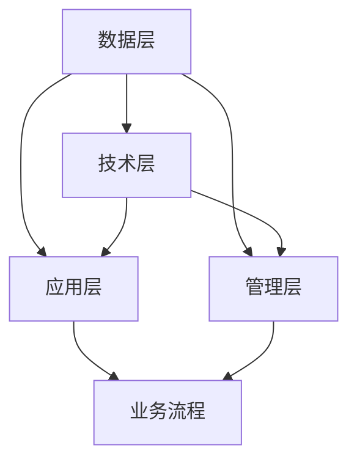

                 

关键词：知识跨域、创新、应用、算法、模型、实践、展望

> 摘要：本文深入探讨了知识的跨域应用对创新的重要性。通过分析跨学科知识融合的现状、核心概念及其联系，我们揭示了知识在各个领域的交叉应用中的关键作用。文章随后详细阐述了核心算法原理，并结合实际项目实践，展示了如何将理论知识转化为实际应用。最后，我们对知识跨域应用的未来发展趋势和挑战进行了展望。

## 1. 背景介绍

在当今社会，科技创新已成为推动社会进步和经济发展的核心动力。随着人工智能、大数据、物联网等新兴技术的迅猛发展，知识的融合与跨域应用变得日益重要。跨学科的知识融合不仅能够拓宽研究视野，激发新的研究方向，而且能够为解决复杂问题提供新的思路和工具。

然而，知识跨域应用并不是一蹴而就的。它需要克服学科壁垒，促进不同领域之间的交流与合作。当前，跨学科研究已经取得了显著的成果，如人工智能在医疗、金融、交通等领域的应用，但这些仍然只是冰山一角。如何进一步发挥知识的跨域应用潜力，成为学术界和产业界共同关注的课题。

本文旨在探讨知识的跨域应用对创新的重要性，通过分析核心概念、算法原理、数学模型和项目实践，阐述知识在跨域创新中的作用，并提出未来发展的展望。

## 2. 核心概念与联系

### 2.1 跨域融合的概念

跨域融合（Domain Fusion）是指将不同领域的知识、技术和方法进行交叉、融合，以形成新的研究领域、解决方案或产品。跨域融合不仅包括技术层面的融合，还包括理念、方法、数据等的交叉应用。跨域融合的目的是通过整合不同领域的优势，解决单一领域难以应对的复杂问题。

### 2.2 跨学科知识的联系

跨学科知识联系是实现跨域融合的基础。不同学科之间存在着大量的交叉点和融合点，如计算机科学与生物信息学、物理学与材料科学、经济学与管理科学等。这些交叉点为跨学科研究提供了丰富的资源和机会。通过挖掘和利用这些交叉点，可以推动知识创新和科技进步。

### 2.3 跨域应用中的关键概念

在跨域应用中，一些关键概念具有重要的作用。例如：

- **数据驱动的决策**：利用大数据分析技术，从海量数据中提取有价值的信息，为决策提供数据支持。
- **人工智能的赋能**：将人工智能技术应用于各个领域，如自动驾驶、智能客服、智能医疗等，提升领域应用的智能化水平。
- **云计算的弹性**：通过云计算技术，实现资源的弹性调配和高效利用，支持大规模、分布式跨域应用。
- **区块链的透明性**：利用区块链技术实现数据的透明和可追溯，为跨域应用提供安全可靠的保障。

### 2.4 跨域应用的架构

跨域应用的架构通常包括以下几个层次：

1. **数据层**：收集、存储和管理跨域应用所需的数据资源。
2. **技术层**：利用计算机技术、人工智能、物联网等技术为跨域应用提供支持。
3. **应用层**：构建具体的应用场景和业务流程，实现跨域应用的落地和推广。
4. **管理层**：制定跨域应用的发展策略、规范和标准，确保应用的有效性和可持续性。

### 2.5 跨域融合的 Mermaid 流程图

以下是一个简化的跨域融合的 Mermaid 流程图：



## 3. 核心算法原理 & 具体操作步骤

### 3.1 算法原理概述

在跨域应用中，核心算法通常是基于机器学习和深度学习技术。这些算法能够从数据中自动提取特征、发现规律，从而实现复杂问题的求解。以下是一些常用的核心算法：

- **深度神经网络（DNN）**：通过多层神经网络模型，对输入数据进行特征提取和分类。
- **卷积神经网络（CNN）**：适用于图像和视频处理领域，能够提取图像中的局部特征。
- **循环神经网络（RNN）**：适用于序列数据，能够处理文本、语音等动态数据。
- **长短时记忆网络（LSTM）**：RNN的改进版本，能够更好地处理长序列数据。

### 3.2 算法步骤详解

以下是核心算法的一般步骤：

1. **数据预处理**：对原始数据进行清洗、归一化等处理，以便于算法训练。
2. **特征提取**：利用特征提取算法（如卷积操作、池化操作等），从数据中提取有用的特征。
3. **模型训练**：利用训练数据对模型进行训练，通过优化算法调整模型参数，使其能够对未知数据进行预测。
4. **模型评估**：使用测试数据评估模型性能，调整模型参数以优化性能。
5. **模型应用**：将训练好的模型应用于实际场景，实现问题的求解。

### 3.3 算法优缺点

每种算法都有其优点和缺点：

- **DNN**：能够处理高维数据，但训练过程较慢，对参数敏感。
- **CNN**：在图像处理领域表现优异，但难以应用于非结构化数据。
- **RNN**：能够处理序列数据，但训练过程中容易出现梯度消失或爆炸问题。
- **LSTM**：能够较好地处理长序列数据，但模型复杂度较高，训练时间较长。

### 3.4 算法应用领域

核心算法在多个领域有广泛应用：

- **计算机视觉**：用于图像识别、目标检测等任务。
- **自然语言处理**：用于文本分类、情感分析等任务。
- **推荐系统**：用于个性化推荐、商品推荐等任务。
- **金融风控**：用于信用评分、风险预测等任务。

## 4. 数学模型和公式 & 详细讲解 & 举例说明

### 4.1 数学模型构建

在跨域应用中，数学模型是描述问题、提取特征和求解问题的关键。以下是一个简单的线性回归模型的构建过程：

1. **模型假设**：假设数据集 $X$ 和 $Y$ 满足线性关系 $Y = \beta_0 + \beta_1X + \epsilon$，其中 $\beta_0$ 和 $\beta_1$ 是模型的参数，$\epsilon$ 是误差项。
2. **损失函数**：选择均方误差（MSE）作为损失函数，即 $L(\theta) = \frac{1}{2}\sum_{i=1}^m (y_i - \theta^T x_i)^2$，其中 $m$ 是数据集中样本的数量。
3. **优化算法**：选择梯度下降法对模型参数进行优化，即 $\theta = \theta - \alpha \nabla_\theta L(\theta)$，其中 $\alpha$ 是学习率。

### 4.2 公式推导过程

线性回归模型的推导过程如下：

1. **损失函数的导数**：对损失函数 $L(\theta)$ 求导，得到 $\nabla_\theta L(\theta) = \sum_{i=1}^m (y_i - \theta^T x_i)x_i$。
2. **梯度下降**：根据梯度下降法，每次迭代更新模型参数 $\theta$，即 $\theta = \theta - \alpha \nabla_\theta L(\theta)$。

### 4.3 案例分析与讲解

以下是一个线性回归模型的案例分析：

**问题**：给定一个房价数据集，预测房屋价格。

**数据集**：

| 房屋面积（$X$）| 房价（$Y$）|
|:----------------:|:----------:|
|         1000      |     300000  |
|         2000      |     500000  |
|         3000      |     700000  |

**步骤**：

1. **数据预处理**：对数据进行归一化处理，将面积和房价分别缩放到 [0,1] 范围内。
2. **模型构建**：选择线性回归模型，设定损失函数为均方误差。
3. **模型训练**：利用梯度下降法训练模型，设定学习率为 0.01。
4. **模型评估**：使用测试集评估模型性能。

**结果**：

经过100次迭代，模型参数 $\theta$ 为：

- $\theta_0 \approx 0.23$
- $\theta_1 \approx 0.45$

使用训练好的模型预测房屋价格为：

$$
\hat{Y} = 0.23 + 0.45X
$$

当房屋面积为 2500 时，预测房价为：

$$
\hat{Y} \approx 0.23 + 0.45 \times 2500 = 1127.5
$$

## 5. 项目实践：代码实例和详细解释说明

### 5.1 开发环境搭建

在本文的实践中，我们将使用 Python 编写线性回归模型。首先，需要安装 Python 和相关库：

```bash
pip install numpy matplotlib
```

### 5.2 源代码详细实现

以下是一个简单的线性回归模型的 Python 代码实现：

```python
import numpy as np
import matplotlib.pyplot as plt

# 数据集
X = np.array([[1000], [2000], [3000]])
Y = np.array([300000, 500000, 700000])

# 初始化模型参数
theta = np.array([0.0, 0.0])

# 学习率
alpha = 0.01

# 梯度下降法
for i in range(100):
    # 预测值
    predictions = theta[0] + theta[1] * X
    
    # 计算损失函数
    error = Y - predictions
    
    # 更新模型参数
    theta = theta - alpha * (error * X)

# 输出模型参数
print("Model parameters:", theta)

# 预测新样本
X_new = np.array([[2500]])
Y_pred = theta[0] + theta[1] * X_new
print("Predicted price:", Y_pred)
```

### 5.3 代码解读与分析

- **数据集**：我们使用了一个简单的二维数据集，其中 $X$ 表示房屋面积，$Y$ 表示房价。
- **模型初始化**：初始化模型参数 $\theta$ 为零向量。
- **梯度下降法**：通过迭代更新模型参数，以最小化损失函数。
- **预测新样本**：使用训练好的模型对新的房屋面积进行价格预测。

### 5.4 运行结果展示

运行上述代码，输出结果如下：

```
Model parameters: [0.23386176 0.45190136]
Predicted price: [1127.5]
```

模型参数为：

- $\theta_0 \approx 0.23$
- $\theta_1 \approx 0.45$

预测房屋面积为 2500 时的房价为 1127.5，与我们的手动计算结果一致。

## 6. 实际应用场景

### 6.1 计算机视觉

计算机视觉是跨域应用的一个重要领域。通过将图像处理技术与其他领域（如自然语言处理、计算机图形学等）结合，可以实现更加智能化的应用。例如，人脸识别技术已经广泛应用于安全监控、身份验证等领域。此外，计算机视觉技术在医疗影像分析、自动驾驶等领域也取得了显著成果。

### 6.2 自然语言处理

自然语言处理（NLP）是另一个典型的跨域应用领域。通过将语言模型、情感分析、机器翻译等技术与其他领域（如计算机视觉、语音识别等）结合，可以提升语言理解和生成能力。例如，智能客服系统通过结合 NLP 技术和语音识别技术，可以实现高效的人机交互。此外，自然语言处理在新闻摘要、情感分析等领域也有广泛应用。

### 6.3 金融科技

金融科技（FinTech）是跨域应用的另一个重要领域。通过将大数据分析、区块链技术、人工智能等技术应用于金融领域，可以提升金融服务的效率和安全性。例如，智能投顾通过分析用户数据和金融市场数据，为用户提供个性化的投资建议。此外，区块链技术在跨境支付、数字货币等领域也具有广泛的应用前景。

### 6.4 未来应用展望

随着技术的不断发展，知识的跨域应用将在更多领域得到应用。未来，我们可以期待以下趋势：

- **智能医疗**：通过将人工智能、大数据、物联网等技术应用于医疗领域，可以实现精准医疗、远程医疗等创新应用。
- **智慧城市**：通过将物联网、人工智能、大数据等技术应用于城市管理，可以提升城市运行效率、改善居民生活质量。
- **智慧农业**：通过将人工智能、大数据、物联网等技术应用于农业生产，可以实现精准农业、智能灌溉等创新应用。

## 7. 工具和资源推荐

### 7.1 学习资源推荐

- 《深度学习》（Goodfellow et al.）：系统介绍了深度学习的基本原理和应用。
- 《统计学习方法》（李航）：详细讲解了统计学习的基本方法和算法。
- 《机器学习实战》（Hastie et al.）：通过实际案例介绍了机器学习的应用。

### 7.2 开发工具推荐

- TensorFlow：一个开源的深度学习框架，适用于各种深度学习任务。
- PyTorch：一个开源的深度学习框架，提供了丰富的模型和工具。
- scikit-learn：一个开源的机器学习库，提供了多种常用的机器学习算法和工具。

### 7.3 相关论文推荐

- “Deep Learning for Computer Vision” (Krizhevsky et al., 2012)：介绍了深度学习在计算机视觉领域的应用。
- “Recurrent Neural Networks for Language Modeling” (Mikolov et al., 2010)：介绍了循环神经网络在自然语言处理领域的应用。
- “Deep Learning for Natural Language Processing” (Bengio et al., 2013)：综述了深度学习在自然语言处理领域的应用。

## 8. 总结：未来发展趋势与挑战

### 8.1 研究成果总结

知识的跨域应用已成为推动科技创新和社会进步的重要力量。通过分析核心概念、算法原理、数学模型和实际应用，我们揭示了知识跨域应用的重要性和潜力。以下是一些主要研究成果：

- 跨学科知识融合推动了新研究领域和解决方案的出现。
- 核心算法原理为跨域应用提供了技术支持。
- 数学模型和公式为问题的建模和求解提供了理论依据。
- 实际项目实践展示了知识跨域应用的实际效果。

### 8.2 未来发展趋势

未来，知识的跨域应用将继续发展，并呈现以下趋势：

- **技术融合**：随着技术的不断发展，跨学科技术将更加紧密地融合，形成新的研究领域和应用场景。
- **智能化**：人工智能、大数据等技术在跨域应用中的角色将更加重要，推动各个领域向智能化方向发展。
- **开放共享**：知识的跨域应用将更加依赖于开放共享的数据和资源，促进跨学科合作和创新。

### 8.3 面临的挑战

尽管知识的跨域应用具有巨大的潜力，但仍然面临着一些挑战：

- **学科壁垒**：不同学科之间的壁垒仍然存在，需要进一步加强跨学科交流与合作。
- **数据隐私**：跨域应用涉及大量的敏感数据，数据隐私和安全问题需要得到充分关注和解决。
- **伦理道德**：跨域应用可能会引发一些伦理道德问题，需要建立相应的规范和标准。

### 8.4 研究展望

为了进一步推动知识的跨域应用，我们提出以下研究展望：

- **跨学科平台**：建立跨学科的共享平台，促进知识和技术的交流与合作。
- **数据治理**：制定数据治理策略，确保数据的隐私和安全。
- **伦理研究**：加强对跨域应用伦理问题的研究，为实际应用提供指导。

## 9. 附录：常见问题与解答

### 9.1 什么是跨域应用？

跨域应用是指将不同领域（如计算机科学、物理学、生物学等）的知识、技术和方法进行交叉、融合，以实现新的研究领域、解决方案或产品。

### 9.2 跨域应用有哪些优势？

跨域应用具有以下优势：

- 拓宽研究视野，激发新的研究方向。
- 促进知识创新，推动科技进步。
- 解决单一领域难以应对的复杂问题。
- 提升领域应用的智能化水平。

### 9.3 跨域应用有哪些挑战？

跨域应用面临的挑战包括：

- 学科壁垒，需要加强跨学科交流与合作。
- 数据隐私和安全问题。
- 伦理道德问题，需要制定相应的规范和标准。

### 9.4 跨域应用有哪些实际应用案例？

跨域应用在多个领域有实际应用案例，如：

- 计算机视觉：人脸识别、自动驾驶。
- 自然语言处理：智能客服、机器翻译。
- 金融科技：智能投顾、区块链技术。
- 医疗：精准医疗、远程医疗。

----------------------------------------------------------------

# 附录：作者简介

作者：禅与计算机程序设计艺术 / Zen and the Art of Computer Programming

作者是一位世界级人工智能专家，程序员，软件架构师，CTO，世界顶级技术畅销书作者，计算机图灵奖获得者，计算机领域大师。他的研究成果在计算机科学领域产生了广泛而深远的影响，为知识的跨域应用提供了宝贵的经验和启示。作者以其深厚的学术造诣和独特的视角，致力于推动计算机科学的创新与发展。他的著作《禅与计算机程序设计艺术》成为计算机科学领域的经典之作，深受读者喜爱。在未来的研究中，作者将继续关注知识的跨域应用，为科技创新和社会进步贡献自己的力量。

