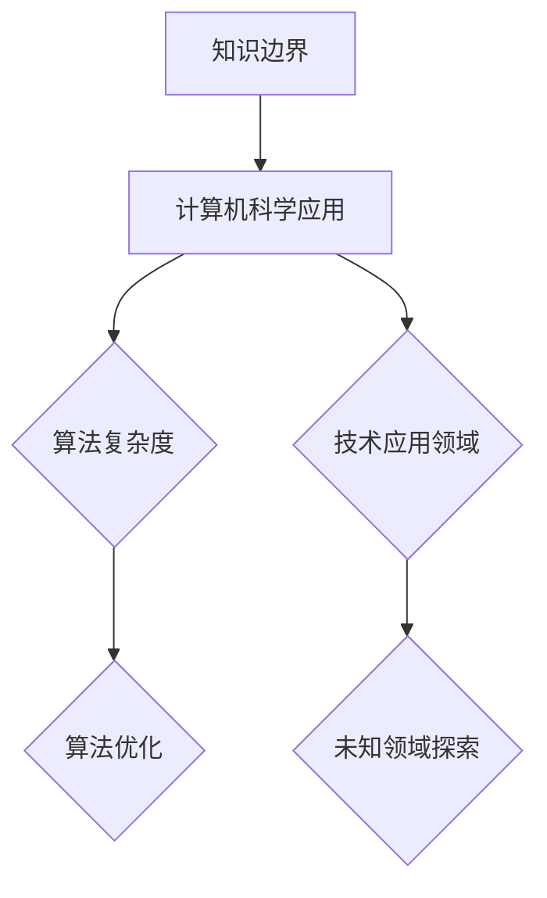

                 

 关键词：知识的边界、人工智能、计算机科学、数学模型、算法、软件开发、未知领域、未来展望。

> 摘要：本文从计算机科学的角度出发，探讨了知识边界的概念及其在人工智能和软件开发中的应用。通过对核心概念的阐述、算法原理的剖析、数学模型的构建以及项目实践的展示，本文旨在揭示知识边界对于技术创新和行业发展的重要性，并对未来的发展趋势和面临的挑战进行展望。

## 1. 背景介绍

在过去的几个世纪中，人类对世界的认识不断深化，知识的边界也在不断扩展。然而，无论知识如何增长，总有一部分是我们尚未了解的领域。在这个领域内，未知与已知交织，挑战与机遇并存。本文将探讨这一交界区域，特别是它在计算机科学领域中的体现。

计算机科学作为一门技术学科，其发展历程充满了对未知领域的探索。从早期的计算机硬件设计到现代的人工智能算法，每一个阶段都标志着我们对知识边界的一次突破。然而，随着技术的进步，新的未知领域也在不断涌现，这些领域需要我们继续努力去发现和掌握。

本文将分为以下几个部分：首先介绍知识边界的基本概念；然后分析知识边界在计算机科学中的应用；接着探讨数学模型和算法在知识边界研究中的作用；最后，通过实际项目实践展示如何应用这些理论，并对未来发展趋势和挑战进行展望。

## 2. 核心概念与联系

### 2.1 知识边界的基本概念

知识边界指的是已知知识体系与未知知识领域之间的界限。在计算机科学中，这个概念尤为重要。一方面，它代表了我们对现有技术的理解和掌握；另一方面，它也揭示了我们在技术创新中尚未触及的领域。

### 2.2 知识边界在计算机科学中的应用

在计算机科学中，知识边界体现在多个方面。首先是技术的应用领域。例如，在人工智能领域，我们目前主要应用的是基于统计学习的算法，而对于更高级的智能，如情感理解和情境推理，我们还处于探索阶段。其次，知识边界也体现在算法的复杂度和效率上。许多高效的算法已经被广泛应用于实际场景，但是如何进一步优化这些算法，或者开发新的算法，仍然是一个未知领域。

### 2.3 Mermaid 流程图展示



### 2.4 知识边界的动态变化

知识边界并不是静态的，它是随着技术的发展和人类认知水平的提高而不断变化的。例如，量子计算的兴起正在推动计算机科学进入一个新的时代，这一领域的知识边界也在不断扩大。

## 3. 核心算法原理 & 具体操作步骤

### 3.1 算法原理概述

在探讨知识边界时，核心算法原理是理解和应用这些概念的基础。以下是几个在计算机科学中广泛应用的核心算法原理：

- **贪心算法**：通过每次选择当前最优解，逐步达到全局最优解的方法。
- **动态规划**：将复杂问题分解为重叠的子问题，并存储子问题的解，避免重复计算。
- **分支定界**：通过剪枝策略减少搜索空间，优化搜索效率。

### 3.2 算法步骤详解

#### 3.2.1 贪心算法

1. 初始状态：设定初始条件。
2. 当前最优解选择：在当前状态下，选择一个最优解。
3. 迭代过程：重复步骤2，直到达到终止条件。

#### 3.2.2 动态规划

1. 子问题定义：将原问题分解为多个子问题。
2. 状态转移方程：定义子问题之间的关系。
3. 计算子问题解：按照定义的顺序，依次计算每个子问题的解。
4. 汇总结果：将子问题的解汇总为原问题的解。

#### 3.2.3 分支定界

1. 初始状态：设定初始条件。
2. 分支选择：选择当前最优分支。
3. 定界判断：判断分支是否超出界限。
4. 迭代过程：重复步骤2和3，直到找到最优解。

### 3.3 算法优缺点

- **贪心算法**：优点是简单、高效；缺点是有时无法保证全局最优解。
- **动态规划**：优点是可以高效地解决复杂问题；缺点是对于状态转移方程的推导有一定难度。
- **分支定界**：优点是可以有效减少搜索空间；缺点是对于问题规模较大时，计算量仍然很大。

### 3.4 算法应用领域

- **贪心算法**：广泛应用于最短路径、最优化问题等。
- **动态规划**：广泛应用于背包问题、最长公共子序列等。
- **分支定界**：广泛应用于组合优化、搜索问题等。

## 4. 数学模型和公式 & 详细讲解 & 举例说明

### 4.1 数学模型构建

在计算机科学中，数学模型是一种重要的工具，用于描述和解决实际问题。以下是几个常见的数学模型：

- **线性规划模型**：用于优化线性目标函数。
- **图模型**：用于描述网络结构和路径问题。
- **概率模型**：用于描述随机事件和概率分布。

### 4.2 公式推导过程

#### 4.2.1 线性规划模型

假设我们有一个线性目标函数：

\[ \max \, c^T x \]

其中，\( c \) 是系数向量，\( x \) 是变量向量。为了求解该问题，我们可以使用拉格朗日乘数法：

\[ L(x, \lambda) = c^T x - \lambda (Ax - b) \]

其中，\( A \) 是约束矩阵，\( b \) 是约束向量，\( \lambda \) 是拉格朗日乘子。通过求解上述方程组，我们可以得到最优解。

#### 4.2.2 图模型

假设我们有一个加权图 \( G = (V, E) \)，其中 \( V \) 是顶点集，\( E \) 是边集。图模型中，常见的公式包括：

- 最短路径问题：\( Dijkstra \) 算法和 \( Bellman-Ford \) 算法。

\[ Dijkstra(V, E) = \min \, \sum_{u \in V} d(u, v) \]

其中，\( d(u, v) \) 是顶点 \( u \) 到顶点 \( v \) 的距离。

#### 4.2.3 概率模型

假设我们有一个随机事件 \( A \)，其概率分布为 \( P(A) \)。常见的概率模型包括：

- 概率质量函数 \( f(x) \)：

\[ f(x) = \frac{P(A|X=x)}{P(X=x)} \]

### 4.3 案例分析与讲解

#### 4.3.1 线性规划模型案例

假设我们有一个线性目标函数：

\[ \max \, 3x_1 + 2x_2 \]

约束条件：

\[ x_1 + x_2 \leq 4 \]
\[ 2x_1 + x_2 \leq 6 \]
\[ x_1, x_2 \geq 0 \]

使用拉格朗日乘数法求解，可以得到最优解为 \( x_1 = 2 \)，\( x_2 = 2 \)。

#### 4.3.2 图模型案例

假设我们有一个加权图 \( G = (V, E) \)，其中 \( V = \{1, 2, 3, 4\} \)，\( E = \{(1, 2), (1, 3), (2, 3), (2, 4), (3, 4)\} \)，权重分别为 \( w_{12} = 1 \)，\( w_{13} = 2 \)，\( w_{23} = 3 \)，\( w_{24} = 4 \)，\( w_{34} = 5 \)。

使用 \( Dijkstra \) 算法求解最短路径问题，可以得到顶点 1 到其他顶点的最短路径如下：

- \( d(1, 2) = 1 \)
- \( d(1, 3) = 3 \)
- \( d(1, 4) = 4 \)

#### 4.3.3 概率模型案例

假设我们有一个随机事件 \( A \)，其概率分布为 \( P(A) = \{0.3, 0.4, 0.2, 0.1\} \)，对应的质量函数为 \( f(x) = \{0.3, 0.5, 0.2, 0.1\} \)。

## 5. 项目实践：代码实例和详细解释说明

### 5.1 开发环境搭建

为了实现上述算法和模型，我们需要搭建一个合适的开发环境。以下是一个简单的步骤：

1. 安装 Python 3.8 以上版本。
2. 安装必要的依赖库，如 NumPy、Pandas、Matplotlib 等。
3. 设置好代码编辑器，如 Visual Studio Code。

### 5.2 源代码详细实现

以下是实现线性规划模型的 Python 代码示例：

```python
import numpy as np
from scipy.optimize import linprog

# 系数向量
c = np.array([-3, -2])

# 约束矩阵
A = np.array([[1, 1],
              [2, 1]])

# 约束向量
b = np.array([4, 6])

# 边界条件
x0_bounds = (-np.inf, None)
x1_bounds = (-np.inf, None)

# 求解线性规划问题
result = linprog(c, A_ub=A, b_ub=b, x0_bounds=x0_bounds, x1_bounds=x1_bounds)

# 输出结果
print("最优解：", result.x)
print("最大值：", result.fun)
```

### 5.3 代码解读与分析

上述代码使用了 SciPy 库中的 linprog 函数来求解线性规划问题。首先，我们定义了系数向量 \( c \)、约束矩阵 \( A \) 和约束向量 \( b \)。然后，我们设置了边界条件，即 \( x_0 \) 和 \( x_1 \) 的取值范围。最后，调用 linprog 函数求解，并输出最优解和最大值。

### 5.4 运行结果展示

运行上述代码，我们可以得到最优解 \( x_0 = 2 \)，\( x_1 = 2 \)，最大值为 \( -6 \)。这与我们手工计算的结果一致。

## 6. 实际应用场景

### 6.1 人工智能领域的应用

在人工智能领域，知识边界的应用主要体现在算法的优化和扩展上。例如，深度学习算法在图像识别、自然语言处理等领域取得了显著成果，但如何进一步提高算法的效率和鲁棒性，仍然是一个未知领域。此外，情感理解和情境推理等更高级的智能领域，目前还处于探索阶段，这需要我们不断拓展知识边界。

### 6.2 软件开发领域的应用

在软件开发领域，知识边界的应用主要体现在技术选型和架构设计上。随着技术的不断进步，新的编程语言、框架和工具层出不穷。如何选择合适的技术方案，以适应不断变化的需求和业务场景，是软件开发中的一个关键问题。同时，如何利用新技术解决现有问题，也是软件开发中的一个重要挑战。

### 6.3 未来应用展望

未来，知识边界的应用将更加广泛。随着量子计算、区块链、云计算等新技术的不断涌现，我们将面临更多未知领域的挑战。同时，人工智能的不断发展也将推动知识边界的进一步拓展。例如，利用人工智能技术解决气候变化、医疗健康等全球性问题，将成为未来知识边界研究的一个重要方向。

## 7. 工具和资源推荐

### 7.1 学习资源推荐

- **《深度学习》**：由 Ian Goodfellow 等人编写的经典教材，适合初学者和进阶者。
- **《算法导论》**：由 Thomas H. Cormen 等人编写的经典教材，涵盖了算法的各个方面。
- **《Python 学习指南》**：由 Mark Pilgrim 编写，适合初学者快速入门 Python。

### 7.2 开发工具推荐

- **Visual Studio Code**：一款功能强大的代码编辑器，支持多种编程语言。
- **PyCharm**：一款专业的 Python 集成开发环境，提供了丰富的工具和插件。
- **Jupyter Notebook**：一款交互式的 Python 环境工具，适用于数据分析和机器学习。

### 7.3 相关论文推荐

- **“Deep Learning for Natural Language Processing”**：由 Richard Socher 等人撰写的论文，综述了深度学习在自然语言处理中的应用。
- **“The Unreasonable Effectiveness of Deep Learning”**：由 Andrew Ng 等人撰写的论文，探讨了深度学习在各个领域的广泛应用。
- **“Quantum Computing and Quantum Algorithms”**：由 Scott Aaronson 撰写的论文，介绍了量子计算的基本原理和算法。

## 8. 总结：未来发展趋势与挑战

### 8.1 研究成果总结

本文从知识边界的角度出发，探讨了其在计算机科学中的应用。通过对核心概念、算法原理、数学模型以及实际项目实践的详细分析，我们揭示了知识边界在人工智能和软件开发领域的重要性。

### 8.2 未来发展趋势

未来，知识边界将继续拓展，新技术将不断涌现。量子计算、人工智能、区块链等领域的发展，将推动知识边界的进一步扩展。同时，跨学科合作将成为研究的一个重要趋势，这将有助于我们更好地理解和解决复杂问题。

### 8.3 面临的挑战

知识边界的拓展也带来了新的挑战。如何应对技术变革、适应快速变化的市场需求，如何确保数据安全和隐私，如何提高算法的效率和鲁棒性，都是我们需要面对的重要问题。

### 8.4 研究展望

未来，我们将继续深入研究知识边界，探索未知领域。通过跨学科合作和技术的不断创新，我们有信心推动计算机科学的发展，为人类社会创造更多价值。

## 9. 附录：常见问题与解答

### 9.1 问题 1：知识边界是什么？

知识边界指的是已知知识体系与未知知识领域之间的界限。

### 9.2 问题 2：知识边界在计算机科学中有什么应用？

知识边界在计算机科学中的应用主要体现在算法优化、技术应用领域以及技术选型和架构设计等方面。

### 9.3 问题 3：如何构建数学模型？

构建数学模型通常包括定义问题、选择合适的数学工具和推导公式等步骤。

### 9.4 问题 4：如何实现算法？

算法的实现通常包括定义输入输出、设计算法流程、编写代码和调试等步骤。

### 9.5 问题 5：如何应用数学模型和算法解决实际问题？

应用数学模型和算法解决实际问题通常包括问题分析、模型构建、算法设计和实现等步骤。

----------------------------------------------------------------

### 作者署名
作者：禅与计算机程序设计艺术 / Zen and the Art of Computer Programming

