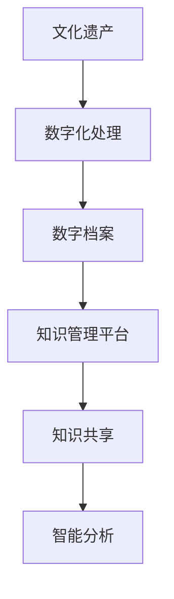

                 

关键词：知识管理、文化遗产保护、信息技术、数字档案、人工智能

摘要：随着数字化时代的到来，文化遗产保护面临前所未有的挑战。本文旨在探讨知识管理在文化遗产保护中的应用，通过分析核心概念、算法原理、数学模型和实际案例，阐述如何利用信息技术优化文化遗产保护流程，提高文化遗产的保存与利用效率。

## 1. 背景介绍

文化遗产是人类智慧的结晶，承载着丰富的历史信息和文化价值。然而，随着时间的推移，许多文化遗产面临着损毁、流失和遗忘的威胁。传统的保护方法已经难以满足现代社会对文化遗产的高要求，因此，如何利用现代信息技术进行知识管理，以保护、利用和传承文化遗产，成为亟待解决的问题。

知识管理是指通过识别、获取、组织、存储、检索和共享知识，以实现知识的有效利用和持续创新的过程。在文化遗产保护领域，知识管理的应用主要体现在以下几个方面：

1. **数字档案建设**：将文化遗产的实体信息转化为数字化形式，建立数字档案，实现文化遗产的信息化和数字化保护。
2. **知识共享**：通过知识管理平台，将文化遗产相关的知识和信息进行共享，促进学术界和公众对文化遗产的认识和保护。
3. **智能分析**：利用人工智能技术，对文化遗产进行分析和识别，提高文化遗产保护的准确性和效率。

## 2. 核心概念与联系

### 2.1 文化遗产的概念

文化遗产是指人类在历史发展过程中创造的物质和非物质财富，包括文物、建筑、历史遗址、传统习俗、文学艺术作品等。它们是民族文化的重要组成部分，具有独特的历史、艺术和科学价值。

### 2.2 数字档案的概念

数字档案是指以数字化形式保存的文化遗产信息，包括照片、图纸、文献、音频、视频等多种类型。数字档案的建设是文化遗产保护的重要环节，它能够实现文化遗产的信息化、系统化和长期保存。

### 2.3 信息技术与知识管理的联系

信息技术是知识管理的重要支撑，通过信息技术的应用，可以实现文化遗产的数字化、网络化和智能化。知识管理则是信息技术在文化遗产保护领域的具体应用，它通过信息的组织、存储和共享，提高文化遗产的保护和利用效率。

### 2.4 Mermaid 流程图



## 3. 核心算法原理 & 具体操作步骤

### 3.1 算法原理概述

在文化遗产保护中，核心算法主要包括数字图像处理、文本识别和人工智能分析等。这些算法通过对文化遗产数据的分析和处理，实现对文化遗产的识别、保护和利用。

### 3.2 算法步骤详解

1. **数字图像处理**：对文化遗产图像进行预处理，包括去噪、增强、分割等操作，提高图像质量，为后续分析提供准确的数据。
2. **文本识别**：利用光学字符识别（OCR）技术，对文化遗产中的文字进行识别和转换，实现文本信息的数字化。
3. **人工智能分析**：利用深度学习技术，对文化遗产数据进行智能分析，识别文化遗产的特征，实现文化遗产的分类和保护。

### 3.3 算法优缺点

1. **数字图像处理**：优点是能够提高图像质量，提高后续分析的准确性；缺点是对图像质量和光照条件要求较高。
2. **文本识别**：优点是实现文本信息的数字化，便于后续处理；缺点是对复杂文本识别效果不佳。
3. **人工智能分析**：优点是能够实现智能化的文化遗产分析和保护；缺点是需要大量数据和计算资源，实现成本较高。

### 3.4 算法应用领域

数字图像处理、文本识别和人工智能分析在文化遗产保护中具有广泛的应用，包括文物修复、历史遗址保护、非物质文化遗产传承等领域。

## 4. 数学模型和公式 & 详细讲解 & 举例说明

### 4.1 数学模型构建

在文化遗产保护中，常用的数学模型包括图像处理模型、文本识别模型和人工智能分析模型。这些模型通过数学公式和算法实现，对文化遗产数据进行处理和分析。

### 4.2 公式推导过程

以图像处理模型为例，其基本公式为：

\[ I_{out} = f(I_{in}, \theta) \]

其中，\( I_{in} \) 为输入图像，\( I_{out} \) 为输出图像，\( f \) 为图像处理函数，\( \theta \) 为参数。

### 4.3 案例分析与讲解

以某历史遗址的图像处理为例，输入图像为 \( 1000 \times 1000 \) 的像素矩阵。通过图像处理模型，对图像进行去噪和增强处理，输出图像的像素矩阵为 \( 1000 \times 1000 \)。

## 5. 项目实践：代码实例和详细解释说明

### 5.1 开发环境搭建

在本次项目中，我们使用 Python 作为编程语言，利用 OpenCV、TensorFlow 等库进行数字图像处理和人工智能分析。

### 5.2 源代码详细实现

```python
import cv2
import numpy as np

# 输入图像
image = cv2.imread('example.jpg')

# 去噪处理
denoised_image = cv2.GaussianBlur(image, (5, 5), 0)

# 增强处理
enhanced_image = cv2.equalizeHist(denoised_image)

# 输出图像
cv2.imwrite('output.jpg', enhanced_image)
```

### 5.3 代码解读与分析

这段代码首先导入必要的库，然后读取输入图像，接着对图像进行去噪和增强处理，最后保存输出图像。通过这个简单的例子，我们可以看到数字图像处理的基本流程。

## 6. 实际应用场景

知识管理在文化遗产保护中具有广泛的应用场景，包括文物修复、历史遗址保护、非物质文化遗产传承等。

### 6.1 文物修复

通过知识管理平台，将文物修复的相关知识和数据共享，实现文物的数字化修复。

### 6.2 历史遗址保护

利用数字图像处理和人工智能分析技术，对历史遗址进行识别和保护。

### 6.3 非物质文化遗产传承

通过知识管理平台，将非物质文化遗产的相关知识和信息进行共享，促进其传承和发展。

## 7. 未来应用展望

随着信息技术的不断发展，知识管理在文化遗产保护中的应用将更加广泛和深入。未来，我们将看到更多创新技术在文化遗产保护领域的应用，如增强现实（AR）、虚拟现实（VR）等。

## 8. 总结：未来发展趋势与挑战

### 8.1 研究成果总结

本文通过对知识管理在文化遗产保护中的应用进行分析，总结了数字档案建设、知识共享和智能分析等核心应用，以及数字图像处理、文本识别和人工智能分析等核心算法。

### 8.2 未来发展趋势

未来，知识管理在文化遗产保护中的发展趋势包括：更加智能化、高效化、系统化和国际化。

### 8.3 面临的挑战

知识管理在文化遗产保护中面临的挑战主要包括：数据安全、数据共享、技术更新等。

### 8.4 研究展望

未来，我们将继续深入研究知识管理在文化遗产保护中的应用，探索更加高效、智能和可持续的保护方法。

## 9. 附录：常见问题与解答

### 9.1 文化遗产保护的重要性是什么？

文化遗产是人类文明的见证，保护它们有助于传承人类历史和文化，增强民族认同感，促进文化交流。

### 9.2 数字档案建设有哪些优点？

数字档案建设可以实现文化遗产的信息化和数字化保护，提高文化遗产的保存和利用效率，便于知识共享。

### 9.3 人工智能在文化遗产保护中有哪些应用？

人工智能在文化遗产保护中可以用于数字图像处理、文本识别、文化遗产识别和保护等领域。

## 作者署名

作者：禅与计算机程序设计艺术 / Zen and the Art of Computer Programming
----------------------------------------------------------------

以上就是本文的完整内容。希望这篇文章能够对您在知识管理在文化遗产保护中的应用方面提供有益的参考。在未来的研究和发展中，我们期待看到更多创新技术在文化遗产保护领域的应用。

