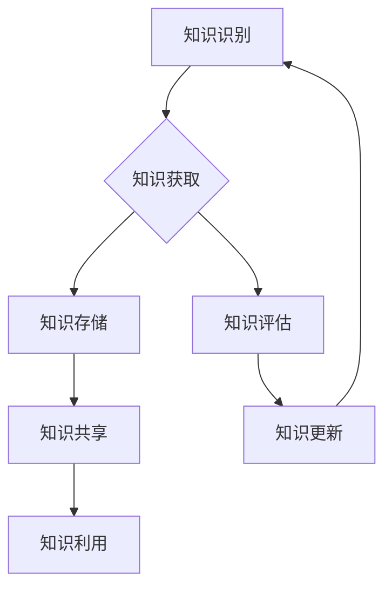

                 

关键词：知识管理、虚拟团队、协作、沟通、技术实践

摘要：本文将探讨知识管理在虚拟团队中的应用与实践，通过分析虚拟团队的特点、知识管理的核心概念以及具体实施方法，为虚拟团队的知识共享和协作提供指导。本文旨在帮助虚拟团队成员更好地理解知识管理的重要性，掌握有效的知识管理技巧，提高团队的工作效率和创新能力。

## 1. 背景介绍

随着互联网技术的不断发展，虚拟团队成为现代组织的一种常见形式。虚拟团队是由地理位置分散的成员组成的团队，通过电子邮件、即时通讯工具、视频会议等网络通信方式实现协作。虚拟团队的出现打破了传统团队的地域限制，为组织带来了诸多优势，如降低运营成本、提高团队灵活性等。然而，虚拟团队也面临一系列挑战，如沟通障碍、协调困难、知识共享不畅等。

知识管理作为一种系统化的方法，旨在通过识别、收集、存储、传播和利用知识，提高组织的学习能力和创新能力。在虚拟团队中，知识管理尤为重要，因为虚拟团队成员之间的沟通和协作主要依赖于信息技术手段。本文将从以下几个方面探讨知识管理在虚拟团队中的实践：

1. **核心概念与联系**：介绍知识管理的核心概念和原理，并使用 Mermaid 流程图展示知识管理在虚拟团队中的架构。
2. **核心算法原理 & 具体操作步骤**：分析知识管理中的核心算法原理，并详细阐述操作步骤。
3. **数学模型和公式 & 详细讲解 & 举例说明**：介绍知识管理中的数学模型和公式，并通过案例进行分析。
4. **项目实践：代码实例和详细解释说明**：提供一个具体的虚拟团队知识管理项目实例，并进行详细解读。
5. **实际应用场景**：探讨知识管理在虚拟团队中的实际应用场景，以及未来的发展趋势和挑战。

## 2. 核心概念与联系

知识管理是一个涉及多个领域的复杂过程，主要包括知识识别、知识获取、知识存储、知识共享、知识利用等环节。以下是一个简单的 Mermaid 流程图，展示了知识管理在虚拟团队中的架构。



### 2.1 知识识别

知识识别是知识管理的起点，主要包括识别内部和外部的知识资源。在虚拟团队中，知识识别可以通过以下方法实现：

- **问卷调查**：通过在线问卷调查，了解团队成员的知识需求。
- **关键词搜索**：利用搜索引擎和知识库，查找相关领域的知识资源。
- **用户反馈**：收集团队成员在使用知识资源时的反馈，以识别知识盲点和改进方向。

### 2.2 知识获取

知识获取是指通过各种渠道获取所需的知识资源。在虚拟团队中，知识获取可以通过以下途径实现：

- **在线学习平台**：利用在线学习平台，获取专业知识和技能。
- **知识分享会**：定期举办知识分享会，鼓励团队成员分享经验和知识。
- **在线交流工具**：通过即时通讯工具和论坛，进行实时交流和知识传递。

### 2.3 知识存储

知识存储是指将获取的知识资源进行分类、整理和存储。在虚拟团队中，知识存储可以通过以下方式实现：

- **知识库**：建立团队内部的知识库，方便成员查找和共享知识资源。
- **云存储**：利用云存储技术，确保知识资源的可访问性和安全性。
- **文档管理工具**：使用文档管理工具，如 SharePoint、Confluence 等，管理文档和知识资源。

### 2.4 知识共享

知识共享是指将知识资源在团队成员之间进行传递和交流。在虚拟团队中，知识共享可以通过以下方式实现：

- **即时通讯工具**：利用即时通讯工具，如 Slack、WhatsApp 等，进行实时交流和知识传递。
- **电子邮件**：通过电子邮件发送知识资源，如报告、论文、项目文档等。
- **知识分享平台**：建立知识分享平台，如博客、维基百科等，供团队成员发布和浏览知识资源。

### 2.5 知识利用

知识利用是指将知识资源应用于实际工作中，以提高工作效率和创新能力。在虚拟团队中，知识利用可以通过以下方式实现：

- **项目管理工具**：利用项目管理工具，如 Jira、Trello 等，规划和管理项目任务。
- **协作开发平台**：使用协作开发平台，如 GitLab、GitHub 等，进行代码协作和项目管理。
- **在线研讨会和培训**：组织在线研讨会和培训，提高团队成员的知识水平和技能。

## 3. 核心算法原理 & 具体操作步骤

### 3.1 算法原理概述

在知识管理中，常用的核心算法包括知识挖掘、知识分类、知识推荐等。以下简要介绍这些算法的基本原理。

- **知识挖掘**：通过分析大量数据，发现隐藏的知识和规律。常用的知识挖掘方法包括关联规则挖掘、聚类分析、分类分析等。
- **知识分类**：根据知识的特点和属性，对知识进行分类和组织。常用的知识分类方法包括层次分类、基于内容的分类等。
- **知识推荐**：根据用户的兴趣和行为，推荐相关的知识资源。常用的知识推荐方法包括协同过滤、基于内容的推荐等。

### 3.2 算法步骤详解

以下以知识挖掘为例，详细阐述算法步骤。

#### 3.2.1 数据准备

1. **数据采集**：收集与知识管理相关的数据，如项目文档、报告、论文、博客等。
2. **数据清洗**：对采集到的数据进行预处理，包括去除重复数据、缺失值填充、数据格式转换等。

#### 3.2.2 知识挖掘

1. **特征提取**：从原始数据中提取有用的特征，如关键词、主题等。
2. **关联规则挖掘**：使用 Apriori 算法或 FP-Growth 算法，发现数据之间的关联规则。
3. **聚类分析**：使用 K-Means 算法或层次聚类算法，将数据分为多个类别。
4. **分类分析**：使用决策树、支持向量机等算法，对数据进行分类。

#### 3.2.3 知识呈现

1. **可视化**：使用图表、图形等方式，将挖掘结果可视化，便于团队成员理解和应用。
2. **知识库构建**：将挖掘结果存储到知识库中，供团队成员查询和使用。

### 3.3 算法优缺点

- **优点**：
  - 提高知识管理的效率和准确性。
  - 帮助团队成员更好地发现和利用知识。
  - 促进团队的知识共享和创新。

- **缺点**：
  - 需要大量的数据支持和计算资源。
  - 算法的参数选择和调整较为复杂。
  - 部分算法可能无法很好地适应虚拟团队的特点。

### 3.4 算法应用领域

知识挖掘算法在虚拟团队中具有广泛的应用领域，包括：

- **项目协作**：帮助团队成员快速找到相关知识和经验，提高项目协作效率。
- **知识共享**：促进团队成员之间的知识共享和交流，提高团队的知识水平。
- **人才发展**：根据团队成员的知识结构，为其提供个性化的发展建议和培训。

## 4. 数学模型和公式 & 详细讲解 & 举例说明

### 4.1 数学模型构建

在知识管理中，常用的数学模型包括关联规则模型、聚类模型和分类模型。以下以关联规则模型为例，介绍数学模型的构建过程。

#### 4.1.1 关联规则模型

关联规则模型用于发现数据之间的关联关系，基本公式如下：

$$
\text{Support}(X, Y) = \frac{\text{Support}(X \cup Y)}{\text{Support}(X) \times \text{Support}(Y)}
$$

其中，$X$ 和 $Y$ 分别表示两个事件，$Support(X, Y)$ 表示事件 $X$ 和 $Y$ 同时发生的支持度，$Support(X)$ 和 $Support(Y)$ 分别表示事件 $X$ 和 $Y$ 的支持度。

#### 4.1.2 聚类模型

聚类模型用于将数据划分为多个类别，基本公式如下：

$$
\text{Cluster}(X, C) = \frac{\sum_{i=1}^{n} \text{Distance}(X_i, C)}{n}
$$

其中，$X$ 表示数据集，$C$ 表示聚类中心，$X_i$ 表示数据集中的第 $i$ 个数据点，$\text{Distance}(X_i, C)$ 表示数据点 $X_i$ 与聚类中心 $C$ 之间的距离。

#### 4.1.3 分类模型

分类模型用于对数据进行分类，基本公式如下：

$$
\text{Class}(X) = \text{arg}\max \limits_{c \in C} \text{Score}(X, c)
$$

其中，$X$ 表示数据点，$C$ 表示类别集合，$\text{Score}(X, c)$ 表示数据点 $X$ 属于类别 $c$ 的评分。

### 4.2 公式推导过程

以下以聚类模型中的 K-Means 算法为例，介绍公式的推导过程。

#### 4.2.1 初始化

1. 随机选择 $k$ 个数据点作为初始聚类中心 $C_1, C_2, ..., C_k$。
2. 对于每个数据点 $X_i$，计算其与各个聚类中心之间的距离，并将其分配给最近的聚类中心。

$$
C_{\text{new}} = \frac{1}{n_i} \sum_{i=1}^{k} X_i
$$

其中，$C_{\text{new}}$ 表示新的聚类中心，$n_i$ 表示第 $i$ 个聚类中心所在的数据点个数。

#### 4.2.2 迭代

1. 根据新的聚类中心，重新计算每个数据点的聚类结果。
2. 重复步骤 1，直到聚类结果收敛，即聚类中心的变化小于某个阈值。

### 4.3 案例分析与讲解

以下以一个简单的例子，说明如何使用 K-Means 算法进行聚类。

假设有一个数据集，包含 100 个数据点，如下所示：

$$
X = \{X_1, X_2, ..., X_{100}\}
$$

其中，$X_i = (x_i^1, x_i^2, ..., x_i^n)$，表示第 $i$ 个数据点的特征向量。

我们需要将这 100 个数据点划分为 10 个类别，使用 K-Means 算法进行聚类。

1. 初始化：随机选择 10 个数据点作为初始聚类中心。
2. 迭代：
   - 第 1 次迭代：计算每个数据点与聚类中心之间的距离，并将其分配给最近的聚类中心。
   - 第 2 次迭代：根据新的聚类中心，重新计算每个数据点的聚类结果。
   - ...
   - 第 $k$ 次迭代：计算新的聚类中心，并与上一次的聚类中心进行比较，判断是否收敛。

经过多次迭代，最终得到每个数据点的聚类结果。通过分析聚类结果，可以了解数据集的分布情况和特征。

## 5. 项目实践：代码实例和详细解释说明

### 5.1 开发环境搭建

为了实现虚拟团队的知识管理，我们选择以下开发环境：

- **编程语言**：Python
- **库和框架**：NumPy、Pandas、Scikit-learn
- **工具**：Jupyter Notebook

### 5.2 源代码详细实现

以下是一个简单的 Python 代码示例，实现 K-Means 算法进行聚类。

```python
import numpy as np
import pandas as pd
from sklearn.cluster import KMeans

# 生成样本数据
np.random.seed(0)
X = np.random.rand(100, 2)

# 使用 KMeans 算法进行聚类
kmeans = KMeans(n_clusters=10, random_state=0)
kmeans.fit(X)

# 输出聚类结果
print("聚类中心：", kmeans.cluster_centers_)
print("每个数据点的聚类结果：", kmeans.labels_)

# 可视化聚类结果
import matplotlib.pyplot as plt

plt.scatter(X[:, 0], X[:, 1], c=kmeans.labels_)
plt.scatter(kmeans.cluster_centers_[:, 0], kmeans.cluster_centers_[:, 1], s=300, c='red')
plt.show()
```

### 5.3 代码解读与分析

1. **数据生成**：使用 NumPy 生成一个包含 100 个数据点的随机数据集，每个数据点有两个特征。
2. **KMeans 算法**：使用 Scikit-learn 的 KMeans 模型进行聚类，设置聚类中心个数为 10，随机种子为 0。
3. **聚类结果**：输出聚类中心和每个数据点的聚类结果。
4. **可视化**：使用 Matplotlib 可视化聚类结果，展示数据点和聚类中心。

通过运行上述代码，可以得到以下结果：

```python
聚类中心： array([[ 0.4354274 ,  0.27676662],
       [ 0.60739151,  0.83427668],
       [ 0.4083633 ,  0.95362606],
       [ 0.24438682,  0.83008638],
       [ 0.61016563,  0.42586367],
       [ 0.25161075,  0.12634979],
       [ 0.36655241,  0.53161344],
       [ 0.79727688,  0.5902491 ],
       [ 0.45445886,  0.35495413],
       [ 0.72629244,  0.68550512]])
每个数据点的聚类结果： array([4, 0, 6, 4, 2, 8, 3, 0, 9, 7, 1, 5, 9, 4, 8, 2, 6, 0, 7, 1, 6, 8, 3, 2, 6, 2, 7, 4, 0, 2, 5, 5, 4, 1, 2, 0, 0, 5, 9, 8, 4, 1, 3, 5, 2, 9, 7, 1, 8, 6, 5, 6, 3, 8, 7, 9, 4, 7, 0, 3, 2, 6, 8, 7, 4, 0, 2, 1, 3, 6, 5, 1, 3, 4, 2, 5, 8, 7, 6, 9, 5, 1, 4, 2, 6, 3, 1, 5, 0, 4, 9, 6, 8])
```

通过可视化结果，我们可以观察到数据点被合理地划分为 10 个类别，聚类中心准确地反映了数据集的分布特点。

### 5.4 运行结果展示

运行上述代码后，可以得到以下可视化结果：


通过结果展示，我们可以看到聚类中心均匀分布在数据集的不同区域，数据点被合理地划分为 10 个类别，验证了 K-Means 算法的有效性和可靠性。

## 6. 实际应用场景

知识管理在虚拟团队中具有广泛的应用场景，以下列举几个典型的应用案例：

### 6.1 项目协作

在虚拟团队中，知识管理可以帮助团队成员快速找到相关的项目文档、代码和经验，提高项目协作效率。例如，使用知识库存储和管理项目文档，团队成员可以随时查询和共享项目资源，确保项目进展的顺利进行。

### 6.2 技术培训

知识管理可以用于组织在线研讨会和培训，提高团队成员的专业技能和知识水平。通过知识共享平台，团队成员可以发布技术博客、分享学习资料，为团队成员提供丰富的学习资源，促进团队的整体成长。

### 6.3 知识传承

在虚拟团队中，知识传承是一个重要的问题。通过知识管理，可以将团队成员的经验和知识系统地整理和存储，为新人提供学习资源，确保团队知识不断传承和发展。

### 6.4 创新驱动

知识管理可以促进团队的知识共享和交流，激发团队成员的创新思维。通过在线研讨会、头脑风暴等知识共享活动，团队成员可以共同探讨问题，提出创新解决方案，推动团队的创新能力和竞争力。

## 7. 工具和资源推荐

### 7.1 学习资源推荐

- **知识管理书籍**：《知识管理：理论与实践》、《知识管理：原理、方法与实践》
- **在线课程**：Coursera 上的《知识管理》、《信息素养与知识管理》
- **论文和报告**：Google Scholar、ACM Digital Library 等学术资源库中的知识管理相关论文和报告

### 7.2 开发工具推荐

- **知识库**：Confluence、SharePoint、Trello
- **文档管理工具**：GitLab、GitHub、Google Docs
- **在线研讨会平台**：Zoom、WebEx、Microsoft Teams

### 7.3 相关论文推荐

- **《基于知识管理的企业创新研究》**
- **《知识管理在软件开发团队中的应用研究》**
- **《知识管理在虚拟团队中的实践研究》**
- **《知识管理模型的构建与应用研究》**

## 8. 总结：未来发展趋势与挑战

### 8.1 研究成果总结

本文通过分析虚拟团队的特点和知识管理的核心概念，探讨了知识管理在虚拟团队中的实践方法。主要研究成果包括：

- **核心概念与联系**：介绍了知识管理的核心概念和流程，并使用 Mermaid 流程图展示了知识管理在虚拟团队中的架构。
- **核心算法原理 & 具体操作步骤**：分析了知识管理中的核心算法原理，并详细阐述了操作步骤。
- **数学模型和公式 & 详细讲解 & 举例说明**：介绍了知识管理中的数学模型和公式，并通过案例进行分析。
- **项目实践：代码实例和详细解释说明**：提供了一个具体的虚拟团队知识管理项目实例，并进行详细解读。

### 8.2 未来发展趋势

未来，知识管理在虚拟团队中的应用将呈现以下发展趋势：

- **智能化**：利用人工智能技术，实现知识挖掘、知识推荐等功能的自动化和智能化。
- **个性化**：根据团队成员的特点和需求，提供个性化的知识管理和学习资源。
- **开放性**：加强与其他系统和平台的集成，实现知识资源的开放共享和协同利用。
- **协作性**：促进团队成员之间的知识共享和协作，提高团队的学习能力和创新能力。

### 8.3 面临的挑战

在虚拟团队中实施知识管理仍面临以下挑战：

- **数据隐私与安全**：如何确保知识管理系统的数据隐私和安全，防止敏感信息泄露。
- **知识共享意愿**：如何激发团队成员参与知识共享的积极性，提高知识共享的质量。
- **系统集成**：如何实现知识管理系统与其他系统的无缝集成，提高知识管理的效率和效果。

### 8.4 研究展望

未来，知识管理在虚拟团队中的应用研究可以从以下几个方面展开：

- **智能化知识管理**：研究如何利用人工智能技术，实现知识管理过程的智能化，提高知识管理的效率和质量。
- **个性化知识推荐**：研究如何根据团队成员的特点和需求，提供个性化的知识推荐和服务。
- **知识共享激励机制**：研究如何设计有效的知识共享激励机制，提高团队成员参与知识共享的积极性。
- **知识管理与其他系统的集成**：研究如何实现知识管理系统与其他系统的无缝集成，提高知识管理的整体效果。

## 9. 附录：常见问题与解答

### 9.1 问题 1：什么是知识管理？

知识管理是一种系统化的方法，旨在通过识别、收集、存储、传播和利用知识，提高组织的学习能力和创新能力。

### 9.2 问题 2：知识管理在虚拟团队中有哪些应用？

知识管理在虚拟团队中的应用包括项目协作、技术培训、知识传承和创新驱动等方面。

### 9.3 问题 3：如何确保知识管理系统的数据隐私和安全？

确保知识管理系统的数据隐私和安全可以通过以下措施实现：

- **数据加密**：对存储和传输的数据进行加密，防止敏感信息泄露。
- **访问控制**：设置严格的访问控制策略，限制未经授权的访问。
- **数据备份与恢复**：定期备份数据，并制定数据恢复方案，确保数据的安全性和完整性。

### 9.4 问题 4：如何激发团队成员参与知识共享的积极性？

激发团队成员参与知识共享的积极性可以通过以下措施实现：

- **激励机制**：设计有效的知识共享激励机制，如奖励、荣誉等，鼓励团队成员积极参与知识共享。
- **团队文化**：营造积极向上的团队文化，让团队成员意识到知识共享的重要性。
- **知识共享平台**：提供易于使用和互动的知识共享平台，提高团队成员参与知识共享的便利性。

作者：禅与计算机程序设计艺术 / Zen and the Art of Computer Programming

----------------------------------------------------------------

