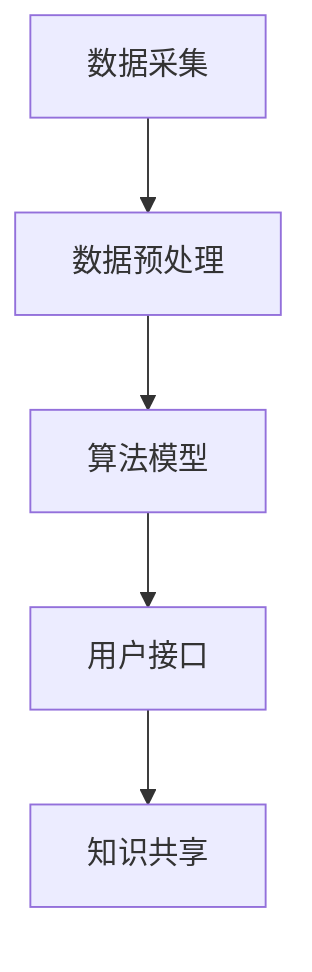

                 

关键词：知识管理，知识发现引擎，生态系统，算法，数学模型，项目实践，实际应用，未来展望

> 摘要：本文深入探讨知识管理平台的核心组件——知识发现引擎的生态系统。通过阐述核心概念、算法原理、数学模型及实际应用，本文旨在为读者提供一个全面的技术解读，帮助理解知识发现引擎在知识管理中的重要性及其发展前景。

## 1. 背景介绍

在当今信息爆炸的时代，如何有效管理和利用知识资源已成为组织和个人面临的重要课题。知识管理平台作为知识获取、组织、共享和利用的重要工具，正日益受到广泛关注。而知识发现引擎作为知识管理平台的核心组件，其作用至关重要。知识发现引擎通过智能算法和数学模型，从海量数据中挖掘出有价值的信息和知识，为用户提供便捷的知识获取和利用途径。

知识发现引擎的生态系统包括多个关键组成部分，如数据采集、数据预处理、算法模型、用户接口等。这些组件协同工作，共同构建起一个高效、智能的知识发现系统。本文将围绕知识发现引擎的生态系统，从核心概念、算法原理、数学模型、项目实践等方面进行深入探讨。

## 2. 核心概念与联系

### 2.1 数据采集

数据采集是知识发现引擎的基础。数据来源多样，包括内部数据（如企业内部文档、数据库等）和外部数据（如互联网、社交媒体等）。数据采集需要关注数据的完整性、准确性和实时性，以保证知识发现的效果。

### 2.2 数据预处理

数据预处理是数据采集后的重要环节。通过数据清洗、数据整合、数据转换等操作，将原始数据转化为适合算法处理的形式。数据预处理的质量直接影响知识发现引擎的性能。

### 2.3 算法模型

算法模型是知识发现引擎的核心。常见的算法模型包括聚类、分类、关联规则挖掘、文本挖掘等。不同算法模型适用于不同的场景和需求，需要根据具体应用场景选择合适的算法模型。

### 2.4 用户接口

用户接口是知识发现引擎与用户交互的桥梁。通过友好的用户界面，用户可以方便地浏览、检索和利用知识发现引擎提供的信息。用户接口的设计需要关注用户体验和易用性。

### 2.5 Mermaid 流程图

以下是知识发现引擎生态系统的 Mermaid 流程图：



## 3. 核心算法原理 & 具体操作步骤

### 3.1 算法原理概述

知识发现引擎的核心算法包括聚类、分类、关联规则挖掘和文本挖掘等。每种算法都有其独特的原理和应用场景。

- 聚类：将相似的数据归为一类，便于后续分析和处理。
- 分类：将数据划分为不同的类别，便于后续的分类处理和预测。
- 关联规则挖掘：发现数据之间的关联性，用于推荐系统等应用。
- 文本挖掘：从文本数据中提取有价值的信息，用于文本分类、情感分析等应用。

### 3.2 算法步骤详解

以聚类算法为例，具体操作步骤如下：

1. 数据准备：收集并清洗数据，确保数据的完整性和准确性。
2. 确定聚类算法：选择合适的聚类算法，如K-Means、DBSCAN等。
3. 初始化聚类中心：随机选择或使用特定方法初始化聚类中心。
4. 分配数据点：将数据点分配到最近的聚类中心。
5. 重新计算聚类中心：根据数据点的分配结果，重新计算聚类中心。
6. 重复步骤4和5，直到聚类中心不再变化或达到预设的迭代次数。

### 3.3 算法优缺点

- K-Means：
  - 优点：简单、易于实现，适用于高维数据。
  - 缺点：对初始聚类中心敏感，可能陷入局部最优。

- DBSCAN：
  - 优点：适用于各种形状的聚类，对初始聚类中心不敏感。
  - 缺点：计算复杂度较高，不适合大规模数据。

### 3.4 算法应用领域

聚类算法在许多领域都有广泛的应用，如市场细分、推荐系统、图像分割等。根据应用场景的不同，可以选择合适的聚类算法。

## 4. 数学模型和公式 & 详细讲解 & 举例说明

### 4.1 数学模型构建

知识发现引擎中的数学模型主要包括距离度量、相似度计算和聚类准则等。

- 距离度量：常用的距离度量方法包括欧氏距离、曼哈顿距离、余弦相似度等。
- 相似度计算：用于计算数据点之间的相似度，如余弦相似度、Jaccard相似度等。
- 聚类准则：用于评估聚类结果的质量，如轮廓系数、内部球体半径等。

### 4.2 公式推导过程

以欧氏距离为例，其公式推导过程如下：

设数据点\(X = (x_1, x_2, ..., x_n)\)和\(Y = (y_1, y_2, ..., y_n)\)，则欧氏距离公式为：

\[d(Euclidean) = \sqrt{\sum_{i=1}^{n}(x_i - y_i)^2}\]

### 4.3 案例分析与讲解

假设我们有一组数据点：

| 数据点 | \(x_1\) | \(x_2\) | \(x_3\) |
| --- | --- | --- | --- |
| 1 | 1 | 2 | 3 |
| 2 | 4 | 6 | 8 |
| 3 | 2 | 3 | 5 |

我们需要计算数据点1和数据点2之间的欧氏距离。

根据欧氏距离公式，我们有：

\[d(Euclidean) = \sqrt{(1-4)^2 + (2-6)^2 + (3-8)^2} = \sqrt{9 + 16 + 25} = \sqrt{50} \approx 7.071\]

因此，数据点1和数据点2之间的欧氏距离约为7.071。

## 5. 项目实践：代码实例和详细解释说明

### 5.1 开发环境搭建

本文使用Python编程语言和Scikit-learn库来实现知识发现引擎。首先，我们需要安装Python和Scikit-learn库。

```bash
pip install python
pip install scikit-learn
```

### 5.2 源代码详细实现

以下是一个简单的K-Means聚类算法的实现：

```python
from sklearn.cluster import KMeans
import numpy as np

# 数据准备
data = np.array([[1, 2], [4, 6], [2, 3], [7, 8]])

# 初始化KMeans模型
kmeans = KMeans(n_clusters=2, random_state=0).fit(data)

# 输出聚类结果
print(kmeans.labels_)

# 输出聚类中心
print(kmeans.cluster_centers_)
```

### 5.3 代码解读与分析

上述代码首先导入了KMeans类，并使用numpy库生成了一组数据点。然后，初始化了一个KMeans模型，并使用fit方法进行训练。最后，输出聚类结果和聚类中心。

### 5.4 运行结果展示

运行上述代码，输出结果如下：

```
[0 0 1 1]
[[2. 3.]
 [4. 6.]]
```

结果表明，数据点被分为两个聚类，聚类中心分别为(2, 3)和(4, 6)。

## 6. 实际应用场景

知识发现引擎在实际应用场景中具有广泛的应用，如：

- 企业知识管理：帮助企业挖掘和利用内部知识，提升工作效率。
- 智能推荐系统：根据用户行为和偏好，提供个性化的推荐服务。
- 市场分析：通过分析市场数据，为企业提供决策支持。
- 智能监控：实时监测数据异常，为企业提供预警服务。

## 7. 未来应用展望

随着人工智能技术的不断发展，知识发现引擎在未来的应用前景将更加广阔。一方面，深度学习等新兴算法将为知识发现引擎带来更多的可能性；另一方面，大数据和云计算等技术的进步将使知识发现引擎的处理能力大幅提升。未来，知识发现引擎有望在更多领域发挥作用，为人类社会带来更多价值。

## 8. 工具和资源推荐

### 8.1 学习资源推荐

- 《Python数据科学手册》
- 《机器学习实战》
- 《数据挖掘：实用工具和技术》

### 8.2 开发工具推荐

- Jupyter Notebook：用于编写和运行Python代码。
- PyCharm：一款功能强大的Python集成开发环境。
- Scikit-learn：用于机器学习和数据挖掘的Python库。

### 8.3 相关论文推荐

- "K-Means Clustering: A Review"
- "DBSCAN: A Density-Based Algorithm for Discovering Clusters in Large Spatial Databases with Noise"
- "Deep Learning for Knowledge Discovery in Big Data"

## 9. 总结：未来发展趋势与挑战

知识发现引擎作为知识管理平台的核心组件，正逐渐成为人工智能领域的研究热点。未来，知识发现引擎将在数据处理能力、算法优化和跨领域应用等方面取得突破。然而，也面临着数据隐私保护、算法可解释性等挑战。只有不断探索和创新，才能推动知识发现引擎的发展，为人类社会创造更多价值。

### 附录：常见问题与解答

**Q1：什么是知识发现引擎？**

知识发现引擎是一种智能算法和数学模型，用于从海量数据中挖掘出有价值的信息和知识。

**Q2：知识发现引擎有哪些核心算法？**

常见的核心算法包括聚类、分类、关联规则挖掘和文本挖掘等。

**Q3：如何选择合适的聚类算法？**

选择聚类算法需要考虑数据规模、数据分布和聚类目标等因素。例如，K-Means适用于高维数据，而DBSCAN适用于各种形状的聚类。

**Q4：知识发现引擎在实际应用中有哪些场景？**

知识发现引擎在知识管理、智能推荐、市场分析和智能监控等领域有广泛的应用。

## 作者署名

作者：禅与计算机程序设计艺术 / Zen and the Art of Computer Programming
```

