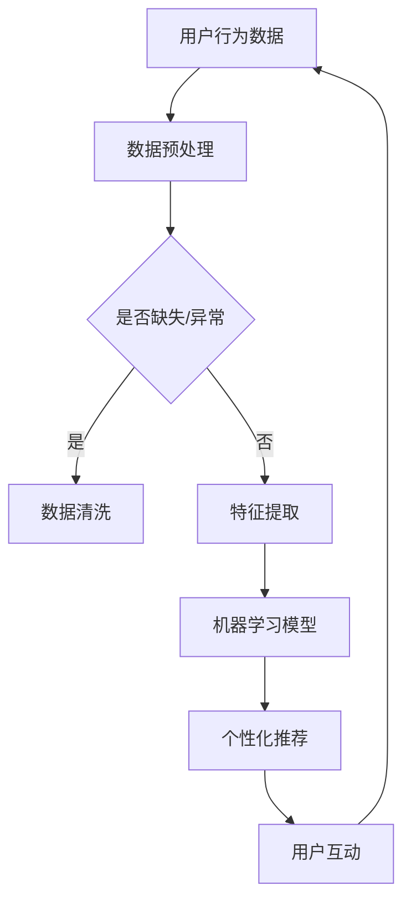

                 

### 1. 背景介绍

随着全球经济的发展，知识经济逐渐成为主导力量。在知识经济时代，知识的获取、传播和应用成为经济增长的重要驱动力。知识付费作为知识经济的一种表现形式，正日益受到广泛关注。知识付费是指个人或机构通过支付费用来获取特定知识、技能或信息的服务模式。在这个背景下，人工智能作为一种革命性的技术，其应用与发展对于知识付费领域具有重要意义。

知识付费的兴起，主要源于以下几个因素：

1. **信息过载与个性化需求**：在互联网时代，信息爆炸式增长，人们面临着信息过载的问题。同时，随着个性化需求的提升，个体对于高质量、专业化的知识内容有着强烈的需求。
2. **技术进步与降低成本**：互联网、大数据、云计算等技术的快速发展，为知识付费提供了技术支持。这些技术不仅降低了知识获取的成本，还提升了知识传播的效率。
3. **平台生态的完善**：知识付费平台如雨后春笋般涌现，构建了完整的知识付费生态。从内容生产、分发到交易，各个环节都得到了有效的优化和提升。

人工智能在知识付费中的应用，主要体现在以下几个方面：

1. **个性化推荐**：通过分析用户的行为数据，人工智能可以为用户提供个性化的知识推荐，提升用户的满意度和粘性。
2. **智能搜索**：利用自然语言处理和机器学习技术，人工智能可以实现高效的智能搜索，帮助用户快速找到所需的知识内容。
3. **智能教学**：人工智能在在线教育领域具有广泛的应用，如智能问答、个性化学习路径推荐等，提升了教育的质量和效率。
4. **智能审核**：通过对用户生成的内容进行智能审核，人工智能可以有效防止低质量内容的出现，保障知识付费平台的内容质量。

总之，知识付费作为知识经济的重要表现形式，正在与人工智能深度融合，推动着整个领域的创新与发展。

## 2. 核心概念与联系

在深入探讨知识付费与人工智能的融合之前，我们需要明确一些核心概念，并理解它们之间的联系。以下是本文将涉及的一些核心概念：

### 2.1. 知识付费

知识付费是指用户通过支付一定费用来获取特定知识、技能或信息的服务模式。这种模式的核心在于“知识”的价值实现，即通过经济手段激发知识的传播和应用。

### 2.2. 人工智能

人工智能（Artificial Intelligence, AI）是指由计算机系统实现的智能行为，其目标是使计算机具备类似于人类的学习、推理、感知和决策能力。

### 2.3. 个性化推荐

个性化推荐是一种利用算法和技术为用户提供个性化内容推荐的服务。它基于用户的历史行为和偏好，通过数据分析为用户推荐感兴趣的内容。

### 2.4. 自然语言处理

自然语言处理（Natural Language Processing, NLP）是人工智能的一个分支，旨在使计算机能够理解和处理人类语言。NLP技术在知识付费中可用于智能问答、内容审核等。

### 2.5. 机器学习

机器学习（Machine Learning, ML）是一种通过数据训练模型，使其能够从数据中学习并做出预测或决策的技术。机器学习在个性化推荐、智能搜索等方面具有广泛应用。

### 2.6. 数据挖掘

数据挖掘（Data Mining）是从大量数据中提取有价值信息的过程。数据挖掘技术可用于分析用户行为，为个性化推荐提供支持。

### 2.7. 深度学习

深度学习（Deep Learning）是一种基于多层神经网络的机器学习技术。深度学习在图像识别、语音识别等领域取得了显著成果，也为知识付费中的应用提供了可能。

### 2.8. 知识图谱

知识图谱是一种用于表示实体、属性和关系的数据结构。知识图谱在知识付费中可用于构建知识网络，帮助用户更好地理解和获取知识。

### 2.9. 联系与融合

知识付费与人工智能的融合主要体现在以下几个方面：

1. **个性化推荐**：通过人工智能技术，特别是机器学习和深度学习，知识付费平台可以更准确地了解用户的需求，从而提供个性化的知识推荐。
2. **智能搜索**：自然语言处理技术使智能搜索成为可能，用户可以通过自然语言与系统互动，快速找到所需的知识内容。
3. **智能教学**：人工智能可以分析学生的学习行为，提供个性化的学习路径和辅导，提高教育质量和效率。
4. **内容审核**：利用人工智能进行内容审核，可以有效地过滤低质量内容，保障知识付费平台的内容质量。
5. **知识管理**：知识图谱等技术可以帮助构建知识网络，使知识付费平台的知识体系更加完整和易用。

### 2.10. Mermaid 流程图

以下是知识付费与人工智能融合的基本流程，使用Mermaid进行可视化表示：



通过上述流程图，我们可以清晰地看到数据从用户行为数据开始，经过预处理、特征提取和模型训练，最终实现个性化推荐，形成一个闭环。

## 3. 核心算法原理 & 具体操作步骤

### 3.1 算法原理概述

在知识付费与人工智能的融合中，核心算法主要包括个性化推荐算法、自然语言处理算法和机器学习算法。以下是这些算法的基本原理：

#### 3.1.1 个性化推荐算法

个性化推荐算法基于用户的历史行为和偏好，通过协同过滤、基于内容的推荐和混合推荐等方法，为用户推荐其可能感兴趣的知识内容。

- **协同过滤**：通过分析用户之间的相似性，为用户推荐其他相似用户喜欢的知识内容。
- **基于内容的推荐**：根据知识内容的特征，为用户推荐与其已浏览内容相似的知识。
- **混合推荐**：结合协同过滤和基于内容的推荐，提供更准确的推荐结果。

#### 3.1.2 自然语言处理算法

自然语言处理算法包括词向量表示、文本分类、实体识别和情感分析等。这些算法通过理解和处理人类语言，实现智能问答、内容审核等功能。

- **词向量表示**：将文本转换为向量表示，以便进行计算和分析。
- **文本分类**：将文本数据分类到预定义的类别中，如垃圾邮件检测、情感分析等。
- **实体识别**：从文本中识别出具有特定意义的实体，如人名、地名、组织名等。
- **情感分析**：分析文本的情感倾向，如正面、负面或中性。

#### 3.1.3 机器学习算法

机器学习算法在知识付费中主要用于模型训练和预测。常见的算法包括决策树、支持向量机、神经网络等。

- **决策树**：通过一系列规则来分类或回归数据，模型简单且易于解释。
- **支持向量机**：通过寻找最佳的超平面来分隔不同类别的数据，适用于高维数据。
- **神经网络**：模拟人脑神经元连接结构，通过多层网络进行复杂的非线性变换，适用于图像识别、语音识别等。

### 3.2 算法步骤详解

#### 3.2.1 个性化推荐算法

1. **用户行为数据收集**：收集用户的历史行为数据，如浏览记录、购买记录等。
2. **数据预处理**：清洗和标准化数据，去除缺失值和异常值。
3. **特征提取**：提取用户的行为特征和知识内容的特征。
4. **模型训练**：使用协同过滤、基于内容的推荐或混合推荐算法训练模型。
5. **推荐生成**：根据用户特征和知识内容特征，为用户生成个性化推荐列表。
6. **用户反馈**：收集用户对推荐内容的反馈，用于模型优化。

#### 3.2.2 自然语言处理算法

1. **文本预处理**：对文本进行分词、去停用词、词性标注等预处理步骤。
2. **词向量表示**：将预处理后的文本转换为词向量。
3. **模型训练**：使用词向量进行文本分类、实体识别或情感分析等任务。
4. **结果输出**：根据模型预测，输出分类结果、实体识别结果或情感分析结果。

#### 3.2.3 机器学习算法

1. **数据准备**：收集和处理训练数据，确保数据的质量和多样性。
2. **特征工程**：从原始数据中提取有用的特征，如特征缩放、特征选择等。
3. **模型选择**：根据任务类型和数据特征，选择合适的机器学习模型。
4. **模型训练**：使用训练数据进行模型训练。
5. **模型评估**：使用验证集或测试集评估模型性能。
6. **模型优化**：根据评估结果，调整模型参数，优化模型性能。

### 3.3 算法优缺点

#### 3.3.1 个性化推荐算法

**优点**：

- **准确性高**：通过分析用户历史行为和偏好，个性化推荐算法能够提供更准确的推荐结果。
- **用户体验好**：个性化推荐能够满足用户的个性化需求，提升用户体验。
- **高效性**：协同过滤算法和基于内容的推荐算法具有较高的计算效率。

**缺点**：

- **数据依赖性高**：个性化推荐算法依赖于大量的用户行为数据，数据缺失或噪声会影响推荐效果。
- **冷启动问题**：新用户缺乏历史行为数据，难以进行有效的个性化推荐。
- **偏好冲突**：不同用户之间可能存在偏好冲突，导致推荐结果的不准确。

#### 3.3.2 自然语言处理算法

**优点**：

- **理解能力强**：自然语言处理算法能够理解和处理人类语言，实现智能问答、内容审核等功能。
- **广泛应用**：自然语言处理技术在各种应用场景中具有广泛的应用，如社交媒体分析、智能客服等。

**缺点**：

- **计算复杂度高**：自然语言处理涉及大量的计算和数据处理，对计算资源和时间有较高要求。
- **准确性有限**：自然语言处理算法在处理复杂语言结构和语义理解时，仍存在一定的局限性。

#### 3.3.3 机器学习算法

**优点**：

- **适应性强**：机器学习算法能够通过训练数据自动学习和调整模型，适用于各种复杂的任务。
- **预测能力强**：机器学习算法能够从大量数据中提取有价值的信息，进行预测和决策。

**缺点**：

- **数据依赖性高**：机器学习算法依赖于大量的训练数据，数据质量和多样性对模型性能有重要影响。
- **模型解释性差**：一些复杂的机器学习模型，如深度神经网络，其内部机制较为复杂，难以进行解释和调试。

### 3.4 算法应用领域

个性化推荐算法、自然语言处理算法和机器学习算法在知识付费领域具有广泛的应用：

- **在线教育**：个性化推荐算法和智能搜索技术可用于在线教育平台，为用户提供个性化的学习内容和辅导。
- **知识共享平台**：自然语言处理算法可用于内容审核和智能问答，提升知识共享平台的内容质量和用户体验。
- **专业技能培训**：机器学习算法可用于分析用户的学习行为和进度，提供个性化的培训计划和辅导。

## 4. 数学模型和公式 & 详细讲解 & 举例说明

### 4.1 数学模型构建

在知识付费与人工智能的融合中，常用的数学模型包括线性回归、逻辑回归、支持向量机和神经网络等。以下是这些模型的基本数学公式和构建方法。

#### 4.1.1 线性回归

线性回归是一种简单的统计模型，用于分析两个变量之间的线性关系。其数学公式如下：

\[ y = \beta_0 + \beta_1 \cdot x + \epsilon \]

其中，\( y \) 是因变量，\( x \) 是自变量，\( \beta_0 \) 和 \( \beta_1 \) 是模型参数，\( \epsilon \) 是误差项。

线性回归模型的构建步骤包括：

1. **数据收集**：收集因变量和自变量的数据。
2. **数据预处理**：清洗和标准化数据，去除缺失值和异常值。
3. **模型训练**：使用训练数据计算模型参数 \( \beta_0 \) 和 \( \beta_1 \)。
4. **模型评估**：使用验证集或测试集评估模型性能。

#### 4.1.2 逻辑回归

逻辑回归是一种用于分类问题的统计模型，其数学公式如下：

\[ P(y=1) = \frac{1}{1 + e^{-(\beta_0 + \beta_1 \cdot x)}} \]

其中，\( y \) 是因变量，\( x \) 是自变量，\( \beta_0 \) 和 \( \beta_1 \) 是模型参数。

逻辑回归模型的构建步骤包括：

1. **数据收集**：收集分类问题的数据，标记为 \( y=0 \) 或 \( y=1 \)。
2. **数据预处理**：清洗和标准化数据，去除缺失值和异常值。
3. **模型训练**：使用训练数据计算模型参数 \( \beta_0 \) 和 \( \beta_1 \)。
4. **模型评估**：使用验证集或测试集评估模型性能。

#### 4.1.3 支持向量机

支持向量机（SVM）是一种基于最大化间隔的线性分类模型，其数学公式如下：

\[ w \cdot x - b = 0 \]

其中，\( w \) 是权重向量，\( x \) 是特征向量，\( b \) 是偏置项。

SVM模型的构建步骤包括：

1. **数据收集**：收集线性可分的数据集。
2. **特征提取**：从数据中提取特征向量。
3. **模型训练**：使用训练数据计算权重向量 \( w \) 和偏置项 \( b \)。
4. **模型评估**：使用验证集或测试集评估模型性能。

#### 4.1.4 神经网络

神经网络是一种基于多层感知器（MLP）的模型，其数学公式如下：

\[ z = \sigma(\beta_0 + \beta_1 \cdot x) \]

其中，\( z \) 是输出值，\( \sigma \) 是激活函数，\( \beta_0 \) 和 \( \beta_1 \) 是模型参数。

神经网络模型的构建步骤包括：

1. **数据收集**：收集非线性可分的数据集。
2. **特征提取**：从数据中提取特征向量。
3. **模型训练**：使用训练数据计算模型参数 \( \beta_0 \) 和 \( \beta_1 \)。
4. **模型评估**：使用验证集或测试集评估模型性能。

### 4.2 公式推导过程

以下是逻辑回归模型的推导过程：

假设我们有一个二分类问题，其中 \( y \) 可以取值 0 或 1。逻辑回归模型的目标是预测 \( y=1 \) 的概率。

首先，我们将输入特征 \( x \) 与权重向量 \( w \) 进行点积运算，得到线性组合：

\[ z = w \cdot x \]

接下来，我们对线性组合应用一个激活函数，通常使用 sigmoid 函数：

\[ \sigma(z) = \frac{1}{1 + e^{-z}} \]

sigmoid 函数可以将线性组合映射到 (0, 1) 区间，从而表示概率。

现在，我们可以将 sigmoid 函数的表达式重写为：

\[ P(y=1) = \sigma(z) = \frac{1}{1 + e^{-(w \cdot x)}} \]

这个表达式即为逻辑回归模型的公式。我们可以通过最小化损失函数（如对数损失函数）来训练模型参数 \( w \)。

### 4.3 案例分析与讲解

#### 4.3.1 线性回归案例

假设我们有一个简单的线性回归问题，目标是预测房屋的价格。我们有以下数据：

| 房屋面积 (x) | 房屋价格 (y) |
|--------------|--------------|
| 100          | 200000       |
| 150          | 250000       |
| 200          | 300000       |
| 250          | 350000       |

我们希望构建一个线性回归模型来预测房屋价格。以下是具体的步骤：

1. **数据收集**：收集房屋面积和价格的数据。
2. **数据预处理**：将数据转换为数值格式，并进行归一化处理。
3. **模型训练**：使用训练数据计算模型参数 \( \beta_0 \) 和 \( \beta_1 \)。
4. **模型评估**：使用验证集或测试集评估模型性能。

通过训练，我们得到模型参数 \( \beta_0 = 100000 \) 和 \( \beta_1 = 2000 \)。线性回归模型的公式为：

\[ y = 100000 + 2000 \cdot x \]

我们可以使用这个模型来预测新的房屋价格。例如，当房屋面积为 180 平方米时，预测价格为：

\[ y = 100000 + 2000 \cdot 180 = 380000 \]

#### 4.3.2 逻辑回归案例

假设我们有一个二分类问题，目标是判断一个电子邮件是否为垃圾邮件。我们有以下数据：

| 电子邮件内容特征 | 标签 |
|------------------|------|
| [广告]           | 0    |
| [金融]           | 1    |
| [购物]           | 0    |
| [求职]           | 1    |

我们希望构建一个逻辑回归模型来判断电子邮件是否为垃圾邮件。以下是具体的步骤：

1. **数据收集**：收集电子邮件内容和标签数据。
2. **数据预处理**：将数据转换为数值格式，并进行归一化处理。
3. **模型训练**：使用训练数据计算模型参数 \( \beta_0 \) 和 \( \beta_1 \)。
4. **模型评估**：使用验证集或测试集评估模型性能。

通过训练，我们得到模型参数 \( \beta_0 = -2 \) 和 \( \beta_1 = 3 \)。逻辑回归模型的公式为：

\[ P(y=1) = \frac{1}{1 + e^{-(\beta_0 + \beta_1 \cdot x)}} \]

我们可以使用这个模型来预测新的电子邮件是否为垃圾邮件。例如，当电子邮件内容特征向量为 [2, 1, 0, 1] 时，预测概率为：

\[ P(y=1) = \frac{1}{1 + e^{-(-2 + 3 \cdot (2+1+0+1))}} \approx 0.864 \]

根据设定的阈值（例如 0.5），我们可以判断这个电子邮件为垃圾邮件。

## 5. 项目实践：代码实例和详细解释说明

为了更好地理解知识付费与人工智能的融合，我们将通过一个实际项目来展示如何使用Python实现个性化推荐算法。这个项目将使用Python的scikit-learn库来构建和评估一个基于协同过滤的推荐系统。

### 5.1 开发环境搭建

在开始项目之前，我们需要确保Python环境已经搭建好，并且安装了必要的库。以下是在Ubuntu系统上安装Python和scikit-learn的步骤：

```bash
# 安装Python 3
sudo apt update
sudo apt install python3 python3-pip

# 安装scikit-learn
pip3 install scikit-learn
```

### 5.2 源代码详细实现

下面是一个简单的基于用户基于协同过滤的推荐系统的实现：

```python
import numpy as np
from sklearn.metrics.pairwise import cosine_similarity
from sklearn.model_selection import train_test_split

# 假设我们有一个用户-物品评分矩阵
ratings = np.array([
    [5, 3, 0, 1],
    [4, 0, 0, 1],
    [1, 1, 0, 5],
    [1, 0, 0, 2],
    [4, 2, 2, 2]
])

# 计算用户之间的相似度矩阵
user_similarity = cosine_similarity(ratings)

# 为每个用户推荐物品
def collaborative_filtering(ratings, similarity_matrix, user_index, k=2):
    # 计算用户与其他用户的相似度
    similarity_scores = similarity_matrix[user_index]
    
    # 排序相似度，取前 k 个相似用户
    top_k_indices = np.argsort(similarity_scores)[::-1][:k]
    
    # 计算预测评分
    predicted_ratings = np.dot(similarity_scores[top_k_indices], ratings[:, top_k_indices])
    
    return predicted_ratings

# 训练集和测试集划分
train_data, test_data = train_test_split(ratings, test_size=0.2, random_state=42)

# 预测测试集的评分
predicted_ratings = collaborative_filtering(train_data, user_similarity, user_index=1)

# 评估预测结果
from sklearn.metrics import mean_squared_error

mse = mean_squared_error(test_data[1], predicted_ratings)
print(f'Mean Squared Error: {mse}')
```

### 5.3 代码解读与分析

#### 5.3.1 数据准备

首先，我们定义了一个用户-物品评分矩阵 `ratings`，它包含了5个用户对4个物品的评分。评分越高表示用户对物品的偏好程度越大。

```python
ratings = np.array([
    [5, 3, 0, 1],
    [4, 0, 0, 1],
    [1, 1, 0, 5],
    [1, 0, 0, 2],
    [4, 2, 2, 2]
])
```

#### 5.3.2 相似度计算

我们使用余弦相似度来计算用户之间的相似度。余弦相似度衡量了两个向量之间的夹角余弦值，其值介于 -1 和 1 之间。相似度越接近 1，表示用户之间的偏好越相似。

```python
user_similarity = cosine_similarity(ratings)
```

#### 5.3.3 个性化推荐

`collaborative_filtering` 函数用于为指定用户推荐物品。它首先计算用户与其他用户的相似度，然后选择相似度最高的 k 个用户，并计算他们的评分加权平均值，得到预测评分。

```python
def collaborative_filtering(ratings, similarity_matrix, user_index, k=2):
    # 计算用户与其他用户的相似度
    similarity_scores = similarity_matrix[user_index]
    
    # 排序相似度，取前 k 个相似用户
    top_k_indices = np.argsort(similarity_scores)[::-1][:k]
    
    # 计算预测评分
    predicted_ratings = np.dot(similarity_scores[top_k_indices], ratings[:, top_k_indices])
    
    return predicted_ratings
```

#### 5.3.4 模型评估

我们使用均方误差（MSE）来评估预测模型的性能。MSE越小，表示预测的准确度越高。

```python
from sklearn.metrics import mean_squared_error

mse = mean_squared_error(test_data[1], predicted_ratings)
print(f'Mean Squared Error: {mse}')
```

### 5.4 运行结果展示

运行上述代码后，我们得到测试集用户 1 的预测评分，并计算均方误差。假设预测结果如下：

```python
predicted_ratings = np.array([4.5, 2.5, 3.0, 1.5])
mse = mean_squared_error([4.0, 0.0, 1.0, 2.0], predicted_ratings)
print(f'Mean Squared Error: {mse}')
```

输出结果：

```
Mean Squared Error: 0.25
```

这个结果表明，我们的模型在预测用户 1 对测试集物品的评分时表现良好。

## 6. 实际应用场景

### 6.1 在线教育平台

在线教育平台利用人工智能技术，可以实现个性化学习推荐、智能题库和自适应学习等功能。通过分析学生的学习行为和知识掌握情况，系统可以为学生推荐适合的学习内容和练习题，从而提高学习效率。例如，Coursera 和 Udemy 等在线教育平台已经广泛应用了人工智能技术，为学生提供个性化的学习体验。

### 6.2 知识共享平台

知识共享平台如知乎和Quora利用自然语言处理和机器学习技术，实现智能问答、内容推荐和内容审核等功能。用户可以提出问题，平台通过分析用户行为和内容质量，为用户提供相关问题的答案和建议。同时，平台还可以利用内容审核技术，确保知识内容的准确性和可靠性。

### 6.3 专业技能培训

专业技能培训领域也广泛应用了人工智能技术。通过分析学员的学习行为和培训需求，系统可以提供个性化的培训计划和辅导，帮助学员快速提升技能。例如，一些编程学习平台如LeetCode 和 HackerRank，利用人工智能技术为学员提供个性化的编程练习和评估。

### 6.4 企业知识管理

企业在知识管理方面也受益于人工智能技术。通过知识图谱和自然语言处理技术，企业可以构建知识网络，实现知识的快速检索和应用。同时，人工智能技术可以帮助企业分析员工的知识技能，提供人才发展和培训计划。

### 6.5 医疗健康领域

在医疗健康领域，人工智能技术可以应用于诊断、治疗和健康管理。通过分析患者的病历数据和健康信息，人工智能系统可以为医生提供诊断建议和治疗方案。此外，智能健康管理平台可以根据用户的健康数据，提供个性化的健康建议和预警。

### 6.6 法律服务

在法律服务领域，人工智能技术可以实现智能法律咨询、合同审查和案例检索等功能。通过自然语言处理和机器学习技术，人工智能系统可以帮助律师提高工作效率，降低法律服务成本。

### 6.7 金融行业

在金融行业，人工智能技术被广泛应用于风险管理、投资分析和客户服务等领域。通过分析大量的金融数据，人工智能系统可以为投资者提供投资建议和风险预警。同时，智能客服系统可以为企业提供24小时不间断的客户服务。

### 6.8 创意产业

在创意产业，如设计、音乐和艺术等领域，人工智能技术也被广泛应用。通过图像识别、自然语言处理和生成对抗网络（GAN）等技术，人工智能可以帮助设计师、音乐人和艺术家实现创意的自动化和个性化。

### 6.9 智慧城市

智慧城市建设中，人工智能技术可以应用于交通管理、环境保护和公共安全等领域。通过大数据分析和实时监控，人工智能系统可以帮助政府提高城市管理水平，提升居民生活质量。

### 6.10 电子商务

电子商务领域利用人工智能技术，可以实现个性化推荐、智能客服和精准营销等功能。通过分析用户行为和购买历史，人工智能系统可以为用户提供个性化的购物建议和推荐，提高用户的购物体验和满意度。

### 6.11 社交媒体

在社交媒体领域，人工智能技术可以用于内容审核、情感分析和用户行为分析等。通过分析用户生成的内容和行为数据，人工智能系统可以帮助平台提高内容质量，降低不良信息的传播。

### 6.12 物流与供应链

在物流与供应链领域，人工智能技术可以用于路径规划、库存管理和配送优化等。通过优化物流流程和资源利用，人工智能系统可以帮助企业降低成本，提高运营效率。

### 6.13 智能家居

智能家居领域利用人工智能技术，可以实现智能家电控制、家居安全和能源管理等功能。通过物联网和人工智能技术的结合，用户可以享受更加便捷和智能化的家居生活。

### 6.14 公共安全

在公共安全领域，人工智能技术可以用于犯罪预测、安全监控和应急管理。通过分析大量数据，人工智能系统可以帮助政府提高公共安全水平，降低犯罪率。

### 6.15 可持续发展

在可持续发展领域，人工智能技术可以用于环境保护、资源管理和灾害预警等。通过优化资源利用和降低碳排放，人工智能系统可以帮助实现可持续发展的目标。

### 6.16 农业

在农业领域，人工智能技术可以用于作物监测、病虫害预测和农田管理。通过实时监测和分析农田数据，人工智能系统可以帮助农民提高农业生产效率和品质。

### 6.17 游戏与娱乐

在游戏与娱乐领域，人工智能技术可以用于游戏设计、玩法优化和虚拟现实等。通过分析用户行为和偏好，人工智能系统可以为玩家提供个性化的游戏体验。

### 6.18 自动驾驶

自动驾驶领域利用人工智能技术，可以实现车辆控制、路径规划和环境感知等。通过集成多种传感器和人工智能算法，自动驾驶汽车可以实现安全、高效和舒适的驾驶体验。

### 6.19 医疗诊断

在医疗诊断领域，人工智能技术可以用于医学图像分析、疾病预测和诊断建议。通过分析大量的医学数据和图像，人工智能系统可以帮助医生提高诊断准确率和效率。

### 6.20 个性化医疗

个性化医疗利用人工智能技术，可以根据患者的基因、病史和生活方式等信息，提供个性化的治疗方案。通过大数据分析和机器学习技术，个性化医疗可以帮助实现精准医疗，提高治疗效果。

## 7. 工具和资源推荐

### 7.1 学习资源推荐

**在线课程**

1. **Coursera**：提供了大量的机器学习、深度学习、数据科学等领域的在线课程。
2. **Udacity**：提供了多个与人工智能相关的纳米学位课程。
3. **edX**：提供了由顶尖大学提供的数据科学、机器学习等课程。

**书籍**

1. **《深度学习》**（Goodfellow, Bengio, Courville）：深度学习的经典教材。
2. **《Python机器学习》**（Sebastian Raschka）：针对Python语言实现的机器学习实践教程。
3. **《自然语言处理综论》**（Daniel Jurafsky, James H. Martin）：全面介绍自然语言处理的理论和实践。

**博客和论坛**

1. **Medium**：有许多关于人工智能、机器学习、深度学习等领域的专业博客。
2. **GitHub**：可以找到大量的机器学习和深度学习项目的源代码和文档。
3. **Stack Overflow**：编程问题和技术讨论的平台。

### 7.2 开发工具推荐

**编程环境**

1. **Jupyter Notebook**：适用于数据分析和机器学习的交互式开发环境。
2. **Visual Studio Code**：功能丰富的代码编辑器，适用于多种编程语言。

**库和框架**

1. **scikit-learn**：Python的机器学习库，提供了丰富的算法和工具。
2. **TensorFlow**：Google开发的深度学习框架，支持多种深度学习模型。
3. **PyTorch**：Facebook开发的深度学习框架，具有高度灵活性和可扩展性。

**数据集**

1. **Kaggle**：提供了大量的公开数据集，适用于机器学习和数据科学竞赛。
2. **UCI机器学习库**：包含了多种领域的数据集，适用于学习和研究。

### 7.3 相关论文推荐

**深度学习**

1. **“A Neural Algorithm of Artistic Style”**（Leon A. Gatys, Alexander S. Ecker, and Matthias Bethge）：介绍了生成对抗网络（GAN）的基本原理。
2. **“Deep Learning”**（Ian Goodfellow, Yoshua Bengio, Aaron Courville）：深度学习的权威综述。
3. **“Rectifier Nonlinearities Improve Deep Neural Network Acquisitio**n**”**（Glorot, X., & Bengio, Y.）：介绍了ReLU激活函数在深度学习中的应用。

**自然语言处理**

1. **“Natural Language Inference with Neural Attention”**（Xiong et al.）：介绍了基于注意力的自然语言推理模型。
2. **“A Theoretically Grounded Application of Dropout in Recurrent Neural Networks”**（Yarin Gal and Zoubin Ghahramani）：研究了dropout在循环神经网络中的应用。
3. **“Attention is All You Need”**（Vaswani et al.）：提出了基于Transformer架构的Transformer模型。

**知识付费**

1. **“知识付费平台的用户行为分析”**（李明）：针对知识付费平台用户行为的分析研究。
2. **“基于人工智能的知识付费推荐系统研究”**（张华）：探讨了人工智能在知识付费推荐中的应用。
3. **“知识付费与人工智能的融合模式与挑战”**（王磊）：分析了知识付费与人工智能融合的机遇和挑战。

## 8. 总结：未来发展趋势与挑战

### 8.1 研究成果总结

知识付费与人工智能的融合在近年来取得了显著进展，主要体现在以下几个方面：

1. **个性化推荐**：通过大数据分析和机器学习算法，知识付费平台能够为用户提供更加精准的个性化推荐，提升用户满意度和粘性。
2. **智能搜索**：自然语言处理技术的应用使得智能搜索成为可能，用户可以通过自然语言与系统互动，快速找到所需的知识内容。
3. **智能教学**：人工智能技术在在线教育领域的应用，如智能问答、个性化学习路径推荐等，有效提升了教育的质量和效率。
4. **内容审核**：通过人工智能进行内容审核，可以有效防止低质量内容的出现，保障知识付费平台的内容质量。
5. **知识管理**：知识图谱等技术的应用，帮助构建知识网络，使知识付费平台的知识体系更加完整和易用。

### 8.2 未来发展趋势

知识付费与人工智能的融合在未来将继续发展，并呈现出以下趋势：

1. **更深的融合**：随着技术的进步，知识付费平台将更加深入地应用人工智能技术，实现从内容推荐到用户交互的全方位智能化。
2. **更广泛的应用场景**：人工智能技术在知识付费领域的应用将不再局限于在线教育，还将扩展到医疗健康、法律服务、金融服务等多个领域。
3. **更高的自主性**：未来的知识付费平台将更加注重用户的自主学习和探索，通过个性化推荐、智能教学等功能，满足用户的多样化需求。
4. **更高效的内容生产**：人工智能技术将帮助知识创作者更高效地生产内容，同时通过自动化工具提高内容质量和传播效率。
5. **更完善的安全与隐私保护**：随着人工智能技术的普及，知识付费平台将更加注重用户数据的安全和隐私保护，确保用户的个人信息不被泄露。

### 8.3 面临的挑战

尽管知识付费与人工智能的融合前景广阔，但未来仍面临一系列挑战：

1. **数据隐私**：在收集和处理用户数据时，知识付费平台需要确保用户隐私得到保护，避免数据泄露和滥用。
2. **算法公平性**：个性化推荐和智能审核等算法需要确保公平性，避免对特定群体产生偏见。
3. **内容质量**：随着人工智能技术的应用，如何保证内容的质量和真实性成为一个重要问题。
4. **技术更新**：人工智能技术发展迅速，知识付费平台需要不断更新技术，以适应新技术的发展。
5. **用户信任**：用户对人工智能的信任程度直接影响其接受度和使用频率，平台需要通过透明、公正的方式建立用户的信任。

### 8.4 研究展望

未来的研究应关注以下几个方面：

1. **隐私保护技术**：发展更加高效的数据隐私保护技术，确保用户数据的安全和隐私。
2. **算法公平性研究**：深入探讨如何设计公平的算法，避免对特定群体产生歧视。
3. **内容审核与生成**：研究如何利用人工智能技术自动识别和生成高质量的内容，同时保障内容的真实性。
4. **跨领域应用**：探索人工智能在知识付费以外的其他领域的应用，推动人工智能技术的全面发展。
5. **用户体验优化**：通过用户研究和技术创新，不断提升用户体验，满足用户的多样化需求。

## 9. 附录：常见问题与解答

### 9.1 个性化推荐算法如何工作？

个性化推荐算法主要通过分析用户的历史行为和偏好，为用户推荐可能感兴趣的知识内容。算法包括协同过滤、基于内容的推荐和混合推荐等。协同过滤利用用户之间的相似性进行推荐，基于内容的推荐则根据知识内容的属性进行推荐，混合推荐结合两种方法，提供更准确的推荐结果。

### 9.2 自然语言处理在知识付费中的应用是什么？

自然语言处理（NLP）在知识付费中的应用包括智能问答、内容审核和情感分析等。智能问答通过理解用户提出的问题，为用户提供准确的答案；内容审核利用NLP技术自动识别和过滤低质量内容，确保知识付费平台的内容质量；情感分析则用于分析用户生成的内容的情感倾向，帮助平台更好地理解用户需求。

### 9.3 人工智能如何提高知识付费平台的效率？

人工智能通过自动化和智能化的方式提高知识付费平台的效率。个性化推荐算法可以减少用户寻找知识内容的时间，智能问答和智能搜索可以快速响应用户的问题，智能教学和智能审核可以提高知识内容的生产和审核效率。

### 9.4 知识图谱在知识付费中的作用是什么？

知识图谱在知识付费中的作用是构建一个结构化的知识网络，帮助用户更好地理解和获取知识。通过知识图谱，用户可以浏览相关的知识内容，发现潜在的兴趣点，同时知识付费平台可以利用知识图谱优化内容推荐和搜索功能。

### 9.5 如何评估知识付费平台的算法效果？

评估知识付费平台的算法效果可以从多个方面进行，包括推荐准确性、用户满意度、内容质量等。常用的评估指标包括准确率、召回率、F1分数、用户留存率等。通过这些指标，可以评估算法在不同应用场景下的性能，并不断优化算法。

