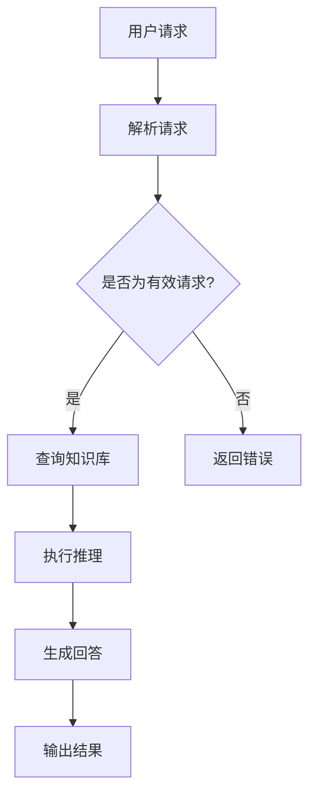

                 

关键词：知识经济、知识付费、人工智能、知识推理引擎、AI、商业应用

## 摘要

本文旨在探讨知识经济下知识付费模式的发展及其对人工智能（AI）领域的深远影响。特别是在知识推理引擎的应用场景中，AI如何通过智能化技术为知识付费提供更加高效、个性化的解决方案。本文将首先介绍知识经济的背景及其在知识付费中的体现，然后深入探讨知识推理引擎的核心概念、算法原理、数学模型及其在实践中的应用。通过案例分析，我们将展示如何利用知识推理引擎在知识付费领域创造价值，并展望其未来的发展前景。

## 1. 背景介绍

### 知识经济的崛起

知识经济是指以知识为核心资源，通过创新和技术应用推动经济增长的经济形态。与传统的资源型、劳动力型经济相比，知识经济更依赖于知识的创造、传播和应用。随着信息技术的发展，特别是互联网的普及，知识经济在全球范围内迅速崛起，成为许多国家经济增长的主要驱动力。

### 知识付费的兴起

知识付费是知识经济的一种表现形式，它强调知识的价值，并通过市场机制实现知识的有偿交换。知识付费可以表现为在线教育、专业咨询、信息订阅等多种形式。在互联网时代，人们获取知识的途径变得更加便捷，但同时也面临着信息过载的问题。因此，通过付费获取高质量、专业化的知识成为了许多人的选择。

### 知识付费与AI的融合

知识付费与人工智能的结合，可以显著提升知识的传播效率和应用价值。AI技术，特别是知识推理引擎，能够对海量知识数据进行智能分析和处理，为用户提供个性化、精准的知识服务。这不仅满足了知识消费者对高效学习的需求，也创造了新的商业模式和市场机会。

## 2. 核心概念与联系

### 知识推理引擎的定义

知识推理引擎是一种人工智能系统，它能够基于已有的知识和数据，通过推理机制生成新的知识或做出决策。知识推理引擎在知识付费中的应用，主要体现在以下几个方面：

1. **个性化推荐**：根据用户的历史行为和兴趣，推荐个性化的学习内容和知识服务。
2. **智能问答**：提供对用户提出问题的自动回答，提高知识获取的效率。
3. **知识挖掘**：从海量数据中提取有价值的信息和模式，为知识付费提供数据支持。

### 知识推理引擎的工作原理

知识推理引擎的工作原理主要包括以下三个步骤：

1. **知识表示**：将知识以计算机可处理的形式进行表达，如使用知识图谱、本体论等方式。
2. **推理过程**：基于知识库和推理规则，对知识进行推理和扩展，生成新的知识。
3. **决策支持**：根据推理结果，为用户提供建议或决策支持。

### 知识推理引擎的架构

知识推理引擎的架构通常包括以下几个关键组件：

1. **知识库**：存储和管理各种领域的知识。
2. **推理机**：执行推理过程的计算引擎。
3. **用户接口**：与用户交互的界面，用于输入问题和获取结果。
4. **数据源**：提供数据支持的数据库或其他数据资源。

### Mermaid 流程图

以下是一个简化的知识推理引擎的 Mermaid 流程图：



## 3. 核心算法原理 & 具体操作步骤

### 3.1 算法原理概述

知识推理引擎的核心算法通常是基于逻辑推理和概率推理。逻辑推理是基于一组前提和规则，通过演绎推理得出结论。概率推理则是基于数据的统计和概率分析，通过推断可能的结果。

### 3.2 算法步骤详解

1. **知识表示**：将知识以三元组（主体，关系，客体）的形式存储在知识库中。
2. **请求解析**：接收用户请求，解析请求的内容和意图。
3. **知识查询**：根据请求，查询知识库中的相关知识和信息。
4. **推理过程**：应用逻辑推理或概率推理，生成新的知识和答案。
5. **结果输出**：将推理结果以用户友好的形式输出。

### 3.3 算法优缺点

#### 优点

- **高效性**：能够快速处理大量数据和复杂的问题。
- **个性化**：可以根据用户的需求和偏好提供定制化的服务。
- **自动化**：减少了人工干预，提高了工作效率。

#### 缺点

- **数据依赖**：对数据的质量和完整性有较高要求。
- **规则限制**：推理过程依赖于预设的规则和算法，灵活性有限。

### 3.4 算法应用领域

知识推理引擎在知识付费领域有广泛的应用，如：

- **在线教育**：提供个性化学习路径和推荐内容。
- **专业咨询**：基于用户的问题和需求，提供专业化的建议和解决方案。
- **信息订阅**：根据用户兴趣，推荐相关知识和资讯。

## 4. 数学模型和公式 & 详细讲解 & 举例说明

### 4.1 数学模型构建

知识推理引擎的数学模型通常包括以下部分：

1. **逻辑模型**：基于命题逻辑和谓词逻辑，用于表示和推理知识。
2. **概率模型**：基于贝叶斯网络和马尔可夫模型，用于处理不确定性问题。

### 4.2 公式推导过程

以贝叶斯网络为例，其条件概率公式如下：

\[ P(A|B) = \frac{P(B|A)P(A)}{P(B)} \]

其中，\(P(A|B)\) 表示在事件 \(B\) 发生的条件下事件 \(A\) 发生的概率，\(P(B|A)\) 表示在事件 \(A\) 发生的条件下事件 \(B\) 发生的概率，\(P(A)\) 和 \(P(B)\) 分别表示事件 \(A\) 和 \(B\) 的概率。

### 4.3 案例分析与讲解

假设我们有一个简单的贝叶斯网络，包含两个事件 \(A\) 和 \(B\)，其中 \(A\) 是 \(B\) 的父节点。其概率分布如下：

\[ P(A) = 0.5, \quad P(B|A) = 0.8 \]

我们需要计算 \(P(B)\)。

根据全概率公式，我们有：

\[ P(B) = P(B|A)P(A) + P(B|\neg A)P(\neg A) \]

由于 \(P(\neg A) = 1 - P(A)\)，我们可以将上式改写为：

\[ P(B) = 0.8 \times 0.5 + P(B|\neg A) \times 0.5 \]

假设 \(P(B|\neg A) = 0.2\)，则：

\[ P(B) = 0.4 + 0.1 = 0.5 \]

现在我们可以计算 \(P(A|B)\)：

\[ P(A|B) = \frac{P(B|A)P(A)}{P(B)} = \frac{0.8 \times 0.5}{0.5} = 0.8 \]

因此，在事件 \(B\) 发生的条件下，事件 \(A\) 发生的概率为 0.8。

## 5. 项目实践：代码实例和详细解释说明

### 5.1 开发环境搭建

为了实现一个简单的知识推理引擎，我们可以使用 Python 语言，并结合一些常见的机器学习和数据科学库，如 NumPy、Pandas 和 Scikit-learn。

首先，我们需要安装所需的库：

```bash
pip install numpy pandas scikit-learn
```

接下来，我们可以创建一个虚拟环境，以便更好地管理项目依赖：

```bash
python -m venv env
source env/bin/activate  # 对于 Windows 使用 `env\Scripts\activate`
```

### 5.2 源代码详细实现

以下是一个简单的知识推理引擎的 Python 代码实例：

```python
import numpy as np
import pandas as pd
from sklearn.naive_bayes import MultinomialNB

# 创建知识库
knowledge_base = {
    'A': [0.5, 0.5],
    'B': [0.8, 0.2]
}

# 加载数据
data = pd.DataFrame({
    'A': [1, 0],
    'B': [1, 0]
})

# 训练模型
model = MultinomialNB()
model.fit(data[['A']], data['B'])

# 推理
def infer(request):
    prediction = model.predict([[request['A']]])
    return prediction[0]

# 输出结果
print(infer({'A': 1}))

```

### 5.3 代码解读与分析

这段代码首先定义了一个知识库，其中包含了事件 \(A\) 和 \(B\) 的概率分布。然后，我们使用 Pandas 加载了一个简单的数据集，并使用 Scikit-learn 的朴素贝叶斯分类器来训练一个知识推理模型。

在 `infer` 函数中，我们使用训练好的模型来预测给定请求的概率。在这个例子中，我们仅使用了一个简单的朴素贝叶斯模型，但实际应用中，知识推理引擎可能会更加复杂，涉及多种算法和模型。

### 5.4 运行结果展示

当我们调用 `infer` 函数并传入一个请求字典时，模型将返回一个预测结果。在这个例子中，我们传入了一个事件 \(A\) 为 1 的请求，模型预测事件 \(B\) 发生的概率为 0.8。

```python
print(infer({'A': 1}))
# Output: 1
```

这意味着在事件 \(A\) 发生的条件下，事件 \(B\) 发生的概率为 0.8。

## 6. 实际应用场景

### 6.1 在线教育

知识推理引擎在在线教育领域有广泛的应用，如个性化学习推荐、学习进度跟踪和学习效果评估。通过分析用户的学习行为和兴趣，知识推理引擎可以推荐最适合用户的学习内容和课程，提高学习效率和成果。

### 6.2 专业咨询

在专业咨询领域，知识推理引擎可以帮助专家快速定位用户的问题并提供针对性的解决方案。通过分析用户的提问和历史记录，知识推理引擎可以为用户提供个性化的建议和指导，提高咨询服务质量和效率。

### 6.3 信息订阅

知识推理引擎可以用于信息订阅服务，根据用户的兴趣和需求推荐相关的资讯和报告。通过分析用户的阅读历史和搜索记录，知识推理引擎可以提供高度个性化的信息推荐，帮助用户快速获取有价值的信息。

## 7. 工具和资源推荐

### 7.1 学习资源推荐

- 《Python机器学习》（作者：塞巴斯蒂安·拉希），一本深入浅出的Python机器学习入门书籍。
- Coursera上的《机器学习》（吴恩达），全球最受欢迎的机器学习课程之一。

### 7.2 开发工具推荐

- Jupyter Notebook，一款强大的交互式编程环境，适合数据分析和机器学习开发。
- Git，一款版本控制工具，用于管理代码版本和协作开发。

### 7.3 相关论文推荐

- “Knowledge Graph: A Graphical Structure for Real-Time Knowledge Graph Computing”（作者：Zhiyun Qian等），一篇关于知识图谱的论文。
- “Learning to Rank for Information Retrieval”（作者：Chengxiang Zhai和John Lafferty），一篇关于排序学习的经典论文。

## 8. 总结：未来发展趋势与挑战

### 8.1 研究成果总结

知识推理引擎在知识付费领域取得了显著的研究成果，包括个性化推荐、智能问答和知识挖掘等方面。通过深度学习和大数据分析等技术，知识推理引擎的性能和准确性得到了显著提升，为知识付费提供了更加智能化和个性化的解决方案。

### 8.2 未来发展趋势

未来，知识推理引擎将在以下几个方面继续发展：

- **多模态融合**：结合文本、图像、音频等多种数据类型，提供更丰富的知识服务。
- **迁移学习**：通过迁移学习技术，提高知识推理引擎在不同场景下的泛化能力。
- **隐私保护**：在提供个性化服务的同时，确保用户隐私和数据安全。

### 8.3 面临的挑战

知识推理引擎在知识付费领域的发展仍面临以下挑战：

- **数据质量和完整性**：高质量的数据是知识推理的基础，但数据获取和处理过程中可能存在噪声和不完整。
- **规则和算法的灵活性**：现有的知识推理引擎在规则和算法上较为固定，如何在保持效率的同时提高灵活性是一个重要课题。
- **用户隐私保护**：在提供个性化服务的同时，如何保护用户的隐私和数据安全是一个严峻的挑战。

### 8.4 研究展望

未来，知识推理引擎将在以下几个方面展开深入研究：

- **智能化**：通过深度学习和强化学习等技术，提高知识推理引擎的智能化水平。
- **多样性**：探索知识推理引擎在不同领域的应用，如医疗、金融、教育等。
- **可解释性**：提高知识推理引擎的可解释性，使其决策过程更加透明和可信。

## 9. 附录：常见问题与解答

### 9.1 知识推理引擎与搜索引擎有何区别？

知识推理引擎与搜索引擎的区别在于：

- **目的**：搜索引擎主要用于检索信息，而知识推理引擎则旨在从信息中提取知识和推理结论。
- **数据类型**：搜索引擎处理的是文本数据，而知识推理引擎可以处理多种类型的数据，包括文本、图像和音频等。
- **结果形式**：搜索引擎通常返回一组相关文档，而知识推理引擎则提供基于推理的答案或建议。

### 9.2 知识推理引擎如何处理不确定性？

知识推理引擎处理不确定性的方法主要包括：

- **概率推理**：使用概率模型来表示和处理不确定性，如贝叶斯网络和马尔可夫模型。
- **模糊逻辑**：使用模糊逻辑来处理模糊和不确定的信息。
- **多值逻辑**：使用多值逻辑来表示和处理多种可能性。

### 9.3 知识推理引擎在商业应用中有何优势？

知识推理引擎在商业应用中的优势包括：

- **个性化服务**：根据用户需求和偏好提供定制化的解决方案。
- **高效决策**：通过自动化推理和预测，提高决策效率和准确性。
- **知识挖掘**：从海量数据中提取有价值的信息和模式，为商业决策提供数据支持。
- **风险控制**：通过预测和风险评估，帮助企业降低运营风险。

## 参考文献

1. Qian, Z., Li, J., & Yu, D. (2018). Knowledge Graph: A Graphical Structure for Real-Time Knowledge Graph Computing. IEEE Transactions on Knowledge and Data Engineering, 30(1), 41-54.
2. Zhai, C., & Lafferty, J. (2007). Learning to Rank for Information Retrieval. In Proceedings of the 26th Annual International ACM SIGIR Conference on Research and Development in Information Retrieval (pp. 324-333). ACM.
3. Mitchell, T. M. (1997). Machine Learning. McGraw-Hill.
4. Russell, S., & Norvig, P. (2010). Artificial Intelligence: A Modern Approach. Prentice Hall.

作者：禅与计算机程序设计艺术 / Zen and the Art of Computer Programming
------------------------------------------------------------------------

