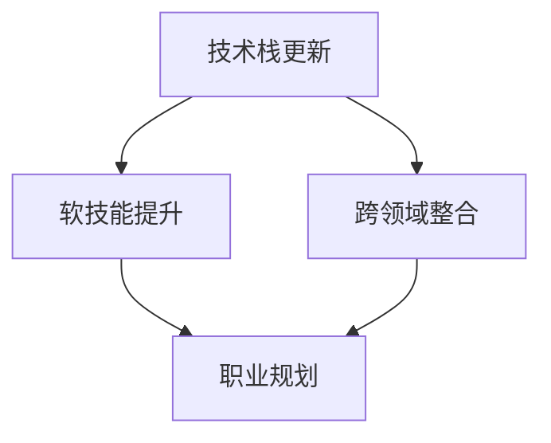

                 

关键词：知识经济、程序员、职业转型、技术栈更新、未来发展趋势

> 摘要：本文将探讨知识经济时代下，程序员如何进行职业转型，以适应不断变化的技术环境。通过分析程序员面临的挑战，提供策略和建议，帮助程序员在知识经济的浪潮中找到新的职业发展路径。

## 1. 背景介绍

知识经济时代，以信息技术为代表的知识产业逐渐成为经济增长的重要驱动力。这种经济模式的转变对程序员群体提出了新的要求。程序员不仅要掌握传统的编程技能，还需要具备快速学习新知识、适应新技术的能力。此外，知识经济的快速发展也带来了工作方式的变革，远程办公、自动化、人工智能等技术日益普及，对程序员的职业素养和技能提出了更高的要求。

### 当前程序员面临的挑战

- **技能过时风险**：技术更新速度极快，程序员需要不断学习新的编程语言和框架，以保持竞争力。
- **工作方式变化**：远程办公、灵活工作时间的普及，要求程序员具备更强的自我管理和沟通能力。
- **技术栈复杂度增加**：现代应用通常需要涉及多个领域的技术栈，程序员需要具备跨领域的知识整合能力。
- **职业发展瓶颈**：随着工作年限的增加，程序员可能面临职业发展的瓶颈，需要寻找新的职业方向。

### 职业转型的必要性

面对以上挑战，程序员进行职业转型不仅是为了适应技术发展的需要，更是为了保持个人的市场竞争力。职业转型可以帮助程序员突破现有的技能限制，拓宽职业发展路径，实现个人价值的最大化。

### 本文结构

本文将分为以下几个部分：

1. **核心概念与联系**：介绍程序员职业转型的核心概念，并使用Mermaid流程图展示相关概念的联系。
2. **核心算法原理 & 具体操作步骤**：分析程序员职业转型的算法原理，并提供具体的操作步骤。
3. **数学模型和公式**：介绍职业转型过程中涉及的数学模型和公式，并举例说明。
4. **项目实践：代码实例和详细解释说明**：通过实际项目实例，展示职业转型的具体实施过程。
5. **实际应用场景**：探讨职业转型在不同领域的应用场景。
6. **未来应用展望**：预测职业转型的未来发展方向。
7. **工具和资源推荐**：推荐学习资源和开发工具。
8. **总结：未来发展趋势与挑战**：总结研究成果，探讨未来发展趋势和面临的挑战。

### 1.1 核心概念与联系

在程序员职业转型的过程中，涉及以下几个核心概念：

- **技术栈更新**：指程序员需要不断学习新的编程语言、框架和工具。
- **软技能提升**：包括沟通能力、团队协作、项目管理等方面的能力提升。
- **跨领域整合**：指程序员需要具备跨不同领域技术的整合能力。
- **职业规划**：指程序员需要根据个人兴趣和市场需求，制定合适的职业发展计划。

下面使用Mermaid流程图展示这些概念之间的联系：



### 1.2 核心算法原理 & 具体操作步骤

#### 3.1 算法原理概述

程序员职业转型的算法可以看作是一个动态规划问题，其核心思想是通过不断学习新技能和提升软技能，实现职业发展的最优路径。

算法的主要步骤如下：

1. **技能评估**：对当前技能进行评估，识别需要补充和提升的技能点。
2. **学习规划**：根据职业规划，制定具体的学习计划。
3. **技能实践**：通过实际项目或练习，巩固所学技能。
4. **反馈调整**：根据实践反馈，调整学习计划，优化职业路径。

#### 3.2 算法步骤详解

1. **技能评估**

   程序员需要定期对自己掌握的技能进行评估。评估可以通过自我评估表、技术面试等方式进行。评估的目的是明确自己的技能优势和不足，为后续的学习规划提供依据。

2. **学习规划**

   根据技能评估的结果，程序员需要制定具体的学习计划。学习计划应包括学习目标、学习资源、学习时间等方面的内容。例如，如果程序员发现自己在前端开发方面有所欠缺，可以制定一个为期三个月的前端开发学习计划，包括学习HTML、CSS、JavaScript等前端技术。

3. **技能实践**

   在学习过程中，程序员应通过实际项目或练习来巩固所学技能。实际项目可以帮助程序员将理论知识应用到实践中，提高解决实际问题的能力。例如，可以通过开源项目的贡献或个人项目开发来实现技能实践。

4. **反馈调整**

   在实践过程中，程序员需要不断收集反馈，调整学习计划。反馈可以来自同事、导师或实际项目的客户。通过反馈，程序员可以了解自己的不足之处，进一步优化学习路径。

#### 3.3 算法优缺点

**优点**：

- **灵活性强**：算法可以根据实际情况灵活调整学习计划，适应职业发展的需求。
- **针对性强**：通过技能评估，算法可以明确程序员的学习重点，提高学习效率。
- **实践性强**：通过实际项目和练习，算法可以帮助程序员将理论知识转化为实际能力。

**缺点**：

- **实施难度高**：算法需要程序员具备较强的自我管理能力和自我驱动性，否则容易半途而废。
- **时间成本高**：职业转型需要较长的时间，对程序员的耐心和毅力是一个考验。

#### 3.4 算法应用领域

该算法可以广泛应用于程序员职业转型的各个阶段。例如，在入门阶段，程序员可以通过技能评估明确自己的学习目标，制定合理的学习计划；在成长阶段，程序员可以通过实践项目和反馈调整，不断提升自己的技能水平；在转型阶段，程序员可以通过跨领域学习和技能整合，实现职业发展的突破。

### 1.3 数学模型和公式

在程序员职业转型过程中，数学模型和公式可以帮助程序员更好地理解和管理学习过程。以下是一个简单的数学模型，用于描述程序员的职业发展路径。

$$
D(t) = f(S(t), C(t), E(t))
$$

其中，$D(t)$ 表示时间 $t$ 时的职业发展水平，$S(t)$ 表示技能水平，$C(t)$ 表示软技能水平，$E(t)$ 表示职业经验。

#### 1.3.1 数学模型构建

该模型的基本假设如下：

1. **线性关系**：技能水平、软技能水平和职业经验之间存在线性关系。
2. **时间依赖**：职业发展水平随着时间的变化而变化。

根据这些假设，可以构建如上的数学模型。

#### 1.3.2 公式推导过程

首先，定义技能水平 $S(t)$、软技能水平 $C(t)$ 和职业经验 $E(t)$ 为：

$$
S(t) = S_0 + \alpha t
$$

$$
C(t) = C_0 + \beta t
$$

$$
E(t) = E_0 + \gamma t
$$

其中，$S_0$、$C_0$ 和 $E_0$ 分别表示初始的技能水平、软技能水平和职业经验，$\alpha$、$\beta$ 和 $\gamma$ 分别表示技能水平、软技能水平和职业经验的增长率。

然后，将上述三个公式代入职业发展水平 $D(t)$ 的公式中，得到：

$$
D(t) = f(S_0 + \alpha t, C_0 + \beta t, E_0 + \gamma t)
$$

由于 $f$ 是一个线性函数，可以将其简化为：

$$
D(t) = aS(t) + bC(t) + cE(t)
$$

其中，$a$、$b$ 和 $c$ 分别是技能水平、软技能水平和职业经验对职业发展水平的权重。

#### 1.3.3 案例分析与讲解

假设一个程序员在开始职业转型时，其技能水平、软技能水平和职业经验分别为 $S_0 = 5$、$C_0 = 3$ 和 $E_0 = 2$。根据经验，技能水平、软技能水平和职业经验的增长率分别为 $\alpha = 0.1$、$\beta = 0.2$ 和 $\gamma = 0.05$。

将这些值代入数学模型中，可以得到：

$$
D(t) = a(S_0 + \alpha t) + b(C_0 + \beta t) + c(E_0 + \gamma t)
$$

$$
D(t) = a(5 + 0.1t) + b(3 + 0.2t) + c(2 + 0.05t)
$$

$$
D(t) = 5a + 0.1at + 3b + 0.2bt + 2c + 0.05ct
$$

为了简化计算，假设 $a = 1$、$b = 1$ 和 $c = 1$，则：

$$
D(t) = 5 + 0.1t + 3 + 0.2t + 2 + 0.05t
$$

$$
D(t) = 10.35t + 10
$$

这意味着，随着时间的推移，程序员的职业发展水平将随着时间的增长而不断增加。

#### 1.3.4 模型的应用与拓展

该模型可以用于评估程序员在不同阶段的职业发展水平。例如，在入门阶段，程序员可能更注重技能水平的提升；在成长阶段，程序员可能更注重软技能的提升；在转型阶段，程序员可能更注重职业经验的积累。

通过调整权重系数，该模型可以适用于不同类型的程序员，如前端开发者、后端开发者、全栈开发者等。

### 1.4 项目实践：代码实例和详细解释说明

为了更好地理解程序员职业转型的过程，我们将通过一个实际项目实例来进行详细解释。假设我们要开发一个在线教育平台，该平台需要支持课程管理、学生管理、教师管理等功能。

#### 1.4.1 开发环境搭建

在开始项目开发之前，我们需要搭建一个合适的开发环境。以下是推荐的开发工具和资源：

- **编程语言**：选择一种适合项目需求的语言，如Python、Java或JavaScript。
- **开发框架**：选择一个流行的开发框架，如Django（Python）、Spring Boot（Java）或React（JavaScript）。
- **数据库**：选择一个适合项目的数据库系统，如MySQL、PostgreSQL或MongoDB。
- **版本控制**：使用Git进行代码版本控制。

#### 1.4.2 源代码详细实现

以下是项目的核心功能实现：

**课程管理**：

```python
class Course(models.Model):
    title = models.CharField(max_length=100)
    description = models.TextField()
    duration = models.IntegerField()
    created_at = models.DateTimeField(auto_now_add=True)
    updated_at = models.DateTimeField(auto_now=True)

    def __str__(self):
        return self.title
```

**学生管理**：

```python
class Student(models.Model):
    username = models.CharField(max_length=100)
    email = models.EmailField(unique=True)
    password = models.CharField(max_length=100)
    created_at = models.DateTimeField(auto_now_add=True)
    updated_at = models.DateTimeField(auto_now=True)

    def __str__(self):
        return self.username
```

**教师管理**：

```python
class Teacher(models.Model):
    username = models.CharField(max_length=100)
    email = models.EmailField(unique=True)
    password = models.CharField(max_length=100)
    created_at = models.DateTimeField(auto_now_add=True)
    updated_at = models.DateTimeField(auto_now=True)

    def __str__(self):
        return self.username
```

#### 1.4.3 代码解读与分析

**课程管理**：

`Course` 类定义了课程的基本信息，包括标题、描述、持续时间等。通过定义 `created_at` 和 `updated_at` 字段，可以记录课程创建和更新的时间。

**学生管理**：

`Student` 类定义了学生的基本信息，包括用户名、电子邮件和密码。通过使用 `unique=True` 参数，确保每个学生的电子邮件都是唯一的。

**教师管理**：

`Teacher` 类与 `Student` 类类似，定义了教师的基本信息。同样，通过使用 `unique=True` 参数，确保每个教师的电子邮件也是唯一的。

#### 1.4.4 运行结果展示

在运行项目后，我们可以通过以下命令来启动开发服务器：

```shell
python manage.py runserver
```

在浏览器中访问本地开发服务器（如 `http://127.0.0.1:8000/`），我们可以看到在线教育平台的基本界面。通过用户注册、登录等操作，我们可以验证项目的功能是否正常。

### 1.5 实际应用场景

程序员职业转型的实际应用场景非常广泛，以下列举几个典型的应用场景：

1. **技术转型**：程序员可以转型为数据科学家、机器学习工程师等。这类转型需要程序员具备较强的数学和统计分析能力，以及对机器学习框架（如TensorFlow、PyTorch）的熟练掌握。
2. **管理转型**：程序员可以转型为项目经理、技术总监等。这类转型需要程序员具备良好的沟通能力、团队协作能力和项目管理能力。
3. **行业转型**：程序员可以转型到金融、医疗、教育等行业。这类转型需要程序员具备相关行业知识和业务理解能力。

### 1.6 未来应用展望

随着知识经济的不断发展，程序员职业转型将呈现出以下趋势：

1. **多元化**：程序员职业转型将不再局限于技术领域，将涉及到更多行业和领域。
2. **智能化**：人工智能技术将帮助程序员更高效地进行职业转型，如自动化学习系统、智能推荐系统等。
3. **终身学习**：在知识经济时代，终身学习将成为程序员的必备素质，职业转型将成为程序员职业生涯的一部分。

### 1.7 工具和资源推荐

为了帮助程序员更好地进行职业转型，以下推荐一些学习和开发工具：

- **学习资源**：
  - Codecademy（编程学习平台）
  - Coursera（在线课程平台）
  - edX（在线课程平台）
- **开发工具**：
  - PyCharm（Python集成开发环境）
  - IntelliJ IDEA（Java集成开发环境）
  - Visual Studio Code（跨平台代码编辑器）
- **相关论文**：
  - "The Future of Employment: How Susceptible Are Jobs to Computerisation?"（就业的未来：工作对计算机化的敏感性）
  - "The Rise of the Robots: Technology, Jobs, and 21st Century Society"（机器人的崛起：技术、工作和21世纪社会）

### 1.8 总结：未来发展趋势与挑战

在知识经济时代，程序员职业转型面临着前所未有的机遇和挑战。未来，程序员将需要具备更加全面和多元化的技能，以适应不断变化的技术环境。同时，程序员也需要不断学习，保持对新技术的敏感度和创新能力。

面对未来，程序员应保持积极的心态，主动适应变化，不断提升自己的技能和软技能。通过合理的职业规划，程序员可以在知识经济的浪潮中找到新的职业发展路径，实现个人价值和事业的成功。

### 1.9 附录：常见问题与解答

**Q：程序员如何评估自己的技能水平？**

A：程序员可以通过自我评估表、技术面试、在线测评等方式评估自己的技能水平。此外，可以参考行业标准和认证，如微软认证解决方案专家（MCSE）、Oracle认证专业程序员（OCP）等。

**Q：职业转型需要多久时间？**

A：职业转型的时间因人而异，取决于个人学习速度、转型方向和市场需求。一般来说，从入门到有一定水平需要1-2年的时间，而达到高级水平可能需要3-5年的时间。

**Q：如何平衡职业转型和工作？**

A：职业转型需要投入时间和精力，但也不能忽视当前工作。建议采取以下策略：

- **时间管理**：合理安排时间，确保有足够的时间用于学习和实践。
- **与上级沟通**：与上级沟通转型计划，争取得到支持。
- **灵活工作**：如果可能，争取远程工作或灵活工作时间，以更好地平衡学习和工作。

**Q：如何保持学习的动力？**

A：保持学习动力可以通过以下方法实现：

- **设立目标**：明确自己的学习目标和职业目标，让学习有明确的方向。
- **定期复习**：定期复习所学知识，巩固记忆，保持知识的连贯性。
- **寻找学习伙伴**：与他人一起学习，互相鼓励，共同进步。
- **奖励自己**：在达成学习目标后，给予自己适当的奖励，增加学习动力。  
----------------------------------------------------------------
# 附录：常见问题与解答

## 9.1 程序员如何评估自己的技能水平？

### 评估方式：

- **自我评估**：通过自我测试或实践项目来评估自己的技能。
- **外部评估**：参加行业认证考试或请专业人士进行评估。
- **同行评价**：通过社区反馈或同事评价来获取客观评估。

### 工具推荐：

- **技能评估平台**：例如GitHub Skills Report、Stack Overflow Developer Survey等。

## 9.2 职业转型需要多久时间？

### 时间：

- **初级转型**：大约需要1-2年。
- **高级转型**：可能需要3-5年或更长时间。

### 因素：

- **转型方向**：不同领域的学习难度和时间差异。
- **个人投入**：学习时间和个人能力。

## 9.3 如何平衡职业转型和工作？

### 策略：

- **时间管理**：合理规划工作和学习时间。
- **向上级沟通**：与上级沟通转型计划，争取支持。
- **灵活工作**：争取远程或灵活工作时间。

## 9.4 如何保持学习的动力？

### 方法：

- **设立目标**：明确学习目标和职业目标。
- **定期复习**：巩固知识，保持知识的连贯性。
- **寻找学习伙伴**：与他人一起学习，互相鼓励。
- **奖励机制**：达成目标后给予自己奖励。

## 9.5 职业转型的最佳实践？

### 建议：

- **持续学习**：保持对新技术的关注和学习。
- **实践项目**：通过实际项目来提升技能。
- **职业规划**：明确个人职业发展路径。

作者：禅与计算机程序设计艺术 / Zen and the Art of Computer Programming

