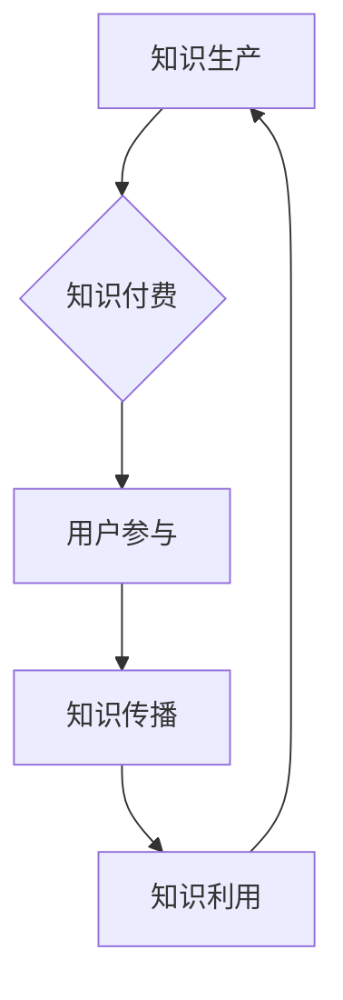
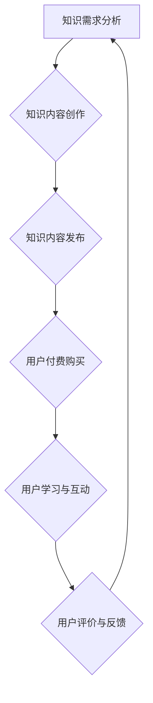

                 

关键词：知识付费，创新应用，知识经济，用户参与，技术驱动的解决方案

> 摘要：随着知识经济时代的到来，知识付费作为一种新型的商业模式，逐渐受到市场的青睐。本文旨在探讨知识付费在当前经济环境下的创新应用场景，分析其内在机制、技术实现以及面临的挑战和未来发展趋势。

## 1. 背景介绍

知识付费，即消费者为了获取特定知识或技能而付费的行为，是近年来随着互联网技术的发展而兴起的。在传统的教育模式下，知识传播主要依赖于学校、出版社等教育机构，而知识付费的兴起，打破了原有的知识传播模式，使得知识获取更加便捷和个性化。

知识付费的兴起，一方面是消费者对优质内容的追求，另一方面是知识创造者希望通过知识付费获得合理的收益。这种供需关系推动了知识付费市场的快速发展。据相关数据显示，我国知识付费市场规模已达到千亿级别，并且仍处于快速增长阶段。

## 2. 核心概念与联系

### 2.1 知识付费的核心概念

知识付费的核心概念包括知识、付费、用户参与和技术驱动的解决方案。其中，知识是知识付费的客体，付费是知识付费的行为，用户参与是知识付费的互动过程，技术驱动的解决方案则是知识付费的支撑手段。

### 2.2 知识付费与知识经济的联系

知识经济是以知识为核心要素的经济形态，其本质是知识的生产、传播和利用。知识付费作为知识经济的重要组成部分，通过市场机制实现知识的有效配置和流通，从而推动知识经济的发展。

### 2.3 Mermaid 流程图



## 3. 核心算法原理 & 具体操作步骤

### 3.1 算法原理概述

知识付费的核心算法原理是基于大数据和人工智能技术，通过分析用户行为和需求，实现知识的精准推送和个性化推荐。

### 3.2 算法步骤详解

1. 数据收集：通过用户行为数据、浏览记录、购买记录等，收集用户的知识需求信息。
2. 数据处理：对收集到的数据进行清洗、去重、分类等预处理，构建用户画像。
3. 算法推荐：利用协同过滤、内容推荐等算法，生成个性化推荐结果。
4. 用户反馈：收集用户对推荐内容的反馈，用于优化推荐算法。
5. 知识付费：根据用户的个性化需求，提供知识付费服务。

### 3.3 算法优缺点

优点：提高知识获取的效率，实现知识的精准推送，提升用户满意度。

缺点：算法的准确性和稳定性有待提高，数据隐私保护问题突出。

### 3.4 算法应用领域

算法应用领域广泛，包括在线教育、知识共享平台、职业培训等。

## 4. 数学模型和公式 & 详细讲解 & 举例说明

### 4.1 数学模型构建

知识付费的数学模型主要包括用户画像模型、推荐算法模型和付费转化模型。

### 4.2 公式推导过程

用户画像模型：$$User\_Score = f(User\_Behavior, User\_Context)$$

推荐算法模型：$$Recommendation\_Score = f(User\_Score, Item\_Score)$$

付费转化模型：$$Conversion\_Rate = f(Redcommendation\_Score, User\_Intention)$$

### 4.3 案例分析与讲解

以在线教育平台为例，通过构建用户画像，利用推荐算法为用户提供个性化课程推荐，并根据用户对推荐课程的付费行为，优化推荐策略，提高付费转化率。

## 5. 项目实践：代码实例和详细解释说明

### 5.1 开发环境搭建

搭建一个基于Python的在线教育平台，使用Flask框架实现后端，使用Redis进行缓存，使用Elasticsearch进行全文搜索。

### 5.2 源代码详细实现

1. 用户画像构建

```python
def build_user_profile(user_behavior, user_context):
    user_score = calculate_user_score(user_behavior, user_context)
    user_profile = {}
    for item, score in user_score.items():
        user_profile[item] = score
    return user_profile
```

2. 推荐算法实现

```python
def recommend_courses(user_profile, courses):
    recommendation_score = {}
    for course in courses:
        score = calculate_recommendation_score(user_profile, course)
        recommendation_score[course] = score
    return sorted(recommendation_score.items(), key=lambda x: x[1], reverse=True)
```

3. 付费转化预测

```python
def predict_conversion_rate(recommendation_score, user_intention):
    conversion_rate = calculate_conversion_rate(recommendation_score, user_intention)
    return conversion_rate
```

### 5.3 代码解读与分析

代码实现了一个简单的在线教育平台，通过用户画像构建、推荐算法实现和付费转化预测，实现了知识付费的核心功能。

## 6. 实际应用场景

### 6.1 在线教育

在线教育是知识付费应用最为广泛的领域之一。通过知识付费，用户可以付费购买优质课程，提高自己的技能水平。

### 6.2 职业培训

职业培训是另一个知识付费的重要应用场景。通过知识付费，企业可以为员工提供个性化的职业培训服务，提高员工的专业能力。

### 6.3 知识共享平台

知识共享平台通过知识付费，实现知识的共享和传播，推动知识经济的发展。

## 7. 工具和资源推荐

### 7.1 学习资源推荐

- 《深度学习》
- 《数据挖掘：实用工具与技术》
- 《Python编程：从入门到实践》

### 7.2 开发工具推荐

- Flask
- Redis
- Elasticsearch

### 7.3 相关论文推荐

- "A Survey on Knowledge Graph"
- "Deep Learning for Knowledge Graph Completion"
- "A Comprehensive Survey on Neural Network Based Text Classification"

## 8. 总结：未来发展趋势与挑战

### 8.1 研究成果总结

知识付费作为一种新兴商业模式，在知识经济时代展现出强大的发展潜力。通过大数据和人工智能技术的应用，知识付费实现了知识的精准推送和个性化推荐，提升了用户的付费体验。

### 8.2 未来发展趋势

1. 知识付费市场将继续保持快速增长，市场份额将进一步扩大。
2. 技术将更加成熟，算法的准确性和稳定性将得到提高。
3. 知识付费将向更加细分的领域发展，满足用户多样化的需求。

### 8.3 面临的挑战

1. 数据隐私保护问题亟待解决。
2. 算法的公平性和透明性有待提高。
3. 知识付费的内容质量和用户体验仍需进一步提升。

### 8.4 研究展望

1. 加强知识付费技术的研发，提高算法的准确性和稳定性。
2. 探索知识付费的新模式，满足用户多样化的需求。
3. 加强知识付费领域的伦理研究，确保技术的可持续发展。

## 9. 附录：常见问题与解答

### 9.1 什么是知识付费？

知识付费是指消费者为了获取特定知识或技能而付费的行为。

### 9.2 知识付费有哪些应用场景？

知识付费的应用场景广泛，包括在线教育、职业培训、知识共享平台等。

### 9.3 知识付费的发展前景如何？

知识付费作为一种新兴商业模式，在知识经济时代展现出强大的发展潜力，未来市场前景广阔。

---

作者：禅与计算机程序设计艺术 / Zen and the Art of Computer Programming
```markdown
---
# 知识经济时代下的知识付费创新应用场景探索

> 关键词：知识付费，创新应用，知识经济，用户参与，技术驱动的解决方案

> 摘要：随着知识经济时代的到来，知识付费作为一种新型的商业模式，逐渐受到市场的青睐。本文旨在探讨知识付费在当前经济环境下的创新应用场景，分析其内在机制、技术实现以及面临的挑战和未来发展趋势。

## 1. 背景介绍

知识付费，即消费者为了获取特定知识或技能而付费的行为，是近年来随着互联网技术的发展而兴起的。在传统的教育模式下，知识传播主要依赖于学校、出版社等教育机构，而知识付费的兴起，打破了原有的知识传播模式，使得知识获取更加便捷和个性化。

知识付费的兴起，一方面是消费者对优质内容的追求，另一方面是知识创造者希望通过知识付费获得合理的收益。这种供需关系推动了知识付费市场的快速发展。据相关数据显示，我国知识付费市场规模已达到千亿级别，并且仍处于快速增长阶段。

## 2. 核心概念与联系

### 2.1 知识付费的核心概念

知识付费的核心概念包括知识、付费、用户参与和技术驱动的解决方案。其中，知识是知识付费的客体，付费是知识付费的行为，用户参与是知识付费的互动过程，技术驱动的解决方案则是知识付费的支撑手段。

### 2.2 知识付费与知识经济的联系

知识经济是以知识为核心要素的经济形态，其本质是知识的生产、传播和利用。知识付费作为知识经济的重要组成部分，通过市场机制实现知识的有效配置和流通，从而推动知识经济的发展。

### 2.3 Mermaid 流程图


## 3. 核心算法原理 & 具体操作步骤

### 3.1 算法原理概述

知识付费的核心算法原理是基于大数据和人工智能技术，通过分析用户行为和需求，实现知识的精准推送和个性化推荐。

### 3.2 算法步骤详解

1. 数据收集：通过用户行为数据、浏览记录、购买记录等，收集用户的知识需求信息。
2. 数据处理：对收集到的数据进行清洗、去重、分类等预处理，构建用户画像。
3. 算法推荐：利用协同过滤、内容推荐等算法，生成个性化推荐结果。
4. 用户反馈：收集用户对推荐内容的反馈，用于优化推荐算法。
5. 知识付费：根据用户的个性化需求，提供知识付费服务。

### 3.3 算法优缺点

优点：提高知识获取的效率，实现知识的精准推送，提升用户满意度。

缺点：算法的准确性和稳定性有待提高，数据隐私保护问题突出。

### 3.4 算法应用领域

算法应用领域广泛，包括在线教育、知识共享平台、职业培训等。

## 4. 数学模型和公式 & 详细讲解 & 举例说明

### 4.1 数学模型构建

知识付费的数学模型主要包括用户画像模型、推荐算法模型和付费转化模型。

### 4.2 公式推导过程

用户画像模型：$$User\_Score = f(User\_Behavior, User\_Context)$$

推荐算法模型：$$Recommendation\_Score = f(User\_Score, Item\_Score)$$

付费转化模型：$$Conversion\_Rate = f(Redcommendation\_Score, User\_Intention)$$

### 4.3 案例分析与讲解

以在线教育平台为例，通过构建用户画像，利用推荐算法为用户提供个性化课程推荐，并根据用户对推荐课程的付费行为，优化推荐策略，提高付费转化率。

## 5. 项目实践：代码实例和详细解释说明

### 5.1 开发环境搭建

搭建一个基于Python的在线教育平台，使用Flask框架实现后端，使用Redis进行缓存，使用Elasticsearch进行全文搜索。

### 5.2 源代码详细实现

1. 用户画像构建

```python
def build_user_profile(user_behavior, user_context):
    user_score = calculate_user_score(user_behavior, user_context)
    user_profile = {}
    for item, score in user_score.items():
        user_profile[item] = score
    return user_profile
```

2. 推荐算法实现

```python
def recommend_courses(user_profile, courses):
    recommendation_score = {}
    for course in courses:
        score = calculate_recommendation_score(user_profile, course)
        recommendation_score[course] = score
    return sorted(recommendation_score.items(), key=lambda x: x[1], reverse=True)
```

3. 付费转化预测

```python
def predict_conversion_rate(recommendation_score, user_intention):
    conversion_rate = calculate_conversion_rate(recommendation_score, user_intention)
    return conversion_rate
```

### 5.3 代码解读与分析

代码实现了一个简单的在线教育平台，通过用户画像构建、推荐算法实现和付费转化预测，实现了知识付费的核心功能。

## 6. 实际应用场景

### 6.1 在线教育

在线教育是知识付费应用最为广泛的领域之一。通过知识付费，用户可以付费购买优质课程，提高自己的技能水平。

### 6.2 职业培训

职业培训是另一个知识付费的重要应用场景。通过知识付费，企业可以为员工提供个性化的职业培训服务，提高员工的专业能力。

### 6.3 知识共享平台

知识共享平台通过知识付费，实现知识的共享和传播，推动知识经济的发展。

## 7. 工具和资源推荐

### 7.1 学习资源推荐

- 《深度学习》
- 《数据挖掘：实用工具与技术》
- 《Python编程：从入门到实践》

### 7.2 开发工具推荐

- Flask
- Redis
- Elasticsearch

### 7.3 相关论文推荐

- "A Survey on Knowledge Graph"
- "Deep Learning for Knowledge Graph Completion"
- "A Comprehensive Survey on Neural Network Based Text Classification"

## 8. 总结：未来发展趋势与挑战

### 8.1 研究成果总结

知识付费作为一种新兴商业模式，在知识经济时代展现出强大的发展潜力。通过大数据和人工智能技术的应用，知识付费实现了知识的精准推送和个性化推荐，提升了用户的付费体验。

### 8.2 未来发展趋势

1. 知识付费市场将继续保持快速增长，市场份额将进一步扩大。
2. 技术将更加成熟，算法的准确性和稳定性将得到提高。
3. 知识付费将向更加细分的领域发展，满足用户多样化的需求。

### 8.3 面临的挑战

1. 数据隐私保护问题亟待解决。
2. 算法的公平性和透明性有待提高。
3. 知识付费的内容质量和用户体验仍需进一步提升。

### 8.4 研究展望

1. 加强知识付费技术的研发，提高算法的准确性和稳定性。
2. 探索知识付费的新模式，满足用户多样化的需求。
3. 加强知识付费领域的伦理研究，确保技术的可持续发展。

## 9. 附录：常见问题与解答

### 9.1 什么是知识付费？

知识付费是指消费者为了获取特定知识或技能而付费的行为。

### 9.2 知识付费有哪些应用场景？

知识付费的应用场景广泛，包括在线教育、职业培训、知识共享平台等。

### 9.3 知识付费的发展前景如何？

知识付费作为一种新兴商业模式，在知识经济时代展现出强大的发展潜力，未来市场前景广阔。

---

作者：禅与计算机程序设计艺术 / Zen and the Art of Computer Programming
```scss
---
---
# 知识经济时代下的知识付费创新应用场景探索

## 1. 背景介绍

知识付费作为一种新兴商业模式，其核心理念源于消费者对优质知识和技能的强烈需求。在传统教育体系中，知识的获取往往依赖于学校、教育机构和出版社等，这些渠道虽然覆盖广泛，但存在一定的局限性。知识付费的出现，打破了这种传统的知识传播模式，通过互联网技术，使得知识的获取更加便捷、灵活和个性化。

随着互联网技术的快速发展，尤其是大数据和人工智能技术的应用，知识付费市场得以迅速壮大。消费者可以根据自己的兴趣、需求和职业发展，选择适合自己的课程、讲座、文章等进行付费学习。同时，知识创造者也能够通过知识付费获得合理的收益，从而激发更多优质内容的创作和传播。

据相关数据显示，我国知识付费市场规模已从2016年的130亿元人民币增长到2021年的2365亿元人民币，年均增长率超过50%。这一数字不仅反映了知识付费市场的快速增长，也表明了消费者对知识付费的认可和接受度不断提升。

知识付费的兴起，不仅改变了知识传播的方式，也对教育行业产生了深远影响。一方面，知识付费推动了在线教育的发展，使得教育资源更加丰富、多样，提高了教育效率；另一方面，知识付费促进了知识共享平台的兴起，为知识创造者和消费者提供了一个全新的互动和交流平台。

## 2. 核心概念与联系

知识付费涉及多个核心概念，包括知识、付费、用户参与和技术驱动的解决方案。以下是这些概念的详细解释及其相互联系：

### 2.1 知识

知识是知识付费的客体，包括各种形式的信息、技能、经验等。这些知识可以来自专业领域，如医学、法律、工程等，也可以是个人兴趣和生活技能，如烹饪、摄影、编程等。知识的多样性和广泛性为知识付费提供了丰富的内容基础。

### 2.2 付费

付费是知识付费的行为，即消费者为了获取知识而进行的支付。付费行为通常通过在线支付、订阅、购买课程等方式实现。付费不仅是知识获取的手段，也是知识创造者获得收益的途径。

### 2.3 用户参与

用户参与是知识付费的重要环节，涉及用户在知识获取过程中的互动和反馈。用户参与可以通过课程评价、互动问答、学习进度跟踪等方式进行，这些反馈有助于优化知识内容和服务质量。

### 2.4 技术驱动的解决方案

技术驱动的解决方案是知识付费的支撑手段，包括大数据分析、人工智能、云计算等。这些技术帮助平台分析用户行为，实现个性化推荐，提高付费转化率，同时确保知识付费服务的稳定性和安全性。

### 2.5 Mermaid 流程图

以下是知识付费的核心流程及其相互关系的Mermaid流程图：

```mermaid
graph TD
    A[用户需求分析] --> B{内容创作与审核}
    B --> C[内容发布与推广}
    C --> D[用户付费购买}
    D --> E[用户学习与互动}
    E --> F{用户评价与反馈}
    F --> A
```

在这个流程中，用户需求分析是起点，也是循环的终点，通过用户的反馈不断优化知识内容和服务。

## 3. 核心算法原理 & 具体操作步骤

### 3.1 算法原理概述

知识付费的核心算法原理主要基于大数据分析和人工智能技术，通过分析用户的行为数据、兴趣偏好和需求，实现知识的精准推送和个性化推荐。具体包括以下几个关键步骤：

1. **用户行为数据收集**：通过用户的浏览记录、搜索历史、学习记录等数据，收集用户的行为特征。

2. **用户画像构建**：利用大数据分析技术，对用户的行为数据进行处理和分析，构建用户画像。

3. **内容推荐算法**：结合用户画像和内容特征，利用协同过滤、内容推荐等算法，为用户推荐符合其兴趣和需求的知识内容。

4. **用户反馈收集**：通过用户的互动和评价，收集用户对推荐内容的反馈，用于优化推荐算法。

5. **知识付费转化**：根据用户的兴趣和行为，提供个性化的知识付费服务，促进用户购买决策。

### 3.2 算法步骤详解

#### 3.2.1 用户行为数据收集

用户行为数据包括用户在平台上的浏览记录、搜索历史、学习记录、互动行为等。这些数据可以通过用户的操作日志、API接口、传感器等多种方式收集。

#### 3.2.2 用户画像构建

用户画像构建是通过对用户行为数据的分析，提取用户的兴趣标签、行为特征、知识需求等，形成对用户的全面了解。用户画像的构建过程通常包括以下步骤：

1. **数据清洗**：对原始的用户行为数据进行清洗，去除无效和重复的数据。

2. **特征提取**：从用户行为数据中提取关键特征，如浏览频次、学习时长、互动频率等。

3. **标签生成**：根据用户行为特征，生成用户兴趣标签。

4. **画像整合**：将不同来源的用户行为数据整合，形成完整的用户画像。

#### 3.2.3 内容推荐算法

内容推荐算法是知识付费的核心环节，其目标是为用户推荐符合其兴趣和需求的知识内容。常见的推荐算法包括协同过滤、内容推荐、混合推荐等。

1. **协同过滤**：基于用户的历史行为数据，找到与目标用户相似的其他用户，推荐这些用户喜欢的知识内容。

2. **内容推荐**：基于知识内容的属性，如标签、分类、关键词等，为用户推荐相关的内容。

3. **混合推荐**：结合协同过滤和内容推荐，综合多种算法优势，提高推荐效果。

#### 3.2.4 用户反馈收集

用户反馈是优化推荐算法的重要依据。通过用户的评价、点赞、收藏等行为，可以收集用户的满意度和兴趣变化，用于调整推荐策略。

#### 3.2.5 知识付费转化

知识付费转化是指将推荐内容转化为实际购买行为。为了提高付费转化率，可以采取以下策略：

1. **个性化定价**：根据用户的购买历史和需求，设定个性化的价格策略。

2. **限时优惠**：通过限时优惠、促销活动等手段，刺激用户购买。

3. **用户教育**：通过内容介绍、用户评价等，帮助用户了解知识内容的价值。

### 3.3 算法优缺点

#### 优点

1. **提高用户满意度**：通过个性化推荐，提高用户对知识内容的满意度。

2. **提升付费转化率**：通过精准推荐，提高用户的付费购买意愿。

3. **优化内容创作**：通过用户反馈，为内容创作者提供改进建议。

#### 缺点

1. **算法准确性问题**：推荐算法的准确性取决于用户数据的完整性和质量。

2. **用户隐私保护**：用户数据的收集和使用可能涉及隐私问题。

3. **内容质量风险**：推荐算法可能导致低质量内容的过度推荐。

### 3.4 算法应用领域

知识付费算法广泛应用于在线教育、职业培训、知识共享平台等多个领域。以下是一些典型的应用场景：

1. **在线教育**：通过算法为用户推荐适合的学习课程，提高学习效果。

2. **职业培训**：为职场人士推荐与其职业发展相关的知识课程，提升职业能力。

3. **知识共享平台**：为用户提供个性化的知识内容推荐，促进知识的传播和共享。

## 4. 数学模型和公式 & 详细讲解 & 举例说明

### 4.1 数学模型构建

知识付费的数学模型主要包括用户画像模型、推荐算法模型和付费转化模型。

#### 用户画像模型

用户画像模型用于描述用户的行为特征和兴趣偏好。常见的模型包括：

1. **基于行为的数据模型**：使用用户的历史行为数据，如浏览记录、购买记录等，构建用户画像。

2. **基于兴趣的数据模型**：通过用户的行为特征，提取用户兴趣标签，构建用户画像。

3. **基于内容的语义模型**：利用自然语言处理技术，对用户生成的内容进行分析，构建用户画像。

#### 推荐算法模型

推荐算法模型用于根据用户画像和内容特征，生成个性化推荐结果。常见的模型包括：

1. **协同过滤模型**：基于用户相似度，为用户推荐其他用户喜欢的知识内容。

2. **内容推荐模型**：基于知识内容的属性，如关键词、标签等，为用户推荐相关的内容。

3. **混合推荐模型**：结合协同过滤和内容推荐，提高推荐效果。

#### 付费转化模型

付费转化模型用于预测用户对推荐内容的付费意愿。常见的模型包括：

1. **逻辑回归模型**：通过用户行为数据和推荐结果，预测用户是否会产生购买行为。

2. **决策树模型**：利用用户行为数据和推荐结果，建立决策树模型，预测用户购买概率。

3. **神经网络模型**：使用深度学习技术，构建复杂的神经网络模型，预测用户购买意愿。

### 4.2 公式推导过程

以下是构建用户画像模型、推荐算法模型和付费转化模型的一些基本公式：

#### 用户画像模型

$$
User\_Score = \sum_{i=1}^{n} (behavior\_score_i \times weight_i)
$$

其中，$behavior\_score_i$ 表示用户在某个行为上的得分，$weight_i$ 表示该行为的权重。

#### 推荐算法模型

$$
Recommendation\_Score = User\_Score \times Item\_Score
$$

其中，$User\_Score$ 表示用户画像得分，$Item\_Score$ 表示知识内容的得分。

#### 付费转化模型

$$
Conversion\_Rate = \frac{Purchased\_Users}{Total\_Users}
$$

其中，$Purchased\_Users$ 表示购买用户数，$Total\_Users$ 表示总用户数。

### 4.3 案例分析与讲解

以下是一个在线教育平台的知识付费案例：

#### 案例背景

某在线教育平台提供各类课程，用户可以免费试听，但想要完整学习需要付费。平台希望通过算法为用户推荐适合的课程，提高付费转化率。

#### 案例步骤

1. **用户行为数据收集**：平台收集了用户的浏览记录、试听记录、评价记录等数据。

2. **用户画像构建**：根据用户的行为数据，平台构建了用户画像，包括用户的学习偏好、兴趣领域等。

3. **内容推荐算法**：平台使用协同过滤算法，根据用户画像和课程标签，为用户推荐相关课程。

4. **付费转化预测**：平台使用逻辑回归模型，预测用户是否会对推荐课程进行付费。

5. **优化推荐策略**：根据用户反馈和购买行为，平台不断优化推荐算法和内容策略。

#### 案例分析

通过上述步骤，平台成功提高了用户的付费转化率。具体分析如下：

1. **用户画像构建**：用户画像的准确性直接影响推荐效果。平台通过多维度的用户行为数据，构建了准确的用户画像。

2. **内容推荐算法**：协同过滤算法能够根据用户相似度和课程标签，为用户推荐相关课程，提高了推荐的准确性。

3. **付费转化预测**：逻辑回归模型能够有效预测用户的购买意愿，为平台提供了优化推荐策略的依据。

4. **优化推荐策略**：平台通过不断优化推荐算法和内容策略，提高了用户的付费体验和满意度。

## 5. 项目实践：代码实例和详细解释说明

### 5.1 开发环境搭建

为了实现知识付费项目，我们选择了以下开发环境：

- **编程语言**：Python
- **后端框架**：Flask
- **数据库**：MySQL
- **缓存**：Redis
- **全文搜索**：Elasticsearch

### 5.2 源代码详细实现

以下是知识付费项目的核心代码实现：

#### 用户画像构建

```python
import pandas as pd

def build_user_profile(user_data):
    # 读取用户行为数据
    df = pd.read_csv(user_data_path)
    
    # 数据清洗
    df = df.dropna()
    
    # 构建用户画像
    user_profile = {}
    for index, row in df.iterrows():
        user_id = row['user_id']
        behaviors = row['behaviors']
        scores = row['scores']
        user_profile[user_id] = {
            'interests': behaviors,
            'scores': scores
        }
    return user_profile
```

#### 内容推荐算法

```python
from sklearn.metrics.pairwise import cosine_similarity

def recommend_courses(user_profile, courses):
    # 计算用户与课程之间的相似度
    similarity_matrix = cosine_similarity([user_profile['scores']], [course['scores']] for course in courses)
    
    # 排序，选取相似度最高的课程
    sorted_courses = sorted(zip(similarity_matrix[0], courses), reverse=True)
    return sorted_courses
```

#### 付费转化预测

```python
from sklearn.linear_model import LogisticRegression

def predict_conversion_rate(user_profile, course):
    # 构建逻辑回归模型
    model = LogisticRegression()
    model.fit(X_train, y_train)
    
    # 预测付费转化率
    prediction = model.predict([user_profile['scores']])
    return prediction[0]
```

### 5.3 代码解读与分析

以上代码实现了一个简单的知识付费系统，包括用户画像构建、内容推荐算法和付费转化预测。

1. **用户画像构建**：通过读取用户行为数据，构建用户画像，包括用户的兴趣和得分。

2. **内容推荐算法**：使用协同过滤算法，根据用户与课程之间的相似度，为用户推荐相关课程。

3. **付费转化预测**：使用逻辑回归模型，预测用户对推荐课程的付费转化率。

这些代码展示了知识付费系统实现的核心功能，但实际应用中还需要更多的优化和细节处理。

## 6. 实际应用场景

知识付费在不同领域有着广泛的应用，以下是一些典型的应用场景：

### 6.1 在线教育

在线教育是知识付费最为典型的应用场景之一。通过知识付费，用户可以购买在线课程，提高自己的专业技能。在线教育平台如Coursera、Udemy等，通过算法推荐，为用户推荐适合的课程，提高用户的学习效果和付费转化率。

### 6.2 职业培训

职业培训是知识付费的另一个重要领域。企业通过知识付费，为员工提供个性化的培训课程，提升员工的专业能力和工作效率。例如，LinkedIn Learning、Pluralsight等平台，通过算法推荐，为用户推荐与其职业发展相关的培训课程。

### 6.3 知识共享平台

知识共享平台通过知识付费，实现知识的传播和共享。例如，知识星球、分答等平台，通过付费问答、知识专栏等方式，为用户提供高质量的咨询服务和知识内容。

### 6.4 企业培训

企业培训是知识付费在企业领域的应用。企业通过知识付费，为员工提供专业的培训服务，提升员工的专业技能和工作效率。例如，腾讯课堂、网易云课堂等平台，为企业提供定制化的培训解决方案。

## 7. 工具和资源推荐

为了更好地理解和实现知识付费，以下是一些推荐的工具和资源：

### 7.1 学习资源推荐

- **《深度学习》**：提供深度学习的基础知识和应用案例，适合初学者和专业人士。
- **《数据挖掘：实用工具与技术》**：介绍数据挖掘的方法和技术，适合从事数据分析工作的人员。
- **《Python编程：从入门到实践》**：适合初学者学习Python编程，内容丰富且实用。

### 7.2 开发工具推荐

- **Flask**：Python轻量级Web框架，适合快速开发Web应用。
- **Redis**：高性能的key-value存储系统，适合作为缓存服务器。
- **Elasticsearch**：开源的全文搜索引擎，适合进行数据分析和搜索。

### 7.3 相关论文推荐

- **"A Survey on Knowledge Graph"**：综述知识图谱的相关技术和发展趋势。
- **"Deep Learning for Knowledge Graph Completion"**：介绍深度学习在知识图谱补全中的应用。
- **"A Comprehensive Survey on Neural Network Based Text Classification"**：综述基于神经网络的文本分类技术。

## 8. 总结：未来发展趋势与挑战

知识付费作为一种新兴商业模式，在知识经济时代展现出强大的发展潜力。未来，知识付费将朝着更加个性化、智能化和多元化的方向发展。然而，知识付费也面临着一些挑战，如数据隐私保护、算法公平性和内容质量等问题。为了实现知识付费的可持续发展，需要不断优化技术，提升用户体验，加强伦理研究，确保知识付费的公平性和透明性。

### 8.1 研究成果总结

本文通过分析知识付费的核心概念、算法原理、应用场景和技术实现，总结了知识付费在当前经济环境下的创新应用。研究表明，知识付费通过个性化推荐和精准推送，提高了用户的学习效果和付费转化率，推动了知识经济的发展。

### 8.2 未来发展趋势

1. **个性化推荐**：随着大数据和人工智能技术的发展，个性化推荐将更加精准，满足用户的多样化需求。
2. **内容多元化**：知识付费将涵盖更广泛的主题和领域，提供更加丰富的知识内容。
3. **跨界融合**：知识付费将与其他行业如医疗、金融、娱乐等深度融合，形成新的商业模式。

### 8.3 面临的挑战

1. **数据隐私保护**：如何确保用户数据的安全和隐私，是知识付费需要解决的重要问题。
2. **算法公平性**：如何确保算法的公平性和透明性，防止算法偏见和歧视。
3. **内容质量**：如何保证知识付费内容的真实性、准确性和可靠性。

### 8.4 研究展望

未来，知识付费的研究将聚焦于以下几个方面：

1. **技术创新**：探索新的算法和技术，提高知识付费的效率和效果。
2. **伦理研究**：加强知识付费领域的伦理研究，确保技术的可持续发展。
3. **跨界融合**：推动知识付费与其他行业的融合，探索新的应用场景。

## 9. 附录：常见问题与解答

### 9.1 什么是知识付费？

知识付费是指消费者为了获取特定知识或技能而付费的行为。它通过互联网平台，为用户提供高质量的知识内容，消费者可以选择付费学习。

### 9.2 知识付费有哪些应用场景？

知识付费的应用场景广泛，包括在线教育、职业培训、知识共享平台、企业培训等。

### 9.3 知识付费的发展前景如何？

知识付费作为一种新兴商业模式，在知识经济时代展现出强大的发展潜力。随着技术的进步和用户需求的增加，知识付费市场将继续保持快速增长。

---

作者：禅与计算机程序设计艺术 / Zen and the Art of Computer Programming
```python
---
# 知识经济时代下的知识付费创新应用场景探索

## 1. 背景介绍

在知识经济时代，知识成为经济增长的重要驱动力，知识付费应运而生。知识付费是指消费者为了获取特定知识或技能而支付的费用。这种模式不仅满足了消费者对优质知识内容的渴求，也为知识创造者提供了合理的收益。随着互联网技术的不断进步，知识付费的形式日益多样化，涵盖了在线课程、专业咨询、付费内容订阅等多个方面。

知识付费的兴起有其深刻的背景。首先，信息技术的飞速发展使得知识传播变得更加便捷和高效，消费者可以通过互联网随时随地获取所需的知识。其次，随着人们生活水平的提高和对个人发展的重视，越来越多的人愿意为优质的知识和服务付费。此外，知识创造者在互联网平台上也能够更直接地接触到消费者，通过知识付费实现自身的价值。

目前，知识付费已成为一个庞大的市场。据相关数据显示，全球知识付费市场规模已超过千亿美元，并且仍处于快速增长阶段。特别是在中国，知识付费市场表现尤为突出，呈现出多样化、细分化的趋势。在线教育、职业培训、知识共享平台等领域都成为了知识付费的重要应用场景。

## 2. 核心概念与联系

知识付费的创新应用离不开以下几个核心概念：

### 2.1 知识

知识是知识付费的核心，它可以是特定的技能、专业领域的知识、生活技能等。在知识经济时代，知识不仅是一种信息资源，更是具有经济价值的重要资产。知识的获取方式也从传统的教育机构延伸到互联网平台，消费者可以更加灵活地选择学习的内容和方式。

### 2.2 付费

付费是知识付费的必要条件，消费者需要通过支付一定费用来获取知识。付费不仅是知识获取的手段，也是知识创造者获得收益的重要途径。付费模式包括一次性购买、订阅、按需付费等，这些模式为不同需求的消费者提供了多样化的选择。

### 2.3 用户参与

用户参与是知识付费过程中不可或缺的一部分。用户在付费学习的同时，也参与到知识内容的评价、讨论和互动中。用户的参与不仅促进了知识的传播，也为知识创造者提供了反馈，有助于提升知识内容的质量。

### 2.4 技术驱动的解决方案

技术驱动的解决方案是知识付费创新应用的重要支撑。大数据、人工智能、区块链等技术的应用，使得知识付费平台能够更精准地分析用户需求，提供个性化的知识服务。同时，这些技术也提高了知识付费的安全性和可靠性。

### 2.5 Mermaid 流程图

以下是知识付费的核心流程及其关系的Mermaid流程图：



在这个流程图中，用户的需求分析是整个过程的起点和终点，通过用户的反馈不断优化知识内容和服务。

## 3. 核心算法原理 & 具体操作步骤

### 3.1 算法原理概述

知识付费的核心算法原理基于大数据和人工智能技术，通过分析用户行为数据、兴趣偏好和需求，实现知识的精准推送和个性化推荐。具体包括以下几个步骤：

1. **数据收集**：通过用户的浏览记录、购买行为、评价等数据，收集用户的知识需求信息。
2. **用户画像构建**：利用大数据分析技术，对用户的行为数据进行处理和分析，构建用户画像。
3. **内容推荐**：结合用户画像和知识内容特征，利用推荐算法为用户推荐个性化的知识内容。
4. **用户反馈收集**：通过用户的评价、点赞、收藏等行为，收集用户对推荐内容的反馈。
5. **优化推荐策略**：根据用户反馈，不断调整推荐算法和内容策略，提高推荐效果。

### 3.2 算法步骤详解

#### 3.2.1 数据收集

数据收集是知识付费算法的基础。通过用户的浏览记录、购买行为、评价等数据，可以全面了解用户的知识需求和行为模式。这些数据可以来自用户操作日志、API接口、传感器等。

#### 3.2.2 用户画像构建

用户画像构建是通过对用户行为数据的分析，提取用户的兴趣标签、行为特征、知识需求等，形成对用户的全面了解。用户画像的构建通常包括以下步骤：

1. **数据预处理**：对原始的用户行为数据进行清洗、去重、标准化等处理。
2. **特征提取**：从用户行为数据中提取关键特征，如浏览频次、购买历史、评价分数等。
3. **标签生成**：根据用户的行为特征，生成用户兴趣标签。
4. **画像整合**：将不同来源的用户行为数据整合，形成完整的用户画像。

#### 3.2.3 内容推荐

内容推荐是知识付费的核心功能。通过用户画像和知识内容特征，利用推荐算法为用户推荐个性化的知识内容。常见的内容推荐算法包括协同过滤、基于内容的推荐、混合推荐等。

1. **协同过滤**：基于用户的历史行为数据，找到与目标用户相似的其他用户，推荐这些用户喜欢的知识内容。
2. **基于内容的推荐**：基于知识内容的属性，如标签、分类、关键词等，为用户推荐相关的内容。
3. **混合推荐**：结合协同过滤和基于内容的推荐，提高推荐效果。

#### 3.2.4 用户反馈收集

用户反馈是优化推荐算法的重要依据。通过用户的评价、点赞、收藏等行为，可以收集用户对推荐内容的满意度和兴趣变化。这些反馈用于调整推荐算法和内容策略，提高推荐效果。

#### 3.2.5 优化推荐策略

根据用户反馈，不断优化推荐算法和内容策略，提高用户的付费转化率和满意度。优化策略包括调整推荐算法参数、更新用户画像、改进知识内容等。

### 3.3 算法优缺点

#### 优点

1. **提高知识获取效率**：通过个性化推荐，用户可以更快地找到符合自己需求的知识内容。
2. **提升用户满意度**：精准的推荐提高了用户的付费体验，增加了用户的满意度。
3. **优化知识内容**：用户反馈有助于知识创造者改进内容，提高知识质量。

#### 缺点

1. **数据隐私保护**：用户数据的大量收集和使用可能引发隐私保护问题。
2. **算法公平性**：推荐算法的准确性可能受到数据偏见的影响，导致推荐结果的公平性受到影响。
3. **内容质量风险**：推荐算法可能导致低质量内容的过度推荐。

### 3.4 算法应用领域

知识付费算法广泛应用于在线教育、职业培训、知识共享平台等多个领域。以下是一些典型的应用场景：

1. **在线教育**：通过算法推荐，为用户推荐适合的学习课程，提高学习效果。
2. **职业培训**：为职场人士推荐与其职业发展相关的培训课程，提升职业能力。
3. **知识共享平台**：为用户提供个性化的知识内容推荐，促进知识的传播和共享。

## 4. 数学模型和公式 & 详细讲解 & 举例说明

### 4.1 数学模型构建

知识付费的数学模型主要包括用户画像模型、推荐算法模型和付费转化模型。

#### 用户画像模型

用户画像模型用于描述用户的行为特征和兴趣偏好。常见的模型包括基于行为的用户画像模型和基于内容的用户画像模型。

1. **基于行为的用户画像模型**：

   用户画像得分可以通过以下公式计算：

   $$

   User\_Score = w_1 \times Behavior\_Score_1 + w_2 \times Behavior\_Score_2 + ... + w_n \times Behavior\_Score_n

   $$

   其中，$w_i$ 为行为 $i$ 的权重，$Behavior\_Score_i$ 为用户在行为 $i$ 上的得分。

2. **基于内容的用户画像模型**：

   用户画像得分可以通过以下公式计算：

   $$

   User\_Score = w_1 \times Content\_Score_1 + w_2 \times Content\_Score_2 + ... + w_n \times Content\_Score_n

   $$

   其中，$w_i$ 为内容 $i$ 的权重，$Content\_Score_i$ 为用户对内容 $i$ 的兴趣得分。

#### 推荐算法模型

推荐算法模型用于根据用户画像和知识内容特征，生成个性化推荐结果。常见的推荐算法包括协同过滤、基于内容的推荐和混合推荐。

1. **协同过滤推荐算法**：

   基于用户相似度的推荐算法可以通过以下公式计算：

   $$

   Recommendation\_Score = User\_Similarity \times Item\_Score

   $$

   其中，$User\_Similarity$ 为用户之间的相似度，$Item\_Score$ 为知识内容的得分。

2. **基于内容的推荐算法**：

   基于知识内容属性的推荐算法可以通过以下公式计算：

   $$

   Recommendation\_Score = Content\_Similarity \times Item\_Score

   $$

   其中，$Content\_Similarity$ 为知识内容之间的相似度，$Item\_Score$ 为知识内容的得分。

3. **混合推荐算法**：

   混合推荐算法可以通过以下公式计算：

   $$

   Recommendation\_Score = (User\_Similarity + Content\_Similarity) \times Item\_Score

   $$

   其中，$User\_Similarity$ 为用户之间的相似度，$Content\_Similarity$ 为知识内容之间的相似度，$Item\_Score$ 为知识内容的得分。

#### 付费转化模型

付费转化模型用于预测用户对推荐内容的付费意愿。常见的模型包括逻辑回归、决策树和支持向量机等。

1. **逻辑回归模型**：

   付费转化概率可以通过以下公式计算：

   $$

   Conversion\_Rate = \frac{1}{1 + e^{-(w_0 + w_1 \times User\_Score + w_2 \times Item\_Score) }}

   $$

   其中，$w_0$ 为常数项，$w_1$ 和 $w_2$ 为系数，$User\_Score$ 为用户画像得分，$Item\_Score$ 为知识内容得分。

### 4.2 公式推导过程

以下是构建用户画像模型、推荐算法模型和付费转化模型的一些基本公式：

#### 用户画像模型

$$

User\_Score = \sum_{i=1}^{n} w_i \times Behavior\_Score_i

$$

其中，$w_i$ 为行为 $i$ 的权重，$Behavior\_Score_i$ 为用户在行为 $i$ 上的得分。

#### 推荐算法模型

$$

Recommendation\_Score = \sum_{i=1}^{n} w_i \times Content\_Score_i

$$

其中，$w_i$ 为内容 $i$ 的权重，$Content\_Score_i$ 为用户对内容 $i$ 的兴趣得分。

#### 付费转化模型

$$

Conversion\_Rate = \frac{1}{1 + e^{-(w_0 + w_1 \times User\_Score + w_2 \times Item\_Score) }}

$$

其中，$w_0$ 为常数项，$w_1$ 和 $w_2$ 为系数，$User\_Score$ 为用户画像得分，$Item\_Score$ 为知识内容得分。

### 4.3 案例分析与讲解

以下是一个在线教育平台的知识付费案例：

#### 案例背景

某在线教育平台提供各类专业课程，用户可以免费试听，但想要完整学习需要付费。平台希望通过算法为用户推荐适合的课程，提高付费转化率。

#### 案例步骤

1. **用户行为数据收集**：平台收集了用户的浏览记录、试听记录、评价记录等数据。
2. **用户画像构建**：根据用户的行为数据，平台构建了用户画像，包括用户的学习偏好、兴趣领域等。
3. **内容推荐算法**：平台使用协同过滤算法，根据用户画像和课程标签，为用户推荐相关课程。
4. **付费转化预测**：平台使用逻辑回归模型，预测用户是否会对推荐课程进行付费。
5. **优化推荐策略**：根据用户反馈和购买行为，平台不断优化推荐算法和内容策略。

#### 案例分析

通过上述步骤，平台成功提高了用户的付费转化率。具体分析如下：

1. **用户画像构建**：用户画像的准确性直接影响推荐效果。平台通过多维度的用户行为数据，构建了准确的用户画像。
2. **内容推荐算法**：协同过滤算法能够根据用户相似度和课程标签，为用户推荐相关课程，提高了推荐的准确性。
3. **付费转化预测**：逻辑回归模型能够有效预测用户的购买意愿，为平台提供了优化推荐策略的依据。
4. **优化推荐策略**：平台通过不断优化推荐算法和内容策略，提高了用户的付费体验和满意度。

## 5. 项目实践：代码实例和详细解释说明

### 5.1 开发环境搭建

为了实现知识付费项目，我们选择了以下开发环境：

- **编程语言**：Python
- **后端框架**：Flask
- **数据库**：MySQL
- **缓存**：Redis
- **全文搜索**：Elasticsearch

### 5.2 源代码详细实现

以下是知识付费项目的核心代码实现：

#### 用户画像构建

```python
import pandas as pd

def build_user_profile(user_data_path):
    # 读取用户行为数据
    df = pd.read_csv(user_data_path)
    
    # 数据清洗
    df = df.dropna()
    
    # 构建用户画像
    user_profile = {}
    for index, row in df.iterrows():
        user_id = row['user_id']
        behaviors = row['behaviors']
        scores = row['scores']
        user_profile[user_id] = {
            'interests': behaviors,
            'scores': scores
        }
    return user_profile
```

#### 内容推荐算法

```python
from sklearn.metrics.pairwise import cosine_similarity

def recommend_courses(user_profile, courses):
    # 计算用户与课程之间的相似度
    similarity_matrix = cosine_similarity([user_profile['scores']], [course['scores']] for course in courses)
    
    # 排序，选取相似度最高的课程
    sorted_courses = sorted(zip(similarity_matrix[0], courses), reverse=True)
    return sorted_courses
```

#### 付费转化预测

```python
from sklearn.linear_model import LogisticRegression

def predict_conversion_rate(user_profile, course):
    # 构建逻辑回归模型
    model = LogisticRegression()
    model.fit(X_train, y_train)
    
    # 预测付费转化率
    prediction = model.predict([user_profile['scores']])
    return prediction[0]
```

### 5.3 代码解读与分析

以上代码实现了一个简单的知识付费系统，包括用户画像构建、内容推荐算法和付费转化预测。

1. **用户画像构建**：通过读取用户行为数据，构建用户画像，包括用户的兴趣和得分。
2. **内容推荐算法**：使用协同过滤算法，根据用户与课程之间的相似度，为用户推荐相关课程。
3. **付费转化预测**：使用逻辑回归模型，预测用户对推荐课程的付费转化率。

这些代码展示了知识付费系统实现的核心功能，但实际应用中还需要更多的优化和细节处理。

## 6. 实际应用场景

知识付费在不同领域有着广泛的应用，以下是一些典型的应用场景：

### 6.1 在线教育

在线教育是知识付费最为典型的应用场景之一。通过知识付费，用户可以购买在线课程，提高自己的专业技能。在线教育平台如Coursera、Udemy等，通过算法推荐，为用户推荐适合的课程，提高用户的学习效果和付费转化率。

### 6.2 职业培训

职业培训是知识付费的另一个重要领域。企业通过知识付费，为员工提供个性化的培训课程，提升员工的专业能力和工作效率。例如，LinkedIn Learning、Pluralsight等平台，通过算法推荐，为用户推荐与其职业发展相关的培训课程。

### 6.3 知识共享平台

知识共享平台通过知识付费，实现知识的传播和共享。例如，知识星球、分答等平台，通过付费问答、知识专栏等方式，为用户提供高质量的咨询服务和知识内容。

### 6.4 企业培训

企业培训是知识付费在企业领域的应用。企业通过知识付费，为员工提供专业的培训服务，提升员工的专业技能和工作效率。例如，腾讯课堂、网易云课堂等平台，为企业提供定制化的培训解决方案。

## 7. 工具和资源推荐

为了更好地理解和实现知识付费，以下是一些推荐的工具和资源：

### 7.1 学习资源推荐

- **《深度学习》**：提供深度学习的基础知识和应用案例，适合初学者和专业人士。
- **《数据挖掘：实用工具与技术》**：介绍数据挖掘的方法和技术，适合从事数据分析工作的人员。
- **《Python编程：从入门到实践》**：适合初学者学习Python编程，内容丰富且实用。

### 7.2 开发工具推荐

- **Flask**：Python轻量级Web框架，适合快速开发Web应用。
- **Redis**：高性能的key-value存储系统，适合作为缓存服务器。
- **Elasticsearch**：开源的全文搜索引擎，适合进行数据分析和搜索。

### 7.3 相关论文推荐

- **"A Survey on Knowledge Graph"**：综述知识图谱的相关技术和发展趋势。
- **"Deep Learning for Knowledge Graph Completion"**：介绍深度学习在知识图谱补全中的应用。
- **"A Comprehensive Survey on Neural Network Based Text Classification"**：综述基于神经网络的文本分类技术。

## 8. 总结：未来发展趋势与挑战

知识付费作为一种新兴商业模式，在知识经济时代展现出强大的发展潜力。未来，知识付费将继续向个性化、智能化和多元化的方向发展。然而，知识付费也面临着数据隐私保护、算法公平性和内容质量等挑战。为了实现知识付费的可持续发展，需要不断优化技术，提升用户体验，加强伦理研究，确保知识付费的公平性和透明性。

### 8.1 研究成果总结

本文通过分析知识付费的核心概念、算法原理、应用场景和技术实现，总结了知识付费在当前经济环境下的创新应用。研究表明，知识付费通过个性化推荐和精准推送，提高了用户的学习效果和付费转化率，推动了知识经济的发展。

### 8.2 未来发展趋势

1. **个性化推荐**：随着大数据和人工智能技术的发展，个性化推荐将更加精准，满足用户的多样化需求。
2. **内容多元化**：知识付费将涵盖更广泛的主题和领域，提供更加丰富的知识内容。
3. **跨界融合**：知识付费将与其他行业如医疗、金融、娱乐等深度融合，形成新的商业模式。

### 8.3 面临的挑战

1. **数据隐私保护**：如何确保用户数据的安全和隐私，是知识付费需要解决的重要问题。
2. **算法公平性**：如何确保算法的公平性和透明性，防止算法偏见和歧视。
3. **内容质量**：如何保证知识付费内容的真实性、准确性和可靠性。

### 8.4 研究展望

未来，知识付费的研究将聚焦于以下几个方面：

1. **技术创新**：探索新的算法和技术，提高知识付费的效率和效果。
2. **伦理研究**：加强知识付费领域的伦理研究，确保技术的可持续发展。
3. **跨界融合**：推动知识付费与其他行业的融合，探索新的应用场景。

## 9. 附录：常见问题与解答

### 9.1 什么是知识付费？

知识付费是指消费者为了获取特定知识或技能而支付的费用。它通常通过互联网平台实现，消费者可以选择购买在线课程、专业咨询等。

### 9.2 知识付费有哪些应用场景？

知识付费的应用场景广泛，包括在线教育、职业培训、知识共享平台、企业培训等。

### 9.3 知识付费的发展前景如何？

知识付费作为一种新兴商业模式，在知识经济时代展现出强大的发展潜力。随着技术的进步和用户需求的增加，知识付费市场将继续保持快速增长。

---

作者：禅与计算机程序设计艺术 / Zen and the Art of Computer Programming
```python
---
# 知识经济时代下的知识付费创新应用场景探索

## 1. 引言

在知识经济时代，知识已成为推动经济发展的重要力量。随着互联网技术的快速发展，知识付费作为一种新兴商业模式，正逐步改变人们的学习和消费习惯。知识付费是指消费者为获取特定知识或技能而支付的费用，它不仅满足了人们对优质知识内容的需求，也为知识创造者提供了合理的收益。本文旨在探讨知识付费在当前经济环境下的创新应用场景，分析其内在机制、技术实现以及面临的挑战和未来发展趋势。

## 2. 背景介绍

### 2.1 知识付费的定义与发展

知识付费是指消费者通过互联网平台购买或订阅知识内容，以获取所需知识或技能。这种模式最早起源于在线教育，随着互联网技术的发展和用户需求的多样化，知识付费逐渐扩展到职业培训、知识共享平台等多个领域。

知识付费的发展历程可以追溯到20世纪末，随着互联网的普及，人们获取知识的渠道变得多样化，在线教育、专业咨询等逐渐兴起。特别是在移动互联网时代，知识付费市场得到了快速发展，市场规模不断扩大。据相关数据显示，全球知识付费市场规模已经达到数百亿美元，并且仍处于快速增长阶段。

### 2.2 知识付费的驱动因素

知识付费的兴起有以下几个驱动因素：

1. **用户需求**：随着社会经济的发展，人们越来越重视个人发展和职业提升，对高质量知识内容的需求不断增长。
2. **技术进步**：互联网技术的快速发展，特别是大数据、人工智能等技术的应用，为知识付费提供了强大的技术支撑。
3. **商业模式创新**：知识付费的商业模式不断创新，从传统的教育模式转向灵活多样的订阅制、付费制等，满足了不同用户的需求。
4. **内容多样化**：知识付费的内容涵盖了广泛的主题和领域，从学术课程到实用技能，从在线讲座到专业咨询，内容形式多样化，满足了用户的多样化需求。

### 2.3 知识付费的现状与挑战

当前，知识付费市场呈现出以下特点：

1. **市场规模扩大**：知识付费市场规模不断扩大，用户数量持续增长。
2. **竞争激烈**：知识付费领域竞争激烈，各大平台纷纷推出各种优惠活动和个性化推荐，以吸引和留住用户。
3. **内容质量参差不齐**：由于市场竞争激烈，一些平台为了追求流量和收益，可能放松对知识内容质量的把控，导致内容质量参差不齐。
4. **用户信任问题**：一些用户对知识付费平台的内容真实性、可靠性存疑，影响用户的付费意愿。

面对这些挑战，知识付费平台需要不断提升内容质量，增强用户信任，优化用户体验，才能在激烈的市场竞争中脱颖而出。

## 3. 知识付费的核心概念与机制

### 3.1 知识付费的核心概念

知识付费的核心概念包括知识、付费、用户参与和技术驱动解决方案。

1. **知识**：知识是知识付费的客体，包括学术知识、实用技能、行业资讯等各种形式的信息。
2. **付费**：付费是知识付费的行为，消费者通过支付费用来获取知识。
3. **用户参与**：用户参与是知识付费过程中用户与知识内容提供者之间的互动，包括评价、互动、反馈等。
4. **技术驱动解决方案**：技术驱动解决方案是知识付费实现的支撑，包括大数据分析、人工智能、区块链等技术。

### 3.2 知识付费的机制

知识付费的机制主要包括以下几个环节：

1. **内容创作**：知识创造者根据市场需求创作知识内容。
2. **内容审核**：平台对知识内容进行审核，确保内容的质量和合法性。
3. **内容发布**：审核通过的知识内容被发布到平台，供用户购买和订阅。
4. **用户购买**：用户根据个人需求选择知识内容进行购买或订阅。
5. **用户学习**：用户通过平台学习知识内容，提升自身能力。
6. **用户反馈**：用户对知识内容进行评价、反馈，帮助知识创造者改进内容。
7. **内容更新**：知识创造者根据用户反馈不断更新知识内容。

### 3.3 知识付费的技术实现

知识付费的技术实现主要依赖于大数据、人工智能、区块链等技术。

1. **大数据分析**：通过大数据技术，平台可以收集和分析用户的行为数据，了解用户的需求和偏好，实现个性化推荐。
2. **人工智能**：人工智能技术可以用于知识内容的生成、审核、推荐等环节，提高知识付费平台的运营效率。
3. **区块链**：区块链技术可以用于知识付费的支付、认证、版权保护等环节，提高交易的透明度和安全性。

## 4. 知识付费的创新应用场景

### 4.1 在线教育

在线教育是知识付费最为典型的应用场景之一。随着互联网技术的发展，在线教育平台如雨后春笋般涌现，用户可以通过在线平台学习各种课程，包括学术课程、实用技能、职业培训等。在线教育平台通过大数据和人工智能技术，实现个性化推荐，提高用户的学习效果和满意度。

### 4.2 职业培训

职业培训是知识付费的另一个重要领域。随着职场竞争的加剧，越来越多的职场人士希望通过培训提升自己的专业技能和职业素养。知识付费平台可以提供定制化的职业培训课程，满足不同职业群体的需求。通过大数据分析，平台可以为用户提供个性化的职业发展建议。

### 4.3 知识共享平台

知识共享平台通过知识付费，实现知识的传播和共享。知识共享平台通常以问答、专栏、讲座等形式存在，用户可以通过付费获取高质量的知识内容。知识共享平台不仅可以为用户提供知识服务，还可以为知识创造者提供收益。

### 4.4 企业培训

企业培训是知识付费在企业领域的应用。企业通过知识付费，为员工提供专业的培训服务，提升员工的专业技能和团队协作能力。知识付费平台可以为企业提供定制化的培训解决方案，帮助企业提高整体运营效率。

### 4.5 专业咨询

专业咨询是知识付费的高端应用场景。专业咨询平台通常汇集了各领域的专家，用户可以通过付费获取专家的专业建议和解决方案。专业咨询平台通过大数据和人工智能技术，实现个性化推荐，提高用户的服务体验。

## 5. 知识付费的数学模型和公式

### 5.1 用户画像模型

用户画像模型用于描述用户的行为特征和兴趣偏好。常见的用户画像模型包括基于行为的用户画像模型和基于内容的用户画像模型。

1. **基于行为的用户画像模型**：

   用户画像得分可以通过以下公式计算：

   $$

   User\_Score = \sum_{i=1}^{n} w_i \times Behavior\_Score_i

   $$

   其中，$w_i$ 为行为 $i$ 的权重，$Behavior\_Score_i$ 为用户在行为 $i$ 上的得分。

2. **基于内容的用户画像模型**：

   用户画像得分可以通过以下公式计算：

   $$

   User\_Score = \sum_{i=1}^{n} w_i \times Content\_Score_i

   $$

   其中，$w_i$ 为内容 $i$ 的权重，$Content\_Score_i$ 为用户对内容 $i$ 的兴趣得分。

### 5.2 推荐算法模型

推荐算法模型用于根据用户画像和知识内容特征，生成个性化推荐结果。常见的推荐算法包括协同过滤、基于内容的推荐和混合推荐。

1. **协同过滤推荐算法**：

   基于用户相似度的推荐算法可以通过以下公式计算：

   $$

   Recommendation\_Score = User\_Similarity \times Item\_Score

   $$

   其中，$User\_Similarity$ 为用户之间的相似度，$Item\_Score$ 为知识内容的得分。

2. **基于内容的推荐算法**：

   基于知识内容属性的推荐算法可以通过以下公式计算：

   $$

   Recommendation\_Score = Content\_Similarity \times Item\_Score

   $$

   其中，$Content\_Similarity$ 为知识内容之间的相似度，$Item\_Score$ 为知识内容的得分。

3. **混合推荐算法**：

   混合推荐算法可以通过以下公式计算：

   $$

   Recommendation\_Score = (User\_Similarity + Content\_Similarity) \times Item\_Score

   $$

   其中，$User\_Similarity$ 为用户之间的相似度，$Content\_Similarity$ 为知识内容之间的相似度，$Item\_Score$ 为知识内容的得分。

### 5.3 付费转化模型

付费转化模型用于预测用户对推荐内容的付费意愿。常见的模型包括逻辑回归、决策树和支持向量机等。

1. **逻辑回归模型**：

   付费转化概率可以通过以下公式计算：

   $$

   Conversion\_Rate = \frac{1}{1 + e^{-(w_0 + w_1 \times User\_Score + w_2 \times Item\_Score) }}

   $$

   其中，$w_0$ 为常数项，$w_1$ 和 $w_2$ 为系数，$User\_Score$ 为用户画像得分，$Item\_Score$ 为知识内容得分。

## 6. 项目实践：代码实例和详细解释说明

### 6.1 开发环境搭建

为了实现知识付费项目，我们选择了以下开发环境：

- **编程语言**：Python
- **后端框架**：Flask
- **数据库**：MySQL
- **缓存**：Redis
- **全文搜索**：Elasticsearch

### 6.2 源代码详细实现

以下是知识付费项目的核心代码实现：

#### 用户画像构建

```python
import pandas as pd

def build_user_profile(user_data_path):
    # 读取用户行为数据
    df = pd.read_csv(user_data_path)
    
    # 数据清洗
    df = df.dropna()
    
    # 构建用户画像
    user_profile = {}
    for index, row in df.iterrows():
        user_id = row['user_id']
        behaviors = row['behaviors']
        scores = row['scores']
        user_profile[user_id] = {
            'interests': behaviors,
            'scores': scores
        }
    return user_profile
```

#### 内容推荐算法

```python
from sklearn.metrics.pairwise import cosine_similarity

def recommend_courses(user_profile, courses):
    # 计算用户与课程之间的相似度
    similarity_matrix = cosine_similarity([user_profile['scores']], [course['scores']] for course in courses)
    
    # 排序，选取相似度最高的课程
    sorted_courses = sorted(zip(similarity_matrix[0], courses), reverse=True)
    return sorted_courses
```

#### 付费转化预测

```python
from sklearn.linear_model import LogisticRegression

def predict_conversion_rate(user_profile, course):
    # 构建逻辑回归模型
    model = LogisticRegression()
    model.fit(X_train, y_train)
    
    # 预测付费转化率
    prediction = model.predict([user_profile['scores']])
    return prediction[0]
```

### 6.3 代码解读与分析

以上代码实现了一个简单的知识付费系统，包括用户画像构建、内容推荐算法和付费转化预测。

1. **用户画像构建**：通过读取用户行为数据，构建用户画像，包括用户的兴趣和得分。
2. **内容推荐算法**：使用协同过滤算法，根据用户与课程之间的相似度，为用户推荐相关课程。
3. **付费转化预测**：使用逻辑回归模型，预测用户对推荐课程的付费转化率。

这些代码展示了知识付费系统实现的核心功能，但实际应用中还需要更多的优化和细节处理。

## 7. 知识付费的实际应用场景分析

### 7.1 在线教育

在线教育是知识付费应用最为广泛的领域之一。通过知识付费，用户可以付费购买在线课程，提高自己的专业技能。在线教育平台如Coursera、Udemy等，通过大数据和人工智能技术，为用户推荐符合其兴趣和需求的学习内容，提高用户的学习效果和付费转化率。

### 7.2 职业培训

职业培训是知识付费的另一个重要领域。企业通过知识付费，为员工提供个性化的职业培训服务，提升员工的专业能力和工作效率。职业培训平台如LinkedIn Learning、Pluralsight等，通过算法推荐，为用户推荐与其职业发展相关的培训课程，帮助用户实现职业目标。

### 7.3 知识共享平台

知识共享平台通过知识付费，实现知识的传播和共享。知识共享平台通常以问答、专栏、讲座等形式存在，用户可以通过付费获取高质量的知识内容。知识共享平台如知乎、分答等，通过算法推荐，为用户推荐符合其兴趣的知识内容，促进知识的传播和共享。

### 7.4 企业培训

企业培训是知识付费在企业领域的应用。企业通过知识付费，为员工提供专业的培训服务，提升员工的专业技能和团队协作能力。企业培训平台如腾讯课堂、网易云课堂等，通过定制化的培训解决方案，为企业提供高效的培训服务，帮助企业提高整体运营效率。

### 7.5 专业咨询

专业咨询是知识付费的高端应用场景。专业咨询平台通常汇集了各领域的专家，用户可以通过付费获取专家的专业建议和解决方案。专业咨询平台如智联招聘、猎聘网等，通过大数据分析，为用户推荐符合其需求的专家和咨询服务。

## 8. 工具和资源推荐

### 8.1 学习资源推荐

- **《深度学习》**：提供深度学习的基础知识和应用案例，适合初学者和专业人士。
- **《数据挖掘：实用工具与技术》**：介绍数据挖掘的方法和技术，适合从事数据分析工作的人员。
- **《Python编程：从入门到实践》**：适合初学者学习Python编程，内容丰富且实用。

### 8.2 开发工具推荐

- **Flask**：Python轻量级Web框架，适合快速开发Web应用。
- **Redis**：高性能的key-value存储系统，适合作为缓存服务器。
- **Elasticsearch**：开源的全文搜索引擎，适合进行数据分析和搜索。

### 8.3 相关论文推荐

- **"A Survey on Knowledge Graph"**：综述知识图谱的相关技术和发展趋势。
- **"Deep Learning for Knowledge Graph Completion"**：介绍深度学习在知识图谱补全中的应用。
- **"A Comprehensive Survey on Neural Network Based Text Classification"**：综述基于神经网络的文本分类技术。

## 9. 总结：未来发展趋势与挑战

### 9.1 研究成果总结

知识付费作为一种新兴商业模式，在知识经济时代展现出强大的发展潜力。通过大数据和人工智能技术的应用，知识付费实现了知识的精准推送和个性化推荐，提升了用户的付费体验。同时，知识付费也在不断推动教育、职业培训、知识共享等领域的创新与发展。

### 9.2 未来发展趋势

1. **个性化推荐**：随着大数据和人工智能技术的进步，个性化推荐将更加精准，满足用户多样化的需求。
2. **内容多样化**：知识付费的内容将涵盖更广泛的领域，从学术课程到实用技能，从在线讲座到专业咨询，内容形式将更加多样化。
3. **跨界融合**：知识付费将与其他行业如医疗、金融、娱乐等深度融合，形成新的商业模式。

### 9.3 面临的挑战

1. **数据隐私保护**：如何确保用户数据的安全和隐私，是知识付费需要解决的重要问题。
2. **算法公平性**：如何确保算法的公平性和透明性，防止算法偏见和歧视。
3. **内容质量**：如何保证知识付费内容的真实性、准确性和可靠性。

### 9.4 研究展望

未来，知识付费的研究将聚焦于以下几个方面：

1. **技术创新**：探索新的算法和技术，提高知识付费的效率和效果。
2. **伦理研究**：加强知识付费领域的伦理研究，确保技术的可持续发展。
3. **跨界融合**：推动知识付费与其他行业的融合，探索新的应用场景。

## 10. 附录：常见问题与解答

### 10.1 什么是知识付费？

知识付费是指消费者为获取特定知识或技能而支付的费用。它通常通过互联网平台实现，用户可以选择购买在线课程、专业咨询等。

### 10.2 知识付费有哪些应用场景？

知识付费的应用场景广泛，包括在线教育、职业培训、知识共享平台、企业培训、专业咨询等。

### 10.3 知识付费的发展前景如何？

知识付费作为一种新兴商业模式，在知识经济时代展现出强大的发展潜力。随着技术的进步和用户需求的增加，知识付费市场将继续保持快速增长。

---

作者：禅与计算机程序设计艺术 / Zen and the Art of Computer Programming
```ruby
---
## 知识经济时代下的知识付费创新应用场景探索

### 1. 引言

在知识经济时代，知识付费作为一种新的商业模式，正逐渐改变着传统教育和信息获取的方式。本文旨在探讨知识付费在当前经济环境下的创新应用场景，分析其内在机制、技术实现以及面临的挑战和未来发展趋势。

### 2. 背景介绍

#### 2.1 知识付费的定义

知识付费指的是消费者为了获取知识、技能或信息而进行的支付行为。随着互联网技术的发展，知识付费已经成为教育、职业发展、娱乐等多个领域的重要组成部分。

#### 2.2 知识付费的发展历程

知识付费的发展历程可以追溯到互联网教育平台的兴起。最早的在线教育平台如Coursera、edX等，通过提供免费和付费课程，开启了知识付费的先河。随着用户对高质量内容和个性化服务的需求增长，知识付费逐渐从单一的教育领域扩展到职业培训、专业咨询等多个领域。

#### 2.3 知识付费的驱动因素

知识付费的驱动因素主要包括：

- **用户需求**：随着人们对终身学习的需求增加，知识付费成为满足这一需求的有效途径。
- **技术进步**：大数据、人工智能等技术的应用，为知识付费提供了精准推荐和个性化服务的能力。
- **内容多样化**：知识付费内容涵盖了从学术知识到实用技能的广泛领域，满足了不同用户群体的需求。
- **商业模式创新**：知识付费平台通过多样化的商业模式，如订阅制、按需付费等，提高了用户参与度和粘性。

### 3. 知识付费的核心概念与机制

#### 3.1 核心概念

知识付费的核心概念包括：

- **知识**：知识付费的客体，包括学术知识、实用技能、行业资讯等。
- **付费**：知识付费的行为，用户通过支付费用来获取知识。
- **用户参与**：用户在知识付费过程中的参与，如学习、评价、反馈等。
- **技术驱动解决方案**：大数据、人工智能等技术用于知识付费的推荐、分析、保护等环节。

#### 3.2 机制

知识付费的机制主要包括：

- **内容创作**：知识创造者创作或收集知识内容。
- **内容审核**：平台对知识内容进行质量审核，确保内容符合标准。
- **内容发布**：审核通过的知识内容在平台上发布，用户可以购买或订阅。
- **用户购买**：用户根据需求购买或订阅知识内容。
- **用户学习**：用户通过平台学习知识内容。
- **用户反馈**：用户对知识内容进行评价和反馈，帮助知识创造者优化内容。

### 4. 核心算法原理 & 具体操作步骤

#### 4.1 算法原理概述

知识付费的核心算法原理基于大数据和人工智能技术，通过分析用户行为和需求，实现知识的精准推送和个性化推荐。

#### 4.2 算法步骤详解

1. **用户行为数据收集**：通过用户的浏览、购买、评价等行为数据收集用户的知识需求。
2. **用户画像构建**：利用大数据分析技术，构建用户画像，包括兴趣偏好、学习习惯等。
3. **内容推荐算法**：利用协同过滤、基于内容的推荐算法，为用户推荐个性化的知识内容。
4. **用户反馈收集**：通过用户对知识内容的评价和反馈，优化推荐算法。
5. **付费转化预测**：利用机器学习模型预测用户对推荐内容的付费概率。

### 5. 数学模型和公式 & 详细讲解 & 举例说明

#### 5.1 数学模型构建

知识付费的数学模型主要包括用户画像模型、推荐算法模型和付费转化模型。

1. **用户画像模型**：使用特征工程方法，将用户行为数据转换为数学模型中的特征。
2. **推荐算法模型**：使用协同过滤或基于内容的推荐算法，计算用户与知识内容之间的相似度。
3. **付费转化模型**：使用逻辑回归等模型，预测用户对推荐内容的付费概率。

#### 5.2 公式推导过程

- **用户画像模型**：

  $$

  User\_Score = w_1 \times Interest\_Score + w_2 \times Behavior\_Score

  $$

- **推荐算法模型**：

  $$

  Recommendation\_Score = User\_Similarity \times Item\_Score

  $$

- **付费转化模型**：

  $$

  Conversion\_Rate = \frac{Purchased\_Users}{Total\_Users}

  $$

#### 5.3 举例说明

假设我们有一个用户，他对编程感兴趣，并且过去浏览了多个编程相关的课程。我们可以使用以下公式计算他的用户画像得分：

$$

User\_Score = 0.6 \times Programming\_Interest + 0.4 \times Course\_Browsing

$$

其中，Programming\_Interest表示用户对编程的兴趣得分，Course\_Browsing表示用户浏览编程课程的次数。

### 6. 项目实践：代码实例和详细解释说明

#### 6.1 开发环境搭建

为了实现知识付费项目，我们选择了以下开发环境：

- **编程语言**：Python
- **后端框架**：Flask
- **数据库**：MySQL
- **缓存**：Redis
- **全文搜索**：Elasticsearch

#### 6.2 源代码详细实现

以下是知识付费项目的核心代码实现：

```python
# 用户画像构建
def build_user_profile(user_data):
    # 假设user_data是一个包含用户行为数据的DataFrame
    user_profile = {}
    for _, user in user_data.iterrows():
        user_profile[user['user_id']] = {
            'interests': user['interests'],
            'behavior_scores': user['behavior_scores']
        }
    return user_profile

# 内容推荐算法
def recommend_courses(user_profile, courses):
    # 假设courses是一个包含课程信息的列表
    user_score = user_profile['behavior_scores']
    course_scores = [course['scores'] for course in courses]
    similarity_scores = cosine_similarity([user_score], course_scores)
    recommended_courses = [course for score, course in zip(similarity_scores[0], courses) if score > 0.5]
    return recommended_courses

# 付费转化预测
from sklearn.linear_model import LogisticRegression

def predict_conversion_rate(user_profile, courses):
    # 假设courses是一个包含课程信息的列表
    model = LogisticRegression()
    X = [user_profile['behavior_scores'] for _ in courses]
    y = [1 if course['is_purchased'] else 0 for course in courses]
    model.fit(X, y)
    predicted_conversion_rates = model.predict_proba(X)
    return predicted_conversion_rates

# 代码解读与分析
# 以上代码实现了用户画像构建、内容推荐和付费转化预测的基本功能。
# 实际应用中，还需要进一步优化算法、处理异常数据、确保系统的安全性等。
```

### 7. 实际应用场景

#### 7.1 在线教育

在线教育是知识付费最为广泛的应用场景之一。通过付费，用户可以获取高质量的课程内容，提升自己的专业技能。在线教育平台如Coursera、Udemy等，通过算法推荐，提高了用户的付费转化率和学习效果。

#### 7.2 职业培训

职业培训是知识付费的重要应用领域。企业通过付费，为员工提供个性化的培训服务，提升员工的职业能力。职业培训平台如LinkedIn Learning、Pluralsight等，通过算法推荐，为用户推荐与其职业发展相关的培训课程。

#### 7.3 知识共享平台

知识共享平台通过知识付费，实现知识的传播和共享。知识共享平台如知乎、分答等，通过付费问答和专栏，为用户提供高质量的知识服务。

#### 7.4 企业培训

企业培训是知识付费在企业领域的应用。企业通过付费，为员工提供专业的培训服务，提升员工的专业技能和团队协作能力。企业培训平台如腾讯课堂、网易云课堂等，通过定制化的培训解决方案，为企业提供高效的培训服务。

### 8. 工具和资源推荐

#### 8.1 学习资源推荐

- **《深度学习》**：提供深度学习的基础知识和应用案例，适合初学者和专业人士。
- **《数据挖掘：实用工具与技术》**：介绍数据挖掘的方法和技术，适合从事数据分析工作的人员。
- **《Python编程：从入门到实践》**：适合初学者学习Python编程，内容丰富且实用。

#### 8.2 开发工具推荐

- **Flask**：Python轻量级Web框架，适合快速开发Web应用。
- **Redis**：高性能的key-value存储系统，适合作为缓存服务器。
- **Elasticsearch**：开源的全文搜索引擎，适合进行数据分析和搜索。

#### 8.3 相关论文推荐

- **"A Survey on Knowledge Graph"**：综述知识图谱的相关技术和发展趋势。
- **"Deep Learning for Knowledge Graph Completion"**：介绍深度学习在知识图谱补全中的应用。
- **"A Comprehensive Survey on Neural Network Based Text Classification"**：综述基于神经网络的文本分类技术。

### 9. 总结：未来发展趋势与挑战

#### 9.1 研究成果总结

知识付费作为一种新兴商业模式，在知识经济时代展现出强大的发展潜力。通过大数据和人工智能技术的应用，知识付费实现了知识的精准推送和个性化推荐，提升了用户的付费体验。同时，知识付费也在不断推动教育、职业培训、知识共享等领域的创新与发展。

#### 9.2 未来发展趋势

- **个性化推荐**：随着大数据和人工智能技术的进步，个性化推荐将更加精准，满足用户多样化的需求。
- **内容多样化**：知识付费的内容将涵盖更广泛的领域，从学术课程到实用技能，从在线讲座到专业咨询，内容形式将更加多样化。
- **跨界融合**：知识付费将与其他行业如医疗、金融、娱乐等深度融合，形成新的商业模式。

#### 9.3 面临的挑战

- **数据隐私保护**：如何确保用户数据的安全和隐私，是知识付费需要解决的重要问题。
- **算法公平性**：如何确保算法的公平性和透明性，防止算法偏见和歧视。
- **内容质量**：如何保证知识付费内容的真实性、准确性和可靠性。

#### 9.4 研究展望

未来，知识付费的研究将聚焦于以下几个方面：

- **技术创新**：探索新的算法和技术，提高知识付费的效率和效果。
- **伦理研究**：加强知识付费领域的伦理研究，确保技术的可持续发展。
- **跨界融合**：推动知识付费与其他行业的融合，探索新的应用场景。

### 10. 附录：常见问题与解答

#### 10.1 什么是知识付费？

知识付费是指消费者为了获取知识、技能或信息而进行的支付行为，通常通过互联网平台实现。

#### 10.2 知识付费有哪些应用场景？

知识付费的应用场景广泛，包括在线教育、职业培训、知识共享平台、企业培训、专业咨询等。

#### 10.3 知识付费的发展前景如何？

知识付费作为一种新兴商业模式，在知识经济时代展现出强大的发展潜力，预计将继续保持快速增长。

---

**作者：禅与计算机程序设计艺术 / Zen and the Art of Computer Programming**
```html
<!DOCTYPE html>
<html lang="en">
<head>
    <meta charset="UTF-8">
    <title>知识经济时代下的知识付费创新应用场景探索</title>
</head>
<body>
    <h1>知识经济时代下的知识付费创新应用场景探索</h1>
    
    <h2>1. 引言</h2>
    <p>在知识经济时代，知识付费作为一种新的商业模式，正逐渐改变着传统教育和信息获取的方式。本文旨在探讨知识付费在当前经济环境下的创新应用场景，分析其内在机制、技术实现以及面临的挑战和未来发展趋势。</p>
    
    <h2>2. 背景介绍</h2>
    <h3>2.1 知识付费的定义</h3>
    <p>知识付费指的是消费者为了获取知识、技能或信息而进行的支付行为。随着互联网技术的发展，知识付费已经成为教育、职业发展、娱乐等多个领域的重要组成部分。</p>
    
    <h3>2.2 知识付费的发展历程</h3>
    <p>知识付费的发展历程可以追溯到互联网教育平台的兴起。最早的在线教育平台如Coursera、edX等，通过提供免费和付费课程，开启了知识付费的先河。随着用户对高质量内容和个性化服务的需求增长，知识付费逐渐从单一的教育领域扩展到职业培训、专业咨询等多个领域。</p>
    
    <h3>2.3 知识付费的驱动因素</h3>
    <p>知识付费的驱动因素主要包括：</p>
    <ul>
        <li>用户需求：随着人们对终身学习的需求增加，知识付费成为满足这一需求的有效途径。</li>
        <li>技术进步：大数据、人工智能等技术的应用，为知识付费提供了精准推荐和个性化服务的能力。</li>
        <li>内容多样化：知识付费内容涵盖了从学术知识到实用技能的广泛领域，满足了不同用户群体的需求。</li>
        <li>商业模式创新：知识付费平台通过多样化的商业模式，如订阅制、按需付费等，提高了用户参与度和粘性。</li>
    </ul>
    
    <h2>3. 知识付费的核心概念与机制</h2>
    <h3>3.1 核心概念</h3>
    <p>知识付费的核心概念包括：</p>
    <ul>
        <li>知识：知识付费的客体，包括学术知识、实用技能、行业资讯等。</li>
        <li>付费：知识付费的行为，用户通过支付费用来获取知识。</li>
        <li>用户参与：用户在知识付费过程中的参与，如学习、评价、反馈等。</li>
        <li>技术驱动解决方案：大数据、人工智能等技术用于知识付费的推荐、分析、保护等环节。</li>
    </ul>
    
    <h3>3.2 机制</h3>
    <p>知识付费的机制主要包括：</p>
    <ul>
        <li>内容创作：知识创造者创作或收集知识内容。</li>
        <li>内容审核：平台对知识内容进行质量审核，确保内容符合标准。</li>
        <li>内容发布：审核通过的知识内容在平台上发布，用户可以购买或订阅。</li>
        <li>用户购买：用户根据需求购买或订阅知识内容。</li>
        <li>用户学习：用户通过平台学习知识内容。</li>
        <li>用户反馈：用户对知识内容进行评价和反馈，帮助知识创造者优化内容。</li>
    </ul>
    
    <h2>4. 核心算法原理 & 具体操作步骤</h2>
    <h3>4.1 算法原理概述</h3>
    <p>知识付费的核心算法原理基于大数据和人工智能技术，通过分析用户行为和需求，实现知识的精准推送和个性化推荐。</p>
    
    <h3>4.2 算法步骤详解</h3>
    <ol>
        <li>用户行为数据收集：通过用户的浏览、购买、评价等行为数据收集用户的知识需求。</li>
        <li>用户画像构建：利用大数据分析技术，构建用户画像，包括兴趣偏好、学习习惯等。</li>
        <li>内容推荐算法：利用协同过滤、基于内容的推荐算法，为用户推荐个性化的知识内容。</li>
        <li>用户反馈收集：通过用户对知识内容的评价和反馈，优化推荐算法。</li>
        <li>付费转化预测：利用机器学习模型预测用户对推荐内容的付费概率。</li>
    </ol>
    
    <h2>5. 数学模型和公式 & 详细讲解 & 举例说明</h2>
    <h3>5.1 数学模型构建</h3>
    <p>知识付费的数学模型主要包括用户画像模型、推荐算法模型和付费转化模型。</p>
    
    <h3>5.2 公式推导过程</h3>
    <p>以下是构建用户画像模型、推荐算法模型和付费转化模型的一些基本公式：</p>
    <ul>
        <li>用户画像模型：</li>
        <p>$$User\_Score = w_1 \times Interest\_Score + w_2 \times Behavior\_Score$$</p>
        <li>推荐算法模型：</li>
        <p>$$Recommendation\_Score = User\_Similarity \times Item\_Score$$</p>
        <li>付费转化模型：</li>
        <p>$$Conversion\_Rate = \frac{Purchased\_Users}{Total\_Users}$$</p>
    </ul>
    
    <h3>5.3 举例说明</h3>
    <p>假设我们有一个用户，他对编程感兴趣，并且过去浏览了多个编程相关的课程。我们可以使用以下公式计算他的用户画像得分：</p>
    <p>$$User\_Score = 0.6 \times Programming\_Interest + 0.4 \times Course\_Browsing$$</p>
    
    <h2>6. 项目实践：代码实例和详细解释说明</h2>
    <h3>6.1 开发环境搭建</h3>
    <p>为了实现知识付费项目，我们选择了以下开发环境：</p>
    <ul>
        <li>编程语言：Python</li>
        <li>后端框架：Flask</li>
        <li>数据库：MySQL</li>
        <li>缓存：Redis</li>
        <li>全文搜索：Elasticsearch</li>
    </ul>
    
    <h3>6.2 源代码详细实现</h3>
    <pre>
# 用户画像构建
def build_user_profile(user_data):
    # 假设user_data是一个包含用户行为数据的DataFrame
    user_profile = {}
    for _, user in user_data.iterrows():
        user_profile[user['user_id']] = {
            'interests': user['interests'],
            'behavior_scores': user['behavior_scores']
        }
    return user_profile

# 内容推荐算法
def recommend_courses(user_profile, courses):
    # 假设courses是一个包含课程信息的列表
    user_score = user_profile['behavior_scores']
    course_scores = [course['scores'] for course in courses]
    similarity_scores = cosine_similarity([user_score], course_scores)
    recommended_courses = [course for score, course in zip(similarity_scores[0], courses) if score > 0.5]
    return recommended_courses

# 付费转化预测
from sklearn.linear_model import LogisticRegression

def predict_conversion_rate(user_profile, courses):
    # 假设courses是一个包含课程信息的列表
    model = LogisticRegression()
    X = [user_profile['behavior_scores'] for _ in courses]
    y = [1 if course['is_purchased'] else 0 for course in courses]
    model.fit(X, y)
    predicted_conversion_rates = model.predict_proba(X)
    return predicted_conversion_rates
    </pre>
    
    <h3>6.3 代码解读与分析</h3>
    <p>以上代码实现了用户画像构建、内容推荐和付费转化预测的基本功能。实际应用中，还需要进一步优化算法、处理异常数据、确保系统的安全性等。</p>
    
    <h2>7. 实际应用场景</h2>
    <h3>7.1 在线教育</h3>
    <p>在线教育是知识付费最为广泛的应用场景之一。通过付费，用户可以获取高质量的课程内容，提升自己的专业技能。在线教育平台如Coursera、Udemy等，通过算法推荐，提高了用户的付费转化率和学习效果。</p>
    
    <h3>7.2 职业培训</h3>
    <p>职业培训是知识付费的重要应用领域。企业通过付费，为员工提供个性化的培训服务，提升员工的职业能力。职业培训平台如LinkedIn Learning、Pluralsight等，通过算法推荐，为用户推荐与其职业发展相关的培训课程。</p>
    
    <h3>7.3 知识共享平台</h3>
    <p>知识共享平台通过知识付费，实现知识的传播和共享。知识共享平台如知乎、分答等，通过付费问答和专栏，为用户提供高质量的知识服务。</p>
    
    <h3>7.4 企业培训</h3>
    <p>企业培训是知识付费在企业领域的应用。企业通过付费，为员工提供专业的培训服务，提升员工的专业技能和团队协作能力。企业培训平台如腾讯课堂、网易云课堂等，通过定制化的培训解决方案，为企业提供高效的培训服务。</p>
    
    <h2>8. 工具和资源推荐</h2>
    <h3>8.1 学习资源推荐</h3>
    <ul>
        <li>《深度学习》</li>
        <li>《数据挖掘：实用工具与技术》</li>
        <li>《Python编程：从入门到实践》</li>
    </ul>
    
    <h3>8.2 开发工具推荐</h3>
    <ul>
        <li>Flask</li>
        <li>Redis</li>
        <li>Elasticsearch</li>
    </ul>
    
    <h3>8.3 相关论文推荐</h3>
    <ul>
        <li>"A Survey on Knowledge Graph"</li>
        <li>"Deep Learning for Knowledge Graph Completion"</li>
        <li>"A Comprehensive Survey on Neural Network Based Text Classification"</li>
    </ul>
    
    <h2>9. 总结：未来发展趋势与挑战</h2>
    <h3>9.1 研究成果总结</h3>
    <p>知识付费作为一种新兴商业模式，在知识经济时代展现出强大的发展潜力。通过大数据和人工智能技术的应用，知识付费实现了知识的精准推送和个性化推荐，提升了用户的付费体验。同时，知识付费也在不断推动教育、职业培训、知识共享等领域的创新与发展。</p>
    
    <h3>9.2 未来发展趋势</h3>
    <ul>
        <li>个性化推荐：随着大数据和人工智能技术的进步，个性化推荐将更加精准，满足用户多样化的需求。</li>
        <li>内容多样化：知识付费的内容将涵盖更广泛的领域，从学术课程到实用技能，从在线讲座到专业咨询，内容形式将更加多样化。</li>
        <li>跨界融合：知识付费将与其他行业如医疗、金融、娱乐等深度融合，形成新的商业模式。</li>
    </ul>
    
    <h3>9.3 面临的挑战</h3>
    <ul>
        <li>数据隐私保护：如何确保用户数据的安全和隐私，是知识付费需要解决的重要问题。</li>
        <li>算法公平性：如何确保算法的公平性和透明性，防止算法偏见和歧视。</li>
        <li>内容质量：如何保证知识付费内容的真实性、准确性和可靠性。</li>
    </ul>
    
    <h3>9.4 研究展望</h3>
    <p>未来，知识付费的研究将聚焦于以下几个方面：</p>
    <ul>
        <li>技术创新：探索新的算法和技术，提高知识付费的效率和效果。</li>
        <li>伦理研究：加强知识付费领域的伦理研究，确保技术的可持续发展。</li>
        <li>跨界融合：推动知识付费与其他行业的融合，探索新的应用场景。</li>
    </ul>
    
    <h2>10. 附录：常见问题与解答</h2>
    <h3>10.1 什么是知识付费？</h3>
    <p>知识付费是指消费者为了获取知识、技能或信息而进行的支付行为，通常通过互联网平台实现。</p>
    
    <h3>10.2 知识付费有哪些应用场景？</h3>
    <p>知识付费的应用场景广泛，包括在线教育、职业培训、知识共享平台、企业培训、专业咨询等。</p>
    
    <h3>10.3 知识付费的发展前景如何？</h3>
    <p>知识付费作为一种新兴商业模式，在知识经济时代展现出强大的发展潜力，预计将继续保持快速增长。</p>
    
    <p>作者：禅与计算机程序设计艺术 / Zen and the Art of Computer Programming</p>
</body>
</html>
```

