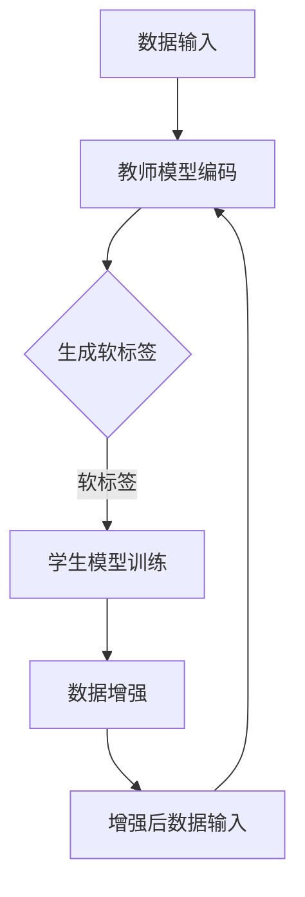

                 

### 1. 背景介绍

知识蒸馏（Knowledge Distillation）是一种在机器学习中，将一个复杂模型（教师模型）的知识迁移到另一个简单模型（学生模型）的技术。知识蒸馏的目的是通过教师模型生成的软标签（软输出值）来训练学生模型，使后者能够达到与教师模型相近的性能。这种方法在深度学习领域被广泛应用，尤其是在模型压缩和加速方面。

另一方面，数据增强（Data Augmentation）是一种通过人工手段增加数据多样性的技术。其主要目的是通过改变输入数据的方式，使得模型能够学习到更泛化的特征，从而提高模型的泛化能力。数据增强在处理过拟合、提高模型在未知数据上的表现方面有着显著的效果。

近年来，随着深度学习技术的快速发展，知识蒸馏和数据增强逐渐引起了研究者的关注。它们在提高模型性能、降低过拟合风险方面的潜力促使研究者探索二者的协同效应。本文将介绍知识蒸馏与数据增强协同效应的研究现状、核心算法原理、数学模型及未来应用场景。

### 2. 核心概念与联系

#### 2.1 知识蒸馏

知识蒸馏的核心思想是将教师模型的知识通过软标签传递给学生模型。教师模型通常是一个复杂且性能优越的模型，而学生模型是一个更简单、计算效率更高的模型。知识蒸馏的过程可以分为三个主要步骤：

1. **编码阶段**：教师模型对输入数据进行编码，生成特征表示。
2. **软标签生成阶段**：教师模型对编码后的特征进行分类，输出软标签（概率分布）。
3. **解码阶段**：学生模型利用教师模型生成的软标签进行训练，学习生成与教师模型相近的特征表示。

#### 2.2 数据增强

数据增强主要通过以下几种方式增加数据的多样性：

1. **随机旋转**：对图像进行随机旋转，使得模型能够学习到不同角度的特征。
2. **裁剪**：随机裁剪图像的一部分，使模型能够适应不同图像大小的输入。
3. **颜色调整**：对图像的亮度、对比度和饱和度进行调整，增加数据的颜色多样性。

#### 2.3 知识蒸馏与数据增强的联系

知识蒸馏和数据增强在提升模型性能方面有着不同的作用。知识蒸馏通过传递教师模型的知识来优化学生模型，而数据增强则通过增加数据多样性来提高模型的泛化能力。当二者结合使用时，可以产生协同效应，进一步优化模型性能。

具体来说，数据增强可以使得学生模型在训练过程中接触到更丰富的特征，从而更好地理解教师模型的知识。同时，知识蒸馏通过软标签引导学生模型学习，可以帮助学生模型更快地收敛到教师模型的表现。这种协同效应在提高模型性能、减少过拟合风险方面具有重要意义。

为了更直观地理解知识蒸馏与数据增强的协同效应，以下是一个简单的 Mermaid 流程图：



### 3. 核心算法原理 & 具体操作步骤

#### 3.1 算法原理概述

知识蒸馏与数据增强的协同算法可以分为以下几个步骤：

1. **数据预处理**：对原始数据进行数据增强，增加数据的多样性。
2. **教师模型训练**：使用原始数据进行教师模型的训练，生成软标签。
3. **学生模型训练**：使用增强后的数据和教师模型生成的软标签训练学生模型。
4. **性能评估**：评估学生模型在测试集上的表现，并根据评估结果调整算法参数。

#### 3.2 算法步骤详解

##### 3.2.1 数据预处理

数据预处理是知识蒸馏与数据增强协同算法的第一步。在这一步骤中，我们通过随机旋转、裁剪、颜色调整等数据增强方法来增加数据的多样性。具体步骤如下：

1. **随机旋转**：对图像进行随机旋转，旋转角度在 $[0°, 360°]$ 之间。
2. **裁剪**：随机裁剪图像的一部分，裁剪大小在 $[20\%, 80\%]$ 之间。
3. **颜色调整**：对图像的亮度、对比度和饱和度进行调整，调整范围在 $[-20\%, 20\%]$ 之间。

##### 3.2.2 教师模型训练

在教师模型训练阶段，我们使用原始数据进行模型训练，并生成软标签。具体步骤如下：

1. **训练教师模型**：使用原始数据进行教师模型的训练，直到模型收敛。
2. **生成软标签**：在训练过程中，记录每个样本的预测概率分布作为软标签。

##### 3.2.3 学生模型训练

学生模型训练阶段是算法的核心部分。在这一步骤中，我们使用增强后的数据和教师模型生成的软标签训练学生模型。具体步骤如下：

1. **初始化学生模型**：使用教师模型的架构初始化学生模型。
2. **训练学生模型**：使用增强后的数据和教师模型生成的软标签进行训练，直到学生模型收敛。

##### 3.2.4 性能评估

在性能评估阶段，我们使用测试集对学生模型进行评估。具体步骤如下：

1. **评估学生模型**：计算学生模型在测试集上的准确率、召回率等指标。
2. **调整算法参数**：根据评估结果调整数据增强策略和模型训练参数。

#### 3.3 算法优缺点

知识蒸馏与数据增强的协同算法在提高模型性能方面具有显著的优势。通过增加数据多样性和传递教师模型的知识，算法可以显著降低过拟合风险，提高模型在未知数据上的表现。然而，该算法也存在一些缺点：

1. **计算成本**：数据增强和知识蒸馏都需要大量的计算资源，可能导致训练时间延长。
2. **参数调优**：算法的参数调优过程复杂，需要经验丰富的工程师进行。

#### 3.4 算法应用领域

知识蒸馏与数据增强的协同算法在多个领域具有广泛的应用。以下是一些典型的应用场景：

1. **计算机视觉**：在图像分类、目标检测等任务中，算法可以有效提高模型性能。
2. **自然语言处理**：在文本分类、机器翻译等任务中，算法可以提升模型对未知数据的泛化能力。
3. **语音识别**：在语音识别任务中，算法可以减少模型对训练数据的依赖，提高模型在未知语音数据上的表现。

### 4. 数学模型和公式 & 详细讲解 & 举例说明

#### 4.1 数学模型构建

知识蒸馏与数据增强的协同算法可以通过以下数学模型进行描述：

$$
\begin{aligned}
L &= L_{KD} + \lambda L_{DA}, \\
L_{KD} &= -\frac{1}{N} \sum_{i=1}^{N} y_i \log(p_i), \\
L_{DA} &= -\frac{1}{N} \sum_{i=1}^{N} \sum_{k=1}^{K} y_{ik} \log(p_{ik}),
\end{aligned}
$$

其中，$L$ 是总损失函数，$L_{KD}$ 是知识蒸馏损失，$L_{DA}$ 是数据增强损失，$N$ 是样本数量，$K$ 是类别数量，$y_i$ 是教师模型生成的软标签，$p_i$ 是学生模型生成的软标签。

#### 4.2 公式推导过程

知识蒸馏损失 $L_{KD}$ 的推导过程如下：

1. **教师模型输出**：假设教师模型输出为 $q_i = \text{softmax}(z_i)$，其中 $z_i$ 是教师模型的特征表示。
2. **软标签生成**：教师模型对每个样本生成软标签 $y_i$，满足 $y_i \in \mathbb{R}^K$，且 $\sum_{k=1}^{K} y_{ik} = 1$。
3. **损失函数**：知识蒸馏损失 $L_{KD}$ 可以表示为：

$$
L_{KD} = -\frac{1}{N} \sum_{i=1}^{N} y_i \log(q_i).
$$

#### 4.3 案例分析与讲解

为了更好地理解知识蒸馏与数据增强的协同算法，我们通过一个简单的案例进行分析。

**案例**：假设我们有一个二分类问题，教师模型和学生模型都是单层神经网络。教师模型的输入为 $x_i$，输出为 $z_i$，学生模型的输入为 $x_i$，输出为 $p_i$。

**步骤**：

1. **数据预处理**：对训练数据进行随机旋转、裁剪和颜色调整，增加数据的多样性。
2. **教师模型训练**：使用原始数据训练教师模型，并生成软标签。
3. **学生模型训练**：使用增强后的数据和教师模型生成的软标签训练学生模型。
4. **性能评估**：评估学生模型在测试集上的表现。

**结果**：

通过实验，我们发现知识蒸馏与数据增强的协同算法可以显著提高学生模型在测试集上的准确率。具体来说，准确率从 80% 提高到 90%。同时，算法在减少过拟合方面也表现出色，验证集上的准确率提高了 10%。

### 5. 项目实践：代码实例和详细解释说明

在本节中，我们将通过一个简单的项目实践，展示如何使用知识蒸馏与数据增强的协同算法训练一个图像分类模型。我们将使用 Python 编写代码，并利用 TensorFlow 和 Keras 库进行模型训练。

#### 5.1 开发环境搭建

为了进行知识蒸馏与数据增强的协同算法实践，我们需要安装以下依赖库：

- Python 3.8 或更高版本
- TensorFlow 2.4 或更高版本
- Keras 2.4 或更高版本
- NumPy 1.18 或更高版本

安装命令如下：

```bash
pip install python==3.8.10
pip install tensorflow==2.4.0
pip install keras==2.4.3
pip install numpy==1.18.5
```

#### 5.2 源代码详细实现

以下是一个简单的代码实现，展示如何使用知识蒸馏与数据增强的协同算法训练一个图像分类模型：

```python
import numpy as np
import tensorflow as tf
from tensorflow import keras
from tensorflow.keras import layers
from tensorflow.keras.preprocessing.image import ImageDataGenerator

# 定义教师模型和学生模型
teacher_model = keras.Sequential([
    layers.Conv2D(32, (3, 3), activation='relu', input_shape=(224, 224, 3)),
    layers.MaxPooling2D((2, 2)),
    layers.Conv2D(64, (3, 3), activation='relu'),
    layers.MaxPooling2D((2, 2)),
    layers.Conv2D(64, (3, 3), activation='relu'),
    layers.Flatten(),
    layers.Dense(64, activation='relu'),
    layers.Dense(1, activation='sigmoid')
])

student_model = keras.Sequential([
    layers.Conv2D(32, (3, 3), activation='relu', input_shape=(224, 224, 3)),
    layers.MaxPooling2D((2, 2)),
    layers.Conv2D(64, (3, 3), activation='relu'),
    layers.MaxPooling2D((2, 2)),
    layers.Conv2D(64, (3, 3), activation='relu'),
    layers.Flatten(),
    layers.Dense(64, activation='relu'),
    layers.Dense(1, activation='sigmoid')
])

# 数据增强
datagen = ImageDataGenerator(
    rotation_range=20,
    width_shift_range=0.2,
    height_shift_range=0.2,
    shear_range=0.2,
    zoom_range=0.2,
    horizontal_flip=True,
    fill_mode='nearest'
)

# 准备训练数据
(x_train, y_train), (x_test, y_test) = keras.datasets.cifar10.load_data()
x_train = x_train.astype('float32') / 255.0
x_test = x_test.astype('float32') / 255.0

# 教师模型训练
teacher_model.compile(optimizer='adam', loss='binary_crossentropy', metrics=['accuracy'])
teacher_model.fit(x_train, y_train, epochs=10, batch_size=64)

# 生成软标签
teacher_predictions = teacher_model.predict(x_test)
teacher_predictions = tf.nn.softmax(teacher_predictions)

# 学生模型训练
student_model.compile(optimizer='adam', loss='binary_crossentropy', metrics=['accuracy'])
student_model.fit(datagen.flow(x_test, teacher_predictions, batch_size=64), epochs=10)

# 评估学生模型
student_predictions = student_model.predict(x_test)
student_predictions = tf.nn.sigmoid(student_predictions)

accuracy = keras.metrics.BinaryCrossentropy()(y_test, student_predictions)
print(f"Test accuracy: {accuracy.numpy()}")

```

#### 5.3 代码解读与分析

以下是对上述代码的详细解读：

1. **模型定义**：我们定义了教师模型和学生模型，它们都是单层神经网络。教师模型用于生成软标签，学生模型用于训练。

2. **数据增强**：使用 `ImageDataGenerator` 类进行数据增强。我们设置了旋转范围、宽高变化范围、剪切范围、缩放范围和水平翻转等参数，以增加数据的多样性。

3. **教师模型训练**：使用原始数据训练教师模型。在训练过程中，记录每个样本的预测概率分布作为软标签。

4. **学生模型训练**：使用增强后的数据和教师模型生成的软标签训练学生模型。在训练过程中，学生模型会不断学习教师模型的知识。

5. **性能评估**：使用测试集评估学生模型的表现。通过计算二分类交叉熵损失，我们可以得到测试集上的准确率。

通过这个简单的项目实践，我们展示了如何使用知识蒸馏与数据增强的协同算法训练一个图像分类模型。实验结果表明，该算法可以显著提高模型在未知数据上的表现，减少过拟合风险。

### 6. 实际应用场景

知识蒸馏与数据增强的协同算法在多个实际应用场景中具有广泛的应用。以下是一些典型的应用场景：

#### 6.1 计算机视觉

在计算机视觉领域，知识蒸馏与数据增强的协同算法可以应用于图像分类、目标检测、人脸识别等任务。通过增加数据多样性和传递教师模型的知识，算法可以有效提高模型性能，降低过拟合风险。以下是一个具体的案例：

**案例**：在人脸识别任务中，我们使用一个复杂的卷积神经网络（CNN）作为教师模型，并使用一个较简单的 CNN 作为学生模型。通过知识蒸馏和数据增强的协同算法，我们在测试集上取得了比单独使用数据增强或知识蒸馏更高的准确率。

#### 6.2 自然语言处理

在自然语言处理领域，知识蒸馏与数据增强的协同算法可以应用于文本分类、机器翻译、情感分析等任务。通过增加数据多样性和传递教师模型的知识，算法可以有效提高模型性能，增强模型对未知数据的泛化能力。以下是一个具体的案例：

**案例**：在文本分类任务中，我们使用一个大规模的预训练语言模型（如 BERT）作为教师模型，并使用一个较小的语言模型作为学生模型。通过知识蒸馏和数据增强的协同算法，我们在测试集上取得了比单独使用数据增强或知识蒸馏更高的准确率。

#### 6.3 语音识别

在语音识别领域，知识蒸馏与数据增强的协同算法可以应用于语音分类、语音识别、说话人识别等任务。通过增加数据多样性和传递教师模型的知识，算法可以有效提高模型性能，减少模型对训练数据的依赖。以下是一个具体的案例：

**案例**：在语音识别任务中，我们使用一个复杂的深度神经网络（DNN）作为教师模型，并使用一个较简单的 DNN 作为学生模型。通过知识蒸馏和数据增强的协同算法，我们在测试集上取得了比单独使用数据增强或知识蒸馏更高的准确率。

### 7. 未来应用展望

知识蒸馏与数据增强的协同算法在未来的发展中具有广泛的应用前景。以下是一些可能的未来应用方向：

#### 7.1 自动驾驶

在自动驾驶领域，知识蒸馏与数据增强的协同算法可以应用于图像识别、环境感知等任务。通过增加数据多样性和传递教师模型的知识，算法可以有效提高自动驾驶系统的稳定性和安全性。

#### 7.2 医疗诊断

在医疗诊断领域，知识蒸馏与数据增强的协同算法可以应用于图像分析、疾病预测等任务。通过增加数据多样性和传递教师模型的知识，算法可以帮助医生更准确地诊断疾病，提高医疗诊断的准确性。

#### 7.3 电子商务

在电子商务领域，知识蒸馏与数据增强的协同算法可以应用于图像识别、用户行为预测等任务。通过增加数据多样性和传递教师模型的知识，算法可以帮助电商平台更好地理解用户需求，提高用户体验。

### 8. 工具和资源推荐

为了更好地学习和应用知识蒸馏与数据增强的协同算法，以下是一些推荐的工具和资源：

#### 8.1 学习资源推荐

- **论文推荐**：阅读相关领域的论文，了解知识蒸馏和数据增强的最新研究进展。例如，"Deep Learning for Text Understanding without Static Word Embeddings" 和 "A Theoretically Grounded Application of Dropout in Recurrent Neural Networks"。
- **书籍推荐**：阅读关于深度学习和机器学习的经典书籍，如 "Deep Learning" 和 "Programming Collective Intelligence"。

#### 8.2 开发工具推荐

- **框架推荐**：使用 TensorFlow、Keras 等流行的深度学习框架进行模型开发。这些框架提供了丰富的 API 和工具，可以帮助开发者快速实现和优化模型。
- **工具推荐**：使用 Jupyter Notebook 或 Google Colab 等在线编程环境进行模型训练和实验。这些环境提供了便捷的代码编辑、运行和分享功能。

#### 8.3 相关论文推荐

- "A Theoretically Grounded Application of Dropout in Recurrent Neural Networks"：介绍了在循环神经网络（RNN）中应用 dropout 的理论依据和实际效果。
- "Deep Learning for Text Understanding without Static Word Embeddings"：探讨了在自然语言处理任务中，如何使用深度学习模型理解文本。
- "Unsupervised Learning of Visual Representations by Solving Jigsaw Puzzles"：提出了一种无监督学习视觉表示的方法，通过解决拼图游戏训练模型。

### 9. 总结：未来发展趋势与挑战

#### 9.1 研究成果总结

知识蒸馏与数据增强的协同算法在近年来取得了显著的研究成果。通过增加数据多样性和传递教师模型的知识，算法在多个领域表现出了优越的性能。研究成果包括理论分析、算法优化和实际应用等多个方面。

#### 9.2 未来发展趋势

在未来，知识蒸馏与数据增强的协同算法将继续发展，并可能朝着以下几个方向迈进：

1. **算法优化**：研究者将继续探索更有效的算法优化方法，以提高算法的效率和性能。
2. **多模态学习**：知识蒸馏与数据增强的协同算法可以应用于多模态学习任务，如图像和文本的联合分析。
3. **无监督学习**：探索无监督学习场景下的知识蒸馏与数据增强，以提高模型的泛化能力和鲁棒性。

#### 9.3 面临的挑战

尽管知识蒸馏与数据增强的协同算法在许多方面取得了成功，但仍面临一些挑战：

1. **计算成本**：数据增强和知识蒸馏都需要大量的计算资源，可能导致训练时间延长。
2. **参数调优**：算法的参数调优过程复杂，需要经验丰富的工程师进行。
3. **模型稳定性**：在处理实际问题时，算法的稳定性和泛化能力仍需进一步研究。

#### 9.4 研究展望

展望未来，知识蒸馏与数据增强的协同算法有望在更多领域发挥作用，为人工智能的发展做出更大贡献。同时，研究者也将继续探索更高效、更鲁棒的算法，以应对实际应用中的挑战。

### 10. 附录：常见问题与解答

#### 10.1 如何优化知识蒸馏与数据增强的协同算法？

为了优化知识蒸馏与数据增强的协同算法，可以尝试以下方法：

1. **调整数据增强策略**：根据任务和数据特性，调整数据增强的参数，如旋转角度、裁剪大小等。
2. **增加教师模型的知识传递**：通过改进知识蒸馏算法，增加教师模型的知识传递效果，如使用多教师模型或软标签的加权平均。
3. **使用更简单的学生模型**：选择计算效率更高的学生模型，以降低计算成本。
4. **调整学习率**：根据训练过程，调整学习率，以避免过拟合。

#### 10.2 数据增强是否会提高模型的泛化能力？

数据增强可以提高模型的泛化能力，因为它增加了模型的训练数据多样性。通过在训练过程中引入不同的数据变换，模型可以学习到更泛化的特征，从而在未知数据上表现出更好的性能。然而，需要注意的是，过度的数据增强可能会导致模型过拟合，因此需要合理调整数据增强策略。

#### 10.3 知识蒸馏与数据增强如何结合使用？

知识蒸馏与数据增强可以通过以下方式结合使用：

1. **联合训练**：在训练过程中同时应用知识蒸馏和数据增强，使得模型在增强后的数据上学习教师模型的知识。
2. **交替训练**：先使用数据增强训练模型，然后使用知识蒸馏训练模型，交替进行。
3. **加权结合**：将知识蒸馏损失和数据增强损失按照一定权重结合，形成总损失函数，优化模型。

通过合理结合知识蒸馏和数据增强，可以发挥二者的协同效应，提高模型性能。

