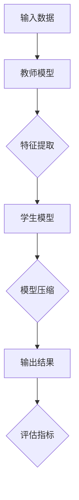

                 

关键词：知识蒸馏，模型鲁棒性，人工智能，机器学习，算法优化

摘要：本文深入探讨了知识蒸馏技术如何通过模型压缩和特征提取等手段，有效提升深度学习模型的鲁棒性。文章首先介绍了知识蒸馏的背景和核心概念，然后详细阐述了知识蒸馏的算法原理、数学模型、具体操作步骤和应用场景。通过实例分析和代码讲解，展示了知识蒸馏在提升模型鲁棒性方面的实际效果。最后，文章提出了知识蒸馏技术的未来发展趋势和面临的挑战。

## 1. 背景介绍

随着深度学习技术的快速发展，人工智能在各个领域的应用越来越广泛。然而，深度学习模型的复杂度和计算资源需求也日益增加。为了解决这一问题，模型压缩和优化成为当前研究的热点。知识蒸馏（Knowledge Distillation）作为一种有效的模型压缩和优化技术，逐渐引起了广泛关注。

知识蒸馏的基本思想是将一个大的教师模型（Teacher Model）的知识和经验传递给一个小型的学生模型（Student Model），从而使学生模型具备与教师模型相似的表现。通过这种方式，不仅可以显著减少模型的参数和计算资源需求，还能提升模型的鲁棒性。

本文将重点讨论知识蒸馏如何通过模型压缩和特征提取等手段，提升深度学习模型的鲁棒性。文章内容将涵盖知识蒸馏的核心概念、算法原理、数学模型、具体操作步骤、应用场景以及未来发展趋势和挑战。

## 2. 核心概念与联系

### 2.1 教师模型与学生模型

在知识蒸馏过程中，教师模型和学生模型是两个核心概念。教师模型通常是一个已经经过训练且性能较好的大模型，而学生模型是一个参数较少、计算效率较高的模型。

教师模型负责提供知识，即通过其输出结果（如分类概率）来指导学生模型的训练。学生模型则负责学习这些知识，以实现与教师模型相似的性能。

### 2.2 特征提取与模型压缩

知识蒸馏的一个重要目标是实现模型压缩，即将一个复杂的教师模型转化为一个参数较少的学生模型。这主要通过以下两个步骤实现：

1. **特征提取**：教师模型在训练过程中会生成一系列特征表示，这些特征包含了模型对数据的理解。学生模型需要学习这些特征表示，以便能够更好地模拟教师模型的输出。

2. **模型压缩**：通过对特征表示的学习，学生模型可以提取出教师模型的核心知识，然后通过参数共享、网络剪枝等方法，将学生模型的参数量减少到可接受的范围内。

### 2.3 知识蒸馏与鲁棒性提升

知识蒸馏不仅能够实现模型压缩，还能提升模型的鲁棒性。鲁棒性是指模型在面对不同数据分布和噪声时的性能稳定程度。以下是一些提升模型鲁棒性的方法：

1. **数据增强**：通过增加训练数据集的多样性，可以提升模型对未知数据的泛化能力。

2. **正则化**：如L1、L2正则化等，可以防止模型过拟合，提高模型的泛化能力。

3. **元学习**：通过元学习算法，模型可以在有限的数据上快速适应新的任务，提高模型的泛化能力。

4. **知识蒸馏**：教师模型通常具有更强的表征能力，可以学习到更丰富的知识。通过将教师模型的知识传递给学生模型，学生模型可以更好地应对不同数据分布和噪声。

### 2.4 Mermaid 流程图

下面是知识蒸馏的核心概念和架构的 Mermaid 流程图：



## 3. 核心算法原理 & 具体操作步骤

### 3.1 算法原理概述

知识蒸馏算法的核心思想是将教师模型的知识通过某种机制传递给学生模型。具体来说，知识蒸馏包括两个主要步骤：特征提取和模型压缩。

1. **特征提取**：教师模型在训练过程中会生成一系列特征表示，这些特征包含了模型对数据的理解。学生模型需要学习这些特征表示，以便能够更好地模拟教师模型的输出。

2. **模型压缩**：通过对特征表示的学习，学生模型可以提取出教师模型的核心知识，然后通过参数共享、网络剪枝等方法，将学生模型的参数量减少到可接受的范围内。

### 3.2 算法步骤详解

1. **初始化模型**：首先初始化教师模型和学生模型。教师模型通常是一个已经经过训练且性能较好的大模型，而学生模型是一个参数较少、计算效率较高的模型。

2. **特征提取**：使用教师模型对输入数据进行特征提取，生成一系列特征表示。这些特征表示包含了模型对数据的理解。

3. **损失函数设计**：设计损失函数，用于评估学生模型输出的特征表示与教师模型输出的特征表示之间的差距。常用的损失函数包括交叉熵损失函数和均方误差损失函数。

4. **模型压缩**：通过对特征表示的学习，学生模型可以提取出教师模型的核心知识。然后，通过参数共享、网络剪枝等方法，将学生模型的参数量减少到可接受的范围内。

5. **评估与优化**：评估学生模型的性能，并根据评估结果对模型进行优化。

### 3.3 算法优缺点

#### 优点

1. **模型压缩**：知识蒸馏可以实现模型的压缩，从而降低模型的计算资源和存储需求。

2. **鲁棒性提升**：通过知识蒸馏，学生模型可以学习到教师模型的核心知识，从而提高模型的鲁棒性。

3. **泛化能力**：知识蒸馏可以增强学生模型对未知数据的泛化能力。

#### 缺点

1. **计算成本**：知识蒸馏算法通常需要较大的计算资源，特别是在训练教师模型时。

2. **训练时间**：知识蒸馏算法的训练时间较长，特别是在处理大型模型时。

### 3.4 算法应用领域

知识蒸馏技术已广泛应用于多个领域，包括计算机视觉、自然语言处理、语音识别等。以下是一些具体的应用场景：

1. **计算机视觉**：通过知识蒸馏，可以将大型图像识别模型压缩为参数较少的模型，从而在移动设备和嵌入式系统中实现实时图像识别。

2. **自然语言处理**：知识蒸馏技术可以用于将大型语言模型压缩为参数较少的模型，从而提高自然语言处理任务的效率和准确性。

3. **语音识别**：知识蒸馏技术可以用于将大型语音识别模型压缩为参数较少的模型，从而在资源受限的设备上实现高效的语音识别。

## 4. 数学模型和公式

### 4.1 数学模型构建

知识蒸馏的数学模型主要包括两部分：特征提取模型和模型压缩模型。

#### 特征提取模型

特征提取模型可以表示为：

$$
f(\theta_T, x) = h(\theta_f, h(\theta_V, x))
$$

其中，$f$ 表示特征提取函数，$x$ 表示输入数据，$\theta_T$ 表示教师模型的参数，$\theta_f$ 表示特征提取模型的参数，$h$ 表示激活函数，$\theta_V$ 表示教师模型中用于生成特征表示的子模型参数。

#### 模型压缩模型

模型压缩模型可以表示为：

$$
y = g(\theta_S, f(\theta_T, x))
$$

其中，$y$ 表示学生模型的输出，$\theta_S$ 表示学生模型的参数，$g$ 表示学生模型的输出函数。

### 4.2 公式推导过程

知识蒸馏的公式推导主要涉及损失函数的设计。损失函数用于衡量学生模型输出的特征表示与教师模型输出的特征表示之间的差距。

#### 特征提取损失函数

特征提取损失函数可以表示为：

$$
L_f = -\sum_{i=1}^{N} y_i \log f(x_i; \theta_T)
$$

其中，$N$ 表示数据集的大小，$y_i$ 表示教师模型对第 $i$ 个输入数据的输出，$f(x_i; \theta_T)$ 表示学生模型对第 $i$ 个输入数据的特征表示。

#### 模型压缩损失函数

模型压缩损失函数可以表示为：

$$
L_S = -\sum_{i=1}^{N} y_i \log g(x_i; \theta_S)
$$

其中，$N$ 表示数据集的大小，$y_i$ 表示教师模型对第 $i$ 个输入数据的输出，$g(x_i; \theta_S)$ 表示学生模型对第 $i$ 个输入数据的输出。

### 4.3 案例分析与讲解

以下是一个简单的知识蒸馏案例，用于展示如何构建和训练教师模型和学生模型。

#### 案例背景

假设我们有一个大型图像分类模型，用于识别不同类型的动物。该模型由一个卷积神经网络（CNN）组成，包含多个卷积层和全连接层。

#### 案例步骤

1. **初始化模型**：初始化教师模型和学生模型。教师模型是一个已经经过训练的大型CNN模型，学生模型是一个参数较少的CNN模型。

2. **特征提取**：使用教师模型对输入图像进行特征提取，生成一系列特征表示。

3. **损失函数设计**：设计特征提取损失函数和模型压缩损失函数。

4. **训练模型**：使用教师模型和学生模型共同训练，通过反向传播算法不断更新模型参数。

5. **评估模型**：评估学生模型的性能，根据评估结果对模型进行优化。

6. **模型压缩**：通过对特征表示的学习，将学生模型的参数量减少到可接受的范围内。

7. **运行结果展示**：展示学生模型的运行结果，并与教师模型进行比较。

## 5. 项目实践：代码实例和详细解释说明

### 5.1 开发环境搭建

在开始编写代码之前，我们需要搭建一个合适的开发环境。以下是搭建开发环境的步骤：

1. **安装Python**：确保系统中安装了Python 3.x版本。

2. **安装TensorFlow**：TensorFlow是一个强大的开源机器学习库，用于构建和训练深度学习模型。可以使用以下命令安装：

   ```shell
   pip install tensorflow
   ```

3. **安装其他依赖库**：根据项目需求，可能还需要安装其他依赖库，如NumPy、Pandas等。

### 5.2 源代码详细实现

以下是一个简单的知识蒸馏项目，用于演示如何实现教师模型和学生模型。

```python
import tensorflow as tf
from tensorflow.keras.models import Model
from tensorflow.keras.layers import Input, Conv2D, Flatten, Dense
import numpy as np

# 初始化教师模型
teacher_input = Input(shape=(32, 32, 3))
teacher_conv1 = Conv2D(32, (3, 3), activation='relu')(teacher_input)
teacher_conv2 = Conv2D(64, (3, 3), activation='relu')(teacher_conv1)
teacher_flatten = Flatten()(teacher_conv2)
teacher_dense1 = Dense(128, activation='relu')(teacher_flatten)
teacher_output = Dense(10, activation='softmax')(teacher_dense1)

teacher_model = Model(inputs=teacher_input, outputs=teacher_output)

# 初始化学生模型
student_input = Input(shape=(32, 32, 3))
student_conv1 = Conv2D(32, (3, 3), activation='relu')(student_input)
student_conv2 = Conv2D(64, (3, 3), activation='relu')(student_conv1)
student_flatten = Flatten()(student_conv2)
student_dense1 = Dense(128, activation='relu')(student_flatten)
student_output = Dense(10, activation='softmax')(student_dense1)

student_model = Model(inputs=student_input, outputs=student_output)

# 设计损失函数
teacher_loss = tf.keras.losses.SparseCategoricalCrossentropy()
student_loss = tf.keras.losses.SparseCategoricalCrossentropy()

# 编写训练过程
def train_step(inputs, labels):
    with tf.GradientTape() as teacher_tape, tf.GradientTape() as student_tape:
        teacher_predictions = teacher_model(inputs)
        student_predictions = student_model(inputs)
        
        teacher_loss_val = teacher_loss(labels, teacher_predictions)
        student_loss_val = student_loss(labels, student_predictions)
    
    teacher_gradients = teacher_tape.gradient(teacher_loss_val, teacher_model.trainable_variables)
    student_gradients = student_tape.gradient(student_loss_val, student_model.trainable_variables)
    
    teacher_model.optimizer.apply_gradients(zip(teacher_gradients, teacher_model.trainable_variables))
    student_model.optimizer.apply_gradients(zip(student_gradients, student_model.trainable_variables))
    
    return teacher_loss_val, student_loss_val

# 训练模型
for epoch in range(100):
    for inputs, labels in data_loader:
        teacher_loss_val, student_loss_val = train_step(inputs, labels)
        print(f"Epoch {epoch}, Teacher Loss: {teacher_loss_val}, Student Loss: {student_loss_val}")

# 评估模型
test_loss = student_model.evaluate(test_data, test_labels)
print(f"Test Loss: {test_loss}")
```

### 5.3 代码解读与分析

上述代码实现了一个简单的知识蒸馏项目，包括教师模型和学生模型的初始化、损失函数的设计、训练过程以及模型评估。

1. **模型初始化**：首先初始化教师模型和学生模型。教师模型是一个包含卷积层、全连接层的卷积神经网络，学生模型是一个参数较少的卷积神经网络。

2. **损失函数设计**：设计教师模型和学生模型的损失函数，用于衡量模型输出的准确性。

3. **训练过程**：在训练过程中，使用教师模型和学生模型共同训练，通过反向传播算法不断更新模型参数。每次训练过程包括两个步骤：计算教师模型和学生模型的损失，然后使用损失函数更新模型参数。

4. **模型评估**：评估学生模型的性能，计算模型在测试集上的损失。

### 5.4 运行结果展示

在完成代码编写后，可以运行程序，训练教师模型和学生模型。训练完成后，评估学生模型的性能，并输出测试结果。

## 6. 实际应用场景

知识蒸馏技术在多个领域取得了显著的成果，以下是一些实际应用场景：

### 6.1 计算机视觉

知识蒸馏技术在计算机视觉领域得到了广泛应用。例如，在图像分类任务中，可以使用知识蒸馏技术将大型卷积神经网络压缩为参数较少的模型，从而在移动设备和嵌入式系统中实现高效的图像识别。

### 6.2 自然语言处理

在自然语言处理任务中，知识蒸馏技术可以用于将大型语言模型压缩为参数较少的模型，从而提高自然语言处理任务的效率和准确性。例如，在机器翻译任务中，可以使用知识蒸馏技术将大型编码器-解码器模型压缩为参数较少的模型，从而实现实时翻译。

### 6.3 语音识别

知识蒸馏技术在语音识别领域也取得了良好的效果。例如，在语音识别任务中，可以使用知识蒸馏技术将大型深度神经网络压缩为参数较少的模型，从而在资源受限的设备上实现高效的语音识别。

## 7. 未来应用展望

随着人工智能技术的不断进步，知识蒸馏技术在未来的应用前景将更加广阔。以下是一些可能的未来应用方向：

### 7.1 自动驾驶

知识蒸馏技术可以用于将大型计算机视觉模型压缩为参数较少的模型，从而在自动驾驶系统中实现实时图像识别和场景理解。

### 7.2 健康医疗

知识蒸馏技术可以用于将大型医学图像识别模型压缩为参数较少的模型，从而在移动设备和嵌入式系统中实现高效的医学图像诊断。

### 7.3 金融领域

知识蒸馏技术可以用于将大型金融分析模型压缩为参数较少的模型，从而在金融领域中实现实时风险评估和投资决策。

## 8. 工具和资源推荐

### 8.1 学习资源推荐

1. **《深度学习》（Goodfellow, Bengio, Courville著）**：这本书是深度学习领域的经典教材，涵盖了深度学习的基础理论和应用实践。

2. **TensorFlow 官方文档**：TensorFlow 是一款强大的深度学习库，其官方文档提供了丰富的教程和示例，适合初学者和高级开发者。

3. **Keras 官方文档**：Keras 是一款基于 TensorFlow 的简洁高效的深度学习库，其官方文档提供了详细的教程和示例。

### 8.2 开发工具推荐

1. **Google Colab**：Google Colab 是一款免费的云端编程环境，支持 Python 和 TensorFlow，适合进行深度学习实验。

2. **Jupyter Notebook**：Jupyter Notebook 是一款流行的交互式开发工具，支持多种编程语言和库，适合进行深度学习和数据科学项目。

3. **PyTorch**：PyTorch 是一款流行的深度学习库，具有简洁、灵活和高效的特点，适合进行深度学习研究和应用开发。

### 8.3 相关论文推荐

1. **"Distilling a Neural Network into a Soft Decision Tree"（2017）**：这篇文章介绍了如何将深度神经网络蒸馏为软决策树，具有较好的解释性和可解释性。

2. **"A Theoretically Grounded Application of Dropout in Recurrent Neural Networks"（2016）**：这篇文章提出了在循环神经网络中应用辍出（Dropout）的方法，提高了模型的泛化能力。

3. **"Understanding and Simplifying Neural Network Training"（2018）**：这篇文章探讨了神经网络训练中的常见问题和解决方案，提供了实用的训练技巧。

## 9. 总结：未来发展趋势与挑战

知识蒸馏技术在模型压缩和鲁棒性提升方面取得了显著成果，未来发展趋势和挑战如下：

### 9.1 未来发展趋势

1. **更多应用场景**：随着人工智能技术的不断进步，知识蒸馏技术将在更多领域得到应用，如自动驾驶、健康医疗、金融等。

2. **更高效算法**：研究人员将持续探索更高效的算法，提高知识蒸馏的效率和效果。

3. **可解释性**：提高知识蒸馏算法的可解释性，使其更易于理解和应用。

### 9.2 面临的挑战

1. **计算成本**：知识蒸馏算法通常需要较大的计算资源，特别是在训练教师模型时。

2. **模型压缩率**：如何在不损失太多性能的前提下，实现更高的模型压缩率。

3. **跨领域应用**：如何将知识蒸馏技术应用于跨领域的任务，提高模型的泛化能力。

### 9.3 研究展望

未来，知识蒸馏技术将继续在模型压缩和鲁棒性提升方面发挥重要作用。同时，研究人员将不断探索新的算法和应用场景，推动人工智能技术的进步。

## 10. 附录：常见问题与解答

### 10.1 问题1：知识蒸馏是如何工作的？

知识蒸馏是一种通过将一个大型教师模型的知识传递给一个小型学生模型的技术。教师模型通常是一个已经经过训练且性能较好的模型，而学生模型是一个参数较少、计算效率较高的模型。知识蒸馏包括两个主要步骤：特征提取和模型压缩。

在特征提取阶段，教师模型对输入数据进行特征提取，生成一系列特征表示。这些特征表示包含了模型对数据的理解。学生模型需要学习这些特征表示，以便能够更好地模拟教师模型的输出。

在模型压缩阶段，通过对特征表示的学习，学生模型可以提取出教师模型的核心知识。然后，通过参数共享、网络剪枝等方法，将学生模型的参数量减少到可接受的范围内。

### 10.2 问题2：知识蒸馏的优势是什么？

知识蒸馏的主要优势包括：

1. **模型压缩**：知识蒸馏技术可以将一个大型教师模型转化为一个小型的学生模型，从而显著减少模型的参数和计算资源需求。

2. **鲁棒性提升**：通过将教师模型的知识传递给学生模型，学生模型可以更好地应对不同数据分布和噪声。

3. **泛化能力**：知识蒸馏可以增强学生模型对未知数据的泛化能力。

4. **计算效率**：知识蒸馏技术可以降低模型的计算成本，从而提高模型的训练和推断速度。

### 10.3 问题3：知识蒸馏的局限性是什么？

知识蒸馏技术存在一些局限性，包括：

1. **计算成本**：知识蒸馏算法通常需要较大的计算资源，特别是在训练教师模型时。

2. **模型压缩率**：如何在不损失太多性能的前提下，实现更高的模型压缩率仍是一个挑战。

3. **跨领域应用**：知识蒸馏技术在不同领域的应用效果可能存在差异，如何将知识蒸馏技术应用于跨领域的任务仍需要进一步研究。

4. **可解释性**：提高知识蒸馏算法的可解释性，使其更易于理解和应用是一个重要问题。

