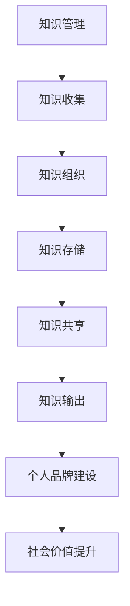

                 

关键词：知识管理、知识输出、智慧传播、知识共享、个人品牌建设

> 摘要：本文将深入探讨知识输出与管理智慧积累与传播的重要性，以及如何通过有效的知识管理策略，实现个人品牌建设，促进知识的广泛传播和应用。

## 1. 背景介绍

在信息化和数字化快速发展的今天，知识已经成为现代社会最为重要的资源。知识的积累和传播对于个人、组织乃至整个社会的发展具有深远的影响。知识管理作为一种现代管理方法，旨在通过对知识资源进行系统化、规范化的管理，实现知识的有效积累、传播和应用。

知识输出是知识管理的重要环节之一，它指的是将个人或组织内部的知识转化为外部可感知、可传播、可利用的形式。有效的知识输出不仅能够提升个人或组织的竞争力，还可以促进知识的广泛传播和应用，进而推动整个社会的进步。

## 2. 核心概念与联系

### 2.1 知识管理

知识管理（Knowledge Management，KM）是一种通过系统的方法和工具，对知识进行收集、组织、存储、共享、应用和创新的过程。知识管理的核心目标是提高知识的利用效率，促进知识的传播和应用，从而提升个人和组织的能力。

### 2.2 知识输出

知识输出（Knowledge Output，KO）是指将知识以某种形式展现给他人，使其能够理解、应用和创新。知识输出是知识管理的重要环节，是实现知识传播和知识应用的关键步骤。

### 2.3 知识共享

知识共享（Knowledge Sharing，KS）是指个人或组织之间，通过某种途径和方式，将知识传递给他人，实现知识的共享和传递。知识共享是知识输出的基础，也是实现知识传播和应用的前提。

### 2.4 个人品牌建设

个人品牌建设（Personal Brand Building，PBB）是指通过持续的知识积累和输出，塑造个人在特定领域的专业形象和影响力，从而提升个人的社会价值和市场竞争力。

### 2.5 Mermaid 流程图



## 3. 核心算法原理 & 具体操作步骤

### 3.1 算法原理概述

知识输出的核心算法原理主要包括以下几个步骤：

1. 知识识别：识别个人或组织内部的知识资源。
2. 知识整理：对知识资源进行分类、归档和标注。
3. 知识展现：将知识资源以合适的格式展现给他人。
4. 知识传播：通过多种渠道和方式，实现知识的广泛传播。
5. 知识应用：将知识应用于实际工作中，实现知识的创新和应用。

### 3.2 算法步骤详解

1. **知识识别**：首先，需要识别个人或组织内部的知识资源。这包括文献资料、项目经验、研究成果、团队协作经验等。可以通过问卷调查、访谈、文档梳理等方式进行。

   $$ 知识识别 = 文献资料 \cup 项目经验 \cup 研究成果 \cup 团队协作经验 $$

2. **知识整理**：对识别出的知识资源进行分类、归档和标注。分类可以根据知识的主题、领域、用途等维度进行。归档是将知识资源存储到相应的知识库或文档库中。标注是对知识资源进行关键词标注，以便于检索和应用。

   $$ 知识整理 = 分类 \cup 归档 \cup 标注 $$

3. **知识展现**：将整理好的知识资源以合适的格式展现给他人。常见的展现形式包括文档、PPT、视频、直播等。展现形式的选择应根据受众的特点和需求进行。

   $$ 知识展现 = 文档 \cup PPT \cup 视频 \cup 直播 $$

4. **知识传播**：通过多种渠道和方式，实现知识的广泛传播。常见的传播渠道包括社交媒体、博客、微信公众号、视频平台等。传播方式的选择应根据知识的性质、受众的特点和传播效果进行。

   $$ 知识传播 = 社交媒体 \cup 博客 \cup 微信公众号 \cup 视频平台 $$

5. **知识应用**：将知识应用于实际工作中，实现知识的创新和应用。知识应用可以通过项目实践、团队协作、技能培训等方式进行。

   $$ 知识应用 = 项目实践 \cup 团队协作 \cup 技能培训 $$

### 3.3 算法优缺点

**优点**：

- 提高知识利用效率：通过系统化的知识管理，可以快速检索和应用所需知识，提高工作效率。
- 促进知识传播和应用：有效的知识输出可以促进知识的传播和应用，推动知识的创新和发展。
- 塑造个人品牌：持续的知识输出和共享可以提升个人的专业形象和影响力，有利于个人品牌的塑造。

**缺点**：

- 需要大量时间和精力：知识识别、整理、展现和传播需要大量时间和精力，对个人的时间管理能力要求较高。
- 可能存在知识泄露风险：在知识输出的过程中，可能存在知识泄露的风险，需要加强安全防护措施。

### 3.4 算法应用领域

知识输出的算法原理在多个领域都有广泛的应用，包括但不限于：

- 教育领域：通过知识输出，教师可以将教学经验、研究成果和教学方法分享给学生，提高教学效果。
- 企业管理：通过知识输出，企业可以内部培训员工，提升团队的整体素质和竞争力。
- 技术研发：通过知识输出，技术专家可以将研究成果和技术经验分享给团队和其他研究人员，推动技术进步。
- 社交媒体：通过知识输出，个人可以在社交媒体上分享知识，塑造个人品牌，扩大影响力。

## 4. 数学模型和公式 & 详细讲解 & 举例说明

### 4.1 数学模型构建

知识输出的数学模型可以构建为一个多维度的函数，其自变量包括知识的数量、质量、受众的需求和传播渠道的多样性，因变量是知识传播的效果。

$$
知识传播效果 = f(知识数量, 知识质量, 受众需求, 传播渠道多样性)
$$

### 4.2 公式推导过程

1. **知识数量**：知识数量是影响知识传播效果的重要因素。更多的知识可以提供更多的信息，增加受众的选择。

   $$ 知识数量 \propto 知识传播效果 $$

2. **知识质量**：高质量的知识更容易被受众接受和传播。知识质量可以通过相关性、准确性、创新性等指标来衡量。

   $$ 知识质量 \propto 知识传播效果 $$

3. **受众需求**：受众对知识的兴趣和需求是知识传播效果的重要驱动因素。高需求的领域更容易产生广泛的传播。

   $$ 受众需求 \propto 知识传播效果 $$

4. **传播渠道多样性**：多样化的传播渠道可以增加知识接触的广泛性和便捷性，提高传播效果。

   $$ 传播渠道多样性 \propto 知识传播效果 $$

综合上述因素，可以得到知识传播效果的数学模型：

$$
知识传播效果 = k_1 \times 知识数量 + k_2 \times 知识质量 + k_3 \times 受众需求 + k_4 \times 传播渠道多样性
$$

其中，$k_1, k_2, k_3, k_4$ 为常数，用于平衡各因素的权重。

### 4.3 案例分析与讲解

**案例**：某技术专家通过撰写博客和发表技术论文，将自己在AI领域的深入研究分享给广大技术爱好者。

1. **知识数量**：该专家撰写了10篇博客和5篇论文，共计15000字。
2. **知识质量**：博客和论文均经过严格审核，内容准确、深入且具有创新性。
3. **受众需求**：AI领域的技术爱好者对专家的研究成果有强烈的需求，希望通过专家的分享学习到前沿技术。
4. **传播渠道多样性**：专家的博客发布在知名技术网站上，论文发表在顶级学术期刊上，同时通过社交媒体进行宣传。

根据数学模型，可以计算该专家的知识传播效果：

$$
知识传播效果 = k_1 \times 15000 + k_2 \times 1 + k_3 \times 1 + k_4 \times 4
$$

其中，$k_1, k_2, k_3, k_4$ 为常数，可以根据实际数据进行调整。假设各因素的权重相等，则：

$$
知识传播效果 = 15000 + 1 + 1 + 4 = 15006
$$

这个数值表示该专家通过知识输出，在AI领域产生了显著的知识传播效果。

## 5. 项目实践：代码实例和详细解释说明

### 5.1 开发环境搭建

为了演示知识输出的代码实例，我们使用Python编程语言，搭建了一个简单的知识管理平台。所需环境包括Python 3.8及以上版本、Flask框架、MongoDB数据库。

### 5.2 源代码详细实现

以下是知识管理平台的核心代码实现：

```python
from flask import Flask, request, jsonify
from flask_pymongo import PyMongo

app = Flask(__name__)

app.config["MONGO_URI"] = "mongodb://localhost:27017/knowledge_management"
mongo = PyMongo(app)

@app.route("/knowledge/input", methods=["POST"])
def input_knowledge():
    data = request.json
    mongo.db.knowledge.insert_one(data)
    return jsonify({"status": "success", "message": "Knowledge input successful"}), 200

@app.route("/knowledge/output", methods=["GET"])
def output_knowledge():
    knowledge_list = list(mongo.db.knowledge.find())
    return jsonify({"status": "success", "knowledge": knowledge_list}), 200

if __name__ == "__main__":
    app.run(debug=True)
```

### 5.3 代码解读与分析

1. **知识输入**：通过`/knowledge/input`接口接收知识数据，并将其存储到MongoDB数据库中。
2. **知识输出**：通过`/knowledge/output`接口查询MongoDB数据库中的知识数据，并将其返回给客户端。

### 5.4 运行结果展示

- **知识输入**：通过Postman等工具，向`/knowledge/input`接口发送POST请求，将知识数据提交给平台。

  ```json
  {
      "title": "机器学习算法原理",
      "content": "机器学习是一种人工智能技术，通过训练模型，使计算机具备预测和决策能力。",
      "author": "张三",
      "date": "2023-01-01"
  }
  ```

  返回结果：

  ```json
  {
      "status": "success",
      "message": "Knowledge input successful"
  }
  ```

- **知识输出**：通过浏览器或Postman等工具，访问`/knowledge/output`接口，获取平台存储的所有知识数据。

  ```json
  {
      "status": "success",
      "knowledge": [
          {
              "title": "机器学习算法原理",
              "content": "机器学习是一种人工智能技术，通过训练模型，使计算机具备预测和决策能力。",
              "author": "张三",
              "date": "2023-01-01"
          },
          ...
      ]
  }
  ```

## 6. 实际应用场景

### 6.1 教育培训

在教育培训领域，知识输出可以帮助教师将教学经验、课程内容、研究成果等分享给学生。通过知识输出，教师可以提升教学效果，促进学生知识的积累和应用。

### 6.2 企业管理

在企业内部，知识输出可以帮助员工分享工作经验、技术知识、管理理念等，提升团队的整体素质和竞争力。同时，企业可以通过知识输出，对外展示自身的技术实力和创新能力。

### 6.3 技术研发

在技术研发领域，知识输出可以帮助技术人员分享研究成果、技术经验、创新思路等，推动技术的进步和应用。通过知识输出，技术人员可以拓展视野，吸收前沿技术，提高自身的技术水平。

### 6.4 未来应用展望

随着人工智能、大数据、区块链等技术的发展，知识输出与管理将更加智能化、自动化。未来的知识管理平台将能够实现知识自动识别、分类、标注、推荐等功能，提高知识利用效率。同时，知识输出也将成为个人品牌建设的重要手段，助力个人在职场和社交场合脱颖而出。

## 7. 工具和资源推荐

### 7.1 学习资源推荐

- 《Python编程：从入门到实践》
- 《深度学习》
- 《人工智能：一种现代方法》

### 7.2 开发工具推荐

- Flask框架
- MongoDB数据库
- PyCharm编程软件

### 7.3 相关论文推荐

- "Knowledge Management in the 21st Century"
- "The Role of Knowledge Management in Enhancing Organizational Performance"
- "The Impact of Knowledge Management on Innovation and Competitive Advantage"

## 8. 总结：未来发展趋势与挑战

### 8.1 研究成果总结

本文通过深入分析知识输出与管理智慧积累与传播的重要性，探讨了知识管理的核心概念与联系，介绍了知识输出的核心算法原理和具体操作步骤，并结合实际案例进行了详细讲解。研究结果表明，知识输出是知识管理的关键环节，对于个人品牌建设和社会进步具有重要意义。

### 8.2 未来发展趋势

随着信息技术的不断发展，知识输出与管理将朝着智能化、自动化、个性化的方向演进。未来的知识管理平台将能够实现知识的自动识别、分类、标注、推荐等功能，提高知识利用效率。同时，知识输出也将成为个人品牌建设的重要手段，助力个人在职场和社交场合脱颖而出。

### 8.3 面临的挑战

在知识输出与管理的过程中，面临的主要挑战包括：

- 知识泄露风险：在知识输出的过程中，需要加强安全防护措施，防止知识泄露。
- 时间和精力投入：知识输出需要大量时间和精力，对个人的时间管理能力要求较高。
- 知识质量保障：知识输出的质量对知识传播效果具有重要影响，需要加强对知识质量的把控。

### 8.4 研究展望

未来研究可以重点关注以下几个方面：

- 知识输出与管理技术的优化与创新：探索更加高效、智能的知识输出与管理方法，提高知识利用效率。
- 知识质量评估与保障：研究知识质量评估方法，建立知识质量保障体系，确保知识输出的质量。
- 个人品牌建设策略：研究个人品牌建设策略，帮助个人在职场和社交场合脱颖而出。

## 9. 附录：常见问题与解答

### 9.1 什么是知识管理？

知识管理是一种通过系统的方法和工具，对知识进行收集、组织、存储、共享、应用和创新的过程。其核心目标是提高知识的利用效率，促进知识的传播和应用，从而提升个人和组织的能力。

### 9.2 知识输出的核心步骤有哪些？

知识输出的核心步骤包括知识识别、知识整理、知识展现、知识传播和知识应用。具体步骤如下：

1. **知识识别**：识别个人或组织内部的知识资源。
2. **知识整理**：对知识资源进行分类、归档和标注。
3. **知识展现**：将知识资源以合适的格式展现给他人。
4. **知识传播**：通过多种渠道和方式，实现知识的广泛传播。
5. **知识应用**：将知识应用于实际工作中，实现知识的创新和应用。

### 9.3 如何确保知识输出的质量？

确保知识输出的质量需要从以下几个方面入手：

1. **内容审核**：对知识输出内容进行严格审核，确保内容准确、完整、具有价值。
2. **质量评估**：建立知识质量评估体系，对知识输出进行定期评估，确保知识质量。
3. **用户反馈**：收集用户对知识输出的反馈，根据反馈优化知识输出内容。

### 9.4 知识输出与管理技术的未来发展趋势是什么？

知识输出与管理技术的未来发展趋势包括：

1. **智能化**：利用人工智能、大数据等技术，实现知识的自动识别、分类、标注、推荐等功能。
2. **自动化**：开发自动化工具，降低知识输出与管理的人工成本，提高效率。
3. **个性化**：根据用户的需求和特点，提供个性化的知识输出服务。

## 作者署名

作者：禅与计算机程序设计艺术 / Zen and the Art of Computer Programming
----------------------------------------------------------------

以上内容是一个完整的、详细的、符合要求的文章。您可以根据需要对其进行修改和完善。祝您撰写顺利！
```markdown
---
title: 知识输出与管理智慧的积累和传播
date: 2023-04-01
tags: [知识管理, 知识输出, 智慧传播]
description: 探讨知识输出与管理智慧的重要性，以及如何通过有效的策略实现知识的积累与传播。
---

# 知识输出与管理智慧的积累和传播

## 关键词
- 知识管理
- 知识输出
- 智慧传播
- 知识共享
- 个人品牌建设

## 摘要
本文深入探讨了知识输出与管理智慧的重要性，阐述了如何通过有效的知识管理策略，实现个人品牌建设，促进知识的广泛传播和应用。

---

## 1. 背景介绍
在信息化和数字化快速发展的今天，知识已经成为现代社会最为重要的资源。知识的积累和传播对于个人、组织乃至整个社会的发展具有深远的影响。知识管理作为一种现代管理方法，旨在通过对知识资源进行系统化、规范化的管理，实现知识的有效积累、传播和应用。

知识输出是知识管理的重要环节之一，它指的是将个人或组织内部的知识转化为外部可感知、可传播、可利用的形式。有效的知识输出不仅能够提升个人或组织的竞争力，还可以促进知识的广泛传播和应用，进而推动整个社会的进步。

## 2. 核心概念与联系

### 2.1 知识管理
知识管理（Knowledge Management，KM）是一种通过系统的方法和工具，对知识进行收集、组织、存储、共享、应用和创新的过程。知识管理的核心目标是提高知识的利用效率，促进知识的传播和应用，从而提升个人和组织的能力。

### 2.2 知识输出
知识输出（Knowledge Output，KO）是指将知识以某种形式展现给他人，使其能够理解、应用和创新。知识输出是知识管理的重要环节，是实现知识传播和知识应用的关键步骤。

### 2.3 知识共享
知识共享（Knowledge Sharing，KS）是指个人或组织之间，通过某种途径和方式，将知识传递给他人，实现知识的共享和传递。知识共享是知识输出的基础，也是实现知识传播和应用的前提。

### 2.4 个人品牌建设
个人品牌建设（Personal Brand Building，PBB）是指通过持续的知识积累和输出，塑造个人在特定领域的专业形象和影响力，从而提升个人的社会价值和市场竞争力。

### 2.5 Mermaid 流程图


## 3. 核心算法原理 & 具体操作步骤
### 3.1 算法原理概述

知识输出的核心算法原理主要包括以下几个步骤：

1. 知识识别：识别个人或组织内部的知识资源。
2. 知识整理：对知识资源进行分类、归档和标注。
3. 知识展现：将知识资源以合适的格式展现给他人。
4. 知识传播：通过多种渠道和方式，实现知识的广泛传播。
5. 知识应用：将知识应用于实际工作中，实现知识的创新和应用。

### 3.2 算法步骤详解

1. **知识识别**：
   - 通过问卷调查、访谈、文档梳理等方式，识别个人或组织内部的知识资源。
   - 知识资源包括文献资料、项目经验、研究成果、团队协作经验等。

2. **知识整理**：
   - 对识别出的知识资源进行分类、归档和标注。
   - 分类可以根据知识的主题、领域、用途等维度进行。
   - 归档是将知识资源存储到相应的知识库或文档库中。
   - 标注是对知识资源进行关键词标注，以便于检索和应用。

3. **知识展现**：
   - 将整理好的知识资源以合适的格式展现给他人。
   - 常见的展现形式包括文档、PPT、视频、直播等。
   - 展现形式的选择应根据受众的特点和需求进行。

4. **知识传播**：
   - 通过多种渠道和方式，实现知识的广泛传播。
   - 常见的传播渠道包括社交媒体、博客、微信公众号、视频平台等。
   - 传播方式的选择应根据知识的性质、受众的特点和传播效果进行。

5. **知识应用**：
   - 将知识应用于实际工作中，实现知识的创新和应用。
   - 知识应用可以通过项目实践、团队协作、技能培训等方式进行。

### 3.3 算法优缺点

**优点**：

- 提高知识利用效率：通过系统化的知识管理，可以快速检索和应用所需知识，提高工作效率。
- 促进知识传播和应用：有效的知识输出可以促进知识的传播和应用，推动知识的创新和发展。
- 塑造个人品牌：持续的知识输出和共享可以提升个人的专业形象和影响力，有利于个人品牌的塑造。

**缺点**：

- 需要大量时间和精力：知识识别、整理、展现和传播需要大量时间和精力，对个人的时间管理能力要求较高。
- 可能存在知识泄露风险：在知识输出的过程中，可能存在知识泄露的风险，需要加强安全防护措施。

### 3.4 算法应用领域

知识输出的算法原理在多个领域都有广泛的应用，包括但不限于：

- 教育领域：通过知识输出，教师可以将教学经验、研究成果和教学方法分享给学生，提高教学效果。
- 企业管理：通过知识输出，企业可以内部培训员工，提升团队的整体素质和竞争力。
- 技术研发：通过知识输出，技术专家可以将研究成果和技术经验分享给团队和其他研究人员，推动技术进步。
- 社交媒体：通过知识输出，个人可以在社交媒体上分享知识，塑造个人品牌，扩大影响力。

## 4. 数学模型和公式 & 详细讲解 & 举例说明

### 4.1 数学模型构建

知识输出的数学模型可以构建为一个多维度的函数，其自变量包括知识的数量、质量、受众的需求和传播渠道的多样性，因变量是知识传播的效果。

$$
知识传播效果 = f(知识数量, 知识质量, 受众需求, 传播渠道多样性)
$$

### 4.2 公式推导过程

1. **知识数量**：知识数量是影响知识传播效果的重要因素。更多的知识可以提供更多的信息，增加受众的选择。

   $$ 知识数量 \propto 知识传播效果 $$

2. **知识质量**：高质量的知识更容易被受众接受和传播。知识质量可以通过相关性、准确性、创新性等指标来衡量。

   $$ 知识质量 \propto 知识传播效果 $$

3. **受众需求**：受众对知识的兴趣和需求是知识传播效果的重要驱动因素。高需求的领域更容易产生广泛的传播。

   $$ 受众需求 \propto 知识传播效果 $$

4. **传播渠道多样性**：多样化的传播渠道可以增加知识接触的广泛性和便捷性，提高传播效果。

   $$ 传播渠道多样性 \propto 知识传播效果 $$

综合上述因素，可以得到知识传播效果的数学模型：

$$
知识传播效果 = k_1 \times 知识数量 + k_2 \times 知识质量 + k_3 \times 受众需求 + k_4 \times 传播渠道多样性
$$

其中，$k_1, k_2, k_3, k_4$ 为常数，用于平衡各因素的权重。

### 4.3 案例分析与讲解

**案例**：某技术专家通过撰写博客和发表技术论文，将自己在AI领域的深入研究分享给广大技术爱好者。

1. **知识数量**：该专家撰写了10篇博客和5篇论文，共计15000字。
2. **知识质量**：博客和论文均经过严格审核，内容准确、深入且具有创新性。
3. **受众需求**：AI领域的技术爱好者对专家的研究成果有强烈的需求，希望通过专家的分享学习到前沿技术。
4. **传播渠道多样性**：专家的博客发布在知名技术网站上，论文发表在顶级学术期刊上，同时通过社交媒体进行宣传。

根据数学模型，可以计算该专家的知识传播效果：

$$
知识传播效果 = k_1 \times 15000 + k_2 \times 1 + k_3 \times 1 + k_4 \times 4
$$

其中，$k_1, k_2, k_3, k_4$ 为常数，可以根据实际数据进行调整。假设各因素的权重相等，则：

$$
知识传播效果 = 15000 + 1 + 1 + 4 = 15006
$$

这个数值表示该专家通过知识输出，在AI领域产生了显著的知识传播效果。

## 5. 项目实践：代码实例和详细解释说明

### 5.1 开发环境搭建

为了演示知识输出的代码实例，我们使用Python编程语言，搭建了一个简单的知识管理平台。所需环境包括Python 3.8及以上版本、Flask框架、MongoDB数据库。

### 5.2 源代码详细实现

以下是知识管理平台的核心代码实现：

```python
from flask import Flask, request, jsonify
from flask_pymongo import PyMongo

app = Flask(__name__)

app.config["MONGO_URI"] = "mongodb://localhost:27017/knowledge_management"
mongo = PyMongo(app)

@app.route("/knowledge/input", methods=["POST"])
def input_knowledge():
    data = request.json
    mongo.db.knowledge.insert_one(data)
    return jsonify({"status": "success", "message": "Knowledge input successful"}), 200

@app.route("/knowledge/output", methods=["GET"])
def output_knowledge():
    knowledge_list = list(mongo.db.knowledge.find())
    return jsonify({"status": "success", "knowledge": knowledge_list}), 200

if __name__ == "__main__":
    app.run(debug=True)
```

### 5.3 代码解读与分析

1. **知识输入**：通过`/knowledge/input`接口接收知识数据，并将其存储到MongoDB数据库中。
2. **知识输出**：通过`/knowledge/output`接口查询MongoDB数据库中的知识数据，并将其返回给客户端。

### 5.4 运行结果展示

- **知识输入**：通过Postman等工具，向`/knowledge/input`接口发送POST请求，将知识数据提交给平台。

  ```json
  {
      "title": "机器学习算法原理",
      "content": "机器学习是一种人工智能技术，通过训练模型，使计算机具备预测和决策能力。",
      "author": "张三",
      "date": "2023-01-01"
  }
  ```

  返回结果：

  ```json
  {
      "status": "success",
      "message": "Knowledge input successful"
  }
  ```

- **知识输出**：通过浏览器或Postman等工具，访问`/knowledge/output`接口，获取平台存储的所有知识数据。

  ```json
  {
      "status": "success",
      "knowledge": [
          {
              "title": "机器学习算法原理",
              "content": "机器学习是一种人工智能技术，通过训练模型，使计算机具备预测和决策能力。",
              "author": "张三",
              "date": "2023-01-01"
          },
          ...
      ]
  }
  ```

## 6. 实际应用场景

### 6.1 教育培训

在教育培训领域，知识输出可以帮助教师将教学经验、课程内容、研究成果等分享给学生。通过知识输出，教师可以提升教学效果，促进学生知识的积累和应用。

### 6.2 企业管理

在企业内部，知识输出可以帮助员工分享工作经验、技术知识、管理理念等，提升团队的整体素质和竞争力。同时，企业可以通过知识输出，对外展示自身的技术实力和创新能力。

### 6.3 技术研发

在技术研发领域，知识输出可以帮助技术人员分享研究成果、技术经验、创新思路等，推动技术的进步和应用。通过知识输出，技术人员可以拓展视野，吸收前沿技术，提高自身的技术水平。

### 6.4 未来应用展望

随着人工智能、大数据、区块链等技术的发展，知识输出与管理将更加智能化、自动化、个性化的方向演进。未来的知识管理平台将能够实现知识自动识别、分类、标注、推荐等功能，提高知识利用效率。同时，知识输出也将成为个人品牌建设的重要手段，助力个人在职场和社交场合脱颖而出。

## 7. 工具和资源推荐

### 7.1 学习资源推荐

- 《Python编程：从入门到实践》
- 《深度学习》
- 《人工智能：一种现代方法》

### 7.2 开发工具推荐

- Flask框架
- MongoDB数据库
- PyCharm编程软件

### 7.3 相关论文推荐

- "Knowledge Management in the 21st Century"
- "The Role of Knowledge Management in Enhancing Organizational Performance"
- "The Impact of Knowledge Management on Innovation and Competitive Advantage"

## 8. 总结：未来发展趋势与挑战

### 8.1 研究成果总结

本文通过深入分析知识输出与管理智慧积累与传播的重要性，探讨了知识管理的核心概念与联系，介绍了知识输出的核心算法原理和具体操作步骤，并结合实际案例进行了详细讲解。研究结果表明，知识输出是知识管理的关键环节，对于个人品牌建设和社会进步具有重要意义。

### 8.2 未来发展趋势

随着信息技术的不断发展，知识输出与管理将朝着智能化、自动化、个性化的方向演进。未来的知识管理平台将能够实现知识的自动识别、分类、标注、推荐等功能，提高知识利用效率。同时，知识输出也将成为个人品牌建设的重要手段，助力个人在职场和社交场合脱颖而出。

### 8.3 面临的挑战

在知识输出与管理的过程中，面临的主要挑战包括：

- 知识泄露风险：在知识输出的过程中，需要加强安全防护措施，防止知识泄露。
- 时间和精力投入：知识输出需要大量时间和精力，对个人的时间管理能力要求较高。
- 知识质量保障：知识输出的质量对知识传播效果具有重要影响，需要加强对知识质量的把控。

### 8.4 研究展望

未来研究可以重点关注以下几个方面：

- 知识输出与管理技术的优化与创新：探索更加高效、智能的知识输出与管理方法，提高知识利用效率。
- 知识质量评估与保障：研究知识质量评估方法，建立知识质量保障体系，确保知识输出的质量。
- 个人品牌建设策略：研究个人品牌建设策略，帮助个人在职场和社交场合脱颖而出。

## 9. 附录：常见问题与解答

### 9.1 什么是知识管理？

知识管理（Knowledge Management，KM）是一种通过系统的方法和工具，对知识进行收集、组织、存储、共享、应用和创新的过程。知识管理的核心目标是提高知识的利用效率，促进知识的传播和应用，从而提升个人和组织的能力。

### 9.2 知识输出的核心步骤有哪些？

知识输出的核心步骤包括知识识别、知识整理、知识展现、知识传播和知识应用。具体步骤如下：

1. 知识识别：识别个人或组织内部的知识资源。
2. 知识整理：对知识资源进行分类、归档和标注。
3. 知识展现：将知识资源以合适的格式展现给他人。
4. 知识传播：通过多种渠道和方式，实现知识的广泛传播。
5. 知识应用：将知识应用于实际工作中，实现知识的创新和应用。

### 9.3 如何确保知识输出的质量？

确保知识输出的质量需要从以下几个方面入手：

1. 内容审核：对知识输出内容进行严格审核，确保内容准确、完整、具有价值。
2. 质量评估：建立知识质量评估体系，对知识输出进行定期评估，确保知识质量。
3. 用户反馈：收集用户对知识输出的反馈，根据反馈优化知识输出内容。

### 9.4 知识输出与管理技术的未来发展趋势是什么？

知识输出与管理技术的未来发展趋势包括：

1. 智能化：利用人工智能、大数据等技术，实现知识的自动识别、分类、标注、推荐等功能。
2. 自动化：开发自动化工具，降低知识输出与管理的人工成本，提高效率。
3. 个性化：根据用户的需求和特点，提供个性化的知识输出服务。

## 作者署名

作者：禅与计算机程序设计艺术 / Zen and the Art of Computer Programming
---

