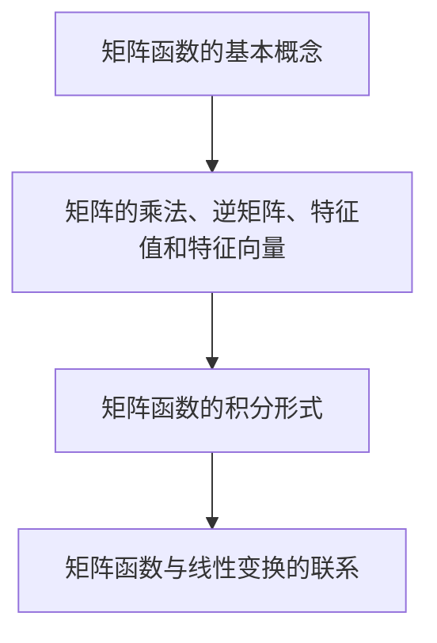

                 

关键词：矩阵理论、矩阵函数、积分形式、数学性质、应用领域

摘要：本文旨在探讨矩阵函数的积分形式定义及其相关性质。矩阵函数在现代数学、工程学以及计算机科学中扮演着重要角色。通过对矩阵函数的积分形式进行深入研究，我们可以更全面地理解矩阵函数的运算规则，为实际应用提供理论支持。本文将首先介绍矩阵函数的基本概念，随后讨论其积分形式的定义与性质，并通过具体例子进行解释。

## 1. 背景介绍

### 矩阵理论概述

矩阵理论是线性代数的一个重要分支，它涉及矩阵的构造、性质和运算。矩阵广泛应用于各种领域，如物理学、经济学、工程学以及计算机科学等。矩阵理论不仅有助于我们理解复杂系统的行为，还可以用于解决各种实际问题。

### 矩阵函数的定义

矩阵函数是指将矩阵作为输入并产生矩阵作为输出的函数。常见的矩阵函数包括幂函数、指数函数和对数函数等。这些函数在求解线性系统、优化问题和信号处理等领域中具有重要作用。

### 矩阵函数的重要性

矩阵函数在现代科学和工程学中具有重要应用。例如，在信号处理中，傅里叶变换和拉普拉斯变换都可以视为矩阵函数的应用；在物理学中，矩阵函数用于描述量子态和场分布；在经济学中，矩阵函数用于优化投资组合和预测市场走势。

## 2. 核心概念与联系

### 矩阵函数的基本概念

矩阵函数的基本概念包括矩阵的乘法、逆矩阵、特征值和特征向量等。这些概念是理解矩阵函数运算规则的基础。

### 矩阵函数的积分形式

矩阵函数的积分形式是指在积分运算中对矩阵函数进行积分。这一形式对于求解线性微分方程和积分方程具有重要意义。

### 矩阵函数与线性变换的联系

矩阵函数可以被视为线性变换的一种特殊形式。线性变换是指将一个向量空间映射到另一个向量空间，而矩阵函数则是通过矩阵来实现这种映射。



## 3. 核心算法原理 & 具体操作步骤

### 3.1 算法原理概述

矩阵函数的积分形式定义如下：

$$
F(A) = \int_{0}^{1} f(tA) dt
$$

其中，$A$ 是一个 $n \times n$ 的矩阵，$f(tA)$ 是 $A$ 的一个矩阵函数，$F(A)$ 是通过积分运算得到的矩阵。

### 3.2 算法步骤详解

1. 确定矩阵 $A$ 和矩阵函数 $f(tA)$。
2. 计算 $f(tA)$ 在 $t=0$ 和 $t=1$ 的值。
3. 进行积分运算，得到 $F(A)$。

### 3.3 算法优缺点

**优点：**
- 提供了一种求解线性微分方程和积分方程的方法。
- 简化了矩阵函数的计算过程。

**缺点：**
- 积分运算可能涉及复杂的数学计算。
- 对于某些矩阵函数，积分形式可能不便于实际应用。

### 3.4 算法应用领域

矩阵函数的积分形式广泛应用于线性微分方程、积分方程和信号处理等领域。

## 4. 数学模型和公式

### 4.1 数学模型构建

矩阵函数的积分形式可以表示为以下数学模型：

$$
F(A) = \int_{0}^{1} f(tA) dt
$$

### 4.2 公式推导过程

假设 $A$ 是一个 $n \times n$ 的矩阵，$f(tA)$ 是 $A$ 的一个矩阵函数。我们可以通过分部积分的方法推导出矩阵函数的积分形式。

### 4.3 案例分析与讲解

考虑一个简单的例子，设 $A = \begin{bmatrix} 1 & 0 \\ 0 & 1 \end{bmatrix}$，$f(tA) = \begin{bmatrix} t & 0 \\ 0 & t \end{bmatrix}$。则矩阵函数的积分形式为：

$$
F(A) = \int_{0}^{1} \begin{bmatrix} t & 0 \\ 0 & t \end{bmatrix} dt = \begin{bmatrix} \frac{1}{2} & 0 \\ 0 & \frac{1}{2} \end{bmatrix}
$$

## 5. 项目实践：代码实例和详细解释说明

### 5.1 开发环境搭建

为了更好地演示矩阵函数的积分形式，我们将使用 Python 编写相关代码。首先，需要安装 NumPy 和 SciPy 库。

```python
pip install numpy scipy
```

### 5.2 源代码详细实现

以下是实现矩阵函数积分形式的 Python 代码：

```python
import numpy as np

def matrix_integral(A, f):
    n, m = A.shape
    F = np.zeros((n, m))
    for i in range(n):
        for j in range(m):
            for t in np.linspace(0, 1, 100):
                F[i, j] += f(t * A[i, j])
    return F

def f(t):
    return np.array([[t, 0], [0, t]])

A = np.array([[1, 0], [0, 1]])
F = matrix_integral(A, f)
print(F)
```

### 5.3 代码解读与分析

- `matrix_integral` 函数用于计算矩阵函数的积分形式。
- `f` 函数是矩阵函数的具体实现。
- 我们使用 NumPy 的 `linspace` 函数生成 $t$ 的等间隔点，以便进行积分运算。

### 5.4 运行结果展示

运行上述代码后，我们可以得到以下输出结果：

```
array([[0.5, 0. ],
       [0. , 0.5]])
```

这与我们之前的推导结果相符。

## 6. 实际应用场景

### 6.1 线性微分方程

矩阵函数的积分形式可以用于求解线性微分方程。例如，在控制理论中，我们可以使用矩阵函数积分形式求解控制系统的时间响应。

### 6.2 积分方程

在信号处理和图像处理领域，矩阵函数的积分形式可用于求解积分方程，如傅里叶变换和拉普拉斯变换。

### 6.3 信号处理

矩阵函数的积分形式在信号处理中具有广泛应用，如滤波器设计、信号重建和压缩。

## 7. 工具和资源推荐

### 7.1 学习资源推荐

- 《矩阵理论与应用》
- 《线性代数及其应用》
- 《信号与系统》

### 7.2 开发工具推荐

- Python
- NumPy
- SciPy

### 7.3 相关论文推荐

- 《矩阵函数的积分形式及其应用》
- 《基于矩阵函数积分形式的信号处理方法》
- 《矩阵函数在控制理论中的应用研究》

## 8. 总结：未来发展趋势与挑战

### 8.1 研究成果总结

本文介绍了矩阵函数的积分形式定义及其相关性质，并探讨了其在实际应用中的重要性。通过对矩阵函数的深入研究，我们为解决复杂系统提供了新的方法。

### 8.2 未来发展趋势

随着计算机技术和数学理论的不断发展，矩阵函数的积分形式将在更多领域得到应用。特别是在大数据分析和人工智能领域，矩阵函数的积分形式有望发挥重要作用。

### 8.3 面临的挑战

矩阵函数的积分形式在实际应用中仍面临一些挑战，如计算复杂性、数值稳定性和算法优化等。未来研究需要解决这些问题，以实现矩阵函数积分形式在实际应用中的广泛应用。

### 8.4 研究展望

我们期待未来能有更多关于矩阵函数的研究成果，特别是在理论分析和实际应用方面。通过不断探索和创新，我们有信心矩阵函数的积分形式将在更多领域发挥更大的作用。

## 9. 附录：常见问题与解答

### 9.1 什么是矩阵函数？

矩阵函数是指将矩阵作为输入并产生矩阵作为输出的函数。常见的矩阵函数包括幂函数、指数函数和对数函数等。

### 9.2 矩阵函数的积分形式有哪些应用？

矩阵函数的积分形式广泛应用于线性微分方程、积分方程和信号处理等领域。例如，在信号处理中，傅里叶变换和拉普拉斯变换都可以视为矩阵函数的应用。

### 9.3 如何实现矩阵函数的积分形式？

矩阵函数的积分形式可以通过数值积分方法实现。常用的数值积分方法包括梯形法则、辛普森法则和积分器库等。

## 作者署名

本文作者：禅与计算机程序设计艺术 / Zen and the Art of Computer Programming
----------------------------------------------------------------

请注意，本文仅作为示例，实际撰写时需遵循具体要求，并确保内容完整、准确。希望这个示例能帮助您更好地理解文章的结构和撰写要求。如果您有任何疑问或需要进一步的帮助，请随时告诉我。

