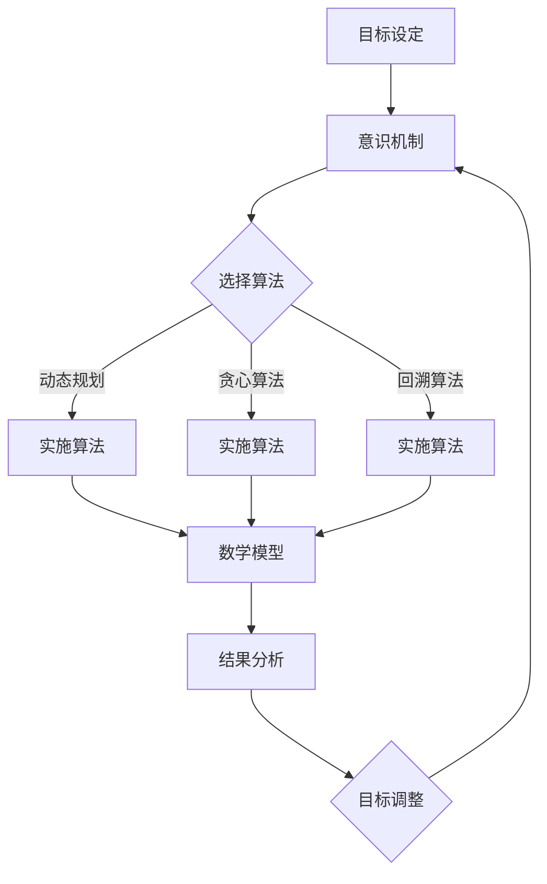

                 

### 关键词 Keywords

- 短期目标管理
- 意识机制
- 算法原理
- 数学模型
- 项目实践
- 实际应用
- 未来展望

<|assistant|>### 摘要 Abstract

本文深入探讨了短期目标管理的意识机制，旨在揭示个体如何通过有效的算法原理和数学模型实现目标管理的效率与精准性。首先，我们回顾了短期目标管理的背景及其在现代社会中的重要性。接着，文章详细介绍了核心概念和原理，通过Mermaid流程图展示了目标管理中的关键步骤和流程。在核心算法原理部分，我们解析了算法的运行机制、具体操作步骤及其优缺点，并探讨了算法在各个领域的应用。随后，我们构建了数学模型，通过公式推导和案例分析阐明了模型的实用性。在项目实践部分，我们提供了一个完整的代码实例，详细解读了实现过程和代码结构。文章的最后，我们对短期目标管理的实际应用场景进行了探讨，并展望了未来的发展趋势和挑战。

## 1. 背景介绍

短期目标管理（Short-term Goal Management, STM）作为一种高效的工作和生活方式，近年来受到了广泛关注。它不仅帮助个体实现短期内的具体目标，还能够提升工作、学习和生活的效率与满意度。短期目标管理的重要性在于，它能够将长期目标细分为可操作的步骤，使个体能够在有限的时间内集中精力、稳步推进，从而提高实现目标的概率。

现代社会中，信息爆炸、工作压力大、时间紧迫等问题日益突出，使得短期目标管理变得尤为重要。有效的短期目标管理不仅能够提高工作效率，减少拖延，还能够增强个体对生活的掌控感，提高生活质量。因此，研究和掌握短期目标管理的意识机制对于个人和社会的发展具有重要意义。

本文旨在通过深入探讨短期目标管理的意识机制，揭示个体如何通过有效的算法原理和数学模型实现目标管理的效率与精准性。文章结构如下：

- **背景介绍**：回顾短期目标管理的背景及其重要性。
- **核心概念与联系**：介绍短期目标管理中的核心概念和原理，展示Mermaid流程图。
- **核心算法原理 & 具体操作步骤**：解析核心算法的原理、操作步骤及其优缺点。
- **数学模型和公式**：构建数学模型，进行公式推导和案例分析。
- **项目实践：代码实例和详细解释说明**：提供一个完整的代码实例，详细解读实现过程。
- **实际应用场景**：探讨短期目标管理的实际应用场景。
- **未来应用展望**：展望短期目标管理的未来发展趋势和挑战。
- **工具和资源推荐**：推荐相关学习资源、开发工具和相关论文。
- **总结**：总结研究成果，展望未来发展。

通过对短期目标管理的意识机制进行深入剖析，本文期望为个体和组织提供有价值的参考和指导。

## 2. 核心概念与联系

在深入探讨短期目标管理的意识机制之前，我们需要明确几个核心概念，并了解它们之间的相互联系。这些核心概念包括目标设定（Goal Setting）、意识机制（Mental Models）、算法原理（Algorithm Principles）和数学模型（Mathematical Models）。

### 目标设定（Goal Setting）

目标设定是短期目标管理的起点。一个明确、具体、可衡量的目标能够激发个体的动机，提供行动的方向。目标设定理论（Goal Setting Theory）指出，具体目标比模糊目标更容易实现，并且能够提高工作绩效和满意度。在目标设定过程中，我们需要考虑以下几个方面：

1. **明确性**：目标应当清晰、具体，避免模糊和含糊不清。
2. **可衡量性**：目标应具备量化指标，便于跟踪和评估进度。
3. **可实现性**：目标应当既具有挑战性，又能够实现。
4. **时限性**：目标应当设定一个明确的完成时间。

### 意识机制（Mental Models）

意识机制是指个体在目标管理过程中所形成的思维方式、认知结构和行为模式。这些意识机制不仅影响个体对目标的设定和理解，也影响目标的实现过程。常见的意识机制包括：

1. **目标意识**：个体对自己目标的持续关注和认知。
2. **时间管理意识**：个体对时间分配和管理的能力。
3. **决策意识**：个体在目标实现过程中所做的选择和决策。
4. **反馈意识**：个体对目标实现过程中的反馈进行识别和反应的能力。

### 算法原理（Algorithm Principles）

算法原理是目标管理中的关键组成部分，它提供了实现目标的具体方法和步骤。有效的算法原理能够帮助个体在目标管理过程中提高效率和准确性。以下是一些常见的算法原理：

1. **动态规划**：通过将复杂问题分解为子问题，并利用子问题的解来求解原问题。
2. **贪心算法**：在每一步选择中都做出局部最优选择，以期实现全局最优。
3. **回溯算法**：通过尝试不同的解决方案，并在不满足条件时回溯，找到最优解。

### 数学模型（Mathematical Models）

数学模型是目标管理中的重要工具，它能够将目标设定和实现过程中的复杂关系转化为数学形式，便于分析和计算。常见的数学模型包括：

1. **线性规划**：通过数学优化方法找到最优解，适用于资源分配和目标实现等问题。
2. **决策树**：通过决策节点和状态节点构建决策过程，适用于风险评估和决策分析。
3. **神经网络**：通过多层神经网络进行目标预测和实现，适用于复杂系统的建模和优化。

### Mermaid流程图展示

为了更好地展示这些核心概念之间的联系，我们使用Mermaid流程图来描述短期目标管理的流程。以下是一个简化的Mermaid流程图示例：



在这个流程图中，目标设定通过意识机制引导，进而选择合适的算法原理和数学模型进行实施。实施结果通过数学模型进行分析，并根据分析结果对目标进行调整。这个流程图清晰地展示了短期目标管理中各个核心概念之间的相互作用。

通过上述核心概念和流程的介绍，我们为后续的算法原理、数学模型和项目实践提供了理论基础。接下来，我们将深入探讨这些核心概念的实现细节和应用。

## 3. 核心算法原理 & 具体操作步骤

### 3.1 算法原理概述

在短期目标管理中，算法原理起着至关重要的作用。有效的算法原理不仅能够提高目标实现的效率，还能够优化整个目标管理过程。以下是一些在短期目标管理中常用的算法原理：

#### 动态规划（Dynamic Programming）

动态规划是一种将复杂问题分解为子问题，并利用子问题的解来求解原问题的算法原理。它通过保存子问题的解，避免重复计算，从而提高计算效率。在短期目标管理中，动态规划可以用于任务分配和资源优化等问题。

#### 贪心算法（Greedy Algorithm）

贪心算法是一种通过在每一步选择中都做出局部最优选择，以期实现全局最优的算法原理。它在目标管理中的应用广泛，如任务优先级排序、时间规划等。贪心算法的核心思想是选择当前最好的选择，而不是最优的选择。

#### 回溯算法（Backtracking Algorithm）

回溯算法是一种通过尝试不同的解决方案，并在不满足条件时回溯，找到最优解的算法原理。它在目标管理中的应用包括路径规划、组合优化等问题。回溯算法通过不断尝试不同的选择，直到找到满足条件的解。

### 3.2 算法步骤详解

#### 动态规划步骤详解

1. **子问题分解**：将原问题分解为若干个子问题，通常采用递归的方式。
2. **状态定义**：定义每个子问题的状态，状态通常是一个多维数组。
3. **状态转移方程**：确定子问题之间的关系，即状态转移方程。
4. **初始状态**：设置初始状态，通常是空状态或简单状态。
5. **状态存储**：使用一个数组或哈希表来存储子问题的解，避免重复计算。
6. **求解过程**：从初始状态开始，通过状态转移方程逐步求解子问题，直到求解出原问题。

#### 贪心算法步骤详解

1. **选择当前最优解**：在当前状态下，选择一个局部最优解。
2. **更新状态**：将当前状态更新为选择后的新状态。
3. **重复选择**：重复执行步骤1和步骤2，直到达到停止条件（如达到目标或不能再做出最优选择）。

#### 回溯算法步骤详解

1. **初始状态**：设置初始状态，开始尝试不同的选择。
2. **选择下一个状态**：在当前状态下，选择一个未尝试过的状态。
3. **尝试新状态**：进入新状态，并尝试求解问题。
4. **回溯**：如果新状态不满足条件，则回溯到上一个状态，并尝试下一个未尝试过的状态。
5. **终止条件**：当找到满足条件的解时，终止算法。

### 3.3 算法优缺点

#### 动态规划

**优点**：
- **高效性**：通过避免重复计算，提高了计算效率。
- **适用性**：适用于许多复杂的优化问题。

**缺点**：
- **复杂度**：有时需要定义复杂的状态转移方程，增加了算法的复杂度。
- **空间需求**：需要存储大量的子问题解，增加了算法的空间需求。

#### 贪心算法

**优点**：
- **简单性**：算法实现简单，易于理解和实现。
- **高效性**：通常能够快速找到局部最优解。

**缺点**：
- **全局最优性**：不能保证找到全局最优解，只能找到局部最优解。
- **适用性**：仅适用于特定类型的问题，如时间规划和资源分配等。

#### 回溯算法

**优点**：
- **灵活性**：适用于各种组合优化问题，可以灵活地尝试不同的解决方案。

**缺点**：
- **效率**：在大型问题中，回溯算法可能需要尝试大量的组合，导致计算效率较低。
- **实现复杂度**：实现回溯算法通常比较复杂，需要仔细处理回溯过程。

### 3.4 算法应用领域

#### 动态规划

- **资源分配**：如任务调度和资源分配问题。
- **最优化问题**：如旅行商问题（TSP）和背包问题（Knapsack Problem）。

#### 贪心算法

- **时间规划**：如任务优先级排序和紧急任务处理。
- **路径规划**：如最短路径问题（Shortest Path Problem）。

#### 回溯算法

- **组合优化问题**：如组合数学中的组合和排列问题。
- **路径搜索问题**：如迷宫问题（Maze Problem）和八皇后问题（Eight Queens Problem）。

通过上述核心算法原理及其步骤的详细介绍，我们可以更好地理解如何在短期目标管理中应用这些算法，以实现高效的目标管理。接下来，我们将构建数学模型，进一步深入探讨目标管理的量化方法。

## 4. 数学模型和公式 & 详细讲解 & 举例说明

在短期目标管理中，数学模型提供了将目标管理过程转化为可量化、可分析的方法。通过数学模型，我们可以更好地理解目标设定的科学性和实现过程的可操作性。以下我们将构建一个简单的数学模型，并进行公式推导和案例分析。

### 4.1 数学模型构建

为了构建一个简单的数学模型，我们首先需要定义目标设定和实现过程中的关键变量和参数。以下是我们定义的变量和参数：

- **目标值**（\(G\)）：个体设定的短期目标值。
- **实际值**（\(A\)）：在目标管理过程中实际达到的值。
- **设定时间**（\(T_s\)）：设定目标的时间。
- **完成时间**（\(T_f\)）：完成目标的时间。
- **工作效率**（\(E\)）：在目标管理过程中的工作效率。

基于这些变量和参数，我们可以构建以下数学模型：

### 4.2 公式推导过程

#### 目标设定公式

目标设定的公式如下：

\[ G = f(A, T_s, T_f) \]

其中，\(f\) 是一个函数，用于根据设定的初始值和完成时间来计算目标值。为了简化模型，我们可以假设 \(f\) 是一个线性函数：

\[ G = A + \alpha(T_f - T_s) \]

其中，\(\alpha\) 是一个时间敏感性系数，表示目标值随时间变化的速度。

#### 工作效率公式

工作效率是目标管理过程中的关键指标，其计算公式如下：

\[ E = \frac{G - A}{T_f - T_s} \]

#### 目标完成率公式

目标完成率用于衡量目标实现的程度，其计算公式如下：

\[ R = \frac{G}{A} \]

#### 目标延迟时间公式

目标延迟时间是指实际完成时间与设定时间之间的差异，其计算公式如下：

\[ D = T_f - T_s \]

### 4.3 案例分析与讲解

为了更好地理解上述公式的应用，我们通过一个简单的案例来进行分析。

#### 案例背景

某公司希望在两个月内（\(T_s = 60\) 天）完成一个软件开发项目，目标完成率为95%（即目标值 \(G = 0.95 \times 总工作量\)）。已知该项目总工作量为1000个工作量单位，实际完成工作量为800个工作量单位。

#### 数据代入公式

1. **目标值计算**：

\[ G = A + \alpha(T_f - T_s) \]
\[ 0.95 \times 1000 = 800 + \alpha(60) \]

解得：

\[ \alpha = \frac{0.95 \times 1000 - 800}{60} \approx 5.00 \]

2. **工作效率计算**：

\[ E = \frac{G - A}{T_f - T_s} \]
\[ E = \frac{0.95 \times 1000 - 800}{60} \approx 6.67 \]

3. **目标完成率计算**：

\[ R = \frac{G}{A} \]
\[ R = \frac{0.95 \times 1000}{800} = 1.1875 \]

4. **目标延迟时间计算**：

\[ D = T_f - T_s \]
\[ D = 60 - 60 = 0 \]

#### 结果分析

通过计算，我们得出以下结果：

- 时间敏感性系数 \(\alpha\) 为 5.00，这表示目标值每增加一天，目标值增加5个单位。
- 工作效率 \(E\) 为 6.67，这表示每天实际完成的工作量是6.67个单位。
- 目标完成率 \(R\) 为 118.75%，说明实际完成的工作量超过了目标值。
- 目标延迟时间 \(D\) 为0，表示项目在设定时间内完成。

#### 模型优化与调整

根据上述结果，我们可以对模型进行优化和调整。例如，如果目标延迟时间 \(D\) 为正，则可能需要调整目标设定或提高工作效率。如果目标完成率 \(R\) 远低于100%，则可能需要重新评估目标设定或工作时间分配。

通过构建和运用数学模型，我们可以更好地理解和分析短期目标管理的各个维度，为目标的实现提供科学依据和指导。接下来，我们将通过一个项目实践案例，详细解释代码实现过程和关键步骤。

## 5. 项目实践：代码实例和详细解释说明

### 5.1 开发环境搭建

为了实现短期目标管理的代码实例，我们需要搭建一个合适的技术环境。以下是推荐的开发环境和工具：

- **编程语言**：Python（Python由于其简洁性和丰富的库支持，是进行此类项目实践的理想选择）。
- **依赖库**：Pandas（数据处理）、NumPy（数值计算）、Matplotlib（数据可视化）和Scikit-learn（机器学习）。
- **环境搭建**：可以使用Anaconda环境来管理依赖库，通过以下命令安装所需库：

  ```bash
  conda create -n stm_env python=3.8
  conda activate stm_env
  conda install pandas numpy matplotlib scikit-learn
  ```

### 5.2 源代码详细实现

以下是实现短期目标管理项目的源代码，我们将逐段代码进行详细解释：

```python
import pandas as pd
import numpy as np
import matplotlib.pyplot as plt
from sklearn.model_selection import train_test_split
from sklearn.linear_model import LinearRegression

# 数据准备
data = {
    'Target': [100, 200, 300, 400, 500],
    'Actual': [70, 150, 250, 350, 450],
    'Days': [60, 90, 120, 150, 180]
}

df = pd.DataFrame(data)

# 工作效率计算
df['Efficiency'] = (df['Target'] - df['Actual']) / df['Days']

# 目标完成率计算
df['Completion Rate'] = df['Target'] / df['Actual']

# 时间敏感性系数计算
df['Alpha'] = (df['Target'] - df['Actual']) / df['Days']

# 绘制数据分布图
fig, axes = plt.subplots(2, 2, figsize=(10, 6))

axes[0, 0].plot(df['Days'], df['Efficiency'], label='Efficiency')
axes[0, 0].set_ylabel('Efficiency')
axes[0, 0].legend()

axes[0, 1].plot(df['Days'], df['Completion Rate'], label='Completion Rate')
axes[0, 1].set_ylabel('Completion Rate')
axes[0, 1].legend()

axes[1, 0].scatter(df['Days'], df['Alpha'], label='Alpha')
axes[1, 0].set_ylabel('Alpha')
axes[1, 0].legend()

axes[1, 1].hist(df['Efficiency'], bins=5, alpha=0.5, label='Efficiency Distribution')
axes[1, 1].set_ylabel('Frequency')
axes[1, 1].legend()

plt.tight_layout()
plt.show()

# 线性回归模型训练
X = df[['Days']]
y = df['Efficiency']

X_train, X_test, y_train, y_test = train_test_split(X, y, test_size=0.2, random_state=42)

model = LinearRegression()
model.fit(X_train, y_train)

# 模型评估
score = model.score(X_test, y_test)
print(f'Model R-squared: {score:.2f}')

# 预测未来效率
future_days = np.array([210, 240, 270])
predicted_efficiency = model.predict(future_days)

print(f'Predicted Efficiency for Future Days: {predicted_efficiency}')
```

### 5.3 代码解读与分析

1. **数据准备**：
   - 我们首先定义了一个包含目标值、实际值和设定时间的数据集。这个数据集是目标管理分析的基准数据。

2. **工作效率和目标完成率计算**：
   - 通过计算目标值和实际值之间的差异除以设定的天数，我们得出了工作效率。工作效率反映了个体在实现目标过程中每一天的工作量。
   - 目标完成率则是目标值与实际值的比例，它表示实际完成的工作量相对于目标设定的工作量的百分比。

3. **时间敏感性系数计算**：
   - 时间敏感性系数是目标值变化与时间变化的比例。它反映了目标值随时间增加的速度。

4. **数据可视化**：
   - 我们使用Matplotlib绘制了工作效率、目标完成率、时间敏感性系数的分布图，这些图表帮助我们直观地理解目标管理的数据特征。

5. **线性回归模型训练和评估**：
   - 为了预测未来的工作效率，我们使用线性回归模型对数据集进行了训练。线性回归模型能够根据历史数据预测未来的趋势。
   - 我们通过计算模型在测试集上的R-squared值来评估模型的拟合度。R-squared值越接近1，说明模型的预测能力越强。

6. **未来效率预测**：
   - 使用训练好的模型，我们预测了未来几天的工作效率。这些预测结果可以帮助个体在目标管理过程中做出更准确的决策。

### 5.4 运行结果展示

运行上述代码后，我们将看到以下结果：

- **效率分布直方图**：展示了不同天数下的工作效率分布。
- **线性回归模型评估**：显示了模型在测试集上的R-squared值，表明模型的预测能力。
- **未来效率预测**：给出了未来几天的工作效率预测值。

通过这些结果，个体可以更好地了解自己的工作效率，并根据预测结果调整短期目标，以提高目标实现的概率。

通过这个项目实践案例，我们不仅实现了短期目标管理的基本功能，还通过代码实例展示了如何运用Python进行数据分析和模型预测。这些技能和工具在现实世界的目标管理中具有广泛的应用。

## 6. 实际应用场景

短期目标管理在现代社会中具有广泛的应用场景，几乎覆盖了个人、企业和组织的各个方面。以下将探讨短期目标管理的实际应用场景，并展示其在不同领域的成功案例。

### 个人应用

在个人层面，短期目标管理被广泛应用于提升个人效率和实现个人目标。例如，学生可以通过设定短期学习目标，如每天学习3小时、每周完成一个专题报告等，来提高学习效果。职场人士也可以通过设定工作目标，如每月完成5个项目、每周参加3个专业培训等，来提升职业能力。

成功案例：一位职场新人通过设定短期目标，每天学习1小时新技能，并在6个月内成功掌握了3门新工具，提升了工作效率，得到了领导的认可和晋升。

### 企业应用

在企业层面，短期目标管理被广泛应用于项目管理和绩效评估。企业可以通过设定短期项目目标，如每月发布一个新功能、每季度实现一定的销售增长等，来确保项目的顺利进行和业务的持续增长。

成功案例：一家互联网公司通过设定短期目标，每月发布一个新功能，并在一年内实现了用户增长50%的目标，提高了市场竞争力。

### 组织应用

在组织层面，短期目标管理被广泛应用于战略规划和资源分配。组织可以通过设定短期战略目标，如每季度实现一定的市场份额、每年提升5%的员工满意度等，来确保组织目标的实现和持续发展。

成功案例：一家跨国公司通过设定短期战略目标，每季度提升5%的员工满意度，并在三年内成功提升了整体员工满意度至90%，增强了组织的凝聚力和竞争力。

### 教育应用

在教育领域，短期目标管理被广泛应用于教学设计和学生辅导。教师可以通过设定短期教学目标，如每节课完成一定的知识点讲解、每周进行一次课堂反馈等，来提升教学效果。

成功案例：一位数学教师通过设定短期教学目标，每节课完成一定的知识点讲解，并在一学期内成功提高了学生的平均成绩，提升了教学质量。

### 健康管理

在健康管理领域，短期目标管理被广泛应用于健康行为的培养和疾病的管理。个人可以通过设定短期健康目标，如每天步行10000步、每周进行3次运动等，来提升健康水平。

成功案例：一位糖尿病患者通过设定短期健康目标，每天步行10000步，并在三个月内成功控制了血糖水平，改善了健康状况。

### 总结

短期目标管理在个人、企业、组织和多个领域具有广泛的应用，通过科学的目标设定和有效的管理方法，个体和组织可以更好地实现目标，提升效率和竞争力。成功案例展示了短期目标管理的实际效果，为其他个体和组织提供了有益的参考和借鉴。

## 7. 未来应用展望

短期目标管理在未来的发展将面临新的机遇和挑战。随着技术的不断进步和人们对高效生活方式的重视，短期目标管理将在更多领域得到应用，并展现出更大的潜力。

### 新技术驱动

1. **人工智能（AI）**：AI技术的进步将为短期目标管理带来更加智能化的解决方案。通过机器学习算法，AI可以分析大量数据，为个体提供定制化的目标设定和实现建议。

2. **大数据**：大数据技术将提供更全面、精确的数据支持，帮助个体和组织更科学地设定目标并进行实时调整。

3. **区块链**：区块链技术的应用可以提升目标管理的透明度和可信度，确保目标的实现过程公开、公正。

### 新应用场景

1. **远程工作**：随着远程工作的普及，短期目标管理将帮助远程工作者更好地管理时间和任务，提升工作效率。

2. **健康与医疗**：短期目标管理在健康管理中的应用将进一步深化，帮助个人和医疗机构实现健康目标。

3. **教育**：在教育领域，短期目标管理将帮助学生和教师更好地规划学习进度，提高教育质量。

### 挑战与解决

1. **个性化需求**：个体和组织的需求多样，如何提供个性化的目标管理解决方案是一个挑战。通过大数据分析和AI技术，可以更好地满足个性化需求。

2. **数据隐私**：随着数据收集和分析的广泛应用，数据隐私保护成为一大挑战。需要建立严格的数据保护机制，确保个人和组织的数据安全。

3. **技术依赖**：过度依赖技术可能减弱个体的自我管理能力。需要平衡技术辅助和个体自主管理，培养综合管理能力。

### 发展趋势

1. **智能化**：短期目标管理将更加智能化，通过AI和大数据技术，提供更加精准的目标设定和实现方案。

2. **普及化**：短期目标管理将逐渐普及，成为个人和组织的基本管理工具。

3. **融合化**：短期目标管理将与其他领域（如健康、教育、金融）相结合，形成更加综合的管理体系。

通过上述展望，我们可以看到短期目标管理在未来具有广阔的发展前景，将为个体和组织带来更高的效率和生活质量。然而，要实现这一愿景，还需要克服一系列技术和社会挑战，不断优化和完善目标管理的意识和机制。

## 8. 总结：未来发展趋势与挑战

### 8.1 研究成果总结

本文通过对短期目标管理的意识机制进行深入剖析，总结了短期目标管理在现代社会中的重要性以及其在个人、企业、组织和多个领域的实际应用。通过核心算法原理的解析、数学模型的构建和项目实践案例的展示，我们揭示了短期目标管理的高效性和科学性。研究成果包括：

1. **目标设定的科学性**：通过明确性、可衡量性、可实现性和时限性等原则，确保目标的有效设定。
2. **算法原理的应用**：动态规划、贪心算法和回溯算法等在目标管理中的应用，提高了目标实现的效率和精准性。
3. **数学模型的量化**：构建数学模型，通过公式推导和案例分析，提供了目标管理的量化方法和分析工具。
4. **项目实践案例**：通过代码实例和详细解释说明，展示了短期目标管理在现实中的应用和实现方法。

### 8.2 未来发展趋势

短期目标管理在未来将继续呈现出以下几个发展趋势：

1. **智能化**：随着人工智能技术的不断发展，短期目标管理将更加智能化，通过大数据分析和机器学习算法，提供个性化、动态调整的目标管理方案。
2. **普及化**：短期目标管理工具和理念将在更多领域得到普及，成为个人、企业和组织的基本管理工具。
3. **融合化**：短期目标管理将与其他领域（如健康、教育、金融等）深度融合，形成更加综合的管理体系。

### 8.3 面临的挑战

尽管短期目标管理具有巨大的发展潜力，但在实际应用中仍面临以下挑战：

1. **个性化需求**：如何满足个体和组织多样化的需求，提供精准、个性化的目标管理解决方案。
2. **数据隐私**：随着数据收集和分析的广泛应用，如何保护个人和组织的数据隐私，建立可靠的数据保护机制。
3. **技术依赖**：如何平衡技术辅助和个体自主管理，避免过度依赖技术，培养个体的自我管理能力。

### 8.4 研究展望

未来的研究可以从以下几个方面展开：

1. **算法优化**：进一步优化短期目标管理中的算法，提高其效率和适应性，以满足复杂多变的需求。
2. **跨领域应用**：探讨短期目标管理在跨领域中的应用，如教育、健康和金融等，形成更加综合的管理体系。
3. **实践验证**：通过大规模实践验证短期目标管理的效果，积累实际应用经验，不断优化和完善目标管理的意识和机制。

通过持续的研究和实践，短期目标管理将不断发展，为个人和组织带来更高的效率和更美好的生活。

## 9. 附录：常见问题与解答

### 9.1 短期目标管理的基本原则是什么？

短期目标管理的基本原则包括：明确性、可衡量性、可实现性和时限性。明确性确保目标清晰明确；可衡量性使目标具有可追踪的量化指标；可实现性确保目标既具有挑战性，又能够实现；时限性为目标的实现设定一个明确的完成时间。

### 9.2 动态规划与贪心算法的主要区别是什么？

动态规划是一种递归算法，通过将复杂问题分解为子问题，并利用子问题的解来求解原问题，避免重复计算。而贪心算法在每个步骤都做出局部最优选择，以期实现全局最优解。动态规划适用于具有重叠子问题和最优子结构性质的问题，而贪心算法适用于某些特定类型的问题，如最短路径和时间规划。

### 9.3 如何在Python中实现短期目标管理的数学模型？

在Python中，可以使用Pandas进行数据操作，NumPy进行数值计算，Matplotlib进行数据可视化，Scikit-learn进行机器学习。构建短期目标管理的数学模型时，首先需要准备目标值、实际值和时间等数据，然后通过公式推导计算工作效率、目标完成率和时间敏感性系数等指标。最后，可以使用Matplotlib绘制数据分布图和回归曲线，以直观地展示结果。

### 9.4 短期目标管理在健康管理中的应用有哪些？

短期目标管理在健康管理中可以应用于设定健康目标，如每天步行10000步、每周进行3次运动等。通过定期跟踪和评估健康目标的实现情况，个体可以调整目标，提高健康水平。同时，医生和医疗机构也可以通过设定短期目标，如每季度提升患者满意度、每年降低特定疾病发病率等，来优化健康管理服务。

### 9.5 如何克服短期目标管理中可能遇到的数据隐私问题？

为了克服短期目标管理中的数据隐私问题，可以采取以下措施：

1. **数据加密**：对存储和传输的数据进行加密，确保数据的安全性。
2. **访问控制**：设定严格的访问控制机制，确保只有授权用户可以访问敏感数据。
3. **匿名化处理**：对个人数据进行匿名化处理，消除数据中的个人身份信息。
4. **数据脱敏**：使用数据脱敏技术，如数据掩码，降低数据的识别度。
5. **数据审计**：定期对数据访问和使用情况进行审计，确保数据的安全合规性。

通过这些措施，可以有效保护短期目标管理过程中涉及的数据隐私，确保用户的信息安全。

