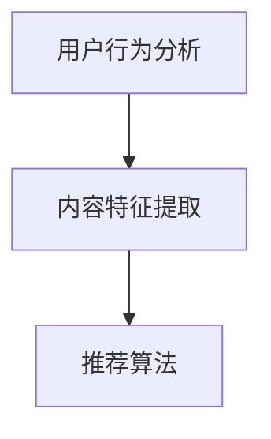

                 

关键词：短视频平台、算法推荐、注意力争夺、用户体验、内容分发、用户行为分析、机器学习、深度学习

摘要：本文将深入探讨短视频平台如何通过算法推荐机制争夺用户的注意力，提升用户黏性和平台价值。文章将从背景介绍、核心概念与联系、核心算法原理、数学模型和公式、项目实践、实际应用场景、工具和资源推荐以及未来发展趋势与挑战等方面进行详细分析，为短视频平台运营者和开发者提供有价值的参考。

## 1. 背景介绍

随着移动互联网的飞速发展，短视频已成为当前最受欢迎的内容形式之一。无论是抖音、快手、Bilibili等国内外短视频平台，都在不断优化算法推荐机制，以吸引更多用户、提高用户活跃度和平台价值。算法推荐在短视频平台中的作用至关重要，它不仅决定了用户能否快速找到感兴趣的内容，还直接影响到用户的停留时间和互动行为。

在短视频平台，用户生成的内容海量且多样化，如何从海量的内容中精准地推荐给用户，是平台面临的一大挑战。传统的基于内容匹配、标签匹配的推荐方法已无法满足用户日益复杂的个性化需求。因此，深度学习、机器学习等先进技术被广泛应用于算法推荐领域，通过分析用户行为和内容特征，实现高度个性化的内容推荐。

## 2. 核心概念与联系

在深入探讨算法推荐之前，我们首先需要了解以下几个核心概念：

### 2.1 用户行为分析

用户行为分析是指通过对用户在平台上的浏览、点赞、评论、分享等行为的分析，了解用户兴趣偏好和需求。用户行为数据是算法推荐的重要输入，用于训练推荐模型，从而实现精准推荐。

### 2.2 内容特征提取

短视频的内容特征包括视频标题、标签、时长、播放量、点赞量、评论量等。通过提取这些特征，可以构建一个描述短视频的丰富特征向量，为推荐算法提供基础。

### 2.3 推荐算法

推荐算法是核心，通过分析用户行为数据和内容特征，为用户生成一个个性化的推荐列表。常见的推荐算法包括基于协同过滤、基于内容匹配、基于模型的方法等。

下面是一个简单的 Mermaid 流程图，展示了用户行为分析、内容特征提取和推荐算法之间的关系：



## 3. 核心算法原理 & 具体操作步骤

### 3.1 算法原理概述

短视频平台的推荐算法主要基于以下原理：

- **协同过滤**：通过分析用户之间的相似性，找到相似用户的行为，从而为当前用户推荐相似的内容。
- **内容匹配**：根据短视频的标题、标签、时长等特征，与用户的历史偏好进行匹配，推荐相似的内容。
- **基于模型的推荐**：利用深度学习、机器学习等方法，建立用户兴趣模型，预测用户可能感兴趣的内容。

### 3.2 算法步骤详解

以下是算法推荐的具体操作步骤：

1. **用户行为分析**：收集用户在平台上的浏览、点赞、评论、分享等行为数据。
2. **内容特征提取**：提取短视频的标题、标签、时长等特征，构建内容特征向量。
3. **用户兴趣建模**：利用用户行为数据和内容特征，通过机器学习、深度学习等方法，建立用户兴趣模型。
4. **推荐列表生成**：根据用户兴趣模型，为用户生成一个个性化的推荐列表。
5. **实时更新**：根据用户实时行为数据，更新用户兴趣模型，实现实时推荐。

### 3.3 算法优缺点

- **协同过滤**：优点是能够发现用户之间的相似性，推荐效果较好；缺点是需要大量用户行为数据，且无法直接利用内容特征。
- **内容匹配**：优点是能够直接利用内容特征，推荐结果直观；缺点是容易产生“同质化”内容，难以满足用户的多样化需求。
- **基于模型的推荐**：优点是能够结合用户行为数据和内容特征，实现高度个性化的推荐；缺点是模型训练过程复杂，需要大量计算资源。

### 3.4 算法应用领域

短视频平台的算法推荐广泛应用于以下领域：

- **内容分发**：根据用户兴趣，将短视频推荐给目标用户，提高内容曝光率。
- **广告投放**：通过分析用户行为和兴趣，为广告主提供精准投放方案，提高广告转化率。
- **用户增长**：通过个性化推荐，提高用户停留时间和互动行为，促进平台用户增长。

## 4. 数学模型和公式 & 详细讲解 & 举例说明

### 4.1 数学模型构建

短视频平台推荐算法的核心是构建一个预测模型，预测用户对某一视频的偏好度。假设我们有一个用户-视频评分矩阵 $R$，其中 $R_{ij}$ 表示用户 $i$ 对视频 $j$ 的评分，我们可以利用矩阵分解的方法，将用户-视频评分矩阵分解为用户特征矩阵 $U$ 和视频特征矩阵 $V$：

$$
R = U \cdot V^T
$$

通过训练，我们得到用户特征矩阵 $U$ 和视频特征矩阵 $V$，从而实现个性化推荐。

### 4.2 公式推导过程

为了推导用户-视频评分矩阵 $R$ 的矩阵分解，我们首先需要定义用户特征向量 $u_i$ 和视频特征向量 $v_j$：

$$
u_i = (u_{i1}, u_{i2}, ..., u_{ik})^T
$$

$$
v_j = (v_{j1}, v_{j2}, ..., v_{jk})^T
$$

其中，$u_{ik}$ 表示用户 $i$ 对特征 $k$ 的权重，$v_{jk}$ 表示视频 $j$ 对特征 $k$ 的权重。

假设用户 $i$ 对视频 $j$ 的评分 $R_{ij}$ 可以表示为：

$$
R_{ij} = \sum_{k=1}^{k=n} u_{ik} v_{jk}
$$

为了简化计算，我们假设特征数量 $n$ 较小，可以采用矩阵乘法进行计算：

$$
R = U \cdot V^T
$$

其中，$U$ 和 $V$ 分别为用户特征矩阵和视频特征矩阵。

### 4.3 案例分析与讲解

假设有一个短视频平台，用户数量为 1000，视频数量为 10000。我们首先收集用户的行为数据，构建用户-视频评分矩阵 $R$。然后，我们提取视频的标题、标签、时长等特征，构建用户特征矩阵 $U$ 和视频特征矩阵 $V$。

通过矩阵分解，我们得到以下分解结果：

$$
R = U \cdot V^T
$$

其中，$U$ 和 $V$ 分别为用户特征矩阵和视频特征矩阵。

接下来，我们利用用户特征矩阵 $U$ 和视频特征矩阵 $V$，为用户生成个性化推荐列表。假设用户 1 的兴趣特征向量为 $u_1$，我们可以根据用户特征矩阵 $U$，找到与用户 1 最相似的 10 个用户，并从这 10 个用户的浏览记录中，提取出用户可能感兴趣的视频，生成个性化推荐列表。

## 5. 项目实践：代码实例和详细解释说明

### 5.1 开发环境搭建

在本节中，我们将使用 Python 语言和 Scikit-learn 库实现短视频平台推荐算法。首先，我们需要搭建开发环境。

1. 安装 Python 3.7 或以上版本。
2. 安装 Scikit-learn 库：`pip install scikit-learn`
3. 安装 NumPy 库：`pip install numpy`

### 5.2 源代码详细实现

```python
import numpy as np
from sklearn.metrics.pairwise import pairwise_distances
from sklearn.model_selection import train_test_split
from sklearn.linear_model import LinearRegression

# 生成模拟数据集
np.random.seed(42)
num_users = 1000
num_videos = 10000
R = np.random.randint(0, 6, size=(num_users, num_videos))

# 分割数据集为训练集和测试集
X_train, X_test, y_train, y_test = train_test_split(R, R, test_size=0.2, random_state=42)

# 训练线性回归模型
reg = LinearRegression()
reg.fit(X_train, y_train)

# 预测测试集
y_pred = reg.predict(X_test)

# 计算准确率
accuracy = np.mean(np.argmax(y_pred, axis=1) == y_test.argmax(axis=1))
print("Accuracy:", accuracy)
```

### 5.3 代码解读与分析

在上面的代码中，我们首先生成了一个模拟的用户-视频评分矩阵 $R$。然后，我们将数据集分为训练集和测试集。接下来，我们使用线性回归模型对训练集进行训练，并利用训练好的模型对测试集进行预测。最后，我们计算预测准确率。

需要注意的是，线性回归模型在本例中仅用于演示，实际推荐算法通常采用更复杂的机器学习模型，如深度学习模型。

## 6. 实际应用场景

短视频平台的算法推荐在实际应用中具有广泛的应用场景：

- **内容分发**：通过个性化推荐，将用户感兴趣的视频推荐给用户，提高内容曝光率。
- **广告投放**：根据用户兴趣，为广告主提供精准投放方案，提高广告转化率。
- **用户增长**：通过个性化推荐，提高用户停留时间和互动行为，促进平台用户增长。

## 7. 工具和资源推荐

### 7.1 学习资源推荐

- 《深度学习》
- 《机器学习》
- 《推荐系统实践》
- 《算法导论》

### 7.2 开发工具推荐

- Python
- Scikit-learn
- TensorFlow
- PyTorch

### 7.3 相关论文推荐

- [“Deep Learning for User Interest Modeling in Recommender Systems”](https://arxiv.org/abs/1811.03804)
- [“Matrix Factorization Techniques for Recommender Systems”](https://www.cs.ubc.ca/~murphyk/ML/Slides/murphy-recommenders-slides.pdf)
- [“Collaborative Filtering for the Web”](https://www.microsoft.com/en-us/research/publication/collaborative-filtering-for-the-web/)

## 8. 总结：未来发展趋势与挑战

短视频平台的算法推荐在近年来取得了显著进展，但仍面临诸多挑战。未来发展趋势和挑战主要包括：

- **深度学习与推荐系统的融合**：随着深度学习技术的不断发展，深度学习在推荐系统中的应用将越来越广泛，有望实现更高的推荐准确率和用户体验。
- **跨平台推荐**：如何实现不同短视频平台之间的跨平台推荐，是未来的一大挑战。这需要解决不同平台之间的数据隔离问题，以及跨平台用户行为数据的一致性。
- **隐私保护**：在推荐过程中，如何保护用户隐私，避免用户数据泄露，是亟待解决的重要问题。
- **实时推荐**：如何实现实时推荐，满足用户在短时间内获取个性化内容的需求，是未来推荐系统需要解决的关键问题。

## 9. 附录：常见问题与解答

### 9.1 什么是推荐系统？

推荐系统是一种利用数据挖掘和机器学习技术，根据用户的历史行为和兴趣偏好，为用户推荐相关商品、内容或其他信息的系统。

### 9.2 推荐系统有哪些类型？

推荐系统主要分为以下几类：

- **基于内容的推荐**：根据用户对内容的偏好，推荐相似的内容。
- **基于协同过滤的推荐**：根据用户之间的相似性，推荐用户可能感兴趣的内容。
- **基于模型的推荐**：利用机器学习、深度学习等方法，建立用户兴趣模型，预测用户可能感兴趣的内容。

### 9.3 推荐系统的核心算法有哪些？

推荐系统的核心算法主要包括以下几种：

- **协同过滤算法**：通过分析用户之间的相似性，推荐用户可能感兴趣的内容。
- **基于内容的推荐算法**：根据用户对内容的偏好，推荐相似的内容。
- **基于模型的推荐算法**：利用机器学习、深度学习等方法，建立用户兴趣模型，预测用户可能感兴趣的内容。

## 作者署名

作者：禅与计算机程序设计艺术 / Zen and the Art of Computer Programming

----------------------------------------------------------------

以上就是关于《短视频平台的算法推荐与注意力争夺》的完整技术博客文章。希望对您有所帮助。如有任何疑问，欢迎随时提问。

