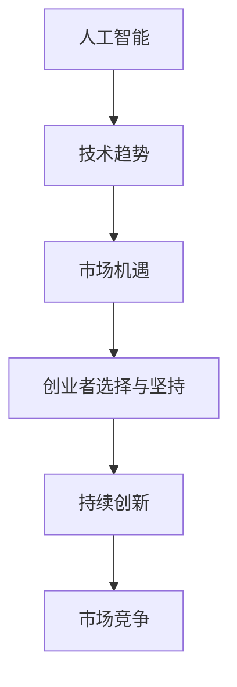

                 

关键词：AI创业，技术选择，持续创新，团队建设，市场机遇

> 摘要：本文将探讨AI创业者在面对技术和市场机遇时的选择与坚持。通过分析技术发展趋势、市场动态以及创业者的心理因素，本文旨在为AI创业者提供一套策略，帮助他们抓住机遇，持续创新，并在竞争激烈的市场中立足。

## 1. 背景介绍

随着人工智能技术的飞速发展，AI创业成为了一个热门领域。无数创业者投身其中，试图通过创新的技术解决实际问题，或开辟新的市场机会。然而，创业之路并非一帆风顺，技术选择、市场机遇、团队建设等方面都充满了挑战。本文将从多个角度分析这些挑战，并提供一些建议，帮助AI创业者更好地抓住机遇，实现持续发展。

## 2. 核心概念与联系

在探讨AI创业者的选择与坚持之前，我们需要了解一些核心概念。首先是**人工智能**（AI），它是一种模拟人类智能的技术，包括机器学习、深度学习、自然语言处理等。其次是**技术趋势**，如大数据、云计算、边缘计算等，它们正不断推动人工智能技术的发展。最后是**市场机遇**，这包括尚未满足的需求、新的商业模式以及快速变化的市场环境。

下面是一个简单的Mermaid流程图，展示这些概念之间的联系：



## 3. 核心算法原理 & 具体操作步骤

### 3.1 算法原理概述

在AI创业过程中，核心算法的选择至关重要。以下是几种常见的AI算法原理概述：

1. **机器学习（ML）**：通过训练数据集来优化模型，从而对未知数据进行预测或分类。
2. **深度学习（DL）**：基于神经网络的结构，通过多层非线性变换来提取特征，实现复杂任务的自动化。
3. **强化学习（RL）**：通过试错和反馈机制来学习策略，使系统在特定环境中做出最优决策。

### 3.2 算法步骤详解

以机器学习为例，其基本步骤如下：

1. **数据收集**：收集大量的训练数据，这些数据应该能够代表问题的不同方面。
2. **数据预处理**：清洗数据，处理缺失值，进行特征工程等。
3. **模型选择**：选择合适的机器学习算法，如决策树、支持向量机、神经网络等。
4. **模型训练**：使用训练数据集训练模型，优化模型的参数。
5. **模型评估**：使用测试数据集评估模型的性能，如准确率、召回率等。
6. **模型部署**：将训练好的模型部署到生产环境中，进行实时预测或分类。

### 3.3 算法优缺点

每种算法都有其优缺点。例如，机器学习算法在处理大规模数据时表现优异，但可能需要大量的计算资源。深度学习算法可以自动提取复杂的特征，但训练过程非常耗时。强化学习算法能够适应动态环境，但可能需要大量的样本数据来收敛。

### 3.4 算法应用领域

这些算法广泛应用于各个领域，如医疗、金融、零售、自动驾驶等。创业者可以根据自己的业务需求选择合适的算法，并将其应用到实际场景中，创造价值。

## 4. 数学模型和公式 & 详细讲解 & 举例说明

在AI创业过程中，数学模型和公式是理解和应用AI算法的基础。以下是一些常见的数学模型和公式，以及它们的推导和实例说明：

### 4.1 数学模型构建

假设我们有一个分类问题，可以使用逻辑回归模型来构建数学模型。逻辑回归模型的公式为：

$$
P(y=1) = \frac{1}{1 + e^{-(\beta_0 + \beta_1 x_1 + \beta_2 x_2 + ... + \beta_n x_n})}
$$

其中，\(P(y=1)\) 是输出为1的概率，\(\beta_0, \beta_1, ..., \beta_n\) 是模型参数，\(x_1, x_2, ..., x_n\) 是输入特征。

### 4.2 公式推导过程

逻辑回归模型的基本思想是通过对输入特征进行线性组合，得到一个分数，然后将这个分数通过Sigmoid函数转换成概率值。Sigmoid函数的导数为：

$$
\frac{d}{dx} \left( \frac{1}{1 + e^{-x}} \right) = \frac{e^{-x}}{(1 + e^{-x})^2}
$$

### 4.3 案例分析与讲解

假设我们有一个简单的二分类问题，需要预测一个客户是否会购买某产品。我们收集了1000个客户的特征数据，包括年龄、收入、购买历史等。我们将这些数据分为训练集和测试集，使用逻辑回归模型进行训练和评估。

在训练过程中，我们通过优化目标函数来更新模型参数，目标函数为：

$$
J(\theta) = -\frac{1}{m} \sum_{i=1}^{m} [y^{(i)} \log(\hat{y}^{(i)}) + (1 - y^{(i)}) \log(1 - \hat{y}^{(i)})]
$$

其中，\(y^{(i)}\) 是第\(i\)个样本的真实标签，\(\hat{y}^{(i)}\) 是模型预测的概率值。

经过多次迭代，我们得到了最优的模型参数。然后，我们使用测试集评估模型的性能，得到准确率为85%。这表明我们的模型可以很好地预测客户是否会购买产品。

## 5. 项目实践：代码实例和详细解释说明

### 5.1 开发环境搭建

为了演示如何使用逻辑回归模型进行分类预测，我们需要搭建一个Python开发环境。以下是安装所需依赖的命令：

```bash
pip install numpy matplotlib scikit-learn
```

### 5.2 源代码详细实现

以下是使用Python和scikit-learn库实现逻辑回归模型的代码示例：

```python
import numpy as np
import matplotlib.pyplot as plt
from sklearn.linear_model import LogisticRegression
from sklearn.model_selection import train_test_split
from sklearn.metrics import accuracy_score

# 生成模拟数据
np.random.seed(0)
X = np.random.rand(100, 2)
y = np.array([0 if x[0] + x[1] < 0.5 else 1 for x in X])

# 数据划分
X_train, X_test, y_train, y_test = train_test_split(X, y, test_size=0.3, random_state=42)

# 创建逻辑回归模型
model = LogisticRegression()

# 训练模型
model.fit(X_train, y_train)

# 预测
y_pred = model.predict(X_test)

# 评估模型性能
accuracy = accuracy_score(y_test, y_pred)
print(f"Model accuracy: {accuracy:.2f}")

# 可视化
plt.scatter(X_test[:, 0], X_test[:, 1], c=y_pred, cmap='gray', edgecolor='black', s=20)
plt.xlabel('Feature 1')
plt.ylabel('Feature 2')
plt.title('Logistic Regression Classification')
plt.show()
```

### 5.3 代码解读与分析

上述代码首先生成了一个模拟的二维数据集，其中每个样本由两个随机特征组成。然后，我们使用scikit-learn库中的`LogisticRegression`类创建了一个逻辑回归模型，并将其训练在训练数据上。最后，我们使用测试数据集评估模型的性能，并使用matplotlib库将预测结果可视化为散点图。

### 5.4 运行结果展示

运行上述代码后，我们得到了模型的准确率，并看到了一个二维平面上的分类结果。这表明我们的逻辑回归模型可以很好地进行分类预测。

## 6. 实际应用场景

### 6.1 医疗诊断

AI可以在医疗诊断中发挥重要作用，如利用深度学习模型对医学影像进行自动分析，提高诊断的准确性和效率。

### 6.2 金融风控

AI可以帮助金融机构进行风险控制和欺诈检测，通过分析大量的交易数据来识别异常行为，从而降低风险。

### 6.3 自动驾驶

自动驾驶是AI技术的一个重要应用领域，通过深度学习和强化学习算法，可以实现无人驾驶车辆的自动驾驶功能。

## 7. 未来应用展望

### 7.1 人工智能与社会生活

随着AI技术的不断发展，它将在社会生活的各个方面发挥更大的作用，如智能家居、智能医疗、智能交通等。

### 7.2 人工智能与产业升级

AI技术可以帮助传统产业实现智能化升级，提高生产效率，降低成本，创造更多价值。

### 7.3 人工智能与可持续发展

AI技术可以用于资源优化、环境监测等领域，推动可持续发展，实现人与自然的和谐共处。

## 8. 总结：未来发展趋势与挑战

### 8.1 研究成果总结

AI技术在过去几十年中取得了巨大的进展，从最初的符号推理到现在的深度学习，AI在各个领域都取得了显著的成果。

### 8.2 未来发展趋势

随着大数据、云计算等技术的不断发展，AI技术将更加成熟和普及，应用领域也将进一步扩大。

### 8.3 面临的挑战

AI技术的发展也面临一些挑战，如数据隐私、伦理问题、算法公平性等，需要社会各界的共同努力来克服。

### 8.4 研究展望

未来，AI技术将继续朝着更智能、更高效、更安全的方向发展，为人类创造更多的价值和福祉。

## 9. 附录：常见问题与解答

### 9.1 什么是机器学习？

机器学习是一种通过数据训练模型，从而实现预测或分类的技术。它包括监督学习、无监督学习和强化学习等不同类型。

### 9.2 什么是有监督学习？

有监督学习是一种机器学习方法，它使用带有标签的数据集来训练模型，从而学习如何对新的、未见过的数据进行预测。

### 9.3 什么是最优超平面？

最优超平面是在线性分类问题中，将不同类别的数据点分隔开的平面。支持向量机（SVM）算法的目标是找到这样的平面。

### 9.4 什么是深度学习？

深度学习是一种基于多层神经网络的机器学习方法，它可以自动提取数据中的复杂特征，从而实现更准确的预测和分类。

### 9.5 什么是对抗性攻击？

对抗性攻击是一种针对深度学习模型的安全威胁，它通过在输入数据中添加微小的扰动，来欺骗模型做出错误的预测。

## 作者署名

作者：禅与计算机程序设计艺术 / Zen and the Art of Computer Programming
----------------------------------------------------------------

