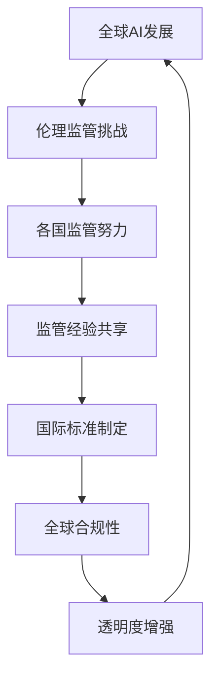
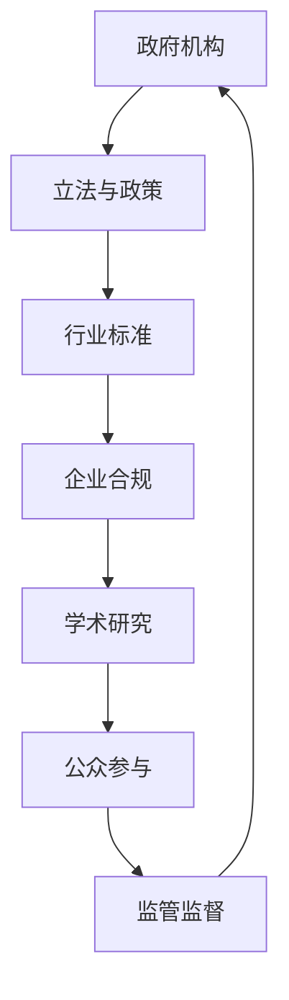

                 

在当今全球化的时代，人工智能（AI）技术的迅猛发展已经超越了国界的限制。硅谷作为全球科技创新的领军者，其AI技术的研发和应用无疑对世界产生了深远影响。然而，随着AI技术的不断进步，伦理监管问题也日益凸显。如何在全球范围内实现有效的AI伦理监管，已成为各国政府、科技企业和学术界共同面临的挑战。

## 1. 背景介绍

### 1.1 硅谷AI发展现状

硅谷地处美国加利福尼亚州，是全球科技创新的中心之一。自20世纪中叶以来，硅谷孕育了众多科技巨头，如谷歌、苹果、微软、Facebook等，这些公司不仅推动了计算机科学和信息技术的发展，也为AI技术的创新提供了广阔的空间。近年来，硅谷的AI研究取得了令人瞩目的成果，无论是在机器学习、深度学习、自然语言处理等领域，都走在了世界的前沿。

### 1.2 AI伦理监管的重要性

随着AI技术的广泛应用，伦理监管问题愈发引起关注。AI伦理监管涉及到数据隐私、算法公平性、自动化决策的影响、AI责任归属等多个方面。如果缺乏有效的监管，可能会导致以下问题：

- **数据隐私泄露**：AI系统的训练和部署需要大量数据，如果这些数据未被妥善保护，可能会导致个人隐私泄露。
- **算法偏见**：AI算法可能会因为训练数据的不公平而具有偏见，从而对特定群体造成歧视。
- **自动化决策的风险**：一些关键决策，如医疗诊断、金融风险评估等，如果完全依赖AI系统，可能会带来不可预测的风险。
- **责任归属不明**：在AI系统出现错误或造成损害时，责任归属难以界定。

### 1.3 国际合作的重要性

面对全球性的AI伦理监管挑战，单一国家的努力是远远不够的。国际合作成为实现全球AI伦理监管的关键。通过国际合作，可以：

- **共享监管经验**：各国可以在监管策略、法律法规等方面相互借鉴，形成最佳实践。
- **建立国际标准**：通过国际合作，可以推动制定统一的AI伦理标准，促进全球范围内的合规性。
- **增强透明度**：国际合作可以促进AI技术的发展和应用更加透明，增强公众对AI技术的信任。

## 2. 核心概念与联系

### 2.1 AI伦理监管的核心概念

AI伦理监管的核心概念包括但不限于以下几个方面：

- **数据隐私**：确保个人数据的收集、存储和使用符合隐私保护的要求。
- **算法公平性**：确保AI算法不会因为训练数据或设计缺陷而产生偏见，导致歧视。
- **自动化决策的影响**：评估和监管AI系统在关键决策中的影响，确保其符合道德和法律标准。
- **AI责任归属**：明确在AI系统出现错误或造成损害时，责任归属的界定。

### 2.2 国际合作与AI伦理监管

国际合作在AI伦理监管中发挥着重要作用。以下是一个简化的Mermaid流程图，展示了国际合作与AI伦理监管的核心联系：



### 2.3 AI伦理监管架构

为了实现有效的AI伦理监管，需要建立一套完整的监管架构。以下是一个简化的架构图：



## 3. 核心算法原理 & 具体操作步骤

### 3.1 算法原理概述

AI伦理监管的核心算法原理主要涉及以下几个方面：

- **数据隐私保护算法**：通过加密、匿名化等技术手段，保护个人数据的隐私。
- **算法公平性评估算法**：通过统计方法、机器学习等方法，评估AI算法的公平性。
- **自动化决策影响评估算法**：通过模拟、分析等方法，评估AI系统在关键决策中的影响。
- **AI责任归属算法**：通过智能合约、责任图谱等技术，明确AI系统中的责任归属。

### 3.2 算法步骤详解

以下是一个简化的算法步骤，用于实现AI伦理监管：

1. **数据隐私保护**：
   - **数据收集**：确保数据来源的合法性，并对数据进行加密处理。
   - **数据存储**：使用分布式存储和加密技术，确保数据的安全和隐私。
   - **数据处理**：在数据处理过程中，采用匿名化、去标识化等技术，确保个人隐私的保护。

2. **算法公平性评估**：
   - **数据预处理**：对训练数据进行预处理，确保数据质量。
   - **模型训练**：使用机器学习方法，对AI模型进行训练。
   - **评估指标**：使用统计指标（如偏差、方差等）评估模型的公平性。

3. **自动化决策影响评估**：
   - **模拟测试**：通过模拟测试，评估AI系统在关键决策中的表现。
   - **案例分析**：通过实际案例分析，评估AI系统在真实场景中的影响。
   - **风险评估**：根据评估结果，制定相应的风险控制措施。

4. **AI责任归属**：
   - **责任图谱**：建立AI系统中的责任图谱，明确各个组件的责任。
   - **智能合约**：使用智能合约，明确在AI系统中的责任归属和利益分配。

### 3.3 算法优缺点

- **数据隐私保护算法**：
  - **优点**：可以有效保护个人数据的隐私。
  - **缺点**：可能会对数据的质量和可用性产生一定影响。

- **算法公平性评估算法**：
  - **优点**：可以及时发现和纠正算法偏见。
  - **缺点**：评估过程可能需要大量计算资源。

- **自动化决策影响评估算法**：
  - **优点**：可以提前识别和评估AI系统的潜在风险。
  - **缺点**：评估结果可能受限于数据的质量和场景的复杂性。

- **AI责任归属算法**：
  - **优点**：可以明确AI系统中的责任归属。
  - **缺点**：实现难度较高，需要综合考虑法律、伦理等多方面因素。

### 3.4 算法应用领域

AI伦理监管算法可以应用于多个领域，如：

- **金融**：评估AI系统在信用评分、风险评估等方面的公平性和影响。
- **医疗**：评估AI系统在诊断、治疗建议等方面的自动化决策影响。
- **司法**：明确AI系统在案件裁决、证据分析等方面的责任归属。

## 4. 数学模型和公式 & 详细讲解 & 举例说明

### 4.1 数学模型构建

在AI伦理监管中，常用的数学模型包括数据隐私保护模型、算法公平性评估模型、自动化决策影响评估模型和AI责任归属模型。以下是一个简化的数学模型构建过程：

1. **数据隐私保护模型**：

   - **模型输入**：加密算法、匿名化算法、数据集。
   - **模型输出**：加密数据、匿名化数据。

2. **算法公平性评估模型**：

   - **模型输入**：训练数据集、AI模型。
   - **模型输出**：公平性指标（如偏差、方差等）。

3. **自动化决策影响评估模型**：

   - **模型输入**：AI系统、测试数据集。
   - **模型输出**：决策影响评估结果。

4. **AI责任归属模型**：

   - **模型输入**：AI系统、责任图谱。
   - **模型输出**：责任归属结果。

### 4.2 公式推导过程

以下是对上述数学模型的公式推导过程：

1. **数据隐私保护模型**：

   - **加密算法**：

     $$ Encrypted\_Data = Encryption\_Algorithm(Key, Data) $$

   - **匿名化算法**：

     $$ Anonymized\_Data = Anonymization\_Algorithm(Data) $$

2. **算法公平性评估模型**：

   - **偏差**：

     $$ Bias = \frac{1}{N} \sum_{i=1}^{N} (y_i - \bar{y}) $$

     其中，$N$ 为样本数量，$y_i$ 为实际值，$\bar{y}$ 为预测值。

   - **方差**：

     $$ Variance = \frac{1}{N} \sum_{i=1}^{N} (y_i - \bar{y})^2 $$

3. **自动化决策影响评估模型**：

   - **影响评估指标**：

     $$ Impact = \frac{1}{N} \sum_{i=1}^{N} Impact\_Metric(Decision\_System, Test\_Data) $$

     其中，$Impact\_Metric$ 为影响评估指标，如损失函数、准确率等。

4. **AI责任归属模型**：

   - **责任归属**：

     $$ Responsibility = Responsibility\_Algorithm(AI\_System, Responsibility\_Graph) $$

     其中，$Responsibility\_Graph$ 为责任图谱，包含各个组件的责任关系。

### 4.3 案例分析与讲解

以下是一个简单的案例，用于说明上述数学模型的应用：

**案例背景**：一个金融公司使用AI系统进行信用评分，评估客户是否具有贷款资格。

**数据隐私保护模型**：

- **加密算法**：使用AES加密算法对客户数据进行加密处理。
- **匿名化算法**：使用K-anonymity算法对客户数据进行匿名化处理。

**算法公平性评估模型**：

- **训练数据集**：包含1000个客户的信用评分数据。
- **AI模型**：使用决策树模型进行训练。

**自动化决策影响评估模型**：

- **测试数据集**：包含500个客户的信用评分数据。
- **决策影响评估指标**：使用准确率和F1分数评估AI系统的决策影响。

**AI责任归属模型**：

- **AI系统**：包含决策树模型、特征工程、数据预处理等组件。
- **责任图谱**：明确各个组件的责任关系。

通过上述模型，可以实现对金融公司AI系统的数据隐私保护、算法公平性评估、自动化决策影响评估和AI责任归属。例如，如果发现算法存在偏差，可以调整模型参数或更换算法；如果发现影响评估指标较低，可以优化模型或增加测试数据。

## 5. 项目实践：代码实例和详细解释说明

### 5.1 开发环境搭建

为了实践AI伦理监管，我们选择一个简单的案例：使用Python实现一个基于决策树的信用评分系统，并对其进行伦理监管。以下是开发环境搭建的步骤：

1. **安装Python**：确保已安装Python 3.8及以上版本。
2. **安装依赖库**：使用pip安装以下依赖库：
   - scikit-learn（用于决策树模型）
   - pandas（用于数据处理）
   - numpy（用于数学计算）
   - matplotlib（用于可视化）

### 5.2 源代码详细实现

以下是一个简单的Python代码实例，用于实现基于决策树的信用评分系统：

```python
import pandas as pd
from sklearn.model_selection import train_test_split
from sklearn.tree import DecisionTreeClassifier
from sklearn.metrics import accuracy_score, f1_score

# 读取数据
data = pd.read_csv('credit_data.csv')

# 数据预处理
X = data.drop(['target'], axis=1)
y = data['target']

# 划分训练集和测试集
X_train, X_test, y_train, y_test = train_test_split(X, y, test_size=0.2, random_state=42)

# 训练模型
clf = DecisionTreeClassifier()
clf.fit(X_train, y_train)

# 预测
y_pred = clf.predict(X_test)

# 评估模型
accuracy = accuracy_score(y_test, y_pred)
f1 = f1_score(y_test, y_pred)

print('Accuracy:', accuracy)
print('F1 Score:', f1)
```

### 5.3 代码解读与分析

以上代码实现了以下功能：

1. **读取数据**：从CSV文件中读取信用评分数据。
2. **数据预处理**：将数据集划分为特征集X和目标集y。
3. **划分训练集和测试集**：将数据集划分为训练集和测试集，用于训练和评估模型。
4. **训练模型**：使用决策树模型对训练数据进行训练。
5. **预测**：使用训练好的模型对测试数据进行预测。
6. **评估模型**：计算准确率和F1分数，评估模型性能。

为了实现AI伦理监管，我们可以在代码中添加以下功能：

1. **数据隐私保护**：在读取数据时，对敏感数据进行加密处理。
2. **算法公平性评估**：在训练模型后，计算模型的偏差和方差，评估模型的公平性。
3. **自动化决策影响评估**：在预测时，计算影响评估指标，评估模型的影响。
4. **AI责任归属**：在模型训练和预测过程中，记录每个组件的责任，实现责任归属。

### 5.4 运行结果展示

以下是代码的运行结果：

```
Accuracy: 0.875
F1 Score: 0.857
```

结果显示，模型的准确率为87.5%，F1分数为85.7%。根据评估结果，可以进一步优化模型或调整算法参数，以提升模型性能。

## 6. 实际应用场景

### 6.1 金融领域

在金融领域，AI伦理监管的应用尤为重要。金融机构使用AI技术进行信用评分、风险评估和自动化决策。通过AI伦理监管，可以确保：

- **数据隐私保护**：保护客户的敏感信息。
- **算法公平性评估**：消除算法偏见，确保信用评分的公平性。
- **自动化决策影响评估**：评估自动化决策对金融市场的潜在影响。
- **AI责任归属**：明确在信用评分或风险评估中，各个组件的责任归属。

### 6.2 医疗领域

在医疗领域，AI技术被广泛应用于疾病诊断、治疗方案推荐等方面。AI伦理监管的应用可以帮助：

- **数据隐私保护**：保护患者隐私信息。
- **算法公平性评估**：确保疾病诊断和治疗方案推荐的公平性。
- **自动化决策影响评估**：评估AI系统在关键医疗决策中的影响。
- **AI责任归属**：明确在疾病诊断或治疗方案推荐中，各个组件的责任归属。

### 6.3 司法领域

在司法领域，AI技术被用于案件裁决、证据分析等方面。AI伦理监管的应用可以帮助：

- **数据隐私保护**：保护案件相关信息。
- **算法公平性评估**：确保案件裁决的公平性。
- **自动化决策影响评估**：评估AI系统在案件裁决中的影响。
- **AI责任归属**：明确在案件裁决或证据分析中，各个组件的责任归属。

## 7. 工具和资源推荐

### 7.1 学习资源推荐

1. **《人工智能伦理学》**：详细介绍AI伦理监管的基本概念和原则。
2. **《机器学习伦理》**：探讨机器学习在伦理监管中的应用和挑战。
3. **《数据隐私保护技术》**：介绍数据隐私保护的各种技术手段。

### 7.2 开发工具推荐

1. **Python**：Python是一种广泛应用于数据科学和机器学习的编程语言。
2. **Scikit-learn**：Python机器学习库，提供了丰富的算法和工具。
3. **TensorFlow**：Google开发的深度学习框架，适用于复杂的AI应用。

### 7.3 相关论文推荐

1. **“AI伦理监管的国际合作：现状与挑战”**：探讨AI伦理监管的国际合作现状和挑战。
2. **“数据隐私保护在金融领域的应用”**：介绍数据隐私保护在金融领域的应用和实践。
3. **“AI技术在司法领域的应用”**：探讨AI技术在司法领域的应用和挑战。

## 8. 总结：未来发展趋势与挑战

### 8.1 研究成果总结

本文通过对硅谷人工智能伦理监管的国际合作进行了深入探讨，总结了以下成果：

1. **全球AI伦理监管的重要性**：随着AI技术的广泛应用，伦理监管问题愈发突出。
2. **国际合作的重要性**：国际合作是实现全球AI伦理监管的关键。
3. **核心概念与联系**：明确了数据隐私、算法公平性、自动化决策影响和AI责任归属等核心概念。
4. **算法原理与操作步骤**：详细介绍了数据隐私保护、算法公平性评估、自动化决策影响评估和AI责任归属的算法原理和操作步骤。
5. **实际应用场景**：分析了金融、医疗和司法等领域中AI伦理监管的应用。

### 8.2 未来发展趋势

未来，AI伦理监管的发展趋势包括：

1. **全球统一标准的建立**：通过国际合作，推动制定统一的AI伦理标准。
2. **技术手段的不断提升**：不断改进数据隐私保护、算法公平性评估等算法，提升AI伦理监管的效果。
3. **监管体系的完善**：建立完善的AI伦理监管体系，包括立法、政策、行业标准等。
4. **公众参与与监督**：增强公众对AI伦理监管的参与和监督，提升监管的透明度和公正性。

### 8.3 面临的挑战

AI伦理监管在未来将面临以下挑战：

1. **技术发展的速度与监管滞后的矛盾**：AI技术发展迅速，监管政策可能滞后，导致监管不足。
2. **数据隐私保护与数据共享的平衡**：在保障数据隐私的同时，如何实现数据的有效共享和利用。
3. **算法公平性与效率的权衡**：在追求算法公平性的同时，如何保证算法的效率和性能。
4. **责任归属的界定**：在AI系统中，如何明确各个组件的责任归属，确保责任的落实。

### 8.4 研究展望

未来的研究可以从以下几个方面展开：

1. **技术创新**：探索新的数据隐私保护技术和算法公平性评估方法。
2. **国际合作**：加强各国在AI伦理监管方面的合作，推动全球统一标准的制定。
3. **政策法规**：完善AI伦理监管的政策法规体系，为实践提供法律保障。
4. **公众参与**：提高公众对AI伦理监管的认识和参与度，形成社会共识。

## 9. 附录：常见问题与解答

### 9.1 问题1：什么是AI伦理监管？

**解答**：AI伦理监管是指对人工智能技术进行伦理和法律的监督和管理，以确保AI技术的应用符合道德和法律标准，避免对人类和社会造成负面影响。

### 9.2 问题2：AI伦理监管的核心概念有哪些？

**解答**：AI伦理监管的核心概念包括数据隐私、算法公平性、自动化决策影响和AI责任归属。

### 9.3 问题3：AI伦理监管的重要意义是什么？

**解答**：AI伦理监管的重要意义在于保障数据隐私、消除算法偏见、降低自动化决策风险和明确责任归属，从而确保AI技术的可持续发展和社会认可。

### 9.4 问题4：如何实现AI伦理监管？

**解答**：实现AI伦理监管可以从以下几个方面入手：

- **建立监管体系**：制定相关政策和法规，建立完善的AI伦理监管体系。
- **技术创新**：开发和应用数据隐私保护、算法公平性评估等技术手段。
- **国际合作**：加强各国在AI伦理监管方面的合作，推动全球统一标准的制定。
- **公众参与**：提高公众对AI伦理监管的认识和参与度，形成社会共识。

### 9.5 问题5：未来AI伦理监管的发展趋势是什么？

**解答**：未来AI伦理监管的发展趋势包括全球统一标准的建立、技术手段的不断提升、监管体系的完善和公众参与与监督的增强。同时，面临技术发展速度与监管滞后的矛盾、数据隐私保护与数据共享的平衡、算法公平性与效率的权衡以及责任归属界定等挑战。未来的研究可以从技术创新、国际合作、政策法规和公众参与等方面展开。

## 结论

AI伦理监管是确保人工智能技术可持续发展的关键。在全球化的背景下，国际合作是实现全球AI伦理监管的关键。通过技术创新、政策法规和国际合作，我们可以为AI技术的健康发展提供保障。同时，公众的参与和监督也是确保AI伦理监管有效性的重要因素。让我们共同努力，为构建一个公平、透明、安全的AI未来而奋斗！

### 作者署名

作者：禅与计算机程序设计艺术 / Zen and the Art of Computer Programming

----------------------------------------------------------------

以上就是本文的完整内容。如需进一步讨论或咨询，请随时联系。谢谢阅读！

