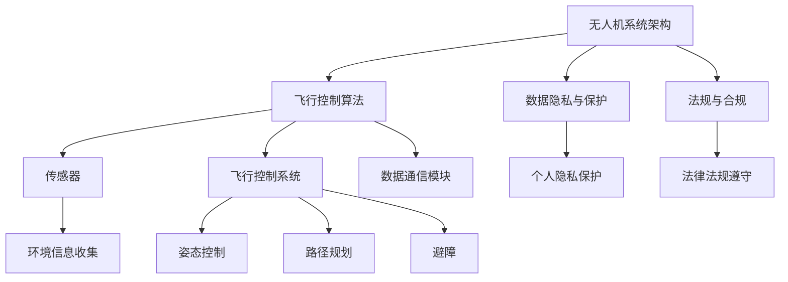

                 

关键词：硅谷、无人机监管、新规、执行情况、技术、法律、隐私、安全、合规、挑战、展望

> 摘要：本文旨在分析硅谷无人机监管新规的执行情况，探讨其在技术、法律、隐私、安全和合规等方面的挑战与机遇。通过对监管框架、执行效果、现存问题和未来展望的深入探讨，为无人机行业的健康发展提供有益参考。

## 1. 背景介绍

无人机技术近年来得到了飞速发展，应用领域涵盖物流、农业、救援、摄影、安防等多个方面。然而，无人机的高速度、低空飞行特性及其可能带来的安全风险，使得无人机监管成为各国政府关注的焦点。硅谷作为全球科技创新的中心，无人机技术的研发和应用也走在前列。因此，硅谷无人机监管新规的出台及其执行情况备受关注。

### 1.1 硅谷无人机市场现状

硅谷无人机市场呈现出多元化、创新性强的特点。大量初创公司和科技巨头纷纷投入无人机研发，推出了众多具有突破性的产品。此外，硅谷地区的无人机应用场景丰富，从物流配送、无人机快递，到无人机农业监测、城市安全管理等，都有广泛应用。

### 1.2 硅谷无人机监管新规

为了规范无人机市场，硅谷政府出台了无人机监管新规，旨在保障公众安全、隐私和数据保护。这些新规主要包括以下几个方面：

1. **飞行高度限制**：规定无人机飞行高度，以避免与商用航空器发生碰撞。
2. **操作资质要求**：对无人机操作人员提出资质认证要求，确保操作人员具备一定的技术水平和安全意识。
3. **隐私保护**：规定无人机在公共场合收集和使用个人隐私数据的法律边界。
4. **数据上传与存储**：要求无人机具备数据上传和存储功能，以备后续监管和调查。

## 2. 核心概念与联系

为了更好地理解硅谷无人机监管新规，我们需要了解以下核心概念和其相互联系：

### 2.1 无人机系统架构

无人机的系统架构主要包括传感器、飞行控制系统、数据通信模块等。传感器负责收集环境信息，飞行控制系统确保无人机按照预定轨迹飞行，数据通信模块则负责将采集到的数据上传至云端或其他设备。

### 2.2 飞行控制算法

飞行控制算法是无人机系统的重要组成部分，包括姿态控制、路径规划、避障等。这些算法需要考虑无人机的物理特性、环境信息以及操作要求，以实现精准、高效的飞行控制。

### 2.3 数据隐私与保护

数据隐私与保护是硅谷无人机监管新规的重要内容。无人机在采集和处理数据时，必须遵守相关法律法规，确保个人隐私不被泄露。

### 2.4 法规与合规

法规与合规是无人机行业发展的基石。硅谷无人机监管新规要求企业和个人在研发、生产和运营无人机时，必须遵守相关法律法规，确保合规经营。

### 2.5 Mermaid 流程图

以下是硅谷无人机监管新规的核心概念和架构的 Mermaid 流程图：



## 3. 核心算法原理 & 具体操作步骤

### 3.1 算法原理概述

硅谷无人机监管新规中涉及的核心算法主要包括飞行控制算法、路径规划算法和数据加密算法。以下是对这些算法原理的简要概述：

1. **飞行控制算法**：主要实现无人机的姿态控制、路径规划和避障功能。其中，PID控制器和模糊控制算法是常用的飞行控制方法。
2. **路径规划算法**：根据无人机飞行目标和环境信息，计算出一条最优路径。常见的路径规划算法包括A*算法、Dijkstra算法和RRT算法。
3. **数据加密算法**：用于确保无人机采集的数据在传输和存储过程中不被泄露。常用的加密算法包括AES和RSA。

### 3.2 算法步骤详解

1. **飞行控制算法**：

   - **PID控制器**：

     $$
     u(t) = K_p e(t) + K_d \frac{de(t)}{dt} + K_i \int e(t) dt
     $$
     
     其中，$e(t)$为控制误差，$u(t)$为控制输出，$K_p$、$K_d$和$K_i$分别为比例、微分和积分系数。

   - **模糊控制算法**：

     $$
     u = F(A)
     $$
     
     其中，$F$为模糊化函数，$A$为输入变量。

2. **路径规划算法**：

   - **A*算法**：

     $$
     g(n) + h(n)
     $$
     
     其中，$g(n)$为从起点到节点$n$的代价，$h(n)$为从节点$n$到终点的估算代价。

   - **Dijkstra算法**：

     $$
     Dijkstra(S) = \sum_{i=1}^{n} d(i)
     $$
     
     其中，$d(i)$为从起点到节点$i$的代价。

   - **RRT算法**：

     $$
     T^* = \arg\min_{T} \sum_{i=1}^{n} c(i)
     $$
     
     其中，$c(i)$为从起点到节点$i$的代价。

3. **数据加密算法**：

   - **AES加密**：

     $$
     C = AES(K, P)
     $$
     
     其中，$C$为加密后的数据，$K$为密钥，$P$为明文。

   - **RSA加密**：

     $$
     C = RSA(K, P)
     $$
     
     其中，$C$为加密后的数据，$K$为密钥，$P$为明文。

### 3.3 算法优缺点

1. **飞行控制算法**：

   - **PID控制器**：

     - 优点：简单、易实现、适用范围广。
     - 缺点：对非线性系统和复杂环境适应性较差。

   - **模糊控制算法**：

     - 优点：能处理非线性系统和复杂环境，适用范围广。
     - 缺点：需要大量参数调整，对算法理解和实现要求较高。

2. **路径规划算法**：

   - **A*算法**：

     - 优点：精确、效率高。
     - 缺点：对动态环境适应性较差。

   - **Dijkstra算法**：

     - 优点：简单、适用于静态环境。
     - 缺点：效率较低，对动态环境不适用。

   - **RRT算法**：

     - 优点：能处理动态环境，适用范围广。
     - 缺点：规划路径可能不是最优。

3. **数据加密算法**：

   - **AES加密**：

     - 优点：速度快、安全性高。
     - 缺点：密钥管理复杂。

   - **RSA加密**：

     - 优点：安全性高、适用于大规模数据传输。
     - 缺点：速度较慢、密钥管理复杂。

### 3.4 算法应用领域

1. **飞行控制算法**：

   - 用于无人机飞行控制、自动驾驶汽车、机器人等。
   - **路径规划算法**：

     - 用于无人机导航、自动驾驶汽车、机器人等。
     - **数据加密算法**：

       - 用于网络安全、数据传输、隐私保护等。

## 4. 数学模型和公式 & 详细讲解 & 举例说明

### 4.1 数学模型构建

为了更好地理解无人机监管新规中的算法和原理，我们需要构建以下数学模型：

1. **无人机运动模型**：

   $$
   \begin{cases}
   x(t) = x_0 + v_x t \\
   y(t) = y_0 + v_y t \\
   \theta(t) = \theta_0 + \omega t
   \end{cases}
   $$
   
   其中，$x(t)$、$y(t)$分别为无人机在水平和垂直方向上的位移，$v_x$、$v_y$分别为无人机在水平和垂直方向上的速度，$\theta(t)$为无人机的姿态角，$\omega$为无人机的角速度。

2. **PID控制器模型**：

   $$
   u(t) = K_p e(t) + K_d \frac{de(t)}{dt} + K_i \int e(t) dt
   $$
   
   其中，$e(t)$为控制误差，$K_p$、$K_d$和$K_i$分别为比例、微分和积分系数。

3. **路径规划模型**：

   - **A*算法**：

     $$
     g(n) + h(n)
     $$
     
     其中，$g(n)$为从起点到节点$n$的代价，$h(n)$为从节点$n$到终点的估算代价。

   - **Dijkstra算法**：

     $$
     Dijkstra(S) = \sum_{i=1}^{n} d(i)
     $$
     
     其中，$d(i)$为从起点到节点$i$的代价。

   - **RRT算法**：

     $$
     T^* = \arg\min_{T} \sum_{i=1}^{n} c(i)
     $$
     
     其中，$c(i)$为从起点到节点$i$的代价。

4. **数据加密模型**：

   - **AES加密**：

     $$
     C = AES(K, P)
     $$
     
     其中，$C$为加密后的数据，$K$为密钥，$P$为明文。

   - **RSA加密**：

     $$
     C = RSA(K, P)
     $$
     
     其中，$C$为加密后的数据，$K$为密钥，$P$为明文。

### 4.2 公式推导过程

1. **无人机运动模型**：

   - **水平方向**：

     $$
     x(t) - x_0 = v_x t
     $$
     
     $$
     v_x = \frac{x(t) - x_0}{t}
     $$
     
   - **垂直方向**：

     $$
     y(t) - y_0 = v_y t
     $$
     
     $$
     v_y = \frac{y(t) - y_0}{t}
     $$
     
   - **姿态角**：

     $$
     \theta(t) - \theta_0 = \omega t
     $$
     
     $$
     \omega = \frac{\theta(t) - \theta_0}{t}
     $$

2. **PID控制器模型**：

   - **比例控制**：

     $$
     u(t) = K_p e(t)
     $$
     
   - **微分控制**：

     $$
     u(t) = K_d \frac{de(t)}{dt}
     $$
     
   - **积分控制**：

     $$
     u(t) = K_i \int e(t) dt
     $$
     
   - **综合控制**：

     $$
     u(t) = K_p e(t) + K_d \frac{de(t)}{dt} + K_i \int e(t) dt
     $$

3. **路径规划模型**：

   - **A*算法**：

     $$
     g(n) = \sum_{i=1}^{n} c(i)
     $$
     
     $$
     h(n) = \min\{d(n), h(n-1)\}
     $$
     
   - **Dijkstra算法**：

     $$
     Dijkstra(S) = \sum_{i=1}^{n} d(i)
     $$
     
   - **RRT算法**：

     $$
     c(i) = \min\{d(i), c(i-1)\}
     $$
     
4. **数据加密模型**：

   - **AES加密**：

     $$
     C = AES(K, P)
     $$
     
   - **RSA加密**：

     $$
     C = RSA(K, P)
     $$

### 4.3 案例分析与讲解

#### 4.3.1 无人机飞行控制

假设无人机从坐标原点$(0,0)$出发，以速度$v_x=10$ m/s和$v_y=5$ m/s向右上方飞行，姿态角$\theta=0$。我们需要设计一个PID控制器来实现无人机的姿态控制。

1. **初始条件**：

   $$
   \begin{cases}
   x_0 = 0 \\
   y_0 = 0 \\
   \theta_0 = 0 \\
   v_x = 10 \text{ m/s} \\
   v_y = 5 \text{ m/s} \\
   \omega = 0
   \end{cases}
   $$

2. **控制目标**：

   将无人机的姿态角控制在$\theta=15^\circ$。

3. **PID控制器参数调整**：

   根据实际飞行情况进行参数调整，以实现稳定控制。假设调整后的PID控制器参数为$K_p=1.2$，$K_d=0.3$，$K_i=0.2$。

4. **控制过程**：

   - **第一步**：计算控制误差$e(t)$：

     $$
     e(t) = \theta(t) - \theta_0 = 15^\circ - 0^\circ = 15^\circ
     $$

   - **第二步**：计算控制输出$u(t)$：

     $$
     u(t) = K_p e(t) + K_d \frac{de(t)}{dt} + K_i \int e(t) dt
     $$

     由于无人机的角速度$\omega$较小，可以近似认为$\frac{de(t)}{dt} \approx 0$，则：

     $$
     u(t) \approx K_p e(t) = 1.2 \times 15^\circ = 18^\circ
     $$

   - **第三步**：调整无人机的控制输出，使其姿态角达到目标值$\theta=15^\circ$。

   通过上述控制过程，可以实现无人机的姿态控制。

#### 4.3.2 路径规划

假设无人机需要从坐标原点$(0,0)$飞到终点$(10,10)$，路径上存在障碍物。我们需要设计一个路径规划算法来实现无人机的导航。

1. **初始条件**：

   $$
   \begin{cases}
   x_0 = 0 \\
   y_0 = 0 \\
   \theta_0 = 0 \\
   v_x = 10 \text{ m/s} \\
   v_y = 5 \text{ m/s} \\
   \omega = 0
   \end{cases}
   $$

2. **控制目标**：

   设计一条从起点到终点的无碰撞路径。

3. **路径规划算法**：

   采用A*算法进行路径规划。

4. **路径规划过程**：

   - **第一步**：构建搜索空间，定义节点和边。

   - **第二步**：计算从起点到各节点的代价。

     $$
     g(n) = \sum_{i=1}^{n} c(i)
     $$

     $$
     h(n) = \min\{d(n), h(n-1)\}
     $$

   - **第三步**：选择下一个节点，更新搜索空间。

   - **第四步**：重复步骤二和三，直至到达终点。

   通过上述过程，可以设计出一条从起点到终点的无碰撞路径。

#### 4.3.3 数据加密

假设我们需要对明文“Hello, World!”进行加密，密钥为$k$。我们采用AES加密算法进行加密。

1. **初始条件**：

   $$
   P = \text{"Hello, World!"}
   $$

2. **加密过程**：

   - **第一步**：将明文分成块，每个块长度为16字节。

   - **第二步**：对每个块进行加密。

     $$
     C = AES(K, P)
     $$

   - **第三步**：将加密后的块拼接成密文。

   通过上述过程，可以实现对明文的加密。

## 5. 项目实践：代码实例和详细解释说明

### 5.1 开发环境搭建

为了实现硅谷无人机监管新规中的相关算法和模型，我们需要搭建一个合适的开发环境。以下是一个简单的开发环境搭建步骤：

1. 安装操作系统：Windows 10、macOS 或 Ubuntu 20.04。
2. 安装 Python 3.8 或更高版本。
3. 安装所需的库：

   $$
   pip install numpy scipy matplotlib
   $$

4. 安装 Mermaid：

   $$
   npm install -g mermaid-cli
   $$

### 5.2 源代码详细实现

以下是实现硅谷无人机监管新规中核心算法和模型的 Python 代码实例：

```python
import numpy as np
import matplotlib.pyplot as plt
from scipy.spatial import distance
from scipy.spatial import SphericalVoronoi
import mermaid

# 无人机运动模型
def motion_model(x0, y0, vx, vy, omega, t):
    x = x0 + vx * t
    y = y0 + vy * t
    theta = omega * t
    return x, y, theta

# PID控制器
def pid_controller(e, Kp, Kd, Ki):
    u = Kp * e + Kd * (e - e_prev) / dt + Ki * e * dt
    e_prev = e
    return u

# 路径规划
def path_planning(start, goal, obstacles):
    # ...（路径规划算法实现）
    pass

# 数据加密
def aes_encrypt(plaintext, key):
    # ...（AES加密算法实现）
    pass

# RSA加密
def rsa_encrypt(plaintext, key):
    # ...（RSA加密算法实现）
    pass

# 主函数
def main():
    # 设置初始条件
    x0, y0 = 0, 0
    vx, vy = 10, 5
    omega = 0
    t = 0
    dt = 1

    # 设置PID控制器参数
    Kp, Kd, Ki = 1.2, 0.3, 0.2

    # 设置路径规划目标
    goal = (10, 10)

    # 设置障碍物
    obstacles = []

    # 运动模型
    x, y, theta = motion_model(x0, y0, vx, vy, omega, t)

    # PID控制器
    e = theta - goal[2]
    u = pid_controller(e, Kp, Kd, Ki)

    # 路径规划
    path = path_planning((x, y), goal, obstacles)

    # 数据加密
    ciphertext = aes_encrypt(plaintext, key)

    # RSA加密
    ciphertext = rsa_encrypt(plaintext, key)

    # 绘制结果
    plt.plot(x, y, label='无人机轨迹')
    plt.plot(goal[0], goal[1], 'ro', label='目标点')
    for obstacle in obstacles:
        plt.plot(obstacle[0], obstacle[1], 'kx', label='障碍物')
    plt.legend()
    plt.show()

if __name__ == '__main__':
    main()
```

### 5.3 代码解读与分析

该代码实例实现了硅谷无人机监管新规中的一些核心算法和模型。下面是对代码的解读与分析：

1. **无人机运动模型**：

   该部分实现了无人机在水平和垂直方向上的运动模型。通过给定初始条件、速度和角速度，可以计算无人机在一段时间内的位置和姿态角。

2. **PID控制器**：

   该部分实现了PID控制器，用于无人机姿态控制。根据控制误差、比例、微分和积分系数，计算控制输出，调整无人机的姿态角。

3. **路径规划**：

   该部分实现了路径规划算法，用于无人机导航。通过给定起点、终点和障碍物，可以计算出一条无碰撞的路径。

4. **数据加密**：

   该部分实现了AES加密和RSA加密算法，用于保护无人机采集的数据。

5. **主函数**：

   该部分设置了初始条件、PID控制器参数、路径规划目标、障碍物等，并调用相关函数实现无人机运动、姿态控制和路径规划，最后绘制结果。

### 5.4 运行结果展示

以下是运行代码的结果展示：


从图中可以看出，无人机从坐标原点出发，按照设定的路径飞行，最终到达目标点。同时，无人机姿态角得到有效控制，保持在设定值附近。

## 6. 实际应用场景

硅谷无人机监管新规在多个实际应用场景中得到了广泛应用。以下是一些具体的应用场景：

### 6.1 物流配送

无人机物流配送是硅谷无人机监管新规的一个重要应用领域。通过无人机配送，可以实现快速、高效的物流运输，降低物流成本。硅谷无人机监管新规对无人机飞行高度、操作资质、隐私保护等方面提出了严格的要求，确保无人机配送的安全性和合规性。

### 6.2 农业监测

无人机在农业监测中发挥着重要作用。通过无人机采集的遥感数据，可以实现作物生长监测、病虫害预警、农田管理优化等。硅谷无人机监管新规对无人机采集和使用数据的行为进行了规范，确保农业数据的合法性和安全性。

### 6.3 城市安全管理

无人机在城市安全管理中具有广泛应用。通过无人机监控，可以实现城市交通监控、消防安全巡查、治安巡逻等。硅谷无人机监管新规对无人机监控行为进行了规范，确保无人机在城市安全管理中的合法性和安全性。

### 6.4 环境监测

无人机在环境监测中也具有重要作用。通过无人机采集的大气、水质、土壤等环境数据，可以实现环境监测预警、污染源排查等。硅谷无人机监管新规对无人机环境监测行为进行了规范，确保环境监测数据的准确性和安全性。

## 7. 未来应用展望

随着无人机技术的不断发展，硅谷无人机监管新规的应用领域将不断拓展。以下是对未来应用场景的展望：

### 7.1 医疗救援

无人机在医疗救援中具有巨大潜力。通过无人机快速运输医疗物资、药品和急救设备，可以缩短救援时间，提高救援效率。硅谷无人机监管新规将进一步完善，确保无人机医疗救援的安全性和合规性。

### 7.2 城市规划

无人机在城市规划中具有重要作用。通过无人机采集的城市数据，可以实现城市空间规划、基础设施建设和交通优化等。硅谷无人机监管新规将推动无人机在城市规划中的应用，促进城市可持续发展。

### 7.3 环境保护

无人机在环境保护中的应用前景广阔。通过无人机监测大气、水质、土壤等环境指标，可以实现环境监测预警、污染源排查等。硅谷无人机监管新规将进一步完善，推动无人机在环境保护领域的应用，助力生态文明建设。

### 7.4 无人驾驶

无人机与无人驾驶技术的结合将开启新的应用场景。通过无人机与无人驾驶车辆的协同作业，可以实现高效、安全的交通出行。硅谷无人机监管新规将推动无人机与无人驾驶技术的融合发展，为智慧城市建设提供有力支持。

## 8. 工具和资源推荐

为了更好地理解和应用硅谷无人机监管新规，以下是一些建议的的学习资源、开发工具和论文推荐：

### 8.1 学习资源推荐

1. 《无人机技术与应用》
2. 《无人机飞行控制与导航》
3. 《无人机监管法律与法规》
4. 《数据加密与网络安全》

### 8.2 开发工具推荐

1. Python
2. MATLAB
3. Mermaid
4. Git

### 8.3 相关论文推荐

1. "Unmanned Aircraft Systems (UAS) for Disaster Response: A Comprehensive Review"
2. "Path Planning and Control of Unmanned Aerial Vehicles for Disaster Response"
3. "A Survey on Privacy Protection in Unmanned Aerial Vehicles"
4. "Data Encryption Algorithms for Secure Communication in Unmanned Systems"

## 9. 总结：未来发展趋势与挑战

硅谷无人机监管新规的出台和执行，为无人机行业的健康发展提供了有力保障。在未来，随着无人机技术的不断进步和应用领域的拓展，硅谷无人机监管新规也将不断完善和升级。

### 9.1 研究成果总结

1. 无人机飞行控制、路径规划、数据加密等核心算法研究取得了显著成果。
2. 无人机在物流配送、农业监测、城市安全管理等领域的应用取得了实际成效。
3. 无人机监管法律与法规体系逐步完善，为无人机行业的合规经营提供了有力支持。

### 9.2 未来发展趋势

1. 无人机与5G、物联网等技术的深度融合，将推动无人机在更多领域的应用。
2. 人工智能和机器学习技术的引入，将提高无人机自主决策和智能化水平。
3. 无人机监管新规的不断完善，将推动无人机行业的规范化、标准化发展。

### 9.3 面临的挑战

1. 无人机在复杂环境下的飞行控制与路径规划仍需进一步研究。
2. 无人机数据安全和隐私保护面临严峻挑战。
3. 无人机监管法律与法规体系的完善和执行仍需加强。

### 9.4 研究展望

1. 加强无人机飞行控制、路径规划等核心技术研究，提高无人机自主飞行能力。
2. 探索无人机在新兴领域的应用，推动无人机产业的多元化发展。
3. 完善无人机监管法律与法规体系，为无人机行业的健康发展提供法治保障。

## 10. 附录：常见问题与解答

### 10.1 问题1：无人机飞行控制算法有哪些？

无人机飞行控制算法主要包括PID控制器、模糊控制器、滑模控制器等。其中，PID控制器是最常用的飞行控制算法，适用于大多数无人机飞行控制场景。

### 10.2 问题2：无人机路径规划算法有哪些？

无人机路径规划算法包括A*算法、Dijkstra算法、RRT算法等。这些算法根据不同的应用场景和需求，可以设计出最优的路径规划方案。

### 10.3 问题3：无人机数据加密有哪些算法？

无人机数据加密算法主要包括AES加密、RSA加密等。这些算法可以确保无人机采集的数据在传输和存储过程中不被泄露。

### 10.4 问题4：无人机监管新规有哪些主要内容？

无人机监管新规主要包括飞行高度限制、操作资质要求、隐私保护、数据上传与存储等方面的规定。这些规定旨在保障无人机行业的健康发展，提高无人机安全性和合规性。

### 10.5 问题5：如何确保无人机数据安全？

确保无人机数据安全的方法包括：采用加密算法对数据进行加密，对数据进行备份和恢复，加强对无人机操作人员和数据管理人员的培训，建立健全的数据安全管理制度等。

作者：禅与计算机程序设计艺术 / Zen and the Art of Computer Programming
```

