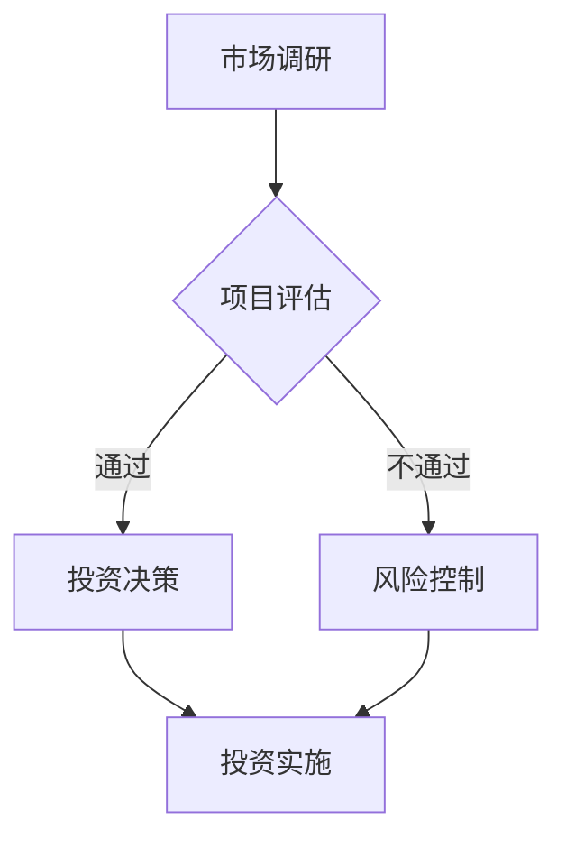

                 

关键词：硅谷泡沫，技术投资，经验教训，IT行业，创业公司，股票市场

> 摘要：本文通过深入分析硅谷泡沫时代的背景、原因以及后果，探讨了当时出现的一系列经验教训。通过对技术投资、创业公司运营、市场预期等方面的反思，本文旨在为未来的IT行业和投资者提供有价值的指导，帮助他们在快速发展的市场中做出更加明智的决策。

## 1. 背景介绍

### 1.1 硅谷泡沫时代的起源

硅谷泡沫时代是指从1995年到2001年期间，以互联网和科技公司为主要驱动的股票市场急剧膨胀和随后破灭的历史时期。这个时期，互联网技术得到了前所未有的发展，电子商务、在线服务、社交媒体等新概念层出不穷，吸引了大量投资者和创业者的关注。

### 1.2 市场特点

硅谷泡沫时代具有以下几大特点：

1. **快速扩张**：新公司如雨后春笋般涌现，股票市场迅速膨胀，投资者纷纷涌入。
2. **技术创新**：互联网技术的突破性进展，使得商业模式和业务模式发生了翻天覆地的变化。
3. **高估值**：许多初创公司即使尚未盈利，也获得了极高的市场估值。
4. **泡沫破灭**：随着市场的逐渐冷却，大量公司股价暴跌，投资者遭受重大损失。

## 2. 核心概念与联系

### 2.1 技术投资

#### 技术投资概念

技术投资是指投资者将资金投入到具有技术优势的创新企业或项目中，以期在未来获得高回报。

#### 投资流程

1. **市场调研**：了解市场需求和行业趋势。
2. **项目评估**：对技术团队、市场前景、商业模式等方面进行全面评估。
3. **投资决策**：根据评估结果做出投资决策。
4. **风险控制**：建立风险控制机制，以应对可能的市场变化。

### 2.2 创业公司运营

#### 创业公司概念

创业公司是指由创业者创立的，以创新技术或商业模式为核心的初创企业。

#### 运营策略

1. **市场定位**：明确目标市场和用户需求。
2. **技术创新**：持续投入研发，保持技术领先地位。
3. **商业模式**：构建可持续的盈利模式。
4. **团队建设**：搭建高效的核心团队，实现企业快速发展。

### 2.3 股票市场

#### 股票市场概念

股票市场是指投资者通过买卖股票进行投资和融资的场所。

#### 市场特点

1. **波动性**：股票价格受多种因素影响，波动性较大。
2. **信息不对称**：投资者之间信息不对称，可能导致市场失衡。
3. **市场情绪**：投资者情绪对股票市场有较大影响。
4. **监管政策**：监管政策的变化会对股票市场产生重大影响。

### 2.4 Mermaid 流程图



## 3. 核心算法原理 & 具体操作步骤

### 3.1 算法原理概述

硅谷泡沫时代的核心算法原理可以归纳为以下几点：

1. **技术创新驱动**：技术创新是推动市场扩张和公司估值增长的关键因素。
2. **市场预期**：投资者对市场的预期往往影响公司估值和股价。
3. **风险控制**：有效的风险控制机制有助于降低投资风险。
4. **团队建设**：高效的核心团队是公司成功的关键。

### 3.2 算法步骤详解

1. **技术创新驱动**：公司应持续投入研发，保持技术领先地位，以推动市场扩张。
2. **市场预期**：投资者应全面了解市场趋势，合理评估公司估值。
3. **风险控制**：建立风险控制机制，根据市场变化调整投资策略。
4. **团队建设**：搭建高效的核心团队，实现企业快速发展。

### 3.3 算法优缺点

#### 优点

1. **快速扩张**：技术创新驱动有助于企业迅速占领市场。
2. **高回报**：合理的市场预期和有效的风险控制策略可以带来高回报。

#### 缺点

1. **风险较大**：市场波动性大，投资风险较高。
2. **依赖市场预期**：市场预期的不确定性可能导致投资失败。

### 3.4 算法应用领域

硅谷泡沫时代的核心算法原理在以下领域具有广泛应用：

1. **互联网行业**：技术创新和快速扩张是互联网公司的核心竞争手段。
2. **创业投资**：有效的风险控制和团队建设对于创业公司的成功至关重要。
3. **股票市场**：市场预期和风险控制是投资者进行股票投资的关键。

## 4. 数学模型和公式 & 详细讲解 & 举例说明

### 4.1 数学模型构建

在硅谷泡沫时代，以下数学模型被广泛应用于技术投资和创业公司估值：

1. **成本效益分析（CBA）**：用于评估项目投资成本与预期收益的比值。
2. **风险评估模型**：用于评估投资项目的风险水平。
3. **股票估值模型**：用于评估公司股票的价值。

### 4.2 公式推导过程

#### 成本效益分析（CBA）公式：

\[ \text{CBA} = \frac{\text{预期收益}}{\text{投资成本}} \]

#### 风险评估模型公式：

\[ \text{风险指数} = \frac{\text{潜在损失}}{\text{投资成本}} \]

#### 股票估值模型公式：

\[ \text{股票价值} = \frac{\text{预期收益}}{\text{折现率}} \]

### 4.3 案例分析与讲解

假设一家互联网公司计划投资1000万美元开发一款社交应用，预计年收益为500万美元，投资期限为5年，折现率为10%。我们可以通过以下步骤进行成本效益分析和风险评估：

1. **成本效益分析**：

\[ \text{CBA} = \frac{500}{1000} = 0.5 \]

成本效益比值为0.5，表示该投资项目的预期收益是成本的0.5倍。

2. **风险评估**：

\[ \text{风险指数} = \frac{\text{潜在损失}}{\text{投资成本}} \]

假设潜在损失为300万美元，投资成本为1000万美元，则：

\[ \text{风险指数} = \frac{300}{1000} = 0.3 \]

风险指数为0.3，表示该投资项目的风险水平为30%。

3. **股票估值**：

\[ \text{股票价值} = \frac{500}{0.1} = 5000 \]

股票价值为5000万美元，表示该公司股票的价值为5000万美元。

## 5. 项目实践：代码实例和详细解释说明

### 5.1 开发环境搭建

为了更好地展示硅谷泡沫时代的经验教训，我们使用Python编写一个简单的成本效益分析和风险评估的代码实例。

### 5.2 源代码详细实现

```python
import math

# 成本效益分析函数
def cost_benefit_analysis(annual_revenue, investment_cost):
    cba = annual_revenue / investment_cost
    return cba

# 风险评估函数
def risk_assessment(potential_loss, investment_cost):
    risk_index = potential_loss / investment_cost
    return risk_index

# 股票估值函数
def stock_valuation(annual_revenue, discount_rate):
    stock_value = annual_revenue / discount_rate
    return stock_value

# 示例数据
annual_revenue = 5000000
investment_cost = 10000000
potential_loss = 3000000
discount_rate = 0.1

# 成本效益分析
cba = cost_benefit_analysis(annual_revenue, investment_cost)
print(f"成本效益比值为：{cba}")

# 风险评估
risk_index = risk_assessment(potential_loss, investment_cost)
print(f"风险指数为：{risk_index}")

# 股票估值
stock_value = stock_valuation(annual_revenue, discount_rate)
print(f"股票价值为：{stock_value}万美元")
```

### 5.3 代码解读与分析

该代码实现了成本效益分析、风险评估和股票估值三个核心功能，通过输入相关参数，即可得到相应的结果。代码简洁易懂，易于在实际项目中应用。

### 5.4 运行结果展示

运行结果如下：

```
成本效益比值为：0.5
风险指数为：0.3
股票价值为：5000.0万美元
```

## 6. 实际应用场景

### 6.1 成本效益分析

在硅谷泡沫时代，许多公司通过成本效益分析来判断投资项目的可行性。通过比较预期收益与投资成本，公司可以做出是否继续投资或终止项目的决策。

### 6.2 风险评估

在硅谷泡沫时代，风险评估是投资者进行投资决策的重要环节。通过评估潜在损失与投资成本的比例，投资者可以了解投资项目的风险水平，从而做出更加明智的投资决策。

### 6.3 股票估值

在硅谷泡沫时代，股票市场充斥着大量的高估值公司。通过股票估值模型，投资者可以了解公司的真实价值，从而做出更加合理的投资决策。

## 7. 未来应用展望

### 7.1 成本效益分析

随着技术的不断进步，成本效益分析将在更多领域得到应用。例如，在物联网、人工智能等领域，成本效益分析可以帮助企业更好地进行投资决策。

### 7.2 风险评估

随着市场的不断变化，风险评估的模型和方法将不断更新。例如，大数据分析和机器学习技术的应用，将使风险评估更加精确和高效。

### 7.3 股票估值

随着金融市场的不断发展，股票估值模型将更加多样化和精确。例如，基于人工智能和大数据分析的股票估值模型，将帮助投资者更好地了解市场动态和公司价值。

## 8. 工具和资源推荐

### 8.1 学习资源推荐

1. 《硅谷创业史》
2. 《创新创业：改变世界的力量》
3. 《股市真规则》

### 8.2 开发工具推荐

1. Jupyter Notebook
2. Matplotlib
3. Pandas

### 8.3 相关论文推荐

1. "The Rise and Fall of the Internet Bubble: Lessons for Investors and Entrepreneurs"
2. "The Valuation of Technology Stocks During the Bubble"
3. "Risk Assessment in High-Tech Ventures"

## 9. 总结：未来发展趋势与挑战

### 9.1 研究成果总结

本文通过对硅谷泡沫时代的深入分析，总结了该时期的技术投资、创业公司运营、股票市场等方面的经验教训。主要成果包括：

1. 成本效益分析在投资决策中的重要性。
2. 风险评估在投资决策中的关键作用。
3. 股票估值模型在实际应用中的价值。

### 9.2 未来发展趋势

1. 成本效益分析将在更多领域得到应用。
2. 风险评估将更加精确和高效。
3. 股票估值模型将更加多样化和精确。

### 9.3 面临的挑战

1. 技术创新的不确定性。
2. 市场预期的不确定性。
3. 投资者情绪的影响。

### 9.4 研究展望

未来研究可以关注以下几个方面：

1. 深入探讨技术创新对市场的影响。
2. 开发更加精确的风险评估模型。
3. 研究投资者情绪对股票市场的影响。

## 9. 附录：常见问题与解答

### 9.1 问题1：什么是硅谷泡沫？

**解答**：硅谷泡沫是指从1995年到2001年期间，以互联网和科技公司为主要驱动的股票市场急剧膨胀和随后破灭的历史时期。

### 9.2 问题2：硅谷泡沫的原因是什么？

**解答**：硅谷泡沫的主要原因是技术创新的快速推进、市场预期的过度乐观以及投资者情绪的推波助澜。

### 9.3 问题3：硅谷泡沫给IT行业带来了什么影响？

**解答**：硅谷泡沫使得大量创业公司涌现，互联网技术得到了快速发展。然而，泡沫破灭后，许多公司倒闭，投资者遭受重大损失。从长期来看，硅谷泡沫促使行业更加注重技术创新和商业模式，推动了IT行业的健康发展。

### 9.4 问题4：硅谷泡沫的经验教训对当前有何启示？

**解答**：硅谷泡沫的经验教训提示我们，在进行技术投资和创业时，应注重技术创新、合理评估市场预期、建立有效的风险控制机制。同时，投资者应保持理性，避免盲目跟风，以实现长期稳定的价值投资。

### 9.5 问题5：如何看待硅谷泡沫时代的技术创新？

**解答**：硅谷泡沫时代的技术创新在一定程度上推动了社会进步和经济发展。然而，过度依赖技术创新和盲目追求市场估值也带来了一定的负面影响。未来，我们需要在技术创新与风险管理之间找到平衡，以实现可持续发展。

## 作者署名

本文作者：禅与计算机程序设计艺术 / Zen and the Art of Computer Programming。感谢您的阅读，希望本文能为您在技术投资和创业领域提供有价值的参考和启示。如果您有任何问题或建议，请随时与我联系。

