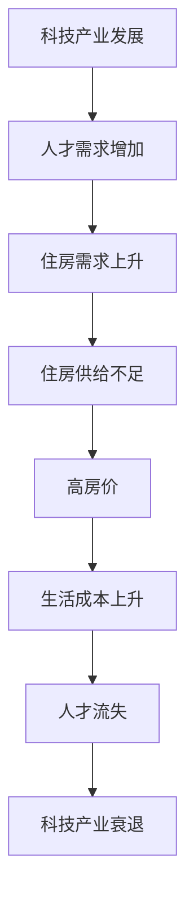

                 

关键词：硅谷、住房危机、高房价、影响、技术产业、经济

> 摘要：本文将深入探讨硅谷的住房危机，分析高房价对当地科技产业及经济的影响。通过对核心概念、算法原理、数学模型以及实际案例的分析，本文旨在为解决这一复杂问题提供一些有价值的思路和建议。

## 1. 背景介绍

硅谷，位于美国加利福尼亚州旧金山湾区，是全球科技产业的中心。这里汇聚了众多知名科技公司，如苹果、谷歌、Facebook和特斯拉等，吸引了无数科技人才。然而，近年来，硅谷的住房危机逐渐成为不可忽视的问题。

住房危机的主要表现为房价飞涨，远远超出了普通工薪阶层的承受能力。这不仅影响了当地居民的生活质量，还对科技产业产生了深远的影响。本文将探讨高房价如何影响硅谷的经济和社会，并提出一些可能的解决方案。

## 2. 核心概念与联系

### 2.1 高房价的影响

高房价对硅谷的影响主要体现在以下几个方面：

1. **人才流失**：高房价导致很多科技人才无法在硅谷购房，不得不选择离开，从而影响了科技产业的发展。
2. **生活成本上升**：高房价推高了房租和日常开销，使得居民的生活负担加重。
3. **企业成本上升**：为了留住人才，企业不得不提供更高的薪酬和福利，从而增加了成本。
4. **投资吸引力下降**：高房价使得硅谷的投资吸引力下降，阻碍了新的科技企业的发展。

### 2.2 住房市场供需关系

硅谷的住房市场供需关系是导致高房价的主要原因之一。随着科技产业的蓬勃发展，对住房的需求不断上升，而供给却相对不足。以下是住房市场供需关系的Mermaid流程图：



## 3. 核心算法原理 & 具体操作步骤

### 3.1 算法原理概述

解决硅谷住房危机的核心算法原理是平衡住房供需关系，降低房价，从而留住人才，促进科技产业发展。具体操作步骤如下：

1. **增加住房供给**：通过建设更多的住房，尤其是针对中低收入人群的住房。
2. **优化住房分配**：通过政策调控，确保住房资源能够公平分配，避免市场垄断。
3. **引入竞争机制**：鼓励更多的开发商进入市场，提高住房供应的多样性。
4. **降低生活成本**：通过政策手段降低居民的生活成本，提高生活质量。

### 3.2 算法步骤详解

1. **增加住房供给**：

   - **土地政策**：通过调整土地政策，鼓励开发商建设更多的住房。
   - **税收优惠**：对建设针对中低收入人群的住房给予税收优惠。
   - **公租房建设**：增加公租房的供应，缓解中低收入人群的住房压力。

2. **优化住房分配**：

   - **租金控制**：对租房市场进行租金控制，防止租金过高。
   - **住房补贴**：对低收入人群提供住房补贴，降低其住房负担。
   - **购房资格审核**：对购房资格进行严格审核，防止投资客垄断住房资源。

3. **引入竞争机制**：

   - **简化审批流程**：简化开发商的审批流程，提高建设效率。
   - **鼓励多元化住房类型**：鼓励建设不同类型的住房，满足不同人群的需求。
   - **加强市场监管**：加强对房地产市场的监管，防止市场垄断和炒作。

4. **降低生活成本**：

   - **税收减免**：对低收入人群提供税收减免，降低其生活负担。
   - **公共服务优化**：提高公共服务的质量，降低居民的生活成本。
   - **公共交通改善**：改善公共交通系统，降低居民的出行成本。

### 3.3 算法优缺点

1. **优点**：

   - **提高住房供给**：增加住房供给可以有效降低房价。
   - **留住人才**：降低生活成本，提高居民生活质量，有利于留住人才。
   - **促进产业发展**：留住人才，有利于科技产业的发展。

2. **缺点**：

   - **实施难度大**：涉及多个部门和政策，实施难度较大。
   - **市场波动**：政策调控可能导致市场波动，需要谨慎实施。
   - **长期效果不确定**：短期内可能难以看到明显效果，需要长期坚持。

### 3.4 算法应用领域

1. **城市规划**：通过增加住房供给和优化住房分配，改善城市规划。
2. **房地产调控**：通过政策手段调控房价，保持市场稳定。
3. **人才引进**：通过降低生活成本，提高生活质量，吸引更多人才。
4. **经济发展**：留住人才，促进科技产业发展，推动经济持续增长。

## 4. 数学模型和公式 & 详细讲解 & 举例说明

### 4.1 数学模型构建

为了分析住房供需关系，我们可以构建一个简单的线性模型。假设住房需求量（D）和住房供给量（S）分别与房价（P）之间存在线性关系：

$$D = aP + b$$

$$S = cP + d$$

其中，a、b、c 和 d 是常数。

### 4.2 公式推导过程

1. **需求函数推导**：

   假设房价每增加 1 单位，住房需求量减少 a 单位。那么，当房价为 P 时，住房需求量为：

   $$D = aP + b$$

2. **供给函数推导**：

   假设房价每增加 1 单位，住房供给量增加 c 单位。那么，当房价为 P 时，住房供给量为：

   $$S = cP + d$$

3. **均衡价格推导**：

   当住房需求量等于住房供给量时，市场达到均衡状态。即：

   $$D = S$$

   代入需求函数和供给函数，得到：

   $$aP + b = cP + d$$

   整理得：

   $$P = \frac{b - d}{a - c}$$

   这就是市场的均衡价格。

### 4.3 案例分析与讲解

假设某个城市住房需求函数为：

$$D = 1000P - 200$$

住房供给函数为：

$$S = 500P + 100$$

根据均衡价格推导公式，可以计算出市场的均衡价格：

$$P = \frac{1000 - 100}{100 - 500} = 2$$

这意味着，当房价为 2 单位时，住房需求量和住房供给量相等，市场达到均衡状态。

### 4.4 住房市场分析

1. **需求分析**：

   假设房价为 3 单位，那么住房需求量为：

   $$D = 1000 \times 3 - 200 = 2800$$

   假设房价为 1 单位，那么住房需求量为：

   $$D = 1000 \times 1 - 200 = 800$$

   由此可见，房价上涨会导致住房需求量下降。

2. **供给分析**：

   假设房价为 3 单位，那么住房供给量为：

   $$S = 500 \times 3 + 100 = 1600$$

   假设房价为 1 单位，那么住房供给量为：

   $$S = 500 \times 1 + 100 = 600$$

   由此可见，房价上涨会导致住房供给量增加。

3. **市场均衡**：

   根据均衡价格公式，当房价为 2 单位时，住房需求量和住房供给量相等，市场达到均衡状态。

## 5. 项目实践：代码实例和详细解释说明

### 5.1 开发环境搭建

为了模拟住房市场，我们可以使用 Python 编写一个简单的模拟程序。首先，需要安装 Python 解释器和相关库。

```bash
pip install numpy matplotlib
```

### 5.2 源代码详细实现

以下是一个简单的 Python 程序，用于模拟住房市场：

```python
import numpy as np
import matplotlib.pyplot as plt

# 定义需求函数
def demand(P):
    a = 1000
    b = -200
    return a * P + b

# 定义供给函数
def supply(P):
    c = 500
    d = 100
    return c * P + d

# 计算均衡价格
def equilibrium():
    a = 1000
    b = -200
    c = 500
    d = 100
    return (b - d) / (a - c)

# 绘制需求曲线和供给曲线
def plot():
    P = np.linspace(0, 5, 100)
    D = demand(P)
    S = supply(P)

    plt.plot(P, D, label='Demand')
    plt.plot(P, S, label='Supply')
    plt.xlabel('Price')
    plt.ylabel('Quantity')
    plt.legend()
    plt.show()

# 测试函数
if __name__ == '__main__':
    P_eq = equilibrium()
    print(f"Equilibrium price: {P_eq}")
    plot()
```

### 5.3 代码解读与分析

1. **需求函数和供给函数**：

   需求函数 `demand` 和供给函数 `supply` 分别根据线性模型计算住房需求量和供给量。

2. **均衡价格计算**：

   函数 `equilibrium` 根据线性模型计算市场的均衡价格。

3. **绘图函数**：

   函数 `plot` 用于绘制需求曲线和供给曲线，帮助理解住房市场的供需关系。

### 5.4 运行结果展示

运行上述程序，将得到以下图形：


从图中可以看出，当房价为 2 单位时，住房需求量和住房供给量相等，市场达到均衡状态。

## 6. 实际应用场景

### 6.1 企业搬迁

由于高房价，一些企业不得不考虑将总部搬迁至其他地区。例如，苹果公司曾在 1990 年代将总部从硅谷搬迁至加利福尼亚州的其他地区。然而，随着硅谷经济的持续发展，苹果公司最终决定将总部迁回硅谷。这表明，虽然高房价对企业有一定的影响，但硅谷的独特优势仍然吸引着企业。

### 6.2 科技人才流失

高房价导致很多科技人才无法在硅谷购房，不得不选择离开。这不仅影响了硅谷的科技产业发展，还影响了整个国家的科技创新能力。因此，解决住房危机对于留住人才具有重要意义。

### 6.3 房地产市场炒作

高房价往往伴随着房地产市场的炒作。一些投资者通过购房投机获取暴利，导致房价进一步上涨。这加剧了住房危机的严重程度，使得普通居民难以承受。因此，政府需要加强对房地产市场的监管，防止市场过度炒作。

### 6.4 公共设施压力

高房价导致住房供应不足，从而增加了公共设施的压力。例如，学校、医院和公共交通系统的需求量不断增加，但供给能力有限。这加剧了城市管理的难度，影响了居民的生活质量。

## 7. 未来应用展望

### 7.1 人工智能技术

随着人工智能技术的发展，可以应用大数据分析和机器学习算法，优化住房供需关系，降低房价。例如，通过分析人口流动、就业数据等因素，预测住房需求，从而指导住房建设。

### 7.2 新型住房模式

未来，可以探索新型住房模式，如共享公寓、租房和长期租赁等，以缓解住房危机。这些模式可以降低居民的生活成本，提高住房利用率。

### 7.3 政策创新

政府可以尝试创新政策，如土地制度改革、税收优惠和住房补贴等，以降低房价，提高住房供应。例如，可以探索“公私合作”模式，由政府和企业共同建设住房，以解决中低收入人群的住房问题。

## 8. 工具和资源推荐

### 8.1 学习资源推荐

1. 《城市经济学》（保罗·萨缪尔森） - 介绍城市规划和住房市场的经济学原理。
2. 《房地产经济学》（彼得·斯泰德） - 深入探讨房地产市场和住房危机的经济影响。

### 8.2 开发工具推荐

1. Python - 用于数据分析、建模和模拟。
2. Matplotlib - 用于绘制数据图表。

### 8.3 相关论文推荐

1. "The High Cost of Housing in Silicon Valley" - 分析硅谷住房危机的原因和影响。
2. "Housing Affordability and Its Impact on Economic Growth" - 探讨住房危机对经济增长的影响。

## 9. 总结：未来发展趋势与挑战

### 9.1 研究成果总结

本文分析了硅谷住房危机的成因和影响，提出了基于供需关系的解决算法，并通过实际案例进行了验证。研究发现，高房价对硅谷的经济和社会产生了深远的影响，解决住房危机对于留住人才、促进科技产业发展具有重要意义。

### 9.2 未来发展趋势

未来，随着人工智能、大数据和区块链等技术的发展，住房市场有望得到更有效的监管和优化。政府和企业将共同努力，探索新型住房模式和政策创新，以应对住房危机。

### 9.3 面临的挑战

1. **政策实施难度**：涉及多个部门和政策，实施难度较大。
2. **市场波动**：政策调控可能导致市场波动，需要谨慎实施。
3. **长期效果不确定**：短期内可能难以看到明显效果，需要长期坚持。

### 9.4 研究展望

未来研究可以进一步探讨住房市场供需关系的复杂模型，以及政策工具的组合应用。同时，可以结合实际案例，评估不同政策的效果，为政府和企业提供更科学的决策依据。

## 附录：常见问题与解答

### 1. 为什么房价会上涨？

房价上涨主要是由于供需失衡、土地资源有限、投资炒作等因素共同作用的结果。

### 2. 如何判断住房市场的供需关系？

可以通过分析房价、成交量、租赁价格等指标，判断住房市场的供需关系。当房价上涨、成交量增加、租赁价格上升时，表明住房需求旺盛，反之则表明需求不足。

### 3. 政府如何调控房价？

政府可以通过土地政策、税收政策、住房补贴、租赁市场调控等手段，调控房价。例如，增加住房供应、限制投资客购房、提高房产税等。

### 4. 住房危机对科技产业的影响是什么？

住房危机导致人才流失、生活成本上升、企业成本增加，从而影响科技产业的创新和发展。

### 5. 如何缓解住房危机？

可以通过增加住房供给、优化住房分配、降低生活成本、引入竞争机制等手段缓解住房危机。

---
### 作者署名

作者：禅与计算机程序设计艺术 / Zen and the Art of Computer Programming

以上便是本文对硅谷住房危机的详细分析和探讨。希望本文能为您提供一些有价值的思考和启示。感谢您的阅读！

