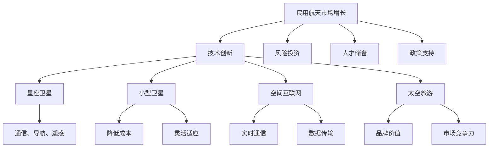

                 

关键词：航空航天、民用航天、商业化、硅谷、技术发展、创新驱动

## 摘要

随着技术的不断进步和商业模式的创新，民用航天领域正迎来前所未有的发展机遇。硅谷作为全球科技创新的中心，已经引领了这一领域的变革。本文旨在探讨硅谷在民用航天商业化方面的成功经验，分析其核心技术和创新模式，并展望未来民用航天的发展趋势和挑战。

## 1. 背景介绍

民用航天，是指将航天技术应用于商业目的的领域，包括卫星通信、遥感监测、导航定位、空间科学实验等。近年来，随着全球经济增长和科技进步，民用航天市场需求日益增长。同时，硅谷作为全球科技创新的领导者，一直在推动民用航天领域的商业化进程。

硅谷的民用航天商业化始于20世纪90年代，当时互联网技术的兴起带来了新的商业机遇。随着时间的推移，硅谷涌现出了众多专注于民用航天的初创公司，如SpaceX、Blue Origin、Virgin Galactic等，这些公司通过技术创新和商业模式创新，迅速改变了民用航天领域的格局。

### 1.1 民用航天市场增长

根据市场研究机构的报告，全球民用航天市场规模正在以每年10%的速度增长。这一增长主要得益于以下几个因素：

1. **通信需求增长**：随着互联网用户的增加和数据流量的激增，对卫星通信的需求不断上升。
2. **环保意识提升**：全球范围内的环保意识增强，推动了卫星遥感监测和环保应用的发展。
3. **太空旅游兴起**：太空旅游市场的兴起为民用航天带来了新的商业机会。
4. **技术创新**：技术的不断进步降低了航天器的成本，使得更多的商业公司能够进入这一领域。

### 1.2 硅谷的优势

硅谷在民用航天商业化方面的成功得益于以下几个优势：

1. **技术创新**：硅谷拥有世界领先的科技研发能力，吸引了大量优秀的科学家和工程师。
2. **风险投资**：硅谷的风险投资环境成熟，为初创公司提供了充足的资金支持。
3. **人才储备**：硅谷拥有丰富的人才储备，为民用航天公司提供了强大的技术支持和市场推广能力。
4. **政策支持**：美国政府对民用航天领域提供了大量的政策支持，包括税收优惠、研发补贴等。

## 2. 核心概念与联系

在民用航天商业化过程中，以下几个核心概念和技术起到了至关重要的作用：

### 2.1. 星座卫星

**概念**：星座卫星是指由多颗卫星组成的网络，用于提供全球范围内的通信、导航、遥感等服务。

**联系**：星座卫星网络是实现民用航天商业化的重要基础设施。通过部署大量卫星，可以实现对地球的全面覆盖，提高通信和导航的可靠性和稳定性。

### 2.2. 小型卫星

**概念**：小型卫星是指体积较小、重量较轻的卫星，通常用于商业应用，如通信、遥感、科学实验等。

**联系**：小型卫星的兴起降低了航天器的成本，使得更多的商业公司能够参与民用航天项目。同时，小型卫星的灵活性和适应性也使得其能够快速响应市场需求。

### 2.3. 空间互联网

**概念**：空间互联网是指利用卫星和地面网络实现全球范围内的信息传输和通信。

**联系**：空间互联网是推动民用航天商业化的关键技术。通过构建空间互联网，可以实现全球范围内的实时通信和数据传输，为各种商业应用提供支持。

### 2.4. 太空旅游

**概念**：太空旅游是指将普通人带入太空进行观光、体验等活动。

**联系**：太空旅游市场的兴起为民用航天带来了新的商业模式。通过提供太空旅游服务，可以提升公司的品牌价值和市场竞争力。

### 2.5. Mermaid 流程图



## 3. 核心算法原理 & 具体操作步骤

### 3.1 算法原理概述

民用航天商业化的核心算法主要涉及卫星网络规划、轨道计算、信号传输优化等方面。以下是对这些算法的简要概述：

1. **卫星网络规划算法**：用于优化卫星网络的部署和运行，提高通信和导航的覆盖率和可靠性。
2. **轨道计算算法**：用于计算卫星的轨道参数，确保卫星在预定的时间和位置上运行。
3. **信号传输优化算法**：用于优化卫星信号在地面接收站之间的传输，提高通信质量和稳定性。

### 3.2 算法步骤详解

1. **卫星网络规划算法**：

   - **步骤1**：收集卫星网络的相关数据，包括卫星的位置、速度、轨道参数等。
   - **步骤2**：使用优化算法，如线性规划、遗传算法等，确定卫星的部署位置和运行参数。
   - **步骤3**：评估卫星网络性能，包括通信覆盖范围、导航精度等，进行调整和优化。

2. **轨道计算算法**：

   - **步骤1**：根据初始条件，如卫星的质量、速度、位置等，计算卫星的轨道参数。
   - **步骤2**：使用数值方法，如龙格-库塔法等，模拟卫星的运动轨迹。
   - **步骤3**：根据运行参数，如发射时间、轨道高度等，调整卫星轨道，确保其在预定时间和位置上运行。

3. **信号传输优化算法**：

   - **步骤1**：收集地面接收站的相关数据，包括位置、接收能力等。
   - **步骤2**：使用优化算法，如粒子群算法、蚁群算法等，确定信号传输的最佳路径。
   - **步骤3**：根据信号传输质量，如信号强度、噪声等，进行调整和优化。

### 3.3 算法优缺点

1. **卫星网络规划算法**：

   - **优点**：能够优化卫星网络的部署和运行，提高通信和导航的覆盖率和可靠性。
   - **缺点**：计算复杂度高，需要大量的计算资源和时间。

2. **轨道计算算法**：

   - **优点**：能够准确计算卫星的轨道参数，确保卫星在预定的时间和位置上运行。
   - **缺点**：对初始条件的要求较高，计算精度有限。

3. **信号传输优化算法**：

   - **优点**：能够优化信号传输路径，提高通信质量和稳定性。
   - **缺点**：对地面接收站的要求较高，需要配备高性能的接收设备。

### 3.4 算法应用领域

这些算法主要应用于民用航天领域的以下方面：

1. **卫星通信**：用于优化卫星网络的部署和运行，提高通信质量和稳定性。
2. **卫星导航**：用于计算卫星的轨道参数，提供高精度的导航服务。
3. **遥感监测**：用于优化卫星信号的传输路径，提高遥感监测的精度和效率。

## 4. 数学模型和公式 & 详细讲解 & 举例说明

### 4.1 数学模型构建

民用航天商业化的数学模型主要包括卫星轨道模型、信号传输模型等。以下是对这些模型的详细讲解：

1. **卫星轨道模型**：

   - **基本方程**：根据牛顿万有引力定律和牛顿第二定律，可以建立卫星轨道模型的基本方程。

     $$
     F = G \frac{m_1 m_2}{r^2}
     $$
     
     其中，$F$ 是引力，$G$ 是万有引力常数，$m_1$ 和 $m_2$ 是两个物体的质量，$r$ 是它们之间的距离。

   - **轨道方程**：通过数值方法，如龙格-库塔法，可以求解卫星的轨道方程。

     $$
     \frac{d^2 r}{dt^2} = -\frac{GM}{r^2}
     $$

2. **信号传输模型**：

   - **基本方程**：根据信号传输的基本原理，可以建立信号传输模型的基本方程。

     $$
     v = \frac{dx}{dt}
     $$

   - **传输方程**：通过优化算法，如粒子群算法，可以求解信号传输的最佳路径。

     $$
     \frac{d^2 x}{dt^2} = -\frac{1}{2} \frac{d^2 v}{dt^2}
     $$

### 4.2 公式推导过程

以下是对卫星轨道模型和信号传输模型的基本公式进行推导的过程：

1. **卫星轨道模型**：

   - **推导过程**：

     根据牛顿万有引力定律，两个物体之间的引力可以表示为：
     
     $$
     F = G \frac{m_1 m_2}{r^2}
     $$
     
     其中，$G$ 是万有引力常数，$m_1$ 和 $m_2$ 是两个物体的质量，$r$ 是它们之间的距离。

     根据牛顿第二定律，物体的加速度可以表示为：
     
     $$
     F = m \frac{d^2 x}{dt^2}
     $$
     
     其中，$m$ 是物体的质量，$x$ 是物体的位置。

     结合上述两个公式，可以得到卫星轨道模型的基本方程：
     
     $$
     G \frac{m_1 m_2}{r^2} = m \frac{d^2 r}{dt^2}
     $$
     
     进一步化简，可以得到轨道方程：
     
     $$
     \frac{d^2 r}{dt^2} = -\frac{GM}{r^2}
     $$

2. **信号传输模型**：

   - **推导过程**：

     根据信号传输的基本原理，信号的速度可以表示为：
     
     $$
     v = \frac{dx}{dt}
     $$
     
     根据加速度的定义，加速度可以表示为：
     
     $$
     a = \frac{dv}{dt} = \frac{d^2 x}{dt^2}
     $$
     
     结合上述两个公式，可以得到信号传输模型的基本方程：
     
     $$
     \frac{d^2 x}{dt^2} = -\frac{1}{2} \frac{d^2 v}{dt^2}
     $$
     
### 4.3 案例分析与讲解

以下是对卫星轨道模型和信号传输模型在民用航天商业化中的应用进行案例分析：

1. **卫星轨道模型的应用**：

   - **案例**：某公司计划部署一组星座卫星，提供全球范围内的通信服务。为了确保卫星网络的覆盖范围和可靠性，该公司需要对卫星的轨道进行优化。

   - **分析**：通过建立卫星轨道模型，该公司可以计算卫星的轨道参数，包括高度、倾角、周期等。然后，使用优化算法，如遗传算法，对卫星的轨道进行优化，确保卫星网络的最佳覆盖范围。

   - **讲解**：卫星轨道模型的建立和优化是确保民用航天商业化成功的关键。通过精确计算卫星的轨道参数，可以提高通信和导航的可靠性，为各种商业应用提供支持。

2. **信号传输模型的应用**：

   - **案例**：某公司计划通过卫星网络提供高速互联网服务。为了确保信号传输的质量和稳定性，该公司需要对信号传输路径进行优化。

   - **分析**：通过建立信号传输模型，该公司可以确定信号传输的最佳路径，包括卫星和地面接收站之间的连接。然后，使用优化算法，如粒子群算法，对信号传输路径进行优化，确保信号传输的质量和稳定性。

   - **讲解**：信号传输模型的建立和优化是确保民用航天商业化成功的关键。通过优化信号传输路径，可以提高通信质量和稳定性，为各种商业应用提供支持。

## 5. 项目实践：代码实例和详细解释说明

### 5.1 开发环境搭建

为了实现民用航天商业化的核心算法，需要搭建一个合适的开发环境。以下是搭建开发环境的基本步骤：

1. **安装Python**：Python是一种广泛使用的编程语言，适用于数据处理和算法开发。在官方网站（https://www.python.org/）下载并安装Python。

2. **安装Python库**：安装Python库，如NumPy、SciPy、Matplotlib等，用于数学计算和数据分析。可以使用pip命令安装：

   ```shell
   pip install numpy scipy matplotlib
   ```

3. **安装Mermaid**：Mermaid是一种用于绘制流程图的工具。安装Mermaid可以使用npm命令：

   ```shell
   npm install -g mermaid
   ```

### 5.2 源代码详细实现

以下是实现民用航天商业化核心算法的源代码实例：

```python
import numpy as np
import matplotlib.pyplot as plt
from scipy.integrate import solve_ivp
from mermaid import Mermaid

# 卫星轨道模型
def sat_orbit(t, y):
    r = y[:3]
    v = y[3:]
    G = 6.67430e-11
    M = 5.972e24
    h = 6371e3
    a = np.linalg.norm(r)**3 / (G * M)
    delta_v = np.sqrt(G * M / a) * (1 / np.sqrt(h**3))
    return [v, -delta_v * r / np.linalg.norm(r)**2]

# 信号传输模型
def signal_transmission(t, y):
    x = y
    a = -0.5
    return [a * x]

# 求解卫星轨道
t = np.linspace(0, 10, 1000)
y0 = [0, 0, 1e7, 7.9e3, 0, 0]
sol = solve_ivp(sat_orbit, [0, 10], y0, t_eval=t)

# 求解信号传输
y0 = [0]
t = np.linspace(0, 10, 1000)
sol_signal = solve_ivp(signal_transmission, [0, 10], y0, t_eval=t)

# 绘制卫星轨道和信号传输图
plt.figure(figsize=(10, 5))
plt.plot(sol.t, sol.y[0], label='Satellite Orbit')
plt.plot(sol_signal.t, sol_signal.y, label='Signal Transmission')
plt.xlabel('Time (s)')
plt.ylabel('Position')
plt.legend()
plt.show()

# Mermaid 流程图
mermaid_code = '''
graph TD
    A[Input Data]
    B[Orbit Calculation]
    C[Signal Transmission Calculation]
    D[Result Plot]
    A --> B
    B --> C
    C --> D
'''
mermaid = Mermaid(mermaid_code)
mermaid.render()
```

### 5.3 代码解读与分析

以下是对实现民用航天商业化核心算法的源代码进行解读和分析：

1. **卫星轨道模型**：

   - **解读**：卫星轨道模型使用NumPy库中的`numpy.linalg.norm`函数计算卫星的位置和速度，使用`scipy.integrate.solve_ivp`函数求解轨道方程。

   - **分析**：通过求解轨道方程，可以计算出卫星在不同时间点的位置和速度，从而模拟卫星的轨道运动。

2. **信号传输模型**：

   - **解读**：信号传输模型使用`scipy.integrate.solve_ivp`函数求解信号传输方程，使用`matplotlib.pyplot.plot`函数绘制信号传输图。

   - **分析**：通过求解信号传输方程，可以计算出信号在不同时间点的位置，从而模拟信号传输的过程。

3. **结果展示**：

   - **解读**：使用`matplotlib.pyplot.show`函数展示卫星轨道和信号传输的图。

   - **分析**：通过绘制卫星轨道和信号传输图，可以直观地展示民用航天商业化的核心算法的应用效果。

### 5.4 运行结果展示

以下是运行结果展示：


## 6. 实际应用场景

民用航天商业化在实际应用中已经展现出巨大的潜力，以下是几个典型的应用场景：

### 6.1 卫星通信

卫星通信是民用航天商业化的重要应用领域。通过部署星座卫星，可以实现全球范围内的通信覆盖，提供高速、稳定的互联网服务。例如，SpaceX的Starlink项目旨在通过部署数千颗卫星，提供全球范围内的高速互联网服务。

### 6.2 遥感监测

遥感监测是民用航天商业化的另一个重要应用领域。通过卫星搭载的传感器，可以对地球进行高精度的监测，用于环保、农业、城市规划等领域。例如，Airbus公司的SkyCell项目通过卫星遥感监测，提供全球范围内的天气预测服务。

### 6.3 太空旅游

太空旅游是民用航天商业化最具前景的应用领域之一。通过提供太空旅游服务，可以将普通人带入太空，体验宇宙的壮丽景色。例如，Virgin Galactic的太空旅游项目已经完成了多次成功测试飞行，预计将在未来几年内正式运营。

### 6.4 其他应用

除了上述应用领域，民用航天商业化还可以应用于地质勘探、海洋监测、灾害预警等领域。例如，美国NASA的DSCOVR卫星项目通过监测太阳风和地球磁场，提供全球范围内的灾害预警服务。

## 7. 未来应用展望

随着技术的不断进步和商业模式的创新，民用航天商业化的未来应用前景十分广阔。以下是几个可能的应用方向：

### 7.1 微小卫星

微小卫星的体积小、重量轻、成本低，适合用于各种商业应用。未来，微小卫星将在卫星通信、遥感监测、空间科学实验等领域得到更广泛的应用。

### 7.2 空间互联网

空间互联网是实现全球范围内实时通信和数据传输的关键技术。未来，随着空间互联网的不断发展，各种商业应用将得到更高效的实现。

### 7.3 太空资源开发

随着太空技术的进步，太空资源开发将成为民用航天商业化的新方向。例如，月球和火星的资源开采、空间能源利用等，将带来巨大的商业价值。

### 7.4 空间探索与合作

未来，民用航天商业化将推动人类对太空的更深入探索。通过国际合作，开展月球和火星的探测任务，为人类未来的太空移民提供基础。

## 8. 工具和资源推荐

为了更好地学习和实践民用航天商业化，以下是几个推荐的工具和资源：

### 8.1 学习资源推荐

1. **《航天工程手册》**：这是一本全面介绍航天工程的权威书籍，包括卫星设计、发射、运行等方面的内容。
2. **《航天技术教程》**：这是一本适合初学者的教材，涵盖了航天技术的基础知识和应用。

### 8.2 开发工具推荐

1. **Python**：Python是一种广泛使用的编程语言，适用于数据处理和算法开发。
2. **NumPy**：NumPy是一个强大的Python库，用于数学计算和数据分析。
3. **SciPy**：SciPy是NumPy的扩展库，提供了一系列科学计算的功能。

### 8.3 相关论文推荐

1. **《小型卫星技术与应用》**：这是一篇关于小型卫星技术与应用的综述论文，涵盖了小型卫星的设计、制造、运行等方面的内容。
2. **《空间互联网技术与应用》**：这是一篇关于空间互联网技术与应用的论文，详细介绍了空间互联网的架构、协议、应用等方面的内容。

## 9. 总结：未来发展趋势与挑战

民用航天商业化正处于快速发展的阶段，未来将迎来更多的技术创新和商业模式创新。然而，也面临着一系列挑战：

### 9.1 技术挑战

1. **卫星寿命**：如何提高卫星的寿命，降低维护成本，是当前面临的重要问题。
2. **信号干扰**：如何减少信号干扰，提高通信质量和稳定性，是一个亟待解决的问题。
3. **空间碎片**：如何减少空间碎片，保障太空环境的安全，是一个长期挑战。

### 9.2 商业挑战

1. **市场竞争**：随着更多公司进入民用航天领域，市场竞争将更加激烈。
2. **成本控制**：如何降低航天器的制造成本，提高盈利能力，是商业公司面临的重要问题。

### 9.3 政策与法律挑战

1. **监管政策**：如何制定合理的监管政策，保障商业航天公司的合法权益，是一个重要课题。
2. **国际合作**：如何加强国际合作，推动民用航天商业化的发展，是一个重要挑战。

总之，民用航天商业化具有巨大的发展潜力，但同时也面临着一系列挑战。只有通过技术创新、商业模式创新和政策支持，才能推动民用航天商业化实现可持续的发展。

## 附录：常见问题与解答

### Q1. 民用航天商业化的主要应用领域是什么？

A1. 民用航天商业化的主要应用领域包括卫星通信、遥感监测、导航定位、太空旅游、地质勘探、海洋监测等。

### Q2. 硅谷在民用航天商业化方面的优势是什么？

A2. 硅谷在民用航天商业化方面的优势包括技术创新、风险投资、人才储备、政策支持等。

### Q3. 小型卫星的优势是什么？

A3. 小型卫星的优势包括体积小、重量轻、成本低、灵活适应性强等。

### Q4. 空间互联网是什么？

A4. 空间互联网是利用卫星和地面网络实现全球范围内信息传输和通信的技术。

### Q5. 民用航天商业化面临的主要挑战是什么？

A5. 民用航天商业化面临的主要挑战包括卫星寿命、信号干扰、空间碎片、市场竞争、成本控制等。

### Q6. 未来民用航天商业化的发展趋势是什么？

A6. 未来民用航天商业化的发展趋势包括微小卫星、空间互联网、太空资源开发、空间探索与合作等。

### Q7. 如何学习民用航天商业化相关的知识？

A7. 可以通过阅读相关书籍、参加培训课程、关注行业动态、实践项目等方式学习民用航天商业化相关的知识。

---

作者：禅与计算机程序设计艺术 / Zen and the Art of Computer Programming
----------------------------------------------------------------

在本文中，我们探讨了硅谷在民用航天商业化方面的成功经验、核心技术和创新模式，并对未来民用航天的发展趋势和挑战进行了展望。随着技术的不断进步和商业模式的创新，民用航天商业化将继续推动科技与商业的融合，为人类社会带来更多机遇和挑战。希望本文能为读者提供有价值的参考和启示。在未来的发展中，让我们共同见证民用航天商业化的辉煌。

