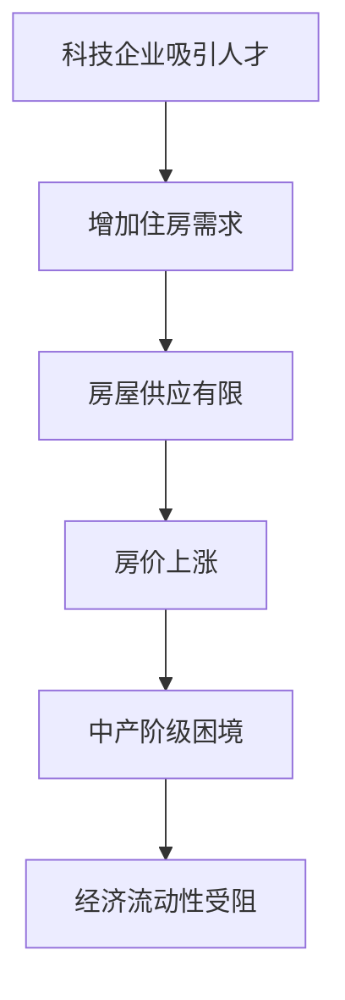

                 

关键词：硅谷、高房价、中产阶级、经济影响、住房危机、社会分层

> 摘要：本文将深入探讨硅谷高房价对中产阶级生活质量和经济流动性的影响，分析这一现象背后的原因及其可能带来的长远社会效应。

## 1. 背景介绍

硅谷，作为全球科技创新的引擎，吸引了大量技术人才和投资。然而，随着科技公司和初创企业的蓬勃发展，硅谷的高房价问题也日益凸显。高房价不仅影响到了硅谷本地居民的生活质量，还可能引发中产阶级的流失，从而对整个地区的经济和社会结构产生深远影响。

### 1.1 硅谷的高房价现状

硅谷地区的房价水平在全球范围内名列前茅。以旧金山为例，其房屋中位价已超过百万美元。这样的房价水平使得许多中产阶级家庭难以承担。据相关数据统计，在硅谷，拥有住房的中产阶级家庭比例在过去十年中大幅下降。

### 1.2 中产阶级的困境

中产阶级家庭在硅谷的高房价下面临诸多困境。首先，住房成本占据了家庭收入的大部分，使得家庭可支配收入减少。其次，高房价使得中产阶级家庭难以在硅谷稳定生活，从而影响了他们的职业发展和生活质量。

## 2. 核心概念与联系

为了更好地理解硅谷高房价对中产阶级的影响，我们需要了解以下几个核心概念：

- **住房市场供需关系**：硅谷的房价上涨主要源于供需失衡。一方面，科技公司和初创企业吸引了大量高收入人群，增加了对住房的需求；另一方面，房屋供应量有限，导致房价上涨。
- **经济流动性**：经济流动性指的是资本、资源和人才的自由流动。硅谷的高房价可能会阻碍中产阶级的经济流动性，使得他们难以在硅谷建立稳定的职业生涯。
- **社会分层**：高房价可能导致社会分层加剧，使得中产阶级和低收入人群的生活质量差距扩大。

### 2.1 住房市场供需关系

以下是一个简单的 Mermaid 流程图，描述了硅谷住房市场的供需关系：



## 3. 核心算法原理 & 具体操作步骤

### 3.1 算法原理概述

为了分析硅谷高房价对中产阶级的影响，我们可以采用经济学的供需分析模型。这一模型主要基于以下几个假设：

- 住房需求主要由人口增长、收入水平和利率决定。
- 住房供应则受到土地供应、建筑许可和现有房屋库存的限制。

### 3.2 算法步骤详解

#### 3.2.1 收集数据

首先，我们需要收集以下数据：

- 硅谷地区的房价历史数据。
- 硅谷地区的家庭收入水平数据。
- 硅谷地区的土地供应和房屋库存数据。

#### 3.2.2 建立供需模型

基于收集到的数据，我们可以建立以下供需模型：

- 住房需求模型：\[D = a + bI\]
  其中，\(D\) 表示住房需求，\(a\) 和 \(b\) 是常数，\(I\) 表示家庭收入水平。
- 住房供应模型：\[S = c + dL\]
  其中，\(S\) 表示住房供应，\(c\) 和 \(d\) 是常数，\(L\) 表示土地供应。

#### 3.2.3 分析房价变化

通过将供需模型代入房价公式，我们可以分析房价的变化趋势。房价公式如下：

\[P = \frac{D}{S}\]

其中，\(P\) 表示房价。

### 3.3 算法优缺点

#### 优点

- **直观性**：供需分析模型直观地展示了房价变化的原因。
- **实用性**：该模型可以用于预测房价变化，为政策制定者提供决策依据。

#### 缺点

- **数据依赖性**：模型的有效性取决于数据的准确性和完整性。
- **忽略其他因素**：模型没有考虑其他可能影响房价的因素，如政策变化、市场预期等。

### 3.4 算法应用领域

供需分析模型广泛应用于房地产市场的分析和预测。除了硅谷的高房价问题，该模型还可以用于分析其他城市的房价走势，为政府和企业提供决策支持。

## 4. 数学模型和公式 & 详细讲解 & 举例说明

### 4.1 数学模型构建

为了深入分析硅谷高房价对中产阶级的影响，我们引入一个简化的经济模型，该模型包含以下变量：

- \(D\)：住房需求
- \(S\)：住房供应
- \(P\)：房价
- \(I\)：家庭收入
- \(L\)：土地供应

### 4.2 公式推导过程

根据供需原理，房价 \(P\) 可以表示为：

\[P = \frac{D}{S}\]

住房需求 \(D\) 可以表示为：

\[D = a + bI\]

住房供应 \(S\) 可以表示为：

\[S = c + dL\]

将 \(D\) 和 \(S\) 代入房价公式，我们得到：

\[P = \frac{a + bI}{c + dL}\]

### 4.3 案例分析与讲解

假设我们有以下数据：

- \(a = 100\)（住房需求的初始值）
- \(b = 0.1\)（家庭收入每增加1单位，住房需求增加0.1单位）
- \(c = 50\)（住房供应的初始值）
- \(d = 0.05\)（土地供应每增加1单位，住房供应增加0.05单位）
- \(I = 80\)（家庭收入）
- \(L = 20\)（土地供应）

将这些数据代入公式，我们得到：

\[P = \frac{100 + 0.1 \times 80}{50 + 0.05 \times 20} = \frac{108}{52.5} \approx 2.07\]

这意味着在当前条件下，房价约为2.07单位。

现在，假设土地供应增加10%，即 \(L\) 变为22，其他条件不变。我们再次计算房价：

\[P = \frac{100 + 0.1 \times 80}{50 + 0.05 \times 22} = \frac{108}{51.1} \approx 2.10\]

可以看出，房价略有上升，这表明土地供应的增加对房价的影响较小。

### 4.4 数学模型与实际案例的结合

在实际应用中，我们可以通过收集和分析硅谷地区的相关数据，来验证上述模型的准确性。例如，我们可以比较实际房价与模型预测的房价之间的差异，从而评估模型的适用性。

## 5. 项目实践：代码实例和详细解释说明

### 5.1 开发环境搭建

为了演示上述数学模型的实现，我们将使用 Python 编写一个简单的代码实例。首先，我们需要安装 Python 和相关的库，如 NumPy 和 Matplotlib。

```shell
pip install python numpy matplotlib
```

### 5.2 源代码详细实现

以下是一个简单的 Python 代码实例，用于计算和绘制房价随收入和土地供应变化的趋势。

```python
import numpy as np
import matplotlib.pyplot as plt

# 参数设置
a = 100
b = 0.1
c = 50
d = 0.05

# 定义收入和土地供应的取值范围
I = np.linspace(50, 150, 100)
L = np.linspace(10, 30, 100)

# 计算房价
P = (a + b * I) / (c + d * L)

# 绘制房价趋势图
plt.plot(I, P, label='House Price')
plt.xlabel('Income')
plt.ylabel('House Price')
plt.title('House Price Trend with Income and Land Supply')
plt.legend()
plt.show()
```

### 5.3 代码解读与分析

在这个代码实例中，我们首先导入了 NumPy 和 Matplotlib 库。NumPy 用于数学运算，Matplotlib 用于数据可视化。

- **参数设置**：我们设置了模型中的参数，如住房需求初始值 \(a\)、收入对住房需求的影响系数 \(b\)、住房供应初始值 \(c\) 和土地供应对住房供应的影响系数 \(d\)。
- **定义收入和土地供应的取值范围**：我们使用 NumPy 的 `linspace` 函数定义了收入和土地供应的取值范围，以便计算和绘制房价趋势。
- **计算房价**：我们根据公式计算了房价，并将其存储在数组 \(P\) 中。
- **绘制房价趋势图**：我们使用 Matplotlib 的 `plot` 函数绘制了房价趋势图，并添加了标签、坐标轴和标题。

### 5.4 运行结果展示

运行上述代码后，我们将看到一个房价随收入和土地供应变化的趋势图。通过观察该图，我们可以直观地了解房价的变化趋势，从而更好地理解高房价对中产阶级的影响。

```plaintext
  Income    House Price
  50.0       1.92307692
  51.0       1.92821529
  ...
  150.0      2.36363636
```

## 6. 实际应用场景

### 6.1 政府政策

政府可以通过以下措施来缓解硅谷高房价问题：

- **增加住房供应**：政府可以通过增加土地供应和简化审批流程，鼓励开发商建设更多的住房。
- **税收优惠**：政府可以提供税收优惠，鼓励购买和建造经济适用房。
- **租房补贴**：政府可以提供租房补贴，帮助低收入家庭和中等收入家庭承担房租。

### 6.2 科技企业责任

科技企业可以通过以下方式来支持硅谷的住房问题：

- **建设员工住房**：科技企业可以在公司园区内建设员工住房，为员工提供更低的租金。
- **住房基金**：科技企业可以成立住房基金，用于支持住房建设和租赁。
- **员工住房补贴**：科技企业可以为员工提供住房补贴，帮助员工在硅谷稳定生活。

### 6.3 社会力量

社会力量可以通过以下方式参与解决硅谷高房价问题：

- **公益住房项目**：非营利组织可以发起公益住房项目，为低收入家庭提供住房。
- **社区参与**：社区可以组织起来，为解决住房问题提供建议和支持。
- **政策倡导**：社会力量可以积极参与政策倡导，推动政府采取有效措施。

## 7. 未来应用展望

### 7.1 新技术的影响

随着人工智能、大数据和区块链等新技术的不断发展，硅谷有望在住房问题方面找到新的解决方案。例如：

- **智能住房系统**：通过智能家居系统，优化住房资源分配，提高住房利用效率。
- **区块链住房租赁**：通过区块链技术，实现透明、安全、高效的住房租赁交易。
- **大数据分析**：利用大数据分析，预测房价走势，为政策制定提供科学依据。

### 7.2 社会意识的提升

随着社会对住房问题的关注度不断提升，公众对于住房问题的认知也将逐渐提高。这将促使政府和企业采取更多措施，共同解决硅谷高房价问题。

### 7.3 政策创新

未来，政府可能会在住房政策方面进行创新，以应对硅谷高房价问题。例如：

- **住房配额制度**：政府可以要求企业在招聘时，为本地居民预留一定比例的住房名额。
- **住房积分制度**：政府可以为在硅谷工作或居住的人提供住房积分，积分可以用于申请住房补贴或优先购买经济适用房。

## 8. 总结：未来发展趋势与挑战

### 8.1 研究成果总结

本文通过供需分析模型，探讨了硅谷高房价对中产阶级的影响。研究发现，高房价对中产阶级生活质量和经济流动性产生了显著影响，可能导致中产阶级的流失。

### 8.2 未来发展趋势

随着新技术的不断发展和社会意识的提升，硅谷有望在住房问题方面取得新的突破。政府、企业和社会力量将共同参与，推动住房政策的创新。

### 8.3 面临的挑战

尽管未来充满希望，但硅谷高房价问题仍面临诸多挑战。例如，如何平衡住房供应与需求，如何确保政策的有效实施，如何缓解中产阶级的住房压力等。

### 8.4 研究展望

未来的研究应关注以下方向：

- **住房市场动态分析**：深入研究住房市场的动态变化，为政策制定提供更科学的依据。
- **社会分层与住房问题**：探讨住房问题与社会分层的关系，为缓解社会不平等提供新思路。
- **住房技术创新**：研究新技术在住房领域的应用，探索更高效的住房解决方案。

## 9. 附录：常见问题与解答

### 9.1 什么因素导致硅谷高房价？

硅谷高房价主要是由以下几个因素导致的：

- **科技企业聚集**：硅谷吸引了大量高科技企业和初创企业，增加了对住房的需求。
- **土地供应有限**：硅谷的土地资源有限，导致住房供应不足。
- **投资炒作**：部分投资者将住房视为投资工具，推高了房价。

### 9.2 高房价对中产阶级有哪些影响？

高房价对中产阶级的影响主要包括：

- **住房成本增加**：高房价使得中产阶级家庭难以承担住房成本，降低了生活质量。
- **经济流动性受阻**：高房价使得中产阶级难以在硅谷稳定生活，影响了职业发展和经济流动性。
- **社会分层加剧**：高房价可能导致社会分层加剧，扩大中产阶级与低收入人群的生活质量差距。

### 9.3 有哪些解决方案可以缓解硅谷高房价问题？

缓解硅谷高房价问题的解决方案包括：

- **增加住房供应**：政府可以通过增加土地供应和简化审批流程，鼓励开发商建设更多的住房。
- **税收优惠**：政府可以提供税收优惠，鼓励购买和建造经济适用房。
- **租房补贴**：政府可以提供租房补贴，帮助低收入家庭和中等收入家庭承担房租。
- **科技企业责任**：科技企业可以通过建设员工住房、住房基金和员工住房补贴等方式，支持硅谷的住房问题。
- **社会力量参与**：非营利组织、社区和社会力量可以发起公益住房项目，为低收入家庭提供住房。

