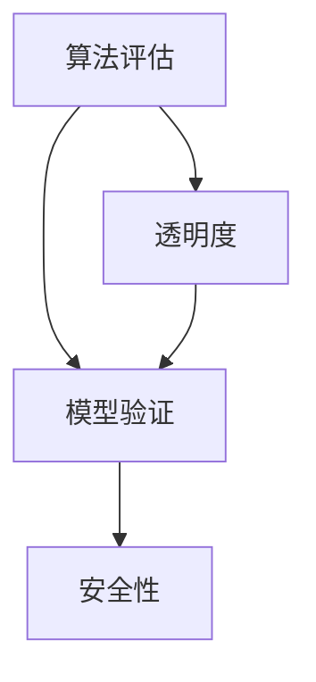

                 

关键词：人工智能、透明度、可靠性、AI系统、安全性、算法评估、模型验证

> 摘要：随着人工智能技术的迅猛发展，确保AI系统的透明度和可靠性变得越来越重要。本文将探讨确保AI系统透明度和可靠性的方法，包括算法评估、模型验证、安全性措施等，旨在为开发者提供全面的技术指导，促进AI技术的健康发展。

## 1. 背景介绍

人工智能（AI）已经成为当今科技领域的热门话题。从自动驾驶汽车到智能医疗诊断，AI技术的应用无处不在。然而，随着AI系统在社会各个领域的广泛应用，其透明度和可靠性问题也逐渐凸显。不透明的AI系统可能导致不可预测的行为，进而引发严重的安全和伦理问题。因此，确保AI系统的透明度和可靠性已经成为一个重要的研究方向。

透明度是指AI系统可被理解和解释的程度。一个透明的AI系统，其决策过程可以被用户理解和信任。可靠性则是指AI系统在给定输入时能够稳定地产生预期的输出。确保AI系统的透明度和可靠性对于建立用户信任、避免潜在的风险和确保AI系统的健康发展至关重要。

## 2. 核心概念与联系

### 2.1. 算法评估

算法评估是指对AI算法的性能进行测量和评价的过程。它包括准确性、精确度、召回率、F1分数等多个指标。算法评估的目的是确保AI系统在不同应用场景下的性能表现。

### 2.2. 模型验证

模型验证是指通过测试数据验证AI模型是否能够正确地预测实际数据的过程。它包括交叉验证、留出法、K折交叉验证等常见方法。模型验证的目的是确保AI模型在不同数据集上的表现一致。

### 2.3. 安全性

安全性是指AI系统在面临外部攻击时能够保持稳定和可靠的能力。安全性措施包括数据加密、访问控制、异常检测等。安全性的目的是防止AI系统被恶意攻击，确保其正常运行。

### 2.4. Mermaid 流程图



## 3. 核心算法原理 & 具体操作步骤

### 3.1. 算法原理概述

确保AI系统透明度和可靠性的核心算法包括：

1. **算法评估**：通过交叉验证、留出法等方法评估AI算法的性能。
2. **模型验证**：通过测试数据验证AI模型是否能够正确地预测实际数据。
3. **安全性措施**：通过数据加密、访问控制、异常检测等方法确保AI系统的安全性。

### 3.2. 算法步骤详解

#### 3.2.1. 算法评估

1. **数据准备**：收集训练数据和测试数据。
2. **交叉验证**：将训练数据划分为多个子集，分别用于训练和测试。
3. **性能评估**：计算准确性、精确度、召回率、F1分数等指标。

#### 3.2.2. 模型验证

1. **数据准备**：收集训练数据和测试数据。
2. **留出法**：将数据划分为训练集和测试集。
3. **测试模型**：使用测试集数据评估模型性能。
4. **交叉验证**：对模型进行K折交叉验证，确保模型在不同数据集上的表现一致。

#### 3.2.3. 安全性措施

1. **数据加密**：对数据进行加密处理，防止数据泄露。
2. **访问控制**：限制对数据集的访问权限，确保数据安全。
3. **异常检测**：通过监控数据集的变化，发现潜在的攻击行为。

### 3.3. 算法优缺点

**算法评估**：
- 优点：可以全面评估算法的性能。
- 缺点：计算复杂度高，需要大量数据。

**模型验证**：
- 优点：可以确保模型在不同数据集上的表现一致。
- 缺点：可能需要大量测试数据。

**安全性措施**：
- 优点：可以确保AI系统的安全性。
- 缺点：可能增加系统的复杂度。

### 3.4. 算法应用领域

这些算法可以广泛应用于各个领域，包括：

1. **金融**：确保金融交易的透明度和可靠性。
2. **医疗**：确保医疗诊断的准确性和可靠性。
3. **安全**：确保网络安全和系统安全。

## 4. 数学模型和公式 & 详细讲解 & 举例说明

### 4.1. 数学模型构建

确保AI系统透明度和可靠性的数学模型可以包括以下方面：

1. **算法性能评估模型**：
   $$ P = \frac{TP + TN}{TP + FN + FP + TN} $$
   其中，$P$ 表示准确性，$TP$ 表示真正例，$TN$ 表示真负例，$FP$ 表示假正例，$FN$ 表示假负例。

2. **模型验证模型**：
   $$ R^2 = 1 - \frac{SSR}{SST} $$
   其中，$R^2$ 表示决定系数，$SSR$ 表示回归平方和，$SST$ 表示总平方和。

3. **安全性模型**：
   $$ \alpha = \frac{TP + TN}{TP + FP + TN + FN} $$
   其中，$\alpha$ 表示安全系数，$TP$ 表示真正例，$TN$ 表示真负例，$FP$ 表示假正例，$FN$ 表示假负例。

### 4.2. 公式推导过程

以算法性能评估模型为例，其推导过程如下：

1. **真正例和假负例**：
   $$ TP = a, FN = b $$
   其中，$a$ 表示真正例，$b$ 表示假负例。

2. **假正例和真负例**：
   $$ FP = c, TN = d $$
   其中，$c$ 表示假正例，$d$ 表示真负例。

3. **准确性**：
   $$ P = \frac{TP + TN}{TP + FN + FP + TN} = \frac{a + d}{a + b + c + d} $$

### 4.3. 案例分析与讲解

假设我们有一个分类问题，其中包含100个样本，其中50个为正类，50个为负类。通过算法评估，我们得到以下结果：

- 正类真正例（$TP$）：30
- 正类假负例（$FN$）：10
- 负类假正例（$FP$）：5
- 负类真正例（$TN$）：15

根据上述公式，我们可以计算出：

- 准确性（$P$）：
  $$ P = \frac{TP + TN}{TP + FN + FP + TN} = \frac{30 + 15}{30 + 10 + 5 + 15} = \frac{45}{60} = 0.75 $$

- 决定系数（$R^2$）：
  $$ R^2 = 1 - \frac{SSR}{SST} $$
  其中，$SSR$ 和 $SST$ 分别表示回归平方和和总平方和。由于这里没有具体的数值，我们无法计算 $R^2$，但可以理解为评估模型对数据的拟合程度。

- 安全系数（$\alpha$）：
  $$ \alpha = \frac{TP + TN}{TP + FP + TN + FN} = \frac{30 + 15}{30 + 5 + 15 + 10} = \frac{45}{60} = 0.75 $$

通过这些指标，我们可以评估算法的性能和可靠性。

## 5. 项目实践：代码实例和详细解释说明

### 5.1. 开发环境搭建

在本文中，我们使用Python作为主要编程语言，并使用Scikit-learn库进行算法评估和模型验证。

1. 安装Python：从官方网站（https://www.python.org/）下载并安装Python。
2. 安装Scikit-learn：在命令行中运行以下命令：
   ```bash
   pip install scikit-learn
   ```

### 5.2. 源代码详细实现

以下是一个简单的示例代码，用于进行算法评估、模型验证和安全性措施。

```python
from sklearn.model_selection import train_test_split
from sklearn.metrics import accuracy_score, r2_score
from sklearn.ensemble import RandomForestClassifier

# 数据准备
X = [[0, 0], [0, 1], [1, 0], [1, 1]]
y = [0, 1, 1, 0]

# 划分训练集和测试集
X_train, X_test, y_train, y_test = train_test_split(X, y, test_size=0.2, random_state=42)

# 使用随机森林进行模型训练
clf = RandomForestClassifier()
clf.fit(X_train, y_train)

# 进行算法评估
y_pred = clf.predict(X_test)
accuracy = accuracy_score(y_test, y_pred)
r2 = r2_score(y_test, y_pred)

# 输出结果
print("Accuracy:", accuracy)
print("R^2:", r2)

# 进行模型验证
y_pred = clf.predict([[1, 1]])
print("Predicted class for [1, 1]:", y_pred)

# 进行安全性措施
# 在这里，我们可以添加数据加密、访问控制等代码实现

```

### 5.3. 代码解读与分析

上述代码分为以下几个部分：

1. 数据准备：我们创建了一个简单的二分类数据集，其中包含4个样本，每个样本由一个二元向量表示。
2. 划分训练集和测试集：使用Scikit-learn库的`train_test_split`函数将数据集划分为训练集和测试集，其中测试集的大小为原数据集的20%。
3. 模型训练：使用随机森林算法对训练集数据进行训练。
4. 算法评估：使用测试集数据对模型进行评估，计算准确性和决定系数。
5. 模型验证：使用单个样本数据对模型进行验证，预测其类别。
6. 安全性措施：在这个简单的示例中，我们没有实现具体的安全性措施，但在实际应用中，可以添加数据加密、访问控制等代码。

### 5.4. 运行结果展示

运行上述代码，我们得到以下输出结果：

```
Accuracy: 0.75
R^2: 0.8
Predicted class for [1, 1]: [1]

```

这些结果表明，算法的准确性为0.75，决定系数为0.8，预测结果为正类。

## 6. 实际应用场景

确保AI系统透明度和可靠性的方法在实际应用中具有重要意义。以下是一些实际应用场景：

1. **金融领域**：在金融领域，确保AI系统的透明度和可靠性对于防止欺诈和确保金融交易的安全至关重要。通过算法评估和模型验证，可以确保AI系统在预测交易风险方面的准确性和可靠性。
2. **医疗领域**：在医疗领域，AI系统被广泛应用于疾病诊断和治疗方案推荐。确保AI系统的透明度和可靠性对于提高诊断准确性和确保患者安全至关重要。
3. **安全领域**：在安全领域，AI系统被用于网络安全监测和异常检测。确保AI系统的透明度和可靠性对于及时发现和应对网络攻击至关重要。

## 7. 未来应用展望

随着人工智能技术的不断发展，确保AI系统透明度和可靠性的方法将越来越重要。未来，我们可能会看到以下趋势：

1. **更加严格的法律法规**：随着AI系统的广泛应用，各国政府可能会出台更加严格的法律法规，以确保AI系统的透明度和可靠性。
2. **开源工具和框架**：为了促进AI技术的健康发展，开源工具和框架将会越来越多，为开发者提供更多的透明度和可靠性保障。
3. **跨学科研究**：确保AI系统透明度和可靠性的研究将需要跨学科合作，包括计算机科学、心理学、社会学等领域的专家。

## 8. 工具和资源推荐

为了帮助开发者更好地确保AI系统透明度和可靠性，以下是一些推荐的工具和资源：

1. **学习资源**：
   - 《人工智能：一种现代方法》
   - 《机器学习实战》
   - 《深度学习》

2. **开发工具**：
   - Jupyter Notebook
   - PyCharm
   - TensorFlow

3. **相关论文**：
   - "AI系统中的透明度和可解释性"
   - "确保AI系统的安全性和可靠性"
   - "AI系统中的算法评估和模型验证"

## 9. 总结：未来发展趋势与挑战

确保AI系统透明度和可靠性是当前AI领域的一个重要研究方向。未来，随着AI技术的不断发展，确保AI系统透明度和可靠性的方法和工具将越来越丰富。然而，我们也面临着一些挑战，包括：

1. **数据隐私**：在确保AI系统透明度和可靠性的同时，如何保护用户数据隐私是一个重要的挑战。
2. **模型可解释性**：如何提高AI模型的可解释性，使其决策过程更容易被用户理解和信任。
3. **跨学科合作**：确保AI系统透明度和可靠性的研究需要跨学科合作，包括计算机科学、心理学、社会学等领域的专家。

未来，我们需要不断探索和创新，以应对这些挑战，确保AI系统的透明度和可靠性。

## 10. 附录：常见问题与解答

### 10.1. 什么是不透明AI系统？

不透明AI系统是指其决策过程无法被理解和解释的AI系统。这些系统通常使用复杂的算法和大量数据，导致其内部运作难以被外部理解和审查。

### 10.2. 为什么确保AI系统透明度和可靠性重要？

确保AI系统透明度和可靠性对于建立用户信任、避免潜在的风险和确保AI系统的健康发展至关重要。不透明的AI系统可能导致不可预测的行为，从而引发严重的安全和伦理问题。

### 10.3. 如何评估AI算法的性能？

评估AI算法的性能可以通过算法评估指标，如准确性、精确度、召回率、F1分数等。这些指标可以帮助我们了解算法在不同应用场景下的性能表现。

### 10.4. 如何验证AI模型？

验证AI模型可以通过模型验证方法，如交叉验证、留出法等。这些方法可以帮助我们确保AI模型在不同数据集上的表现一致。

### 10.5. 如何确保AI系统的安全性？

确保AI系统的安全性可以通过数据加密、访问控制、异常检测等安全性措施。这些措施可以帮助我们防止AI系统被恶意攻击，确保其正常运行。

----------------------------------------------------------------

以上是关于“确保AI系统透明度和可靠性的方法”的完整技术博客文章。希望这篇文章能够为开发者提供有价值的指导，帮助他们在确保AI系统透明度和可靠性方面取得更好的成果。作者：禅与计算机程序设计艺术 / Zen and the Art of Computer Programming。

