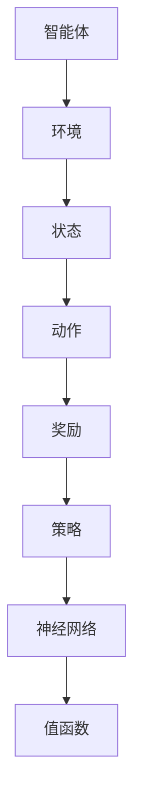

                 

关键词：神经网络，强化学习，应用场景，算法原理，数学模型，代码实例，未来展望

> 摘要：本文深入探讨了神经网络在强化学习中的应用，包括其核心概念、算法原理、数学模型以及实践中的案例分析和应用前景。通过详细的实例讲解和代码展示，本文旨在为读者提供一个全面的理解和实用的参考。

## 1. 背景介绍

### 强化学习的兴起

强化学习（Reinforcement Learning，RL）作为机器学习领域的一个重要分支，近年来在学术界和工业界都取得了显著的进展。与传统的监督学习和无监督学习不同，强化学习通过智能体（Agent）与环境（Environment）的交互，学习如何做出最优决策以达到目标。其独特的决策过程和探索-利用（Explore-Exploit）策略，使得强化学习在游戏、自动驾驶、机器人控制等领域展现出巨大的潜力。

### 神经网络的发展

神经网络（Neural Networks，NN）作为模拟人脑工作方式的计算模型，自20世纪80年代以来经历了多次复兴。特别是在深度学习（Deep Learning）的推动下，神经网络在图像识别、语音识别、自然语言处理等领域取得了突破性的成果。随着计算能力的提升和数据量的增加，神经网络在参数优化、模型复杂度等方面也取得了显著的进步。

### 神经网络与强化学习结合

神经网络在强化学习中的应用，可以追溯到20世纪90年代。随着强化学习算法的改进和神经网络的进步，二者结合的研究和应用逐渐增多。神经网络用于表示智能体的策略或值函数，可以提高智能体的决策能力和学习能力。例如，深度确定性策略梯度（DDPG）、深度Q网络（DQN）等算法，都是将神经网络与强化学习结合的代表性工作。

## 2. 核心概念与联系

### 强化学习核心概念

#### 智能体（Agent）

在强化学习中，智能体是执行动作的主体，它的目标是最大化累积奖励。

#### 环境（Environment）

环境是智能体操作的背景，它根据智能体的动作返回状态和奖励。

#### 状态（State）

状态是智能体在环境中的当前状况，通常用一组特征向量表示。

#### 动作（Action）

动作是智能体在状态下的选择，用于改变状态。

#### 奖励（Reward）

奖励是环境对智能体动作的即时反馈，用于指导智能体的学习。

### 神经网络核心概念

#### 神经元

神经元是神经网络的基本单元，通过加权连接传递信息。

#### 层

神经网络由多个层次组成，包括输入层、隐藏层和输出层。

#### 激活函数

激活函数用于引入非线性特性，使神经网络能够学习复杂函数。

### 结合与联系

在强化学习中，神经网络可以用于表示智能体的策略函数（Policy）或值函数（Value Function）。策略函数用于预测在给定状态下应该执行的动作，值函数用于评估状态或状态-动作对的优劣。通过优化神经网络参数，可以训练出能够在特定环境中做出最优决策的智能体。

### Mermaid 流程图



## 3. 核心算法原理 & 具体操作步骤

### 3.1 算法原理概述

强化学习中的神经网络主要用于实现策略优化和价值估计。策略优化通过学习策略函数，使智能体在给定状态下选择最优动作；价值估计通过学习值函数，评估当前状态或状态-动作对的价值。

### 3.2 算法步骤详解

#### 策略优化

1. 初始化神经网络参数。
2. 在环境中进行模拟，记录状态、动作和奖励。
3. 使用梯度下降或其他优化算法更新神经网络参数。
4. 重复步骤2-3，直到满足终止条件（如达到一定步数或奖励值）。

#### 价值估计

1. 初始化神经网络参数。
2. 在环境中进行模拟，记录状态、动作和奖励。
3. 使用梯度下降或其他优化算法更新神经网络参数，以最小化价值估计误差。
4. 重复步骤2-3，直到满足终止条件。

### 3.3 算法优缺点

#### 优点

- **强大的泛化能力**：神经网络能够学习复杂的状态和动作空间，提高智能体的决策能力。
- **自适应性强**：神经网络能够根据环境变化自适应调整策略，提高智能体的适应性。

#### 缺点

- **计算量大**：神经网络训练需要大量的计算资源和时间，特别是在大状态空间和动作空间的情况下。
- **梯度消失和梯度爆炸**：神经网络在训练过程中容易出现梯度消失和梯度爆炸问题，影响训练效果。

### 3.4 算法应用领域

- **游戏AI**：如《星际争霸II》的人机大战，使用神经网络实现的智能体能够在复杂策略下取得胜利。
- **自动驾驶**：神经网络用于自动驾驶系统，提高车辆的行驶安全性和灵活性。
- **机器人控制**：神经网络在机器人控制中用于实现自主导航和任务执行。

## 4. 数学模型和公式 & 详细讲解 & 举例说明

### 4.1 数学模型构建

强化学习中的神经网络通常用于实现策略函数和价值函数。策略函数可以表示为：

\[ \pi(\text{action}|\text{state}) = \text{softmax}(\text{Q}(\text{state}, \text{action})) \]

其中，\( \text{Q}(\text{state}, \text{action}) \) 是状态-动作对的值函数，通过神经网络进行估计。

### 4.2 公式推导过程

值函数的推导过程通常基于马尔可夫决策过程（MDP）的基本原理。对于给定状态 \( \text{state} \) 和动作 \( \text{action} \)，值函数可以表示为：

\[ \text{Q}(\text{state}, \text{action}) = \sum_{\text{next\_state}} \pi(\text{next\_action}|\text{next\_state}) \cdot \text{reward} + \gamma \cdot \text{V}(\text{next\_state}) \]

其中，\( \text{reward} \) 是动作带来的即时奖励，\( \gamma \) 是折扣因子，\( \text{V}(\text{next\_state}) \) 是下一步状态的价值。

### 4.3 案例分析与讲解

假设智能体在某个环境中进行学习，目标是最小化能量消耗。给定状态 \( \text{state} \)，智能体可以选择行动 \( \text{action} \)，获得即时奖励 \( \text{reward} \)。通过神经网络估计值函数 \( \text{Q}(\text{state}, \text{action}) \)，并优化策略函数 \( \pi(\text{action}|\text{state}) \)。

#### 示例代码：

```python
# 初始化神经网络参数
Q = NeuralNetwork()

# 环境模拟
state = Environment.start()
while not Environment.terminated():
    action = Q.predict(state)
    next_state, reward = Environment.step(action)
    Q.update(state, action, reward, next_state)
    state = next_state
```

## 5. 项目实践：代码实例和详细解释说明

### 5.1 开发环境搭建

为了实现神经网络在强化学习中的应用，我们需要搭建一个完整的开发环境。以下是一个简单的环境搭建步骤：

1. 安装Python和相关库，如TensorFlow、PyTorch等。
2. 创建一个Python虚拟环境，确保所有依赖库都在同一环境中运行。
3. 编写或下载一个简单的强化学习环境，如CartPole。

### 5.2 源代码详细实现

以下是一个简单的强化学习项目，使用深度Q网络（DQN）算法训练智能体在CartPole环境中稳定平衡杆。

```python
import numpy as np
import gym
import tensorflow as tf

# 创建环境
env = gym.make('CartPole-v0')

# 定义神经网络
class DQN(tf.keras.Model):
    def __init__(self):
        super(DQN, self).__init__()
        self.fc1 = tf.keras.layers.Dense(64, activation='relu')
        self.fc2 = tf.keras.layers.Dense(64, activation='relu')
        self.output = tf.keras.layers.Dense(1)

    def call(self, x):
        x = self.fc1(x)
        x = self.fc2(x)
        return self.output(x)

# 初始化DQN
dqn = DQN()

# 定义优化器
optimizer = tf.keras.optimizers.Adam(learning_rate=0.001)

# 定义损失函数
loss_fn = tf.keras.losses.MeanSquaredError()

# 训练过程
def train_dqn_episodes(episodes):
    for episode in range(episodes):
        state = env.reset()
        done = False
        while not done:
            action = dqn.predict(state)[0, 0]
            next_state, reward, done, _ = env.step(action)
            dqn.update(state, action, reward, next_state)
            state = next_state

# 训练DQN
train_dqn_episodes(1000)

# 关闭环境
env.close()
```

### 5.3 代码解读与分析

上述代码实现了一个简单的DQN模型，用于在CartPole环境中训练智能体。代码分为以下几个部分：

1. **环境创建**：使用gym库创建CartPole环境。
2. **神经网络定义**：定义一个简单的全连接神经网络，用于预测动作值。
3. **优化器和损失函数**：定义优化器和损失函数，用于更新神经网络参数。
4. **训练过程**：在训练过程中，每次迭代智能体从环境中获取状态，通过神经网络选择动作，并更新神经网络参数。

### 5.4 运行结果展示

训练完成后，智能体可以在CartPole环境中稳定平衡杆，展示出良好的学习效果。

```python
# 测试DQN
state = env.reset()
done = False
while not done:
    action = dqn.predict(state)[0, 0]
    next_state, reward, done, _ = env.step(action)
    env.render()
    state = next_state
```

## 6. 实际应用场景

### 6.1 游戏

神经网络在强化学习中的应用在游戏领域取得了显著的成果。例如，DeepMind的AlphaGo通过强化学习算法，结合神经网络进行训练，最终在围棋比赛中击败了世界冠军。

### 6.2 自动驾驶

自动驾驶是强化学习的重要应用领域。通过训练神经网络，自动驾驶系统能够在复杂的交通环境中做出实时决策，提高行驶安全性和效率。

### 6.3 机器人控制

机器人控制是强化学习的另一个重要应用领域。通过训练神经网络，机器人能够在不同的环境中自主执行任务，如自主导航、抓取物体等。

## 7. 工具和资源推荐

### 7.1 学习资源推荐

- 《强化学习：原理与编程》
- 《深度学习》（Goodfellow, Bengio, Courville）
- 《机器学习》（周志华）

### 7.2 开发工具推荐

- TensorFlow
- PyTorch
- Keras

### 7.3 相关论文推荐

- “Deep Q-Network”（Mnih et al., 2015）
- “Deep Deterministic Policy Gradients”（Lillicrap et al., 2015）
- “Human-Level Control Through Deep Reinforcement Learning”（Silver et al., 2016）

## 8. 总结：未来发展趋势与挑战

### 8.1 研究成果总结

神经网络在强化学习中的应用已经取得了显著的成果，包括游戏AI、自动驾驶和机器人控制等领域。通过结合深度学习和强化学习算法，智能体能够在复杂环境中做出实时决策。

### 8.2 未来发展趋势

- **更强的泛化能力**：通过改进神经网络模型和算法，提高智能体在不同场景下的泛化能力。
- **更高效的训练**：优化训练过程，减少计算资源和时间成本。
- **多智能体系统**：研究多智能体强化学习，实现协同合作和竞争。

### 8.3 面临的挑战

- **数据需求**：强化学习算法通常需要大量的数据，如何有效地获取和处理数据是一个挑战。
- **计算资源**：强化学习算法的计算量较大，如何优化计算资源分配是一个关键问题。
- **安全性和可控性**：如何在保证智能体行为安全的同时，使其保持一定的探索能力。

### 8.4 研究展望

随着深度学习和强化学习的不断进步，神经网络在强化学习中的应用前景广阔。未来，我们将继续探索更高效、更智能的算法，为各个领域带来更多的创新和突破。

## 9. 附录：常见问题与解答

### 9.1 神经网络如何优化强化学习算法？

通过使用优化算法（如梯度下降、Adam等）更新神经网络参数，使得神经网络能够根据反馈不断调整策略或值函数，从而提高智能体的决策能力。

### 9.2 如何评估强化学习算法的性能？

通常使用奖励累积、成功步数、完成任务的时间等指标来评估强化学习算法的性能。

### 9.3 如何处理连续动作空间？

对于连续动作空间，可以使用连续值函数估计方法，如连续Q学习（Continuous Q-Learning）或演员-评论家（Actor-Critic）方法。

---

本文由禅与计算机程序设计艺术撰写，旨在为读者提供一个全面、深入的神经网络在强化学习中的应用指南。希望本文能帮助您更好地理解和应用这一技术，为您的项目带来新的突破。

