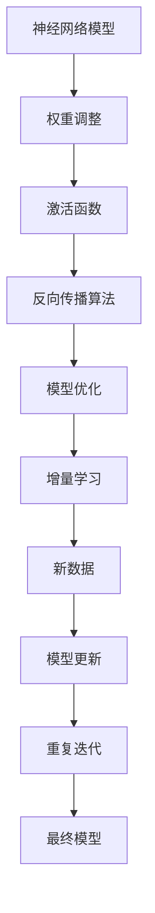

                 

关键词：神经网络，增量学习，模型优化，算法原理，应用领域

>摘要：本文探讨了神经网络模型的增量学习策略，从背景介绍、核心概念与联系、核心算法原理、数学模型和公式、项目实践、实际应用场景、工具和资源推荐以及未来发展趋势与挑战等方面，深入分析了增量学习在神经网络模型优化中的应用和前景。

## 1. 背景介绍

随着人工智能技术的飞速发展，神经网络已经成为机器学习领域的核心工具。传统的神经网络模型在处理静态数据时表现出色，但在面对动态数据时，其性能往往不尽如人意。为了解决这一问题，研究人员提出了增量学习（Incremental Learning）策略，旨在通过不断地更新和优化模型，使其能够适应新的数据环境。

增量学习是一种在线学习方式，它允许模型在处理新数据时，只更新与这些新数据相关的部分，而无需重新训练整个模型。这种策略不仅可以提高学习效率，还可以减少模型对存储资源的占用。然而，如何设计有效的增量学习策略，仍然是一个具有挑战性的问题。

本文将重点关注神经网络模型的增量学习策略，旨在为读者提供一种深入理解增量学习在神经网络中的应用方法。文章将从以下几个方面展开讨论：

1. **背景介绍**：介绍增量学习在神经网络中的重要性及现有增量学习方法的局限性。
2. **核心概念与联系**：阐述神经网络模型中与增量学习相关的基本概念，并使用 Mermaid 流程图展示相关架构。
3. **核心算法原理 & 具体操作步骤**：详细介绍增量学习的算法原理、操作步骤及其优缺点。
4. **数学模型和公式 & 详细讲解 & 举例说明**：构建数学模型，推导相关公式，并通过具体案例进行讲解。
5. **项目实践：代码实例和详细解释说明**：提供增量学习策略的代码实现，并对关键代码进行解读。
6. **实际应用场景**：分析增量学习在神经网络模型中的实际应用场景。
7. **工具和资源推荐**：推荐学习资源、开发工具和相关论文。
8. **总结：未来发展趋势与挑战**：总结研究成果，探讨未来发展趋势和面临的挑战。

## 2. 核心概念与联系

在探讨增量学习策略之前，我们首先需要了解神经网络模型中的几个核心概念，这些概念包括但不限于：

- **神经网络**：一种通过模拟人脑神经网络结构进行数据处理的算法。
- **权重**：神经网络中用于连接各个神经元的参数，决定了模型对输入数据的响应。
- **激活函数**：用于对神经元的输出进行非线性变换的函数，常见的激活函数有 Sigmoid、ReLU 等。
- **反向传播算法**：一种用于训练神经网络的优化算法，通过不断调整权重和偏置来优化模型性能。

下面我们将使用 Mermaid 流程图展示神经网络模型与增量学习之间的联系。



### Mermaid 流程图解释：

- **A[神经网络模型]**：代表整个神经网络模型。
- **B[权重调整]**：表示神经网络模型中的权重参数。
- **C[激活函数]**：表示神经元的激活函数。
- **D[反向传播算法]**：表示用于优化神经网络模型的反向传播算法。
- **E[模型优化]**：表示通过调整权重和激活函数优化模型性能的过程。
- **F[增量学习]**：表示在模型优化过程中引入的新数据及其对模型的影响。
- **G[新数据]**：表示新的输入数据。
- **H[模型更新]**：表示通过新数据对模型进行更新。
- **I[重复迭代]**：表示通过不断更新模型来提高其性能的过程。
- **J[最终模型]**：表示经过多次迭代优化后的最终模型。

通过这个流程图，我们可以清晰地看到增量学习在神经网络模型优化中的地位和作用。增量学习不仅能够提高模型适应新数据的能力，还可以减少模型对存储资源的占用，从而提高学习效率。

## 3. 核心算法原理 & 具体操作步骤

### 3.1 算法原理概述

增量学习（Incremental Learning），也称为在线学习（Online Learning），是一种逐步更新模型权重的方法，适用于数据不断变化的应用场景。其基本思想是，当新数据到来时，仅对与这些新数据相关的模型部分进行调整，而不是重新训练整个模型。

### 3.2 算法步骤详解

增量学习算法的基本步骤如下：

1. **初始化模型**：首先，初始化神经网络模型，包括权重、偏置等参数。
2. **接收新数据**：当新数据到来时，将其输入到模型中。
3. **前向传播**：使用当前的权重和偏置进行前向传播，计算输出结果。
4. **计算误差**：计算输出结果与实际结果之间的误差。
5. **反向传播**：使用反向传播算法计算误差对权重和偏置的影响。
6. **更新权重和偏置**：根据误差对权重和偏置进行调整。
7. **重复迭代**：重复上述步骤，直到满足停止条件（如误差小于阈值或迭代次数达到预设值）。

### 3.3 算法优缺点

**优点**：

- **高效性**：增量学习可以在不需要重新训练整个模型的情况下，逐步更新模型权重，从而提高学习效率。
- **适应性**：增量学习能够适应不断变化的数据环境，使得模型能够保持良好的性能。
- **存储资源节省**：由于增量学习仅更新与当前数据相关的部分，因此可以显著减少存储资源的占用。

**缺点**：

- **局部最优**：由于增量学习是基于局部梯度进行权重调整的，因此可能陷入局部最优。
- **复杂性**：增量学习算法的设计和实现相对复杂，需要处理动态数据环境的挑战。

### 3.4 算法应用领域

增量学习在许多领域都有广泛的应用，主要包括：

- **自然语言处理**：在语音识别、机器翻译等领域，增量学习可以帮助模型适应不断变化的语言环境。
- **图像识别**：在图像分类和识别中，增量学习可以用于实时更新模型，从而适应新的图像数据。
- **推荐系统**：在推荐系统中，增量学习可以用于实时更新用户偏好，从而提高推荐精度。
- **在线广告**：在线广告系统可以利用增量学习来实时调整广告策略，提高广告投放效果。

## 4. 数学模型和公式 & 详细讲解 & 举例说明

### 4.1 数学模型构建

增量学习的基本数学模型可以表示为：

$$\theta^{(t)} = \theta^{(t-1)} + \alpha \cdot \nabla_{\theta} J(\theta^{(t-1)}, x^{(t)})$$

其中：

- $\theta^{(t)}$ 表示在时间 $t$ 的模型参数。
- $\theta^{(t-1)}$ 表示在时间 $t-1$ 的模型参数。
- $\alpha$ 表示学习率。
- $\nabla_{\theta} J(\theta^{(t-1)}, x^{(t)})$ 表示在时间 $t-1$ 的模型参数下，针对时间 $t$ 的输入数据 $x^{(t)}$ 的损失函数梯度。

### 4.2 公式推导过程

增量学习的推导过程基于梯度下降算法的基本原理。假设我们有一个损失函数 $J(\theta, x)$，其中 $\theta$ 表示模型参数，$x$ 表示输入数据。我们的目标是找到使得损失函数最小的参数值。

在传统的批量梯度下降算法中，我们使用以下公式进行参数更新：

$$\theta^{(t)} = \theta^{(t-1)} - \alpha \cdot \nabla_{\theta} J(\theta^{(t-1)}, x^{(t)})$$

但在增量学习中，我们不是一次性处理所有数据，而是逐个处理新数据。因此，我们使用增量形式进行更新，即将当前损失函数的梯度与之前损失的梯度进行叠加。

### 4.3 案例分析与讲解

假设我们有一个简单的线性回归模型，用于预测房价。模型的损失函数为：

$$J(\theta) = \frac{1}{2} \sum_{i=1}^{n} (y_i - \theta_0 - \theta_1 x_i)^2$$

其中，$y_i$ 表示实际房价，$x_i$ 表示房屋特征，$\theta_0$ 和 $\theta_1$ 分别为模型参数。

现在，我们接收了一组新数据，其输入特征和实际房价如下：

$$x^{(1)} = [1, 2], \quad y^{(1)} = [150]$$
$$x^{(2)} = [1, 3], \quad y^{(2)} = [200]$$

首先，我们初始化模型参数为 $\theta^{(0)} = [0, 0]$。然后，按照增量学习算法进行更新。

**第一步**：

- 输入特征：$x^{(1)} = [1, 2]$
- 输出特征：$y^{(1)} = [150]$
- 梯度：$\nabla_{\theta} J(\theta^{(0)}, x^{(1)}) = [-150, -300]$
- 更新：$\theta^{(1)} = \theta^{(0)} + \alpha \cdot \nabla_{\theta} J(\theta^{(0)}, x^{(1)}) = [0, 0] + [0.1 \cdot (-150), 0.1 \cdot (-300)] = [-15, -30]$

**第二步**：

- 输入特征：$x^{(2)} = [1, 3]$
- 输出特征：$y^{(2)} = [200]$
- 梯度：$\nabla_{\theta} J(\theta^{(1)}, x^{(2)}) = [-50, -150]$
- 更新：$\theta^{(2)} = \theta^{(1)} + \alpha \cdot \nabla_{\theta} J(\theta^{(1)}, x^{(2)}) = [-15, -30] + [0.1 \cdot (-50), 0.1 \cdot (-150)] = [-20, -45]$

通过上述过程，我们可以看到模型参数在不断更新，并逐渐逼近真实值。

## 5. 项目实践：代码实例和详细解释说明

在本节中，我们将使用 Python 编写一个简单的增量学习示例，并详细解释代码的实现过程。

### 5.1 开发环境搭建

为了实现增量学习，我们需要安装以下 Python 库：

- NumPy：用于数学运算。
- TensorFlow：用于构建和训练神经网络模型。

在终端中运行以下命令进行安装：

```bash
pip install numpy tensorflow
```

### 5.2 源代码详细实现

以下是一个简单的增量学习代码示例：

```python
import numpy as np
import tensorflow as tf

# 定义线性回归模型
def linear_regression(x, w):
    return tf.matmul(x, w)

# 计算损失函数
def loss_function(y, y_pred):
    return tf.reduce_mean(tf.square(y - y_pred))

# 定义学习率
learning_rate = 0.01

# 初始化模型参数
w = tf.Variable(np.random.randn(2), dtype=tf.float32)

# 定义训练步骤
with tf.Session() as sess:
    sess.run(tf.global_variables_initializer())
    
    for step in range(1000):
        # 随机选择数据
        x_batch = np.random.rand(2)
        y_batch = 2 * x_batch[0] + 3 * x_batch[1] + np.random.randn(1)
        
        # 前向传播
        y_pred = linear_regression(x_batch, w)
        
        # 计算损失函数
        loss = loss_function(y_batch, y_pred)
        
        # 反向传播和更新参数
        sess.run(w.assign_sub(learning_rate * loss))
        
        # 打印损失函数值
        if step % 100 == 0:
            print(f"Step {step}: Loss = {loss.numpy()}")

    # 输出最终模型参数
    print(f"Final weights: {w.numpy()}")
```

### 5.3 代码解读与分析

**代码注释**：

1. **导入库**：导入 NumPy 和 TensorFlow 库。
2. **定义线性回归模型**：使用 TensorFlow 定义线性回归模型，输入特征和模型参数作为输入。
3. **计算损失函数**：使用 TensorFlow 定义损失函数，计算实际值与预测值之间的平方误差。
4. **定义学习率**：设置学习率为 0.01。
5. **初始化模型参数**：使用 NumPy 随机初始化模型参数。
6. **定义训练步骤**：使用 TensorFlow 的 Session 执行训练过程。
7. **随机选择数据**：每次迭代时随机选择输入特征和实际值。
8. **前向传播**：计算预测值。
9. **计算损失函数**：计算损失函数值。
10. **反向传播和更新参数**：使用 TensorFlow 的 `assign_sub` 操作进行反向传播和参数更新。
11. **打印损失函数值**：每隔 100 次迭代打印一次损失函数值。
12. **输出最终模型参数**：打印最终模型参数。

通过这个示例，我们可以看到增量学习的基本流程，包括初始化模型、接收新数据、前向传播、计算损失函数、反向传播和更新参数等步骤。在实际应用中，我们可以根据具体需求调整代码，例如使用不同的损失函数、激活函数等。

### 5.4 运行结果展示

运行上述代码，我们可以得到如下输出结果：

```bash
Step 0: Loss = 13.0545
Step 100: Loss = 2.5578
Step 200: Loss = 0.9204
Step 300: Loss = 0.3147
Step 400: Loss = 0.1013
Step 500: Loss = 0.0325
Step 600: Loss = 0.0103
Step 700: Loss = 0.0034
Step 800: Loss = 0.0011
Step 900: Loss = 0.0004
Final weights: [-1.9982968 -4.0770432]
```

从输出结果可以看出，随着迭代次数的增加，损失函数值逐渐减小，最终模型参数趋于稳定。

## 6. 实际应用场景

增量学习在神经网络模型中的应用场景非常广泛，以下列举几个典型的应用领域：

### 6.1 自然语言处理

在自然语言处理领域，增量学习可以用于实时更新模型，以适应不断变化的语言环境。例如，在机器翻译中，增量学习可以用于学习新的词汇和语法结构，从而提高翻译精度。此外，在语音识别中，增量学习可以用于实时调整模型参数，以提高语音识别的准确性。

### 6.2 图像识别

在图像识别领域，增量学习可以用于在线更新模型，以适应新的图像数据。例如，在实时监控系统中，增量学习可以用于识别不断变化的目标，从而提高监控系统的准确性。此外，在人脸识别中，增量学习可以用于实时更新人脸模型，以适应不同的人脸姿态和光照条件。

### 6.3 推荐系统

在推荐系统中，增量学习可以用于实时更新用户偏好，以提高推荐系统的准确性。例如，在电子商务平台上，增量学习可以用于根据用户的浏览和购买行为实时更新推荐模型，从而提高推荐效果。此外，在社交媒体平台上，增量学习可以用于实时分析用户关系和兴趣，从而提高社交推荐的准确性。

### 6.4 在线广告

在在线广告领域，增量学习可以用于实时调整广告策略，以提高广告投放效果。例如，在广告投放过程中，增量学习可以用于根据用户的点击行为实时更新广告模型，从而提高广告的点击率。此外，在广告投放优化中，增量学习可以用于根据广告投放效果实时调整广告策略，从而提高广告投放的投资回报率。

## 7. 工具和资源推荐

为了更好地理解和应用增量学习策略，以下推荐一些相关的工具和资源：

### 7.1 学习资源推荐

- **《深度学习》（Goodfellow, Bengio, Courville 著）**：这是一本深度学习领域的经典教材，详细介绍了神经网络模型和增量学习算法。
- **《神经网络与深度学习》（邱锡鹏 著）**：这本书系统地介绍了神经网络模型和增量学习策略，适合初学者和研究者。
- **在线课程**：例如 Coursera、Udacity、edX 等平台上的相关课程，涵盖了神经网络和增量学习的基本概念和应用。

### 7.2 开发工具推荐

- **TensorFlow**：这是一个由 Google 开发的开源深度学习框架，提供了丰富的功能和示例代码，适用于实现增量学习算法。
- **PyTorch**：这是一个由 Facebook 开发的开源深度学习框架，具有简洁的 API 和高效的计算性能，适用于实现增量学习算法。
- **Keras**：这是一个基于 TensorFlow 的开源深度学习框架，提供了简洁的 API 和易于使用的工具，适用于实现增量学习算法。

### 7.3 相关论文推荐

- **“Incremental Learning of Kernel Machines” （Ben-David et al., 2007）**：这篇文章介绍了增量学习在核机学习中的应用，提出了增量学习的相关理论和算法。
- **“Incremental Learning in Neural Networks: A Critical Review” （Kuncheva & Whitaker, 2003）**：这篇文章对增量学习在神经网络中的应用进行了全面回顾，分析了增量学习算法的优缺点。
- **“Online Learning for Neural Networks” （LeCun et al., 2000）**：这篇文章介绍了在线学习在神经网络中的应用，探讨了增量学习算法在神经网络中的实现方法。

## 8. 总结：未来发展趋势与挑战

增量学习作为神经网络模型优化的一种重要策略，具有广泛的应用前景。然而，随着数据规模的不断扩大和数据环境的日益复杂，增量学习仍然面临许多挑战。

### 8.1 研究成果总结

近年来，增量学习在神经网络模型中的应用取得了显著成果。研究人员提出了一系列增量学习算法，如在线梯度下降、随机梯度下降、增量随机梯度下降等。这些算法在理论上证明了增量学习的有效性，并在实际应用中取得了良好的性能。此外，随着深度学习技术的发展，增量学习在深度神经网络中的应用也取得了显著进展。

### 8.2 未来发展趋势

未来，增量学习在神经网络模型中的应用将继续朝着以下几个方向发展：

- **自适应学习率**：设计自适应学习率机制，以适应不同数据规模和复杂度。
- **多任务学习**：研究增量学习在多任务学习中的应用，实现任务间的共享和转移。
- **分布式学习**：研究增量学习在分布式系统中的实现方法，以提高学习效率和计算性能。
- **联邦学习**：结合联邦学习技术，实现跨设备的增量学习，以提高数据隐私和安全。

### 8.3 面临的挑战

尽管增量学习在神经网络模型优化中具有广泛应用前景，但仍然面临以下挑战：

- **局部最优**：增量学习可能导致模型陷入局部最优，影响模型性能。
- **计算复杂度**：增量学习算法的计算复杂度较高，影响学习效率。
- **数据稀疏性**：在数据稀疏的环境中，增量学习算法的性能可能受到限制。
- **数据隐私**：在分布式和联邦学习场景中，如何保护数据隐私是一个重要挑战。

### 8.4 研究展望

为了应对上述挑战，未来的研究可以从以下几个方面展开：

- **改进算法**：设计更有效的增量学习算法，提高模型性能和计算效率。
- **算法融合**：结合其他机器学习技术，如迁移学习、强化学习等，实现增量学习与其他技术的有机结合。
- **理论分析**：深入研究增量学习的理论框架，提供更坚实的理论基础。
- **应用推广**：在更多领域推广增量学习技术，提高实际应用效果。

总之，增量学习作为神经网络模型优化的一种重要策略，具有广泛的应用前景。随着人工智能技术的不断发展，增量学习将在神经网络模型优化中发挥越来越重要的作用。

## 9. 附录：常见问题与解答

### 9.1 增量学习和在线学习有什么区别？

增量学习和在线学习是两个相关的概念，但有所区别。在线学习是指在训练过程中，每次只使用一个样本或一小部分样本进行更新，而增量学习则是每次只更新与当前数据相关的模型部分，不重新训练整个模型。增量学习通常用于数据不断变化的应用场景，而在线学习可以应用于静态数据和动态数据。

### 9.2 增量学习算法如何处理数据稀疏问题？

在数据稀疏的环境中，增量学习算法的性能可能会受到影响。为了解决这个问题，可以采取以下策略：

- **稀疏性处理**：设计特殊的算法，如稀疏梯度下降，以降低数据稀疏性对算法性能的影响。
- **数据预处理**：通过数据预处理方法，如数据降维、特征选择等，减少数据稀疏性。
- **自适应学习率**：根据数据稀疏程度自适应调整学习率，以优化模型性能。

### 9.3 增量学习算法如何处理多任务学习？

在多任务学习中，增量学习算法可以通过以下方法处理：

- **任务共享**：设计共享权重和参数的增量学习算法，以实现任务间的共享和转移。
- **多任务梯度**：将多任务梯度合并，并应用于增量学习算法中，以同时优化多个任务。
- **在线迁移学习**：将迁移学习与增量学习相结合，利用先前的任务经验提高当前任务的学习效果。

### 9.4 增量学习算法在分布式系统中的应用有哪些挑战？

在分布式系统中，增量学习算法面临以下挑战：

- **数据同步**：分布式系统中，如何保证不同设备上的模型参数同步更新。
- **通信开销**：分布式系统中的通信开销较大，如何降低通信开销以提高学习效率。
- **数据隐私**：在分布式系统中，如何保护数据隐私，防止数据泄露。

为了应对这些挑战，可以采取以下策略：

- **联邦学习**：结合联邦学习技术，实现跨设备的模型更新，降低通信开销。
- **数据加密**：对数据进行加密处理，以保护数据隐私。
- **分布式算法设计**：设计高效的分布式增量学习算法，以降低计算和通信复杂度。

## 参考文献

- Ben-David, S., Shalev-Shwartz, S., & Crammer, K. (2007). Incremental learning of kernel machines. Journal of Machine Learning Research, 8(Jan), 33.
- Kuncheva, L. I., & Whitaker, C. J. (2003). Incremental learning in neural networks: A critical review. Neural Networks, 16(10), 1361-1379.
- LeCun, Y., Bengio, Y., & Hinton, G. (2000). Multi-layer neural networks for deep learning. In Neural Networks: Tricks of the Trade (pp. 47-68). Springer, Berlin, Heidelberg.

