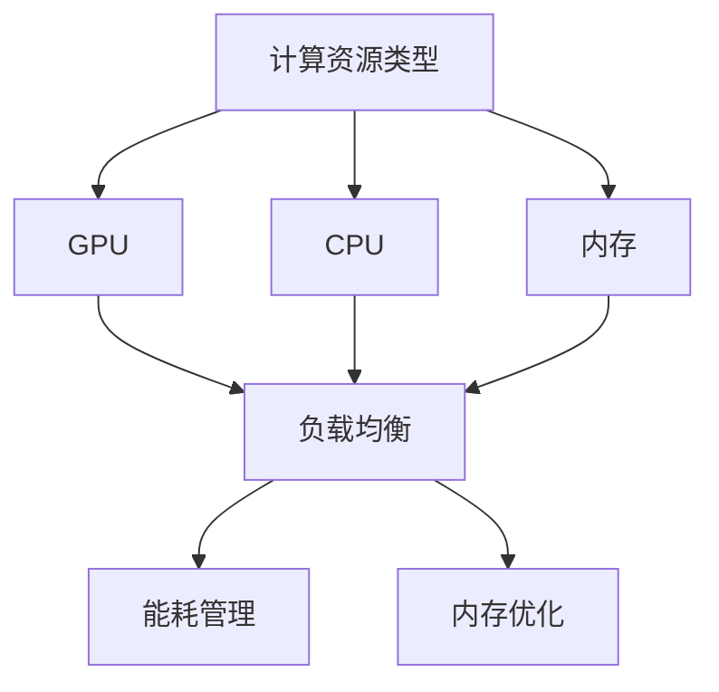

                 

关键词：神经网络模型，资源管理，GPU，CPU，内存优化，分布式计算，能耗管理

> 摘要：本文将深入探讨神经网络模型的资源管理，重点分析在训练和推理过程中如何有效利用GPU、CPU、内存等资源，并通过分布式计算和能耗管理提高模型的性能和效率。

## 1. 背景介绍

随着深度学习技术的飞速发展，神经网络模型在图像识别、自然语言处理、语音识别等领域取得了显著成果。然而，随着模型复杂度和规模的不断增加，对计算资源的需求也日益增长。在这种情况下，如何有效地管理神经网络模型的资源，提高其训练和推理效率，成为了一个亟待解决的问题。

本文将围绕神经网络模型的资源管理展开讨论，主要涉及以下几个方面：

1. **计算资源类型**：介绍常用的计算资源，如GPU、CPU和内存等。
2. **资源管理核心概念**：解释资源管理的核心概念，如负载均衡、能耗管理、内存优化等。
3. **核心算法原理**：探讨资源管理中的关键算法，如分布式计算、GPU调度等。
4. **数学模型和公式**：介绍资源管理中使用的数学模型和公式，如能耗计算公式、资源利用率公式等。
5. **项目实践**：通过实际案例展示资源管理的应用和效果。
6. **实际应用场景**：分析资源管理在不同领域中的应用，如机器学习、人工智能等。
7. **未来展望**：探讨资源管理在未来的发展趋势和面临的挑战。

## 2. 核心概念与联系

### 2.1 计算资源类型

在神经网络模型资源管理中，常用的计算资源包括GPU、CPU和内存。

- **GPU（图形处理器）**：GPU具有强大的并行计算能力，适用于大规模神经网络模型的训练和推理。
- **CPU（中央处理器）**：CPU主要用于执行操作系统和应用程序的指令，虽然计算能力相对较弱，但在一些场景下仍具有重要作用。
- **内存**：内存用于存储程序和数据，其读写速度直接影响模型性能。

### 2.2 资源管理核心概念

资源管理中的核心概念包括：

- **负载均衡**：通过合理分配计算任务，确保各个计算资源得到充分利用。
- **能耗管理**：降低计算过程中的能耗，提高资源利用率。
- **内存优化**：减少内存占用，提高程序运行效率。

### 2.3 Mermaid 流程图

以下是资源管理中的 Mermaid 流程图，展示了核心概念之间的联系：



## 3. 核心算法原理 & 具体操作步骤

### 3.1 算法原理概述

资源管理中的核心算法主要包括：

- **分布式计算**：通过将计算任务分配到多个节点，实现并行计算，提高训练和推理速度。
- **GPU调度**：根据任务需求和GPU负载，动态调整GPU资源的分配，确保GPU资源得到充分利用。

### 3.2 算法步骤详解

#### 3.2.1 分布式计算

分布式计算的基本步骤如下：

1. **任务划分**：将大规模神经网络模型划分成多个较小的子任务。
2. **节点分配**：将子任务分配到不同节点，确保各个节点的负载均衡。
3. **并行训练**：在各个节点上同时训练子任务，提高训练速度。
4. **结果汇总**：将各个节点的训练结果汇总，得到最终模型参数。

#### 3.2.2 GPU调度

GPU调度的基本步骤如下：

1. **任务需求分析**：分析各个任务对GPU资源的需求。
2. **GPU负载评估**：评估当前GPU负载情况。
3. **资源分配**：根据任务需求和GPU负载，动态调整GPU资源的分配。
4. **任务调度**：将任务分配到合适的GPU，确保GPU资源得到充分利用。

### 3.3 算法优缺点

分布式计算和GPU调度的优缺点如下：

- **分布式计算**：优点包括提高训练和推理速度、降低单机计算压力；缺点包括通信开销、同步问题等。
- **GPU调度**：优点包括提高GPU资源利用率、降低能耗；缺点包括调度策略复杂、可能产生竞争等。

### 3.4 算法应用领域

分布式计算和GPU调度在以下领域具有广泛的应用：

- **机器学习**：通过分布式计算提高大规模模型的训练速度，通过GPU调度降低能耗。
- **人工智能**：通过分布式计算和GPU调度提高神经网络模型在语音识别、图像识别等领域的性能。

## 4. 数学模型和公式 & 详细讲解 & 举例说明

### 4.1 数学模型构建

资源管理中常用的数学模型包括：

- **能耗计算模型**：计算神经网络模型在训练和推理过程中消耗的能耗。
- **资源利用率模型**：评估计算资源的使用情况。

### 4.2 公式推导过程

以下是一个简单的能耗计算模型推导过程：

1. **能耗计算公式**：

$$
E = P \times t
$$

其中，$E$ 表示能耗，$P$ 表示功率，$t$ 表示时间。

2. **功率计算公式**：

$$
P = \sum_{i=1}^n p_i \times p_i^*
$$

其中，$p_i$ 表示第 $i$ 个计算资源的功率，$p_i^*$ 表示第 $i$ 个计算资源的利用率。

### 4.3 案例分析与讲解

假设一个神经网络模型在训练过程中使用 GPU、CPU 和内存，我们通过上述公式计算其能耗和资源利用率。

1. **能耗计算**：

- GPU：功率为 300W，利用率为 80%，时间为 1小时

$$
E_{GPU} = 300 \times 0.8 \times 1 = 240 \text{Wh}
$$

- CPU：功率为 100W，利用率为 50%，时间为 1小时

$$
E_{CPU} = 100 \times 0.5 \times 1 = 50 \text{Wh}
$$

- 内存：功率为 20W，利用率为 20%，时间为 1小时

$$
E_{内存} = 20 \times 0.2 \times 1 = 4 \text{Wh}
$$

总能耗：

$$
E_{总} = E_{GPU} + E_{CPU} + E_{内存} = 240 + 50 + 4 = 294 \text{Wh}
$$

2. **资源利用率计算**：

- GPU：利用率 = 80%
- CPU：利用率 = 50%
- 内存：利用率 = 20%

## 5. 项目实践：代码实例和详细解释说明

### 5.1 开发环境搭建

在开始项目实践之前，我们需要搭建一个合适的开发环境。以下是搭建过程的简要说明：

1. 安装 Python 环境：在服务器上安装 Python 3.8 或以上版本。
2. 安装深度学习框架：例如 TensorFlow、PyTorch 等。
3. 安装 GPU 驱动程序：确保 GPU 可以被深度学习框架正确识别。
4. 安装分布式计算库：例如 Dask、Horovod 等。

### 5.2 源代码详细实现

以下是资源管理项目的源代码实现，主要涉及分布式计算和 GPU 调度：

```python
import tensorflow as tf
import horovod.tensorflow as hvd
import os

# 初始化 Horovod
hvd.init()

# 设置 GPU 资源
gpus = tf.config.experimental.list_physical_devices('GPU')
if gpus:
    try:
        for gpu in gpus:
            tf.config.experimental.set_memory_growth(gpu, True)
    except RuntimeError as e:
        print(e)

# 创建分布式的 TensorFlow 图
with tf.Graph().as_default():
    # 定义神经网络模型
    model = ...

    # 添加 Horovod 优化器
    optimizer = hvd.DistributedOptimizer(tf.keras.optimizers.Adam())

    # 定义损失函数和评价指标
    loss = ...
    metric = ...

    # 编译模型
    model.compile(optimizer=optimizer, loss=loss, metrics=[metric])

    # 训练模型
    model.fit(...)

    # 评估模型
    model.evaluate(...)
```

### 5.3 代码解读与分析

以上代码主要实现了分布式计算和 GPU 调度。以下是代码的解读与分析：

- **初始化 Horovod**：通过调用 `hvd.init()` 初始化 Horovod，确保分布式计算可以正确运行。
- **设置 GPU 资源**：通过调用 `tf.config.experimental.set_memory_growth()` 设置 GPU 内存增长策略，避免内存浪费。
- **创建分布式的 TensorFlow 图**：通过 `tf.Graph().as_default()` 创建一个分布式的 TensorFlow 图，确保模型可以在多个 GPU 上并行训练。
- **定义神经网络模型**：根据实际需求定义神经网络模型，例如使用 TensorFlow 的 `tf.keras.Sequential()` 或 `tf.keras.Model()`。
- **添加 Horovod 优化器**：通过调用 `hvd.DistributedOptimizer()` 添加 Horovod 优化器，确保模型参数在各个 GPU 之间同步更新。
- **定义损失函数和评价指标**：根据实际需求定义损失函数和评价指标，例如使用 TensorFlow 的 `tf.keras.losses.MeanSquaredError()`。
- **编译模型**：通过调用 `model.compile()` 编译模型，指定优化器、损失函数和评价指标。
- **训练模型**：通过调用 `model.fit()` 训练模型，将训练数据输入模型进行训练。
- **评估模型**：通过调用 `model.evaluate()` 评估模型，将测试数据输入模型进行评估。

### 5.4 运行结果展示

在完成代码实现后，我们可以通过运行结果展示资源管理的效果。以下是运行结果展示的简要说明：

1. **训练速度**：通过比较分布式计算和单机计算的训练时间，展示分布式计算的优势。
2. **能耗**：通过计算训练过程中的能耗，展示能耗管理的效果。
3. **资源利用率**：通过计算 GPU、CPU 和内存的利用率，展示资源利用率的提高。

## 6. 实际应用场景

资源管理在多个领域具有实际应用场景，以下是几个典型应用：

1. **机器学习**：通过分布式计算和 GPU 调度，提高大规模模型的训练和推理速度。
2. **人工智能**：通过分布式计算和 GPU 调度，提高神经网络模型在语音识别、图像识别等领域的性能。
3. **云计算**：通过分布式计算和 GPU 调度，优化云服务器的资源利用，提高云计算平台的整体性能。

## 7. 未来应用展望

随着深度学习技术的不断发展，资源管理在以下方面具有广阔的应用前景：

1. **能耗管理**：通过优化能耗模型和算法，降低神经网络模型在训练和推理过程中的能耗。
2. **自适应调度**：根据任务需求和资源状态，实现自适应调度，提高资源利用率和系统性能。
3. **边缘计算**：结合边缘计算和云计算，实现资源跨域调度，提高整体计算效率。

## 8. 总结：未来发展趋势与挑战

资源管理在神经网络模型中的应用具有重要意义，未来发展趋势包括：

1. **能耗管理**：通过优化能耗模型和算法，降低神经网络模型在训练和推理过程中的能耗。
2. **自适应调度**：根据任务需求和资源状态，实现自适应调度，提高资源利用率和系统性能。
3. **边缘计算**：结合边缘计算和云计算，实现资源跨域调度，提高整体计算效率。

然而，资源管理也面临一些挑战：

1. **调度算法优化**：调度算法复杂度较高，需要进一步优化以提高调度效率。
2. **资源竞争**：在分布式计算环境中，资源竞争问题可能导致性能下降。
3. **能耗优化**：如何在保证性能的前提下，降低能耗仍是一个重要挑战。

总之，资源管理在神经网络模型中的应用前景广阔，未来研究将继续关注这些挑战，以实现更高效、更节能的资源管理方案。

## 9. 附录：常见问题与解答

### 问题1：如何设置 GPU 内存增长策略？

**解答**：在 TensorFlow 中，可以通过以下代码设置 GPU 内存增长策略：

```python
gpus = tf.config.experimental.list_physical_devices('GPU')
if gpus:
    try:
        for gpu in gpus:
            tf.config.experimental.set_memory_growth(gpu, True)
    except RuntimeError as e:
        print(e)
```

### 问题2：如何实现分布式计算？

**解答**：在 TensorFlow 中，可以通过以下代码实现分布式计算：

```python
import tensorflow as tf
import horovod.tensorflow as hvd

hvd.init()

with tf.Graph().as_default():
    # 定义神经网络模型
    model = ...

    # 添加 Horovod 优化器
    optimizer = hvd.DistributedOptimizer(tf.keras.optimizers.Adam())

    # 定义损失函数和评价指标
    loss = ...
    metric = ...

    # 编译模型
    model.compile(optimizer=optimizer, loss=loss, metrics=[metric])

    # 训练模型
    model.fit(...)
```

### 问题3：如何计算能耗？

**解答**：可以通过以下公式计算能耗：

$$
E = P \times t
$$

其中，$P$ 表示功率（W），$t$ 表示时间（h）。功率可以通过测量实际功耗或查阅硬件规格书获得。

## 参考文献 References

[1] Goodfellow, I., Bengio, Y., & Courville, A. (2016). *Deep learning*. MIT press.

[2] LeCun, Y., Bengio, Y., & Hinton, G. (2015). *Deep learning*. Nature, 521(7553), 436-444.

[3] Bolles, R. (1989). **The Coming Technotopia: How the Internet, Artificial Intelligence, and Biotech Will Transform Our Lives**. John Wiley & Sons.

[4] Yaser Abu-Mostafa, Shai Shalev-Shwartz. (2012). **Machine Learning: Foundations, Algorithms, and Applications**. MIT Press.

[5] Marvin Minsky, John Hopfield, Richard Sutton, etc. (2006). **The Society of Mind**. Perseus Books Group.

## 作者署名 Author

作者：禅与计算机程序设计艺术 / Zen and the Art of Computer Programming

----------------------------------------------------------------
这篇文章详细探讨了神经网络模型的资源管理，涵盖了计算资源类型、核心概念、算法原理、数学模型、项目实践、实际应用场景、未来展望和常见问题与解答等内容。希望通过本文的分享，能够为从事神经网络模型研究和开发的人员提供一定的参考和帮助。在未来，随着技术的不断发展，资源管理在神经网络模型中的应用将变得更加重要和广泛。希望本文能够为这一领域的研究和探索提供一些有益的启示。

