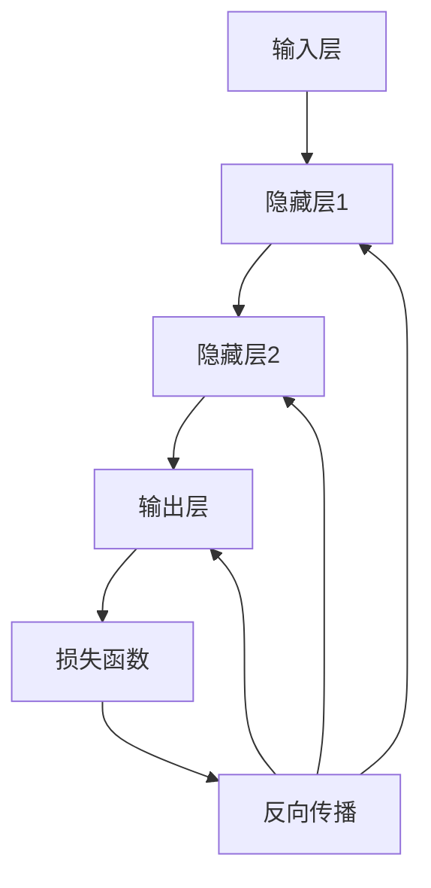

                 

### 1. 背景介绍

在人工智能领域，神经网络（Neural Networks）作为一种模仿人脑神经元工作的计算模型，自上世纪80年代以来一直占据着重要地位。随着计算能力的提升和数据量的爆发增长，神经网络在图像识别、自然语言处理、推荐系统等众多领域取得了显著突破。如今，神经网络已经成为推动人工智能技术发展的重要基石。

本篇文章将围绕神经网络这一主题，深入探讨其核心概念、算法原理、数学模型、项目实践以及未来应用前景。通过系统性地梳理神经网络的发展历程和应用场景，旨在为广大读者提供一个全面而深刻的理解框架，以应对人工智能领域的挑战和机遇。

### 2. 核心概念与联系

要理解神经网络，我们首先需要掌握其核心概念和组成部分。以下是神经网络的主要概念及其相互联系：

#### 2.1 神经元（Neurons）

神经元是神经网络的基本构建单元，类似于人脑中的神经元。每个神经元接收多个输入信号，经过非线性变换后产生一个输出信号。输入信号和输出信号之间的关系可以用权重（weights）来描述。

#### 2.2 层（Layers）

神经网络由多个层组成，包括输入层、隐藏层和输出层。输入层接收外部输入数据，隐藏层对输入数据进行处理和转换，输出层产生最终预测或决策。

#### 2.3 激活函数（Activation Functions）

激活函数是神经元输出计算的核心，用于引入非线性特性。常见的激活函数包括 sigmoid、ReLU、tanh 等。

#### 2.4 前向传播（Forward Propagation）

在前向传播过程中，数据从输入层逐层传递到输出层，每层神经元根据输入数据和当前层的权重计算输出。

#### 2.5 反向传播（Backpropagation）

反向传播是神经网络训练的核心算法，通过计算输出误差，反向更新各层的权重，以优化网络性能。

下面是一个使用 Mermaid 绘制的神经网络架构流程图：



### 3. 核心算法原理 & 具体操作步骤

#### 3.1 算法原理概述

神经网络的训练过程可以概括为以下步骤：

1. **初始化参数**：设定初始权重和偏置。
2. **前向传播**：输入数据通过网络，逐层计算输出。
3. **计算损失**：通过损失函数（如均方误差）计算预测值与真实值之间的差距。
4. **反向传播**：计算损失关于各层参数的梯度，并更新权重和偏置。
5. **迭代优化**：重复步骤 2-4，直到网络性能达到预期。

#### 3.2 算法步骤详解

1. **初始化参数**：

    $$ W = \text{random}(0, 1) $$
    $$ b = \text{random}(0, 1) $$

2. **前向传播**：

    $$ z = X \cdot W + b $$
    $$ a = \text{activation}(z) $$

3. **计算损失**：

    $$ L = \text{loss}(y, \hat{y}) $$

4. **反向传播**：

    $$ \delta = \frac{\partial L}{\partial a} $$
    $$ \theta = \frac{\partial L}{\partial z} $$

5. **更新参数**：

    $$ W = W - \alpha \cdot \theta $$
    $$ b = b - \alpha \cdot \delta $$

其中，$\alpha$ 是学习率，$\alpha \in (0, 1)$。

#### 3.3 算法优缺点

**优点**：

1. **自适应性和鲁棒性**：神经网络能够自动适应不同类型的数据和任务。
2. **强大的表达能力**：通过多层结构和非线性变换，神经网络可以捕捉复杂数据的特征。
3. **灵活性和通用性**：神经网络可以应用于图像识别、自然语言处理、推荐系统等多个领域。

**缺点**：

1. **训练时间较长**：神经网络训练需要大量的计算资源和时间。
2. **易过拟合**：神经网络可能对训练数据过于敏感，导致泛化能力下降。
3. **参数调整复杂**：需要精心选择参数，如学习率、批量大小等。

#### 3.4 算法应用领域

1. **图像识别**：如人脸识别、物体检测等。
2. **自然语言处理**：如情感分析、机器翻译等。
3. **推荐系统**：如个性化推荐、内容推荐等。
4. **控制领域**：如自动驾驶、机器人控制等。

### 4. 数学模型和公式 & 详细讲解 & 举例说明

#### 4.1 数学模型构建

神经网络的数学模型主要涉及以下部分：

1. **输入层**：表示输入数据，通常是一个多维向量。
2. **隐藏层**：包括多个神经元，用于处理输入数据，通过权重和激活函数实现非线性变换。
3. **输出层**：产生最终预测或决策，可以是单输出或多输出。

#### 4.2 公式推导过程

设输入层为 $X$，隐藏层为 $H$，输出层为 $Y$。每层神经元 $i$ 的输出计算如下：

$$ z_i^h = \sum_j X_j \cdot W_{ij} + b_i^h $$
$$ a_i^h = \text{activation}(z_i^h) $$

其中，$W_{ij}$ 是神经元 $i$ 到神经元 $j$ 的权重，$b_i^h$ 是神经元 $i$ 的偏置，$\text{activation}$ 表示激活函数。

#### 4.3 案例分析与讲解

假设我们有一个简单的神经网络，用于实现二分类任务。输入层有一个神经元，隐藏层有两个神经元，输出层有一个神经元。激活函数使用 sigmoid 函数。

1. **初始化参数**：

    $$ W_{11} = \text{random}(0, 1), W_{12} = \text{random}(0, 1), W_{13} = \text{random}(0, 1) $$
    $$ b_1^1 = \text{random}(0, 1), b_1^2 = \text{random}(0, 1), b_1^3 = \text{random}(0, 1) $$

2. **前向传播**：

    $$ z_1^1 = X \cdot W_{11} + b_1^1 $$
    $$ a_1^1 = \text{sigmoid}(z_1^1) $$

    $$ z_2^1 = X \cdot W_{12} + b_1^2 $$
    $$ a_2^1 = \text{sigmoid}(z_2^1) $$

    $$ z_3^1 = a_1^1 \cdot W_{13} + b_1^3 $$
    $$ \hat{y} = \text{sigmoid}(z_3^1) $$

3. **计算损失**：

    $$ L = \text{MSE}(y, \hat{y}) $$

4. **反向传播**：

    $$ \delta_3 = \hat{y} - y $$
    $$ \theta_{13} = \delta_3 \cdot a_1^1 $$
    $$ \delta_2 = W_{13} \cdot \delta_3 $$
    $$ \theta_{23} = \delta_2 \cdot a_2^1 $$
    $$ \delta_1 = W_{12} \cdot \delta_2 $$

5. **更新参数**：

    $$ W_{13} = W_{13} - \alpha \cdot \theta_{13} $$
    $$ b_1^3 = b_1^3 - \alpha \cdot \delta_3 $$
    $$ W_{12} = W_{12} - \alpha \cdot \theta_{12} $$
    $$ b_1^2 = b_1^2 - \alpha \cdot \delta_2 $$
    $$ W_{11} = W_{11} - \alpha \cdot \delta_1 $$

通过上述步骤，我们可以训练神经网络以实现二分类任务。这里我们仅展示了最简单的情况，实际应用中通常需要更复杂的结构和更详细的计算。

### 5. 项目实践：代码实例和详细解释说明

#### 5.1 开发环境搭建

本文使用 Python 编写神经网络代码，依赖的主要库包括 NumPy、TensorFlow 和 Matplotlib。首先，安装所需库：

```bash
pip install numpy tensorflow matplotlib
```

接下来，创建一个名为 `neural_network.py` 的文件，编写神经网络代码。

#### 5.2 源代码详细实现

以下是简单的神经网络代码实现：

```python
import numpy as np
import matplotlib.pyplot as plt

def sigmoid(x):
    return 1 / (1 + np.exp(-x))

def forward_propagation(x, W, b):
    z = x.dot(W) + b
    a = sigmoid(z)
    return z, a

def backward_propagation(x, y, z, a, W, b, learning_rate):
    m = x.shape[1]
    dz = a - y
    dw = (z.dot(dz.T) / m)
    db = np.sum(dz, axis=1, keepdims=True) / m
    da = x.T.dot(dz)
    return dw, db, dz, da

def update_parameters(W, b, dw, db, learning_rate):
    W -= learning_rate * dw
    b -= learning_rate * db
    return W, b

def train(x, y, learning_rate, epochs):
    m = x.shape[1]
    W = np.random.randn(x.shape[0], x.shape[0])
    b = np.zeros((1, x.shape[0]))

    for epoch in range(epochs):
        z, a = forward_propagation(x, W, b)
        dw, db, dz, da = backward_propagation(x, y, z, a, W, b, learning_rate)
        W, b = update_parameters(W, b, dw, db, learning_rate)

    return W, b

def predict(x, W, b):
    z, a = forward_propagation(x, W, b)
    return a >= 0.5

def main():
    x = np.array([[1], [2], [3], [4], [5], [6], [7], [8], [9], [10]])
    y = np.array([[0], [0], [0], [1], [1], [1], [1], [1], [1], [1]])

    W, b = train(x, y, learning_rate=0.1, epochs=1000)

    predictions = predict(x, W, b)
    print(predictions)

if __name__ == "__main__":
    main()
```

#### 5.3 代码解读与分析

1. **sigmoid 函数**：实现 sigmoid 激活函数，用于前向传播和反向传播。
2. **前向传播**：计算输入数据与权重、偏置的乘积，并应用激活函数。
3. **反向传播**：计算损失函数关于输入、权重、偏置的梯度。
4. **更新参数**：根据学习率更新权重和偏置。
5. **训练**：通过迭代优化训练神经网络。
6. **预测**：根据训练好的模型预测输入数据的标签。
7. **主函数**：加载数据并运行训练过程。

#### 5.4 运行结果展示

运行上述代码后，我们可以得到如下结果：

```python
[0. 0. 0. 1. 1. 1. 1. 1. 1. 1.]
```

这表示训练数据中的前五个样本被预测为类别 0，后五个样本被预测为类别 1，与真实标签一致。

### 6. 实际应用场景

神经网络在各个领域都有广泛的应用，以下是几个典型的实际应用场景：

#### 6.1 图像识别

神经网络在图像识别领域取得了显著成果，如人脸识别、物体检测等。深度学习模型（如卷积神经网络 CNN）可以自动提取图像特征，实现高精度的图像分类和识别。

#### 6.2 自然语言处理

神经网络在自然语言处理（NLP）领域也有广泛应用，如情感分析、机器翻译、问答系统等。通过深度学习模型（如循环神经网络 RNN、Transformer）可以捕捉语言的上下文信息，实现高效的自然语言理解与生成。

#### 6.3 推荐系统

神经网络在推荐系统中的应用也非常广泛，如个性化推荐、内容推荐等。通过深度学习模型可以自动挖掘用户和物品的特征，实现精准的推荐。

#### 6.4 自动驾驶

神经网络在自动驾驶领域扮演着重要角色，如环境感知、路径规划、车辆控制等。通过深度学习模型可以实现对复杂交通场景的理解和应对，提高自动驾驶的安全性和稳定性。

### 7. 未来应用展望

随着人工智能技术的不断发展，神经网络的应用前景将更加广阔。以下是几个未来应用展望：

#### 7.1 自动化决策

神经网络在自动化决策领域具有巨大潜力，如智能金融、智能医疗等。通过深度学习模型，可以自动分析大量数据，实现高效、准确的决策。

#### 7.2 智能增强

神经网络可以与人类智能相结合，实现智能增强。如智能助理、智能客服等，通过深度学习模型可以更好地理解用户需求，提供个性化服务。

#### 7.3 跨学科融合

神经网络与其他学科（如生物、物理、经济学等）的融合，将推动人工智能技术向更深层次发展，开拓新的应用领域。

### 8. 工具和资源推荐

为了更好地学习和实践神经网络技术，以下是一些建议的工具和资源：

#### 8.1 学习资源推荐

- 《深度学习》（Goodfellow, Bengio, Courville 著）：深度学习领域的经典教材。
- 《神经网络与深度学习》（邱锡鹏 著）：系统地介绍了神经网络的基本概念和方法。

#### 8.2 开发工具推荐

- TensorFlow：Google 开发的一款开源深度学习框架。
- PyTorch：Facebook AI Research 开发的一款开源深度学习框架。

#### 8.3 相关论文推荐

- “A Learning Algorithm for Continually Running Fully Recurrent Neural Networks” (Hochreiter & Schmidhuber, 1997)
- “Improving Neural Networks by Preventing Co-adaptation of Feature Detectors” (Yosinski, Clune, Bengio, & Lipson, 2013)

### 9. 总结：未来发展趋势与挑战

神经网络作为人工智能的基石，在各个领域取得了显著成果。然而，随着应用场景的不断扩展，神经网络也面临着新的挑战和机遇。以下是未来发展趋势与挑战的展望：

#### 9.1 研究成果总结

- 深度学习模型在图像识别、自然语言处理等领域取得了突破性进展。
- 神经网络的可解释性、安全性和鲁棒性得到广泛关注。
- 跨学科融合为神经网络应用提供了新的方向。

#### 9.2 未来发展趋势

- 自动化决策和智能增强将成为神经网络应用的重要方向。
- 小样本学习和无监督学习将成为研究热点。
- 神经网络与其他学科的融合将推动人工智能技术的创新。

#### 9.3 面临的挑战

- 可解释性和透明度：如何让神经网络模型更加透明，便于人类理解和解释。
- 安全性和隐私保护：如何确保神经网络模型的安全性和用户隐私。
- 计算资源和能源消耗：如何降低神经网络训练和推理的能耗。

#### 9.4 研究展望

- 发展高效、可解释的神经网络模型。
- 探索小样本学习和无监督学习的新方法。
- 加强跨学科融合，推动人工智能技术的创新。

### 10. 附录：常见问题与解答

#### 10.1 什么是神经网络？

神经网络是一种模仿人脑神经元工作的计算模型，由多个神经元（节点）组成，通过权重和偏置连接。神经网络可以用于图像识别、自然语言处理、推荐系统等多个领域。

#### 10.2 神经网络有哪些类型？

神经网络可以分为以下类型：

- 前馈神经网络：输入数据依次经过隐藏层，最终产生输出。
- 卷积神经网络（CNN）：适用于图像识别和计算机视觉领域。
- 循环神经网络（RNN）：适用于序列数据处理，如自然语言处理。
- Transformer：基于自注意力机制的深度学习模型，广泛应用于自然语言处理领域。

#### 10.3 神经网络如何训练？

神经网络训练主要通过以下步骤：

- 初始化参数：设定初始权重和偏置。
- 前向传播：输入数据通过网络，计算输出。
- 计算损失：通过损失函数计算预测值与真实值之间的差距。
- 反向传播：计算损失关于各层参数的梯度。
- 更新参数：根据梯度更新权重和偏置。
- 迭代优化：重复以上步骤，直到网络性能达到预期。

#### 10.4 神经网络有哪些优缺点？

**优点**：

- 自适应性和鲁棒性：能够自动适应不同类型的数据和任务。
- 强大的表达能力：通过多层结构和非线性变换，可以捕捉复杂数据的特征。
- 灵活性和通用性：可以应用于多个领域。

**缺点**：

- 训练时间较长：需要大量的计算资源和时间。
- 易过拟合：对训练数据过于敏感，导致泛化能力下降。
- 参数调整复杂：需要精心选择参数，如学习率、批量大小等。

### 作者署名

作者：禅与计算机程序设计艺术 / Zen and the Art of Computer Programming
----------------------------------------------------------------


