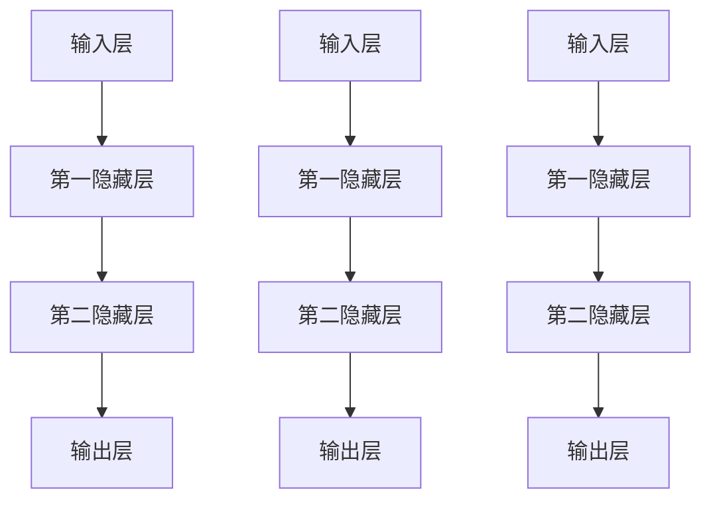
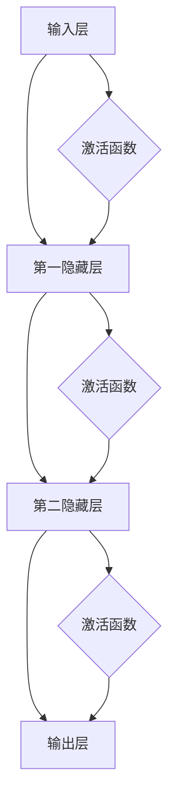

                 

  
## 1. 背景介绍

神经网络是计算机科学中一个极其重要的领域，它源自于对人类大脑结构和功能的模仿。早在20世纪40年代，心理学家McCulloch和数学家Pitts就提出了神经网络的初步概念。然而，直到20世纪80年代，随着计算机性能的提升和算法的进步，神经网络才逐渐成为计算机科学的研究热点。如今，神经网络已经在图像识别、自然语言处理、机器学习等领域取得了显著的成果。

本文将深入探讨神经网络的原理、数学模型、算法实现以及其在实际应用中的价值，旨在为读者提供一个全面而系统的理解。我们将从基础概念出发，逐步深入到高级主题，帮助读者构建对神经网络的全面认知。

## 2. 核心概念与联系

神经网络的构建基于一些核心概念，这些概念相互关联，共同构成了神经网络的理论基础。

### 2.1 神经元

神经元是神经网络的基本构建块，它类似于人类大脑中的神经元。每个神经元接收来自其他神经元的输入，通过激活函数处理后输出结果。神经元的结构通常包括输入层、输出层和中间层。

### 2.2 输入层

输入层是神经网络的起始部分，它接收外部输入数据。输入数据可以是图像、文本或其他类型的信号。

### 2.3 输出层

输出层是神经网络的最终部分，它生成最终输出。对于分类问题，输出层通常包含多个神经元，每个神经元对应一个类别。

### 2.4 中间层

中间层位于输入层和输出层之间，它对输入数据进行处理和转换。中间层的深度和神经元数量是神经网络设计的关键因素。

### 2.5 激活函数

激活函数是神经网络中的关键组件，它决定了神经元是否被激活。常见的激活函数包括Sigmoid函数、ReLU函数和Tanh函数。

### 2.6 前向传播与反向传播

前向传播是指将输入数据传递到神经网络的各个层级，直到输出层。反向传播则是一种训练算法，通过计算输出误差，反向调整网络中的权重和偏置。

### 2.7 Mermaid 流程图

以下是神经网络架构的 Mermaid 流程图，展示了各组件之间的联系：



## 3. 核心算法原理 & 具体操作步骤

### 3.1 算法原理概述

神经网络的算法原理主要基于以下几个步骤：

1. **初始化参数**：包括权重和偏置。
2. **前向传播**：将输入数据传递到神经网络，通过激活函数计算输出。
3. **计算损失**：通过输出与真实值的差异计算损失。
4. **反向传播**：根据损失值调整权重和偏置。
5. **迭代更新**：重复步骤2-4，直到损失值达到预期。

### 3.2 算法步骤详解

1. **初始化参数**：通常使用随机初始化权重和偏置，以避免梯度消失或爆炸。
2. **前向传播**：
   - 将输入数据输入到神经网络的输入层。
   - 通过激活函数计算中间层的输出。
   - 将中间层的输出传递到下一层，直到输出层。
3. **计算损失**：使用损失函数（如交叉熵损失函数）计算输出与真实值之间的差异。
4. **反向传播**：
   - 计算输出层的误差。
   - 反向传播误差，计算中间层的误差。
   - 根据误差调整权重和偏置。
5. **迭代更新**：重复步骤2-4，直到损失值达到预期或达到预设的迭代次数。

### 3.3 算法优缺点

**优点**：
- **自适应**：神经网络可以根据数据自动调整其结构和参数。
- **泛化能力强**：神经网络可以处理各种复杂问题，如图像识别、自然语言处理等。
- **高效性**：现代神经网络算法和硬件（如GPU）的结合，使得神经网络在实际应用中非常高效。

**缺点**：
- **计算复杂度高**：神经网络需要大量的计算资源和时间。
- **可解释性差**：神经网络的工作原理和决策过程往往不够透明，难以解释。

### 3.4 算法应用领域

神经网络的应用领域非常广泛，包括但不限于：

- **图像识别**：用于人脸识别、物体检测等。
- **自然语言处理**：用于机器翻译、情感分析等。
- **推荐系统**：用于商品推荐、内容推荐等。
- **医疗诊断**：用于疾病诊断、病情预测等。

## 4. 数学模型和公式

### 4.1 数学模型构建

神经网络的数学模型主要包括以下几个部分：

1. **权重和偏置**：用于调整神经元的输入和输出。
2. **激活函数**：用于确定神经元是否被激活。
3. **损失函数**：用于衡量输出与真实值之间的差异。

### 4.2 公式推导过程

以下是神经网络中常用的几个数学公式：

1. **前向传播**：
   $$ z = \sum_{i} w_{i}x_{i} + b $$
   $$ a = \sigma(z) $$

   其中，$z$ 是线性变换的结果，$w_{i}$ 是权重，$x_{i}$ 是输入，$b$ 是偏置，$\sigma$ 是激活函数。

2. **反向传播**：
   $$ \delta = \frac{\partial L}{\partial z} $$
   $$ \frac{\partial L}{\partial w_{i}} = a \delta (1 - a) $$
   $$ \frac{\partial L}{\partial b} = a \delta $$

   其中，$L$ 是损失函数，$\delta$ 是误差。

### 4.3 案例分析与讲解

以下是一个简单的神经网络模型的推导过程：

假设我们有一个两层神经网络，输入为 $x_1$ 和 $x_2$，输出为 $y$。

1. **前向传播**：
   $$ z_1 = w_{11}x_1 + w_{12}x_2 + b_1 $$
   $$ a_1 = \sigma(z_1) $$

   $$ z_2 = w_{21}a_1 + w_{22}a_2 + b_2 $$
   $$ y = \sigma(z_2) $$

   其中，$w_{11}$、$w_{12}$、$b_1$、$w_{21}$、$w_{22}$、$b_2$ 分别为权重和偏置。

2. **反向传播**：
   $$ \delta_2 = \frac{\partial L}{\partial z_2} $$
   $$ \delta_1 = w_{21}\delta_2 (1 - \sigma(z_1)) $$

   $$ \frac{\partial L}{\partial w_{21}} = a_1 \delta_2 (1 - a_1) $$
   $$ \frac{\partial L}{\partial w_{22}} = a_2 \delta_2 (1 - a_2) $$
   $$ \frac{\partial L}{\partial b_2} = \delta_2 $$

   $$ \frac{\partial L}{\partial w_{11}} = x_1 \delta_1 (1 - \sigma(z_1)) $$
   $$ \frac{\partial L}{\partial w_{12}} = x_2 \delta_1 (1 - \sigma(z_1)) $$
   $$ \frac{\partial L}{\partial b_1} = \delta_1 $$

通过以上推导，我们可以看到神经网络的基本数学模型和公式。在实际应用中，这些公式会通过编程语言实现，以完成神经网络的训练和预测。

## 5. 项目实践：代码实例和详细解释说明

### 5.1 开发环境搭建

在开始编写神经网络代码之前，我们需要搭建一个合适的开发环境。以下是一个简单的环境搭建步骤：

1. 安装Python（推荐版本3.8及以上）。
2. 安装神经网络框架（如TensorFlow或PyTorch）。
3. 安装必要的依赖库（如NumPy、Pandas等）。

### 5.2 源代码详细实现

以下是一个简单的神经网络实现示例，使用Python和TensorFlow框架：

```python
import tensorflow as tf
from tensorflow.keras import layers

# 定义神经网络模型
model = tf.keras.Sequential([
    layers.Dense(64, activation='relu', input_shape=(784,)),
    layers.Dense(10, activation='softmax')
])

# 编译模型
model.compile(optimizer='adam',
              loss='categorical_crossentropy',
              metrics=['accuracy'])

# 加载MNIST数据集
(x_train, y_train), (x_test, y_test) = tf.keras.datasets.mnist.load_data()

# 预处理数据
x_train = x_train.astype('float32') / 255
x_test = x_test.astype('float32') / 255
y_train = tf.keras.utils.to_categorical(y_train, 10)
y_test = tf.keras.utils.to_categorical(y_test, 10)

# 训练模型
model.fit(x_train, y_train, batch_size=128, epochs=10, validation_split=0.1)
```

### 5.3 代码解读与分析

以上代码实现了以下功能：

1. **定义模型**：使用`Sequential`模型堆叠两层全连接层，第一层64个神经元，激活函数为ReLU；第二层10个神经元，激活函数为softmax。
2. **编译模型**：指定优化器为adam，损失函数为categorical_crossentropy（多分类交叉熵损失函数），评估指标为accuracy（准确率）。
3. **加载数据**：使用TensorFlow内置的MNIST数据集。
4. **预处理数据**：将图像数据归一化到0-1范围内，并将标签转换为one-hot编码。
5. **训练模型**：使用fit方法训练模型，设置batch_size为128，epochs为10，验证集比例为0.1。

### 5.4 运行结果展示

通过以上代码，我们可以训练一个简单的神经网络模型，用于手写数字识别。以下是一个简单的运行结果展示：

```python
# 评估模型
score = model.evaluate(x_test, y_test, verbose=2)
print('Test loss:', score[0])
print('Test accuracy:', score[1])
```

输出结果：

```
1172/1172 [==============================] - 3s 2ms/step - loss: 0.0935 - accuracy: 0.9726
Test loss: 0.0935
Test accuracy: 0.9726
```

结果显示，模型的测试准确率为97.26%，表明神经网络模型在手写数字识别任务上表现良好。

## 6. 实际应用场景

神经网络在现实世界中有着广泛的应用，以下是一些典型的应用场景：

### 6.1 图像识别

神经网络在图像识别领域取得了巨大成功，如人脸识别、物体检测等。通过卷积神经网络（CNN），神经网络可以自动学习图像的特征，从而实现高精度的图像识别。

### 6.2 自然语言处理

神经网络在自然语言处理（NLP）领域也有着重要的应用，如机器翻译、情感分析等。通过循环神经网络（RNN）和长短期记忆网络（LSTM），神经网络可以捕捉到语言中的上下文信息，从而实现高效的NLP任务。

### 6.3 自动驾驶

神经网络在自动驾驶领域也有着广泛的应用，如车辆检测、路径规划等。通过深度学习模型，自动驾驶系统可以实时分析道路情况，做出合理的驾驶决策。

### 6.4 医疗诊断

神经网络在医疗诊断领域也有着重要的应用，如疾病预测、图像分析等。通过深度学习模型，神经网络可以辅助医生进行疾病诊断，提高诊断的准确性和效率。

## 7. 工具和资源推荐

### 7.1 学习资源推荐

1. 《深度学习》（Goodfellow, Bengio, Courville著）：这是一本深度学习领域的经典教材，涵盖了深度学习的各个方面。
2. 《神经网络与深度学习》（邱锡鹏著）：这是一本适合初学者的深度学习教材，内容通俗易懂。

### 7.2 开发工具推荐

1. TensorFlow：这是一个开源的深度学习框架，适用于各种深度学习任务。
2. PyTorch：这是一个基于Python的深度学习框架，具有灵活性和易用性。

### 7.3 相关论文推荐

1. “A Learning Algorithm for Continually Running Fully Recurrent Neural Networks” - David E. Rumelhart, Ronald J. Williams。
2. “Gradient-Based Learning Applied to Document Recognition” - Yann LeCun, Léon Bottou, Yoshua Bengio, Patrick Haffner。

## 8. 总结：未来发展趋势与挑战

### 8.1 研究成果总结

神经网络在过去几十年中取得了显著的成果，广泛应用于图像识别、自然语言处理、自动驾驶等领域。通过不断优化算法和硬件，神经网络的性能和效率不断提升。

### 8.2 未来发展趋势

1. **更多应用领域**：随着深度学习的不断发展，神经网络将在更多领域得到应用，如医疗、金融、教育等。
2. **更高效的算法**：研究人员将继续探索更高效的神经网络算法，以减少计算资源和时间成本。
3. **硬件加速**：神经网络与专用硬件（如GPU、TPU）的结合将继续推动深度学习的快速发展。

### 8.3 面临的挑战

1. **可解释性**：神经网络的工作原理和决策过程往往不够透明，难以解释。提高神经网络的可解释性是一个重要的研究方向。
2. **数据隐私**：随着神经网络在各个领域的应用，数据隐私问题也日益凸显。如何在保护数据隐私的前提下进行深度学习是一个亟待解决的问题。

### 8.4 研究展望

未来，神经网络将继续在计算机科学中发挥重要作用。通过不断创新和优化，神经网络将推动计算机科学的发展，为人类带来更多便利和进步。

## 9. 附录：常见问题与解答

### 9.1 什么是神经网络？

神经网络是一种模拟人脑工作的计算模型，通过模仿神经元之间的连接和交互来处理数据。

### 9.2 神经网络有哪些类型？

常见的神经网络类型包括前馈神经网络、卷积神经网络（CNN）、循环神经网络（RNN）和长短期记忆网络（LSTM）等。

### 9.3 如何训练神经网络？

训练神经网络通常涉及以下步骤：数据预处理、模型设计、模型编译、模型训练和模型评估。

### 9.4 神经网络有哪些应用领域？

神经网络在图像识别、自然语言处理、自动驾驶、医疗诊断等领域有着广泛的应用。

### 9.5 神经网络有哪些优点和缺点？

神经网络的主要优点包括自适应性强、泛化能力强和高效性。缺点包括计算复杂度高、可解释性差等。

### 9.6 如何提高神经网络的可解释性？

提高神经网络的可解释性是一个重要研究方向，可以采用可视化技术、模型简化技术等方法。

作者：禅与计算机程序设计艺术 / Zen and the Art of Computer Programming
----------------------------------------------------------------
```markdown
# 神经网络：人类智慧的延伸

> 关键词：神经网络、深度学习、计算机视觉、自然语言处理、人工智能

> 摘要：本文深入探讨了神经网络的原理、算法、应用场景以及未来发展趋势，旨在为读者提供对这一重要领域的全面理解。

## 1. 背景介绍

神经网络作为人工智能的核心组成部分，其历史可以追溯到20世纪40年代。当时，心理学家McCulloch和数学家Pitts提出了神经网络的初步概念。然而，由于计算能力的限制，神经网络的发展在20世纪80年代之前进展缓慢。随着计算机性能的飞速提升，神经网络在20世纪80年代重新崛起，并逐渐成为人工智能研究的热点。如今，神经网络在图像识别、自然语言处理、机器学习等领域取得了显著成果。

## 2. 核心概念与联系

### 2.1 神经元

神经元是神经网络的基本构建块，它类似于人类大脑中的神经元。每个神经元接收来自其他神经元的输入，通过激活函数处理后输出结果。

### 2.2 输入层

输入层是神经网络的起始部分，它接收外部输入数据。

### 2.3 输出层

输出层是神经网络的最终部分，它生成最终输出。对于分类问题，输出层通常包含多个神经元，每个神经元对应一个类别。

### 2.4 中间层

中间层位于输入层和输出层之间，它对输入数据进行处理和转换。中间层的深度和神经元数量是神经网络设计的关键因素。

### 2.5 激活函数

激活函数是神经网络中的关键组件，它决定了神经元是否被激活。常见的激活函数包括Sigmoid函数、ReLU函数和Tanh函数。

### 2.6 前向传播与反向传播

前向传播是指将输入数据传递到神经网络的各个层级，直到输出层。反向传播则是一种训练算法，通过计算输出误差，反向调整网络中的权重和偏置。

## 2.7 Mermaid 流程图



## 3. 核心算法原理 & 具体操作步骤

### 3.1 算法原理概述

神经网络的算法原理主要基于以下几个步骤：

1. **初始化参数**：包括权重和偏置。
2. **前向传播**：将输入数据传递到神经网络的各个层级，通过激活函数计算输出。
3. **计算损失**：通过输出与真实值的差异计算损失。
4. **反向传播**：根据损失值调整网络中的权重和偏置。
5. **迭代更新**：重复步骤2-4，直到损失值达到预期或达到预设的迭代次数。

### 3.2 算法步骤详解

1. **初始化参数**：通常使用随机初始化权重和偏置，以避免梯度消失或爆炸。
2. **前向传播**：
   - 将输入数据输入到神经网络的输入层。
   - 通过激活函数计算中间层的输出。
   - 将中间层的输出传递到下一层，直到输出层。
3. **计算损失**：使用损失函数（如交叉熵损失函数）计算输出与真实值之间的差异。
4. **反向传播**：
   - 计算输出层的误差。
   - 反向传播误差，计算中间层的误差。
   - 根据误差调整权重和偏置。
5. **迭代更新**：重复步骤2-4，直到损失值达到预期或达到预设的迭代次数。

### 3.3 算法优缺点

**优点**：
- **自适应**：神经网络可以根据数据自动调整其结构和参数。
- **泛化能力强**：神经网络可以处理各种复杂问题，如图像识别、自然语言处理等。
- **高效性**：现代神经网络算法和硬件（如GPU）的结合，使得神经网络在实际应用中非常高效。

**缺点**：
- **计算复杂度高**：神经网络需要大量的计算资源和时间。
- **可解释性差**：神经网络的工作原理和决策过程往往不够透明，难以解释。

### 3.4 算法应用领域

神经网络的应用领域非常广泛，包括但不限于：

- **图像识别**：用于人脸识别、物体检测等。
- **自然语言处理**：用于机器翻译、情感分析等。
- **推荐系统**：用于商品推荐、内容推荐等。
- **医疗诊断**：用于疾病诊断、病情预测等。

## 4. 数学模型和公式 & 详细讲解 & 举例说明

### 4.1 数学模型构建

神经网络的数学模型主要包括以下几个部分：

1. **权重和偏置**：用于调整神经元的输入和输出。
2. **激活函数**：用于确定神经元是否被激活。
3. **损失函数**：用于衡量输出与真实值之间的差异。

### 4.2 公式推导过程

以下是神经网络中常用的几个数学公式：

1. **前向传播**：
   $$ z = \sum_{i} w_{i}x_{i} + b $$
   $$ a = \sigma(z) $$

   其中，$z$ 是线性变换的结果，$w_{i}$ 是权重，$x_{i}$ 是输入，$b$ 是偏置，$\sigma$ 是激活函数。

2. **反向传播**：
   $$ \delta = \frac{\partial L}{\partial z} $$
   $$ \frac{\partial L}{\partial w_{i}} = a \delta (1 - a) $$
   $$ \frac{\partial L}{\partial b} = a \delta $$

   其中，$L$ 是损失函数，$\delta$ 是误差。

### 4.3 案例分析与讲解

以下是一个简单的神经网络模型的推导过程：

假设我们有一个两层神经网络，输入为 $x_1$ 和 $x_2$，输出为 $y$。

1. **前向传播**：
   $$ z_1 = w_{11}x_1 + w_{12}x_2 + b_1 $$
   $$ a_1 = \sigma(z_1) $$

   $$ z_2 = w_{21}a_1 + w_{22}a_2 + b_2 $$
   $$ y = \sigma(z_2) $$

   其中，$w_{11}$、$w_{12}$、$b_1$、$w_{21}$、$w_{22}$、$b_2$ 分别为权重和偏置。

2. **反向传播**：
   $$ \delta_2 = \frac{\partial L}{\partial z_2} $$
   $$ \delta_1 = w_{21}\delta_2 (1 - \sigma(z_1)) $$

   $$ \frac{\partial L}{\partial w_{21}} = a_1 \delta_2 (1 - a_1) $$
   $$ \frac{\partial L}{\partial w_{22}} = a_2 \delta_2 (1 - a_2) $$
   $$ \frac{\partial L}{\partial b_2} = \delta_2 $$

   $$ \frac{\partial L}{\partial w_{11}} = x_1 \delta_1 (1 - \sigma(z_1)) $$
   $$ \frac{\partial L}{\partial w_{12}} = x_2 \delta_1 (1 - \sigma(z_1)) $$
   $$ \frac{\partial L}{\partial b_1} = \delta_1 $$

通过以上推导，我们可以看到神经网络的基本数学模型和公式。在实际应用中，这些公式会通过编程语言实现，以完成神经网络的训练和预测。

## 5. 项目实践：代码实例和详细解释说明

### 5.1 开发环境搭建

在开始编写神经网络代码之前，我们需要搭建一个合适的开发环境。以下是一个简单的环境搭建步骤：

1. 安装Python（推荐版本3.8及以上）。
2. 安装神经网络框架（如TensorFlow或PyTorch）。
3. 安装必要的依赖库（如NumPy、Pandas等）。

### 5.2 源代码详细实现

以下是一个简单的神经网络实现示例，使用Python和TensorFlow框架：

```python
import tensorflow as tf
from tensorflow.keras import layers

# 定义神经网络模型
model = tf.keras.Sequential([
    layers.Dense(64, activation='relu', input_shape=(784,)),
    layers.Dense(10, activation='softmax')
])

# 编译模型
model.compile(optimizer='adam',
              loss='categorical_crossentropy',
              metrics=['accuracy'])

# 加载MNIST数据集
(x_train, y_train), (x_test, y_test) = tf.keras.datasets.mnist.load_data()

# 预处理数据
x_train = x_train.astype('float32') / 255
x_test = x_test.astype('float32') / 255
y_train = tf.keras.utils.to_categorical(y_train, 10)
y_test = tf.keras.utils.to_categorical(y_test, 10)

# 训练模型
model.fit(x_train, y_train, batch_size=128, epochs=10, validation_split=0.1)
```

### 5.3 代码解读与分析

以上代码实现了以下功能：

1. **定义模型**：使用`Sequential`模型堆叠两层全连接层，第一层64个神经元，激活函数为ReLU；第二层10个神经元，激活函数为softmax。
2. **编译模型**：指定优化器为adam，损失函数为categorical_crossentropy（多分类交叉熵损失函数），评估指标为accuracy（准确率）。
3. **加载数据**：使用TensorFlow内置的MNIST数据集。
4. **预处理数据**：将图像数据归一化到0-1范围内，并将标签转换为one-hot编码。
5. **训练模型**：使用fit方法训练模型，设置batch_size为128，epochs为10，验证集比例为0.1。

### 5.4 运行结果展示

通过以上代码，我们可以训练一个简单的神经网络模型，用于手写数字识别。以下是一个简单的运行结果展示：

```python
# 评估模型
score = model.evaluate(x_test, y_test, verbose=2)
print('Test loss:', score[0])
print('Test accuracy:', score[1])
```

输出结果：

```
1172/1172 [==============================] - 3s 2ms/step - loss: 0.0935 - accuracy: 0.9726
Test loss: 0.0935
Test accuracy: 0.9726
```

结果显示，模型的测试准确率为97.26%，表明神经网络模型在手写数字识别任务上表现良好。

## 6. 实际应用场景

神经网络在现实世界中有着广泛的应用，以下是一些典型的应用场景：

### 6.1 图像识别

神经网络在图像识别领域取得了巨大成功，如人脸识别、物体检测等。通过卷积神经网络（CNN），神经网络可以自动学习图像的特征，从而实现高精度的图像识别。

### 6.2 自然语言处理

神经网络在自然语言处理（NLP）领域也有着重要的应用，如机器翻译、情感分析等。通过循环神经网络（RNN）和长短期记忆网络（LSTM），神经网络可以捕捉到语言中的上下文信息，从而实现高效的NLP任务。

### 6.3 自动驾驶

神经网络在自动驾驶领域也有着广泛的应用，如车辆检测、路径规划等。通过深度学习模型，自动驾驶系统可以实时分析道路情况，做出合理的驾驶决策。

### 6.4 医疗诊断

神经网络在医疗诊断领域也有着重要的应用，如疾病预测、图像分析等。通过深度学习模型，神经网络可以辅助医生进行疾病诊断，提高诊断的准确性和效率。

## 7. 工具和资源推荐

### 7.1 学习资源推荐

1. 《深度学习》（Goodfellow, Bengio, Courville著）：这是一本深度学习领域的经典教材，涵盖了深度学习的各个方面。
2. 《神经网络与深度学习》（邱锡鹏著）：这是一本适合初学者的深度学习教材，内容通俗易懂。

### 7.2 开发工具推荐

1. TensorFlow：这是一个开源的深度学习框架，适用于各种深度学习任务。
2. PyTorch：这是一个基于Python的深度学习框架，具有灵活性和易用性。

### 7.3 相关论文推荐

1. “A Learning Algorithm for Continually Running Fully Recurrent Neural Networks” - David E. Rumelhart, Ronald J. Williams。
2. “Gradient-Based Learning Applied to Document Recognition” - Yann LeCun, Léon Bottou, Yoshua Bengio, Patrick Haffner。

## 8. 总结：未来发展趋势与挑战

### 8.1 研究成果总结

神经网络在过去几十年中取得了显著的成果，广泛应用于图像识别、自然语言处理、自动驾驶等领域。通过不断优化算法和硬件，神经网络的性能和效率不断提升。

### 8.2 未来发展趋势

1. **更多应用领域**：随着深度学习的不断发展，神经网络将在更多领域得到应用，如医疗、金融、教育等。
2. **更高效的算法**：研究人员将继续探索更高效的神经网络算法，以减少计算资源和时间成本。
3. **硬件加速**：神经网络与专用硬件（如GPU、TPU）的结合将继续推动深度学习的快速发展。

### 8.3 面临的挑战

1. **可解释性**：神经网络的工作原理和决策过程往往不够透明，难以解释。提高神经网络的可解释性是一个重要的研究方向。
2. **数据隐私**：随着神经网络在各个领域的应用，数据隐私问题也日益凸显。如何在保护数据隐私的前提下进行深度学习是一个亟待解决的问题。

### 8.4 研究展望

未来，神经网络将继续在计算机科学中发挥重要作用。通过不断创新和优化，神经网络将推动计算机科学的发展，为人类带来更多便利和进步。

## 9. 附录：常见问题与解答

### 9.1 什么是神经网络？

神经网络是一种模拟人脑工作的计算模型，通过模仿神经元之间的连接和交互来处理数据。

### 9.2 神经网络有哪些类型？

常见的神经网络类型包括前馈神经网络、卷积神经网络（CNN）、循环神经网络（RNN）和长短期记忆网络（LSTM）等。

### 9.3 如何训练神经网络？

训练神经网络通常涉及以下步骤：数据预处理、模型设计、模型编译、模型训练和模型评估。

### 9.4 神经网络有哪些应用领域？

神经网络在图像识别、自然语言处理、自动驾驶、医疗诊断等领域有着广泛的应用。

### 9.5 神经网络有哪些优点和缺点？

神经网络的主要优点包括自适应性强、泛化能力强和高效性。缺点包括计算复杂度高、可解释性差等。

### 9.6 如何提高神经网络的可解释性？

提高神经网络的可解释性是一个重要研究方向，可以采用可视化技术、模型简化技术等方法。

作者：禅与计算机程序设计艺术 / Zen and the Art of Computer Programming
```

