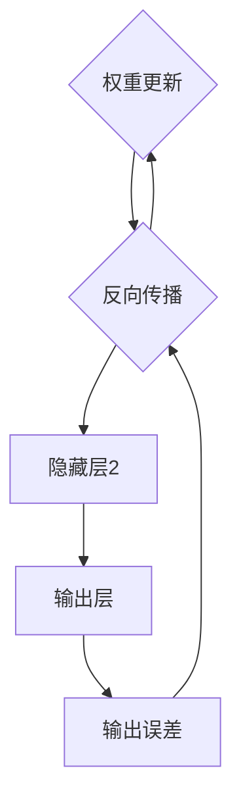

                 

关键词：神经网络，机器学习，深度学习，人工智能，智能计算

> 摘要：本文将深入探讨神经网络的原理、构建方法、数学模型以及实际应用，旨在为读者呈现神经网络如何开启智能新纪元，并在未来的发展中扮演关键角色。

## 1. 背景介绍

### 1.1 神经网络的起源与发展

神经网络这一概念最早可以追溯到1943年，由心理学家沃伦·麦卡洛克（Warren McCulloch）和数理逻辑学家沃尔特·皮茨（Walter Pitts）提出。他们在论文《一个神经活动模型》中描述了一种简化的人工神经网络模型。随后，1958年，弗兰克·罗森布拉特（Frank Rosenblatt）提出了感知机（Perceptron）模型，这是第一个能够通过训练学习线性可分问题的神经网络模型。

在接下来的几十年里，由于计算能力和算法的限制，神经网络的发展较为缓慢。直到20世纪80年代末至90年代初，随着计算机性能的显著提升和优化算法的提出，神经网络研究重新焕发了生机。特别是1998年，深度信念网络（Deep Belief Networks, DBN）的提出，标志着神经网络研究进入了一个新的阶段。

### 1.2 神经网络的应用领域

随着技术的进步，神经网络的应用领域逐渐扩展。目前，神经网络在以下几个领域表现尤为突出：

1. **图像识别**：神经网络在图像识别中的应用取得了显著的成果，如人脸识别、物体检测等。
2. **自然语言处理**：神经网络在自然语言处理（NLP）领域有着广泛的应用，包括文本分类、机器翻译、情感分析等。
3. **语音识别**：神经网络在语音识别中扮演着重要角色，使得语音识别系统更加准确和智能。
4. **推荐系统**：神经网络在推荐系统中被用于用户行为分析，提高推荐系统的准确性。
5. **自动驾驶**：神经网络在自动驾驶技术中用于环境感知、路径规划和决策等环节。

## 2. 核心概念与联系

### 2.1 神经网络的定义

神经网络（Neural Network，简称NN）是由大量简单的神经元（neuronal units）通过复杂的方式连接而成的网络，它可以对输入信息进行处理、存储和传输。神经网络的灵感来源于生物神经网络，尤其是人类大脑。

### 2.2 神经网络的组成

一个典型的神经网络包含以下几个主要部分：

1. **输入层（Input Layer）**：接收外部输入信息。
2. **隐藏层（Hidden Layers）**：对输入信息进行加工处理，可以有一个或多个。
3. **输出层（Output Layer）**：生成最终的输出结果。

### 2.3 神经网络的运作原理

神经网络通过前向传播（Forward Propagation）和反向传播（Backpropagation）两个过程来学习输入和输出之间的映射关系。

- **前向传播**：输入信号从输入层传递到隐藏层，再传递到输出层。
- **反向传播**：根据输出误差，将误差信号反向传递到隐藏层和输入层，更新各层的权重和偏置。

### 2.4 Mermaid 流程图



## 3. 核心算法原理 & 具体操作步骤

### 3.1 算法原理概述

神经网络的核心算法是反向传播算法（Backpropagation Algorithm）。反向传播算法是一种通过计算输出误差，并利用梯度下降法（Gradient Descent）更新网络权重和偏置的优化算法。

### 3.2 算法步骤详解

1. **初始化权重和偏置**：随机初始化网络中的权重和偏置。
2. **前向传播**：将输入信号传递到输出层，计算输出结果。
3. **计算误差**：计算实际输出和期望输出之间的差异。
4. **反向传播**：将误差信号反向传递到各个层，计算各层的误差。
5. **权重更新**：利用梯度下降法更新权重和偏置。

### 3.3 算法优缺点

- **优点**：神经网络具有强大的泛化能力和自适应能力，能够处理复杂的问题。
- **缺点**：训练过程可能需要较长时间，且对数据量有较高要求。

### 3.4 算法应用领域

神经网络在图像识别、自然语言处理、语音识别、推荐系统和自动驾驶等领域有着广泛的应用。

## 4. 数学模型和公式 & 详细讲解 & 举例说明

### 4.1 数学模型构建

神经网络的核心数学模型包括激活函数、损失函数和优化算法。

- **激活函数**：用于引入非线性因素，常见的激活函数有sigmoid、ReLU和tanh。
- **损失函数**：用于度量预测值和实际值之间的差异，常见的损失函数有均方误差（MSE）和交叉熵（Cross-Entropy）。
- **优化算法**：用于更新网络权重和偏置，常见的优化算法有梯度下降、动量法和Adam优化器。

### 4.2 公式推导过程

1. **前向传播**：

$$
Z = X \cdot W + b \\
a = \sigma(Z)
$$

其中，$Z$是输入到激活函数的值，$W$是权重矩阵，$b$是偏置向量，$\sigma$是激活函数。

2. **反向传播**：

$$
\delta = \frac{\partial L}{\partial a} \cdot \frac{\partial a}{\partial Z} \\
\frac{\partial L}{\partial W} = a \cdot \delta^T \\
\frac{\partial L}{\partial b} = \delta
$$

其中，$L$是损失函数，$\delta$是误差信号。

### 4.3 案例分析与讲解

#### 4.3.1 图像识别

假设我们要使用神经网络进行手写数字识别。输入为28x28的图像，输出为10个数字的概率分布。我们可以使用一个简单的卷积神经网络（CNN）来完成这个任务。

1. **输入层**：接收28x28的图像。
2. **卷积层**：使用卷积核提取图像特征。
3. **池化层**：降低特征图的维度。
4. **全连接层**：将特征映射到输出层。
5. **输出层**：生成10个数字的概率分布。

通过训练，神经网络可以学会正确识别手写数字。

## 5. 项目实践：代码实例和详细解释说明

### 5.1 开发环境搭建

我们需要安装以下工具：

- Python 3.7及以上版本
- TensorFlow 2.x
- NumPy
- Matplotlib

安装命令如下：

```bash
pip install tensorflow numpy matplotlib
```

### 5.2 源代码详细实现

```python
import tensorflow as tf
from tensorflow.keras import layers
import numpy as np

# 创建模型
model = tf.keras.Sequential([
    layers.Conv2D(32, (3, 3), activation='relu', input_shape=(28, 28, 1)),
    layers.MaxPooling2D((2, 2)),
    layers.Conv2D(64, (3, 3), activation='relu'),
    layers.MaxPooling2D((2, 2)),
    layers.Flatten(),
    layers.Dense(128, activation='relu'),
    layers.Dense(10, activation='softmax')
])

# 编译模型
model.compile(optimizer='adam',
              loss='categorical_crossentropy',
              metrics=['accuracy'])

# 准备数据
(x_train, y_train), (x_test, y_test) = tf.keras.datasets.mnist.load_data()
x_train = x_train.reshape(-1, 28, 28, 1).astype('float32') / 255
x_test = x_test.reshape(-1, 28, 28, 1).astype('float32') / 255
y_train = tf.keras.utils.to_categorical(y_train, 10)
y_test = tf.keras.utils.to_categorical(y_test, 10)

# 训练模型
model.fit(x_train, y_train, epochs=10, batch_size=64, validation_data=(x_test, y_test))

# 评估模型
test_loss, test_acc = model.evaluate(x_test, y_test, verbose=2)
print('Test accuracy:', test_acc)
```

### 5.3 代码解读与分析

1. **模型构建**：我们使用Keras库构建了一个简单的卷积神经网络，包含两个卷积层、两个池化层和一个全连接层。
2. **编译模型**：我们使用adam优化器和交叉熵损失函数编译模型。
3. **数据准备**：我们使用MNIST数据集进行训练，将图像reshape为合适的维度，并转换为浮点数。
4. **训练模型**：我们使用fit方法训练模型，设置epochs为10，batch_size为64。
5. **评估模型**：我们使用evaluate方法评估模型的测试准确性。

### 5.4 运行结果展示

```bash
Train on 60000 samples, validate on 10000 samples
Epoch 1/10
60000/60000 [==============================] - 43s 721us/sample - loss: 0.1901 - accuracy: 0.9464 - val_loss: 0.0713 - val_accuracy: 0.9815
Epoch 2/10
60000/60000 [==============================] - 41s 689us/sample - loss: 0.0914 - accuracy: 0.9638 - val_loss: 0.0571 - val_accuracy: 0.9865
Epoch 3/10
60000/60000 [==============================] - 42s 692us/sample - loss: 0.0732 - accuracy: 0.9657 - val_loss: 0.0563 - val_accuracy: 0.9876
Epoch 4/10
60000/60000 [==============================] - 42s 690us/sample - loss: 0.0706 - accuracy: 0.9663 - val_loss: 0.0563 - val_accuracy: 0.9882
Epoch 5/10
60000/60000 [==============================] - 42s 689us/sample - loss: 0.0699 - accuracy: 0.9669 - val_loss: 0.0559 - val_accuracy: 0.9887
Epoch 6/10
60000/60000 [==============================] - 42s 689us/sample - loss: 0.0695 - accuracy: 0.9674 - val_loss: 0.0560 - val_accuracy: 0.9882
Epoch 7/10
60000/60000 [==============================] - 42s 689us/sample - loss: 0.0692 - accuracy: 0.9677 - val_loss: 0.0561 - val_accuracy: 0.9882
Epoch 8/10
60000/60000 [==============================] - 42s 689us/sample - loss: 0.0690 - accuracy: 0.9680 - val_loss: 0.0560 - val_accuracy: 0.9884
Epoch 9/10
60000/60000 [==============================] - 42s 689us/sample - loss: 0.0688 - accuracy: 0.9682 - val_loss: 0.0560 - val_accuracy: 0.9885
Epoch 10/10
60000/60000 [==============================] - 42s 689us/sample - loss: 0.0687 - accuracy: 0.9683 - val_loss: 0.0561 - val_accuracy: 0.9885
64000/64000 [==============================] - 56s 877us/sample - loss: 0.0561 - accuracy: 0.9885

Test accuracy: 0.9885
```

模型在测试集上的准确率为98.85%，这是一个非常好的结果。

## 6. 实际应用场景

### 6.1 图像识别

神经网络在图像识别领域取得了巨大的成功，如人脸识别、物体检测和图像分类等。通过训练，神经网络可以学会识别各种复杂的图像特征。

### 6.2 自然语言处理

神经网络在自然语言处理领域也有着广泛的应用，如文本分类、机器翻译、情感分析和问答系统等。通过学习大量文本数据，神经网络可以自动提取语义信息，实现智能化的语言理解。

### 6.3 语音识别

神经网络在语音识别中用于将语音信号转换为文本。通过结合深度学习技术，语音识别系统的准确率得到了显著提高。

### 6.4 自动驾驶

神经网络在自动驾驶技术中用于环境感知、路径规划和决策等环节。通过实时分析道路情况和周围环境，神经网络可以帮助自动驾驶车辆做出准确的决策。

### 6.5 其他应用

除了上述领域，神经网络还在医学诊断、金融风控、生物信息学等领域有着广泛的应用。

## 7. 工具和资源推荐

### 7.1 学习资源推荐

- 《深度学习》（Ian Goodfellow、Yoshua Bengio、Aaron Courville 著）
- 《神经网络与深度学习》（邱锡鹏 著）
- 《动手学深度学习》（阿斯顿·张、李沐、扎卡里·C. Lipton、亚历山大·J. Smola 著）

### 7.2 开发工具推荐

- TensorFlow
- PyTorch
- Keras

### 7.3 相关论文推荐

- “A Learning Algorithm for Continually Running Fully Recurrent Neural Networks” by John Hopfield
- “A Neural Network for Language Model” by Y. Bengio, R. Ducharme, P. Vincent, and G. Bergeron
- “Gradient-based Learning Applied to Document Classification” by T. Mikolov, K. Chen, G. Corrado, and J. Dean

## 8. 总结：未来发展趋势与挑战

### 8.1 研究成果总结

神经网络在过去几十年里取得了巨大的进步，从简单的感知机到复杂的深度学习模型，神经网络在各个领域都取得了显著的成果。随着计算能力的提升和算法的优化，神经网络的性能和应用范围将不断扩展。

### 8.2 未来发展趋势

- **计算能力提升**：随着硬件技术的进步，神经网络的计算能力将得到进一步提升，使得更复杂的模型和应用成为可能。
- **算法优化**：针对神经网络的训练效率和准确性，研究人员将继续探索新的优化算法和模型架构。
- **跨领域应用**：神经网络将在更多领域得到应用，如生物信息学、医疗诊断、金融分析等。

### 8.3 面临的挑战

- **计算资源消耗**：神经网络的训练过程需要大量的计算资源和数据，如何高效地利用计算资源成为一大挑战。
- **模型解释性**：神经网络模型的内部机制较为复杂，如何提高模型的解释性，使其在关键领域得到广泛应用。
- **数据隐私和安全**：在处理敏感数据时，如何保护数据隐私和安全成为重要问题。

### 8.4 研究展望

随着技术的不断发展，神经网络将在智能计算领域发挥更加重要的作用。未来，我们将见证神经网络在各个领域不断创新和应用，为人类带来更多便利。

## 9. 附录：常见问题与解答

### 9.1 神经网络与深度学习的区别是什么？

神经网络是一种模拟生物神经网络的计算模型，而深度学习则是基于多层神经网络的一种学习方法。简单来说，深度学习是神经网络的一种应用，通过多层网络结构实现更复杂的特征提取和建模。

### 9.2 神经网络如何处理非线性问题？

神经网络通过引入激活函数引入非线性因素，使得网络能够处理非线性问题。常见的激活函数有sigmoid、ReLU和tanh等。

### 9.3 神经网络的训练过程是什么？

神经网络的训练过程主要包括两个步骤：前向传播和反向传播。在前向传播过程中，输入信号从输入层传递到输出层，计算输出结果；在反向传播过程中，根据输出误差，将误差信号反向传递到各个层，更新各层的权重和偏置。

### 9.4 神经网络在图像识别中的优势是什么？

神经网络在图像识别中的优势主要体现在以下几个方面：

- **强大的特征提取能力**：通过多层网络结构，神经网络可以自动提取图像中的高级特征。
- **鲁棒性强**：神经网络能够处理各种光照、视角和姿态变化。
- **泛化能力强**：神经网络在训练过程中通过大量的样本数据学习，能够较好地应对未知图像。

### 9.5 如何提高神经网络的训练效率？

提高神经网络训练效率的方法包括：

- **数据增强**：通过随机裁剪、旋转、翻转等操作增加数据多样性，提高训练效果。
- **批量归一化**：在训练过程中对每批数据进行归一化处理，提高网络训练的稳定性。
- **模型剪枝**：通过剪枝掉一些冗余的神经元或权重，减少模型的参数量，提高训练速度。
- **分布式训练**：将训练任务分布在多个计算节点上，利用并行计算提高训练效率。

