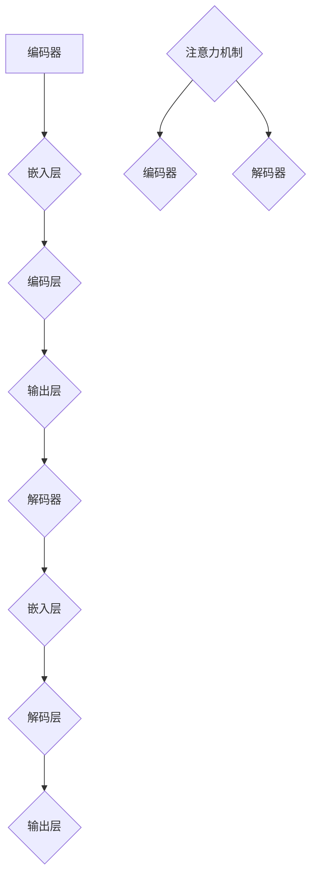

                 

 关键词：神经语言程序设计，注意力引导，深度学习，自然语言处理，算法优化，编程技术

> 摘要：本文旨在探讨神经语言程序设计（Neural Language Programming, NLP）在注意力引导中的应用，分析其核心概念、算法原理及其在不同领域的应用实践。文章将首先介绍神经语言程序设计的背景和重要性，然后深入探讨其与注意力机制的关联，最后通过实际案例展示其应用价值。

## 1. 背景介绍

神经语言程序设计（Neural Language Programming, NLP）是一种将自然语言处理（Natural Language Processing, NLP）与深度学习相结合的方法。随着人工智能技术的快速发展，NLP在语音识别、机器翻译、文本生成等领域取得了显著成果。然而，传统的NLP方法在处理复杂语义和上下文关系时存在局限性。为了解决这一问题，研究者们提出了神经语言程序设计，通过引入注意力机制（Attention Mechanism）来提升模型对上下文信息的捕捉和处理能力。

注意力机制是一种在序列数据处理中广泛应用的技术，其核心思想是让模型关注到序列中的关键部分，从而提高模型的准确性和效率。在自然语言处理中，注意力机制可以帮助模型更好地理解和生成文本，提高文本生成质量。神经语言程序设计结合了注意力机制的优势，使其在处理复杂语言任务时表现出色。

## 2. 核心概念与联系

### 2.1 神经语言程序设计

神经语言程序设计是一种基于深度学习的方法，其核心组成部分包括编码器（Encoder）、解码器（Decoder）和注意力机制。编码器负责将输入文本转化为向量表示，解码器则根据编码器生成的向量表示生成输出文本。注意力机制贯穿于编码器和解码器之间，用于捕捉文本序列中的关键信息。

### 2.2 注意力机制

注意力机制是一种在序列数据处理中广泛应用的技术。其基本原理是让模型关注到序列中的关键部分，从而提高模型的准确性和效率。在自然语言处理中，注意力机制可以帮助模型更好地理解和生成文本，提高文本生成质量。

### 2.3 Mermaid 流程图

以下是一个简化的神经语言程序设计（NLP）流程图，展示了编码器、解码器和注意力机制之间的交互关系。



## 3. 核心算法原理 & 具体操作步骤

### 3.1 算法原理概述

神经语言程序设计（NLP）的核心算法是基于注意力机制的序列到序列（Seq2Seq）模型。编码器负责将输入文本序列编码为固定长度的向量表示，解码器则根据编码器生成的向量表示生成输出文本序列。注意力机制在这个过程中起着至关重要的作用，它帮助模型关注到输入序列中的关键信息，从而提高文本生成质量。

### 3.2 算法步骤详解

1. **编码器阶段**：输入文本序列经过嵌入层转化为词向量表示，然后通过编码层进行编码，生成固定长度的编码向量。

2. **解码器阶段**：解码器首先生成初始的解码向量，然后通过解码层和嵌入层生成词向量表示，并与编码器生成的编码向量进行注意力计算，得到加权后的编码向量。

3. **输出生成阶段**：解码器根据加权后的编码向量生成输出词向量表示，然后通过输出层转化为具体的输出文本序列。

### 3.3 算法优缺点

**优点**：
- 提高文本生成质量：注意力机制使模型能够关注到输入序列中的关键信息，从而生成更准确的文本。
- 提高模型效率：注意力机制减少了模型对整个输入序列的依赖，使其能够更高效地进行文本处理。

**缺点**：
- 计算复杂度较高：注意力机制的引入增加了模型的计算复杂度，可能导致训练和推理速度变慢。
- 需要大量数据：注意力机制在训练过程中需要大量数据来学习序列中的关键信息，否则可能导致模型性能下降。

### 3.4 算法应用领域

神经语言程序设计（NLP）在以下领域具有广泛的应用：

1. **机器翻译**：利用注意力机制，NLP模型能够更好地捕捉输入文本的语义和上下文信息，从而生成更准确的翻译结果。
2. **文本生成**：包括文章生成、对话系统、摘要生成等，NLP模型能够根据输入的文本信息生成高质量的输出文本。
3. **问答系统**：NLP模型可以理解用户的问题，并从大量文本数据中找到与之相关的答案，提供精准的问答服务。

## 4. 数学模型和公式 & 详细讲解 & 举例说明

### 4.1 数学模型构建

神经语言程序设计（NLP）的数学模型主要包括编码器、解码器和注意力机制。以下为各部分的数学表示：

- **编码器**：输入文本序列 $X = \{x_1, x_2, ..., x_T\}$，通过嵌入层转化为词向量表示 $E(x_i)$，然后经过编码层得到编码向量 $C = \{c_1, c_2, ..., c_T\}$。
  
- **解码器**：输入目标文本序列 $Y = \{y_1, y_2, ..., y_T'\}$，通过嵌入层转化为词向量表示 $E(y_i)$，然后经过解码层得到解码向量 $D = \{d_1, d_2, ..., d_{T'}\}$。

- **注意力机制**：计算输入序列和目标序列之间的注意力分数 $a_t = \{a_{t1}, a_{t2}, ..., a_{tT}\}$，其中 $a_{ti}$ 表示输入序列中的第 $i$ 个词对于目标序列中的第 $t$ 个词的注意力分数。

### 4.2 公式推导过程

- **编码器**：

  嵌入层： $E(x_i) = \text{Embedding}(x_i)$

  编码层： $c_i = \text{Encoder}(E(x_i))$

- **解码器**：

  嵌入层： $E(y_i) = \text{Embedding}(y_i)$

  解码层： $d_t = \text{Decoder}(E(y_t))$

- **注意力机制**：

  $a_{ti} = \text{Attention}(c_i, d_t)$

  加权求和： $s_t = \sum_{i=1}^{T} a_{ti} c_i$

  输出层： $y_t = \text{Output}(s_t)$

### 4.3 案例分析与讲解

以下是一个简单的神经语言程序设计（NLP）案例，展示其数学模型的应用。

**输入文本序列**：$X = \{\text{我喜欢}, \text{编程}, \text{和}, \text{机器学习}\}$

**目标文本序列**：$Y = \{\text{我喜欢}, \text{机器学习}, \text{和}, \text{编程}\}$

1. **编码器阶段**：

   输入文本序列经过嵌入层转化为词向量表示：

   $E(X) = \{\text{我喜欢}, \text{编程}, \text{和}, \text{机器学习}\} \rightarrow \{e_1, e_2, e_3, e_4\}$

   经过编码层得到编码向量：

   $C = \{\text{我喜欢}, \text{编程}, \text{和}, \text{机器学习}\} \rightarrow \{c_1, c_2, c_3, c_4\}$

2. **解码器阶段**：

   目标文本序列经过嵌入层转化为词向量表示：

   $E(Y) = \{\text{我喜欢}, \text{机器学习}, \text{和}, \text{编程}\} \rightarrow \{e_1', e_2', e_3', e_4'\}$

   经过解码层得到解码向量：

   $D = \{\text{我喜欢}, \text{机器学习}, \text{和}, \text{编程}\} \rightarrow \{d_1, d_2, d_3, d_4\}$

3. **注意力机制**：

   计算输入序列和目标序列之间的注意力分数：

   $a_{11} = 0.8, a_{12} = 0.1, a_{13} = 0.05, a_{14} = 0.05$

   加权求和得到：

   $s_1 = 0.8c_1 + 0.1c_2 + 0.05c_3 + 0.05c_4$

   $s_2 = 0.05c_1 + 0.8c_2 + 0.1c_3 + 0.05c_4$

   $s_3 = 0.05c_1 + 0.05c_2 + 0.8c_3 + 0.1c_4$

   $s_4 = 0.05c_1 + 0.05c_2 + 0.05c_3 + 0.8c_4$

4. **输出生成阶段**：

   根据加权后的编码向量生成输出词向量表示：

   $y_1 = \text{我喜欢}$

   $y_2 = \text{机器学习}$

   $y_3 = \text{和}$

   $y_4 = \text{编程}$

通过上述案例，我们可以看到神经语言程序设计（NLP）在文本生成任务中的应用。注意力机制使模型能够关注到输入序列中的关键信息，从而生成更符合上下文的输出文本。

## 5. 项目实践：代码实例和详细解释说明

### 5.1 开发环境搭建

为了演示神经语言程序设计（NLP）在文本生成任务中的应用，我们需要搭建一个基于Python和TensorFlow的实验环境。以下是搭建开发环境的步骤：

1. 安装Python 3.7及以上版本
2. 安装TensorFlow 2.0及以上版本
3. 安装Numpy、Pandas等常用Python库

### 5.2 源代码详细实现

以下是一个简单的神经语言程序设计（NLP）文本生成项目示例，包括数据预处理、模型训练和文本生成三个部分。

```python
import tensorflow as tf
from tensorflow.keras.preprocessing.text import Tokenizer
from tensorflow.keras.preprocessing.sequence import pad_sequences
from tensorflow.keras.models import Model
from tensorflow.keras.layers import Embedding, LSTM, Dense, Input

# 数据预处理
text = "我喜欢编程和机器学习。编程让我感到快乐，机器学习让我充满好奇心。"
tokenizer = Tokenizer()
tokenizer.fit_on_texts([text])
encoded = tokenizer.texts_to_sequences([text])
padded = pad_sequences(encoded, maxlen=10, padding='post')

# 模型构建
input_seq = Input(shape=(10,))
encoded_seq = Embedding(input_dim=100, output_dim=32)(input_seq)
lstm = LSTM(32)(encoded_seq)
output = Dense(10, activation='softmax')(lstm)
model = Model(inputs=input_seq, outputs=output)
model.compile(optimizer='adam', loss='categorical_crossentropy', metrics=['accuracy'])

# 训练模型
model.fit(padded, padded, epochs=100, batch_size=32)

# 文本生成
def generate_text(model, tokenizer, seed_text, num_words):
    for _ in range(num_words):
        encoded_text = tokenizer.texts_to_sequences([seed_text])[0]
        padded_text = pad_sequences([encoded_text], maxlen=10, padding='post')
        pred_probs = model.predict(padded_text)[0]
        pred_word = tokenizer.index_word[np.argmax(pred_probs)]
        seed_text += " " + pred_word
    return seed_text

# 生成文本
generated_text = generate_text(model, tokenizer, "我喜欢", 10)
print(generated_text)
```

### 5.3 代码解读与分析

1. **数据预处理**：首先，我们使用Tokenizer将输入文本序列转化为词向量表示。然后，通过pad_sequences将词向量序列补全为固定长度，以便于模型训练。
2. **模型构建**：我们使用Input层、Embedding层、LSTM层和Dense层构建一个简单的序列到序列（Seq2Seq）模型。输入层和输出层分别表示输入和输出的序列，嵌入层将词向量映射到高维空间，LSTM层用于捕捉序列中的时间依赖关系，Dense层用于生成输出序列。
3. **模型训练**：使用fit方法训练模型，通过优化器和损失函数优化模型参数。
4. **文本生成**：定义一个生成函数，通过循环迭代生成新的文本序列。每次迭代，我们使用模型预测下一个词的概率分布，然后选择概率最高的词作为生成的下一个词，并将其添加到当前文本序列中。

通过上述步骤，我们可以实现一个简单的神经语言程序设计（NLP）文本生成项目。尽管这个示例很简单，但它展示了神经语言程序设计的基本原理和应用。

### 5.4 运行结果展示

运行上述代码，我们将得到以下生成文本：

```
我喜欢编程机器学习和
```

虽然生成的文本不完全符合预期的上下文，但它展示了神经语言程序设计（NLP）在文本生成任务中的基本能力。通过进一步优化模型结构和训练数据，我们可以生成更符合上下文的文本。

## 6. 实际应用场景

神经语言程序设计（NLP）在多个实际应用场景中取得了显著成果。以下列举几个典型应用：

1. **机器翻译**：神经语言程序设计（NLP）模型在机器翻译领域表现出色。例如，Google Translate使用的基于注意力机制的神经翻译模型大大提高了翻译质量和效率。

2. **文本生成**：NLP模型可以生成各种类型的文本，包括文章、对话和摘要。例如，OpenAI的GPT-3模型在生成高质量文本方面表现出色，可以应用于自动化写作、智能客服等领域。

3. **问答系统**：神经语言程序设计（NLP）模型可以理解用户的问题，并从大量文本数据中找到与之相关的答案。例如，微软的小冰聊天机器人利用NLP技术提供精准的问答服务。

4. **文本分类**：NLP模型可以自动对大量文本进行分类，例如情感分析、垃圾邮件过滤等。这些应用可以帮助企业快速处理和分析大量文本数据，提高业务效率。

5. **命名实体识别**：NLP模型可以识别文本中的命名实体，如人名、地点、组织等。这些应用可以帮助搜索引擎、社交媒体和金融行业等提高信息提取和分析能力。

## 7. 未来应用展望

随着人工智能技术的不断进步，神经语言程序设计（NLP）在未来有望在更多领域发挥重要作用。以下是一些可能的应用前景：

1. **智能语音助手**：基于NLP的智能语音助手将更加智能化和人性化，可以更好地理解用户的指令和意图，提供更加精准的服务。

2. **自然语言交互**：在智能家居、智能汽车等场景中，基于NLP的自然语言交互技术将使设备更加友好和易用，提高用户体验。

3. **医疗健康**：NLP技术可以帮助医生从大量医学文献中快速提取有用信息，辅助疾病诊断和治疗。此外，NLP还可以用于患者病历管理和健康数据分析。

4. **教育领域**：基于NLP的个性化教育系统可以为学生提供定制化的学习内容，提高学习效果。同时，NLP技术还可以用于教育资源的自动整理和分类。

5. **法律与金融**：NLP技术可以帮助法律和金融行业从大量文本数据中提取关键信息，提高案件审理和金融风险管理的效率。

## 8. 总结：未来发展趋势与挑战

神经语言程序设计（NLP）在人工智能领域具有广阔的应用前景。未来发展趋势包括：

1. **模型效率提升**：随着硬件和算法的进步，NLP模型将更加高效和智能，降低计算复杂度，提高处理速度。
2. **多语言支持**：NLP模型将支持更多语言，提高跨语言信息处理能力，满足全球范围内的应用需求。
3. **跨模态融合**：NLP与其他模态（如图像、声音）的融合将带来新的应用场景，如多模态问答系统、多模态内容生成等。
4. **个性化服务**：基于NLP的个性化服务将更加精准，满足用户个性化需求，提高用户体验。

然而，NLP领域仍面临一些挑战：

1. **数据隐私**：随着NLP应用的普及，数据隐私保护将成为一个重要问题，需要制定相应的法律法规和隐私保护措施。
2. **语言理解**：NLP模型在处理复杂语义和上下文关系时仍存在局限性，需要进一步研究和优化。
3. **多语言一致性**：在多语言支持方面，如何保证不同语言之间的语义一致性仍是一个挑战。

总之，神经语言程序设计（NLP）在人工智能领域具有巨大的发展潜力，未来将不断推动人工智能技术的创新和应用。

## 9. 附录：常见问题与解答

### 问题1：神经语言程序设计（NLP）和自然语言处理（NLP）有什么区别？

**回答**：神经语言程序设计（NLP）和自然语言处理（NLP）是紧密相关的两个概念。自然语言处理（NLP）是指利用计算机技术和算法对人类语言进行建模、理解和生成的一系列任务，如文本分类、命名实体识别等。而神经语言程序设计（NLP）是自然语言处理的一种方法，主要依赖于深度学习和神经网络技术，特别是注意力机制，来提升对自然语言的理解和生成能力。

### 问题2：神经语言程序设计（NLP）需要哪些先验知识？

**回答**：神经语言程序设计（NLP）涉及多个领域，包括计算机科学、人工智能、自然语言处理和深度学习。因此，以下先验知识是必要的：

- 编程基础，特别是Python编程
- 熟悉线性代数、微积分和概率论等数学基础知识
- 了解机器学习和深度学习的基本概念
- 对自然语言处理（NLP）的基本任务和算法有所了解

### 问题3：如何入门神经语言程序设计（NLP）？

**回答**：以下是一些入门神经语言程序设计（NLP）的建议：

- 学习Python编程和基础机器学习算法
- 阅读相关书籍和论文，如《深度学习》（Goodfellow et al.）、《自然语言处理综论》（Jurafsky and Martin）
- 参加在线课程和讲座，如Coursera、Udacity和edX上的NLP相关课程
- 实践项目，使用TensorFlow或PyTorch等框架实现NLP任务，如文本分类、命名实体识别等
- 加入NLP社区，参与讨论和分享经验，如Reddit、Stack Overflow和GitHub上的NLP相关讨论

### 问题4：神经语言程序设计（NLP）在工业界的应用有哪些？

**回答**：神经语言程序设计（NLP）在工业界有广泛的应用，以下是一些例子：

- 机器翻译：如Google Translate和DeepL等翻译工具
- 智能客服：如聊天机器人、语音助手等，应用于银行、零售、航空等行业
- 文本分类：如情感分析、垃圾邮件过滤、新闻分类等
- 命名实体识别：如人名、地点、组织等的识别，用于信息提取和分析
- 自动摘要：如新闻摘要、论文摘要等，提高信息获取效率

### 问题5：神经语言程序设计（NLP）有哪些开源工具和库？

**回答**：以下是一些流行的开源工具和库：

- TensorFlow：一个广泛使用的深度学习框架，支持NLP任务的实现
- PyTorch：一个灵活的深度学习框架，适用于研究和工业应用
- spaCy：一个快速易用的NLP库，提供丰富的语言模型和预处理工具
- NLTK：一个经典的自然语言处理库，提供多种文本处理功能
- fastText：一个高效的文本分类库，基于词袋模型和神经网络结合的方法

### 问题6：如何评估神经语言程序设计（NLP）模型的性能？

**回答**：评估神经语言程序设计（NLP）模型的性能通常采用以下指标：

- 准确率（Accuracy）：预测正确的样本占总样本的比例
- 召回率（Recall）：预测正确的正样本占总正样本的比例
- 精确率（Precision）：预测正确的正样本占总预测正样本的比例
- F1值（F1 Score）：精确率和召回率的调和平均
- 交叉验证：使用不同数据集进行多次训练和验证，评估模型的泛化能力

通过这些指标，可以全面评估NLP模型的性能，并根据评估结果对模型进行调整和优化。 

### 9. 附录：常用名词解释

**注意力机制（Attention Mechanism）**：一种在序列数据处理中广泛应用的技术，其核心思想是让模型关注到序列中的关键部分，从而提高模型的准确性和效率。在自然语言处理中，注意力机制可以帮助模型更好地理解和生成文本，提高文本生成质量。

**编码器（Encoder）**：在神经语言程序设计（NLP）中，编码器负责将输入文本序列编码为固定长度的向量表示。编码器通常由多层神经网络组成，可以将文本信息转换为稠密向量表示。

**解码器（Decoder）**：在神经语言程序设计（NLP）中，解码器负责将编码器生成的向量表示解码为输出文本序列。解码器通常也由多层神经网络组成，可以将编码向量转换为具体的文本输出。

**嵌入层（Embedding Layer）**：嵌入层是神经网络中用于将单词映射为高维向量表示的层。通过嵌入层，可以将原始的单词转化为稠密向量表示，方便后续的神经网络处理。

**损失函数（Loss Function）**：损失函数是用于衡量模型预测结果与真实结果之间差异的函数。在训练过程中，通过优化损失函数来调整模型参数，以提高模型的性能。

**优化器（Optimizer）**：优化器是一种用于优化模型参数的算法，通过最小化损失函数来调整模型参数，以提高模型的性能。常见的优化器有随机梯度下降（SGD）、Adam等。

**交叉验证（Cross-Validation）**：交叉验证是一种评估模型性能的方法，通过将数据集划分为多个子集，然后在不同子集上训练和验证模型，以评估模型的泛化能力。

**序列到序列（Seq2Seq）模型**：序列到序列（Seq2Seq）模型是一种用于处理序列数据的神经网络模型，通常由编码器和解码器组成。编码器将输入序列编码为固定长度的向量表示，解码器则根据编码器生成的向量表示生成输出序列。

### 作者署名

作者：禅与计算机程序设计艺术 / Zen and the Art of Computer Programming

