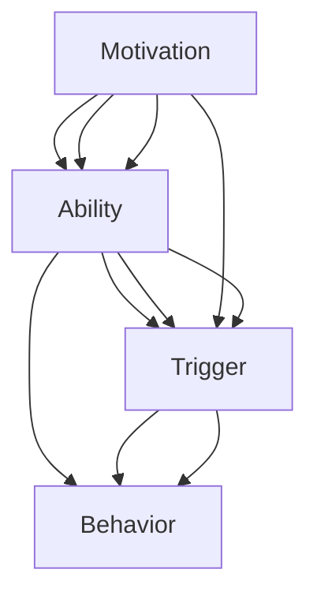

                 

关键词：福格行为模型、团队建设、动机、能力、触发器、协作、技术团队管理

> 摘要：本文将深入探讨福格行为模型在团队建设中的应用，分析如何通过该模型提高团队成员的动机、增强团队协作能力，最终提升整个团队的工作效率和项目质量。文章将结合实际案例，提供具体的方法和策略。

## 1. 背景介绍

在快速发展的信息技术行业，团队建设成为企业竞争力和创新能力的关键因素。然而，传统的管理方法和理念在面对现代复杂的项目和多元化的团队构成时，往往显得力不从心。福格行为模型（B = M * A * T）作为一种新兴的行为分析理论，为团队建设提供了一种全新的视角和方法。该模型强调动机（Motivation）、能力（Ability）和触发器（Trigger）三大要素对行为的影响，为我们理解和优化团队行为提供了有力的工具。

## 2. 核心概念与联系

### 2.1 福格行为模型基本原理

福格行为模型的核心公式为：B（行为）= M（动机）* A（能力）* T（触发器）。这个公式指出，要促使个体或团队采取某种行为，必须同时满足以下三个条件：

1. **动机（Motivation）**：个体或团队对行为的内在驱动力。包括需求满足、目标达成、利益获取等。
2. **能力（Ability）**：个体或团队实施行为所需的技能、知识和资源。
3. **触发器（Trigger）**：促使行为发生的即时信号或机会，如时间点、事件触发等。

### 2.2 核心概念原理和架构的 Mermaid 流程图



### 2.3 福格行为模型在团队建设中的应用

将福格行为模型应用于团队建设，可以指导我们在以下几个方面进行优化：

1. **增强动机**：通过明确目标、提供奖励、增强使命感等方式，提升团队成员的内在驱动力。
2. **提升能力**：通过培训、知识共享、技能提升等手段，增强团队成员的工作能力。
3. **设置触发器**：通过项目里程碑、定期回顾、即时反馈等方式，为团队成员提供行动的即时信号。

## 3. 核心算法原理 & 具体操作步骤

### 3.1 算法原理概述

福格行为模型的核心在于通过综合分析和优化三大要素，提升个体或团队的行为效率。在团队建设中，我们可以根据模型提供的方法，设计一套系统化的激励机制和培训计划，以提升团队成员的整体行为表现。

### 3.2 算法步骤详解

1. **明确团队目标**：设定清晰、具体、可衡量的团队目标，为团队成员提供明确的动机。
2. **评估团队成员能力**：通过评估和反馈，了解团队成员的技能水平和知识储备，为能力提升提供依据。
3. **设置触发器**：根据团队目标和成员能力，设置具体的里程碑和反馈机制，确保团队成员能够及时响应和行动。
4. **持续优化**：通过定期回顾和调整，不断优化团队建设策略，确保团队始终在最佳状态下运行。

### 3.3 算法优缺点

**优点**：
- 系统化、科学化地指导团队建设。
- 强调个体与团队的内在驱动力，有助于提升整体工作氛围和效率。

**缺点**：
- 算法实施需要一定的时间和资源投入。
- 需要管理层对团队有深入的了解和持续的跟踪。

### 3.4 算法应用领域

福格行为模型适用于各类技术团队，尤其是那些需要高协作和快速响应的项目。无论是软件开发、系统运维，还是数据分析和人工智能领域，该模型都能提供有效的指导。

## 4. 数学模型和公式 & 详细讲解 & 举例说明

### 4.1 数学模型构建

在福格行为模型中，我们可以使用以下数学模型进行构建：

B = M * A * T

其中，M、A、T分别为动机、能力、触发器的量化值。具体量化方法可以依据团队的实际情况进行设计。

### 4.2 公式推导过程

根据福格行为模型，我们可以推导出以下关系：

- 如果 M、A、T 中有一个值为 0，则 B = 0，即行为不会发生。
- 如果 M、A、T 全部为正值，则 B 越大，行为发生的概率越高。

### 4.3 案例分析与讲解

假设某技术团队正在开发一个关键项目，团队目标为“在三个月内完成项目并达到客户需求”。团队中每位成员的动机、能力和触发器如下：

- 动机 M：完成项目的使命感、奖金激励、客户满意度
- 能力 A：团队整体技术水平、项目开发经验、所需资源
- 触发器 T：项目进度里程碑、客户反馈、团队内部定期回顾

通过分析，我们可以发现团队在动机和能力上较为充足，但在触发器设置上存在不足。为优化模型，团队可以采取以下措施：

1. **明确里程碑**：设置明确的进度里程碑，确保团队成员对项目进度有清晰的认识。
2. **增强反馈机制**：建立及时的客户反馈和团队内部回顾机制，确保团队成员能够根据反馈调整行为。
3. **提供激励**：设计合理的奖金激励方案，提高团队成员的内在驱动力。

通过这些措施，团队的整体行为效率将得到显著提升。

## 5. 项目实践：代码实例和详细解释说明

### 5.1 开发环境搭建

在本案例中，我们使用Python编写一个简单的团队建设工具，以实现福格行为模型的量化分析和优化。

```bash
# 安装所需库
pip install numpy matplotlib
```

### 5.2 源代码详细实现

```python
import numpy as np
import matplotlib.pyplot as plt

# 定义福格行为模型
class FoggModel:
    def __init__(self, motivation, ability, trigger):
        self.motivation = motivation
        self.ability = ability
        self.trigger = trigger
    
    def calculate_behavior(self):
        return self.motivation * self.ability * self.trigger

# 实例化团队成员
team_member1 = FoggModel(motivation=0.8, ability=0.7, trigger=0.9)
team_member2 = FoggModel(motivation=0.9, ability=0.8, trigger=0.8)

# 计算团队成员行为值
behavior1 = team_member1.calculate_behavior()
behavior2 = team_member2.calculate_behavior()

# 绘制行为值分布图
plt.bar(['成员1', '成员2'], [behavior1, behavior2])
plt.xlabel('成员')
plt.ylabel('行为值')
plt.title('福格行为模型应用实例')
plt.show()
```

### 5.3 代码解读与分析

- **类定义**：定义了一个 `FoggModel` 类，用于表示团队成员的福格行为模型。
- **实例化**：创建了两个 `FoggModel` 实例，代表团队中的两位成员。
- **行为计算**：调用 `calculate_behavior` 方法计算每个成员的行为值。
- **图形展示**：使用 `matplotlib` 库绘制行为值分布图，直观展示团队成员的行为表现。

通过这个代码实例，我们可以直观地了解福格行为模型在团队建设中的应用方法和效果。

## 6. 实际应用场景

福格行为模型在团队建设中的应用非常广泛，以下是一些具体的实际应用场景：

1. **项目管理和进度控制**：通过分析团队成员的行为值，项目管理者可以更好地掌握项目进度，及时调整资源分配和任务分配，确保项目按期完成。
2. **团队培训和发展**：根据团队成员的能力评估和行为分析结果，设计有针对性的培训和发展计划，提升团队整体技能水平。
3. **激励和奖励机制**：通过福格行为模型，企业可以设计更科学、更有效的激励机制，提高团队成员的积极性和创造力。

## 7. 未来应用展望

随着人工智能和大数据技术的发展，福格行为模型在团队建设中的应用将更加广泛和深入。未来，我们可以将行为数据与业务数据、社交网络数据等相结合，构建更加全面、智能的团队建设模型。同时，基于行为数据的预测和优化也将为团队管理带来更多创新和可能性。

## 8. 工具和资源推荐

### 8.1 学习资源推荐

- 《福格行为模型：塑造习惯与行为的科学方法》
- 《团队协作的艺术：基于福格行为模型的理论与实践》

### 8.2 开发工具推荐

- Python
- Matplotlib
- Numpy

### 8.3 相关论文推荐

- "Fogg Behavior Model: A Practical Guide to Behavior Design"
- "Behavioral Science in Organizations: Insights from the Fogg Behavior Model"

## 9. 总结：未来发展趋势与挑战

### 9.1 研究成果总结

本文结合福格行为模型，深入探讨了其在团队建设中的应用，从动机、能力、触发器三个维度分析了团队行为的优化方法。通过实际案例和代码实例，展示了模型在实际项目中的应用效果。

### 9.2 未来发展趋势

随着人工智能和大数据技术的发展，福格行为模型在团队建设中的应用前景广阔。未来，我们将看到更多基于行为数据的研究和应用，为团队管理和企业发展提供更有力的支持。

### 9.3 面临的挑战

福格行为模型在团队建设中的应用仍面临一些挑战，如如何准确量化行为值、如何平衡个人与团队利益等。这些问题的解决需要更多实践和研究。

### 9.4 研究展望

未来，我们可以将福格行为模型与更多先进技术相结合，如深度学习、区块链等，探索更高效、更智能的团队建设方法。同时，我们还需要关注行为数据的安全和隐私问题，确保团队建设的可持续发展。

## 10. 附录：常见问题与解答

### 10.1 福格行为模型适用于哪些团队？

福格行为模型适用于各类需要高协作和技术能力的团队，如软件开发团队、数据分析团队、人工智能团队等。

### 10.2 如何量化动机、能力和触发器？

动机、能力和触发器的量化方法可以根据团队的具体情况进行设计。例如，可以使用评分系统、问卷调查、行为数据等手段进行量化。

### 10.3 福格行为模型与传统管理方法相比有何优势？

福格行为模型强调个体和团队的内在驱动力，能够更科学、更有效地指导团队建设，提升团队整体效率。

### 10.4 如何在实际项目中应用福格行为模型？

在实际项目中，可以通过以下步骤应用福格行为模型：

1. 明确团队目标和动机。
2. 评估团队成员的能力。
3. 设置触发器和反馈机制。
4. 持续优化和调整。

作者：禅与计算机程序设计艺术 / Zen and the Art of Computer Programming
----------------------------------------------------------------

