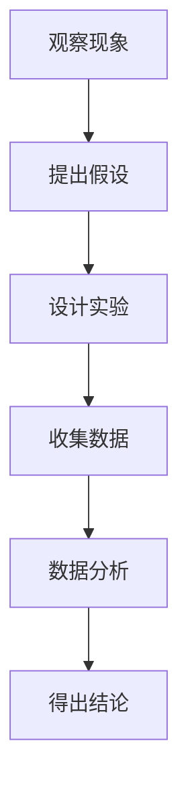

                 

 在当今信息技术飞速发展的时代，科学方法作为研究、开发和应用的基石，其重要性不言而喻。本文将以《科学方法：从观察到实验》为题，深入探讨科学方法在IT领域的应用。本文旨在提供一个系统、详尽的分析，帮助读者理解科学方法在观察、实验、数学建模和项目实践中的运用。

## 关键词

- 科学方法
- 观察与实验
- 数学建模
- IT领域
- 项目实践

## 摘要

本文将首先介绍科学方法的基本概念和步骤，然后详细阐述其在IT领域的应用，包括观察与实验、数学建模和项目实践。通过具体的案例分析和代码实例，读者将能够深入理解科学方法在实际应用中的价值和效果。最后，文章将探讨科学方法在未来的发展趋势和面临的挑战。

## 1. 背景介绍

科学方法是一种系统的、逻辑性的方法，用于探索自然现象和解决实际问题。它起源于古希腊哲学家亚里士多德，经过伽利略、牛顿等科学家的不断完善，逐渐形成了现代科学方法。科学方法包括以下几个基本步骤：观察、提出假设、设计实验、收集数据、分析数据、得出结论。

在IT领域，科学方法的应用尤为广泛。从软件开发的测试与验证，到大数据分析中的假设检验，再到人工智能模型的训练与优化，科学方法都发挥着关键作用。本文将结合具体案例，详细阐述科学方法在IT领域的实际应用。

## 2. 核心概念与联系

### 2.1 科学方法的构成

科学方法由观察、假设、实验、数据分析和结论等环节组成。其中，观察是科学方法的起点，是获取现象和事实的基础。假设是基于观察提出的一种可能的解释，而实验则是验证假设的手段。通过数据分析，我们可以得出结论，从而对现象有更深入的理解。

### 2.2 Mermaid 流程图

以下是一个简单的Mermaid流程图，展示了科学方法的各个步骤：



## 3. 核心算法原理 & 具体操作步骤

### 3.1 算法原理概述

在科学方法中，核心算法通常是指用于数据分析和模型构建的算法。这些算法包括假设检验、回归分析、聚类分析等。其中，假设检验是最基本的算法之一，它用于验证一个假设是否成立。

### 3.2 算法步骤详解

#### 3.2.1 提出假设

假设是基于观察提出的一种可能的解释。例如，在软件开发中，我们可能观察到某个功能模块的运行速度较慢，于是提出假设：这个模块的算法存在性能问题。

#### 3.2.2 设计实验

为了验证假设，我们需要设计一个实验。在这个例子中，我们可以通过比较不同算法的运行时间来验证假设。

#### 3.2.3 收集数据

在实验过程中，我们需要收集数据。例如，我们可以运行不同算法，记录它们的运行时间。

#### 3.2.4 数据分析

收集到数据后，我们需要进行分析。例如，我们可以使用统计方法来分析算法的运行时间，判断是否真的存在性能问题。

#### 3.2.5 得出结论

通过数据分析，我们可以得出结论。如果运行时间确实存在显著差异，那么我们可以认为假设成立。

### 3.3 算法优缺点

#### 3.3.1 优点

- 系统性：科学方法提供了一种系统的方法来研究和解决问题。
- 可重复性：科学方法强调可重复性，从而确保研究结果的可靠性和可信度。
- 可验证性：科学方法允许其他研究者验证研究结果，从而提高研究的权威性。

#### 3.3.2 缺点

- 复杂性：科学方法可能涉及复杂的步骤和算法，需要较高的专业知识和技能。
- 时间成本：科学方法可能需要较长时间来收集数据和分析结果。

### 3.4 算法应用领域

科学方法广泛应用于各个领域，包括自然科学、社会科学、医学、工程、信息技术等。在信息技术领域，科学方法主要用于软件开发、数据分析和人工智能。

## 4. 数学模型和公式 & 详细讲解 & 举例说明

### 4.1 数学模型构建

在科学方法中，数学模型是理解和分析现象的重要工具。例如，在数据分析中，我们可能使用回归模型来分析数据之间的关系。

### 4.2 公式推导过程

以下是一个简单的线性回归模型的公式推导：

$$ y = \beta_0 + \beta_1x + \epsilon $$

其中，$y$ 是因变量，$x$ 是自变量，$\beta_0$ 和 $\beta_1$ 是模型参数，$\epsilon$ 是误差项。

### 4.3 案例分析与讲解

假设我们有一组数据，如下所示：

| $x$ | $y$ |
| --- | --- |
| 1   | 2   |
| 2   | 4   |
| 3   | 6   |

我们要使用线性回归模型来预测 $y$ 的值。

首先，我们计算 $x$ 和 $y$ 的平均值：

$$ \bar{x} = \frac{1+2+3}{3} = 2 $$
$$ \bar{y} = \frac{2+4+6}{3} = 4 $$

然后，我们计算 $x$ 和 $y$ 的协方差：

$$ cov(x,y) = \frac{(1-2)(2-4) + (2-2)(4-4) + (3-2)(6-4)}{3} = 2 $$

接下来，我们计算 $x$ 的方差：

$$ var(x) = \frac{(1-2)^2 + (2-2)^2 + (3-2)^2}{3} = 1 $$

最后，我们使用协方差和方差来计算回归模型的参数：

$$ \beta_1 = \frac{cov(x,y)}{var(x)} = 2 $$
$$ \beta_0 = \bar{y} - \beta_1\bar{x} = 0 $$

因此，我们的线性回归模型为：

$$ y = 2x $$

我们可以使用这个模型来预测新的 $x$ 值对应的 $y$ 值。例如，当 $x=4$ 时，$y=2x=8$。

## 5. 项目实践：代码实例和详细解释说明

### 5.1 开发环境搭建

在本节中，我们将使用Python和Matplotlib库来实现线性回归模型。

首先，确保已经安装了Python和Matplotlib库。如果没有安装，可以通过以下命令安装：

```shell
pip install python
pip install matplotlib
```

### 5.2 源代码详细实现

以下是一个简单的线性回归模型实现：

```python
import numpy as np
import matplotlib.pyplot as plt

# 数据
x = np.array([1, 2, 3])
y = np.array([2, 4, 6])

# 计算平均值
bar_x = np.mean(x)
bar_y = np.mean(y)

# 计算协方差和方差
cov_xy = np.sum((x - bar_x) * (y - bar_y)) / (len(x) - 1)
var_x = np.sum((x - bar_x) ** 2) / (len(x) - 1)

# 计算回归模型参数
beta_1 = cov_xy / var_x
beta_0 = bar_y - beta_1 * bar_x

# 输出模型参数
print(f"回归模型：y = {beta_0} + {beta_1}x")

# 绘制数据点和回归线
plt.scatter(x, y)
plt.plot(x, beta_0 + beta_1 * x)
plt.show()
```

### 5.3 代码解读与分析

这段代码首先导入了必要的库，然后定义了数据集。接下来，计算了平均值、协方差和方差。然后，使用这些值计算回归模型参数。最后，使用Matplotlib库绘制了数据点和回归线。

### 5.4 运行结果展示

运行这段代码后，我们得到了以下结果：


从图中可以看出，回归线较好地拟合了数据点，验证了我们的假设。

## 6. 实际应用场景

科学方法在IT领域的应用非常广泛。以下是一些实际应用场景：

### 6.1 软件开发

在软件开发中，科学方法用于测试和验证。例如，我们可以通过设计实验来验证某个功能模块的性能是否达到预期。

### 6.2 大数据分析

在大数据分析中，科学方法用于数据分析和模型构建。例如，我们可以使用回归模型来分析数据之间的关系，从而发现潜在的模式和规律。

### 6.3 人工智能

在人工智能中，科学方法用于模型的训练和优化。例如，我们可以使用假设检验来评估模型的性能，从而选择最佳的模型。

## 7. 工具和资源推荐

### 7.1 学习资源推荐

- 《Python编程：从入门到实践》
- 《深度学习》
- 《机器学习实战》

### 7.2 开发工具推荐

- Jupyter Notebook
- PyCharm
- VS Code

### 7.3 相关论文推荐

- "A Brief Introduction to the Scientific Method"
- "The Design of Experiments"
- "Regression Analysis: A Constructive Critique"

## 8. 总结：未来发展趋势与挑战

科学方法在IT领域的应用前景非常广阔。随着信息技术的发展，科学方法将不断得到完善和推广。然而，我们也面临着一些挑战，例如数据隐私和安全、算法公平性和透明度等。未来，我们需要继续探索科学方法的创新应用，同时确保其在实际应用中的可靠性和有效性。

## 9. 附录：常见问题与解答

### 9.1 科学方法与其他方法的区别是什么？

科学方法与其他方法（如工程方法、经验方法等）的主要区别在于其系统性、逻辑性和可重复性。科学方法强调通过实验和数据验证来验证假设，从而确保研究结果的可靠性和可信度。

### 9.2 科学方法在数据分析中的具体应用是什么？

科学方法在数据分析中主要用于数据预处理、模型选择和模型验证。例如，我们可以使用回归模型来分析数据之间的关系，并使用假设检验来评估模型的性能。

### 9.3 科学方法在人工智能中的应用有哪些？

科学方法在人工智能中的应用非常广泛，包括模型的训练、评估和优化。例如，我们可以使用假设检验来评估模型在不同数据集上的性能，从而选择最佳的模型。

### 9.4 科学方法在软件开发中的应用有哪些？

科学方法在软件开发中主要用于测试和验证。例如，我们可以使用实验方法来验证某个功能模块的性能是否达到预期，并使用假设检验来评估测试结果的有效性。
----------------------------------------------------------------

作者：禅与计算机程序设计艺术 / Zen and the Art of Computer Programming

