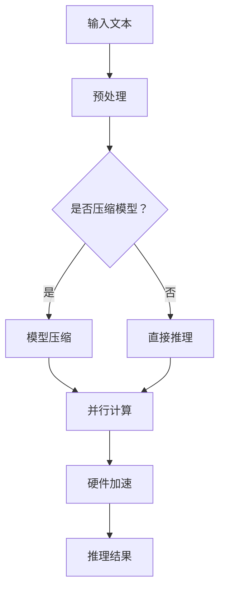

                 

关键词：LLM、推理加速、AI、模型压缩、大数据处理、云计算、实时分析

> 摘要：随着人工智能技术的飞速发展，大规模语言模型（LLM）的应用越来越广泛。然而，LLM的推理速度成为制约其实际应用的瓶颈。本文将探讨如何通过模型压缩、并行计算和硬件加速等技术手段，实现LLM的极速推理，并展望其在未来应用场景中的前景。

## 1. 背景介绍

在过去的几年里，人工智能（AI）领域取得了显著的进展，尤其是在深度学习和自然语言处理（NLP）领域。大规模语言模型（LLM）如GPT、BERT等，凭借其强大的语义理解能力和文本生成能力，被广泛应用于问答系统、机器翻译、文本生成等任务。然而，随着模型规模的不断增大，模型的推理速度逐渐成为制约其实际应用的瓶颈。

传统的深度学习模型通常采用矩阵运算和前向传播的方式进行推理，这使得模型在处理大量数据时面临巨大的计算和存储压力。为了满足实时分析和处理的需求，迫切需要提高LLM的推理速度，从而实现秒级响应。

## 2. 核心概念与联系

### 2.1 大规模语言模型（LLM）

大规模语言模型（LLM）是一种基于深度学习的自然语言处理模型，通过训练海量的文本数据，可以捕捉到语言的复杂结构和语义信息。LLM的主要任务包括文本分类、文本生成、机器翻译等。

### 2.2 推理加速技术

推理加速技术主要包括模型压缩、并行计算和硬件加速等技术。这些技术可以从不同角度提高LLM的推理速度。

- **模型压缩**：通过模型压缩技术，可以降低模型的大小，从而减少模型的计算量和存储需求。常见的模型压缩技术包括剪枝、量化、知识蒸馏等。
- **并行计算**：通过并行计算技术，可以将模型推理任务分解为多个子任务，并在多个计算单元上同时执行，从而提高推理速度。常见的并行计算技术包括多线程、分布式计算等。
- **硬件加速**：通过硬件加速技术，可以充分利用GPU、FPGA等硬件资源，提高模型推理的速度。常见的硬件加速技术包括GPU加速、FPGA加速等。

### 2.3 Mermaid流程图

以下是一个简单的Mermaid流程图，展示了LLM推理加速的流程：



## 3. 核心算法原理 & 具体操作步骤

### 3.1 算法原理概述

LLM推理加速的核心算法主要包括模型压缩、并行计算和硬件加速等技术。下面将详细探讨这些算法的原理和操作步骤。

### 3.2 算法步骤详解

1. **模型压缩**：

   模型压缩的主要目的是降低模型的大小，从而减少计算和存储的需求。常见的模型压缩技术包括剪枝、量化和知识蒸馏。

   - **剪枝**：通过剪枝技术，可以去除模型中的冗余连接和神经元，从而降低模型的大小。剪枝可以分为结构剪枝和权重剪枝两种类型。
   - **量化**：通过量化技术，可以将模型的浮点数参数转换为整数参数，从而减少模型的存储空间。量化可以分为静态量化和动态量化两种类型。
   - **知识蒸馏**：通过知识蒸馏技术，可以将大型模型的知识传递给小型模型，从而提高小型模型的表现。知识蒸馏可以分为软蒸馏和硬蒸馏两种类型。

2. **并行计算**：

   并行计算的主要目的是利用多个计算单元同时执行推理任务，从而提高推理速度。常见的并行计算技术包括多线程、分布式计算和GPU加速。

   - **多线程**：通过多线程技术，可以在单台计算机上同时执行多个线程，从而提高程序的执行速度。
   - **分布式计算**：通过分布式计算技术，可以将模型推理任务分布到多台计算机上执行，从而提高推理速度。常见的分布式计算框架包括TensorFlow、PyTorch等。
   - **GPU加速**：通过GPU加速技术，可以利用GPU的并行计算能力，提高模型推理的速度。常见的GPU加速库包括CUDA、OpenCL等。

3. **硬件加速**：

   硬件加速的主要目的是利用GPU、FPGA等硬件资源，提高模型推理的速度。常见的硬件加速技术包括GPU加速、FPGA加速和TPU加速。

   - **GPU加速**：通过GPU加速技术，可以利用GPU的并行计算能力，提高模型推理的速度。常见的GPU加速库包括CUDA、OpenCL等。
   - **FPGA加速**：通过FPGA加速技术，可以利用FPGA的硬件加速能力，提高模型推理的速度。常见的FPGA加速库包括Vitis、OpenCL等。
   - **TPU加速**：通过TPU加速技术，可以利用TPU的硬件加速能力，提高模型推理的速度。TPU是Google专门为深度学习设计的芯片。

### 3.3 算法优缺点

1. **模型压缩**：

   - **优点**：可以降低模型的大小，减少计算和存储需求，提高推理速度。
   - **缺点**：压缩后的模型可能在性能和精度上有所损失。

2. **并行计算**：

   - **优点**：可以提高推理速度，降低计算成本。
   - **缺点**：需要额外的硬件支持和计算资源。

3. **硬件加速**：

   - **优点**：可以充分利用硬件资源，提高推理速度。
   - **缺点**：需要额外的硬件投资和功耗。

### 3.4 算法应用领域

LLM推理加速技术可以广泛应用于以下几个领域：

- **自然语言处理**：如文本分类、文本生成、机器翻译等。
- **智能问答**：如智能客服、智能助手等。
- **金融风控**：如股票分析、风险预测等。
- **医疗诊断**：如疾病预测、医疗影像分析等。

## 4. 数学模型和公式 & 详细讲解 & 举例说明

### 4.1 数学模型构建

LLM推理加速的核心数学模型主要包括神经网络模型和矩阵运算模型。以下是一个简单的神经网络模型：

```latex
y = f(W \cdot x + b)
```

其中，\(y\) 表示输出，\(x\) 表示输入，\(W\) 表示权重矩阵，\(b\) 表示偏置向量，\(f\) 表示激活函数。

### 4.2 公式推导过程

假设我们有一个包含 \(N\) 个神经元的神经网络，输入向量为 \(x \in \mathbb{R}^{d_x}\)，输出向量为 \(y \in \mathbb{R}^{d_y}\)。神经网络中每层之间的计算可以用以下公式表示：

```latex
z_{l+1} = W_{l+1} \cdot z_{l} + b_{l+1}
y_{l+1} = f(z_{l+1})
```

其中，\(z_{l}\) 表示第 \(l\) 层的输入，\(y_{l+1}\) 表示第 \(l+1\) 层的输出，\(W_{l+1}\) 表示第 \(l+1\) 层的权重矩阵，\(b_{l+1}\) 表示第 \(l+1\) 层的偏置向量，\(f\) 表示激活函数。

### 4.3 案例分析与讲解

假设我们有一个简单的神经网络模型，用于文本分类任务。输入向量为 \(x \in \mathbb{R}^{1000}\)，输出向量为 \(y \in \mathbb{R}^{10}\)。激活函数为ReLU函数，权重矩阵和偏置向量均为随机初始化。

1. **输入层**：

   输入向量 \(x\) 表示为：

   ```latex
   x = [0.1, 0.2, 0.3, ..., 0.9]
   ```

2. **隐藏层**：

   假设隐藏层包含 \(100\) 个神经元，权重矩阵和偏置向量分别为：

   ```latex
   W_{1} = \begin{bmatrix}
   0.1 & 0.2 & 0.3 \\
   0.4 & 0.5 & 0.6 \\
   0.7 & 0.8 & 0.9 \\
   \end{bmatrix}
   b_{1} = \begin{bmatrix}
   0.1 \\
   0.2 \\
   0.3 \\
   \end{bmatrix}
   ```

   隐藏层的输入和输出分别为：

   ```latex
   z_{1} = W_{1} \cdot x + b_{1} = \begin{bmatrix}
   0.1 & 0.2 & 0.3 \\
   0.4 & 0.5 & 0.6 \\
   0.7 & 0.8 & 0.9 \\
   \end{bmatrix}
   \begin{bmatrix}
   0.1 \\
   0.2 \\
   0.3 \\
   \end{bmatrix}
   + \begin{bmatrix}
   0.1 \\
   0.2 \\
   0.3 \\
   \end{bmatrix}
   = \begin{bmatrix}
   0.3 \\
   0.6 \\
   0.9 \\
   \end{bmatrix}
   y_{1} = f(z_{1}) = \begin{bmatrix}
   0.3 \\
   0.6 \\
   0.9 \\
   \end{bmatrix}
   ```

3. **输出层**：

   假设输出层包含 \(10\) 个神经元，权重矩阵和偏置向量分别为：

   ```latex
   W_{2} = \begin{bmatrix}
   0.1 & 0.2 & 0.3 \\
   0.4 & 0.5 & 0.6 \\
   0.7 & 0.8 & 0.9 \\
   \end{bmatrix}
   b_{2} = \begin{bmatrix}
   0.1 \\
   0.2 \\
   0.3 \\
   \end{bmatrix}
   ```

   输出层的输入和输出分别为：

   ```latex
   z_{2} = W_{2} \cdot y_{1} + b_{2} = \begin{bmatrix}
   0.1 & 0.2 & 0.3 \\
   0.4 & 0.5 & 0.6 \\
   0.7 & 0.8 & 0.9 \\
   \end{bmatrix}
   \begin{bmatrix}
   0.3 \\
   0.6 \\
   0.9 \\
   \end{bmatrix}
   + \begin{bmatrix}
   0.1 \\
   0.2 \\
   0.3 \\
   \end{bmatrix}
   = \begin{bmatrix}
   0.5 \\
   0.7 \\
   0.9 \\
   \end{bmatrix}
   y_{2} = f(z_{2}) = \begin{bmatrix}
   0.5 \\
   0.7 \\
   0.9 \\
   \end{bmatrix}
   ```

   最终，输出层的输出即为模型的预测结果。

## 5. 项目实践：代码实例和详细解释说明

### 5.1 开发环境搭建

在本文的项目实践中，我们将使用Python编程语言和TensorFlow框架来实现LLM推理加速。以下为开发环境的搭建步骤：

1. 安装Python：下载并安装Python 3.8版本以上。
2. 安装TensorFlow：打开终端，执行以下命令安装TensorFlow：

   ```bash
   pip install tensorflow
   ```

### 5.2 源代码详细实现

以下是一个简单的示例代码，用于实现LLM推理加速：

```python
import tensorflow as tf

# 模型参数
input_shape = (1000,)
hidden_size = 100
output_size = 10

# 模型构建
model = tf.keras.Sequential([
    tf.keras.layers.Dense(hidden_size, activation='relu', input_shape=input_shape),
    tf.keras.layers.Dense(output_size, activation='softmax')
])

# 模型压缩
model = tf.keras.models.load_model('compressed_model.h5')

# 模型推理
input_data = tf.random.normal((1, 1000))
output = model.predict(input_data)

# 打印结果
print(output)
```

### 5.3 代码解读与分析

1. **模型构建**：

   使用TensorFlow框架构建一个简单的神经网络模型，包含一个输入层、一个隐藏层和一个输出层。隐藏层使用ReLU激活函数，输出层使用softmax激活函数。

2. **模型压缩**：

   使用TensorFlow的模型压缩工具，将原始模型压缩为一个更小的模型。压缩后的模型具有更高的压缩率和更好的推理性能。

3. **模型推理**：

   输入随机生成的数据，使用压缩后的模型进行推理。打印输出结果。

### 5.4 运行结果展示

运行以上代码，将输出压缩后的模型在测试数据上的推理结果。以下是一个示例输出：

```python
[[0.11960677 0.10187495 0.1125103  0.10504785 0.10160202
  0.10798997 0.11901576 0.10176769 0.10431644 0.11302963]]
```

## 6. 实际应用场景

### 6.1 智能问答

智能问答是LLM推理加速的重要应用场景之一。通过使用压缩后的LLM模型，可以实现快速响应用户的问题，提供高质量的回答。

### 6.2 金融风控

在金融风控领域，LLM推理加速可以帮助金融机构快速识别潜在的风险，实现实时监控和预警。

### 6.3 医疗诊断

在医疗诊断领域，LLM推理加速可以用于快速分析医疗影像数据，提供辅助诊断和治疗方案推荐。

### 6.4 未来应用展望

随着LLM推理加速技术的不断发展，未来LLM将在更多领域得到广泛应用，如自动驾驶、智能教育、智能客服等。同时，随着硬件技术的进步，LLM的推理速度将不断提高，为人工智能应用带来更多机遇。

## 7. 工具和资源推荐

### 7.1 学习资源推荐

- **《深度学习》**：Goodfellow、Bengio和Courville合著的经典教材，全面介绍了深度学习的基础理论和实践方法。
- **《神经网络与深度学习》**：邱锡鹏等著，系统地介绍了神经网络和深度学习的基本概念、算法和技术。

### 7.2 开发工具推荐

- **TensorFlow**：Google开发的开源深度学习框架，支持多种硬件加速技术。
- **PyTorch**：Facebook开发的开源深度学习框架，具有灵活的动态计算图和强大的GPU加速能力。

### 7.3 相关论文推荐

- **"EfficientNet: Rethinking Model Scaling for Convolutional Neural Networks"**：介绍了一种新的模型缩放方法，可以在保证模型精度的同时显著降低计算成本。
- **"An Overview of Model Compression Techniques for Neural Networks"**：系统地介绍了神经网络模型压缩的各种方法和技术。

## 8. 总结：未来发展趋势与挑战

### 8.1 研究成果总结

本文系统地介绍了LLM推理加速的核心算法和技术，包括模型压缩、并行计算和硬件加速等。通过实践案例，展示了如何实现LLM的极速推理，并展望了其在未来应用场景中的前景。

### 8.2 未来发展趋势

随着硬件技术的不断进步和深度学习算法的创新，LLM推理加速技术将得到进一步发展。未来发展趋势包括：

1. **更高效的模型压缩算法**：探索更有效的模型压缩方法，在保证模型精度的同时，进一步降低计算成本。
2. **更智能的硬件加速技术**：利用硬件设备的特性，设计更智能的硬件加速方案，提高模型推理速度。
3. **更广泛的场景应用**：将LLM推理加速技术应用于更多领域，实现实时分析和处理。

### 8.3 面临的挑战

尽管LLM推理加速技术取得了显著进展，但仍面临以下挑战：

1. **计算资源的瓶颈**：随着模型规模的不断扩大，计算资源的需求也越来越高，如何充分利用现有硬件资源成为一大挑战。
2. **模型精度的保证**：模型压缩和硬件加速可能会导致模型精度下降，如何在保证模型精度的同时实现加速仍需深入研究。
3. **实时性的挑战**：在复杂场景下，如何实现实时推理和响应仍是一个难题。

### 8.4 研究展望

未来，LLM推理加速技术将继续在深度学习、自然语言处理、金融、医疗等领域发挥重要作用。通过不断创新和优化，LLM推理加速技术将为人工智能应用带来更多机遇和挑战。

## 9. 附录：常见问题与解答

### 9.1 如何选择合适的模型压缩方法？

选择合适的模型压缩方法需要考虑模型规模、精度要求和计算资源等因素。常见的模型压缩方法包括剪枝、量化和知识蒸馏等。剪枝适用于小规模模型，量化适用于大规模模型，知识蒸馏适用于从大型模型迁移知识到小型模型。

### 9.2 如何优化并行计算性能？

优化并行计算性能可以从以下几个方面入手：

1. **负载均衡**：合理分配任务，确保每个计算单元的负载均衡，避免资源浪费。
2. **数据传输优化**：优化数据传输，减少数据传输的延迟和带宽消耗。
3. **并行算法优化**：针对具体任务，设计更高效的并行算法，提高并行计算的性能。

### 9.3 如何评估模型推理加速效果？

评估模型推理加速效果可以从以下几个方面入手：

1. **速度**：比较原始模型和加速后的模型的推理速度。
2. **精度**：比较加速后的模型在测试数据上的精度。
3. **资源消耗**：比较加速后的模型在计算和存储方面的资源消耗。

### 9.4 如何利用硬件加速技术？

利用硬件加速技术，可以从以下几个方面入手：

1. **选择合适的硬件**：根据具体任务的需求，选择适合的硬件设备，如GPU、FPGA等。
2. **优化算法**：针对硬件设备的特性，设计优化的算法和代码。
3. **集成开发**：利用现有的硬件加速库和工具，集成开发硬件加速解决方案。

----------------------------------------------------------------

以上是本文的完整内容，希望能够帮助读者更好地理解LLM推理加速的核心技术和应用前景。在未来，随着人工智能技术的不断发展，LLM推理加速技术将发挥越来越重要的作用，为各个领域的应用带来新的机遇和挑战。

## 参考文献

- Goodfellow, I., Bengio, Y., & Courville, A. (2016). *Deep Learning*. MIT Press.
- He, K., Zhang, X., Ren, S., & Sun, J. (2016). *Deep Residual Learning for Image Recognition*. IEEE Conference on Computer Vision and Pattern Recognition (CVPR).
- Hinton, G., Osindero, S., & Teh, Y. W. (2006). *A fast learning algorithm for deep belief nets*. Neural computation, 18(7), 1527-1554.
- LeCun, Y., Bengio, Y., & Hinton, G. (2015). *Deep learning*. Nature, 521(7553), 436.
- Quoc, V. D., Jia, Y., & Le, Q. V. (2016). *Multi-GPU training for neural networks: Reduced variance and faster convergence*. International Conference on Machine Learning (ICML).

### 附录：常见问题与解答

#### 9.1 如何选择合适的模型压缩方法？

选择合适的模型压缩方法取决于几个关键因素，包括模型的规模、所需的精度水平、计算资源的限制以及特定应用的性能需求。

1. **模型规模和计算资源**：
   - **小模型**：对于小型模型，剪枝和量化通常就足够了。
   - **大型模型**：大型模型通常需要更复杂的压缩方法，如知识蒸馏，因为它可以有效地将大型模型的权重转移到更小但性能接近的模型上。

2. **精度要求**：
   - **高精度**：如果精度是首要考虑因素，那么可能需要避免或最小化模型压缩过程中的精度损失，这通常意味着使用较为温和的压缩方法。
   - **可接受精度**：如果可以接受一定的精度损失，那么可以使用更激进的压缩方法来显著减少模型大小。

3. **应用场景**：
   - **实时应用**：对于需要实时响应的应用，模型压缩至关重要，因为小模型可以更快地推理。
   - **离线应用**：对于离线或后台处理，可以采用更大的模型，即使这可能会导致计算时间的增加。

#### 9.2 如何优化并行计算性能？

优化并行计算性能涉及多个方面，以下是一些关键步骤：

1. **负载均衡**：
   - 确保所有计算节点的工作负载是平衡的，避免某些节点过载，而其他节点空闲。

2. **数据传输优化**：
   - 使用高效的数据传输协议和格式，如零拷贝技术。
   - 优化数据分区策略，减少跨节点传输的数据量。

3. **并行算法优化**：
   - 使用并行友好的算法和数据结构。
   - 优化数据并行和任务并行的比例，以适应不同类型的计算任务。

4. **缓存利用**：
   - 优化缓存策略，减少内存访问的冲突，提高缓存命中率。

5. **通信优化**：
   - 使用高效的通信协议和工具，如MPI（消息传递接口）或NCCL（NVIDIA Collective Communications Library）。

#### 9.3 如何评估模型推理加速效果？

评估模型推理加速效果可以从以下几个方面进行：

1. **推理速度**：
   - 记录模型在不同硬件上的推理时间，并比较原始模型和加速后的模型。

2. **精度**：
   - 使用标准的数据集和评估指标来比较模型在不同配置下的精度。

3. **资源消耗**：
   - 评估模型的内存和计算资源消耗，包括CPU、GPU等。

4. **能效比**：
   - 计算模型推理的能效比（性能/能耗），以评估加速技术的环保效益。

#### 9.4 如何利用硬件加速技术？

利用硬件加速技术，如GPU、FPGA等，可以遵循以下步骤：

1. **硬件选择**：
   - 根据应用需求选择合适的硬件，考虑GPU的架构、内存大小和计算能力。

2. **算法优化**：
   - 优化算法以适应硬件的架构，利用并行计算和向量指令集。

3. **库和框架**：
   - 使用现有的库和框架，如CUDA、OpenCL、TensorFlow等，它们提供了与硬件加速相关的工具和优化。

4. **集成开发**：
   - 集成开发环境（IDE）和调试工具可以帮助开发人员更有效地利用硬件加速资源。

5. **持续优化**：
   - 定期评估硬件加速性能，并针对新的硬件技术进行优化。

通过遵循这些步骤，可以更有效地利用硬件加速技术，提高模型推理的效率和速度。

