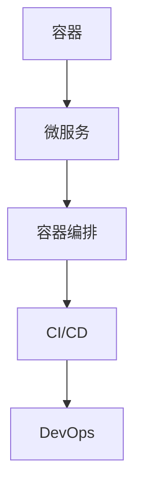

                 

关键词：云原生、微服务、容器化、DevOps、架构设计、编程、云计算

> 摘要：本文将探讨如何利用云原生技术构建高效、灵活且可扩展的创业公司架构。通过深入剖析云原生架构的核心概念、实施策略以及实践案例，为程序员创业公司提供切实可行的指导。

## 1. 背景介绍

在当今快速发展的技术时代，创业公司面临着前所未有的机遇与挑战。云计算和容器技术的兴起，使得创业公司能够更加便捷地获得计算资源、快速迭代产品。然而，如何利用这些技术构建一个高效、灵活且可扩展的架构，成为每一个创业公司都必须认真思考的问题。云原生架构（Cloud Native Architecture）应运而生，成为解决这一问题的关键。

### 云原生架构的定义

云原生架构是一种利用云计算环境，构建灵活、可扩展、自动化的分布式系统的方法论。它强调以下几点：

- **容器化（Containerization）**：通过容器将应用程序及其运行环境打包，实现环境一致性。
- **微服务架构（Microservices Architecture）**：将应用程序拆分为一系列独立、松耦合的服务。
- **持续集成与持续部署（CI/CD）**：实现自动化构建、测试和部署流程。
- **DevOps文化**：强化开发与运维团队的合作，提高软件交付效率。

### 创业公司面临的挑战

创业公司在技术架构设计上通常面临以下几个挑战：

- **资源限制**：初创公司往往资金有限，需要高效利用资源。
- **时间紧迫**：市场变化迅速，产品迭代速度快，需要快速响应。
- **灵活性与可扩展性**：业务模式多变，需要灵活的架构以应对变化。

## 2. 核心概念与联系

为了深入理解云原生架构，我们首先需要掌握几个核心概念，并通过Mermaid流程图展示它们之间的关系。

### 核心概念

- **容器（Container）**：容器是一种轻量级、可执行的软件打包形式，将应用程序及其依赖环境打包在一起。
- **微服务（Microservices）**：微服务是一种将应用程序拆分为多个独立服务的架构模式，每个服务负责完成一个特定的业务功能。
- **容器编排（Container Orchestration）**：容器编排是一种自动化管理容器的技术，如Kubernetes。
- **持续集成/持续部署（CI/CD）**：持续集成和持续部署是一种自动化构建、测试和部署的流程。

### Mermaid流程图



## 3. 核心算法原理 & 具体操作步骤

### 3.1 算法原理概述

云原生架构的设计原则主要包括：

- **容器化**：通过Docker等工具将应用程序及其依赖环境打包成容器。
- **微服务化**：将应用程序拆分为多个独立、松耦合的服务。
- **服务网格（Service Mesh）**：通过Istio等工具实现服务间的通信管理。
- **自动化部署与运维**：利用Kubernetes等工具实现自动化部署、扩展和管理。

### 3.2 算法步骤详解

1. **容器化**：
   - 选择合适的容器镜像仓库，如Docker Hub。
   - 使用Dockerfile构建应用程序容器镜像。
   - 将容器镜像推送到镜像仓库。

2. **微服务化**：
   - 分析业务需求，将应用程序拆分为多个独立服务。
   - 为每个服务编写独立的API接口。
   - 使用服务发现和负载均衡技术，实现服务间通信。

3. **容器编排**：
   - 使用Kubernetes定义和管理容器集群。
   - 配置Kubernetes Ingress，实现外部访问。
   - 实现自动扩缩容，根据负载动态调整资源。

4. **自动化部署与运维**：
   - 使用CI/CD工具，如Jenkins，实现自动化构建和部署。
   - 实施日志收集和监控，如Prometheus和Grafana。

### 3.3 算法优缺点

**优点**：

- **高可扩展性**：容器化、微服务架构使得系统易于扩展。
- **快速迭代**：自动化部署和运维提高了开发效率。
- **资源优化**：容器编排实现了资源的优化利用。

**缺点**：

- **复杂性增加**：云原生架构涉及多个技术和组件，增加了系统复杂性。
- **成本**：自动化工具和基础设施的维护成本较高。

### 3.4 算法应用领域

云原生架构适用于以下领域：

- **互联网企业**：如电商平台、社交网络、在线服务。
- **初创公司**：初创公司可以利用云原生架构实现快速迭代和扩展。
- **大型企业**：大型企业可以利用云原生架构优化现有系统，提高开发效率。

## 4. 数学模型和公式 & 详细讲解 & 举例说明

### 4.1 数学模型构建

云原生架构的数学模型可以基于以下公式：

$$
\text{性能} = f(\text{硬件资源}, \text{架构设计}, \text{运维管理})
$$

其中，性能取决于硬件资源、架构设计以及运维管理的综合效果。

### 4.2 公式推导过程

1. **硬件资源**：

   $$ 
   \text{硬件资源} = \text{CPU} + \text{内存} + \text{存储} + \text{网络}
   $$

2. **架构设计**：

   $$ 
   \text{架构设计} = \text{容器化} + \text{微服务化} + \text{服务网格} + \text{持续集成与持续部署}
   $$

3. **运维管理**：

   $$ 
   \text{运维管理} = \text{自动化部署} + \text{监控与日志收集} + \text{安全与合规性}
   $$

### 4.3 案例分析与讲解

以一个电商创业公司为例，其数学模型如下：

$$
\text{性能} = f(\text{CPU} + \text{内存} + \text{存储} + \text{网络}, \text{容器化} + \text{微服务化} + \text{服务网格} + \text{持续集成与持续部署}, \text{自动化部署} + \text{监控与日志收集} + \text{安全与合规性})
$$

通过优化硬件资源、优化架构设计以及加强运维管理，可以提高电商平台的性能和用户体验。

## 5. 项目实践：代码实例和详细解释说明

### 5.1 开发环境搭建

为了实践云原生架构，我们需要搭建一个包含Docker、Kubernetes和Jenkins的开发环境。

1. **安装Docker**：

   在服务器上安装Docker，并启动Docker服务。

2. **安装Kubernetes**：

   使用kubeadm命令安装Kubernetes集群，并配置网络插件。

3. **安装Jenkins**：

   在Kubernetes集群中部署Jenkins服务，并配置Jenkins插件。

### 5.2 源代码详细实现

以一个简单的电商订单服务为例，我们将其拆分为订单服务、库存服务、支付服务三个微服务。

1. **订单服务**：

   使用Spring Boot开发订单服务，提供下单、查询订单等功能。

2. **库存服务**：

   使用Spring Boot开发库存服务，提供库存查询、库存扣减等功能。

3. **支付服务**：

   使用Spring Boot开发支付服务，提供支付接口、支付查询等功能。

### 5.3 代码解读与分析

1. **订单服务**：

   订单服务的核心代码包括：

   ```java
   @RestController
   @RequestMapping("/orders")
   public class OrderController {
       
       @Autowired
       private OrderService orderService;
       
       @PostMapping
       public ResponseEntity<Order> createOrder(@RequestBody Order order) {
           // 处理下单逻辑
       }
       
       @GetMapping("/{orderId}")
       public ResponseEntity<Order> getOrder(@PathVariable Long orderId) {
           // 处理查询订单逻辑
       }
   }
   ```

2. **库存服务**：

   库存服务的核心代码包括：

   ```java
   @RestController
   @RequestMapping("/inventory")
   public class InventoryController {
       
       @Autowired
       private InventoryService inventoryService;
       
       @GetMapping("/{productId}")
       public ResponseEntity<Inventory> getInventory(@PathVariable Long productId) {
           // 处理查询库存逻辑
       }
       
       @PostMapping("/{productId}")
       public ResponseEntity<Void> deductInventory(@PathVariable Long productId, @RequestBody Inventory inventory) {
           // 处理扣减库存逻辑
       }
   }
   ```

3. **支付服务**：

   支付服务的核心代码包括：

   ```java
   @RestController
   @RequestMapping("/payments")
   public class PaymentController {
       
       @Autowired
       private PaymentService paymentService;
       
       @PostMapping
       public ResponseEntity<Payment> createPayment(@RequestBody Payment payment) {
           // 处理创建支付逻辑
       }
       
       @GetMapping("/{paymentId}")
       public ResponseEntity<Payment> getPayment(@PathVariable Long paymentId) {
           // 处理查询支付逻辑
       }
   }
   ```

### 5.4 运行结果展示

通过Kubernetes部署这些微服务，并使用Jenkins实现自动化构建和部署。运行结果如下：

- 订单服务部署到Kubernetes集群，暴露8080端口供外部访问。
- 库存服务部署到Kubernetes集群，暴露8081端口供外部访问。
- 支付服务部署到Kubernetes集群，暴露8082端口供外部访问。

## 6. 实际应用场景

云原生架构在多个实际应用场景中表现出色：

- **互联网金融**：金融科技公司利用云原生架构实现快速迭代和扩展，提高交易处理能力。
- **在线教育**：在线教育平台通过云原生架构实现大规模用户访问，保证系统稳定性。
- **医疗健康**：医疗健康公司利用云原生架构实现医疗数据的快速处理和分析。

## 7. 工具和资源推荐

### 7.1 学习资源推荐

- 《云原生应用架构指南》
- Kubernetes官方文档
- Docker官方文档

### 7.2 开发工具推荐

- Jenkins
- Kubernetes
- Docker

### 7.3 相关论文推荐

- "Cloud Native Computing: A Technical Introduction"
- "Microservices: Mess or Message?"

## 8. 总结：未来发展趋势与挑战

### 8.1 研究成果总结

云原生架构在多个领域取得了显著成果，如金融科技、在线教育、医疗健康等。通过容器化、微服务化、持续集成与持续部署等技术，企业能够实现高效、灵活的软件开发和部署。

### 8.2 未来发展趋势

- **自动化与智能化**：未来，云原生架构将更加自动化和智能化，通过AI技术实现自动化运维和优化。
- **多云与混合云**：随着企业对多云和混合云的需求增加，云原生架构将支持更广泛的云环境。
- **边缘计算**：边缘计算将成为云原生架构的重要发展方向，实现数据在边缘节点的处理和分析。

### 8.3 面临的挑战

- **安全性**：云原生架构面临的安全挑战日益严峻，企业需要加强安全性设计和防护。
- **复杂性**：云原生架构涉及多个技术和组件，增加了系统复杂性，需要更高的技术水平。

### 8.4 研究展望

未来，云原生架构将继续发展，成为企业数字化转型的重要驱动力。通过技术创新和合作，云原生架构将解决更多实际应用场景中的问题，助力企业实现高效、灵活的软件开发和部署。

## 9. 附录：常见问题与解答

### Q：什么是云原生架构？

A：云原生架构是一种利用云计算环境，构建灵活、可扩展、自动化的分布式系统的方法论。它强调容器化、微服务架构、持续集成与持续部署以及DevOps文化。

### Q：云原生架构有哪些优点？

A：云原生架构具有以下优点：

- **高可扩展性**：容器化、微服务架构使得系统易于扩展。
- **快速迭代**：自动化部署和运维提高了开发效率。
- **资源优化**：容器编排实现了资源的优化利用。

### Q：云原生架构有哪些应用领域？

A：云原生架构适用于以下领域：

- **互联网企业**：如电商平台、社交网络、在线服务。
- **初创公司**：初创公司可以利用云原生架构实现快速迭代和扩展。
- **大型企业**：大型企业可以利用云原生架构优化现有系统，提高开发效率。

## 作者署名

作者：禅与计算机程序设计艺术 / Zen and the Art of Computer Programming

----------------------------------------------------------------

以上便是关于“程序员创业公司的云原生架构设计与实施”的完整技术博客文章。希望对您有所帮助！

