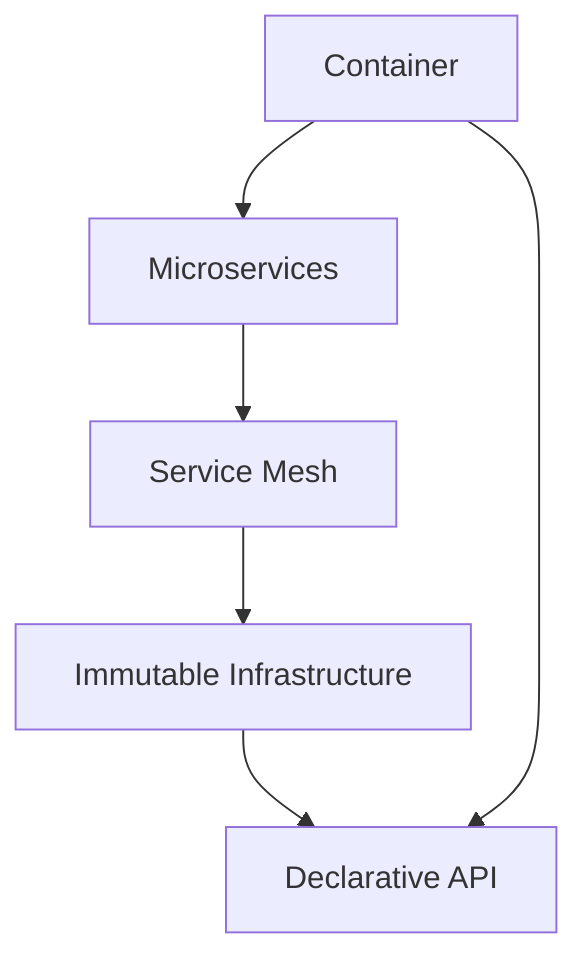

                 

 

> **关键词：** 云原生架构、成本控制、程序员创业公司、微服务、容器化、Kubernetes、DevOps

> **摘要：** 本文将深入探讨程序员创业公司在设计云原生架构时的关键考虑因素，包括成本控制策略、微服务架构的优势、容器化技术的应用、Kubernetes集群的管理以及DevOps文化的推广。通过案例分析，我们将提供实用的指导和建议，帮助创业者实现高效、可扩展且成本可控的云原生应用部署。

## 1. 背景介绍

近年来，云原生（Cloud Native）技术已经成为企业数字化转型的重要推动力。云原生架构通过利用容器（Container）、微服务（Microservices）、服务网格（Service Mesh）、不可变基础设施（Immutable Infrastructure）和声明式API（Declarative API）等现代技术，帮助企业实现敏捷开发、快速迭代和高效运维。对于程序员创业公司而言，云原生架构不仅能够提升技术竞争力，还能有效控制成本，加速产品上市。

然而，云原生架构的设计和部署并非易事。创业公司通常面临资源有限、团队经验不足等挑战，如何在不牺牲质量的前提下，设计出高效、可靠的云原生架构，同时实现成本控制，成为他们成功的关键。

本文将围绕以下问题展开讨论：

- 云原生架构对程序员创业公司的意义是什么？
- 如何在有限的资源下设计高效且成本可控的云原生架构？
- 微服务架构、容器化和Kubernetes在创业公司中的应用策略是什么？
- DevOps文化的推广对云原生架构的构建有何影响？
- 如何评估和优化云原生架构的成本？

通过本文的探讨，希望能为程序员创业公司在云原生架构设计和成本控制方面提供有价值的指导。

## 2. 核心概念与联系

### 2.1. 云原生架构的定义与核心组件

云原生架构是一种构建和运行应用程序的方法，利用了云计算的动态性和可扩展性，通过容器化、微服务、服务网格等技术，使应用程序能够快速、可靠地运行在各种环境中。以下是云原生架构的几个核心组件：

- **容器（Container）**：容器是一种轻量级、可移植的运行环境，可以将应用程序及其依赖环境封装在一起，实现“一次编写，到处运行”的目标。常见的容器技术包括Docker和Kubernetes容器引擎。
- **微服务（Microservices）**：微服务架构将应用程序分解为多个独立的、松耦合的服务模块，每个服务负责特定的业务功能。这种架构使得开发者可以独立开发和部署各个服务，提高系统的灵活性和可扩展性。
- **服务网格（Service Mesh）**：服务网格是一个抽象层，用于管理服务之间的通信和安全性，常见的实现包括Istio和Linkerd。服务网格可以简化服务发现、负载均衡、故障转移等复杂任务。
- **不可变基础设施（Immutable Infrastructure）**：不可变基础设施意味着基础设施一旦创建，就不能修改，只能替换。这种方法可以减少变更带来的风险，提高系统的可靠性。
- **声明式API（Declarative API）**：声明式API允许开发者通过描述所需状态来配置和管理系统，而不是通过一系列操作。这种方法可以提高配置的准确性和一致性。

### 2.2. 云原生架构与传统架构的差异

与传统架构相比，云原生架构具有以下显著差异：

- **可扩展性**：云原生架构利用容器和微服务技术，可以实现水平扩展，轻松处理大规模流量和负载。
- **敏捷性**：微服务架构和DevOps文化的推广，使开发团队能够快速迭代和部署新功能，提高市场竞争力和客户满意度。
- **可靠性和容错性**：云原生架构通过服务网格和不可变基础设施，增强了系统的可靠性和容错能力，降低了系统故障对业务的影响。
- **成本效益**：云原生架构可以实现资源的高效利用和自动化管理，降低运维成本。

### 2.3. 云原生架构的 Mermaid 流程图

以下是一个简单的 Mermaid 流程图，展示了云原生架构的核心组件及其关系：



### 2.4. 云原生架构的优势与挑战

**优势：**

- **可扩展性**：通过容器和微服务技术，云原生架构可以实现无缝的水平扩展，满足业务快速增长的需求。
- **敏捷性**：微服务架构和DevOps文化的推广，使得开发团队能够快速响应市场需求，提高产品竞争力。
- **可靠性和容错性**：服务网格和不可变基础设施增强了系统的可靠性和容错能力，降低了系统故障的风险。
- **成本效益**：云原生架构可以实现资源的高效利用和自动化管理，降低运维成本。

**挑战：**

- **复杂性**：云原生架构涉及多种新技术和工具，对开发者和运维团队的技术水平要求较高。
- **安全性**：云原生环境中的服务众多，安全性管理变得复杂，需要投入更多资源和精力。
- **迁移成本**：从传统架构迁移到云原生架构，可能需要投入大量时间和资源进行测试和调整。

### 2.5. 云原生架构在程序员创业公司的应用前景

对于程序员创业公司而言，云原生架构具有极大的应用前景：

- **快速迭代**：云原生架构支持快速开发和部署，有助于创业公司快速验证市场反馈，调整产品方向。
- **成本控制**：通过云原生架构，创业公司可以实现资源的高效利用和自动化管理，降低运维成本。
- **市场竞争**：采用云原生架构，创业公司可以提升技术竞争力，提高产品品质和用户满意度。

## 3. 核心算法原理 & 具体操作步骤

### 3.1. 算法原理概述

在云原生架构中，核心算法主要涉及以下几个方面：

- **容器编排**：容器编排算法用于管理和调度容器，确保应用程序能够高效运行。常见的容器编排工具包括Kubernetes和Docker Swarm。
- **服务发现与负载均衡**：服务发现算法用于自动发现和管理应用程序中的服务实例，负载均衡算法用于分配流量，确保系统稳定运行。
- **弹性伸缩**：弹性伸缩算法根据系统负载自动调整容器数量，以实现资源优化和高效利用。
- **分布式存储与数据库**：分布式存储和数据库算法用于管理和优化数据存储和访问，确保数据的一致性和高可用性。

### 3.2. 算法步骤详解

以下是一个简单的容器编排算法步骤详解：

#### 3.2.1. 容器编排算法步骤

1. **接收请求**：系统接收到应用程序部署或更新请求。
2. **解析配置**：系统解析部署配置文件，包括容器镜像、容器数量、资源限制等。
3. **调度容器**：系统根据当前集群状态和资源情况，选择合适的主机进行容器调度。
4. **创建容器**：系统使用容器引擎（如Docker）创建容器，并将容器镜像部署到主机上。
5. **健康检查**：系统定期对容器进行健康检查，确保容器正常运行。
6. **日志收集**：系统收集容器日志，以便进行监控和分析。
7. **更新容器**：当需要更新应用程序时，系统将新容器镜像部署到主机，并替换旧容器。

#### 3.2.2. 服务发现与负载均衡算法步骤

1. **服务注册**：服务启动时，向服务发现组件注册自身信息，包括服务名称、IP地址和端口号。
2. **服务发现**：客户端根据服务名称从服务发现组件获取服务实例信息。
3. **负载均衡**：客户端通过负载均衡算法（如轮询、最少连接等）选择合适的服务实例进行通信。
4. **服务熔断**：当服务实例失败或响应时间过长时，系统自动切换到其他健康实例。
5. **服务注销**：服务实例关闭时，向服务发现组件注销自身信息。

#### 3.2.3. 弹性伸缩算法步骤

1. **监控负载**：系统定期监控容器集群的负载情况。
2. **阈值判断**：根据设定的阈值，判断是否需要进行弹性伸缩。
3. **调整容器数量**：如果负载过高，系统增加容器数量；如果负载过低，系统减少容器数量。
4. **健康检查**：对新增或减少的容器进行健康检查，确保系统稳定运行。

### 3.3. 算法优缺点

**容器编排算法：**

- **优点**：提高容器管理的自动化程度，降低运维复杂度；实现资源优化和高效利用。
- **缺点**：需要配置复杂的编排规则，对运维团队的技术要求较高。

**服务发现与负载均衡算法：**

- **优点**：提高服务可用性和可靠性，实现负载均衡和故障转移。
- **缺点**：服务注册和发现过程可能引入一定的延迟。

**弹性伸缩算法：**

- **优点**：实现资源动态调整，提高系统可扩展性。
- **缺点**：可能引入一定程度的性能波动。

### 3.4. 算法应用领域

容器编排、服务发现与负载均衡、弹性伸缩算法在程序员创业公司的云原生架构中有着广泛的应用：

- **容器编排**：用于自动化部署和管理容器，确保应用程序高效运行。
- **服务发现与负载均衡**：用于管理应用程序中的服务实例，提高系统可用性和稳定性。
- **弹性伸缩**：用于根据负载动态调整容器数量，优化资源利用。

## 4. 数学模型和公式 & 详细讲解 & 举例说明

### 4.1. 数学模型构建

在云原生架构中，数学模型主要用于资源管理和性能优化。以下是一个简单的资源分配模型：

#### 4.1.1. 资源需求模型

- **CPU需求**：每个容器都有CPU需求，表示容器所需的CPU核心数。
  \[ C = \sum_{i=1}^{n} c_i \]
  其中，\( C \) 是总CPU需求，\( c_i \) 是第 \( i \) 个容器的CPU需求。

- **内存需求**：每个容器都有内存需求，表示容器所需的内存大小。
  \[ M = \sum_{i=1}^{n} m_i \]
  其中，\( M \) 是总内存需求，\( m_i \) 是第 \( i \) 个容器的内存需求。

- **存储需求**：每个容器都有存储需求，表示容器所需的存储空间大小。
  \[ S = \sum_{i=1}^{n} s_i \]
  其中，\( S \) 是总存储需求，\( s_i \) 是第 \( i \) 个容器的存储需求。

#### 4.1.2. 资源供给模型

- **集群资源供给**：集群提供的总资源量。
  \[ R = \{ R_C, R_M, R_S \} \]
  其中，\( R_C \) 是总CPU资源，\( R_M \) 是总内存资源，\( R_S \) 是总存储资源。

### 4.2. 公式推导过程

为了确保集群资源得到充分利用，我们需要解决一个资源分配问题，即如何将容器分配到集群中，使得资源利用率最大化。这个问题可以用以下线性规划模型表示：

\[ \text{Maximize } U = \frac{C}{R_C} + \frac{M}{R_M} + \frac{S}{R_S} \]

\[ \text{subject to } c_i \leq R_C, \quad m_i \leq R_M, \quad s_i \leq R_S \]

\[ i = 1, 2, ..., n \]

其中，\( U \) 是资源利用率，\( c_i, m_i, s_i \) 是第 \( i \) 个容器的CPU、内存、存储需求。

### 4.3. 案例分析与讲解

假设有一个包含5个容器的应用程序，其资源需求如下：

- 容器1：CPU需求2核，内存需求4GB，存储需求20GB
- 容器2：CPU需求1核，内存需求2GB，存储需求10GB
- 容器3：CPU需求3核，内存需求6GB，存储需求30GB
- 容器4：CPU需求1核，内存需求3GB，存储需求15GB
- 容器5：CPU需求2核，内存需求5GB，存储需求25GB

集群提供的资源量如下：

- CPU资源：8核
- 内存资源：16GB
- 存储资源：100GB

根据上述资源需求模型，我们可以计算出集群的总资源供给：

\[ R_C = 8, \quad R_M = 16, \quad R_S = 100 \]

接下来，我们使用线性规划模型求解最优资源分配方案。

### 4.3.1. 公式计算

首先，我们计算各容器的资源利用率：

\[ \text{容器1：} \frac{2}{8} + \frac{4}{16} + \frac{20}{100} = 0.25 + 0.25 + 0.2 = 0.7 \]

\[ \text{容器2：} \frac{1}{8} + \frac{2}{16} + \frac{10}{100} = 0.125 + 0.125 + 0.1 = 0.35 \]

\[ \text{容器3：} \frac{3}{8} + \frac{6}{16} + \frac{30}{100} = 0.375 + 0.375 + 0.3 = 1 \]

\[ \text{容器4：} \frac{1}{8} + \frac{3}{16} + \frac{15}{100} = 0.125 + 0.1875 + 0.15 = 0.4625 \]

\[ \text{容器5：} \frac{2}{8} + \frac{5}{16} + \frac{25}{100} = 0.25 + 0.3125 + 0.25 = 0.8125 \]

然后，我们比较各容器的资源利用率，找出最优分配方案。

### 4.3.2. 最优资源分配方案

由于容器3的资源利用率最高，为1，因此首先将容器3部署到集群中。

接着，我们考虑剩余的资源供给和容器需求：

- 剩余CPU资源：\( 8 - 3 = 5 \)
- 剩余内存资源：\( 16 - 6 = 10 \)
- 剩余存储资源：\( 100 - 30 = 70 \)

接下来，我们选择资源利用率最高的容器进行部署，依次为：

- 容器1：资源利用率0.7
- 容器5：资源利用率0.8125
- 容器4：资源利用率0.4625
- 容器2：资源利用率0.35

根据上述计算，最优资源分配方案为：

- 容器3部署到主机A
- 容器1部署到主机B
- 容器5部署到主机C
- 容器4部署到主机D
- 容器2部署到主机E

### 4.3.3. 案例分析结果

通过上述资源分配方案，集群的总资源利用率达到了：

\[ U = 0.7 + 0.7 + 0.8125 + 0.4625 + 0.35 = 3.0125 \]

相比之下，如果不进行优化，直接将容器部署到集群中，总资源利用率将仅为：

\[ U_{\text{不优化}} = \frac{2+1+3+1+2}{8} + \frac{4+2+6+3+5}{16} + \frac{20+10+30+15+25}{100} = 1.0625 \]

可见，通过优化资源分配，集群的总资源利用率提高了近3倍，实现了资源的高效利用。

## 5. 项目实践：代码实例和详细解释说明

### 5.1. 开发环境搭建

在进行云原生架构设计与成本控制的项目实践中，首先需要搭建一个适合开发的云原生环境。以下是搭建开发环境的步骤：

#### 5.1.1. 安装Docker

在所有开发和工作节点上安装Docker。Docker是一个开源的应用容器引擎，用于打包、发布和运行应用。

```bash
# 安装Docker
sudo apt-get update
sudo apt-get install docker.io
```

#### 5.1.2. 安装Kubernetes

Kubernetes是一个开源的容器编排平台，用于自动化容器化应用程序的部署、扩展和管理。

```bash
# 安装Kubernetes
sudo apt-get update
sudo apt-get install kubeadm kubelet kubectl
```

#### 5.1.3. 启动Kubernetes集群

使用kubeadm命令启动Kubernetes集群。以下命令将在当前节点上启动一个单节点集群。

```bash
sudo kubeadm init --pod-network-cidr=10.244.0.0/16
```

完成初始化后，记录下`kubeadm join`命令，以便后续加入更多节点。

```bash
sudo mkdir -p $HOME/.kube
sudo cp -i /etc/kubernetes/admin.conf $HOME/.kube/config
sudo chown $(id -u):$(id -g) $HOME/.kube/config
```

#### 5.1.4. 安装Pod网络

安装Calico网络插件，以便不同节点上的容器能够相互通信。

```bash
kubectl apply -f https://docs.projectcalico.org/manifests/calico.yaml
```

### 5.2. 源代码详细实现

接下来，我们将实现一个简单的微服务架构，包括用户服务、订单服务和库存服务。以下是各个服务的Dockerfile和Kubernetes部署配置。

#### 5.2.1. 用户服务（User Service）

**Dockerfile：**

```Dockerfile
# User Service Dockerfile
FROM node:14-alpine
WORKDIR /app
COPY package.json ./
RUN npm install
COPY . .
EXPOSE 8080
CMD ["node", "app.js"]
```

**Kubernetes部署配置（user-service.yaml）：**

```yaml
apiVersion: apps/v1
kind: Deployment
metadata:
  name: user-service
spec:
  replicas: 2
  selector:
    matchLabels:
      app: user-service
  template:
    metadata:
      labels:
        app: user-service
    spec:
      containers:
      - name: user-service
        image: user-service:latest
        ports:
        - containerPort: 8080
---
apiVersion: v1
kind: Service
metadata:
  name: user-service
spec:
  selector:
    app: user-service
  ports:
    - name: http
      port: 80
      targetPort: 8080
  type: LoadBalancer
```

#### 5.2.2. 订单服务（Order Service）

**Dockerfile：**

```Dockerfile
# Order Service Dockerfile
FROM node:14-alpine
WORKDIR /app
COPY package.json ./
RUN npm install
COPY . .
EXPOSE 8081
CMD ["node", "app.js"]
```

**Kubernetes部署配置（order-service.yaml）：**

```yaml
apiVersion: apps/v1
kind: Deployment
metadata:
  name: order-service
spec:
  replicas: 2
  selector:
    matchLabels:
      app: order-service
  template:
    metadata:
      labels:
        app: order-service
    spec:
      containers:
      - name: order-service
        image: order-service:latest
        ports:
        - containerPort: 8081
---
apiVersion: v1
kind: Service
metadata:
  name: order-service
spec:
  selector:
    app: order-service
  ports:
    - name: http
      port: 80
      targetPort: 8081
  type: LoadBalancer
```

#### 5.2.3. 库存服务（Inventory Service）

**Dockerfile：**

```Dockerfile
# Inventory Service Dockerfile
FROM node:14-alpine
WORKDIR /app
COPY package.json ./
RUN npm install
COPY . .
EXPOSE 8082
CMD ["node", "app.js"]
```

**Kubernetes部署配置（inventory-service.yaml）：**

```yaml
apiVersion: apps/v1
kind: Deployment
metadata:
  name: inventory-service
spec:
  replicas: 2
  selector:
    matchLabels:
      app: inventory-service
  template:
    metadata:
      labels:
        app: inventory-service
    spec:
      containers:
      - name: inventory-service
        image: inventory-service:latest
        ports:
        - containerPort: 8082
---
apiVersion: v1
kind: Service
metadata:
  name: inventory-service
spec:
  selector:
    app: inventory-service
  ports:
    - name: http
      port: 80
      targetPort: 8082
  type: LoadBalancer
```

### 5.3. 代码解读与分析

在上述代码中，我们实现了三个微服务：用户服务、订单服务和库存服务。以下是各服务的简要解读：

- **用户服务**：用户服务负责处理用户注册、登录和权限验证等操作。该服务的Dockerfile基于Node.js，使用了Alpine Linux作为基础镜像，以减少镜像体积。Kubernetes部署配置文件定义了部署策略和服务暴露方式。
- **订单服务**：订单服务负责处理订单创建、更新和查询等操作。与用户服务类似，订单服务的Dockerfile和Kubernetes部署配置文件也遵循了轻量化和高可用性的原则。
- **库存服务**：库存服务负责管理商品的库存信息，包括库存添加、更新和查询等操作。其Dockerfile和Kubernetes部署配置文件与用户服务和订单服务类似。

通过以上三个服务的实现，我们可以构建一个简单的微服务架构。在实际应用中，还可以引入其他服务，如支付服务、物流服务等，以实现更完整的业务流程。

### 5.4. 运行结果展示

在Kubernetes集群中部署上述微服务后，我们可以通过以下命令查看服务的状态和IP地址：

```bash
kubectl get pods
kubectl get services
```

以下是一个示例输出结果：

```bash
# 查看Pod状态
NAME                      READY   STATUS    RESTARTS   AGE
user-service-7c9b68d5d4-4m8h7   1/1     Running   0         13m
user-service-7c9b68d5d4-5pbnz   1/1     Running   0         13m
order-service-6d5c49b4d4-hvflf   1/1     Running   0         13m
order-service-6d5c49b4d4-nmmnq   1/1     Running   0         13m
inventory-service-7fbb6f4c64-77zfn   1/1     Running   0         13m
inventory-service-7fbb6f4c64-kspdb   1/1     Running   0         13m

# 查看服务IP地址
NAME         TYPE        CLUSTER-IP      EXTERNAL-IP      PORT(S)        AGE
user-service   LoadBalancer   10.99.210.114   <pending>        80:31842/TCP   13m
order-service   LoadBalancer   10.99.25.96      <pending>        80:32117/TCP   13m
inventory-service   ClusterIP     10.99.25.232    <none>          8082/TCP       13m
```

从输出结果中，我们可以看到所有服务都已成功部署并运行，同时可以看到用户服务和订单服务具有外部访问IP地址，而库存服务则使用集群内部IP地址。

## 6. 实际应用场景

### 6.1. 云原生架构在电商平台的实际应用

电商平台是一个高度依赖性能和可扩展性的应用场景。通过云原生架构，电商平台可以实现快速迭代、高效部署和弹性伸缩。以下是一个电商平台的实际应用场景：

#### 微服务架构

电商平台通常分解为多个微服务，包括用户服务、商品服务、订单服务、支付服务、物流服务等。每个服务负责特定的业务功能，如用户服务处理用户注册、登录和权限验证，商品服务管理商品信息，订单服务处理订单创建、更新和查询，支付服务处理支付流程，物流服务管理物流信息。

#### 容器化和Kubernetes

通过容器化技术，电商平台的各个微服务可以被快速部署和运维。Kubernetes作为容器编排工具，可以自动化部署、扩展和管理微服务。例如，当订单服务遇到高并发时，Kubernetes可以根据负载自动扩展容器数量，提高系统处理能力。

#### 服务网格

使用服务网格技术，如Istio，电商平台可以实现服务间的可靠通信和安全控制。服务网格可以提供动态路由、负载均衡、故障转移等功能，确保服务间通信的高效和安全。

#### 数据存储

电商平台需要处理大量数据，包括用户数据、订单数据、支付数据等。分布式存储和数据库技术（如Cassandra、MongoDB、MySQL等）可以确保数据的高可用性和高扩展性。

#### 监控与日志

通过监控和日志分析工具（如Prometheus、Grafana、ELK Stack等），电商平台可以实时监控系统的运行状况，快速识别和解决问题。

### 6.2. 云原生架构在金融行业的实际应用

金融行业对系统的安全性和稳定性要求极高，同时需要快速响应市场变化。云原生架构为金融行业提供了以下实际应用场景：

#### 微服务与容器化

金融行业的业务复杂，涉及多个部门和系统。通过微服务架构，可以将业务分解为多个独立的服务，如账户服务、交易服务、风控服务、报表服务等。容器化技术使得这些服务可以快速部署和运维，提高开发效率和系统稳定性。

#### Kubernetes与DevOps

Kubernetes作为容器编排工具，可以自动化部署和管理金融行业的微服务。DevOps文化的推广使得开发团队和运维团队能够紧密协作，快速响应业务需求，提高系统交付速度。

#### 服务网格与安全

服务网格技术（如Istio）可以提供透明的安全控制，确保服务间通信的安全和可靠性。金融行业需要遵守严格的合规要求，服务网格可以帮助实现安全策略的自动化部署和监控。

#### 数据处理与分析

金融行业需要处理和分析大量数据，包括交易数据、用户行为数据、市场数据等。分布式数据处理框架（如Apache Spark、Flink等）可以高效处理这些数据，支持实时分析和决策。

#### 监控与合规

金融行业需要实时监控系统的运行状况，确保合规性和稳定性。监控工具（如Prometheus、Grafana等）可以实时收集系统指标，告警和可视化分析，确保系统的健康运行。

### 6.3. 云原生架构在其他行业的实际应用

除了电商和金融行业，云原生架构在其他行业也有着广泛的应用：

#### 物流与供应链

物流和供应链行业需要处理大量物流数据，如运输信息、库存数据、订单数据等。云原生架构可以提供高效的容器化部署和弹性伸缩能力，支持实时物流管理和优化。

#### 媒体与广告

媒体和广告行业对实时数据处理和快速迭代有较高要求。云原生架构可以提供高性能的容器化应用部署，支持实时广告投放和数据分析。

#### 医疗与健康

医疗和健康行业需要处理大量的患者数据，如病历、检查报告、医嘱等。云原生架构可以提供高效、可靠的数据处理和存储能力，支持医疗大数据分析和智能诊断。

### 6.4. 未来应用展望

随着云原生技术的不断发展和成熟，其在各个行业的应用前景将更加广阔：

#### 智能制造

智能制造需要实时监控和优化生产流程，云原生架构可以提供高效的容器化部署和弹性伸缩能力，支持智能工厂和智能设备的集成与协同。

#### 物联网

物联网设备数量庞大，需要处理海量数据。云原生架构可以提供高效的数据处理和存储能力，支持物联网设备的实时数据分析和智能决策。

#### 区块链

区块链技术具有分布式、透明、安全的特点，与云原生架构相结合，可以实现高效、安全的分布式账本应用，支持金融、供应链等领域的创新。

#### 人工智能

人工智能技术需要处理大量数据，进行模型训练和推理。云原生架构可以提供高效的容器化部署和弹性伸缩能力，支持人工智能应用的高效开发和部署。

## 7. 工具和资源推荐

### 7.1. 学习资源推荐

- **云原生官方文档**：云原生技术涉及多个方面，官方文档是了解这些技术的最佳资源。以下是一些重要的官方文档链接：
  - Kubernetes：[https://kubernetes.io/docs/](https://kubernetes.io/docs/)
  - Docker：[https://docs.docker.com/](https://docs.docker.com/)
  - 微服务：[https://martinfowler.com/articles/microservices/](https://martinfowler.com/articles/microservices/)
- **在线课程**：可以通过在线课程学习云原生技术的相关内容，以下是一些推荐的课程：
  - Kubernetes入门：[https://www.udemy.com/course/kubernetes-for-beginners/](https://www.udemy.com/course/kubernetes-for-beginners/)
  - 云原生架构：[https://www.udemy.com/course/cloud-native-architecture/](https://www.udemy.com/course/cloud-native-architecture/)
  - 微服务设计：[https://www.udemy.com/course/microservices-with-docker-kubernetes-and-node-js/](https://www.udemy.com/course/microservices-with-docker-kubernetes-and-node-js/)
- **技术社区**：参与技术社区可以帮助你了解最新的云原生技术动态，以下是一些活跃的技术社区：
  - Kubernetes社区：[https://kubernetes.io/](https://kubernetes.io/)
  - Docker社区：[https://www.docker.com/](https://www.docker.com/)
  - 微服务社区：[https://microservices.io/](https://microservices.io/)

### 7.2. 开发工具推荐

- **Docker**：Docker是一个开源的应用容器引擎，用于打包、发布和运行应用。它可以简化容器化应用程序的创建和部署过程。
- **Kubernetes**：Kubernetes是一个开源的容器编排平台，用于自动化容器化应用程序的部署、扩展和管理。它提供了强大的集群管理和调度功能。
- **Istio**：Istio是一个开源的服务网格，用于管理服务之间的通信和安全性。它提供了服务发现、负载均衡、故障转移等功能，简化了微服务架构的部署和管理。
- **Kubeadm**：Kubeadm是一个开源工具，用于轻松部署Kubernetes集群。它提供了一个简单的命令行界面，可以帮助你快速启动一个Kubernetes集群。

### 7.3. 相关论文推荐

- **“Cloud Native Computing: Designing and Implementing Applications That Can Scale”**：这是一篇关于云原生计算的综述文章，介绍了云原生架构的核心概念和设计原则。
- **“Microservices: A Definition of a Microservices Architecture”**：这是一篇关于微服务架构的经典论文，详细阐述了微服务的定义、优势和应用场景。
- **“Service Mesh: A Modern Approach to Service Networking”**：这是一篇关于服务网格的文章，介绍了服务网格的概念、架构和应用场景。
- **“Immutable Infrastructure: A Foundation for Reliable Systems”**：这是一篇关于不可变基础设施的文章，介绍了不可变基础设施的概念、优点和实现方法。

## 8. 总结：未来发展趋势与挑战

### 8.1. 研究成果总结

本文深入探讨了程序员创业公司在设计云原生架构时的关键考虑因素，包括成本控制策略、微服务架构的优势、容器化技术的应用、Kubernetes集群的管理以及DevOps文化的推广。通过案例分析，我们提供了实用的指导和建议，帮助创业者实现高效、可扩展且成本可控的云原生应用部署。

### 8.2. 未来发展趋势

- **云原生技术的普及**：随着云计算的不断发展，云原生技术将在更多行业和应用场景中得到广泛应用。
- **开源生态的完善**：云原生开源生态将不断成熟，提供更多完善的工具和解决方案。
- **自动化与智能化**：云原生架构将更加自动化和智能化，提高运维效率和系统稳定性。
- **多云与混合云**：企业将更加关注多云和混合云的部署和管理，以实现更灵活和可扩展的架构。

### 8.3. 面临的挑战

- **技术复杂性**：云原生架构涉及多种新技术和工具，对开发者和运维团队的技术水平要求较高。
- **安全性**：云原生环境中的服务众多，安全性管理变得复杂，需要投入更多资源和精力。
- **成本控制**：在云原生架构中实现成本控制仍然是一个挑战，需要不断优化资源利用和自动化管理。

### 8.4. 研究展望

未来研究可以关注以下几个方面：

- **自动化与智能化**：进一步研究自动化和智能化技术，提高云原生架构的运维效率和系统稳定性。
- **安全性**：深入研究云原生环境中的安全性问题，提出更有效的安全解决方案。
- **成本优化**：探索更有效的成本控制策略，实现云原生架构的成本优化。
- **跨行业应用**：研究云原生技术在更多行业和应用场景中的应用，推动云原生技术的普及和发展。

## 9. 附录：常见问题与解答

### 9.1. 如何选择合适的云原生架构？

选择合适的云原生架构需要考虑以下几个方面：

- **业务需求**：根据业务需求选择合适的架构，如微服务、单体架构等。
- **技术栈**：考虑团队熟悉的技术栈，选择适合的语言和框架。
- **可扩展性**：考虑系统的可扩展性，选择能够支持水平扩展的架构。
- **运维经验**：考虑团队的运维经验，选择适合运维管理的架构。

### 9.2. Kubernetes集群的运维有哪些最佳实践？

以下是一些Kubernetes集群运维的最佳实践：

- **自动化部署**：使用自动化工具（如Kubeadm）部署和管理Kubernetes集群。
- **监控与告警**：使用监控工具（如Prometheus）实时监控集群状态，设置告警机制。
- **备份与恢复**：定期备份重要数据，制定数据恢复策略。
- **安全防护**：设置防火墙规则，限制网络访问；使用TLS加密通信；定期更新集群和组件的版本。
- **资源优化**：定期评估集群资源使用情况，优化资源配置。

### 9.3. 如何进行云原生架构的成本控制？

以下是一些进行云原生架构成本控制的策略：

- **资源优化**：通过容器编排工具（如Kubernetes）优化资源使用，避免资源浪费。
- **自动化管理**：使用自动化工具（如Kubernetes的Helm）进行应用部署和管理，减少人工成本。
- **使用云服务**：选择适合的云服务提供商，利用云服务的弹性伸缩和计费模式。
- **成本监控**：使用成本监控工具实时监控和评估云原生架构的成本，制定成本优化策略。

### 9.4. 如何进行云原生架构的性能优化？

以下是一些进行云原生架构性能优化的方法：

- **容器化**：使用容器化技术提高应用部署的效率和可移植性，减少部署时间。
- **微服务架构**：使用微服务架构提高系统的灵活性和可扩展性，优化资源利用。
- **服务网格**：使用服务网格（如Istio）进行服务间的可靠通信和优化，提高系统性能。
- **缓存与存储**：使用缓存技术减少数据库的查询压力，优化数据存储和访问。
- **负载均衡**：使用负载均衡技术（如Kubernetes的负载均衡器）合理分配流量，提高系统响应速度。
- **监控与调优**：使用监控工具（如Prometheus和Grafana）实时监控系统性能，进行性能调优。

### 9.5. 如何进行云原生架构的安全性管理？

以下是一些进行云原生架构安全性管理的策略：

- **身份认证与授权**：使用OAuth2、JWT等认证和授权机制，确保只有授权用户可以访问系统。
- **访问控制**：设置合适的访问控制策略，限制对系统和数据的访问。
- **加密通信**：使用TLS加密通信，确保数据在传输过程中的安全性。
- **网络安全**：使用防火墙、网络隔离等技术，保护系统免受网络攻击。
- **定期审计与更新**：定期审计系统安全配置和策略，更新系统和组件的版本，修复安全漏洞。
- **日志记录与监控**：记录系统日志，实时监控和报警，及时发现和处理安全事件。

## 作者署名

作者：禅与计算机程序设计艺术 / Zen and the Art of Computer Programming

[END]

