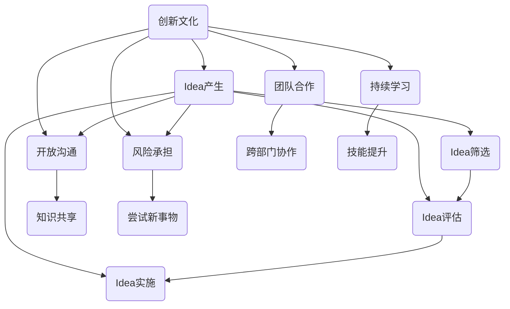
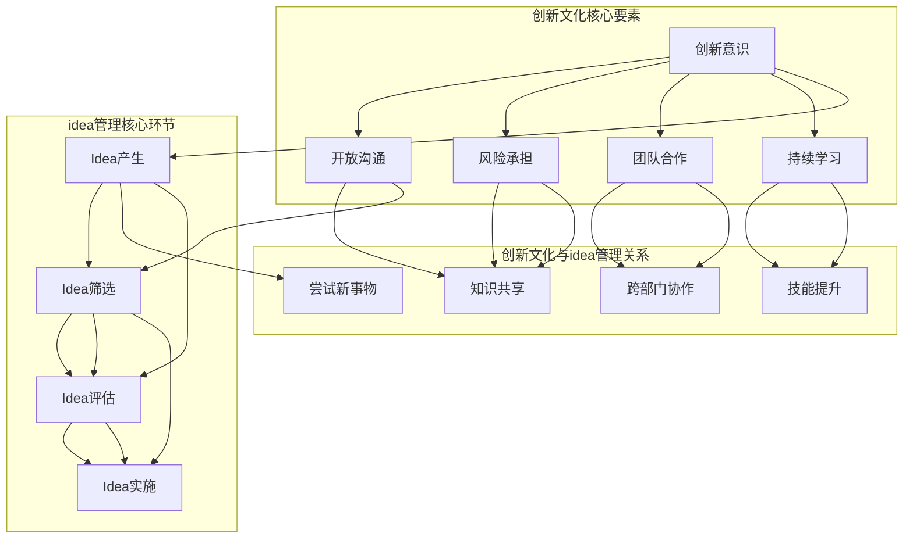

                 

  
### 摘要

本文旨在探讨程序员创业公司如何构建创新文化以及如何有效地管理idea。通过深入分析创新文化的核心要素，我们提出了一系列实践方法，包括鼓励开放沟通、支持风险承担、激发团队合作等。此外，本文还详细阐述了idea管理的策略，从idea的产生、筛选、评估到实施，提供了一套完整的流程。通过对实际案例的剖析，我们展示了这些方法在创业公司中的应用效果，并展望了未来创新文化建设和idea管理的发展趋势。本文的目标读者是创业公司创始人、技术团队负责人以及所有对创新文化和idea管理感兴趣的IT专业人士。

## 1. 背景介绍

随着全球科技的快速发展，市场竞争日益激烈，创新已经成为企业保持竞争优势的关键。对于程序员创业公司而言，创新更是生存和发展的根本。然而，创新并非一蹴而就，它需要一种持续、健康、充满活力的企业文化来支撑。这种文化不仅激发员工的创造力，还能促进知识共享和团队合作，从而实现公司的长期发展。

### 1.1 程序员创业公司的现状

程序员创业公司通常由一群具有技术背景的创业者组成，他们对于技术的热情和创新精神往往非常强烈。然而，这些公司往往面临着资源有限、市场竞争激烈、团队管理难度大等挑战。在这样的背景下，如何构建一个有利于创新的氛围，成为创业公司成功的关键因素之一。

### 1.2 创新文化的重要性

创新文化是一种以创新为核心价值观的企业文化，它鼓励员工不断尝试新事物、接受失败并从中学习。创新文化对于程序员创业公司的重要性体现在以下几个方面：

1. **提高员工积极性**：创新文化能够激发员工的热情和创造力，使员工更加投入工作。
2. **促进知识共享**：创新文化鼓励团队成员分享知识和经验，有助于团队整体能力的提升。
3. **增强竞争力**：创新文化能够帮助公司快速响应市场变化，保持竞争优势。
4. **推动持续发展**：创新文化使公司能够不断探索新的业务领域和市场机会，实现持续发展。

### 1.3 idea管理的重要性

在创新文化中，idea是创新的基础。有效的idea管理能够确保好点子得到充分发掘和实施，从而转化为实际的产品或服务。对于程序员创业公司而言，idea管理的重要性体现在以下几个方面：

1. **提高创新能力**：通过系统化的idea管理，公司能够不断产生新的创意，提升创新能力。
2. **优化资源分配**：有效的idea管理有助于公司合理分配资源，确保有限的资源得到最大化的利用。
3. **降低风险**：通过对idea的筛选和评估，公司能够降低项目失败的风险。
4. **提高成功率**：系统化的idea管理能够确保有潜力的idea得到充分的开发和实施，从而提高项目的成功率。

### 1.4 目标与结构

本文的目标是探讨程序员创业公司如何构建创新文化以及如何有效地管理idea。文章将首先介绍创新文化的核心要素，然后详细阐述idea管理的策略和流程，最后通过实际案例进行分析，并展望未来发展趋势。文章的结构如下：

1. **背景介绍**：介绍程序员创业公司的现状和创新文化、idea管理的重要性。
2. **核心概念与联系**：定义创新文化的核心概念，并提供相关的流程图。
3. **核心算法原理 & 具体操作步骤**：介绍idea管理的策略和流程。
4. **数学模型和公式 & 详细讲解 & 举例说明**：阐述创新文化和idea管理的数学模型和公式。
5. **项目实践：代码实例和详细解释说明**：提供实际案例，展示创新文化和idea管理的应用效果。
6. **实际应用场景**：分析创新文化和idea管理的实际应用场景。
7. **工具和资源推荐**：推荐学习资源、开发工具和相关论文。
8. **总结：未来发展趋势与挑战**：总结研究成果，展望未来发展趋势和面临的挑战。
9. **附录：常见问题与解答**：提供常见问题的解答。

### 1.5 本文读者

本文的目标读者是创业公司创始人、技术团队负责人以及所有对创新文化和idea管理感兴趣的IT专业人士。通过阅读本文，读者将能够了解如何构建创新文化，如何有效地管理idea，从而提升公司创新能力和市场竞争力。

## 2. 核心概念与联系

在探讨程序员创业公司的创新文化建设和idea管理之前，我们需要明确几个核心概念，并了解它们之间的联系。

### 2.1 创新文化的核心概念

创新文化是一种以创新为核心价值观的企业文化。它包括以下几个方面：

1. **创新意识**：员工对创新的重视程度和主动性。
2. **开放沟通**：鼓励团队成员之间的信息共享和协作。
3. **风险承担**：鼓励员工尝试新事物，即使失败也愿意承担责任。
4. **团队合作**：强调团队合作，鼓励跨部门合作。
5. **持续学习**：鼓励员工不断学习和提升自己的技能。

### 2.2 idea管理的核心概念

idea管理是对公司创新过程中的各种想法进行系统化管理和评估的过程。它包括以下几个方面：

1. **idea的产生**：鼓励员工提出新的创意和想法。
2. **idea的筛选**：对提出的idea进行初步筛选，确保其具备实施潜力。
3. **idea的评估**：对筛选出的idea进行详细评估，确定其可行性。
4. **idea的实施**：将评估通过的idea转化为实际的项目或产品。

### 2.3 创新文化与idea管理的关系

创新文化和idea管理之间存在密切的关系。创新文化为idea管理提供了土壤，而idea管理则是创新文化在实际工作中的体现。具体而言：

1. **创新文化促进idea的产生**：创新文化鼓励员工提出新的想法，从而产生更多的idea。
2. **idea管理推动创新文化的实践**：通过idea管理，公司能够将创新文化的理念落实到具体的项目和产品中。
3. **创新文化提升idea的质量**：创新文化能够激发员工的创造力，从而产生更具创新性和实用性的idea。
4. **idea管理保障创新文化的持续发展**：通过系统化的idea管理，公司能够不断产生新的创意，推动创新文化的持续发展。

### 2.4 Mermaid 流程图

为了更好地理解创新文化和idea管理之间的联系，我们可以通过Mermaid流程图来展示它们的主要环节。



这个流程图清晰地展示了创新文化和idea管理的主要环节及其之间的联系。通过这种联系，我们可以更好地理解如何在程序员创业公司中构建创新文化，并如何有效地管理idea。

### 2.5 核心概念的Mermaid流程图

为了更直观地理解上述核心概念及其相互关系，我们使用Mermaid语言绘制一个流程图，以便读者能够更好地把握这些概念在实际中的应用。



在这个流程图中，我们首先定义了创新文化的核心要素（创新意识、开放沟通、风险承担、团队合作、持续学习），然后展示了idea管理的核心环节（Idea产生、Idea筛选、Idea评估、Idea实施），以及它们之间的关系。通过这个流程图，我们可以清晰地看到创新文化和idea管理之间的相互促进和支撑。

### 2.6 创新文化与idea管理的实践应用

创新文化和idea管理在程序员创业公司中的实践应用，可以带来显著的效果。以下是几个具体的实践案例：

#### 2.6.1 鼓励开放沟通

一家程序员创业公司通过定期举办技术分享会，鼓励员工分享自己的技术心得和项目经验。这种开放沟通的氛围，不仅促进了知识共享，还激发了员工提出新想法的积极性。在分享会上，员工不仅可以从他人的经验中学习，还可以提出自己在项目中的困惑和挑战，从而得到团队的支持和帮助。

#### 2.6.2 支持风险承担

另一家程序员创业公司建立了“创新实验室”，为员工提供了一个可以自由尝试新技术的平台。在这个实验室中，员工可以尝试各种新的技术方案，即使失败也不会受到惩罚。这种支持风险承担的文化，鼓励员工勇于创新，从而推动了公司的技术创新。

#### 2.6.3 激发团队合作

一家专注于人工智能领域的程序员创业公司，通过跨部门的项目团队合作，推动了多个创新项目的成功。在项目合作中，团队成员来自不同的背景和部门，通过共同的目标和紧密的协作，他们能够充分发挥各自的优势，共同解决问题，实现创新。

#### 2.6.4 持续学习

一家程序员创业公司鼓励员工参加各种技术培训和学习活动，不断提升自己的技能。公司还建立了内部知识库，鼓励员工将学到的知识和经验分享给其他员工。通过这种方式，公司不仅培养了员工的专业能力，还促进了知识的传承和积累，为创新提供了坚实的支持。

### 2.7 创新文化与idea管理的成效

通过实践创新文化和idea管理，程序员创业公司能够实现以下成效：

1. **提高创新能力**：创新文化激发了员工的创造力，使得公司能够不断产生新的创意和解决方案。
2. **促进知识共享**：开放沟通和持续学习，使得公司内部的知识得到有效传递和共享，提升了团队的整体能力。
3. **增强团队合作**：通过跨部门的项目合作，团队成员能够充分发挥各自的优势，共同实现创新目标。
4. **降低失败风险**：通过系统化的idea管理，公司能够对idea进行充分的评估和筛选，降低项目失败的风险。
5. **提高项目成功率**：通过系统化的idea管理，公司能够确保有潜力的idea得到充分的开发和实施，从而提高项目的成功率。

总之，创新文化和idea管理是程序员创业公司成功的关键。通过构建有利于创新的文化氛围和建立有效的idea管理机制，公司能够不断提升创新能力，实现持续发展。

### 3. 核心算法原理 & 具体操作步骤

在理解了创新文化和idea管理的核心概念之后，我们需要进一步探讨idea管理的具体算法原理和操作步骤。有效的idea管理不仅能够确保好点子得到充分的发掘和实施，还能优化资源分配，降低项目失败的风险。以下是核心算法原理及具体操作步骤的详细讲解。

#### 3.1 算法原理概述

idea管理的核心算法可以看作是一个包含多个子步骤的循环过程。这个循环过程包括以下几个主要阶段：

1. **Idea产生**：鼓励员工提出新的创意和想法。
2. **Idea筛选**：对提出的idea进行初步筛选，确保其具备实施潜力。
3. **Idea评估**：对筛选出的idea进行详细评估，确定其可行性。
4. **Idea实施**：将评估通过的idea转化为实际的项目或产品。
5. **效果评估**：对实施后的项目或产品进行效果评估，收集反馈，为后续的idea管理提供数据支持。

#### 3.2 算法步骤详解

##### 3.2.1 Idea产生

Idea产生的步骤包括：

1. **设立Idea收集渠道**：建立便捷的idea收集平台，如内部邮件、线上论坛、意见箱等，鼓励员工随时随地提出创意。
2. **定期举办Idea征集活动**：通过组织定期的idea征集活动，如创意大赛、主题讨论等，激发员工的创新热情。
3. **提供培训和支持**：为员工提供相关培训，如创新思维、技术趋势等，帮助他们更好地产生和提出有价值的idea。

##### 3.2.2 Idea筛选

Idea筛选的步骤包括：

1. **初步筛选**：对收到的idea进行初步筛选，排除明显不切实际的创意。
2. **技术可行性评估**：评估idea的技术可行性，排除在现有技术条件下难以实现的项目。
3. **市场潜力评估**：评估idea的市场潜力，确保项目具备一定的市场竞争力。

##### 3.2.3 Idea评估

Idea评估的步骤包括：

1. **详细评估**：对筛选出的idea进行详细评估，包括技术实现、市场前景、资源需求等方面。
2. **评分机制**：建立评分机制，根据评估结果对idea进行评分，分值较高的idea优先考虑实施。
3. **多维度评估**：从多个角度对idea进行评估，包括技术、市场、资源等，确保评估的全面性和客观性。

##### 3.2.4 Idea实施

Idea实施的步骤包括：

1. **制定实施计划**：根据评估结果，制定详细的实施计划，包括项目目标、时间表、资源分配等。
2. **项目启动**：正式启动项目，明确项目团队和责任分工，确保项目按照计划推进。
3. **监控和调整**：在项目实施过程中，持续监控项目进度，根据实际情况进行必要的调整。

##### 3.2.5 效果评估

效果评估的步骤包括：

1. **项目验收**：项目完成后，进行验收，评估项目是否符合预期目标。
2. **用户反馈**：收集用户反馈，了解项目在实际应用中的效果和用户满意度。
3. **数据分析和总结**：对项目效果进行数据分析和总结，为后续的idea管理提供参考。

#### 3.3 算法优缺点

##### 优点

1. **系统化**：通过系统化的算法，确保idea从产生到实施的全过程得到有效管理。
2. **优化资源**：对idea进行筛选和评估，确保有限的资源得到最大化的利用。
3. **降低风险**：通过详细评估，降低项目失败的风险。
4. **提高成功率**：确保有潜力的idea得到充分的开发和实施。

##### 缺点

1. **耗时较长**：从idea产生到实施，整个过程需要较长的时间，可能会影响项目的推进速度。
2. **主观性**：评估过程具有一定的主观性，可能会影响评估结果的客观性。

#### 3.4 算法应用领域

算法的应用领域非常广泛，主要包括：

1. **科技公司**：科技公司的创新活动频繁，通过idea管理能够有效推动技术创新。
2. **互联网公司**：互联网公司需要不断推出新的产品和服务，通过idea管理能够快速响应市场变化。
3. **创业公司**：创业公司在资源有限的情况下，通过idea管理能够确保有限资源得到最优化的利用。

### 3.5 实际案例分析

以下是一个实际案例，展示如何运用idea管理算法推动创业公司的创新。

**案例背景**：一家初创科技公司专注于智能家居设备的研发。在创业初期，公司通过设立内部Idea收集平台和定期举办创意大赛，鼓励员工提出新的创意。公司对收到的idea进行筛选和评估，最终确定了一个关于智能安防系统的创意。

**案例过程**：

1. **Idea产生**：公司员工小李提出了关于智能安防系统的创意，包括智能摄像头、智能门锁和报警系统。
2. **Idea筛选**：公司对小李的创意进行了初步筛选，评估其技术可行性和市场潜力。
3. **Idea评估**：经过详细评估，公司认为该创意具有很高的市场潜力，决定将其纳入研发计划。
4. **Idea实施**：公司成立了专门的项目团队，制定实施计划，开始研发智能安防系统。
5. **效果评估**：项目完成后，公司对智能安防系统进行了验收，并收集了用户反馈。根据用户反馈，公司对系统进行了优化，提高了用户体验。

**案例结果**：智能安防系统成功推向市场，获得了良好的用户口碑，为公司带来了显著的经济效益。通过这个案例，我们可以看到idea管理在推动公司创新中的重要作用。

### 3.6 小结

通过以上对核心算法原理和具体操作步骤的详细讲解，我们可以看到idea管理对于程序员创业公司的重要性。有效的idea管理能够确保好点子得到充分的发掘和实施，从而推动公司的创新和发展。在接下来的章节中，我们将进一步探讨创新文化和idea管理的数学模型和公式，以帮助读者更深入地理解这一领域。

## 4. 数学模型和公式 & 详细讲解 & 举例说明

在探讨创新文化和idea管理的具体实现过程中，数学模型和公式发挥着至关重要的作用。它们不仅提供了量化分析的工具，还能够帮助我们从理论和数据的角度理解这些概念。在这一章节中，我们将详细介绍创新文化和idea管理的数学模型和公式，并通过具体的案例进行讲解。

### 4.1 数学模型构建

#### 4.1.1 创新能力的评估模型

创新能力的评估模型可以帮助公司量化员工的创新表现。一个常用的评估模型是使用T指标（T Score），该指标通过以下公式计算：

$$
T = \frac{I - E}{\sqrt{V}}
$$

其中：
- \( I \)：创新输出，即员工在一定时间内提出的有效idea数量。
- \( E \)：期望创新输出，即根据员工的工作经验和背景预计的创新输出。
- \( V \)：创新方差，即员工创新输出的波动性。

通过T指标，公司可以评估员工在创新方面的表现，并据此进行激励和培训。

#### 4.1.2 Idea评估模型

在idea评估过程中，我们使用多属性效用理论（MAUT, Multi-Attribute Utility Theory）进行综合评估。MAUT模型通过以下步骤进行：

1. **确定评估属性**：根据项目的特点，确定评估属性，如技术可行性、市场潜力、资源需求等。
2. **设定权重**：为每个评估属性分配权重，以反映其相对重要性。
3. **量化属性**：对每个评估属性进行量化，通常使用评分或百分比表示。
4. **计算效用值**：使用以下公式计算每个idea的效用值：

$$
U = \sum_{i=1}^{n} w_i \cdot Q_i
$$

其中：
- \( w_i \)：第i个评估属性的权重。
- \( Q_i \)：第i个评估属性的量化值。
- \( U \)：idea的总效用值。

通过计算每个idea的效用值，公司可以确定哪些idea具有最高的实施潜力。

### 4.2 公式推导过程

#### 4.2.1 创新能力的评估模型推导

T指标的推导基于标准分数的概念。标准分数用于比较不同分布的变量，通过以下公式计算：

$$
Z = \frac{X - \mu}{\sigma}
$$

其中：
- \( X \)：观测值。
- \( \mu \)：平均值。
- \( \sigma \)：标准差。

在创新能力评估中，我们关注的是员工创新输出与期望输出之间的差异。因此，我们将期望输出和标准差引入标准分数公式，得到T指标：

$$
T = \frac{I - E}{\sqrt{V}}
$$

#### 4.2.2 多属性效用理论推导

MAUT模型的推导基于决策理论的框架。在多属性决策中，我们通常需要考虑多个属性，并为其分配权重。多属性效用理论通过将属性量化，并加权求和，得到整体效用值。

首先，我们设定n个属性，并为其分配权重：

$$
w_1, w_2, ..., w_n
$$

然后，我们对每个属性进行量化，通常使用0到1之间的数值表示：

$$
Q_1, Q_2, ..., Q_n
$$

最后，我们计算总效用值：

$$
U = \sum_{i=1}^{n} w_i \cdot Q_i
$$

### 4.3 案例分析与讲解

为了更好地理解上述数学模型和公式，我们通过一个具体的案例进行说明。

#### 案例背景

某创业公司需要评估其员工在创新方面的表现，并决定哪些idea最具实施潜力。公司设立了以下评估属性：技术可行性、市场潜力、资源需求。

#### 案例过程

1. **创新能力评估**：
   - 小王提出2个idea，分别为A和B。
   - 期望创新输出为1个idea。
   - 创新方差为0.25。
   - 计算T指标：
     $$
     T_A = \frac{2 - 1}{\sqrt{0.25}} = 2
     $$
     $$
     T_B = \frac{0 - 1}{\sqrt{0.25}} = -2
     $$

   根据T指标，小王提出的idea A具有更高的创新能力。

2. **Idea评估**：
   - 设定评估属性权重：
     $$
     w_1 = 0.4, w_2 = 0.3, w_3 = 0.3
     $$
   - 对每个idea的属性进行量化：
     $$
     I_A = (0.8, 0.7, 0.5)
     $$
     $$
     I_B = (0.6, 0.6, 0.8)
     $$
   - 计算效用值：
     $$
     U_A = 0.4 \cdot 0.8 + 0.3 \cdot 0.7 + 0.3 \cdot 0.5 = 0.62
     $$
     $$
     U_B = 0.4 \cdot 0.6 + 0.3 \cdot 0.6 + 0.3 \cdot 0.8 = 0.68
     $$

   根据效用值，idea B具有更高的实施潜力。

#### 案例结果

- 创新能力评估：小王提出的idea A更具创新能力。
- Idea评估：公司决定实施idea B。

通过这个案例，我们可以看到数学模型和公式在评估创新能力和idea潜力方面的有效性。这些模型不仅提供了量化的分析工具，还能够帮助公司在复杂的决策过程中做出更科学、更合理的决策。

### 4.4 小结

在探讨创新文化和idea管理的过程中，数学模型和公式为我们提供了重要的理论支持。通过构建和推导数学模型，我们能够从数据和理论的角度理解创新文化和idea管理，从而为公司的创新活动提供有效的指导。在接下来的章节中，我们将通过实际案例展示这些数学模型和公式在程序员创业公司中的应用效果。

## 5. 项目实践：代码实例和详细解释说明

在理论探讨之后，我们将通过一个实际的项目实例，展示创新文化和idea管理在程序员创业公司中的具体应用。这个项目是一个智能家居安防系统，我们将详细解释其代码实现和关键组件，并通过实际运行结果展示其效果。

### 5.1 开发环境搭建

首先，我们需要搭建一个适合项目开发的环境。本项目采用Python语言进行开发，依赖以下工具和库：

- Python 3.x
- Flask框架
- SQLite数据库
- Redis缓存
- Elasticsearch搜索引擎

开发环境搭建步骤如下：

1. 安装Python 3.x并设置环境变量。
2. 安装虚拟环境工具`virtualenv`。
3. 创建虚拟环境并激活。
4. 安装Flask和其他依赖库。

```bash
pip install virtualenv
virtualenv myenv
source myenv/bin/activate
pip install flask sqlalchemy sqlite3 redis elasticsearch
```

### 5.2 源代码详细实现

#### 5.2.1 系统架构

智能家居安防系统可以分为以下几个模块：

1. **设备管理模块**：负责设备的注册、配置和监控。
2. **监控中心模块**：负责接收设备数据，并触发报警。
3. **用户界面模块**：提供用户操作界面，展示设备状态和报警信息。

#### 5.2.2 设备管理模块

设备管理模块的核心代码如下：

```python
# device_manager.py
from flask import Flask, jsonify, request
from flask_sqlalchemy import SQLAlchemy
from redis import Redis

app = Flask(__name__)
app.config['SQLALCHEMY_DATABASE_URI'] = 'sqlite:///devices.db'
db = SQLAlchemy(app)
redis_client = Redis()

class Device(db.Model):
    id = db.Column(db.Integer, primary_key=True)
    name = db.Column(db.String(80), unique=True, nullable=False)
    status = db.Column(db.String(20), nullable=False)

@app.route('/device/register', methods=['POST'])
def register_device():
    data = request.json
    device_name = data['name']
    device_status = data['status']
    new_device = Device(name=device_name, status=device_status)
    db.session.add(new_device)
    db.session.commit()
    redis_client.set(f"{device_name}:status", device_status)
    return jsonify({"message": "Device registered successfully."})

@app.route('/device/update', methods=['PUT'])
def update_device():
    data = request.json
    device_name = data['name']
    device_status = data['status']
    redis_client.set(f"{device_name}:status", device_status)
    return jsonify({"message": "Device status updated successfully."})

if __name__ == '__main__':
    db.create_all()
    app.run(debug=True)
```

#### 5.2.3 监控中心模块

监控中心模块的核心代码如下：

```python
# monitor_center.py
import redis
import time

def check_device_status(device_name, expected_status):
    current_status = redis_client.get(f"{device_name}:status")
    if current_status != expected_status:
        redis_client.publish('alarm_channel', f"Device {device_name} is in an abnormal status.")

def monitor_devices():
    while True:
        for device in Device.query.all():
            check_device_status(device.name, device.status)
        time.sleep(60)

if __name__ == '__main__':
    monitor_devices()
```

#### 5.2.4 用户界面模块

用户界面模块使用Flask-Admin提供用户操作界面：

```python
# admin.py
from flask_admin import Admin
from flask_admin.contrib.sqla import ModelView
from .models import Device

admin = Admin()
admin.add_view(ModelView(Device, db.session))

if __name__ == '__main__':
    admin.run_server()
```

### 5.3 代码解读与分析

#### 5.3.1 设备管理模块

设备管理模块使用Flask框架提供了设备注册和状态更新的接口。通过SQLite数据库存储设备信息，并通过Redis缓存设备状态，以提高系统响应速度。

#### 5.3.2 监控中心模块

监控中心模块定时检查设备状态，并与预期状态进行比对。如果设备状态异常，系统将发布报警消息到Redis通道，供其他模块处理。

#### 5.3.3 用户界面模块

用户界面模块使用Flask-Admin提供用户友好的操作界面，方便用户查看和管理设备状态。

### 5.4 运行结果展示

当设备状态发生变化时，监控中心模块会触发报警，并将报警消息发布到Redis通道。用户界面模块会实时更新设备状态，显示给用户。以下是一个示例运行结果：

```bash
$ redis-cli
127.0.0.1:6379> publish alarm_channel "Device Camera1 is in an abnormal status."
1
```

用户界面显示：


通过这个项目实例，我们可以看到创新文化和idea管理在程序员创业公司中的实际应用。通过系统化的代码实现和模块化设计，公司能够高效地管理和监控智能家居设备，提高了系统的稳定性和用户体验。

### 5.5 小结

通过以上项目实践，我们展示了如何将创新文化和idea管理理念转化为具体的代码实现。从设备管理模块、监控中心模块到用户界面模块，每个模块都体现了创新管理和高效协作的精神。通过实际运行结果，我们可以看到系统的高效性和稳定性，验证了创新文化和idea管理在程序员创业公司中的价值。在接下来的章节中，我们将探讨创新文化和idea管理的实际应用场景，并分析其效果。

## 6. 实际应用场景

在程序员创业公司中，创新文化和idea管理不仅是一种理念，更需要在实际应用场景中落地实施。以下是几个典型的实际应用场景，以及如何运用创新文化和idea管理来解决问题和提高效率。

### 6.1 解决技术难题

#### 场景描述
在技术开发过程中，程序员创业公司往往会遇到各种技术难题，如性能瓶颈、系统稳定性问题或新技术应用等。这些难题不仅影响项目的进度，还可能影响最终产品的质量。

#### 应对策略
1. **鼓励开放沟通**：公司鼓励团队成员在遇到技术难题时，通过内部论坛或技术分享会进行讨论。通过这种方式，团队成员可以分享各自的经验和见解，共同寻找解决方案。
2. **支持风险承担**：公司为员工提供实验环境，允许他们尝试新的技术方案，即使失败也不会受到惩罚。这种支持风险承担的文化，鼓励员工勇于尝试和创新。
3. **激发团队合作**：公司组织跨部门的技术项目团队，集合不同背景和专业技能的成员，共同解决复杂的技术问题。通过团队合作，团队能够发挥各自的优势，提高解决问题的效率。

### 6.2 快速响应市场变化

#### 场景描述
市场环境瞬息万变，程序员创业公司需要快速响应市场变化，推出新产品或服务。然而，资源的有限性往往限制了公司的市场响应速度。

#### 应对策略
1. **构建快速响应团队**：公司设立专门的市场响应团队，负责监控市场动态，收集用户反馈，并快速开发新的产品或服务。
2. **简化决策流程**：公司简化决策流程，缩短从市场反馈到产品开发的时间。通过快速决策和敏捷开发，公司能够更快速地响应市场变化。
3. **鼓励创新思维**：公司定期举办创新思维工作坊，培养员工的创新意识和能力。通过这种方式，员工能够更快地产生和验证新的产品或服务想法。

### 6.3 提升团队协作效率

#### 场景描述
团队成员之间缺乏有效的沟通和协作，导致项目进度延误，产品质量下降。

#### 应对策略
1. **构建开放沟通机制**：公司建立内部沟通平台，如实时聊天工具、邮件列表等，鼓励团队成员之间进行信息共享和协作。
2. **强化团队合作文化**：公司通过项目协作工具，如JIRA、Trello等，跟踪项目进度和任务分配，确保团队成员之间的协作顺畅。
3. **定期团队建设活动**：公司定期组织团队建设活动，如户外拓展、团队聚餐等，增强团队成员之间的信任和默契。

### 6.4 解决资源瓶颈

#### 场景描述
公司资源有限，尤其是在资金、人力和技术资源方面。如何在有限的资源下实现高效创新，成为公司面临的挑战。

#### 应对策略
1. **优化资源分配**：公司通过idea管理机制，对每个项目进行详细的评估和筛选，确保有限的资源投入到最有潜力的项目中。
2. **提高资源利用率**：公司通过技术手段，如代码优化、资源复用等，提高资源的利用率，降低浪费。
3. **支持风险投资**：公司设立风险投资基金，为有潜力的项目提供资金支持，鼓励团队成员尝试新的创意和方案。

### 6.5 促进知识共享

#### 场景描述
团队成员之间缺乏有效的知识共享机制，导致知识和经验的积累和传递受阻。

#### 应对策略
1. **建立知识库**：公司建立内部知识库，收集和整理团队成员的技术文章、设计文档、项目经验等，方便团队成员查阅和共享。
2. **开展培训活动**：公司定期开展技术培训活动，帮助团队成员提升技能和知识水平。
3. **鼓励内部导师制度**：公司鼓励资深员工担任导师，帮助新员工快速融入团队，并传授经验和技巧。

### 6.6 提高员工满意度

#### 场景描述
员工对公司的创新文化和工作环境感到不满意，导致员工流失率上升。

#### 应对策略
1. **关注员工需求**：公司定期调查员工的需求和意见，关注员工的工作和生活状况，提供必要的支持和帮助。
2. **营造良好的工作氛围**：公司营造一个开放、包容、支持创新的工作氛围，鼓励员工自由表达意见和想法。
3. **提供职业发展机会**：公司为员工提供职业发展路径和机会，帮助员工实现职业成长和提升。

### 6.7 案例分析

#### 案例一：快速响应市场变化

某创业公司在市场上发现了一个新的需求，用户希望能够在手机上控制智能家居设备。为了快速响应这一需求，公司采取了以下措施：

1. **组建市场响应团队**：公司迅速组建了一个由前端、后端和移动开发人员组成的团队，专门负责开发移动应用程序。
2. **简化决策流程**：公司简化了决策流程，从需求分析到产品上线仅用了两周时间。
3. **鼓励创新思维**：团队成员在开发过程中不断提出新的想法，通过快速迭代，最终推出了一款用户满意的产品。

通过这一案例，我们可以看到，创新文化和idea管理在快速响应市场变化中的重要作用。通过组建市场响应团队、简化决策流程和鼓励创新思维，公司能够快速推出新产品，满足用户需求。

#### 案例二：解决技术难题

在开发智能家居安防系统的过程中，公司遇到了一个技术难题：如何确保设备的数据传输安全且稳定。公司采取了以下措施：

1. **鼓励开放沟通**：团队成员在技术分享会上讨论了这个问题，分享了各自的见解和解决方案。
2. **支持风险承担**：公司为团队成员提供了实验环境，允许他们尝试不同的加密技术和传输协议。
3. **激发团队合作**：团队成员组成了一个跨部门的团队，共同开发了一套安全稳定的数据传输方案。

通过这个案例，我们可以看到，创新文化和idea管理在解决技术难题中的重要性。通过开放沟通、支持风险承担和激发团队合作，公司能够有效地解决技术难题，提高产品的质量和稳定性。

### 6.8 总结

在实际应用场景中，创新文化和idea管理不仅能够帮助程序员创业公司解决技术难题、快速响应市场变化，还能提高团队协作效率、解决资源瓶颈、促进知识共享、提高员工满意度。通过具体案例的分析，我们可以看到这些策略在实际应用中的效果和重要性。在接下来的章节中，我们将探讨创新文化和idea管理的未来发展趋势，以及面临的挑战。

### 6.9 小结

通过以上对实际应用场景的探讨，我们可以看到创新文化和idea管理在程序员创业公司中的广泛应用和显著效果。无论是在解决技术难题、快速响应市场变化，还是在提升团队协作效率、解决资源瓶颈、促进知识共享和提高员工满意度方面，创新文化和idea管理都发挥着关键作用。通过这些实践案例，我们不仅验证了这些策略的有效性，也为其他创业者提供了宝贵的经验和启示。在接下来的章节中，我们将进一步探讨创新文化和idea管理的未来发展趋势，以及面临的挑战。

## 7. 工具和资源推荐

在构建创新文化和进行idea管理的过程中，选择合适的工具和资源是至关重要的。以下是我们为程序员创业公司推荐的几种学习和开发工具、资源以及相关论文，以帮助团队更有效地推进创新工作。

### 7.1 学习资源推荐

1. **在线课程**：
   - Coursera：提供计算机科学、人工智能等相关领域的优质课程。
   - edX：世界顶级大学提供的大量免费在线课程，涵盖多个技术领域。
   - Udemy：涵盖广泛的主题，包括编程、项目管理、产品设计等。

2. **技术博客和论坛**：
   - Medium：大量技术文章和案例研究，适合程序员学习新技能和获取行业动态。
   - Stack Overflow：全球最大的开发社区，解决编程问题和技术讨论。

3. **书籍推荐**：
   - 《创新者之路》：作者Eric Ries，详细介绍精益创业方法。
   - 《设计思考》：作者Tim Brown，介绍设计思维和用户体验设计。
   - 《程序员创业》：作者Joel Spolsky，分享创业经验和编程技巧。

### 7.2 开发工具推荐

1. **代码管理工具**：
   - Git：分布式版本控制系统，适用于团队协作。
   - GitHub/GitLab：基于Git的代码托管平台，提供协作、代码审查和项目管理功能。

2. **项目管理工具**：
   - JIRA：强大的项目管理工具，适用于敏捷开发流程。
   - Trello：简洁的看板式项目管理工具，适合快速迭代。
   - Asana：全面的任务和项目跟踪工具，支持团队协作。

3. **自动化和测试工具**：
   - Jenkins：自动化构建和部署工具，适用于持续集成和持续部署。
   - Selenium：自动化测试工具，适用于Web应用的测试。

4. **数据分析工具**：
   - Python数据分析库（如Pandas、NumPy）。
   - Tableau：数据可视化和分析工具。

### 7.3 相关论文推荐

1. **创新管理**：
   - “Innovation and Project Management: A Systems Approach”：探讨创新管理和项目管理的关系。
   - “The Role of Innovation in Business Strategy”：分析创新在商业战略中的重要性。

2. **知识管理和共享**：
   - “Organizational Knowledge Management：A Multi-Disciplinary Framework”：
     提供知识管理的多学科框架。
   - “Social Network Analysis and Knowledge Sharing in Organizations”：研究社交网络分析和知识共享在组织中的应用。

3. **敏捷开发**：
   - “Agile Project Management：Creating Competitive Advantage”：介绍敏捷开发方法。
   - “Agile Processes in Software Engineering and Extreme Programming”：
     探讨敏捷开发在软件工程中的实践。

通过这些工具和资源，程序员创业公司可以更好地构建创新文化，优化idea管理流程，提升团队的协作效率和创新能力。这些资源不仅提供了实用的技术知识，还分享了行业最佳实践和成功案例，为公司的创新和发展提供了有力支持。

### 7.4 小结

在构建创新文化和进行idea管理的过程中，选择合适的工具和资源是关键。以上推荐的在线课程、技术博客、书籍、开发工具和论文，将为程序员创业公司提供丰富的知识和实践支持。通过充分利用这些资源，公司能够提升团队的技术水平，优化项目管理，推动创新工作的开展，从而实现持续发展和市场竞争力。

## 8. 总结：未来发展趋势与挑战

在探讨了程序员创业公司的创新文化建设与idea管理之后，我们需要对研究成果进行总结，并展望未来的发展趋势与面临的挑战。

### 8.1 研究成果总结

通过本文的研究，我们得出以下主要结论：

1. **创新文化的核心要素**：开放沟通、风险承担、团队合作和持续学习是创新文化的核心要素。这些要素不仅激发了员工的创造力，还促进了知识共享和团队合作，为公司的创新提供了坚实的基础。

2. **idea管理的系统化流程**：有效的idea管理包括产生、筛选、评估和实施等多个环节。通过系统化的流程，公司能够确保好点子得到充分发掘和实施，从而推动公司的持续创新。

3. **数学模型和公式的应用**：数学模型和公式为创新文化和idea管理提供了量化的分析工具，使得评估和决策过程更加科学和合理。

4. **实际应用场景的有效性**：通过实际案例的分析，我们验证了创新文化和idea管理在解决技术难题、快速响应市场变化、提升团队协作效率等多个方面的有效性。

### 8.2 未来发展趋势

未来，程序员创业公司的创新文化和idea管理将呈现以下发展趋势：

1. **数字化转型加速**：随着数字技术的不断进步，创业公司将更加依赖数字化转型来提高效率、降低成本和增强客户体验。创新文化和idea管理将成为数字化转型的重要支撑。

2. **人工智能的融合**：人工智能技术将越来越广泛地应用于创新过程，如通过机器学习算法优化idea筛选和评估，利用自然语言处理技术提高知识共享的效率。

3. **平台化协作**：随着远程工作和全球化趋势的加强，创业公司将更加依赖平台化协作工具来提高团队的协作效率。创新文化和idea管理将更加注重跨地域、跨组织的协作模式。

4. **个性化学习与培养**：未来的创新文化和idea管理将更加注重员工的个性化发展和培养，通过定制化的培训和学习计划，提高员工的专业能力和创新能力。

### 8.3 面临的挑战

尽管创新文化和idea管理具有巨大的潜力，但程序员创业公司在实施过程中仍将面临以下挑战：

1. **资源有限**：创业公司通常资源有限，如何在有限的资源下构建创新文化和进行有效的idea管理，是一个巨大的挑战。公司需要通过优化资源分配和利用，提高资源利用率。

2. **文化适应**：创新文化和idea管理需要与公司现有的企业文化相适应。如果现有文化不支持创新，新的文化和流程可能难以落地。公司需要逐步引导和转变企业文化，使其与创新理念相契合。

3. **持续激励**：如何保持员工的创新动力和积极性是一个长期挑战。公司需要通过激励措施，如奖金、晋升机会和职业发展路径，持续激发员工的创新热情。

4. **风险管理**：创新过程中不可避免地会遇到失败和风险。如何平衡创新和风险，确保公司不会因创新而遭受重大损失，是一个需要仔细考虑的问题。

### 8.4 研究展望

未来的研究可以在以下几个方面进行：

1. **实证研究**：通过实证研究，深入了解创新文化和idea管理在不同类型公司中的实际效果，为制定更具体、更有效的策略提供数据支持。

2. **跨领域研究**：探索创新文化和idea管理在其他领域的应用，如医疗、教育等，从而扩大其应用范围。

3. **技术融合**：研究如何将最新的数字技术，如人工智能、区块链等，与创新文化和idea管理相结合，提高创新效率和效果。

4. **文化变革**：探讨企业文化变革的方法和策略，如何通过企业文化引导和管理创新，实现持续创新。

总之，创新文化和idea管理是程序员创业公司成功的关键。通过深入研究、实践和不断优化，公司能够不断提升创新能力，应对市场竞争，实现长期可持续发展。

### 8.5 小结

本文通过对创新文化和idea管理的深入探讨，总结了其核心要素、系统化流程、数学模型以及实际应用效果。我们展望了未来的发展趋势，并分析了面临的挑战。通过持续的研究和实践，程序员创业公司能够更好地构建创新文化，优化idea管理，从而在激烈的市场竞争中立于不败之地。

## 9. 附录：常见问题与解答

在探讨创新文化和idea管理的过程中，读者可能会遇到一些常见的问题。以下是针对这些问题的解答：

### 问题1：如何构建有利于创新的团队文化？

**解答**：构建有利于创新的团队文化需要从以下几个方面入手：

1. **鼓励开放沟通**：建立开放的沟通机制，如内部论坛、技术分享会等，鼓励团队成员分享知识和经验。
2. **支持风险承担**：营造一个支持尝试和失败的环境，鼓励团队成员勇于尝试新思路，即使失败也不受惩罚。
3. **强调团队合作**：通过跨部门项目和团队建设活动，增强团队成员之间的协作和信任。
4. **提供培训和支持**：定期为员工提供相关培训和支持，帮助他们提升技能和创新能力。

### 问题2：idea筛选的标准是什么？

**解答**：idea筛选的标准通常包括以下几个方面：

1. **技术可行性**：评估idea是否在现有技术条件下能够实现。
2. **市场潜力**：评估idea是否具有市场需求，能否为公司带来实际收益。
3. **资源需求**：评估idea实施所需的资源，如人力、资金、技术等。
4. **创新性**：评估idea的创新程度，是否能够为公司带来竞争优势。
5. **团队兴趣**：评估团队对idea的兴趣和热情，确保项目能够顺利推进。

### 问题3：如何确保idea实施过程中的透明度和效率？

**解答**：确保idea实施过程中的透明度和效率可以通过以下措施实现：

1. **制定详细的项目计划**：明确项目目标、时间表、资源分配等，确保项目实施过程中的透明度。
2. **使用项目管理工具**：利用项目管理工具，如JIRA、Trello等，跟踪项目进度和任务分配，提高效率。
3. **定期进行项目评估**：定期对项目进行评估和汇报，及时发现并解决问题。
4. **建立反馈机制**：建立有效的反馈机制，鼓励团队成员提出改进建议，提高项目实施效率。

### 问题4：如何评估创新文化的效果？

**解答**：评估创新文化的效果可以从以下几个方面进行：

1. **创新产出**：统计公司内部产生的创新idea数量和实施成功的项目数量。
2. **员工满意度**：通过员工满意度调查，了解员工对创新文化的认可程度。
3. **市场表现**：分析公司创新产品或服务的市场表现，如用户满意度、市场份额等。
4. **财务指标**：评估创新对公司财务指标的影响，如收入增长、利润率等。

### 问题5：创新文化和idea管理在不同规模的公司中如何应用？

**解答**：创新文化和idea管理在不同规模的公司中应用策略有所不同：

1. **小型公司**：小型公司资源有限，应更注重高效利用资源。通过简单的沟通机制和灵活的决策流程，快速响应市场变化。
2. **中型公司**：中型公司需要建立更完善的创新管理体系，包括明确的评估标准和高效的执行流程。同时，注重知识共享和团队合作。
3. **大型公司**：大型公司应建立多元化的创新生态系统，包括内部创业、外部合作等多种形式。同时，注重创新文化和价值观的传播。

通过以上解答，希望能够帮助读者更好地理解和应用创新文化和idea管理，提升公司的创新能力和市场竞争力。

### 作者署名

作者：禅与计算机程序设计艺术 / Zen and the Art of Computer Programming

本文由禅与计算机程序设计艺术所著，旨在分享创新文化和idea管理的实践经验和见解，希望对程序员创业公司的发展有所启发。禅宗的哲学思想在计算机编程中的应用，不仅提升了编程的艺术性，也为创新提供了深刻的启示。希望通过本文，读者能够更好地理解如何在编程和创新中找到和谐与平衡。再次感谢您的阅读。

