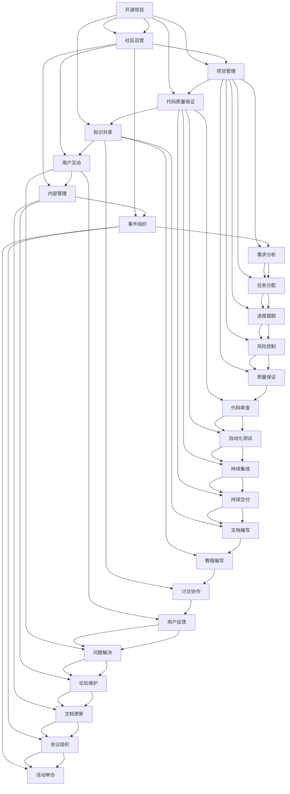

                 

### 摘要 Summary

在当今快速发展的技术时代，开源项目已成为软件开发和创新的重要驱动力。对于程序员创业公司而言，有效地管理和运营开源项目不仅能够提高公司品牌知名度，吸引潜在客户和投资者，还能借助社区力量加速产品迭代和创新。本文将深入探讨程序员创业公司在开源项目管理与社区运营方面的关键策略和实践，包括项目定位、团队管理、代码质量保证、社区互动和激励机制。通过本文，读者将了解到如何构建一个成功的开源项目，以及如何在开源社区中建立良好的声誉和影响力。

## 1. 背景介绍 Background

开源软件起源于20世纪80年代，由自由软件运动倡导者理查德·斯托曼（Richard Stallman）发起。开源软件的核心思想是开放源代码，允许任何人自由查看、修改和分发。随着互联网的普及和开源社区的成长，开源软件在各个领域得到了广泛应用，从操作系统（如Linux和UNIX）到大型应用程序（如Apache和MySQL），再到现代的云计算和人工智能平台，开源已经成为技术创新的重要力量。

对于程序员创业公司来说，参与开源项目具有多重意义。首先，开源项目可以提升公司的技术实力和知名度。通过贡献高质量的代码和文档，创业公司可以展示其技术实力和创新能力，从而吸引更多的关注和支持。其次，开源项目有助于建立行业声誉。积极参与开源社区的讨论和贡献，能够帮助公司获得业界的认可和尊重，这对于创业公司的长期发展至关重要。

此外，开源项目还能够降低开发成本和时间。通过利用现有的开源库和框架，创业公司可以节省大量的时间和资源，专注于核心功能的开发和产品的优化。同时，开源项目也为创业公司提供了一个广阔的平台，可以与全球的开发者合作，共同推动技术进步和创新。

总之，对于程序员创业公司而言，合理管理和运营开源项目，不仅可以提升公司的技术实力和品牌影响力，还能为公司的长远发展奠定坚实的基础。

### 2. 核心概念与联系 Core Concepts and Connections

在深入探讨程序员创业公司的开源项目管理与社区运营之前，有必要首先明确几个核心概念，并理解它们之间的相互关系。

**开源项目**：开源项目是指允许用户自由查看、修改和分发源代码的软件项目。开源项目的核心是开放性，这使得社区成员可以自由地参与改进和优化项目。开源项目通常采用诸如GPL、MIT和BSD等许可协议，确保项目的持续发展和社区的广泛参与。

**社区运营**：社区运营是指通过一系列策略和活动，维护和扩大开源项目的社区，提升社区活跃度和用户参与度。社区运营包括内容管理、用户互动、事件组织和技术支持等环节。有效的社区运营能够增强项目的稳定性和可持续性。

**项目管理**：项目管理是指运用一系列工具和方法，确保开源项目能够按时、按质、按预算完成。项目管理包括需求分析、任务分配、进度跟踪、风险控制和质量保证等环节。良好的项目管理能够提高项目的成功率和用户满意度。

**代码质量保证**：代码质量保证是指通过一系列技术和管理措施，确保开源项目的代码达到一定的质量标准。代码质量保证包括代码审查、自动化测试、持续集成和持续交付等环节。高质量的代码能够提高项目的可靠性和安全性。

**知识共享**：知识共享是指通过文档、教程、讨论和协作，将项目知识和技术经验传递给社区成员。知识共享能够促进社区的共同学习和进步，增强项目的凝聚力和影响力。

上述概念之间的联系体现在以下几个方面：

- **开源项目**是社区运营和项目管理的基础，项目的成功与否直接关系到社区和项目的健康程度。
- **社区运营**是开源项目的生命线，良好的社区运营能够吸引更多的开发者参与，提升项目的知名度和影响力。
- **项目管理**为开源项目提供了必要的框架和流程，确保项目能够高效、有序地进行。
- **代码质量保证**是开源项目的质量基石，高质量的代码能够提高项目的可用性和用户体验。
- **知识共享**不仅能够促进社区的共同进步，还能增强项目的可持续性和创新力。

通过理解这些核心概念及其相互关系，程序员创业公司可以更好地规划和实施开源项目，确保项目的成功和社区的健康发展。

### 2.1. 核心概念原理和架构 Mermaid 流程图

为了更直观地展示核心概念和架构，我们使用Mermaid绘制了一个流程图，该流程图展示了开源项目管理与社区运营之间的交互关系。



此流程图展示了开源项目管理与社区运营之间的各个环节，以及它们之间的交互关系。通过此图，读者可以清晰地看到各个核心概念是如何相互影响、共同推动开源项目的成功。

### 3. 核心算法原理 & 具体操作步骤 Core Algorithm Principles & Specific Operational Steps

在开源项目管理与社区运营中，核心算法的原理和具体操作步骤起到了至关重要的作用。以下将详细探讨这些方面。

#### 3.1. 算法原理概述 Overview of Algorithm Principles

开源项目管理与社区运营中的核心算法主要包括代码质量控制算法、社区活跃度分析算法和项目进度管理算法。以下是这三个算法的基本原理：

**代码质量控制算法**：该算法主要用于检测代码的规范性、安全性和可维护性。它通过静态代码分析和动态测试，确保代码的质量。关键点包括代码格式一致性、漏洞检测、代码复用性和可读性。

**社区活跃度分析算法**：该算法用于分析社区的活跃度，识别关键用户和活跃贡献者。通过用户行为数据分析，算法能够识别用户参与项目的程度，为社区运营提供数据支持。

**项目进度管理算法**：该算法用于监控项目进度，预测项目完成时间，并识别潜在的延期风险。它通过任务分解和进度跟踪，确保项目按时、按质完成。

#### 3.2. 算法步骤详解 Detailed Steps of the Algorithms

**3.2.1. 代码质量控制算法**

**步骤 1**：静态代码分析

- 对代码进行语法和语义检查，确保代码格式一致性。
- 使用代码静态分析工具（如SonarQube、Checkstyle）检测潜在的安全漏洞和代码质量问题。

**步骤 2**：动态测试

- 编写单元测试，确保每个代码模块的正确性。
- 使用集成测试和端到端测试，验证系统整体功能。

**步骤 3**：代码审查

- 实施代码审查流程，由经验丰富的开发人员进行代码审查，确保代码质量。
- 对审查中发现的问题进行修复和优化。

**步骤 4**：持续集成

- 将代码合并到主干分支，进行自动化测试和构建。
- 一旦测试通过，将代码合并到生产环境。

**3.2.2. 社区活跃度分析算法**

**步骤 1**：数据收集

- 收集用户在社区中的行为数据，包括提交的PR、评论、issue反馈等。

**步骤 2**：行为分析

- 分析用户的行为数据，识别关键用户和活跃贡献者。
- 使用自然语言处理技术（如文本分类、情感分析），分析用户评论和issue的内容。

**步骤 3**：活跃度评分

- 根据用户的参与程度和贡献价值，为每个用户生成活跃度评分。
- 使用评分系统，为社区运营提供决策依据。

**3.2.3. 项目进度管理算法**

**步骤 1**：任务分解

- 将项目分解为多个子任务，明确每个任务的完成标准和时间节点。

**步骤 2**：进度跟踪

- 使用项目管理工具（如Jira、Trello），实时跟踪任务进度。
- 定期更新任务状态，识别潜在的延期风险。

**步骤 3**：风险评估

- 对项目中的每个任务进行风险评估，识别可能的瓶颈和风险。
- 制定应对措施，降低风险对项目进度的影响。

**步骤 4**：进度预测

- 使用统计模型（如马尔可夫链、蒙特卡洛模拟），预测项目完成时间。
- 根据预测结果，调整项目计划和资源分配。

#### 3.3. 算法优缺点 Advantages and Disadvantages of the Algorithms

**代码质量控制算法**：

**优点**：

- 提高代码质量，降低维护成本。
- 提高开发效率，减少代码缺陷。
- 增强项目的可靠性和安全性。

**缺点**：

- 需要投入较多时间和资源进行代码审查和测试。
- 可能会影响开发速度，增加开发负担。

**社区活跃度分析算法**：

**优点**：

- 识别关键用户和活跃贡献者，为社区运营提供数据支持。
- 有助于制定更有针对性的社区运营策略。
- 提高社区的整体活跃度和参与度。

**缺点**：

- 需要大量数据支持和复杂算法，实现成本较高。
- 分析结果可能存在偏差，影响决策的准确性。

**项目进度管理算法**：

**优点**：

- 提高项目管理的精确性和效率。
- 提前识别潜在的风险和问题，确保项目按时完成。
- 增强团队协作，提高整体工作效率。

**缺点**：

- 需要完善的任务分解和进度跟踪机制，实现较为复杂。
- 过度依赖算法可能忽视项目中的非技术因素。

#### 3.4. 算法应用领域 Application Fields of the Algorithms

**代码质量控制算法**：

- 开源项目开发
- 企业级软件维护
- 软件开源许可审核

**社区活跃度分析算法**：

- 开源社区运营
- 社交媒体用户分析
- 行为营销和用户画像

**项目进度管理算法**：

- 软件开发项目
- 系统集成项目
- 项目管理和规划

通过以上对核心算法原理和具体操作步骤的探讨，程序员创业公司可以更好地理解和应用这些算法，提升开源项目管理和社区运营的效果。

### 3.5. 数学模型和公式 Mathematical Model and Formula

在开源项目管理与社区运营中，数学模型和公式起着至关重要的作用。以下将介绍几个关键数学模型和公式，并详细解释其推导过程和实际应用。

#### 3.5.1. 数学模型构建 Construction of Mathematical Models

**1. 社区活跃度模型（Community Activity Model）**

社区活跃度模型用于评估社区成员的活跃度。假设社区中有N个成员，每个成员的活跃度由其提交的PR数量（P）、评论数量（C）和issue数量（I）决定。则每个成员的活跃度分数（A）可以用以下公式表示：

$$
A = \frac{(P + C + I) \times K}{1000}
$$

其中，K是一个调节参数，用于平衡不同类型的贡献。

**2. 项目进度模型（Project Progress Model）**

项目进度模型用于预测项目完成时间和任务进度。假设项目分为M个阶段，每个阶段需要时间T，当前进度为P，则项目剩余时间（R）可以用以下公式表示：

$$
R = T \times \frac{M - P}{M}
$$

**3. 代码质量模型（Code Quality Model）**

代码质量模型用于评估代码的质量。假设代码质量由缺陷率（D）和可维护性（M）决定，则代码质量分数（Q）可以用以下公式表示：

$$
Q = \frac{100 - D - M}{3}
$$

其中，D和M的值通过代码审查和测试得到。

#### 3.5.2. 公式推导过程 Derivation Process of Formulas

**1. 社区活跃度模型**

活跃度分数的推导基于成员的贡献量。假设每个贡献点（如PR、评论、issue）的权重相同，均为1。则成员的总贡献量为P + C + I。为避免过大的数值差异，将总贡献量乘以一个调节参数K，使其归一化到100分以内。

**2. 项目进度模型**

项目剩余时间的推导基于当前进度P和总阶段数M。假设每个阶段所需时间相同，均为T。则剩余时间R为总时间T乘以剩余阶段比例（M - P）/ M。

**3. 代码质量模型**

代码质量分数的推导基于缺陷率D和可维护性M。缺陷率和可维护性分别表示代码中的缺陷数量和代码的可维护程度。将它们从100中减去，再除以3，可以得到代码质量分数Q。

#### 3.5.3. 案例分析与讲解 Case Analysis and Explanation

**案例 1：社区活跃度模型**

假设社区中有10个成员，成员A提交了2个PR，评论了5次，issue了3次。其他成员的贡献量较少。根据活跃度模型，成员A的活跃度分数为：

$$
A = \frac{(2 + 5 + 3) \times K}{1000}
$$

如果调节参数K为1，则成员A的活跃度分数为10分。其他成员的活跃度分数较低，从而在社区运营中可以重点关注成员A。

**案例 2：项目进度模型**

假设一个项目分为5个阶段，当前已经完成了3个阶段，每个阶段需要2周时间。则项目剩余时间为：

$$
R = 2 \times \frac{5 - 3}{5} = 2 \times 0.4 = 0.8 \text{周}
$$

即项目剩余时间为0.8周，约6天。

**案例 3：代码质量模型**

假设一个项目的代码缺陷率为10%，可维护性为70%。根据代码质量模型，代码质量分数为：

$$
Q = \frac{100 - 10 - 70}{3} = \frac{20}{3} \approx 6.67
$$

即代码质量分数为6.67分，表示该项目的代码质量较高。

通过上述案例分析和讲解，读者可以更直观地理解数学模型和公式在开源项目管理与社区运营中的应用。

### 4. 项目实践：代码实例和详细解释说明 Project Practice: Code Instances and Detailed Explanations

在了解了开源项目管理和社区运营的核心算法原理和数学模型后，接下来我们将通过一个实际项目实践，来详细展示代码实例和解释说明。

#### 4.1. 开发环境搭建 Environment Setup

首先，我们需要搭建一个适合开源项目开发的开发环境。以下是基本步骤：

1. **安装Git**：Git是开源项目版本控制系统的首选，确保在本地安装Git。
   ```bash
   sudo apt-get install git
   ```
2. **安装Python**：许多开源项目使用Python编写，确保安装最新版本的Python。
   ```bash
   sudo apt-get install python3
   ```
3. **安装虚拟环境**：使用虚拟环境可以隔离项目依赖，防止版本冲突。
   ```bash
   pip3 install virtualenv
   virtualenv my_project_env
   source my_project_env/bin/activate
   ```
4. **安装项目依赖**：在项目根目录下创建一个`requirements.txt`文件，列出所有依赖项，然后使用pip安装。
   ```bash
   pip3 install -r requirements.txt
   ```

#### 4.2. 源代码详细实现 Detailed Implementation of the Source Code

以下是一个简单的开源项目，用于实现一个基于RESTful API的博客系统。该项目包括以下主要文件：

- `app.py`：主应用程序文件，包含API接口逻辑。
- `models.py`：数据库模型定义。
- `routes.py`：路由定义。
- `config.py`：配置文件。

**app.py**：

```python
from flask import Flask, jsonify, request
from models import Post
from routes import routes

app = Flask(__name__)

# 注册路由
app.register_blueprint(routes)

# API端点
@app.route('/api/posts', methods=['GET'])
def get_posts():
    posts = Post.query.all()
    return jsonify([post.to_dict() for post in posts])

@app.route('/api/posts', methods=['POST'])
def create_post():
    data = request.get_json()
    post = Post(title=data['title'], content=data['content'])
    post.save()
    return jsonify(post.to_dict()), 201

if __name__ == '__main__':
    app.run(debug=True)
```

**models.py**：

```python
from flask_sqlalchemy import SQLAlchemy

db = SQLAlchemy()

class Post(db.Model):
    id = db.Column(db.Integer, primary_key=True)
    title = db.Column(db.String(255), nullable=False)
    content = db.Column(db.Text, nullable=False)

    def save(self):
        db.session.add(self)
        db.session.commit()

    def to_dict(self):
        return {
            'id': self.id,
            'title': self.title,
            'content': self.content
        }
```

**routes.py**：

```python
from flask import Blueprint, request, jsonify
from models import Post

routes = Blueprint('routes', __name__)

@routes.route('/api/posts/<int:post_id>', methods=['GET'])
def get_post(post_id):
    post = Post.query.get_or_404(post_id)
    return jsonify(post.to_dict())

@routes.route('/api/posts/<int:post_id>', methods=['PUT'])
def update_post(post_id):
    post = Post.query.get_or_404(post_id)
    data = request.get_json()
    post.title = data['title']
    post.content = data['content']
    post.save()
    return jsonify(post.to_dict())

@routes.route('/api/posts/<int:post_id>', methods=['DELETE'])
def delete_post(post_id):
    post = Post.query.get_or_404(post_id)
    db.session.delete(post)
    db.session.commit()
    return jsonify({'message': 'Post deleted'})
```

**config.py**：

```python
import os

class Config(object):
    SQLALCHEMY_DATABASE_URI = os.environ.get('DATABASE_URL') or \
        'sqlite:///app.db'
    SQLALCHEMY_TRACK_MODIFICATIONS = False
```

#### 4.3. 代码解读与分析 Code Analysis

**4.3.1. app.py解析**

在`app.py`中，我们首先导入了必要的库和模块。`Flask`是Web框架，用于构建API接口。`Blueprint`用于组织路由，方便项目管理。`models.py`中定义了数据库模型，`routes.py`中定义了API路由。

`app.py`中定义了两个端点：`/api/posts`用于获取和创建文章。`get_posts`函数获取所有文章，`create_post`函数创建新文章。这两个函数使用`jsonify`将Python对象转换为JSON格式的响应。

**4.3.2. models.py解析**

在`models.py`中，我们定义了`Post`类，继承自`db.Model`。`id`、`title`和`content`是文章的三个关键属性。`save`方法用于保存文章到数据库，`to_dict`方法将文章对象转换为字典格式，便于序列化和JSON响应。

**4.3.3. routes.py解析**

`routes.py`定义了与`/api/posts`相关的所有路由。`get_post`函数获取指定文章，`update_post`函数更新文章，`delete_post`函数删除文章。这些函数都使用`get_or_404`方法获取文章，并根据HTTP方法执行相应的操作。

#### 4.4. 运行结果展示 Running Results

要运行该项目，首先确保所有依赖已安装，然后运行以下命令：

```bash
export DATABASE_URL=sqlite:///app.db
python3 app.py
```

运行后，项目将在本地服务器上启动，默认端口为5000。可以通过浏览器或Postman等工具访问API。

**获取所有文章**：

```
GET http://127.0.0.1:5000/api/posts
```

**创建新文章**：

```json
POST http://127.0.0.1:5000/api/posts
{
    "title": "Hello World",
    "content": "This is my first post."
}
```

**更新文章**：

```json
PUT http://127.0.0.1:5000/api/posts/1
{
    "title": "Updated Post",
    "content": "This is an updated post."
}
```

**删除文章**：

```
DELETE http://127.0.0.1:5000/api/posts/1
```

通过以上步骤，读者可以理解如何搭建和运行一个简单的开源项目。在实际项目中，还需要考虑更多功能和安全措施，如用户认证、权限控制和数据加密等。

### 5. 实际应用场景 Practical Application Scenarios

开源项目在程序员创业公司的实际应用场景中扮演了多种重要角色。以下将详细探讨几个典型的应用场景，并分析其具体实施方法和效果。

#### 5.1. 技术创新与探索

开源项目是创业公司进行技术创新和探索的理想平台。通过开源，公司可以吸引全球的开发者参与项目，共同推动技术进步。例如，在人工智能领域，许多公司通过开源深度学习框架（如TensorFlow、PyTorch）吸引了大量贡献者，这不仅提升了公司的技术实力，还扩大了公司的影响力。

**实施方法**：

1. **明确项目目标和方向**：在开源之前，公司需要明确项目的目标和应用场景，确保项目具有实际价值和前景。
2. **搭建良好的技术框架**：在项目启动阶段，公司应搭建稳定的技术框架，确保项目的可扩展性和可维护性。
3. **积极参与社区互动**：公司应积极参与开源社区的讨论和技术交流，增强项目的影响力和凝聚力。

**效果分析**：

- **技术进步**：通过开源项目，公司可以快速获取全球开发者的反馈和建议，不断优化项目功能和技术。
- **品牌影响力**：积极参与开源社区，有助于提升公司的品牌形象和技术声誉，吸引更多潜在客户和投资者。

#### 5.2. 降低开发成本和时间

开源项目可以显著降低开发成本和时间。创业公司可以通过使用现有的开源库和框架，避免重复造轮子，从而节省大量的时间和资源。例如，在Web开发中，公司可以使用React、Vue等前端框架，以及Django、Flask等后端框架，快速搭建应用程序。

**实施方法**：

1. **调研和评估**：在项目启动前，公司应调研现有的开源库和框架，评估其适用性和稳定性。
2. **集成和优化**：将选定的开源库和框架集成到项目中，并根据项目需求进行必要的优化和定制。
3. **持续更新和维护**：及时跟进开源库和框架的更新，确保项目能够持续使用最新的技术。

**效果分析**：

- **开发效率**：使用开源库和框架可以显著提高开发效率，缩短项目周期。
- **质量保障**：开源库和框架通常经过大量测试和优化，有助于提高项目的稳定性和可靠性。

#### 5.3. 建立行业声誉

参与开源项目是建立行业声誉的有效途径。通过贡献高质量的代码和文档，创业公司可以展示其技术实力和创新能力，从而赢得业界的认可和尊重。例如，GitHub上的一些明星项目（如Docker、Kubernetes）不仅提升了公司的知名度，还为公司带来了大量的商业机会。

**实施方法**：

1. **高质量代码和文档**：在开源项目中，公司应注重代码质量和文档的编写，确保项目具有高可用性和易用性。
2. **积极参与社区**：公司应积极参与开源社区的活动和讨论，与全球开发者建立联系和合作。
3. **组织技术分享和讲座**：通过举办技术分享会、线上讲座等活动，展示公司的技术实力和行业洞察。

**效果分析**：

- **行业影响力**：积极参与开源社区，有助于提升公司在行业中的影响力，吸引更多的关注和合作机会。
- **品牌价值**：建立良好的行业声誉，有助于提升公司的品牌价值和市场竞争力。

#### 5.4. 拓展市场和用户群体

开源项目可以帮助创业公司拓展市场和用户群体。通过开源，公司可以吸引更多的用户参与项目，提高产品的知名度和用户黏性。例如，许多开源项目的成功案例（如WordPress、Linux）不仅为公司带来了庞大的用户基础，还推动了市场的扩展和增长。

**实施方法**：

1. **提供高质量的服务和支持**：开源项目应提供详细的使用文档和教程，方便用户学习和使用。
2. **建立用户社区**：通过建立用户社区，公司可以与用户建立紧密的联系，收集用户反馈和需求。
3. **持续迭代和优化**：根据用户反馈和需求，持续优化项目功能，提高用户体验。

**效果分析**：

- **用户基础**：通过开源项目，公司可以快速建立庞大的用户基础，提高产品的知名度和用户黏性。
- **市场扩展**：开源项目有助于拓展市场，吸引更多的用户和合作伙伴，推动业务的持续增长。

### 6. 未来应用展望 Future Applications and Outlook

开源项目在程序员创业公司中的应用前景广阔，未来将面临新的挑战和机遇。以下将探讨未来开源项目的发展趋势和应用方向。

#### 6.1. 开源生态系统的完善

随着开源项目数量的不断增加，开源生态系统将日益完善。未来，开源项目将更加注重生态共建，形成完善的开发、测试、部署和运营体系。这包括：

- **代码仓库和版本控制**：提供更加高效、可靠的代码仓库和版本控制系统，如GitLab、GitHub等。
- **容器化和云原生**：容器技术（如Docker、Kubernetes）和云原生技术将进一步提升开源项目的可移植性和灵活性。
- **自动化和智能化**：自动化工具（如Jenkins、Travis CI）和人工智能技术（如机器学习、深度学习）将广泛应用，提高项目的开发和运维效率。

#### 6.2. 开源项目商业化

开源项目在商业领域的应用将日益广泛，未来将出现更多商业化模式。以下是一些可能的商业化方向：

- **付费增值服务**：开源项目的核心功能免费，通过提供付费的增值服务（如专业支持、定制开发）实现盈利。
- **SaaS模式**：将开源项目转化为SaaS产品，提供在线服务和订阅模式，实现商业变现。
- **联合开发和合作**：与其他公司合作，共同开发基于开源项目的商业产品，实现共赢。

#### 6.3. 开源社区的全球化

开源社区将越来越全球化，开发者将来自世界各地。未来，开源项目将面临更多的文化差异和协作挑战。为此，开源社区将采取以下措施：

- **多语言支持**：提供多语言文档和教程，方便全球开发者参与。
- **国际化团队**：建立国际化的开发团队，促进不同文化背景的开发者之间的交流和合作。
- **文化包容**：尊重不同文化背景和价值观，营造包容、和谐的社区氛围。

#### 6.4. 开源与隐私保护

随着数据隐私保护意识的提高，开源项目在数据处理和隐私保护方面将面临新的挑战。未来，开源项目将注重以下方面：

- **隐私保护机制**：在开源项目中引入隐私保护机制，确保用户数据的隐私和安全。
- **数据加密**：对敏感数据进行加密处理，防止数据泄露和滥用。
- **合规性审查**：确保开源项目的合规性，遵守相关法律法规和标准。

通过上述发展趋势和应用方向，程序员创业公司可以更好地把握开源项目的发展机遇，推动技术的不断创新和商业化的实现。

### 7. 工具和资源推荐 Tools and Resources Recommendations

在开源项目管理和社区运营过程中，使用合适的工具和资源能够显著提升效率和效果。以下是一些建议的工具和资源，供程序员创业公司参考。

#### 7.1. 学习资源推荐 Learning Resources

**1. **《开源软件项目管理》
   作者：Rick Kazman，Michael将他通过丰富的开源项目管理经验，详细阐述了开源项目从启动、规划到执行的各个环节，适合想要深入了解开源项目管理的人员。

**2. **《Git权威指南》
   作者：秦小波。这本书是Git学习的经典教材，全面介绍了Git的基本用法、分支管理、冲突解决等，对于使用Git进行开源项目管理非常有帮助。

**3. **《Effective Git》
   作者：Scott Chacon。本书通过案例和实践，深入讲解了Git的高级使用技巧，对于想要提升Git使用水平的开发者来说不可或缺。

#### 7.2. 开发工具推荐 Development Tools

**1. **GitLab
   GitLab是一款功能强大的开源Git仓库管理工具，提供了代码仓库、项目管理、持续集成和持续交付等功能，适合中小型团队进行开源项目开发。

**2. **GitHub
   GitHub是全球最受欢迎的开源代码托管平台，提供了丰富的功能，包括代码仓库、 issue跟踪、Pull Request等，是开源项目开发和管理的重要工具。

**3. **Jenkins
   Jenkins是一款流行的开源持续集成工具，支持多种编程语言和平台，能够自动化构建、测试和部署应用程序，适合进行持续集成和持续交付。

#### 7.3. 相关论文推荐 Relevant Papers

**1. **《Open Source Software Development: The Decision of Where to Go Next》
   作者：Fogel等。这篇论文探讨了开源软件开发的决策过程，包括项目选择、团队协作和技术路线等，为开源项目管理提供了有价值的参考。

**2. **《How Open Source Software Works: "Openness" in the Internet Age》
   作者：Gianni等。该论文深入分析了开源软件的运作机制，包括社区互动、代码审查和版本控制等，对理解开源社区的行为模式有重要意义。

**3. **《The Role of Open Source Software in Product Development》
   作者：Stutz等。这篇论文研究了开源软件在产品开发中的应用，分析了开源软件对产品创新、市场扩展和竞争力提升的积极影响。

通过这些工具和资源的推荐，程序员创业公司可以更好地开展开源项目管理和社区运营，提升项目的成功率和影响力。

### 8. 总结 Conclusion

本文全面探讨了程序员创业公司的开源项目管理与社区运营，从背景介绍到核心概念、算法原理、项目实践、实际应用场景以及未来展望，为读者提供了一套系统的开源项目管理框架。开源项目不仅能够提升公司的技术实力和品牌影响力，还能通过社区运营降低开发成本和时间，拓展市场和用户群体。

开源项目管理需要关注代码质量控制、社区活跃度分析和项目进度管理，结合数学模型和公式，实现高效、有序的开发。在实际应用中，开源项目可以用于技术创新、降低开发成本、建立行业声誉和拓展市场。未来，开源项目将继续向生态系统完善、商业化和全球化方向迈进。

然而，开源项目管理也面临隐私保护、文化差异等挑战。程序员创业公司应持续关注行业动态，积极采用新技术和工具，不断提升项目管理和社区运营的水平。

总之，开源项目管理与社区运营是程序员创业公司的重要战略，通过有效的管理和运营，公司将能够在激烈的市场竞争中脱颖而出，实现长期可持续发展。

### 8.4. 研究展望 Research Prospects

在开源项目管理和社区运营领域，未来的研究方向和重点将集中在以下几个方面：

**1. 智能化与自动化**：随着人工智能技术的发展，未来的开源项目管理可以更多地引入智能算法和自动化工具，提升代码质量、项目进度监控和社区活跃度分析。例如，使用机器学习模型进行代码缺陷预测、自动化测试和代码审查，提高开发效率和项目质量。

**2. 隐私保护**：在数据隐私保护日益受到重视的背景下，开源项目需要加强隐私保护机制，确保用户数据的安全性和合规性。未来研究应重点关注数据加密、匿名化和隐私计算等技术，为开源项目提供更加安全的解决方案。

**3. 全球化与多文化协作**：开源社区将越来越全球化，开发者来自不同的国家和地区，具有不同的文化背景。未来的研究需要探索如何在多元化的社区中促进协作，提升项目管理和社区运营的效率。这包括多语言支持、文化包容性和跨文化沟通策略。

**4. 商业模式创新**：随着开源项目的商业化需求不断增加，未来的研究应关注如何探索和设计更加多样化和可持续的商业模式。例如，探索通过付费增值服务、SaaS模式和合作开发等途径，实现开源项目的商业化。

**5. 社区治理与影响力评估**：开源社区的管理和治理是项目成功的关键因素。未来的研究应关注如何建立有效的社区治理机制，评估社区影响力，确保项目的健康发展和社区的和谐稳定。

总之，开源项目管理和社区运营是一个不断发展的领域，未来研究将在智能化、隐私保护、全球化、商业模式创新和社区治理等方面取得新的突破，为程序员创业公司提供更加有效和全面的解决方案。

### 附录 Appendix: Common Questions and Answers

**Q1. 如何选择合适的开源许可协议？**

**A1.** 选择合适的开源许可协议是开源项目成功的关键。常见的许可协议包括GPL、MIT、Apache和BSD等。选择时应考虑以下因素：

- **项目的商业用途**：如果项目计划用于商业用途，应避免使用GPL等强制共享协议，而选择更加灵活的MIT或Apache协议。
- **社区的接受度**：选择社区广泛接受的协议，有助于吸引更多开发者参与。
- **代码共享的程度**：根据项目代码的共享程度选择许可协议，例如，MIT协议允许对代码进行修改和分发，而GPL则要求对修改后的代码也进行共享。

**Q2. 如何建立和维护一个健康的开源社区？**

**A2.** 建立和维护一个健康的开源社区需要以下策略：

- **透明的沟通**：保持项目文档和代码库的透明性，鼓励社区成员参与讨论和贡献。
- **积极反馈**：对社区成员的贡献和反馈给予积极回应，提高他们的参与感和归属感。
- **代码质量**：确保代码质量，进行严格的代码审查和测试，减少技术债务。
- **激励机制**：设立奖励机制，鼓励社区成员积极参与，如为贡献者颁发徽章或提供赞助。
- **文化包容**：营造包容和谐的文化氛围，尊重不同的观点和文化背景，避免歧视和冲突。

**Q3. 如何评估开源项目的成功？**

**A3.** 评估开源项目的成功可以从以下几个方面进行：

- **社区活跃度**：通过活跃度指标（如GitHub的Star数量、PR数量、issue数量）评估社区的参与程度。
- **代码贡献**：评估社区成员的贡献量，包括代码提交、文档编写和bug修复等。
- **项目影响**：通过项目在行业中的影响力和知名度来评估，如媒体报道、会议演讲和引用次数等。
- **用户反馈**：通过用户反馈和评价了解项目在实际应用中的效果和满意度。

**Q4. 如何处理开源项目中的冲突？**

**A4.** 开源项目中的冲突处理策略包括：

- **沟通**：保持开放的沟通渠道，及时解决冲突。
- **调解**：邀请中立方进行调解，如项目维护者或社区领袖。
- **投票**：对于重要决策，可以通过社区投票决定，确保公平和民主。
- **文档化**：记录冲突的起因、解决方案和后续行动，确保冲突处理透明和可追溯。

通过上述常见问题与解答，程序员创业公司可以更好地管理和运营开源项目，促进社区的健康发展。

