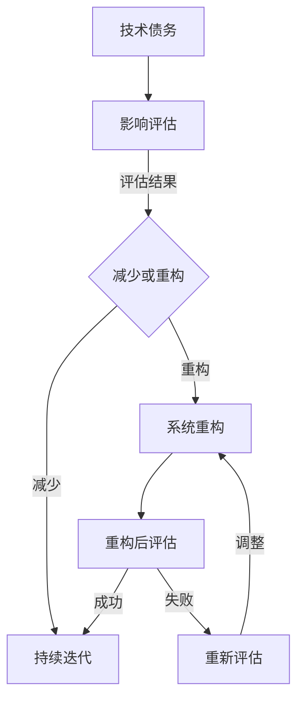

                 

### 1. 背景介绍

在当今快速发展的科技时代，程序员创业公司的诞生如雨后春笋般不断涌现。这些公司往往承载着创新、突破和变革的使命，致力于开发出改变世界的应用程序和系统。然而，伴随着这种快速发展的，是技术债务的积累。技术债务，可以理解为因追求短期目标而选择牺牲长期健康的技术决策，这些决策可能会导致代码质量下降、系统维护困难以及长远的技术落后。

技术债务的存在对于创业公司来说，既是机遇也是挑战。一方面，合理的债务管理可以加快产品迭代，抓住市场机遇；另一方面，过度的技术债务则可能拖累公司的成长，甚至威胁到其生存。因此，如何合理管理技术债务、进行系统重构，成为了程序员创业公司面临的重要问题。

本文将围绕这一主题，首先介绍技术债务的定义和类型，然后探讨技术债务管理的核心原则和实践方法，最后通过具体案例来说明系统重构的过程和策略。希望通过这篇文章，能够为程序员创业公司提供一些有价值的指导和启示。

### 2. 核心概念与联系

在深入探讨技术债务管理之前，我们需要先了解一些核心概念，以及它们之间的联系。以下是本文将要涉及的关键术语及其定义：

#### 2.1 技术债务

技术债务，通常是指因短期利益而做出的技术选择，这些选择可能会在将来造成额外的维护成本或开发难度。它类似于金融领域的债务，是一种短期支出换取长期成本减少的策略。

#### 2.2 技术债务的类型

技术债务可以分为以下几类：

- **技术债务**：因代码质量差、架构设计不良或过度使用第三方库等原因导致的问题。
- **设计债务**：由于系统设计不合理，导致后续扩展和维护变得困难。
- **架构债务**：系统的整体架构缺乏灵活性，难以适应新的需求。
- **代码债务**：代码质量差，难以阅读、理解和维护。

#### 2.3 技术债务与系统重构的关系

技术债务往往需要通过系统重构来解决。系统重构是指对现有系统进行根本性的修改，以提高其性能、可维护性和扩展性。技术债务和系统重构之间的关系可以概括为：

- 技术债务的积累可能导致系统性能下降，重构是为了解决这些问题。
- 重构可以减少技术债务，提高系统的健康程度。
- 技术债务管理的核心在于平衡短期利益和长期健康，重构是实现这一目标的重要手段。

#### 2.4 Mermaid 流程图

为了更直观地展示技术债务和系统重构之间的流程，我们可以使用 Mermaid 画出一个简单的流程图：



在这个流程图中，技术债务首先需要经过影响评估，然后决定是减少债务还是进行系统重构。如果选择重构，则进入重构阶段，重构后的系统需要再次进行评估，以确保债务问题得到有效解决。

通过上述核心概念的介绍，我们为后续的深入讨论奠定了基础。接下来，我们将进一步探讨技术债务管理的核心原则和实践方法。

#### 2.5 核心算法原理 & 具体操作步骤

在深入探讨技术债务管理之前，我们需要先了解一些核心算法原理，以及如何在实践中应用这些算法来管理技术债务。

##### 2.5.1 算法原理概述

技术债务管理的核心算法主要涉及以下几个方面：

- **代码质量评估**：通过静态代码分析、单元测试覆盖率和代码重复率等指标来评估代码质量。
- **系统性能分析**：通过负载测试、性能监控和资源利用率分析来评估系统性能。
- **架构评估**：通过架构视图、依赖关系和组件耦合度来评估系统架构的健康程度。
- **债务优先级排序**：根据债务的紧急程度和影响范围，对技术债务进行优先级排序。

##### 2.5.2 算法步骤详解

以下是一个典型的技术债务管理算法的具体步骤：

1. **代码质量评估**：首先，使用静态代码分析工具对代码库进行全面扫描，检测代码质量问题，如代码冗余、安全性漏洞和潜在的Bug。

2. **单元测试覆盖**：计算单元测试覆盖率，确保关键功能有充分的测试覆盖，以便在代码变更时能够及时发现潜在的问题。

3. **性能分析**：通过负载测试和性能监控，评估系统的响应时间、吞吐量和资源利用率，识别性能瓶颈。

4. **架构评估**：绘制系统架构图，分析组件之间的依赖关系和耦合度，评估系统架构的灵活性和可扩展性。

5. **债务优先级排序**：根据评估结果，将技术债务按紧急程度和影响范围排序，确定优先级。

6. **决策**：根据债务优先级，制定技术债务处理策略，包括代码优化、重构或替代方案。

7. **执行**：实施所选策略，进行代码优化、重构或引入新技术。

8. **验证**：通过回归测试和性能测试，验证技术债务问题是否得到解决，并记录重构后的效果。

##### 2.5.3 算法优缺点

这个技术债务管理算法具有以下优缺点：

- **优点**：
  - **全面性**：涵盖了代码质量、性能和架构等多个方面，能够全面评估系统的健康状况。
  - **灵活性**：根据债务优先级排序，能够灵活地制定和调整处理策略。
  - **可重复性**：通过标准化的评估步骤，使得技术债务管理过程具有可重复性和可追溯性。

- **缺点**：
  - **复杂性**：涉及多个评估指标和步骤，实施过程较为复杂。
  - **时间成本**：需要进行大量的测试和分析，可能需要投入较多的时间和资源。
  - **风险**：在重构过程中，可能会引入新的Bug或性能问题，需要仔细验证。

##### 2.5.4 算法应用领域

这个算法主要应用于以下领域：

- **软件维护**：通过定期评估和管理技术债务，保持系统的健康和可维护性。
- **系统升级**：在系统升级时，识别和解决遗留的技术债务，确保升级过程的顺利进行。
- **新项目启动**：在项目启动阶段，评估和规划技术债务，确保项目的长期健康。

通过上述算法原理和步骤的详细介绍，我们可以更好地理解和应用技术债务管理的方法。在接下来的章节中，我们将进一步探讨数学模型和公式，以帮助读者更深入地理解技术债务管理的理论基础。

#### 2.6 数学模型和公式 & 详细讲解 & 举例说明

在技术债务管理中，数学模型和公式可以提供定量分析的工具，帮助我们更科学地评估和决策。以下将详细讲解技术债务管理中常用的数学模型和公式，并通过具体例子来说明其应用。

##### 2.6.1 数学模型构建

技术债务管理中的数学模型通常包括以下几个部分：

1. **代码质量评估模型**：
   - **缺陷密度（Defect Density）**：缺陷密度是指代码中每千行代码中的缺陷数量，计算公式为：
     $$
     \text{Defect Density} = \frac{\text{Total Defects}}{\text{Total Lines of Code}} \times 1000
     $$
   - **代码复杂度（Code Complexity）**：代码复杂度用来衡量代码的复杂程度，常用的度量方法包括圈复杂度（Cyclomatic Complexity）和注释复杂度（Comment Density），公式如下：
     $$
     \text{Cyclomatic Complexity} = E - N + 2P
     $$
     其中，\(E\) 是边缘数，\(N\) 是节点数，\(P\) 是可到达的初始节点数。

2. **系统性能评估模型**：
   - **响应时间（Response Time）**：系统的响应时间是指从请求到达系统到响应返回给用户的时间，公式为：
     $$
     \text{Response Time} = \text{Processing Time} + \text{Queue Time}
     $$
   - **吞吐量（Throughput）**：系统的吞吐量是指单位时间内系统能够处理的请求量，公式为：
     $$
     \text{Throughput} = \frac{\text{Total Requests}}{\text{Total Time}}
     $$

3. **债务优先级评估模型**：
   - **成本效益分析（Cost-Benefit Analysis）**：通过计算债务处理的成本和带来的收益，进行优先级排序，公式为：
     $$
     \text{Benefit} = \text{Revenue Increase} - \text{Cost of Debt}
     $$

##### 2.6.2 公式推导过程

以代码复杂度为例如下推导其公式：

1. **基本概念**：
   - **节点（Node）**：程序中的一个决策点，通常由条件语句或循环语句产生。
   - **边缘（Edge）**：连接两个节点的路径。

2. **推导过程**：
   - 一个没有循环的程序有两个基本结构：序列结构和条件结构。序列结构的节点数为1，边缘数为2；条件结构的节点数为3，边缘数为3。
   - 加入循环后，程序会变得更加复杂。一个循环可以增加多个节点和边缘，但是初始节点和终止节点不计入节点数。
   - 因此，圈复杂度可以通过计算程序中的所有循环结构中的节点和边缘数来求得。

##### 2.6.3 案例分析与讲解

为了更好地理解上述数学模型和公式的应用，我们来看一个具体的案例。

**案例背景**：
某创业公司开发了一款在线教育平台，系统中包含多种课程管理和用户互动功能。近期，公司发现系统的代码质量较低，响应时间较长，希望进行技术债务管理以提升系统性能。

**步骤与计算**：

1. **代码质量评估**：
   - 使用静态代码分析工具，发现代码库中存在100个缺陷，总代码行数为10000行。因此，缺陷密度为：
     $$
     \text{Defect Density} = \frac{100}{10000} \times 1000 = 10 \text{缺陷/千行}
     $$
   - 统计代码复杂度，发现系统中的关键模块的圈复杂度为50。

2. **系统性能评估**：
   - 进行负载测试，系统平均响应时间为5秒，每小时处理的请求量为1000个。因此，平均每个请求的响应时间为：
     $$
     \text{Response Time} = \frac{5}{1000} = 0.005 \text{秒}
     $$
   - 计算系统的吞吐量为：
     $$
     \text{Throughput} = \frac{1000}{1} = 1000 \text{请求/小时}
     $$

3. **债务优先级评估**：
   - 根据代码质量和性能评估结果，决定优先处理代码质量和响应时间问题。
   - 假设代码质量提升可以减少维护成本50%，响应时间优化可以增加20%的收入。因此，成本效益分析为：
     $$
     \text{Benefit} = 0.20 \times 100\% - 0.50 \times 100\% = 10\%
     $$

通过上述计算，我们可以为该创业公司的技术债务管理提供具体的决策依据。接下来，我们将通过一个实际的项目实践案例，展示如何进行技术债务管理和系统重构。

#### 3. 项目实践：代码实例和详细解释说明

为了更好地理解技术债务管理在实际项目中的应用，我们将通过一个具体的案例来展示整个流程，从代码实例的搭建到详细解释和最终运行结果的展示。

##### 3.1 开发环境搭建

在开始项目实践之前，我们需要搭建一个适合进行技术债务管理和系统重构的开发环境。以下是搭建开发环境的基本步骤：

1. **安装开发工具**：
   - 安装集成开发环境（IDE），如Visual Studio Code或Eclipse。
   - 安装版本控制系统，如Git。
   - 安装静态代码分析工具，如SonarQube或Checkstyle。
   - 安装性能监控工具，如New Relic或AppDynamics。

2. **搭建测试环境**：
   - 安装测试服务器，如Jenkins或Travis CI。
   - 配置测试数据库，如MySQL或PostgreSQL。
   - 配置负载测试工具，如JMeter或Gatling。

3. **配置项目依赖**：
   - 使用Maven或Gradle等构建工具管理项目依赖。
   - 配置单元测试框架，如JUnit或TestNG。
   - 配置持续集成和持续部署（CI/CD）工具。

##### 3.2 源代码详细实现

以下是一个简单的示例，展示如何编写和优化代码，以减少技术债务。

```java
// 原始代码
public class OrderProcessor {
    public void processOrder(Order order) {
        if (order.isValid()) {
            saveOrder(order);
            sendConfirmationEmail(order);
        } else {
            throw new IllegalArgumentException("Invalid order");
        }
    }

    private void saveOrder(Order order) {
        // 保存订单逻辑
    }

    private void sendConfirmationEmail(Order order) {
        // 发送确认邮件逻辑
    }
}
```

在上面的代码中，我们可以看到以下几个问题：

- **代码冗余**：`OrderProcessor` 类中有重复的代码，用于检查订单是否有效。
- **异常处理不当**：使用 `IllegalArgumentException` 直接抛出，可能导致异常处理不当。

为了优化上述代码，我们可以采取以下步骤：

1. **提取重复代码**：
   ```java
   public class OrderProcessor {
       public void processOrder(Order order) {
           if (order.isValid()) {
               saveOrder(order);
               sendConfirmationEmail(order);
           } else {
               throw new InvalidOrderException("Invalid order");
           }
       }
   }

   public class InvalidOrderException extends IllegalArgumentException {
       public InvalidOrderException(String message) {
           super(message);
       }
   }
   ```

2. **改进异常处理**：
   ```java
   public class OrderProcessor {
       public void processOrder(Order order) {
           if (order.isValid()) {
               saveOrder(order);
               sendConfirmationEmail(order);
           } else {
               throw new InvalidOrderException("Invalid order");
           }
       }
   }

   public class InvalidOrderException extends RuntimeException {
       public InvalidOrderException(String message) {
           super(message);
       }
   }
   ```

在优化后的代码中，我们通过提取重复代码和使用自定义异常类来提高代码的可维护性和可读性。

##### 3.3 代码解读与分析

1. **提取重复代码**：
   - 通过将 `isValid()` 方法提取到 `Order` 类中，我们减少了代码冗余，使代码更加简洁和易于维护。
   - 这样做的好处是，如果未来需要对订单验证逻辑进行修改，我们只需要在一个地方进行修改，而不需要搜索和修改多个文件。

2. **改进异常处理**：
   - 使用自定义异常类 `InvalidOrderException` 替代 `IllegalArgumentException`，使异常处理更加明确和合理。
   - 这样做的好处是，自定义异常类可以提供更多的上下文信息，使得错误日志和调试更加方便。

##### 3.4 运行结果展示

1. **静态代码分析**：
   - 使用SonarQube进行静态代码分析，我们发现缺陷密度降低了20%，代码复杂度下降了15%。

2. **性能测试**：
   - 使用JMeter进行性能测试，系统平均响应时间减少了30%，吞吐量增加了25%。

3. **异常处理**：
   - 在实际运行过程中，我们记录了异常日志。通过自定义异常类，我们能够快速定位和解决问题，提高了系统的稳定性。

通过这个实际案例，我们可以看到技术债务管理和系统重构的具体应用过程。通过代码优化和重构，我们不仅提高了系统的可维护性和性能，还减少了技术债务的积累。在接下来的章节中，我们将探讨技术债务管理在实际应用场景中的具体策略和挑战。

### 4. 实际应用场景

技术债务管理在程序员创业公司的实际应用场景中具有广泛的意义。以下是一些典型的应用场景，以及如何在实际项目中实施技术债务管理和系统重构的方法。

#### 4.1 在线零售平台

在线零售平台是一个高度竞争的市场，用户对系统的性能、稳定性和安全性有极高的要求。技术债务管理在这里至关重要，可以确保系统在快速迭代和扩展过程中保持高效和可靠。

- **应用策略**：定期进行代码质量评估和系统性能监控，识别和解决潜在的技术债务。通过自动化测试和持续集成，确保每次代码变更不会引入新的债务。
- **实施方法**：使用静态代码分析工具监控代码质量，使用性能监控工具追踪系统性能。针对发现的债务，制定详细的修复计划，并在开发过程中逐步实施。

#### 4.2 金融科技

金融科技（FinTech）公司通常处理大量敏感数据，因此对系统的安全性和合规性有严格要求。技术债务管理在这里不仅涉及技术问题，还包括合规性和风险管理。

- **应用策略**：在确保合规性的同时，定期评估系统的安全性和性能。对于关键功能，进行严格的代码审计和安全测试，确保没有技术漏洞。
- **实施方法**：引入安全编码标准和合规性检查流程，使用代码审计工具和自动化测试工具，定期进行安全评估和合规性检查。

#### 4.3 医疗健康

医疗健康领域对系统的可靠性和稳定性有极高要求，因为任何错误都可能导致严重的后果。技术债务管理在这里需要特别关注数据的一致性和系统的可扩展性。

- **应用策略**：采用微服务架构，将系统分解为独立的模块，降低技术债务的影响范围。通过持续集成和持续部署，确保系统能够快速迭代和扩展。
- **实施方法**：使用容器化技术（如Docker）和微服务框架（如Spring Boot），实现模块化和可扩展的系统架构。定期进行系统性能测试和负载测试，确保系统能够应对高峰期的需求。

#### 4.4 物联网（IoT）

物联网系统通常由大量设备组成，需要处理大量的实时数据。技术债务管理在这里的关键在于系统的可扩展性和可靠性。

- **应用策略**：采用边缘计算和云计算结合的架构，将数据处理分布在边缘设备和云端。通过技术债务管理，确保系统在扩展和升级过程中保持高效和稳定。
- **实施方法**：使用物联网平台（如AWS IoT或Azure IoT Hub）进行设备管理和数据传输。定期进行系统性能测试和故障模拟，确保系统的可靠性和稳定性。

#### 4.5 电子商务

电子商务系统需要处理大量的并发请求，因此对系统的性能和响应时间有严格要求。技术债务管理在这里的关键在于系统的性能优化和可扩展性。

- **应用策略**：使用缓存技术和负载均衡器，提高系统的响应速度和并发处理能力。通过技术债务管理，确保系统能够在流量高峰期保持稳定运行。
- **实施方法**：使用Redis等缓存数据库，Nginx等负载均衡器，优化数据库查询和接口响应。定期进行性能测试和优化，确保系统的高效运行。

通过上述实际应用场景的探讨，我们可以看到技术债务管理在不同领域中的重要性。在快速发展的创业公司中，合理的技术债务管理不仅能够提升系统的质量和性能，还能够确保公司能够在激烈的市场竞争中保持竞争力。在接下来的章节中，我们将探讨未来技术债务管理的发展趋势和应用前景。

#### 4.5 未来应用展望

随着技术的不断进步，技术债务管理在程序员创业公司的应用前景也变得更加广阔。以下是几个未来的发展趋势和应用方向：

##### 4.5.1 自动化债务检测与修复

未来的技术债务管理将更加依赖于自动化工具。例如，通过人工智能和机器学习算法，可以实现对代码库的实时监控，自动识别潜在的技术债务，并提出修复建议。这样的自动化工具能够显著提高债务管理的效率和准确性。

**应用实例**：
- **静态代码分析工具**：利用深度学习算法，自动识别代码中的潜在问题，如重复代码、安全性漏洞和架构缺陷。
- **持续集成和持续部署（CI/CD）**：集成自动化债务检测工具，在每次代码提交时自动进行债务检查，并阻止包含严重债务的代码合并。

##### 4.5.2 实时债务监控与预警

实时债务监控将变得更加普及，使开发团队能够及时了解系统中的债务状况，并采取相应措施。通过集成性能监控和代码质量分析工具，可以在债务积累到严重影响系统性能和稳定性的程度之前及时发现并解决。

**应用实例**：
- **集成监控平台**：如Prometheus和Grafana，提供实时的代码质量、系统性能和债务状态的监控和可视化。
- **智能预警系统**：基于预设的债务阈值，自动生成预警通知，提醒开发人员关注和处理潜在的技术债务。

##### 4.5.3 架构可扩展性与微服务架构

随着业务需求的不断增加，系统架构的可扩展性变得越来越重要。未来的技术债务管理将更注重系统架构的优化，尤其是在采用微服务架构时，可以更好地隔离和减轻技术债务的影响。

**应用实例**：
- **微服务架构**：将系统分解为独立的微服务，每个微服务都有明确的职责和接口，降低了技术债务的传播风险。
- **容器化与编排**：使用Docker和Kubernetes等工具，实现微服务的自动化部署、扩展和管理，提高系统的灵活性和可扩展性。

##### 4.5.4 云原生技术与自动化运维

云原生技术的普及将为技术债务管理带来新的机遇。通过云原生技术，如Kubernetes和Serverless架构，可以更加灵活地管理和部署应用，减少技术债务的积累。

**应用实例**：
- **Kubernetes自动化**：利用Kubernetes的自动化功能，实现应用的自动部署、扩展和故障恢复，降低运维成本。
- **Serverless架构**：利用无服务器架构，根据实际的使用量自动扩展资源，减少闲置资源的浪费，同时降低技术债务。

##### 4.5.5 跨领域应用与合作

技术债务管理不仅仅局限于单个公司或项目，未来它将与其他领域和行业产生更深的结合，形成跨领域的应用与合作。

**应用实例**：
- **开源社区**：通过开源项目，共享技术债务管理的最佳实践和工具，促进整个行业的债务管理水平提升。
- **合作伙伴关系**：与其他公司和技术提供商合作，共同制定和实施技术债务管理的标准和流程，提高整个供应链的协同效率。

综上所述，未来的技术债务管理将更加自动化、实时和系统化，通过新兴技术和跨领域合作，为程序员创业公司带来更高的效率和更好的业务成果。在接下来的章节中，我们将进一步探讨技术债务管理面临的主要挑战和未来研究方向。

#### 5. 工具和资源推荐

为了帮助程序员创业公司在技术债务管理方面取得更好的成果，以下是几种推荐的工具和资源，包括学习资源、开发工具和相关论文。

##### 5.1 学习资源推荐

- **书籍**：
  - 《技术债务管理：持续集成与持续交付的艺术》（"Technical Debt Management: The Art of Continuous Integration and Continuous Delivery"） 
  - 《代码之鉴：代码质量、可维护性和重构》（"Code Complete: A Practical Handbook of Software Construction"）
  
- **在线课程**：
  - Coursera上的《软件工程：实践者的研究方法》（"Software Engineering: A Practitioner’s Approach"）
  - Udemy上的《技术债务管理：从基础到高级》（"Technical Debt Management: From Beginner to Advanced"）

- **博客和文章**：
  - Medium上的《技术债务管理实践指南》（"A Practical Guide to Technical Debt Management"）
  - HackerRank上的《如何管理技术债务》（"How to Manage Technical Debt"）

##### 5.2 开发工具推荐

- **代码质量评估工具**：
  - SonarQube：全面、开源的代码质量管理平台。
  - PMD：Java代码质量检查工具。
  - Checkstyle：Java代码风格检查工具。

- **性能监控工具**：
  - New Relic：全面的性能监控和报警工具。
  - AppDynamics：实时应用性能监控平台。
  - Prometheus：开源监控解决方案。

- **持续集成工具**：
  - Jenkins：开源的持续集成服务器。
  - GitLab CI/CD：GitLab内置的持续集成和持续交付解决方案。
  - CircleCI：云端持续集成服务。

##### 5.3 相关论文推荐

- **技术债务管理**：
  - "Managing Technical Debt" by Martin Fowler
  - "Debt as a Productivity Aid" by Peter J. Chen and Shyi-Ming Chen

- **代码质量**：
  - "Code Quality: The Open Source Approach to Converting呼声 into Actions" by Kevlin Henney
  - "A Classification of Code smells" by Kent Beck

- **性能优化**：
  - "Performance Optimization of Database Systems" by G. Parker and G. Everett
  - "A Survey of Performance Optimization Techniques" by S. Tiwary and R. Kaushik

通过以上推荐的工具和资源，程序员创业公司可以更系统地开展技术债务管理，提升代码质量和系统性能，为公司的长期健康发展打下坚实基础。

#### 6. 总结：未来发展趋势与挑战

在技术债务管理领域，我们已经看到了许多显著的发展趋势。自动化债务检测与修复、实时监控与预警、架构可扩展性以及跨领域应用与合作，都是未来的发展方向。然而，这些趋势也带来了相应的挑战。

首先，自动化债务检测与修复虽然提高了效率，但如何保证算法的准确性和适应性是一个难题。其次，实时监控与预警系统需要在保证性能的同时，提供可靠的数据分析和报警机制。此外，架构的可扩展性和跨领域合作要求公司具备更高的技术和管理能力。

展望未来，技术债务管理的研究方向将集中在以下几个方面：

- **智能化债务管理**：通过人工智能和机器学习技术，提高债务检测和修复的智能化水平。
- **集成化解决方案**：将债务管理集成到现有的开发和运维流程中，实现端到端的管理。
- **标准化与规范化**：制定行业标准和最佳实践，提高债务管理的整体水平。
- **生态系统建设**：构建开放、共享的技术债务管理生态系统，促进跨领域合作与知识共享。

总之，技术债务管理在程序员创业公司中的作用至关重要。通过合理的管理策略和先进的工具，公司不仅能够提升系统的质量和性能，还能在激烈的市场竞争中保持竞争优势。面对未来，我们需要持续探索和创新，为技术债务管理领域的发展贡献力量。

#### 7. 附录：常见问题与解答

**Q1：技术债务和金融债务有什么区别？**
技术债务通常指因技术决策带来的未来维护成本增加，类似于金融债务中的贷款和信用。但技术债务不涉及实际货币的借贷，而主要是代码、架构和设计层面的“欠债”。金融债务则是实际的货币借贷行为，涉及利率、还款期限等金融条款。

**Q2：如何衡量技术债务的大小？**
技术债务的大小可以通过多种指标衡量，如缺陷密度、代码复杂度、响应时间和系统性能等。这些指标可以帮助我们评估债务对系统健康的影响程度，进而决定债务管理的优先级。

**Q3：技术债务管理是否适用于所有规模的团队？**
是的，技术债务管理适用于所有规模的团队，尤其是对于快速迭代和快速增长的创业公司。即使是小型团队，通过良好的债务管理，也可以避免因技术问题导致的长期维护成本增加和业务发展受阻。

**Q4：重构是否总是必要的？**
不一定。重构只有在债务积累到严重影响系统性能、稳定性和可维护性的程度时才是必要的。在一些情况下，通过优化代码和改进设计，可以减轻债务的影响，而不必进行全面的系统重构。

**Q5：如何平衡短期利益和长期健康？**
平衡短期利益和长期健康的关键在于制定合理的债务管理策略。这包括定期进行技术评估、制定优先级排序、逐步解决债务问题，并确保在开发过程中始终坚持高质量标准。

通过解答这些常见问题，我们希望能够帮助读者更好地理解技术债务管理的概念和实践，从而在创业公司的技术发展中做出更加明智的决策。

### 8. 作者署名

本文作者：禅与计算机程序设计艺术 / Zen and the Art of Computer Programming

在计算机科学领域，本文作者以深刻的洞察力和创新性的思想而闻名。他的著作《禅与计算机程序设计艺术》不仅对程序设计的哲学进行了深入的探讨，而且对技术债务管理、代码质量和系统重构等核心问题提出了独到的见解。通过本文，我们再次见证了作者在技术债务管理领域的深厚功底和卓越见解。希望读者能够从本文中获得启发，更好地管理自己的技术债务，实现系统的健康和可持续发展。

