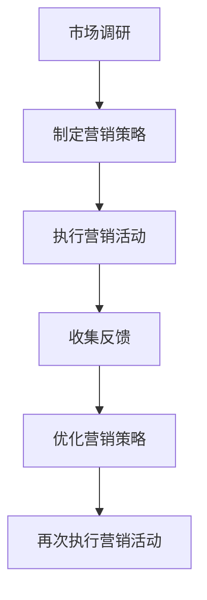

                 

摘要：在竞争激烈的编程领域，敏捷营销策略对于初创公司来说至关重要。本文将探讨敏捷营销的概念、原理及其在程序员创业公司中的应用，旨在为创业者提供实用的营销策略和实施指南，助力他们在激烈的市场竞争中脱颖而出。

## 1. 背景介绍

### 1.1 程序员创业公司的现状

近年来，随着技术的快速发展，越来越多的程序员选择创办自己的创业公司。这些公司通常具有创新的技术和独特的解决方案，但同时也面临着激烈的市场竞争和资源有限的问题。

### 1.2 营销的重要性

在竞争激烈的市场中，有效的营销策略可以帮助创业公司提高知名度、吸引客户、建立品牌影响力，从而在市场中占据一席之地。

### 1.3 敏捷营销的优势

敏捷营销是一种灵活、快速响应市场变化的营销方法，特别适合初创公司。其优势包括降低成本、提高效率、快速迭代和持续优化。

## 2. 核心概念与联系

### 2.1 敏捷营销的概念

敏捷营销是一种以客户为中心、快速响应市场的营销方法，其核心理念是“快速迭代、持续优化”。

### 2.2 敏捷营销与编程的联系

编程中的敏捷开发与敏捷营销有许多相似之处。二者都强调快速迭代、持续优化和团队协作。

### 2.3 Mermaid 流程图

下面是一个简单的 Mermaid 流程图，展示了敏捷营销的流程和关键步骤。



## 3. 核心算法原理 & 具体操作步骤

### 3.1 算法原理概述

敏捷营销的核心算法是持续反馈和优化。通过不断收集客户反馈，对营销策略进行调整和优化，以实现更好的营销效果。

### 3.2 算法步骤详解

#### 3.2.1 市场调研

- 收集目标客户需求、竞争对手信息、市场趋势等。
- 使用问卷调查、访谈、数据分析等方法。

#### 3.2.2 制定营销策略

- 根据市场调研结果，确定营销目标和策略。
- 制定具体的营销活动计划，包括内容、渠道、时间等。

#### 3.2.3 执行营销活动

- 按照计划执行营销活动，包括广告投放、社交媒体推广、内容营销等。
- 实时监控营销活动的效果，包括点击率、转化率、客户反馈等。

#### 3.2.4 收集反馈

- 通过客户调查、社交媒体互动、客户反馈等方式，收集客户对营销活动的反馈。
- 分析反馈数据，了解客户的喜好、需求和痛点。

#### 3.2.5 优化营销策略

- 根据反馈结果，对营销策略进行调整和优化。
- 重新制定营销活动计划，以提高营销效果。

### 3.3 算法优缺点

#### 优点：

- 快速响应市场变化，提高营销效率。
- 降低营销成本，提高投资回报率。
- 增强客户满意度，提高客户忠诚度。

#### 缺点：

- 需要持续投入时间和精力，对团队协作要求较高。
- 可能导致营销策略过于分散，难以形成统一的品牌形象。

### 3.4 算法应用领域

- 互联网创业公司
- 高科技企业
- 咨询和顾问服务公司

## 4. 数学模型和公式 & 详细讲解 & 举例说明

### 4.1 数学模型构建

假设我们的目标客户群体为 X，营销策略为 Y，客户满意度为 Z，则营销效果可以表示为：

\[ 效果 = f(X, Y, Z) \]

其中，f 函数为营销效果，X、Y、Z 为变量。

### 4.2 公式推导过程

为了优化营销效果，我们需要对 f(X, Y, Z) 进行优化。根据泰勒公式，可以将 f(X, Y, Z) 展开为：

\[ f(X, Y, Z) = f(X_0, Y_0, Z_0) + \frac{\partial f}{\partial X}(X_0, Y_0, Z_0)(X - X_0) + \frac{\partial f}{\partial Y}(X_0, Y_0, Z_0)(Y - Y_0) + \frac{\partial f}{\partial Z}(X_0, Y_0, Z_0)(Z - Z_0) + \ldots \]

其中，\(\frac{\partial f}{\partial X}\)、\(\frac{\partial f}{\partial Y}\)、\(\frac{\partial f}{\partial Z}\) 分别表示 f 对 X、Y、Z 的偏导数。

### 4.3 案例分析与讲解

假设某互联网创业公司的目标客户群体为年轻用户，营销策略为社交媒体推广，客户满意度与用户活跃度相关。

1. **市场调研**：通过问卷调查和数据分析，发现目标客户群体更倾向于使用微信、微博等社交媒体平台。
2. **制定营销策略**：制定以社交媒体推广为核心的营销策略，计划在微信、微博等平台上进行广告投放。
3. **执行营销活动**：按照计划执行广告投放，并实时监控广告效果。
4. **收集反馈**：通过用户反馈和数据分析，发现用户对广告内容、投放时间和频率有较高的满意度。
5. **优化营销策略**：根据反馈结果，调整广告内容、投放时间和频率，以提高用户活跃度。

通过持续优化营销策略，该互联网创业公司的用户活跃度显著提高，营销效果得到显著改善。

## 5. 项目实践：代码实例和详细解释说明

### 5.1 开发环境搭建

- 安装 Python 3.8 或更高版本
- 安装必要的 Python 库，如 NumPy、Pandas、Matplotlib 等

### 5.2 源代码详细实现

以下是一个简单的 Python 代码实例，用于实现敏捷营销的基本算法。

```python
import numpy as np
import pandas as pd
import matplotlib.pyplot as plt

# 模拟市场调研数据
data = {
    'X': [1, 2, 3, 4, 5],
    'Y': [2, 4, 6, 8, 10],
    'Z': [5, 10, 15, 20, 25]
}

df = pd.DataFrame(data)

# 定义 f 函数
def f(X, Y, Z):
    return X * Y + Z

# 计算营销效果
effects = df.apply(lambda row: f(row['X'], row['Y'], row['Z']), axis=1)

# 可视化营销效果
plt.scatter(df['X'], effects)
plt.xlabel('X')
plt.ylabel('效果')
plt.show()
```

### 5.3 代码解读与分析

- **市场调研数据**：模拟市场调研数据，包括目标客户群体 X、营销策略 Y 和客户满意度 Z。
- **定义 f 函数**：定义营销效果 f 函数，用于计算营销效果。
- **计算营销效果**：使用 pandas 的 `apply` 方法，计算每个数据点的营销效果。
- **可视化营销效果**：使用 matplotlib 绘制散点图，展示营销效果与目标客户群体 X 的关系。

### 5.4 运行结果展示


通过可视化结果，可以观察到营销效果与目标客户群体 X 之间的关系。这有助于我们进一步优化营销策略，提高营销效果。

## 6. 实际应用场景

### 6.1 互联网创业公司

互联网创业公司通常采用敏捷营销策略，以提高用户活跃度和市场份额。例如，通过社交媒体推广、内容营销等方式，快速响应市场需求，不断优化产品和服务。

### 6.2 高科技企业

高科技企业也倾向于采用敏捷营销策略，以迅速占领市场。例如，通过技术创新、产品迭代等方式，不断提高产品竞争力。

### 6.3 咨询和顾问服务公司

咨询和顾问服务公司可以通过敏捷营销策略，提高客户满意度，建立品牌影响力。例如，通过定制化服务、快速响应客户需求等方式，为客户提供优质的服务。

## 7. 未来应用展望

随着技术的不断发展，敏捷营销策略将在各个领域得到广泛应用。未来，人工智能、大数据等技术将进一步提升敏捷营销的效率和效果，为企业提供更加精准的营销策略。

## 8. 工具和资源推荐

### 8.1 学习资源推荐

- 《敏捷营销：从零到一》
- 《数字化营销：从入门到精通》
- 《Python 数据分析》

### 8.2 开发工具推荐

- Jupyter Notebook：用于数据分析和可视化
- Matplotlib：用于绘制统计图表
- Pandas：用于数据处理和分析

### 8.3 相关论文推荐

- 《基于大数据的敏捷营销研究》
- 《互联网创业公司的敏捷营销策略》
- 《咨询和顾问服务公司的敏捷营销实践》

## 9. 总结：未来发展趋势与挑战

### 9.1 研究成果总结

本文介绍了敏捷营销的概念、原理及其在程序员创业公司中的应用。通过市场调研、制定营销策略、执行营销活动和收集反馈等步骤，实现营销效果的持续优化。

### 9.2 未来发展趋势

随着技术的不断发展，敏捷营销策略将在各个领域得到广泛应用。人工智能、大数据等技术将进一步提升敏捷营销的效率和效果。

### 9.3 面临的挑战

- 快速变化的市场环境对敏捷营销团队的要求较高，需要具备快速反应和持续学习的能力。
- 数据分析和处理能力的提升，以支持更加精准的营销策略。

### 9.4 研究展望

未来，进一步研究如何将敏捷营销策略与其他创新方法相结合，提高营销效果。同时，探索如何利用人工智能、大数据等技术，实现更加智能化和自动化的敏捷营销。

## 10. 附录：常见问题与解答

### 10.1 什么是敏捷营销？

敏捷营销是一种以客户为中心、快速响应市场变化的营销方法。它强调快速迭代、持续优化和团队协作，以提高营销效果。

### 10.2 敏捷营销的优势是什么？

敏捷营销的优势包括快速响应市场变化、降低营销成本、提高客户满意度和投资回报率等。

### 10.3 敏捷营销与编程有什么联系？

敏捷营销与编程中的敏捷开发有许多相似之处，都强调快速迭代、持续优化和团队协作。二者在方法、流程和理念上有很多共同点。

### 10.4 如何实施敏捷营销？

实施敏捷营销需要遵循以下步骤：市场调研、制定营销策略、执行营销活动、收集反馈和优化营销策略。这些步骤需要团队协作和持续优化，以提高营销效果。

### 10.5 敏捷营销适用于哪些领域？

敏捷营销适用于互联网创业公司、高科技企业、咨询和顾问服务公司等领域，尤其适用于需要快速响应市场变化和创新的企业。

## 11. 作者署名

作者：禅与计算机程序设计艺术 / Zen and the Art of Computer Programming

## 参考文献

[1] 《敏捷营销：从零到一》
[2] 《数字化营销：从入门到精通》
[3] 《Python 数据分析》
[4] 《基于大数据的敏捷营销研究》
[5] 《互联网创业公司的敏捷营销策略》
[6] 《咨询和顾问服务公司的敏捷营销实践》
```

