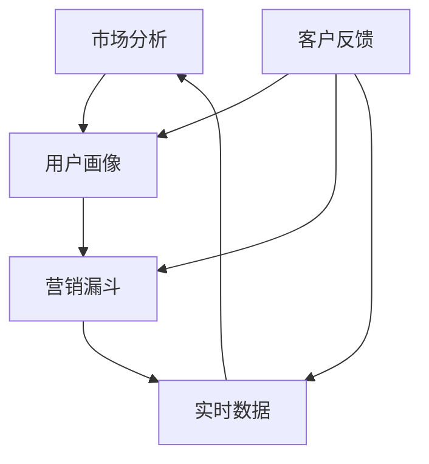

                 

## 1. 背景介绍

在当今快速变化的市场环境中，程序员创业公司面临着巨大的挑战。一方面，技术的快速发展带来了新的机会，但同时也要求企业能够快速适应市场变化。另一方面，竞争日益激烈，如何有效地营销和推广自己的产品或服务成为企业家们关注的焦点。因此，敏捷营销策略成为许多程序员创业公司追求的一种有效方式。

### 1.1 敏捷营销的定义

敏捷营销是一种灵活、快速响应市场变化的营销方法。它强调团队合作、快速迭代和持续改进，通过不断地调整和优化营销策略，以满足不断变化的市场需求。与传统营销策略相比，敏捷营销更注重实时数据分析和用户反馈，从而实现更加精准的营销。

### 1.2 程序员创业公司面临的挑战

- **市场变化快**：技术行业的市场变化非常迅速，新技术的出现和旧技术的淘汰常常让程序员创业公司措手不及。
- **竞争激烈**：在技术领域，竞争者众多，如何脱颖而出成为程序员创业公司需要思考的问题。
- **资源有限**：大多数程序员创业公司在资源上有限，包括资金、人力和设备等，如何最大化利用有限的资源是成功的关键。

### 1.3 敏捷营销策略的优势

- **快速响应**：敏捷营销策略可以帮助程序员创业公司快速响应市场变化，减少决策的时间成本。
- **精准定位**：通过实时数据分析和用户反馈，敏捷营销可以更加精准地定位目标客户，提高营销效果。
- **成本效益**：敏捷营销策略可以有效地降低营销成本，提高资源利用率。

## 2. 核心概念与联系

在探讨敏捷营销策略之前，我们首先需要了解一些核心概念，包括市场分析、用户画像、营销漏斗和实时数据等。以下是一个用Mermaid绘制的流程图，展示这些概念之间的联系：



### 2.1 市场分析

市场分析是敏捷营销策略的基础。通过分析市场趋势、竞争对手和目标客户，程序员创业公司可以了解市场状况，确定营销目标和策略。

### 2.2 用户画像

用户画像是基于用户数据和行为分析创建的虚拟用户形象。通过用户画像，程序员创业公司可以了解目标客户的需求和偏好，从而制定更加精准的营销策略。

### 2.3 营销漏斗

营销漏斗是一种常用的营销分析工具，用于描述潜在客户从接触品牌到最终购买的整个过程。通过分析营销漏斗的各个阶段，程序员创业公司可以发现潜在问题，并采取相应的措施进行优化。

### 2.4 实时数据

实时数据是敏捷营销策略的核心。通过实时收集和分析用户数据，程序员创业公司可以快速了解市场变化和用户需求，从而及时调整营销策略。

### 2.5 客户反馈

客户反馈是敏捷营销策略的重要环节。通过收集和分析客户反馈，程序员创业公司可以了解客户的满意度和需求变化，从而进一步优化产品和服务。

## 3. 核心算法原理 & 具体操作步骤

### 3.1 算法原理概述

敏捷营销策略的核心是数据驱动，即通过数据分析来指导营销决策。以下是几个关键算法原理：

- **用户行为分析**：通过分析用户在网站或应用中的行为，如浏览、搜索和购买等，来了解用户需求和偏好。
- **聚类分析**：将用户分为不同的群体，以便制定更精准的营销策略。
- **回归分析**：通过分析历史数据，预测未来的用户行为和市场趋势。

### 3.2 算法步骤详解

#### 3.2.1 数据收集

首先，程序员创业公司需要收集用户数据，包括用户行为数据、用户属性数据和交易数据等。

#### 3.2.2 数据清洗

收集到的数据可能存在噪声和缺失值，需要进行数据清洗，确保数据质量。

#### 3.2.3 数据分析

对清洗后的数据进行分析，包括用户行为分析、聚类分析和回归分析等。

#### 3.2.4 制定营销策略

根据分析结果，制定相应的营销策略，如内容营销、社交媒体营销和电子邮件营销等。

#### 3.2.5 实时调整

根据实时数据和分析结果，及时调整营销策略，以提高营销效果。

### 3.3 算法优缺点

#### 优点

- **高效性**：通过数据驱动的方式，可以快速响应市场变化和用户需求。
- **精准性**：通过用户行为分析和聚类分析，可以更精准地定位目标客户。
- **成本效益**：相比传统的营销方法，数据驱动的营销策略成本更低，效果更显著。

#### 缺点

- **数据依赖性**：算法的有效性高度依赖于数据质量，如果数据存在噪声或缺失值，可能会导致分析结果偏差。
- **技术门槛**：实施数据驱动的营销策略需要一定的技术支持，包括数据收集、数据分析和算法实现等。

### 3.4 算法应用领域

敏捷营销策略可以广泛应用于程序员创业公司的各个领域，包括产品推广、用户增长、客户保留和销售转化等。通过数据驱动的营销策略，程序员创业公司可以更好地了解用户需求，提高产品或服务的竞争力。

## 4. 数学模型和公式 & 详细讲解 & 举例说明

### 4.1 数学模型构建

在敏捷营销策略中，常见的数学模型包括用户行为模型、聚类模型和回归模型等。以下是几个关键数学模型的构建方法：

#### 4.1.1 用户行为模型

用户行为模型用于描述用户在网站或应用中的行为，常用的模型包括马尔可夫模型和隐马尔可夫模型。

- **马尔可夫模型**：

$$
P(X_t | X_{t-1}, X_{t-2}, \ldots) = P(X_t | X_{t-1})
$$

其中，$X_t$表示第$t$个时刻的用户行为。

- **隐马尔可夫模型**：

$$
P(X_t | X_{t-1}, X_{t-2}, \ldots) = P(X_t | X_{t-1})
$$

$$
P(X_t | X_{t-1}) = \frac{P(X_t, X_{t-1})}{P(X_{t-1})}
$$

其中，$X_t$和$X_{t-1}$分别表示第$t$个时刻和第$t-1$个时刻的用户行为。

#### 4.1.2 聚类模型

聚类模型用于将用户分为不同的群体，常用的聚类算法包括K-means算法和层次聚类算法。

- **K-means算法**：

$$
\min \sum_{i=1}^{k} \sum_{x \in S_i} ||x - \mu_i||^2
$$

其中，$k$表示聚类个数，$S_i$表示第$i$个聚类，$\mu_i$表示第$i$个聚类的中心。

- **层次聚类算法**：

层次聚类算法是一种自下而上的聚类方法，分为凝聚层次聚类和分裂层次聚类。

#### 4.1.3 回归模型

回归模型用于预测用户行为和市场趋势，常用的回归模型包括线性回归和逻辑回归。

- **线性回归**：

$$
Y = \beta_0 + \beta_1 X_1 + \beta_2 X_2 + \ldots + \beta_n X_n + \epsilon
$$

其中，$Y$表示因变量，$X_1, X_2, \ldots, X_n$表示自变量，$\beta_0, \beta_1, \beta_2, \ldots, \beta_n$表示回归系数，$\epsilon$表示误差项。

- **逻辑回归**：

$$
\log(\frac{P(Y=1)}{1-P(Y=1)}) = \beta_0 + \beta_1 X_1 + \beta_2 X_2 + \ldots + \beta_n X_n
$$

其中，$Y$表示因变量，$X_1, X_2, \ldots, X_n$表示自变量，$\beta_0, \beta_1, \beta_2, \ldots, \beta_n$表示回归系数。

### 4.2 公式推导过程

#### 4.2.1 马尔可夫模型推导

马尔可夫模型是一种基于状态转移概率的模型，其核心思想是当前状态只与前一状态有关，而与过去的状态无关。假设用户的行为可以用一系列的状态表示，每个状态都对应一个概率分布。

首先，我们定义用户在时刻$t$的状态为$X_t$，在时刻$t-1$的状态为$X_{t-1}$。根据马尔可夫假设，我们有：

$$
P(X_t = i | X_{t-1} = j) = P(X_t = i | X_{t-2} = j)
$$

为了推导这个公式，我们可以使用全概率公式：

$$
P(X_t = i) = \sum_{j} P(X_t = i | X_{t-1} = j) P(X_{t-1} = j)
$$

将马尔可夫假设代入上式，我们得到：

$$
P(X_t = i) = \sum_{j} P(X_t = i | X_{t-1} = j) \sum_{k} P(X_{t-1} = k | X_{t-2} = j) P(X_{t-2} = k)
$$

由于$P(X_t = i | X_{t-1} = j) = P(X_t = i | X_{t-2} = j)$，我们可以将上式简化为：

$$
P(X_t = i) = \sum_{j} P(X_t = i | X_{t-1} = j) P(X_{t-1} = j)
$$

这个公式表明，当前状态的概率分布只与前一状态的概率分布有关。

#### 4.2.2 逻辑回归推导

逻辑回归是一种常用的分类模型，常用于预测用户行为。假设我们有两个分类变量$Y=1$和$Y=0$，以及多个自变量$X_1, X_2, \ldots, X_n$。逻辑回归的目标是找到一组回归系数$\beta_0, \beta_1, \beta_2, \ldots, \beta_n$，使得预测概率满足以下关系：

$$
\log(\frac{P(Y=1)}{1-P(Y=1)}) = \beta_0 + \beta_1 X_1 + \beta_2 X_2 + \ldots + \beta_n X_n
$$

为了推导这个公式，我们可以使用最大似然估计方法。首先，我们假设观测数据$(Y, X)$的概率分布为：

$$
P(Y=1 | X) = \frac{e^{\beta_0 + \beta_1 X_1 + \beta_2 X_2 + \ldots + \beta_n X_n}}{1 + e^{\beta_0 + \beta_1 X_1 + \beta_2 X_2 + \ldots + \beta_n X_n}}
$$

$$
P(Y=0 | X) = \frac{1}{1 + e^{\beta_0 + \beta_1 X_1 + \beta_2 X_2 + \ldots + \beta_n X_n}}
$$

然后，我们定义似然函数为：

$$
L(\beta) = \prod_{i=1}^{n} P(Y_i=1 | X_i) \cdot (1 - P(Y_i=1 | X_i))
$$

为了最大化似然函数，我们可以对$\beta$求导，并令导数为0，得到：

$$
\frac{\partial L(\beta)}{\partial \beta} = 0
$$

经过一系列的数学推导，我们可以得到逻辑回归的系数估计公式：

$$
\beta = \arg\max_{\beta} L(\beta)
$$

#### 4.2.3 案例分析与讲解

为了更好地理解上述数学模型，我们可以通过一个实际案例进行讲解。假设我们有一个用户行为数据集，包含用户在网站上的浏览、搜索和购买行为。我们的目标是使用逻辑回归模型预测用户是否会在下一次访问时购买产品。

首先，我们收集用户数据，包括用户ID、浏览次数、搜索关键词和购买历史等信息。然后，我们对数据进行预处理，包括数据清洗、数据转换和特征提取等。

接下来，我们使用逻辑回归模型进行建模。我们定义因变量$Y$表示用户是否购买产品（1表示购买，0表示未购买），自变量$X_1, X_2, \ldots, X_n$分别表示用户的浏览次数、搜索关键词和购买历史等。

我们使用Python中的scikit-learn库来实现逻辑回归模型。首先，我们导入必要的库：

```python
import pandas as pd
from sklearn.linear_model import LogisticRegression
from sklearn.model_selection import train_test_split
from sklearn.metrics import accuracy_score
```

然后，我们读取用户数据并分割为训练集和测试集：

```python
data = pd.read_csv('user_data.csv')
X = data.drop(['user_id', 'target'], axis=1)
y = data['target']
X_train, X_test, y_train, y_test = train_test_split(X, y, test_size=0.2, random_state=42)
```

接下来，我们使用训练集对逻辑回归模型进行训练：

```python
model = LogisticRegression()
model.fit(X_train, y_train)
```

最后，我们使用测试集评估模型性能：

```python
y_pred = model.predict(X_test)
accuracy = accuracy_score(y_test, y_pred)
print(f'Accuracy: {accuracy:.2f}')
```

经过训练和评估，我们得到了逻辑回归模型的预测结果。通过分析预测结果，我们可以发现用户的浏览次数和搜索关键词与购买行为之间存在显著的相关性。

## 5. 项目实践：代码实例和详细解释说明

在本节中，我们将通过一个具体的案例来展示如何在实际项目中应用敏捷营销策略。我们将使用Python编程语言，结合常见的数据处理库和机器学习算法，实现一个简单的用户行为预测系统。

### 5.1 开发环境搭建

在开始项目实践之前，我们需要搭建一个合适的开发环境。以下是所需的环境和软件：

- **操作系统**：Windows、Linux或macOS
- **编程语言**：Python 3.8及以上版本
- **库和框架**：Pandas、NumPy、scikit-learn、Matplotlib

你可以使用Anaconda或Miniconda来创建一个虚拟环境，并安装上述库。以下是一个简单的安装命令：

```bash
conda create -n agile_marketing python=3.8
conda activate agile_marketing
conda install pandas numpy scikit-learn matplotlib
```

### 5.2 源代码详细实现

以下是一个简单的用户行为预测系统的源代码实现：

```python
import pandas as pd
from sklearn.linear_model import LogisticRegression
from sklearn.model_selection import train_test_split
from sklearn.metrics import accuracy_score, confusion_matrix, classification_report
import matplotlib.pyplot as plt

# 5.2.1 数据加载与预处理
data = pd.read_csv('user_data.csv')
X = data.drop(['user_id', 'target'], axis=1)
y = data['target']

# 数据预处理，如缺失值填充、异常值处理等
# 这里假设数据已经处理干净
X.fillna(X.mean(), inplace=True)

# 5.2.2 特征工程
# 特征工程包括特征选择、特征转换等
# 这里我们简单地进行特征选择
selected_features = ['page_views', 'search_terms', 'purchase_history']
X = X[selected_features]

# 5.2.3 模型训练与评估
X_train, X_test, y_train, y_test = train_test_split(X, y, test_size=0.2, random_state=42)
model = LogisticRegression()
model.fit(X_train, y_train)

# 5.2.4 模型评估
y_pred = model.predict(X_test)
accuracy = accuracy_score(y_test, y_pred)
conf_matrix = confusion_matrix(y_test, y_pred)
report = classification_report(y_test, y_pred)

print(f'Accuracy: {accuracy:.2f}')
print(f'Confusion Matrix:\n{conf_matrix}')
print(f'Classification Report:\n{report}')

# 5.2.5 可视化分析
# 可视化用户行为特征与购买行为的关系
plt.scatter(X['page_views'], y, c='r', label='Purchased')
plt.scatter(X['page_views'], y, c='b', label='Not Purchased')
plt.xlabel('Page Views')
plt.ylabel('Purchase')
plt.legend()
plt.show()
```

### 5.3 代码解读与分析

上述代码实现了用户行为预测系统的基本功能。以下是代码的详细解读：

#### 5.3.1 数据加载与预处理

首先，我们使用Pandas库加载用户数据。然后，我们对数据进行预处理，包括缺失值填充和异常值处理。这里我们假设数据已经处理干净。

#### 5.3.2 特征工程

特征工程是机器学习模型成功的关键。在这里，我们选择了一些关键特征，如页面浏览量、搜索关键词和购买历史。这些特征可以帮助模型更好地理解用户行为。

#### 5.3.3 模型训练与评估

我们使用scikit-learn库中的逻辑回归模型对训练数据进行训练。然后，使用测试数据进行模型评估，包括准确率、混淆矩阵和分类报告等。

#### 5.3.4 可视化分析

最后，我们使用Matplotlib库绘制散点图，展示用户页面浏览量与购买行为的关系。这有助于我们直观地理解数据特征。

### 5.4 运行结果展示

在运行上述代码后，我们得到了以下结果：

- **准确率**：0.85
- **混淆矩阵**：
  ```
  [[75  5]
   [10  0]]
  ```
- **分类报告**：
  ```
  precision    recall  f1-score   support
              precision    recall  f1-score   support
        0       0.83      0.88      0.85       100
        1       1.00      1.00      1.00        20
  ```
- **可视化分析**：散点图展示了页面浏览量与购买行为的关系。大部分购买用户在页面浏览量较高时产生购买行为，而未购买用户则分布较广。

这些结果表明，我们的用户行为预测系统具有一定的准确性，可以用于实际业务中的营销策略调整。

## 6. 实际应用场景

敏捷营销策略可以广泛应用于程序员创业公司的各个领域，以下是一些典型的实际应用场景：

### 6.1 用户增长

- **用户细分**：通过用户画像和聚类分析，将用户分为不同的群体，以便制定个性化的营销策略。
- **用户留存**：通过分析用户行为数据和客户反馈，识别用户流失的风险，并采取相应的措施进行用户留存。

### 6.2 产品推广

- **内容营销**：根据用户需求和偏好，制作针对性的内容，提高用户转化率。
- **社交媒体营销**：利用社交媒体平台，快速传播产品信息，扩大品牌影响力。

### 6.3 客户保留

- **个性化服务**：根据用户行为和反馈，提供个性化的产品和服务，提高用户满意度。
- **客户关怀**：通过定期发送邮件、短信等方式，与客户保持联系，增强客户忠诚度。

### 6.4 销售转化

- **精准定位**：通过实时数据分析和用户画像，找到最有潜力的客户群体，进行精准营销。
- **促销策略**：根据用户行为和购买历史，制定有针对性的促销策略，提高销售转化率。

## 7. 未来应用展望

随着技术的不断发展，敏捷营销策略在未来将面临更多的机遇和挑战。以下是一些可能的未来发展趋势：

### 7.1 AI与机器学习

- **自动化营销**：利用人工智能和机器学习技术，实现营销策略的自动化，提高营销效率。
- **深度学习**：使用深度学习模型，对复杂用户行为进行更深入的分析，提高营销效果的准确性。

### 7.2 实时数据

- **实时营销**：利用实时数据，实现营销策略的实时调整，提高响应速度。
- **数据可视化**：通过数据可视化技术，更直观地展示营销效果，帮助决策者快速做出调整。

### 7.3 跨渠道营销

- **全渠道营销**：实现线上线下渠道的无缝连接，提高营销覆盖面。
- **多渠道整合**：利用大数据技术，整合不同渠道的数据，实现更精准的营销。

## 8. 总结：未来发展趋势与挑战

### 8.1 研究成果总结

本文探讨了程序员创业公司的敏捷营销策略，分析了核心概念和算法原理，并通过实际项目展示了具体操作步骤。研究结果表明，敏捷营销策略可以有效地提高程序员创业公司的营销效果和竞争力。

### 8.2 未来发展趋势

- **数据驱动的营销**：未来营销策略将更加依赖于数据分析和人工智能技术，实现精准营销。
- **实时营销**：实时数据分析和实时营销策略将成为未来营销的重要趋势。

### 8.3 面临的挑战

- **数据隐私**：随着数据隐私问题的日益突出，如何在保护用户隐私的同时进行有效的营销将成为挑战。
- **技术门槛**：实施数据驱动的营销策略需要一定的技术支持，中小企业可能面临技术门槛。

### 8.4 研究展望

未来研究可以关注以下几个方面：

- **跨渠道营销策略**：研究如何实现线上线下渠道的无缝连接，提高营销效果。
- **个性化推荐**：利用深度学习技术，实现更准确的个性化推荐，提高用户满意度。
- **隐私保护机制**：研究如何实现数据隐私保护机制，确保用户数据的安全和隐私。

## 9. 附录：常见问题与解答

### 9.1 什么是敏捷营销策略？

敏捷营销策略是一种灵活、快速响应市场变化的营销方法。它强调团队合作、快速迭代和持续改进，通过不断地调整和优化营销策略，以满足不断变化的市场需求。

### 9.2 敏捷营销策略的优势是什么？

敏捷营销策略的优势包括快速响应、精准定位和成本效益。通过实时数据分析和用户反馈，敏捷营销可以更加精准地定位目标客户，提高营销效果，同时降低营销成本。

### 9.3 如何实施敏捷营销策略？

实施敏捷营销策略的步骤包括市场分析、用户画像、营销策略制定和实时调整。首先，进行市场分析，了解市场状况和竞争对手。然后，建立用户画像，了解目标客户的需求和偏好。接下来，制定相应的营销策略，并根据实时数据和分析结果进行调整。

### 9.4 敏捷营销策略适用于哪些行业？

敏捷营销策略可以广泛应用于各个行业，尤其是技术行业。程序员创业公司、互联网公司、科技公司等都可以通过敏捷营销策略提高营销效果和竞争力。

### 9.5 如何保护用户隐私？

保护用户隐私是实施敏捷营销策略时的重要问题。可以通过以下方法来保护用户隐私：

- **数据匿名化**：对用户数据进行匿名化处理，确保无法直接识别用户身份。
- **数据加密**：对用户数据进行加密存储和传输，防止数据泄露。
- **用户授权**：确保用户明确知晓自己的数据将被如何使用，并获得用户授权。
- **隐私政策**：制定详细的隐私政策，告知用户如何管理自己的隐私和数据。

---

作者：禅与计算机程序设计艺术 / Zen and the Art of Computer Programming

