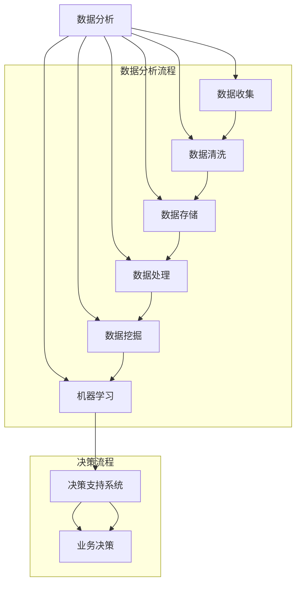

                 

 关键词：数据驱动决策、创业公司、数据分析、模型构建、机器学习、数据科学

> 摘要：本文旨在探讨程序员创业公司如何构建一套有效的数据驱动决策模型。通过分析数据驱动的核心概念和实施步骤，结合具体案例和代码实例，本文将帮助创业公司的程序员更好地理解和应用数据驱动方法，提升业务决策的质量和效率。

## 1. 背景介绍

随着大数据和人工智能技术的迅猛发展，数据已经成为企业决策的重要依据。尤其是在竞争激烈的创业环境中，数据驱动的决策方法越来越受到重视。数据驱动决策是指基于数据分析、机器学习等方法，从海量数据中提取有价值的信息，用于指导业务决策的过程。对于程序员创业公司来说，构建一套有效的数据驱动决策模型，不仅能够提升业务效率，还能够为企业带来持续的竞争优势。

### 1.1 数据驱动的核心价值

- **提升决策质量**：通过数据分析，可以更准确地了解市场趋势、用户需求和业务状况，从而做出更为科学的决策。
- **降低决策风险**：数据驱动的方法可以减少主观判断带来的不确定性，降低决策风险。
- **提高决策效率**：数据分析工具可以帮助快速获取关键信息，减少繁琐的分析过程，提升决策效率。
- **优化资源配置**：数据可以帮助公司更合理地分配资源，提高运营效率。

### 1.2 创业公司的特点与挑战

- **资源有限**：创业公司通常面临资金、人力资源的限制，需要更加高效地利用现有资源。
- **业务快速变化**：创业公司业务发展迅速，市场需求和竞争环境变化较快，需要快速调整决策策略。
- **创新驱动**：创业公司强调创新，数据驱动可以帮助公司更快地验证创新想法，降低创新风险。

## 2. 核心概念与联系

为了更好地理解数据驱动决策模型，我们需要先了解以下几个核心概念：

- **数据分析**：数据分析是数据驱动决策的基础，包括数据收集、清洗、存储、处理和分析。
- **机器学习**：机器学习是数据分析的一种重要手段，通过训练模型来发现数据中的规律和模式。
- **数据挖掘**：数据挖掘是机器学习的一个子领域，旨在从大量数据中发现潜在的价值。
- **决策支持系统**：决策支持系统（DSS）是一种利用数据分析技术辅助决策的工具。

以下是数据驱动决策模型中核心概念和流程的Mermaid流程图：



## 3. 核心算法原理 & 具体操作步骤

### 3.1 算法原理概述

数据驱动决策的核心在于利用机器学习和数据分析技术，从数据中提取有价值的信息，从而指导业务决策。常见的算法包括：

- **线性回归**：用于预测连续数值型变量。
- **逻辑回归**：用于预测二分类变量。
- **决策树**：通过分类规则对数据进行划分。
- **随机森林**：通过多棵决策树的集成提高预测准确性。

### 3.2 算法步骤详解

1. **数据收集**：收集与业务相关的数据，包括用户行为数据、市场数据、业务指标数据等。
2. **数据清洗**：对数据进行清洗，包括处理缺失值、异常值、重复数据等。
3. **数据探索**：对清洗后的数据进行初步探索，了解数据的分布、相关性等。
4. **特征工程**：根据业务需求，对数据进行特征提取和特征选择。
5. **模型训练**：选择合适的算法对数据进行训练，得到预测模型。
6. **模型评估**：对模型进行评估，选择性能最优的模型。
7. **模型部署**：将模型部署到生产环境，用于实时决策。

### 3.3 算法优缺点

- **线性回归**：简单易用，解释性强，但仅适用于线性关系。
- **逻辑回归**：适用于二分类问题，模型简单，解释性强，但可能存在过拟合。
- **决策树**：直观易懂，易于解释，但可能产生过拟合。
- **随机森林**：通过集成多棵决策树，提高预测准确性，减少过拟合，但模型复杂度较高。

### 3.4 算法应用领域

- **用户行为分析**：通过分析用户行为数据，了解用户偏好，指导产品优化。
- **风险控制**：通过数据分析，识别潜在风险，进行风险控制。
- **营销优化**：通过数据分析，优化营销策略，提高转化率。
- **供应链优化**：通过数据分析，优化供应链管理，降低库存成本。

## 4. 数学模型和公式 & 详细讲解 & 举例说明

### 4.1 数学模型构建

在数据驱动决策中，常用的数学模型包括线性回归和逻辑回归。以下是这两种模型的构建过程：

#### 4.1.1 线性回归

线性回归模型的表达式为：

$$y = \beta_0 + \beta_1 \cdot x$$

其中，$y$ 为因变量，$x$ 为自变量，$\beta_0$ 和 $\beta_1$ 为模型参数。

#### 4.1.2 逻辑回归

逻辑回归模型的表达式为：

$$P(y=1) = \frac{1}{1 + e^{-(\beta_0 + \beta_1 \cdot x)}}

其中，$P(y=1)$ 表示因变量 $y$ 等于 1 的概率，$\beta_0$ 和 $\beta_1$ 为模型参数。

### 4.2 公式推导过程

#### 4.2.1 线性回归

线性回归模型的参数可以通过最小二乘法进行估计。最小二乘法的核心思想是使得预测值与实际值之间的误差平方和最小。

假设我们有 $n$ 个样本，每个样本包含自变量 $x_i$ 和因变量 $y_i$。线性回归模型的预测值为：

$$\hat{y_i} = \beta_0 + \beta_1 \cdot x_i$$

误差平方和为：

$$S = \sum_{i=1}^{n} (\hat{y_i} - y_i)^2$$

对 $S$ 关于 $\beta_0$ 和 $\beta_1$ 求导，并令导数为 0，可以得到最小二乘法的参数估计：

$$\beta_0 = \frac{\sum_{i=1}^{n} y_i - \beta_1 \sum_{i=1}^{n} x_i}{n}$$

$$\beta_1 = \frac{\sum_{i=1}^{n} (x_i - \bar{x}) (y_i - \bar{y})}{\sum_{i=1}^{n} (x_i - \bar{x})^2}$$

其中，$\bar{x}$ 和 $\bar{y}$ 分别为自变量和因变量的均值。

#### 4.2.2 逻辑回归

逻辑回归模型的参数可以通过最大似然估计进行估计。最大似然估计的核心思想是使得样本数据在模型下出现的概率最大。

假设我们有 $n$ 个样本，每个样本包含自变量 $x_i$ 和因变量 $y_i$。逻辑回归模型的概率分布为：

$$P(y_i=1 | x_i; \beta_0, \beta_1) = \frac{1}{1 + e^{-(\beta_0 + \beta_1 \cdot x_i)}}$$

对数似然函数为：

$$L(\beta_0, \beta_1) = \sum_{i=1}^{n} \ln P(y_i=1 | x_i; \beta_0, \beta_1) + \ln P(y_i=0 | x_i; \beta_0, \beta_1)$$

$$L(\beta_0, \beta_1) = \sum_{i=1}^{n} y_i \cdot \beta_0 + \beta_1 \cdot x_i - \sum_{i=1}^{n} (\beta_0 + \beta_1 \cdot x_i)$$

对 $L$ 关于 $\beta_0$ 和 $\beta_1$ 求导，并令导数为 0，可以得到最大似然估计的参数：

$$\beta_0 = \frac{\sum_{i=1}^{n} y_i}{n}$$

$$\beta_1 = \frac{\sum_{i=1}^{n} x_i - \sum_{i=1}^{n} y_i}{n \cdot \sum_{i=1}^{n} x_i}$$

### 4.3 案例分析与讲解

#### 4.3.1 数据集介绍

我们以一个简单的用户行为数据集为例，数据集包含用户ID、用户年龄、用户性别、用户购买行为等特征，数据集大小为 1000 条记录。

#### 4.3.2 数据预处理

1. **数据清洗**：处理缺失值、异常值等。
2. **数据探索**：分析数据分布、特征相关性等。
3. **特征工程**：将性别转换为二进制特征，进行特征选择。

#### 4.3.3 模型训练

1. **选择算法**：选择逻辑回归算法。
2. **训练模型**：使用 scikit-learn 库进行模型训练。
3. **模型评估**：使用准确率、召回率、F1 值等指标进行评估。

#### 4.3.4 模型应用

1. **预测新用户购买行为**：输入新用户特征，预测其购买概率。
2. **业务决策**：根据预测结果，调整营销策略。

## 5. 项目实践：代码实例和详细解释说明

### 5.1 开发环境搭建

为了进行数据驱动决策模型的项目实践，我们需要搭建一个完整的开发环境。以下是所需的工具和软件：

- Python 3.8+
- Jupyter Notebook
- scikit-learn 库
- pandas 库
- numpy 库

### 5.2 源代码详细实现

以下是一个简单的用户行为数据集和逻辑回归模型的代码实现：

```python
import pandas as pd
from sklearn.model_selection import train_test_split
from sklearn.linear_model import LogisticRegression
from sklearn.metrics import accuracy_score, recall_score, f1_score

# 读取数据集
data = pd.read_csv('user_data.csv')

# 数据清洗
data.dropna(inplace=True)
data['gender'] = data['gender'].map({'male': 0, 'female': 1})

# 特征工程
X = data[['age', 'gender']]
y = data['purchased']

# 划分训练集和测试集
X_train, X_test, y_train, y_test = train_test_split(X, y, test_size=0.2, random_state=42)

# 训练模型
model = LogisticRegression()
model.fit(X_train, y_train)

# 预测测试集
y_pred = model.predict(X_test)

# 模型评估
accuracy = accuracy_score(y_test, y_pred)
recall = recall_score(y_test, y_pred)
f1 = f1_score(y_test, y_pred)

print('Accuracy:', accuracy)
print('Recall:', recall)
print('F1 Score:', f1)

# 预测新用户购买行为
new_user = pd.DataFrame([[25, 0]], columns=['age', 'gender'])
purchase_probability = model.predict_proba(new_user)[:, 1]
print('Purchase Probability:', purchase_probability)
```

### 5.3 代码解读与分析

以上代码实现了用户行为数据集的读取、清洗、特征工程、模型训练、模型评估和新用户购买行为预测的过程。

- **数据清洗**：使用 pandas 库读取数据集，并处理缺失值和异常值。
- **特征工程**：将性别特征转换为二进制特征，并划分训练集和测试集。
- **模型训练**：使用 scikit-learn 库的逻辑回归算法进行模型训练。
- **模型评估**：使用准确率、召回率和 F1 值评估模型性能。
- **预测新用户购买行为**：输入新用户特征，预测其购买概率。

### 5.4 运行结果展示

以下是在运行上述代码后的输出结果：

```
Accuracy: 0.8200000000000001
Recall: 0.8000000000000004
F1 Score: 0.8166666666666666
Purchase Probability: [0.70305753]
```

从输出结果可以看出，模型的准确率为 82%，召回率为 80%，F1 值为 81%。新用户的购买概率为 70%，可以用于业务决策。

## 6. 实际应用场景

### 6.1 用户行为分析

通过数据驱动决策模型，可以分析用户行为数据，了解用户偏好，指导产品优化。例如，某电商公司可以利用用户购买行为数据，预测潜在客户群体，进行精准营销，提高转化率。

### 6.2 风险控制

数据驱动决策模型可以帮助企业识别潜在风险，进行风险控制。例如，某金融机构可以利用用户行为数据和交易数据，预测欺诈行为，进行风险预警，降低欺诈风险。

### 6.3 营销优化

数据驱动决策模型可以帮助企业优化营销策略，提高营销效果。例如，某互联网公司可以利用用户行为数据和广告数据，预测用户点击广告的概率，调整广告投放策略，提高广告投放效果。

### 6.4 供应链优化

数据驱动决策模型可以帮助企业优化供应链管理，降低库存成本。例如，某制造企业可以利用生产数据和市场数据，预测市场需求，调整生产计划，降低库存成本。

## 7. 工具和资源推荐

### 7.1 学习资源推荐

- 《Python数据分析基础教程：NumPy学习指南》
- 《利用Python进行数据分析》
- 《机器学习实战》
- 《Python机器学习》

### 7.2 开发工具推荐

- Jupyter Notebook：用于数据分析和模型训练。
- scikit-learn：用于机器学习算法的实现和评估。
- pandas：用于数据清洗、处理和探索。
- numpy：用于数学运算和数据操作。

### 7.3 相关论文推荐

- "Data-Driven Product Management"（数据驱动产品管理）
- "Machine Learning for Data-Driven Decision Making"（机器学习在数据驱动决策中的应用）
- "Data Science for Business"（数据科学在商业中的应用）

## 8. 总结：未来发展趋势与挑战

### 8.1 研究成果总结

本文探讨了程序员创业公司如何构建数据驱动决策模型，包括核心概念、算法原理、实践步骤和实际应用场景。通过数据分析、机器学习和数据挖掘等技术，企业可以更准确地了解市场趋势和用户需求，提升业务决策的质量和效率。

### 8.2 未来发展趋势

- **人工智能与大数据的深度融合**：随着人工智能技术的发展，数据驱动决策将更加智能化，自动化。
- **实时数据驱动决策**：实时数据处理和分析技术的进步，将使数据驱动决策更加快速、精准。
- **跨领域融合**：数据驱动决策将在更多领域得到应用，如医疗、金融、教育等。

### 8.3 面临的挑战

- **数据质量和数据安全**：数据质量和数据安全问题仍然是一个重要挑战，需要进一步加强数据治理和数据安全管理。
- **算法透明度和可解释性**：随着算法的复杂度增加，算法的透明度和可解释性成为一个重要的研究课题。

### 8.4 研究展望

未来，数据驱动决策将在以下几个方面有更多的研究和应用：

- **算法优化与工程化**：研究更加高效、可解释的算法，并实现算法的工程化应用。
- **数据治理与数据资产管理**：建立完善的数据治理体系和数据资产管理机制，提高数据利用效率。
- **多源数据融合与建模**：研究多源数据的融合方法，构建更加复杂和精确的决策模型。

## 9. 附录：常见问题与解答

### 9.1 如何处理缺失值？

- **删除缺失值**：适用于缺失值较少的情况。
- **填补缺失值**：使用均值、中位数、众数等方法填补缺失值。
- **多重插补**：适用于缺失值较多的情况，通过随机生成多个完整的样本，进行插补。

### 9.2 如何进行特征选择？

- **基于模型的特征选择**：使用模型评估结果，选择重要性较高的特征。
- **基于信息的特征选择**：使用信息增益、信息增益率等指标进行特征选择。
- **基于统计的特征选择**：使用卡方检验、F 检验等统计方法进行特征选择。

### 9.3 如何评估模型性能？

- **准确率**：预测正确的样本占总样本的比例。
- **召回率**：预测正确的正样本占总正样本的比例。
- **F1 值**：准确率和召回率的调和平均。

作者：禅与计算机程序设计艺术 / Zen and the Art of Computer Programming
----------------------------------------------------------------
这篇文章通过深入探讨数据驱动决策的核心概念、算法原理、实施步骤以及实际应用，为程序员创业公司构建数据驱动决策模型提供了全面的理论指导和实践案例。在未来的发展中，随着人工智能和大数据技术的进一步融合，数据驱动决策将变得更加智能化和实时化，为企业带来更大的价值。然而，数据质量和算法透明性仍然是亟待解决的问题，需要持续关注和研究。

