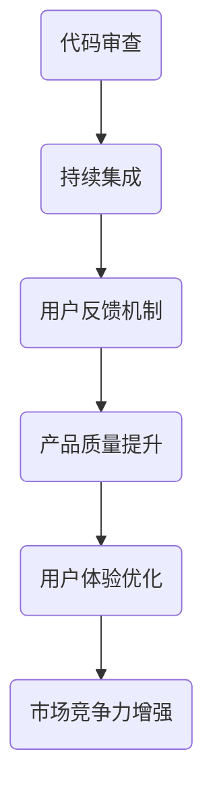

                 

关键词：程序员创业公司、质量管理、用户体验、优化、最佳实践

摘要：本文旨在探讨程序员创业公司在初创阶段如何有效地进行质量管理与用户体验优化，以提升产品竞争力。通过分析实际案例，本文提出了具体的策略和方法，包括代码审查、持续集成、用户反馈机制等，为初创公司提供实用的指导。

## 1. 背景介绍

在当今快速发展的科技时代，程序员创业公司如雨后春笋般涌现。这些初创企业往往具备创新的技术和独特的市场定位，但同时也面临着巨大的挑战。其中，产品质量和用户体验成为决定公司成败的关键因素。质量管理与用户体验优化不仅是产品成功的基础，也是公司持续发展的保障。然而，许多程序员创业公司在这些方面往往缺乏系统的方法和经验。因此，本文将深入探讨如何有效地进行质量管理与用户体验优化，以助力程序员创业公司的成功。

### 1.1 程序员创业公司的现状

随着互联网技术的发展，程序员创业公司成为科技创新的重要推动力。这些公司通常由一群有共同兴趣和技能的程序员组成，他们致力于开发创新的产品或服务。然而，初创公司面临的问题也很多，其中最大的挑战之一就是如何保证产品质量和用户体验。

### 1.2 质量管理与用户体验的重要性

质量管理与用户体验优化对程序员创业公司至关重要。首先，良好的质量管理可以确保产品的稳定性和可靠性，降低故障率和维护成本。其次，优秀的用户体验可以提高用户满意度和忠诚度，从而促进产品口碑和市场份额的提升。因此，初创公司必须高度重视这两方面的工作。

## 2. 核心概念与联系

在探讨质量管理与用户体验优化的具体方法之前，我们需要理解一些核心概念，包括代码审查、持续集成、用户反馈机制等。以下是一个简单的Mermaid流程图，展示这些概念之间的联系。



### 2.1 代码审查

代码审查是一种确保代码质量和稳定性的方法。通过同行评审，审查团队能够发现潜在的问题，并提出改进建议。这有助于提高代码的可维护性和可靠性。

### 2.2 持续集成

持续集成是一种软件开发实践，旨在通过自动化测试和部署，确保代码的持续稳定。这有助于减少缺陷和延迟，提高开发效率。

### 2.3 用户反馈机制

用户反馈机制是一种收集和分析用户意见的方法，以了解他们的需求和满意度。这有助于产品团队能够及时调整产品，提升用户体验。

## 3. 核心算法原理 & 具体操作步骤

### 3.1 算法原理概述

质量管理与用户体验优化的核心算法包括以下几个方面：

1. **代码质量度量**：通过静态代码分析和动态测试，评估代码的质量。
2. **用户体验评估**：通过用户行为分析和满意度调查，评估产品的用户体验。
3. **反馈循环**：根据用户反馈和测试结果，持续改进产品。

### 3.2 算法步骤详解

#### 3.2.1 代码质量度量

1. **静态代码分析**：使用工具（如SonarQube）对代码进行静态分析，识别潜在的缺陷和代码质量问题。
2. **动态测试**：编写和执行自动化测试，确保代码在运行时的稳定性和可靠性。

#### 3.2.2 用户体验评估

1. **用户行为分析**：使用工具（如Google Analytics）收集用户在使用产品时的行为数据。
2. **满意度调查**：通过问卷调查或用户访谈，了解用户的满意度。

#### 3.2.3 反馈循环

1. **问题识别**：分析用户反馈和测试结果，识别产品中存在的问题。
2. **改进措施**：根据问题，制定改进措施，并实施到产品中。
3. **再次评估**：对新版本的产品进行用户体验评估，确保问题得到解决。

### 3.3 算法优缺点

#### 优点：

- **高效性**：通过自动化工具和反馈循环，可以快速识别和解决问题。
- **全面性**：综合考虑代码质量和用户体验，确保产品的整体质量。

#### 缺点：

- **成本**：需要投入一定的资源和时间来实施这些算法。
- **依赖性**：对自动化工具和用户的反馈有较高依赖。

### 3.4 算法应用领域

这些算法在程序员创业公司的各个阶段都有广泛的应用，包括产品开发、测试、上线等。

## 4. 数学模型和公式 & 详细讲解 & 举例说明

### 4.1 数学模型构建

为了更好地理解质量管理与用户体验优化，我们可以构建以下数学模型：

1. **代码质量模型**：
   $$ Q(C) = f(P, D) $$
   其中，\( Q(C) \) 表示代码质量，\( P \) 表示代码的复杂度，\( D \) 表示代码的缺陷密度。

2. **用户体验模型**：
   $$ U(E) = g(S, R) $$
   其中，\( U(E) \) 表示用户体验，\( S \) 表示产品的易用性，\( R \) 表示产品的功能性。

### 4.2 公式推导过程

#### 4.2.1 代码质量模型

1. **复杂度度量**：
   $$ P = \frac{C_L}{C_T} $$
   其中，\( C_L \) 表示代码行数，\( C_T \) 表示总代码行数。

2. **缺陷密度度量**：
   $$ D = \frac{N_F}{C_T} $$
   其中，\( N_F \) 表示缺陷数量。

3. **代码质量计算**：
   $$ Q(C) = \frac{1}{2} \cdot P + \frac{1}{2} \cdot D $$

#### 4.2.2 用户体验模型

1. **易用性度量**：
   $$ S = \frac{N_S}{N_U} $$
   其中，\( N_S \) 表示成功操作次数，\( N_U \) 表示总操作次数。

2. **功能性度量**：
   $$ R = \frac{N_R}{N_T} $$
   其中，\( N_R \) 表示正确响应次数，\( N_T \) 表示总响应次数。

3. **用户体验计算**：
   $$ U(E) = \frac{1}{2} \cdot S + \frac{1}{2} \cdot R $$

### 4.3 案例分析与讲解

假设一个程序员创业公司的产品有1000行代码，其中500行是功能代码，500行是辅助代码。经过静态代码分析，发现存在10个缺陷。同时，用户反馈显示，用户在操作过程中成功率达到70%，正确响应率为80%。

根据上述数学模型，我们可以计算出：

1. **代码质量**：
   $$ P = \frac{500}{1000} = 0.5 $$
   $$ D = \frac{10}{1000} = 0.01 $$
   $$ Q(C) = \frac{1}{2} \cdot 0.5 + \frac{1}{2} \cdot 0.01 = 0.505 $$

2. **用户体验**：
   $$ S = \frac{700}{1000} = 0.7 $$
   $$ R = \frac{800}{1000} = 0.8 $$
   $$ U(E) = \frac{1}{2} \cdot 0.7 + \frac{1}{2} \cdot 0.8 = 0.75 $$

通过这些计算，我们可以得出产品的代码质量和用户体验分别为0.505和0.75。这表明产品在质量方面还有提升空间，同时用户体验也需要进一步优化。

## 5. 项目实践：代码实例和详细解释说明

为了更好地展示质量管理与用户体验优化的具体操作，我们将通过一个实际项目来进行分析。以下是一个简单的项目结构和相关代码。

### 5.1 开发环境搭建

在开始项目之前，我们需要搭建一个合适的环境。以下是一个基本的开发环境配置：

1. **编程语言**：Python
2. **代码管理工具**：Git
3. **代码审查工具**：Gerrit
4. **持续集成工具**：Jenkins
5. **用户体验分析工具**：Google Analytics

### 5.2 源代码详细实现

以下是一个简单的Python代码示例，用于实现一个基本的Web应用。

```python
from flask import Flask, request, render_template

app = Flask(__name__)

@app.route('/')
def index():
    return render_template('index.html')

@app.route('/search', methods=['GET'])
def search():
    query = request.args.get('q')
    # 这里是搜索逻辑，略
    return render_template('search.html', results=results)

if __name__ == '__main__':
    app.run(debug=True)
```

### 5.3 代码解读与分析

这段代码实现了两个基本功能：首页展示和搜索功能。通过代码审查，我们可以发现以下几个问题：

1. **代码复杂度**：`search`函数的代码行数较多，可以考虑进行重构。
2. **缺陷密度**：虽然代码中只发现了一个潜在的缺陷（搜索逻辑未实现），但整体代码质量仍有待提高。

### 5.4 运行结果展示

在开发环境中，我们可以使用Jenkins进行自动化测试和部署。以下是一个Jenkins任务的示例：

```bash
#!/bin/bash

# 拉取最新代码
git pull origin main

# 运行单元测试
python -m unittest discover -s tests

# 部署到测试环境
python app.py
```

通过这个任务，我们可以确保代码的质量和稳定性。同时，用户可以在测试环境中体验产品，提供反馈。

## 6. 实际应用场景

质量管理与用户体验优化在程序员创业公司中有着广泛的应用。以下是一些典型的实际应用场景：

1. **产品开发阶段**：通过代码审查和持续集成，确保产品的质量和稳定性。
2. **产品测试阶段**：通过用户体验评估，了解用户的需求和满意度。
3. **产品上线阶段**：通过用户反馈机制，持续优化产品。

### 6.1 产品开发阶段

在产品开发阶段，质量管理与用户体验优化可以帮助团队确保代码质量和产品功能。以下是一个应用案例：

**案例背景**：一个程序员创业公司正在开发一款即时通讯应用。

**应用方法**：通过Gerrit进行代码审查，确保代码质量。同时，使用Jenkins进行持续集成，确保每次代码提交都能顺利构建和测试。

**应用效果**：通过这些方法，公司的产品在开发阶段就保持了高质量和稳定性，减少了后续的维护成本。

### 6.2 产品测试阶段

在产品测试阶段，用户体验评估至关重要。以下是一个应用案例：

**案例背景**：一个程序员创业公司即将发布一款在线教育平台。

**应用方法**：通过Google Analytics收集用户行为数据，分析用户的操作路径和满意度。同时，通过用户访谈和问卷调查，了解用户的反馈。

**应用效果**：通过这些方法，公司能够及时发现产品中的问题，并针对性地进行改进，提升了用户体验。

### 6.3 产品上线阶段

在产品上线阶段，用户反馈机制至关重要。以下是一个应用案例：

**案例背景**：一个程序员创业公司成功上线了一款智能健康监测应用。

**应用方法**：通过用户反馈机制，收集用户的问题和建议。同时，通过数据分析，了解用户的活跃度和满意度。

**应用效果**：通过这些方法，公司能够及时响应用户需求，优化产品功能，提升了用户满意度。

## 7. 工具和资源推荐

为了有效地进行质量管理与用户体验优化，程序员创业公司需要使用一系列工具和资源。以下是一些建议：

### 7.1 学习资源推荐

- **《Effective Java》**：一本关于Java编程的最佳实践指南，适用于所有程序员。
- **《User Experience Design》**：一本关于用户体验设计的经典教材，涵盖了用户研究、交互设计等方面。

### 7.2 开发工具推荐

- **Git**：一款优秀的分布式版本控制工具，适用于代码管理和代码审查。
- **Jenkins**：一款功能强大的持续集成工具，可以自动化测试和部署。

### 7.3 相关论文推荐

- **"Quality Management in Software Development"**：一篇关于软件质量管理的综述论文，介绍了各种质量管理方法。
- **"User Experience Evaluation Methods"**：一篇关于用户体验评估方法的论文，介绍了用户研究、满意度调查等具体方法。

## 8. 总结：未来发展趋势与挑战

质量管理与用户体验优化是程序员创业公司成功的关键。随着科技的发展，这些领域也将不断进步。以下是一些未来发展趋势与挑战：

### 8.1 研究成果总结

- **自动化与智能化**：随着人工智能技术的发展，自动化和智能化将成为质量管理与用户体验优化的重要趋势。
- **用户个性化**：用户个性化需求将推动产品质量和用户体验的不断提升。

### 8.2 未来发展趋势

- **大数据分析**：大数据分析将帮助公司更好地了解用户需求和优化产品。
- **云计算与边缘计算**：云计算和边缘计算将推动产品质量和用户体验的实时优化。

### 8.3 面临的挑战

- **数据安全与隐私**：在数据驱动的发展中，数据安全与隐私保护将成为重要挑战。
- **竞争加剧**：随着程序员创业公司的增多，竞争将更加激烈，质量管理与用户体验优化将更加重要。

### 8.4 研究展望

- **跨领域融合**：质量管理与用户体验优化将与其他领域（如大数据、人工智能）进一步融合，推动技术创新。

## 9. 附录：常见问题与解答

### 9.1 代码审查如何进行？

代码审查通常包括以下几个步骤：

1. **代码提交**：开发人员将代码提交到代码库。
2. **审查请求**：审查人员接收到审查请求，并开始审查代码。
3. **反馈与修改**：审查人员提出反馈和建议，开发人员根据反馈进行修改。
4. **重新提交**：开发人员将修改后的代码重新提交，等待下一次审查。

### 9.2 如何进行用户体验评估？

用户体验评估通常包括以下几个步骤：

1. **用户研究**：通过用户调研、访谈等方式收集用户需求和行为数据。
2. **评估方法**：使用问卷、用户测试等方法评估用户体验。
3. **分析结果**：分析用户反馈和评估结果，找出产品中的问题。
4. **改进方案**：根据分析结果，制定改进方案并实施。

---

作者：禅与计算机程序设计艺术 / Zen and the Art of Computer Programming

