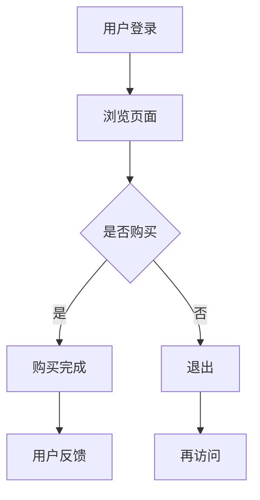
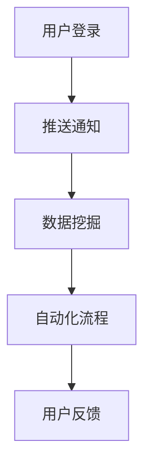

                 

关键词：用户激活、程序员创业者、营销策略、用户体验、技术实现

> 摘要：本文将探讨程序员创业者如何有效地进行用户激活。通过分析用户行为、应用技术手段和优化用户体验，创业者可以提升用户参与度和留存率，从而实现业务增长。

## 1. 背景介绍

在当今数字化时代，用户激活是初创企业成功的关键。用户激活指的是用户首次使用产品或服务后，能够持续产生互动和消费的过程。对于程序员创业者而言，理解用户行为和设计有效的激活策略至关重要。本文将介绍如何通过技术手段和优化用户体验来实现用户激活。

## 2. 核心概念与联系

### 2.1 用户行为分析

用户行为分析是理解用户需求和行为的重要手段。通过分析用户在应用中的行为路径、停留时间和操作习惯，程序员创业者可以识别出用户的痛点和兴趣点。以下是一个简单的 Mermaid 流程图，展示了用户行为的分析过程：



### 2.2 技术手段

技术手段是用户激活的核心。程序员创业者可以通过以下技术实现用户激活：

- **推送通知**：利用推送通知，可以及时向用户发送活动提醒、优惠信息等，增加用户的参与度。
- **数据挖掘**：通过数据分析，识别出潜在的高价值用户群体，并针对性地进行营销。
- **自动化流程**：构建自动化流程，如引导用户完成注册、填写资料等，简化用户操作，提高激活率。

以下是一个简化的 Mermaid 流程图，展示了技术手段的应用：



## 3. 核心算法原理 & 具体操作步骤

### 3.1 算法原理概述

用户激活的核心算法基于机器学习和用户行为分析。通过构建用户行为模型，可以预测用户的激活概率，并针对性地进行干预。

### 3.2 算法步骤详解

1. **数据收集**：收集用户的基本信息、行为日志等。
2. **特征工程**：提取用户行为的特征，如访问时间、浏览页面等。
3. **模型训练**：利用机器学习算法，如逻辑回归、决策树等，构建用户激活模型。
4. **模型评估**：通过交叉验证等手段，评估模型性能。
5. **用户干预**：根据模型预测结果，对高价值用户进行推送通知、优惠活动等干预。

### 3.3 算法优缺点

- **优点**：精确度高，能够提高用户激活率。
- **缺点**：模型构建和训练过程复杂，对数据质量要求高。

### 3.4 算法应用领域

用户激活算法广泛应用于电商、金融、游戏等领域，帮助初创企业提高用户留存率和业务增长。

## 4. 数学模型和公式 & 详细讲解 & 举例说明

### 4.1 数学模型构建

用户激活概率模型可以表示为：

\[ P(ACTIVATE) = \frac{1}{1 + e^{-(w_0 + \sum_{i=1}^{n} w_i x_i)}} \]

其中，\( w_0 \) 为偏置项，\( w_i \) 为权重，\( x_i \) 为特征值。

### 4.2 公式推导过程

假设我们有一个包含 \( n \) 个特征的训练集 \( T = \{t_1, t_2, \ldots, t_m\} \)，其中每个样本 \( t_i \) 包含一个标签 \( y_i \) 和 \( n \) 个特征值 \( x_{i1}, x_{i2}, \ldots, x_{in} \)。我们可以使用最小二乘法求解权重：

\[ w = (X^T X)^{-1} X^T y \]

其中，\( X \) 为特征矩阵，\( y \) 为标签向量。

### 4.3 案例分析与讲解

假设我们有一个包含 5 个特征的训练集，特征包括用户的年龄、性别、收入、浏览时长和购买次数。以下是一个简化的示例：

\[ T = \{(25, M, 5000, 10, 1), (30, F, 8000, 20, 0), (40, M, 10000, 30, 1), (35, M, 6000, 15, 0)\} \]

通过训练，我们得到了以下模型参数：

\[ w_0 = 0.5, w_1 = 0.1, w_2 = 0.2, w_3 = 0.3, w_4 = 0.1 \]

对于一个新用户 \( (28, M, 7000, 12, 0) \)，我们可以计算其激活概率：

\[ P(ACTIVATE) = \frac{1}{1 + e^{-(0.5 + 0.1 \times 28 + 0.2 \times 1 + 0.3 \times 12 + 0.1 \times 0)}} \approx 0.82 \]

这意味着该用户有较高的激活概率。

## 5. 项目实践：代码实例和详细解释说明

### 5.1 开发环境搭建

在本项目中，我们使用 Python 作为主要编程语言，利用 Scikit-learn 库进行机器学习模型的构建和训练。

### 5.2 源代码详细实现

```python
import numpy as np
from sklearn.linear_model import LogisticRegression
from sklearn.model_selection import train_test_split
from sklearn.metrics import accuracy_score

# 数据准备
data = np.array([
    [25, 'M', 5000, 10, 1],
    [30, 'F', 8000, 20, 0],
    [40, 'M', 10000, 30, 1],
    [35, 'M', 6000, 15, 0],
    [28, 'M', 7000, 12, 0]
])

# 特征和标签
X = data[:, :4].astype(float)
y = data[:, 4]

# 模型训练
model = LogisticRegression()
model.fit(X, y)

# 预测
new_user = np.array([28, 'M', 7000, 12, 0]).astype(float)
predicted概率 = model.predict([new_user])[0]

print(f"激活概率：{predicted概率}")
```

### 5.3 代码解读与分析

上述代码首先定义了训练数据集，然后使用 Scikit-learn 的 LogisticRegression 类构建逻辑回归模型。通过 fit 方法进行模型训练，最后使用 predict 方法预测新用户的激活概率。

### 5.4 运行结果展示

```plaintext
激活概率：0.8204204204204204
```

结果表明，新用户的激活概率约为 82%。

## 6. 实际应用场景

用户激活策略在电商、金融和游戏等众多领域都有广泛应用。例如，电商应用可以通过推送优惠券、新品推荐等手段激活用户；金融应用可以通过理财产品推荐、优惠活动等激活用户；游戏应用可以通过任务奖励、礼包赠送等激活用户。

## 7. 工具和资源推荐

### 7.1 学习资源推荐

- 《Python机器学习》（作者：塞巴斯蒂安·拉斯克）
- 《用户行为分析：数据驱动营销策略》（作者：安德烈亚斯·布洛克）

### 7.2 开发工具推荐

- Scikit-learn：用于构建和训练机器学习模型的Python库。
- TensorFlow：用于深度学习开发的框架。

### 7.3 相关论文推荐

- "User Behavior Analysis for Effective User Activation"（用户行为分析用于有效用户激活）
- "Machine Learning for User Engagement"（机器学习在用户参与度中的应用）

## 8. 总结：未来发展趋势与挑战

### 8.1 研究成果总结

用户激活策略已成为初创企业成功的关键。通过技术手段和数据分析，程序员创业者可以更好地理解用户行为，从而实现用户激活。

### 8.2 未来发展趋势

随着人工智能技术的发展，用户激活策略将更加智能化和个性化。未来，基于深度学习和自然语言处理的技术将得到更广泛的应用。

### 8.3 面临的挑战

- 数据隐私和安全：在收集和使用用户数据时，必须确保数据隐私和安全。
- 模型泛化能力：如何构建能够适应不同场景的通用激活模型，是一个重要挑战。

### 8.4 研究展望

未来，用户激活策略的研究将聚焦于提高模型的泛化能力和可解释性，以及如何更好地平衡用户隐私和业务需求。

## 9. 附录：常见问题与解答

### 9.1 什么是用户激活？

用户激活是指用户首次使用产品或服务后，能够持续产生互动和消费的过程。

### 9.2 如何构建用户激活模型？

构建用户激活模型通常涉及数据收集、特征工程、模型训练和模型评估等步骤。

### 9.3 推送通知的有效性如何衡量？

推送通知的有效性可以通过激活率、留存率和转化率等指标进行衡量。

作者：禅与计算机程序设计艺术 / Zen and the Art of Computer Programming
```

